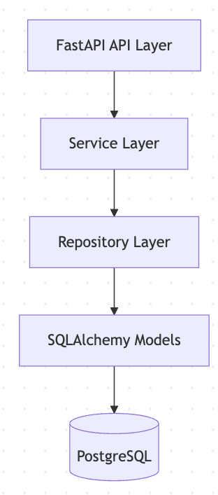
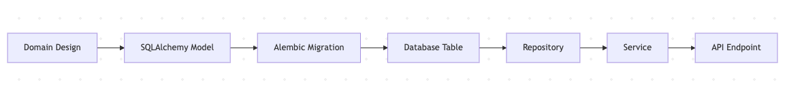

# AGRIFLOW-AI

## Overview

AGRIFLOW-AI is an AI-powered Agricultural Decision Intelligence Platform designed to support farm management, field analytics, crop planning, and future yield prediction capabilities.

Phase 1 focused on establishing a production-grade backend foundation using FastAPI, PostgreSQL, SQLAlchemy, Alembic, Docker, and Clean Architecture principles.

---

## Business Vision

AGRIFLOW-AI aims to become a platform that helps:

- Farm owners
- Agricultural consultants
- Agronomists
- Agricultural enterprises

make data-driven decisions using AI and analytics.

Future capabilities include:

- Farm Management
- Field Management
- Crop Management
- Sensor Data Integration
- Weather Integration
- Yield Prediction
- Disease Prediction
- Agricultural Intelligence Dashboards

---

## Phase 1 Deliverables

Completed:

- FastAPI foundation
- PostgreSQL integration
- SQLAlchemy ORM setup
- Alembic migration framework
- Health APIs
- Version API
- Farm domain model
- Farm database table
- Docker foundation
- Logging and configuration management

---

## Current Architecture

---

## Farm Domain

Current Farm Entity:

- id
- farm_code
- farm_name
- owner_name
- country
- state
- city
- latitude
- longitude
- total_area_hectares
- is_active
- created_at
- updated_at

---

## Development Workflow

---

## Roadmap

Phase 2:
- Field Domain

Phase 3:
- Crop Domain

Phase 4:
- Sensor Integration

Phase 5:
- Data Collection Pipeline

Phase 6:
- AI Data Preparation

Phase 7+:
- Yield Prediction
- Disease Prediction
- Agricultural Intelligence
