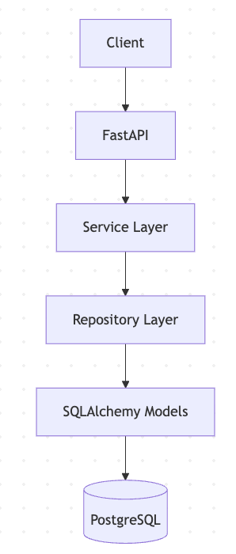
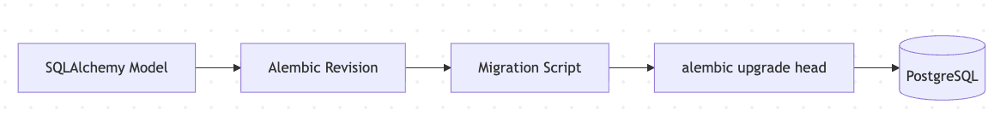
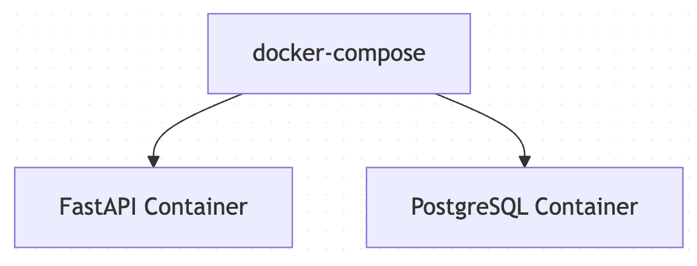

# AGRIFLOW-AI Technical Design Document

## Phase 1 Technical Architecture

### Technology Stack

| Layer | Technology |
|---------|------------|
| Backend API | FastAPI |
| Language | Python 3.12 |
| ORM | SQLAlchemy |
| Migration | Alembic |
| Database | PostgreSQL |
| Containerization | Docker |
| Architecture | Clean Architecture |
| Version Control | Git + GitHub |
| IDE | Cursor |

---

## Backend Structure

```text
backend/
├── app/
│   ├── api/
│   ├── core/
│   ├── db/
│   ├── schemas/
│   ├── services/
│   └── main.py
├── alembic.ini
├── requirements.txt
├── Dockerfile
└── .dockerignore
```

---

## High-Level Architecture



---

## Database Migration Flow



---

## Current Database Objects

### Tables

1. alembic_version
2. farms

### Farm Table Columns

- id
- farm_code
- farm_name
- owner_name
- country
- state
- city
- latitude
- longitude
- total_area_hectares
- is_active
- created_at
- updated_at

---

## Docker Architecture



---

## Design Principles

- SOLID Principles
- Clean Architecture
- Repository Pattern
- Service Layer Pattern
- Separation of Concerns
- Migration-Driven Database Changes
- Environment-Based Configuration

---

## Phase 1 Status

Completed:
- Backend Foundation
- Database Foundation
- Migration Framework
- Farm Domain Foundation
- Docker Foundation

Deferred:
- Frontend Implementation
- Docker Runtime Validation
