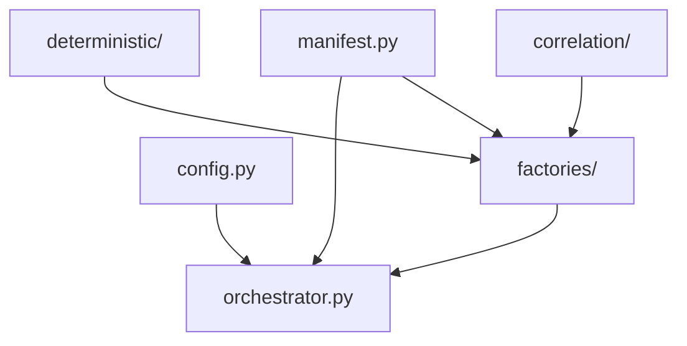

# Canonical Development Dataset (CDD) Generator

## Purpose

The **Canonical Development Dataset (CDD)** is the official engineering dataset for AGRIFLOW-AI. It provides a versioned, deterministically regenerable synthetic farm environment used for local development, TimescaleDB validation, AI feature engineering, and demonstrations.

This package (`backend/app/cdd/`) is an **engineering utility** — not a service, repository, or API layer. Step 2C-B implements the generation framework only; database persistence and CLI execution are deferred to later steps.

**Reference:** `docs/report/PHASE12_STEP2CA_CANONICAL_DEVELOPMENT_DATASET_ARCHITECTURE.md`

---

## Architecture

The generator follows a layered design aligned with Domain-Driven Design:

| Layer | Responsibility |
|---|---|
| **config** | Global constants: version, seed, temporal anchor |
| **manifest** | All configurable parameters (counts, cadences, field portfolio, rotations) |
| **deterministic** | UUID v5 identity and scoped PRNG |
| **correlation** | Cross-domain agricultural causal rules |
| **factories** | Per-domain record generation |
| **orchestrator** | FK-safe sequencing only |
| **types** | In-memory record dataclasses (pre-persistence) |
| **validation** | Pre-persistence in-memory dataset checks |



### Determinism Contract

Identical inputs produce identical outputs:

- `CDD_VERSION` + `CDD_SEED` → same UUIDs and values on every run
- UUID v5 from `(version, seed, entity_type, ordinal)`
- Scoped PRNG derived via SHA-256 from base seed + scope string

### Causal Model

The correlation engine implements approved cross-domain rules:

| Relationship | Function |
|---|---|
| Rainfall → Soil Moisture | `compute_soil_moisture_from_rainfall` |
| Temperature → NDVI | `compute_ndvi_from_context` |
| Soil Moisture → Irrigation | `compute_irrigation_trigger` |
| Leaf Wetness → Disease | `compute_disease_probability` |
| Disease → Yield | `apply_disease_yield_reduction` |

---

## Folder Structure

```
backend/app/cdd/
├── __init__.py           # Public package exports
├── config.py             # CDD_VERSION, CDD_SEED, temporal anchors
├── manifest.py           # Profile definitions and domain parameters
├── context.py            # Shared generation context
├── types.py              # Record dataclasses and CDDDataset bundle
├── orchestrator.py       # FK-safe generation sequencing
├── README.md             # This file
├── validation/
│   ├── __init__.py
│   ├── validator.py      # Rule orchestration
│   ├── rules.py          # Modular validation rules
│   └── report.py         # ValidationIssue / ValidationReport
├── correlation/
│   ├── __init__.py
│   └── engine.py         # Agricultural causal utilities
├── deterministic/
│   ├── __init__.py
│   ├── uuid.py           # UUID v5 generator
│   └── rng.py            # Scoped deterministic PRNG
└── factories/
    ├── __init__.py
    ├── farm.py
    ├── field.py
    ├── soil.py
    ├── crop.py
    ├── weather.py
    ├── sensor.py
    ├── satellite.py
    ├── irrigation.py
    ├── disease.py
    └── yield_.py
```

---

## Execution Flow

The orchestrator enforces referential generation order:

```
Farm
  ↓
Fields
  ↓
Soil Profiles
  ↓
Crops
  ↓
Weather
  ↓
Sensors
  ↓
Satellite
  ↓
Irrigation
  ↓
Disease
  ↓
Yield
```

Example usage (framework only — no automatic execution in Step 2C-B):

```python
from app.cdd import CDDOrchestrator

orchestrator = CDDOrchestrator(profile="cdd-dev")
dataset = orchestrator.generate()

print(dataset.version)       # cdd-v1.0.0
print(dataset.total_row_count)
print(len(dataset.sensor_readings))  # target: ~438,000
```

---

## Default Profile (`cdd-dev`)

| Domain | Target Rows |
|---|---|
| farms | 1 |
| fields | 10 |
| soil_profiles | 10 |
| crops | 18 |
| weather_records | 14,600 |
| sensor_readings | 438,000 |
| irrigation_events | 96 |
| satellite_observations | 5,840 |
| disease_observations | 54 |
| yield_records | 22 |

Temporal window: `2025-06-01` → `2026-05-31` (America/Chicago)

---

## Extension Guidelines

1. **Add parameters to `manifest.py`** — never hard-code counts or cadences in factories.
2. **Bump `CDD_VERSION`** per SemVer rules when changing row counts, temporal anchor, or schema-breaking fields.
3. **Add new domains** by creating a factory and inserting it in the orchestrator after existing FK dependencies.
4. **Add new profiles** (e.g. `cdd-benchmark`) by registering a new `CDDManifest` in `manifest.py`.
5. **Keep correlation logic in `correlation/`** — factories call pure functions; they do not embed physics.
6. **Do not modify** repositories, services, APIs, ORM models, or migrations from this package.

---

## Constraints (Step 2C-B)

- No database writes
- No CLI / `make cdd-regenerate` yet
- No automatic execution on import or application startup
- Synthetic data only — no production or PII data

---

## Dataset Metadata

Each generated dataset can carry session-level metadata via ``CDDDatasetMetadata``.
Metadata describes the generation session only — it is not persisted automatically.

| Field | Description |
|---|---|
| `generator_version` | Framework code version (`CDD_GENERATOR_VERSION`) |
| `manifest_profile` | Profile used (`cdd-dev`, etc.) |
| `dataset_version` | Dataset specification version (`CDD_VERSION`) |
| `seed` | PRNG seed for deterministic regeneration |
| `generated_at` | Timestamp when metadata was attached |
| `temporal_start` / `temporal_end` | CDD anchor window |
| `expected_row_count` | Sum of manifest `target_row_counts` |
| `actual_row_count` | Sum of generated domain counts |
| `domain_row_counts` | Per-domain record counts |
| `generation_duration_ms` | Placeholder for Step 2C-C timing capture |
| `notes` | Optional free-text annotation |

Attach metadata after generation (no automatic execution):

```python
from app.cdd import CDDOrchestrator

dataset = CDDOrchestrator(profile="cdd-dev").generate()
metadata = dataset.attach_metadata(notes="pre-persistence validation run")
```

---

## Validation Framework

The `validation/` package validates in-memory datasets **before** database persistence.
Validation is entirely in-memory — no PostgreSQL queries.

### Philosophy

- **Modular rules** — each concern (FK integrity, row counts, temporal bounds) is a separate function in `rules.py`
- **Aggregated reports** — `CDDValidator` produces a `ValidationReport` with ERROR/WARNING severities
- **Profile-aware** — rules read expected counts and rotations from the manifest
- **Non-blocking warnings** — high-volume domains (sensors, disease) may emit WARNING-level row count mismatches; relational domains emit ERROR

### Built-in Rules

| Rule ID | Responsibility |
|---|---|
| `profile_consistency` | Dataset profile matches manifest farm/field counts |
| `row_counts` | Per-domain counts vs manifest `target_row_counts` |
| `foreign_keys` | All FK references resolve within the dataset |
| `unique_ids` | No duplicate UUIDs across all domains |
| `temporal_bounds` | Timestamps within anchor window and timezone-aware |
| `seasonal_consistency` | Crop dates within 365-day horizon |
| `domain_coverage` | All ten domains present; soil 1:1 with fields |

Example usage:

```python
from app.cdd import CDDOrchestrator, CDDValidator

dataset = CDDOrchestrator().generate()
report = CDDValidator().validate(dataset)

if not report.passed:
    for issue in report.errors():
        print(issue.rule_id, issue.message)
```

---

## Future Dataset Profiles

Only `cdd-dev` is registered today. Additional profiles are planned and documented
in `manifest.FUTURE_PROFILES`. Adding a profile requires **only** changes inside
`manifest.py`:

1. Define a new `CDDManifest` instance with profile-specific counts and cadences
2. Call `register_profile(manifest)` to add it to `_PROFILES`

Factories and the orchestrator remain profile-independent.

| Profile | Status | Purpose |
|---|---|---|
| `cdd-dev` | **Registered** | Default development, CI, demos (~438K sensor rows) |
| `cdd-demo` | Planned | Stakeholder demos — reduced volume, same farm topology |
| `cdd-benchmark` | Planned | 15-minute sensor cadence for compression/query benchmarks |
| `cdd-large` | Planned | Production-scale simulation (100 farms, 1,000 fields) |

Query planned profiles:

```python
from app.cdd import list_profiles, list_future_profiles, FUTURE_PROFILES

list_profiles()         # ('cdd-dev',)
list_future_profiles()  # ('cdd-benchmark', 'cdd-demo', 'cdd-large')
FUTURE_PROFILES["cdd-benchmark"]  # description string
```
