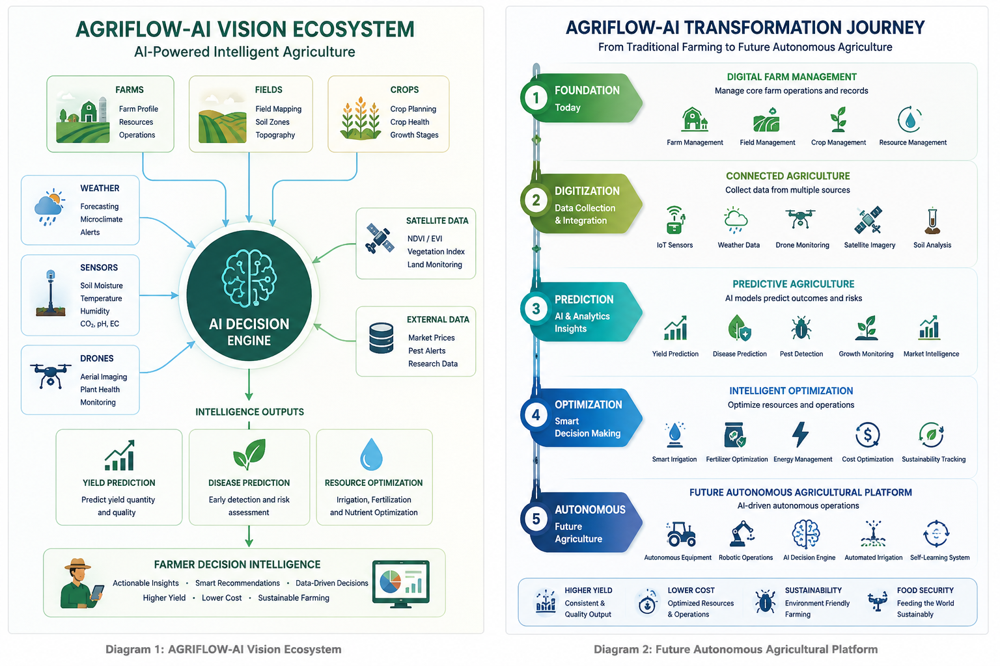

# AGRIFLOW-AI Product Vision & Strategic Roadmap

# AGRIFLOW-AI
## Agricultural Decision Intelligence Platform

---

# Executive Summary

AGRIFLOW-AI is an AI-powered Agricultural Decision Intelligence Platform designed to help farmers, agricultural enterprises, cooperatives, agronomists, and food supply chain stakeholders make better operational and strategic decisions using data.

Modern agriculture faces increasing pressure from climate change, water scarcity, labor shortages, rising operational costs, unpredictable weather conditions, and growing sustainability requirements. Traditional farming practices often rely heavily on experience and manual observation, which can limit productivity and responsiveness to changing conditions.

AGRIFLOW-AI addresses these challenges by combining farm data, field data, crop information, weather intelligence, sensor telemetry, satellite imagery, operational workflows, and artificial intelligence into a unified decision-support platform.

The long-term vision is to create an Agricultural Operating System that continuously monitors farming operations, predicts future outcomes, recommends actions, and eventually enables autonomous agricultural decision-making.

---

# Vision

AGRIFLOW-AI aims to become a comprehensive Agricultural Decision Intelligence Platform that transforms agricultural operations from reactive management into proactive and predictive management.

Instead of waiting for problems such as crop diseases, irrigation issues, nutrient deficiencies, or weather-related disruptions to occur, farmers can receive early warnings, predictive insights, and actionable recommendations generated through AI-powered analytics.

The platform seeks to become the digital control tower for modern farming operations, similar to how enterprise control towers monitor supply chains, manufacturing operations, and logistics networks.

---

# Problems Being Solved

## Water Scarcity

Water availability is becoming one of the most critical challenges facing global agriculture. Traditional irrigation methods often result in overwatering, under-watering, and inefficient resource utilization.

AGRIFLOW-AI uses sensor data, weather forecasts, soil moisture measurements, and predictive analytics to optimize irrigation schedules and reduce water waste while maintaining crop health.

### Expected Benefits

- Reduced water consumption
- Lower irrigation costs
- Improved crop health
- Sustainable water management

---

## Labor Shortages

Agricultural operations increasingly face shortages of skilled labor, especially during planting, monitoring, and harvesting seasons.

AGRIFLOW-AI reduces manual effort by automating monitoring activities, generating intelligent recommendations, and supporting future autonomous farming workflows.

### Expected Benefits

- Reduced operational dependency on manual labor
- Improved productivity
- Faster decision making
- Scalable farm management

---

## Climate Uncertainty

Weather patterns are becoming increasingly unpredictable, creating risks for planting schedules, irrigation planning, disease management, and harvest timing.

AGRIFLOW-AI continuously analyzes weather intelligence and environmental conditions to identify potential risks and recommend mitigation actions.

### Expected Benefits

- Improved resilience to climate variability
- Better planning decisions
- Reduced weather-related losses

---

## Yield Unpredictability

Farmers often struggle to accurately estimate harvest quantity and timing.

AGRIFLOW-AI applies machine learning models to historical production data, weather information, soil conditions, and crop growth patterns to improve yield forecasting accuracy.

### Expected Benefits

- Improved harvest planning
- Better inventory management
- Enhanced revenue forecasting
- Stronger supply chain coordination

---

## Disease Management

Many crop diseases are only detected after visible symptoms appear, by which time significant damage may already have occurred.

AGRIFLOW-AI combines environmental monitoring, crop analytics, sensor data, and computer vision technologies to identify disease risks at an early stage.

### Expected Benefits

- Earlier intervention
- Reduced crop losses
- Lower treatment costs
- Improved crop quality

---

## Resource Optimization

Agricultural inputs such as fertilizers, pesticides, water, and energy represent major operational costs.

AGRIFLOW-AI helps optimize resource utilization through data-driven recommendations and predictive analytics.

### Expected Benefits

- Reduced operating costs
- Improved sustainability
- Higher productivity
- Better profitability

---

# Key Business Domains

## Farm Management

Farm Management serves as the foundation of the platform.

This domain manages farm registration, ownership information, operational structures, geographic locations, and overall farm administration.

### Core Capabilities

- Farm registration
- Ownership management
- Geographic location tracking
- Farm-level reporting
- Multi-farm operations support

---

## Field Management

Field Management focuses on monitoring and managing individual agricultural fields.

Each field can contain different crops, soil conditions, irrigation systems, and operational characteristics.

### Core Capabilities

- Field boundary management
- GIS integration
- Soil profiling
- Irrigation infrastructure tracking
- Environmental monitoring

---

## Crop Management

Crop Management supports the complete lifecycle of agricultural production.

The platform tracks planting, growth, monitoring, treatment, and harvesting activities across multiple crop types.

### Core Capabilities

- Crop lifecycle tracking
- Planting schedules
- Growth stage monitoring
- Harvest planning
- Crop performance analytics

---

# AI Use Cases

## Yield Prediction

Yield Prediction uses machine learning models to forecast expected harvest quantity and harvest timing.

The system analyzes historical yield data, weather conditions, soil quality, crop health indicators, and environmental trends.

### Business Value

- Better production planning
- Improved supply chain coordination
- Revenue forecasting
- Inventory optimization

---

## Disease Detection

Disease Detection continuously evaluates crop conditions and environmental variables to identify potential disease risks.

Future versions may incorporate drone imagery, satellite imagery, and computer vision models for automated disease recognition.

### Business Value

- Early warning capabilities
- Reduced crop damage
- Improved treatment effectiveness
- Lower operational costs

---

## Precision Irrigation

Precision Irrigation determines the optimal timing and quantity of water required for individual fields.

Recommendations are generated using sensor data, weather forecasts, crop requirements, and soil conditions.

### Business Value

- Water conservation
- Reduced irrigation costs
- Improved sustainability
- Higher crop productivity

---

## Weather Intelligence

Weather Intelligence transforms raw weather data into actionable agricultural recommendations.

Instead of simply displaying weather forecasts, the platform explains how weather conditions may impact agricultural operations.

### Business Value

- Improved planning decisions
- Reduced weather-related risks
- Enhanced operational readiness

---

## Fertilizer Optimization

Fertilizer Optimization recommends nutrient application schedules based on crop requirements, growth stages, soil conditions, and environmental factors.

### Business Value

- Reduced fertilizer waste
- Lower operating costs
- Improved crop quality
- Sustainable farming practices

---

# Industry Inspiration

AGRIFLOW-AI is inspired by leading agricultural technology initiatives worldwide.

These include:

### Dutch AI-Powered Greenhouse Ecosystems

Advanced greenhouse operations use AI, sensors, robotics, and predictive analytics to optimize crop production while minimizing resource consumption.

### Digital Farming Platforms

Modern digital agriculture platforms demonstrate how data-driven decision making can improve agricultural productivity and sustainability.

### Autonomous Agricultural Machinery

AI-powered equipment and autonomous machinery are transforming agricultural operations through automation and precision execution.

### Computer Vision Crop Monitoring

Computer vision technologies enable continuous crop monitoring, disease detection, and field analysis at scale.

### Precision Agriculture Systems

Precision agriculture platforms optimize resource utilization through advanced analytics and data-driven recommendations.

---

# Sustainability Objectives

AGRIFLOW-AI is designed to support environmentally responsible farming.

## Reduce Water Consumption

Improve irrigation efficiency through intelligent recommendations and predictive analytics.

## Reduce Chemical Usage

Minimize unnecessary fertilizer and pesticide application through precision targeting.

## Improve Crop Quality

Support healthier crop growth through continuous monitoring and optimization.

## Improve Resource Utilization

Maximize productivity while reducing waste across water, energy, fertilizer, and labor resources.

---

# Long-Term Product Roadmap

## Phase 1 – Backend Foundation

Establish platform architecture, database infrastructure, security, and core APIs.

## Phase 2 – Field Domain

Implement field management, GIS capabilities, and field-level operations.

## Phase 3 – Crop Domain

Develop crop lifecycle management and agricultural workflow tracking.

## Phase 4 – Sensor Foundation

Integrate IoT sensors and real-time environmental monitoring.

## Phase 5 – Data Pipeline

Build scalable ingestion, processing, and analytics infrastructure.

## Phase 6 – AI Data Preparation

Prepare datasets, feature engineering pipelines, and model training frameworks.

## Phase 7 – Weather Intelligence

Introduce weather-based recommendations and predictive risk analysis.

## Phase 8 – Yield Prediction

Deploy machine learning models for production forecasting.

## Phase 9 – Disease Prediction

Implement predictive disease monitoring and risk assessment capabilities.

## Phase 10+ – Autonomous Agriculture Intelligence

Evolve AGRIFLOW-AI into a self-optimizing agricultural intelligence platform capable of autonomous monitoring, prediction, recommendation, and operational decision support.

---

# Long-Term Strategic Vision

The future of agriculture will increasingly be driven by data, automation, artificial intelligence, robotics, sensors, and predictive analytics.

AGRIFLOW-AI aims to become the operational intelligence layer that connects these technologies into a unified agricultural ecosystem.

The platform will help farmers move from reactive farming to predictive farming and ultimately toward autonomous agriculture, where decisions are continuously informed by real-time intelligence and AI-powered recommendations.

---

# Conclusion

AGRIFLOW-AI is envisioned as a next-generation Agricultural Decision Intelligence Platform that combines data, analytics, artificial intelligence, and operational workflows into a single ecosystem.

By integrating farm operations, field management, crop intelligence, weather analytics, sensor data, and predictive AI capabilities, AGRIFLOW-AI seeks to enable sustainable, efficient, and intelligent farming for the future.