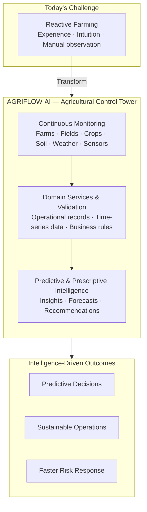
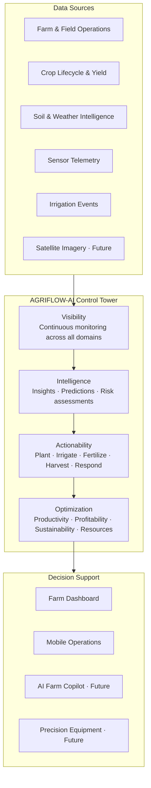
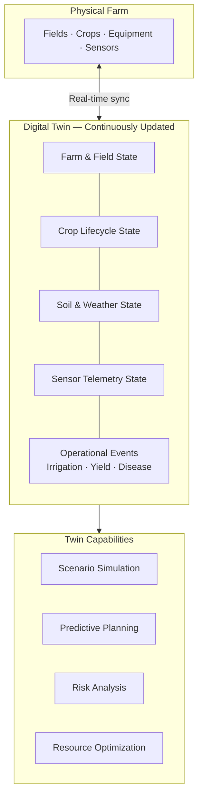
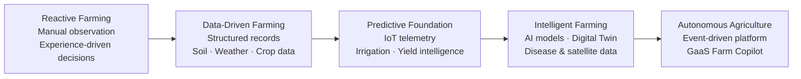

# AGRIFLOW-AI Vision

## Agricultural Intelligence Platform for the Future

---

# Executive Summary

AGRIFLOW-AI is an Agricultural Intelligence Platform designed to help farmers, agronomists, cooperatives, agricultural enterprises, and food supply chain stakeholders make better operational and strategic decisions through data, analytics, and artificial intelligence.

Agriculture is undergoing a fundamental transformation driven by climate change, labor shortages, resource constraints, sustainability requirements, digital technologies, and artificial intelligence.

Traditional farming practices often depend on experience, intuition, and manual observation. While these approaches have served agriculture for centuries, modern farming increasingly requires continuous monitoring, predictive insights, and intelligent decision support.

AGRIFLOW-AI aims to bridge this gap by creating a unified platform that transforms agricultural operations from reactive management into predictive and intelligence-driven management.

---

# Vision Statement

AGRIFLOW-AI aims to become the Agricultural Control Tower for modern farming operations.

Just as enterprise control towers provide visibility and decision support across supply chains, manufacturing operations, and logistics networks, AGRIFLOW-AI will provide a centralized intelligence layer for agricultural operations.

The platform will continuously monitor farms, fields, crops, soil conditions, weather patterns, irrigation systems, sensor networks, and operational activities to generate actionable recommendations and predictive insights.

The long-term objective is to enable farmers to make faster, better, and more sustainable decisions through data-driven intelligence.

### Agricultural Intelligence Transformation

The platform bridges traditional reactive farming with intelligence-driven management by centralizing operational, environmental, and telemetry data into a single decision layer.

---

# Why Agriculture Needs Transformation

Agriculture faces multiple interconnected challenges:

## Climate Variability

Weather patterns are becoming increasingly unpredictable.

Farmers must make decisions under uncertainty regarding planting schedules, irrigation planning, disease management, and harvest timing.

Traditional methods alone are often insufficient to respond quickly to rapidly changing environmental conditions.

---

## Water Scarcity

Water is becoming one of the most critical agricultural resources.

Over-irrigation, under-irrigation, and inefficient water usage directly impact productivity and sustainability.

Future farming systems must optimize every unit of water consumed.

---

## Labor Constraints

Agricultural operations increasingly face shortages of skilled labor.

Monitoring fields manually across large geographic areas is costly and difficult to scale.

Automation and intelligent decision support become increasingly important.

---

## Yield Uncertainty

Crop productivity depends on numerous variables including:

* Weather
* Soil health
* Irrigation
* Nutrient management
* Crop selection
* Disease pressure

Understanding and predicting these variables is essential for long-term success.

---

## Sustainability Requirements

Agriculture must balance productivity with environmental responsibility.

Future farming systems must reduce waste while improving:

* Water efficiency
* Fertilizer efficiency
* Energy efficiency
* Carbon management
* Soil health

---

# Agricultural Control Tower Vision

AGRIFLOW-AI is envisioned as the digital control tower for agricultural operations.

### Control Tower Architecture

The control tower unifies visibility across all farm data sources, transforms raw signals into intelligence, and drives actionable, optimized decisions for every stakeholder.

The platform will provide:

### Visibility

Continuous monitoring across:

* Farms
* Fields
* Crops
* Soil
* Weather
* Sensors
* Satellite imagery

### Intelligence

Transforming raw data into:

* Insights
* Recommendations
* Predictions
* Risk assessments

### Actionability

Helping stakeholders decide:

* What to plant
* When to irrigate
* When to fertilize
* When to harvest
* How to respond to risks

### Optimization

Improving:

* Productivity
* Profitability
* Sustainability
* Resource utilization

---

# Digital Twin Agriculture Vision

One of the long-term goals of AGRIFLOW-AI is to create a Digital Twin for agricultural operations.

Every physical farm will have a continuously updated digital representation.

The digital twin will integrate:

* Farm data
* Field data
* Crop lifecycle data
* Soil conditions
* Weather information
* Sensor telemetry
* Satellite observations
* Operational events
* Yield measurements

This digital representation will allow:

* Scenario simulation
* Predictive planning
* Risk analysis
* Resource optimization
* Future forecasting

The digital twin becomes the foundation for advanced agricultural intelligence.

---

# Precision Agriculture Vision

AGRIFLOW-AI supports the transition from generalized farming practices to precision agriculture.

Rather than applying uniform actions across an entire farm, decisions can be optimized at the field and crop level.

Examples include:

* Precision irrigation
* Precision fertilization
* Targeted disease management
* Yield optimization
* Resource allocation

The objective is to maximize output while minimizing waste.

---

# AI Farm Copilot Vision

Future versions of AGRIFLOW-AI will include an AI-powered Farm Copilot.

Farmers and agronomists will interact with the platform using natural language.

Examples:

"Which crop should I plant next season?"

"Will irrigation be required next week?"

"What is the disease risk for Field 5?"

"How will expected rainfall affect my harvest schedule?"

The system will combine operational data, environmental conditions, and predictive models to generate recommendations.

The goal is to provide expert-level decision support accessible to every farm.

---

# Core Intelligence Domains

AGRIFLOW-AI expands across multiple intelligence domains. Implemented domains include Farm, Field, Crop, Soil, Weather, Sensor, Irrigation, and Yield Intelligence. Disease, Satellite, and AI Decision Intelligence are on the roadmap.

## Farm Intelligence

Understanding farm-level operations and performance.

## Field Intelligence

Monitoring field conditions and operational activities.

## Crop Intelligence

Managing crop lifecycles and agricultural production.

## Soil Intelligence

Understanding soil quality, fertility, and long-term health.

## Weather Intelligence

Transforming weather information into operational recommendations.

## Irrigation Intelligence

Optimizing water usage and irrigation scheduling.

## Sensor Intelligence

Utilizing IoT and real-time environmental monitoring.

## Satellite Intelligence

Leveraging remote sensing and geospatial analytics.

## Yield Intelligence

Forecasting production and improving harvest planning. YieldRecord observations (Phase 9) provide the training label foundation for the Yield Prediction Engine.

## AI Decision Intelligence

Generating predictive recommendations and optimization strategies.

---

# Ecosystem Vision

AGRIFLOW-AI is designed to support a broader agricultural ecosystem.

Potential stakeholders include:

* Farmers
* Agronomists
* Cooperatives
* Agricultural consultants
* Input suppliers
* Food processors
* Retail organizations
* Insurance providers
* Government agencies
* Sustainability programs

The platform seeks to become a shared intelligence layer connecting participants across the agricultural value chain.

---

# Sustainability Vision

AGRIFLOW-AI is committed to supporting sustainable agriculture.

Key objectives include:

## Reduce Water Consumption

Improve irrigation efficiency through intelligent recommendations.

## Improve Soil Health

Support long-term soil sustainability and nutrient management.

## Reduce Chemical Usage

Encourage targeted fertilizer and pesticide application.

## Improve Resource Utilization

Reduce waste across agricultural operations.

## Support Climate Resilience

Help farmers adapt to changing environmental conditions.

---

# Autonomous Agriculture Vision

The long-term future of agriculture will increasingly involve:

* Artificial Intelligence
* Robotics
* Computer Vision
* Sensor Networks
* Predictive Analytics
* Autonomous Systems

AGRIFLOW-AI aims to become the intelligence layer that connects these technologies into a unified agricultural operating system.

### Platform Evolution Arc

---

# Long-Term Vision

AGRIFLOW-AI seeks to become the operating system for modern agriculture.

By combining operational data, environmental intelligence, predictive analytics, and artificial intelligence, the platform aims to help agricultural organizations make smarter decisions, improve sustainability, increase productivity, and build resilience for the future.

The ultimate goal is to transform agriculture into a continuously learning, data-driven, and intelligence-powered ecosystem.

---

## Diagram Notes

All diagrams in this document use [Mermaid](https://mermaid.js.org/) syntax and render natively in GitHub, GitLab, and compatible Markdown viewers. For detailed technical architecture diagrams, see `docs/09-architecture-diagrams.md`.
