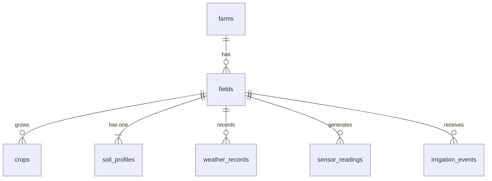

# Database Design

**Last Updated:** Phase 8 — Irrigation Management Domain Complete  
**Migration Head:** `235a51cdf901_create_irrigation_events_table`

---

## Current Schema Overview

AGRIFLOW-AI operates seven PostgreSQL tables after Phase 8 completion. All tables inherit the `AuditableModel` mixin (UUID PK, `created_at TIMESTAMPTZ`, `updated_at TIMESTAMPTZ`). All foreign keys to `fields.id` use `ON DELETE CASCADE`.



---

## Current Domain Hierarchy

```text
Farm
└── Field
     ├── Crop
     ├── SoilProfile         (1:1)
     ├── WeatherRecord
     ├── SensorReading       ← Phase 7 (append-only)
     └── IrrigationEvent     ← Phase 8 (mutable operational events)
```

---

## Current Schema

### farms
Primary agricultural entity. Root aggregate for all domain hierarchies.

| Column | Type | Nullable | Notes |
|---|---|---|---|
| `id` | `UUID` | No | Primary key (UUID v4) |
| `farm_code` | `VARCHAR` | Yes | Optional user-defined code |
| `farm_name` | `VARCHAR` | No | Human-readable farm name |
| `owner_name` | `VARCHAR` | Yes | Owner or operator |
| `country` | `VARCHAR` | Yes | Location |
| `state` | `VARCHAR` | Yes | Location |
| `city` | `VARCHAR` | Yes | Location |
| `latitude` | `NUMERIC(10,6)` | Yes | Geolocation |
| `longitude` | `NUMERIC(10,6)` | Yes | Geolocation |
| `total_area_hectares` | `NUMERIC(12,4)` | Yes | Total farm area |
| `is_active` | `BOOLEAN` | No | Default `true` |
| `created_at` | `TIMESTAMPTZ` | No | Audit timestamp |
| `updated_at` | `TIMESTAMPTZ` | No | Audit timestamp |

### fields
Represents a field belonging to a farm.

| Column | Type | Nullable | Notes |
|---|---|---|---|
| `id` | `UUID` | No | Primary key |
| `farm_id` | `UUID` (FK → farms.id) | No | ON DELETE CASCADE |
| `name` | `VARCHAR(255)` | No | Unique within farm |
| `area_hectares` | `NUMERIC(10,2)` | Yes | Field area |
| `soil_type` | `VARCHAR(50)` | Yes | Descriptive soil type |
| `latitude` | `NUMERIC(10,6)` | Yes | Geolocation |
| `longitude` | `NUMERIC(10,6)` | Yes | Geolocation |
| `elevation_m` | `NUMERIC(8,2)` | Yes | Elevation (Phase 6 AI attribute) |
| `created_at` | `TIMESTAMPTZ` | No | Audit timestamp |
| `updated_at` | `TIMESTAMPTZ` | No | Audit timestamp |

### crops
Represents a crop cycle belonging to a field.

| Column | Type | Nullable | Notes |
|---|---|---|---|
| `id` | `UUID` | No | Primary key |
| `field_id` | `UUID` (FK → fields.id) | No | ON DELETE CASCADE |
| `crop_name` | `VARCHAR(255)` | No | Crop name |
| `crop_variety` | `VARCHAR(255)` | Yes | Variety/cultivar |
| `planting_date` | `DATE` | No | Planting date |
| `expected_harvest_date` | `DATE` | Yes | Expected harvest |
| `actual_harvest_date` | `DATE` | Yes | Actual harvest |
| `status` | `ENUM(crop_status)` | No | Lifecycle state |
| `actual_yield_tons_ha` | `NUMERIC(8,3)` | Yes | AI attribute (Phase 6) |
| `expected_yield_tons_ha` | `NUMERIC(8,3)` | Yes | AI attribute (Phase 6) |
| `seeding_rate_kg_ha` | `NUMERIC(8,3)` | Yes | AI attribute (Phase 6) |
| `growth_stage` | `VARCHAR(50)` | Yes | AI attribute (Phase 6) |
| `created_at` | `TIMESTAMPTZ` | No | Audit timestamp |
| `updated_at` | `TIMESTAMPTZ` | No | Audit timestamp |

#### crop_status Enum

```sql
CREATE TYPE crop_status AS ENUM ('PLANNED', 'PLANTED', 'GROWING', 'HARVESTED');
```

### soil_profiles

Represents the soil intelligence profile for a field. One-to-one with `fields`.

| Column | Type | Nullable | Notes |
|---|---|---|---|
| `id` | `UUID` | No | Primary key |
| `field_id` | `UUID` (FK → fields.id, UNIQUE) | No | One-to-one enforcement |
| `soil_type` | `ENUM(soil_type)` | No | Soil classification |
| `ph` | `NUMERIC(4,2)` | Yes | pH value |
| `organic_matter` | `NUMERIC(5,2)` | Yes | Percentage |
| `nitrogen` | `NUMERIC(10,2)` | Yes | mg/kg |
| `phosphorus` | `NUMERIC(10,2)` | Yes | mg/kg |
| `potassium` | `NUMERIC(10,2)` | Yes | mg/kg |
| `soil_depth_cm` | `NUMERIC(6,2)` | Yes | AI attribute (Phase 6) |
| `cation_exchange_capacity_meq` | `NUMERIC(8,2)` | Yes | AI attribute (Phase 6) |
| `notes` | `TEXT` | Yes | Free-text |
| `created_at` | `TIMESTAMPTZ` | No | Audit timestamp |
| `updated_at` | `TIMESTAMPTZ` | No | Audit timestamp |

#### soil_type Enum

```sql
CREATE TYPE soil_type AS ENUM ('CLAY', 'SANDY', 'LOAMY', 'SILTY', 'PEATY', 'CHALKY');
```


### weather_records

Represents historical weather observations for a field.

| Column | Type | Nullable | Notes |
|---|---|---|---|
| `id` | `UUID` | No | Primary key |
| `field_id` | `UUID` (FK → fields.id) | No | ON DELETE CASCADE |
| `recorded_at` | `TIMESTAMPTZ` | No | Timezone-aware observation time |
| `temperature_c` | `NUMERIC(5,2)` | Yes | Ambient temperature |
| `humidity_percent` | `NUMERIC(5,2)` | Yes | Relative humidity |
| `rainfall_mm` | `NUMERIC(8,2)` | Yes | Precipitation |
| `wind_speed_kmh` | `NUMERIC(8,2)` | Yes | Wind speed |
| `data_source` | `VARCHAR(100)` | Yes | Station ID or provider |
| `solar_radiation_wm2` | `NUMERIC(8,2)` | Yes | AI attribute (Phase 6) |
| `temperature_min_c` | `NUMERIC(5,2)` | Yes | AI attribute (Phase 6) |
| `temperature_max_c` | `NUMERIC(5,2)` | Yes | AI attribute (Phase 6) |
| `created_at` | `TIMESTAMPTZ` | No | Audit timestamp |
| `updated_at` | `TIMESTAMPTZ` | No | Audit timestamp |


## sensor_readings

Represents IoT sensor telemetry observations for a field. **Append-only — no updates permitted.**

| Column | Type | Nullable | Notes |
|---|---|---|---|
| `id` | `UUID` | No | Primary key |
| `field_id` | `UUID` (FK → fields.id) | No | ON DELETE CASCADE |
| `sensor_type` | `ENUM(sensor_type)` | No | See sensor_type enum below |
| `sensor_value` | `DOUBLE PRECISION` | No | IEEE 754 64-bit; not NUMERIC |
| `unit` | `VARCHAR(50)` | No | SI or industry-standard unit |
| `recorded_at` | `TIMESTAMPTZ` | No | Timezone-aware observation timestamp |
| `notes` | `TEXT` | Yes | Free-text annotation |
| `created_at` | `TIMESTAMPTZ` | No | Audit timestamp |
| `updated_at` | `TIMESTAMPTZ` | No | Audit timestamp |

### sensor_type Enum

```sql
CREATE TYPE sensor_type AS ENUM (
    'SOIL_MOISTURE',
    'SOIL_TEMPERATURE',
    'AIR_TEMPERATURE',
    'AIR_HUMIDITY',
    'LIGHT_INTENSITY',
    'LEAF_WETNESS',
    'ELECTRICAL_CONDUCTIVITY',
    'SOIL_SALINITY',
    'WATER_LEVEL',
    'BATTERY_STATUS',
    'DEVICE_HEALTH'
);
```

### sensor_readings Indexes

| Index | Columns | Type | Purpose |
|---|---|---|---|
| `ix_sensor_readings_field_id` | `field_id` | Single | Field-level reading lookups |
| `ix_sensor_readings_sensor_type` | `sensor_type` | Single | Cross-field type queries |
| `ix_sensor_readings_recorded_at` | `recorded_at` | Single | Time-range queries |
| `ix_sensor_readings_field_id_recorded_at` | `(field_id, recorded_at)` | Compound | Primary telemetry access pattern |
| `ix_sensor_readings_sensor_type_recorded_at` | `(sensor_type, recorded_at)` | Compound | Type-scoped time queries |

Compound indexes are a Phase 7 introduction — all prior tables use single-column indexes only.

### Design Decisions

**DOUBLE PRECISION vs NUMERIC:**
All prior columns use `NUMERIC(p,s)`. `sensor_value` uses `DOUBLE PRECISION` because sensor ADC outputs are floating-point quantities. Fixed-scale `NUMERIC` would silently truncate high-resolution sensor readings.

**ON DELETE CASCADE:**
`field_id` FK uses `ON DELETE CASCADE`. A field deletion atomically removes all its sensor readings at the database level, consistent with the SQLAlchemy `cascade="all, delete-orphan"` relationship.

**Explicit enum lifecycle:**
Migration 006 uses explicit `CREATE TYPE sensor_type AS ENUM (...)` in the upgrade function and `DROP TYPE sensor_type` in downgrade. This gives full lifecycle control and avoids implicit creation issues seen with earlier enums.

---

## irrigation_events (Phase 8)

Represents human-logged irrigation management events for a field. **Mutable — PATCH is supported.**

| Column | Type | Nullable | Notes |
|---|---|---|---|
| `id` | `UUID` | No | Primary key |
| `field_id` | `UUID` (FK → fields.id) | No | ON DELETE CASCADE |
| `started_at` | `TIMESTAMPTZ` | No | Irrigation start; primary time key; TimescaleDB partition candidate |
| `ended_at` | `TIMESTAMPTZ` | Yes | Optional — may be omitted when only duration is known |
| `duration_minutes` | `NUMERIC(8,2)` | Yes | Duration in minutes; independent of `ended_at` |
| `water_volume_liters` | `NUMERIC(10,3)` | Yes | Water volume applied; nullable for non-metered systems |
| `irrigation_method` | `ENUM(irrigation_method)` | No | Delivery method |
| `water_source` | `ENUM(water_source)` | Yes | Water origin |
| `notes` | `TEXT` | Yes | Operator free-text annotations |
| `created_at` | `TIMESTAMPTZ` | No | Audit timestamp |
| `updated_at` | `TIMESTAMPTZ` | No | Audit timestamp |

### irrigation_method Enum

```sql
CREATE TYPE irrigation_method AS ENUM (
    'DRIP',
    'SPRINKLER',
    'FLOOD',
    'FURROW',
    'CENTER_PIVOT',
    'SUBSURFACE',
    'MANUAL',
    'AUTOMATED'
);
```

### water_source Enum

```sql
CREATE TYPE water_source AS ENUM (
    'GROUNDWATER',
    'SURFACE_WATER',
    'RAINWATER',
    'MUNICIPAL',
    'RECYCLED_WATER'
);
```

### irrigation_events Indexes

| Index | Columns | Type | Purpose |
|---|---|---|---|
| `ix_irrigation_events_field_id` | `field_id` | Single | All events for a given field |
| `ix_irrigation_events_started_at` | `started_at` | Single | Events in a time window (cross-field) |
| `ix_irrigation_events_field_id_started_at` | `(field_id, started_at)` | Compound | Primary access pattern for field irrigation history and AI features |

### Design Decisions

**Mutable vs Immutable:**
Unlike `SensorReading` (immutable telemetry), `IrrigationEvent` is mutable. Irrigation events are operator-logged actions that may need correction after the fact (e.g., wrong duration entered, method changed post-event).

**`started_at` as TimescaleDB partition key:**
`started_at TIMESTAMPTZ NOT NULL` satisfies the hypertable partition key requirement. Future activation requires no application code changes:
```sql
SELECT create_hypertable('irrigation_events', 'started_at', chunk_time_interval => INTERVAL '1 month');
```

**Enum lifecycle — postgresql.ENUM with create_type=False:**
Phase 8 discovered that `sa.Enum._copy()` in SQLAlchemy 2.0.x does not forward `create_type=False` to the cloned table during `op.create_table()`. This caused `DuplicateObjectError` on fresh databases. The resolution: use `postgresql.ENUM` from `sqlalchemy.dialects.postgresql` with `create_type=False` and explicit `.create()` / `.drop()` calls. This is now the authoritative enum migration pattern.

**ON DELETE CASCADE:**
`field_id` FK uses `ON DELETE CASCADE` — consistent with all other Field children.

---

## Relationships

Farm (1) → (N) Fields

Field (1) → (N) Crops

Field (1) → (1) SoilProfile

Field (1) → (N) WeatherRecords

Field (1) → (N) SensorReadings  ← Phase 7 (ON DELETE CASCADE, append-only)

Field (1) → (N) IrrigationEvents  ← Phase 8 (ON DELETE CASCADE, mutable)


## Current Domain Hierarchy

```text
Farm
└── Field
     ├── Crop
     ├── SoilProfile         (1:1)
     ├── WeatherRecord
     ├── SensorReading       ← Phase 7 (append-only)
     └── IrrigationEvent     ← Phase 8 (mutable operational events)
```


## Implemented Migrations

| Migration | Description |
|---|---|
| `001_create_farms_table` | farms table |
| `002_create_fields_table` | fields table |
| `003_create_crops_table` | crops table + `crop_status` enum |
| `13aabbe35d51_add_soil_profiles_table` | soil_profiles table + `soil_type` enum |
| `004_create_weather_records_table` | weather_records table |
| `005_add_p1_ai_readiness_columns` | P1 AI attributes across 4 tables |
| `006_create_sensor_readings_table` | sensor_readings table + `sensor_type` enum + 5 indexes |
| `235a51cdf901_create_irrigation_events_table` | irrigation_events table + `irrigation_method` + `water_source` enums + 3 indexes |

## Crop Status Lifecycle

- PLANNED
- PLANTED
- GROWING
- HARVESTED

## Current API Coverage

### Field APIs

- POST   /api/v1/farms/{farm_id}/fields
- GET    /api/v1/farms/{farm_id}/fields
- GET    /api/v1/fields/{field_id}
- PATCH  /api/v1/fields/{field_id}
- DELETE /api/v1/fields/{field_id}

### Crop APIs

- POST   /api/v1/fields/{field_id}/crops
- GET    /api/v1/fields/{field_id}/crops
- GET    /api/v1/crops/{crop_id}
- PATCH  /api/v1/crops/{crop_id}
- DELETE /api/v1/crops/{crop_id}

### Soil Profile APIs

* POST   /api/v1/fields/{field_id}/soil-profile
* GET    /api/v1/fields/{field_id}/soil-profile
* PATCH  /api/v1/soil-profiles/{soil_profile_id}
* DELETE /api/v1/soil-profiles/{soil_profile_id}

### Weather Record APIs

* POST   /api/v1/fields/{field_id}/weather-records
* GET    /api/v1/fields/{field_id}/weather-records
* GET    /api/v1/weather-records/{weather_record_id}
* PATCH  /api/v1/weather-records/{weather_record_id}
* DELETE /api/v1/weather-records/{weather_record_id}

### Sensor Reading APIs (Phase 7)

* POST   /api/v1/fields/{field_id}/sensor-readings
* GET    /api/v1/fields/{field_id}/sensor-readings
* GET    /api/v1/sensor-readings/{sensor_reading_id}
* DELETE /api/v1/sensor-readings/{sensor_reading_id}

No PATCH. No PUT. SensorReading is immutable telemetry.

### Irrigation Event APIs (Phase 8)

* POST   /api/v1/fields/{field_id}/irrigation-events
* GET    /api/v1/fields/{field_id}/irrigation-events
* GET    /api/v1/irrigation-events/{event_id}
* PATCH  /api/v1/irrigation-events/{event_id}
* DELETE /api/v1/irrigation-events/{event_id}


## Future Database Evolution

- Yield Tracking (`yield_records` table) — Phase 9
- Disease Observation (`disease_observations` table) — Phase 10
- Satellite Imagery (`satellite_observations` table) — Phase 11
- GIS / PostGIS Support (field boundary polygons)
- AI Recommendation Engine (inference output tables)

### TimescaleDB Hypertable Promotion

Both `sensor_readings` and `irrigation_events` are designed for zero-friction TimescaleDB conversion.

**sensor_readings:** Partition key `recorded_at TIMESTAMPTZ NOT NULL` (Phase 7)

```sql
SELECT create_hypertable(
    'sensor_readings',
    'recorded_at',
    chunk_time_interval => INTERVAL '1 week',
    migrate_data => TRUE
);
```

**irrigation_events:** Partition key `started_at TIMESTAMPTZ NOT NULL` (Phase 8)

```sql
SELECT create_hypertable(
    'irrigation_events',
    'started_at',
    chunk_time_interval => INTERVAL '1 month',
    migrate_data => TRUE
);
```

**yield_records:** Partition key `recorded_at TIMESTAMPTZ NOT NULL` (Phase 9)

```sql
SELECT create_hypertable(
    'yield_records',
    'recorded_at',
    chunk_time_interval => INTERVAL '1 season',
    migrate_data => TRUE
);
```

Capabilities gained:
* Automatic time-based chunk partitioning
* Chunk exclusion for time-range queries
* Continuous aggregates (hourly/daily rollups per field per sensor type)
* Columnar compression for cold chunks (20–100× storage reduction)
* Automatic data retention policies (TTL-based chunk expiry)

### Cassandra Migration Path

For deployments exceeding PostgreSQL vertical scaling limits, `sensor_readings` can be migrated to Cassandra using the CQRS pattern:

Primary table partition: `field_id` (partition key) + `recorded_at DESC` (clustering key) — matching the existing compound index `ix_sensor_readings_field_id_recorded_at`.

Migration requires no changes to the application service layer.


## Phase 9 — Yield Domain (yield_records table)

### `yield_measurement_method` Enum

```sql
CREATE TYPE yield_measurement_method AS ENUM (
    'MANUAL_SCALE',
    'COMBINE_MONITOR',
    'YIELD_MAP',
    'REMOTE_SENSING',
    'CROP_CUT',
    'LABORATORY_ANALYSIS',
    'ESTIMATED'
);
```

Created via `postgresql.ENUM` with `create_type=False` (ADR-008-01 pattern). Owned by migration `b7e2a9f4c8d3`.

### `yield_records` Table

```sql
CREATE TABLE yield_records (
    id                       UUID         NOT NULL DEFAULT gen_random_uuid(),
    crop_id                  UUID         NOT NULL,   -- FK → crops.id ON DELETE CASCADE
    field_id                 UUID         NOT NULL,   -- FK → fields.id ON DELETE CASCADE (denormalized)
    recorded_at              TIMESTAMPTZ  NOT NULL,
    yield_value_tons_ha      NUMERIC(10,4) NOT NULL,
    measurement_method       yield_measurement_method NOT NULL,
    area_harvested_ha        NUMERIC(10,4),
    moisture_content_percent NUMERIC(5,2),
    test_weight_kg_hl        NUMERIC(6,3),
    quality_grade            VARCHAR(50),
    notes                    TEXT,
    created_at               TIMESTAMPTZ  NOT NULL DEFAULT now(),
    updated_at               TIMESTAMPTZ  NOT NULL DEFAULT now(),
    CONSTRAINT pk_yield_records PRIMARY KEY (id),
    CONSTRAINT fk_yield_records_crop_id
        FOREIGN KEY (crop_id) REFERENCES crops(id) ON DELETE CASCADE,
    CONSTRAINT fk_yield_records_field_id
        FOREIGN KEY (field_id) REFERENCES fields(id) ON DELETE CASCADE
);
```

**Column notes:**

| Column | Type | Notes |
|---|---|---|
| `crop_id` | UUID FK | Primary domain anchor — yield is per crop cycle (ADR-009-01) |
| `field_id` | UUID FK | Denormalized from crop for direct field queries (ADR-009-02) |
| `recorded_at` | TIMESTAMPTZ | TimescaleDB partition key candidate (ADR-009-03) |
| `yield_value_tons_ha` | NUMERIC(10,4) | Non-negative; service validates > 0 context |
| `measurement_method` | ENUM | Provenance for AI data quality weighting |
| `area_harvested_ha` | NUMERIC(10,4) | Nullable; service enforces > 0 when supplied (ADR-009-06) |
| `moisture_content_percent` | NUMERIC(5,2) | Nullable; Pydantic enforces [0, 100] |
| `test_weight_kg_hl` | NUMERIC(6,3) | Nullable; service enforces > 0 when supplied |
| `quality_grade` | VARCHAR(50) | Free-form, e.g. "Grade 1" |

### Indexes

```sql
-- Single-column
CREATE INDEX ix_yield_records_crop_id    ON yield_records (crop_id);
CREATE INDEX ix_yield_records_field_id   ON yield_records (field_id);
CREATE INDEX ix_yield_records_recorded_at ON yield_records (recorded_at);

-- Compound (primary AI feature pipeline path)
CREATE INDEX ix_yield_records_crop_id_recorded_at ON yield_records (crop_id, recorded_at);
```

### Relationships

```
Crop    (1) → (N) YieldRecords  ← Phase 9 (ON DELETE CASCADE, mutable grandchild)
Field   (1) → (N) YieldRecords  ← Phase 9 (ON DELETE CASCADE, denormalized FK)
```

### TimescaleDB Readiness

**yield_records:** Partition key `recorded_at TIMESTAMPTZ NOT NULL` (Phase 9)

```sql
SELECT create_hypertable(
    'yield_records',
    'recorded_at',
    chunk_time_interval => INTERVAL '1 season',
    migrate_data => TRUE
);
```

---

## Phase 6 AI Readiness Foundation (Completed)

Added AI-ready attributes across Field, Crop, SoilProfile, and WeatherRecord domains to support future prediction and recommendation engines.

### New AI Attributes

Field
- elevation_m

Crop
- actual_yield_tons_ha
- expected_yield_tons_ha
- seeding_rate_kg_ha
- growth_stage

SoilProfile
- soil_depth_cm
- cation_exchange_capacity_meq

WeatherRecord
- solar_radiation_wm2
- temperature_min_c
- temperature_max_c
