# AGRIFLOW-AI Phase Architecture Handbook

**Document:** Architecture Reference & Implementation History  
**Version:** 1.0  
**Date:** June 2026  
**Scope:** Phase 1 through Phase 7 — complete implementation record and future architecture guide  
**Status:** Living Document

---

## Table of Contents

1. [Platform Overview](#1-platform-overview)
2. [Core Architecture Principles](#2-core-architecture-principles)
3. [Layered Architecture Reference](#3-layered-architecture-reference)
4. [Phase 1 — Foundation](#4-phase-1--foundation)
5. [Phase 2 — Field Domain](#5-phase-2--field-domain)
6. [Phase 3 — Crop Domain](#6-phase-3--crop-domain)
7. [Phase 4 — Soil Intelligence Domain](#7-phase-4--soil-intelligence-domain)
8. [Phase 5 — Weather Intelligence Domain](#8-phase-5--weather-intelligence-domain)
9. [Phase 6 — AI Readiness Foundation](#9-phase-6--ai-readiness-foundation)
10. [Phase 7 — Sensor Telemetry Domain](#10-phase-7--sensor-telemetry-domain)
11. [Current Domain Architecture (Post Phase 7)](#11-current-domain-architecture-post-phase-7)
12. [Future Architecture: TimescaleDB](#12-future-architecture-timescaledb)
13. [Future Architecture: Apache Cassandra](#13-future-architecture-apache-cassandra)
14. [Future Architecture: CQRS](#14-future-architecture-cqrs)
15. [Future Architecture: Redpanda / Kafka](#15-future-architecture-redpanda--kafka)
16. [Future Architecture: Temporal Workflows](#16-future-architecture-temporal-workflows)
17. [Future Architecture: Digital Twin](#17-future-architecture-digital-twin)
18. [Future Architecture: Generative-As-A-Service (GaaS)](#18-future-architecture-generative-as-a-service-gaas)
19. [Architecture Decision Register](#19-architecture-decision-register)
20. [Technology Evolution Roadmap](#20-technology-evolution-roadmap)

---

## 1. Platform Overview

AGRIFLOW-AI is an Agricultural Intelligence Platform designed to evolve from operational farm management into a comprehensive AI-powered decision intelligence system.

The platform's strategic trajectory:

```
Reactive Farming
      ↓
Data-Driven Farming        (Phases 1–6)
      ↓
Predictive Farming         (Phases 7–11)
      ↓
Intelligent Farming        (Phases 12–14)
      ↓
Autonomous Agriculture     (Phase 15+)
```

### Platform Goals

- Give farmers, agronomists, and cooperatives a unified operational platform
- Build the data foundation required to train agricultural AI models
- Create the telemetry and observation pipeline needed for real-time intelligence
- Evolve toward a Digital Twin of every farm field

### Long-Term Domain Hierarchy Target

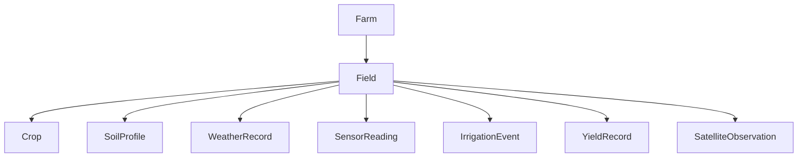

---

## 2. Core Architecture Principles

These principles have governed every phase and must continue to govern future phases.

### Structural Principles

| Principle | Application |
|---|---|
| **Clean Architecture** | API, Service, Repository, and Model layers have hard boundaries; dependencies flow inward only |
| **Repository Pattern** | All database access is encapsulated in typed repositories; no SQLAlchemy sessions in services |
| **Service Layer** | Business rules, domain validation, and orchestration live exclusively in services |
| **Separation of Concerns** | Each layer has a single, well-defined responsibility |
| **SOLID Principles** | Each class has one reason to change; dependencies are injectable; interfaces are stable |
| **Domain-Driven Design** | Domain models reflect agricultural reality, not database structure |

### Quality Principles

| Principle | Application |
|---|---|
| **Migration-Driven Schema Evolution** | No direct DDL; all changes via Alembic revision files |
| **API-First Development** | Schemas define the contract; implementations follow |
| **Dependency Injection** | All service and repository wiring happens in `deps.py`; routers stay thin |
| **Immutability where applicable** | Telemetry and observational data are append-only |
| **Type Safety** | Full type hints throughout; Pydantic for I/O validation |

---

## 3. Layered Architecture Reference

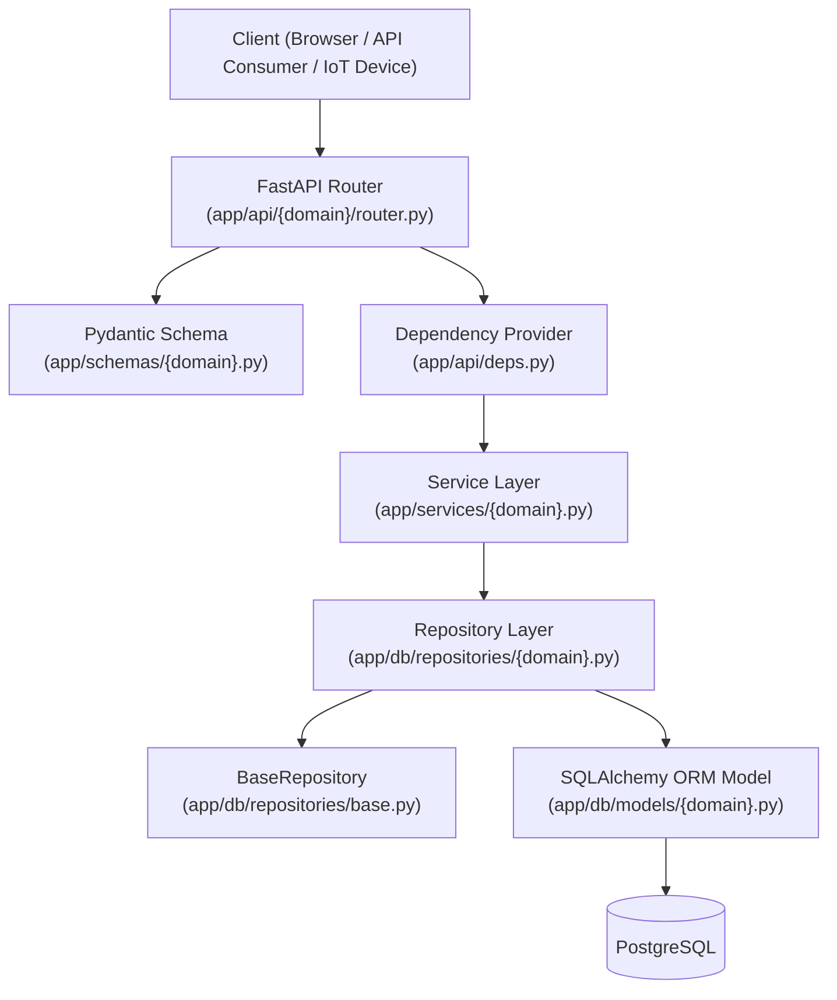

### Layer Responsibilities

**API Layer** (`app/api/`)
- HTTP endpoint definitions
- Request body reception
- Pydantic schema validation (automatic via FastAPI)
- Domain exception → HTTP status translation
- Structured request/response logging
- **Must not** contain business logic

**Schema Layer** (`app/schemas/`)
- Request payload validation
- Response serialization contracts
- `ConfigDict(from_attributes=True)` on Response schemas for ORM → Pydantic conversion
- No database or service interaction

**Service Layer** (`app/services/`)
- Business rules and domain invariants
- Cross-domain orchestration
- Domain exception declaration
- Future event publishing boundary
- **Must not** contain SQLAlchemy queries or sessions

**Repository Layer** (`app/db/repositories/`)
- All database access
- CRUD and domain-specific queries
- Transaction flushing (not committing — that is the session's job)
- **Must not** contain business rules

**Model Layer** (`app/db/models/`)
- SQLAlchemy ORM class definitions
- Table structure, columns, relationships, and indexes
- Inherits `AuditableModel` for UUID PK + timestamps

**Dependency Layer** (`app/api/deps.py`)
- Session lifecycle management (open → commit on success, rollback on exception)
- Service factory functions
- `Annotated` type aliases for clean route signatures

### Request Lifecycle

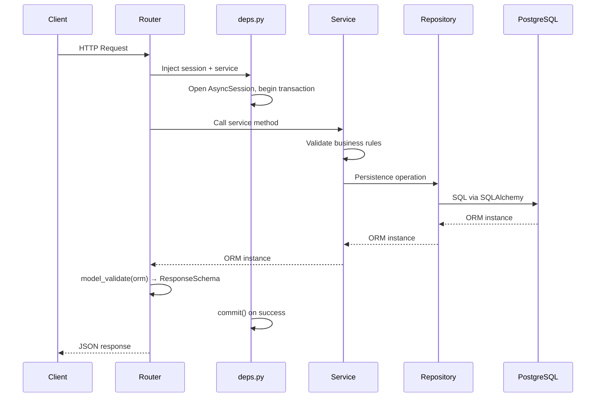

---

## 4. Phase 1 — Foundation

**Status:** ✅ Complete

### Business Problem

No working backend existed. Agricultural operations could not be recorded or managed digitally. Before any domain could be built, a production-grade platform foundation was needed.

### Use Case

Establish the infrastructure for all future domains:
- Running FastAPI server
- Connected PostgreSQL database
- Alembic-managed schema evolution
- Farm as the root domain entity
- Operational health and version endpoints

### Domain Decisions

- **Farm is the root aggregate.** All agricultural entities belong to a Farm. Every domain added in future phases traces its ancestry to a Farm.
- **UUID v4 primary keys.** Sequential integers expose row counts, enable enumeration attacks, and complicate distributed merging. UUIDs avoid all three.
- **`AuditableModel` mixin.** Every table carries `id`, `created_at`, `updated_at` as non-negotiable columns. This universalizes audit trail support.

### Architecture Decisions

- **FastAPI** as the API framework: async-native, automatic OpenAPI docs, typed request/response bodies via Pydantic.
- **SQLAlchemy 2.0** with async engine: production-grade ORM with first-class asyncio support.
- **Alembic** for schema migrations: schema changes are version-controlled, repeatable, and reversible.
- **Structlog** for structured logging: machine-parseable JSON logs from day one, compatible with observability platforms.

### Database Changes

```sql
-- Migration: 001_create_farms_table
CREATE TABLE farms (
    id          UUID PRIMARY KEY DEFAULT gen_random_uuid(),
    farm_code   VARCHAR(50)   NOT NULL,
    farm_name   VARCHAR(255)  NOT NULL,
    owner_name  VARCHAR(255)  NOT NULL,
    country     VARCHAR(100)  NOT NULL,
    state       VARCHAR(100)  NOT NULL,
    city        VARCHAR(100)  NOT NULL,
    latitude    NUMERIC(9,6)  NOT NULL,
    longitude   NUMERIC(10,6) NOT NULL,
    total_area_hectares NUMERIC(12,4) NOT NULL,
    is_active   BOOLEAN       NOT NULL DEFAULT TRUE,
    created_at  TIMESTAMPTZ   NOT NULL DEFAULT now(),
    updated_at  TIMESTAMPTZ   NOT NULL DEFAULT now()
);
```

### API Changes

```http
GET /api/v1/health/live
GET /api/v1/health/ready
GET /api/v1/version
```

### AI Readiness Impact

Farm-level geolocation (`latitude`, `longitude`) enables climate zone assignment and geographic feature engineering for cross-farm AI models. `total_area_hectares` enables farm-level yield normalisation.

### ADRs Introduced

| ADR | Decision |
|---|---|
| ADR-001-01 | UUID v4 as the universal primary key strategy |
| ADR-001-02 | `AuditableModel` mixin: all tables carry `created_at` / `updated_at` |
| ADR-001-03 | Alembic as the sole mechanism for schema change |
| ADR-001-04 | Async SQLAlchemy engine throughout — synchronous adapters are not used |

### Lessons Learned

- Establish the base model mixin before writing any domain models. Retrofitting audit columns is expensive.
- Server-side `DEFAULT now()` for timestamps avoids clock-skew issues in distributed deployments.
- The migration framework must be working and tested before the first domain model is added.

### Future Extensibility

The Farm entity will need schema expansion for AI use cases:
- `climate_zone` (VARCHAR): Köppen-Geiger climate classification for cross-farm model transfer
- `elevation_m` (at farm level, already on Field): terrain context for weather model adjustment
- Farm-level analytics aggregation endpoints

---

## 5. Phase 2 — Field Domain

**Status:** ✅ Complete

### Business Problem

Farms contain multiple fields that must be managed independently. Different fields have different soil types, areas, and geospatial positions. All future agricultural data (crops, soil profiles, sensor readings) must be anchored to a specific field.

### Use Case

- Create and manage fields within a farm
- Track field-level geolocation for weather and satellite integration
- Establish the `Farm → Field` relationship as the foundational hierarchy

### Domain Decisions

- **Field belongs exclusively to one Farm.** `farm_id` is a non-nullable foreign key. Fields cannot exist without a parent farm.
- **Field names are unique within a Farm.** Business rule: two fields in the same farm cannot share a name (enforced at service layer).
- **Field carries its own geolocation.** A farm's centroid coordinates are insufficient for per-field weather lookups and satellite observations.
- **`area_hectares` is nullable.** Fields may be created before precise area measurement is available.

### Architecture Decisions

This phase established the full five-layer architecture that all subsequent phases replicate exactly:

```
Model → Schema → Repository → Service → API
```

**BaseRepository** introduced: a generic typed repository providing `get_by_id`, `get_all`, `create`, `update`, `delete` without domain-specific code duplication.

**Dependency injection framework** established: `deps.py` with `get_session()` yielding a transactional `AsyncSession` and `get_field_service()` factory. This pattern became the template for every future service.

### Repository Decisions

- `BaseRepository[ModelT]` is generic over the ORM model class.
- Concrete repositories inherit from `BaseRepository` and re-declare inherited methods with concrete types for IDE and mypy support.
- Domain-specific queries are added as new methods in the concrete class.
- `flush()` is used in repositories, not `commit()`. Transaction management belongs to the session lifecycle in `deps.py`.

### Dependency Injection Decisions

```python
# Pattern established in Phase 2 — unchanged through Phase 7
async def get_session() -> AsyncGenerator[AsyncSession, None]:
    async with AsyncSessionFactory() as session:
        async with session.begin():
            yield session  # commit on success, rollback on exception

def get_field_service(session: SessionDep) -> FieldService:
    return FieldService(
        field_repository=FieldRepository(session),
        farm_repository=FarmRepository(session),
    )

FieldServiceDep = Annotated[FieldService, Depends(get_field_service)]
```

**Key insight:** The service factory injects repositories, not sessions, into services. This keeps services free of SQLAlchemy concerns and enables repository substitution for testing.

### Database Changes

```sql
-- Migration: 002_create_fields_table
CREATE TABLE fields (
    id              UUID PRIMARY KEY,
    farm_id         UUID NOT NULL REFERENCES farms(id),
    name            VARCHAR(255) NOT NULL,
    area_hectares   NUMERIC(10,2),
    soil_type       VARCHAR(50),
    latitude        NUMERIC(10,6),
    longitude       NUMERIC(10,6),
    created_at      TIMESTAMPTZ NOT NULL DEFAULT now(),
    updated_at      TIMESTAMPTZ NOT NULL DEFAULT now()
);
CREATE INDEX ix_fields_farm_id ON fields(farm_id);
```

### API Changes

```http
POST   /api/v1/farms/{farm_id}/fields      201 Created
GET    /api/v1/farms/{farm_id}/fields      200 OK  (paginated)
GET    /api/v1/fields/{field_id}           200 OK
PATCH  /api/v1/fields/{field_id}           200 OK
DELETE /api/v1/fields/{field_id}           204 No Content
```

### AI Readiness Impact

`latitude` / `longitude` on Field enables per-field weather API lookups and satellite imagery geo-registration. `area_hectares` provides the denominator for all yield-per-hectare calculations.

### ADRs Introduced

| ADR | Decision |
|---|---|
| ADR-002-01 | Repository owns persistence only; services own business rules |
| ADR-002-02 | Transaction commit belongs to the session dependency, not repositories |
| ADR-002-03 | Domain exceptions are `ValueError` subclasses declared in the service module |
| ADR-002-04 | Routers translate domain exceptions to HTTP status codes via `try/except` |
| ADR-002-05 | Service factory functions in `deps.py` are the sole wiring point for DI |

### Lessons Learned

- The strict layer separation established here prevents the "fat service" and "fat controller" anti-patterns that accumulate as the codebase grows.
- Declaring domain exceptions in the same module as the service that raises them avoids scattered exception hierarchies.
- The `Annotated[XxxService, Depends(get_xxx_service)]` pattern keeps route function signatures clean without losing type information.

### Future Extensibility

- `Field.irrigation_type` (P3 AI attribute): required for irrigation optimisation models
- `Field.elevation_m` (P1 AI attribute): added in Phase 6
- `Field.slope_percent`, `Field.aspect_degrees` (P4): terrain features for precision yield models
- PostGIS `GEOMETRY` column for field boundary polygons

---

## 6. Phase 3 — Crop Domain

**Status:** ✅ Complete

### Business Problem

Fields grow crops in sequential cycles. Tracking which crops were planted, when they were planted, and what their status is enables crop lifecycle management, yield tracking, and AI training data collection.

### Use Case

- Create and manage crop cycles within a field
- Track planting dates, harvest dates, and crop lifecycle status
- Enforce the `PLANNED → PLANTED → GROWING → HARVESTED` state machine
- Build the harvest history that yield prediction models depend on

### Domain Decisions

- **`CropStatus` is a PostgreSQL `ENUM` type.** Using a database-enforced enum prevents invalid status values from entering persistent storage.
- **`status` defaults to `PLANNED`.** A crop cycle is created before it is planted. The service layer sets `status=PLANNED` at creation time, regardless of what the caller supplies.
- **`actual_harvest_date` is nullable.** It is only populated when `status` transitions to `HARVESTED`.
- **Multiple crops per field.** Unlike `SoilProfile` (one-to-one), a field can have many crop cycles over time.

### Architecture Decisions

- **`CropStatus` enum inherits `str`.** SQLAlchemy stores the label as a plain `VARCHAR` rather than a PostgreSQL integer enum. This is forward-compatible with schema changes and readable in raw SQL without type casts. This pattern became the project standard for all enums.
- **Service layer enforces harvest date ordering.** `actual_harvest_date` must not precede `planting_date`. This is a business invariant, not a schema constraint — the service raises `InvalidHarvestDateError`.

### Repository Decisions

`CropRepository.list_by_field` accepts an optional `status` filter. This is a DB-predicate (pure query refinement), not a business rule. The repository does not know why a caller filters by status — it simply applies the predicate efficiently.

```python
# Pattern: domain-specific query with optional predicate
async def list_by_field(
    self, field_id: UUID, *, status: CropStatus | None = None, limit: int, offset: int
) -> list[Crop]:
    query = select(Crop).where(Crop.field_id == field_id).order_by(...)
    if status is not None:
        query = query.where(Crop.status == status)
    ...
```

### Database Changes

```sql
-- Migration: 003_create_crops_table
CREATE TYPE crop_status AS ENUM ('PLANNED','PLANTED','GROWING','HARVESTED');

CREATE TABLE crops (
    id                    UUID PRIMARY KEY,
    field_id              UUID NOT NULL REFERENCES fields(id),
    crop_name             VARCHAR(255) NOT NULL,
    crop_variety          VARCHAR(255),
    planting_date         DATE NOT NULL,
    expected_harvest_date DATE,
    actual_harvest_date   DATE,
    status                crop_status NOT NULL DEFAULT 'PLANNED',
    created_at            TIMESTAMPTZ NOT NULL DEFAULT now(),
    updated_at            TIMESTAMPTZ NOT NULL DEFAULT now()
);
CREATE INDEX ix_crops_field_id ON crops(field_id);
```

### API Changes

```http
POST   /api/v1/fields/{field_id}/crops      201 Created
GET    /api/v1/fields/{field_id}/crops      200 OK  (paginated, optional ?status=)
GET    /api/v1/crops/{crop_id}              200 OK
PATCH  /api/v1/crops/{crop_id}             200 OK
DELETE /api/v1/crops/{crop_id}             204 No Content
```

### AI Readiness Impact

`planting_date` + `actual_harvest_date` gives season length. `crop_name` + `crop_variety` enables lookup tables for disease susceptibility. However, without `actual_yield_tons_ha` (the supervised learning label), no yield model can be trained — this was the primary P1 gap identified in Phase 6.

### ADRs Introduced

| ADR | Decision |
|---|---|
| ADR-003-01 | All enums inherit `str` for VARCHAR storage compatibility |
| ADR-003-02 | PostgreSQL ENUM types must be created before their owning tables |
| ADR-003-03 | Service layer sets business-controlled defaults (e.g. `status=PLANNED`) before delegation to repository |
| ADR-003-04 | Optional query predicates belong in repositories, not services |

### Lessons Learned

- PostgreSQL does **not** automatically drop named enum types when their owning table is dropped. Downgrade migrations must include `DROP TYPE` explicitly.
- The enum migration strategy (explicit `CREATE TYPE` vs implicit via `op.create_table`) must be decided once and applied consistently. Phase 7 resolved this by using explicit `op.execute(sa.text("CREATE TYPE ..."))` for full lifecycle control.

### Future Extensibility

- P1 AI attributes added in Phase 6: `actual_yield_tons_ha`, `expected_yield_tons_ha`, `seeding_rate_kg_ha`, `growth_stage`
- P2: `disease_risk_score` (AI inference write-back), `last_pesticide_application_date`
- P4: `ndvi_latest` (satellite-derived), `fertilizer_total_nitrogen_kg_ha`
- Future: `CropTreatment` table for full application event log

---

## 7. Phase 4 — Soil Intelligence Domain

**Status:** ✅ Complete

### Business Problem

Soil quality directly determines yield potential. Farmers need to track soil nutrient levels (NPK), pH, and organic matter per field to make informed fertilisation decisions and to feed soil health data into AI yield models.

### Use Case

- Create and manage a soil nutrient profile for each field
- Track NPK, pH, and organic matter measurements from laboratory reports
- Enforce the one-to-one constraint: one SoilProfile per Field
- Establish the soil intelligence foundation for future AI models

### Domain Decisions

- **One SoilProfile per Field.** This is a uniqueness invariant enforced at two levels: a `UNIQUE` constraint on `soil_profiles.field_id` at the database level, and `exists_for_field()` validation in the service layer.
- **`SoilType` is a typed enum.** Unlike `Field.soil_type` (a free-text VARCHAR), `SoilProfile.soil_type` uses a constrained `ENUM(SANDY, CLAY, LOAM, SILT, PEAT, CHALK)`. This provides consistent classification for AI model feature engineering.
- **Nutrient columns are nullable.** A soil profile can be created before laboratory results are available. Partial data is better than no data.
- **Precision is laboratory-grade.** `NUMERIC(8,4)` for NPK provides four decimal places — adequate for laboratory-grade ppm measurements.

### Architecture Decisions

`SoilProfileService` requires two existence checks not present in other services:
1. Field must exist before creating a SoilProfile (`FieldNotFoundError`)
2. A SoilProfile must not already exist for the field (`DuplicateSoilProfileError`)

Both are service-layer concerns. The database `UNIQUE` constraint is a safety net, not the primary enforcement mechanism.

### Database Changes

```sql
-- Migration: 13aabbe35d51_add_soil_profiles_table
CREATE TYPE soil_type AS ENUM ('SANDY','CLAY','LOAM','SILT','PEAT','CHALK');

CREATE TABLE soil_profiles (
    id              UUID PRIMARY KEY,
    field_id        UUID NOT NULL UNIQUE REFERENCES fields(id),
    soil_type       soil_type NOT NULL,
    ph              NUMERIC(4,2),
    organic_matter  NUMERIC(6,3),
    nitrogen        NUMERIC(8,4),
    phosphorus      NUMERIC(8,4),
    potassium       NUMERIC(8,4),
    notes           TEXT,
    created_at      TIMESTAMPTZ NOT NULL DEFAULT now(),
    updated_at      TIMESTAMPTZ NOT NULL DEFAULT now()
);
CREATE UNIQUE INDEX ix_soil_profiles_field_id ON soil_profiles(field_id);
```

### API Changes

```http
POST   /api/v1/fields/{field_id}/soil-profile      201 Created
GET    /api/v1/fields/{field_id}/soil-profile      200 OK
PATCH  /api/v1/soil-profiles/{soil_profile_id}    200 OK
DELETE /api/v1/soil-profiles/{soil_profile_id}    204 No Content
```

Note: No `GET /soil-profiles/{id}` — the canonical access pattern is via the parent field.

### AI Readiness Impact

NPK, pH, and organic matter provide moderate soil fertility signal for yield and disease models. However, the Phase 6 assessment identified critical missing attributes:
- `soil_depth_cm`: root zone constraint for yield models (P1)
- `cation_exchange_capacity_meq`: nutrient retention capacity (P1)
- `field_capacity_percent`, `permanent_wilting_point_percent`: water balance model inputs (P3)

### ADRs Introduced

| ADR | Decision |
|---|---|
| ADR-004-01 | One-to-one cardinality is enforced at both DB level (UNIQUE) and service level |
| ADR-004-02 | `exists_for_field()` repository method is a lightweight probe (SELECT id only) |
| ADR-004-03 | `get_by_field_id()` uses `scalar_one_or_none()` to surface accidental constraint violations |

### Lessons Learned

- Two-layer enforcement (DB constraint + service validation) provides defence-in-depth for uniqueness invariants. The DB constraint catches programmatic callers that bypass the service layer.
- Docker port conflicts during development revealed the need for explicit port mapping documentation in the infrastructure setup.

### Future Extensibility

- P1 attributes added in Phase 6: `soil_depth_cm`, `cation_exchange_capacity_meq`
- P3: `field_capacity_percent`, `permanent_wilting_point_percent`, `bulk_density_g_cm3`
- P4: `zinc_mg_kg`, `manganese_mg_kg`, `boron_mg_kg`, `iron_mg_kg`
- Future: soil moisture time-series (separate table, linked to sensor readings from Phase 7)

---

## 8. Phase 5 — Weather Intelligence Domain

**Status:** ✅ Complete

### Business Problem

Agricultural decisions are fundamentally weather-dependent. Farmers need to record meteorological observations at the field level to understand micro-climate conditions, validate irrigation schedules, and accumulate the historical dataset required by AI weather and yield models.

### Use Case

- Record meteorological observations linked to a specific field
- Validate observations against physical constraints (humidity in [0,100], non-negative rainfall)
- Prevent future-dated observations (timestamps must not exceed current UTC time)
- Build the temporal foundation for climate analysis and Growing Degree Day (GDD) accumulation

### Domain Decisions

- **WeatherRecord is a time-series entity.** Unlike SoilProfile (one-to-one), a Field can accumulate unlimited weather observations over time.
- **`recorded_at` carries timezone information.** `TIMESTAMPTZ` ensures observations from fields in different UTC offsets compare correctly without ambiguity.
- **Measurement validation belongs in the service, not the schema.** Pydantic can validate `ge=0` for rainfall, but the service re-validates for defence-in-depth and provides richer error messages.
- **`data_source` defaults to `MANUAL`.** This distinguishes manually entered readings from automated IoT or API ingestion — a critical provenance signal for AI model data quality filtering.

### Architecture Decisions

**`_validate_timestamp` as a module-level helper.** Validation logic that can be independently unit-tested is extracted from the service class into module-level functions. This pattern became standard across all services.

**`WeatherRecordService.get_weather_record` returns `None`.** Unlike Phase 7's `SensorReadingService.get_sensor_reading` (which raises), weather records support mutable update workflows where a "not found" response is handled differently by different callers. The router translates `None` to `404`.

### Database Changes

```sql
-- Migration: 004_create_weather_records_table
CREATE TABLE weather_records (
    id                UUID PRIMARY KEY,
    field_id          UUID NOT NULL REFERENCES fields(id),
    recorded_at       TIMESTAMPTZ NOT NULL,
    temperature_c     NUMERIC(5,2) NOT NULL,
    humidity_percent  NUMERIC(5,2) NOT NULL,
    rainfall_mm       NUMERIC(8,2) NOT NULL DEFAULT 0,
    wind_speed_kmh    NUMERIC(6,2) NOT NULL DEFAULT 0,
    data_source       VARCHAR(50)  NOT NULL DEFAULT 'MANUAL',
    created_at        TIMESTAMPTZ NOT NULL DEFAULT now(),
    updated_at        TIMESTAMPTZ NOT NULL DEFAULT now(),
    CONSTRAINT fk_weather_records_field_id FOREIGN KEY (field_id) REFERENCES fields(id)
);
CREATE INDEX ix_weather_records_field_id  ON weather_records(field_id);
CREATE INDEX ix_weather_records_recorded_at ON weather_records(recorded_at);
```

### API Changes

```http
POST   /api/v1/fields/{field_id}/weather-records         201 Created
GET    /api/v1/fields/{field_id}/weather-records         200 OK  (paginated, recorded_at DESC)
GET    /api/v1/weather-records/{weather_record_id}       200 OK
PATCH  /api/v1/weather-records/{weather_record_id}      200 OK
DELETE /api/v1/weather-records/{weather_record_id}      204 No Content
```

### AI Readiness Impact

Temperature, humidity, rainfall, and wind speed time-series enable basic weather anomaly detection and partial GDD calculation. The Phase 6 assessment identified critical missing attributes:
- `solar_radiation_wm2`: required for Penman-Monteith ET₀ calculation (P1)
- `temperature_min_c` / `temperature_max_c`: required for GDD accumulation (P1)

### ADRs Introduced

| ADR | Decision |
|---|---|
| ADR-005-01 | Time-series entities use `recorded_at TIMESTAMPTZ NOT NULL` — never naive `TIMESTAMP` |
| ADR-005-02 | Module-level `_validate_xxx()` helper functions for independently testable validation |
| ADR-005-03 | Service layer validates physical domain constraints in addition to schema-level validation |
| ADR-005-04 | `list_by_field` returns results ordered by `recorded_at DESC` — most recent first is the canonical telemetry ordering |

### Lessons Learned

- A migration can be authored but not applied — Alembic's version table must always be verified before declaring a domain complete.
- WeatherRecord established the pattern for time-series domains that Phase 7 (SensorReading) would significantly extend and harden.
- `temperature_c` as a single field proved ambiguous (current reading vs daily mean vs max). Phase 6 added `temperature_min_c` / `temperature_max_c` alongside it rather than replacing it, preserving backward compatibility.

### Future Extensibility

- P1 attributes added in Phase 6: `solar_radiation_wm2`, `temperature_min_c`, `temperature_max_c`
- P2: `dew_point_c`, `leaf_wetness_hours`, `soil_temperature_c`
- P3: `evapotranspiration_mm`, `vapor_pressure_deficit_kpa`
- P4: `atmospheric_pressure_hpa`, `cloud_cover_percent`, `uv_index`

---

## 9. Phase 6 — AI Readiness Foundation

**Status:** ✅ Complete

### Business Problem

Before AI models can be trained, the data they require must exist in the database. Phase 6 conducted a systematic assessment of missing attributes across all five existing domains and implemented the Priority 1 (Yield Prediction MVP) attribute set.

### Use Case

- Identify every AI use case and its data requirements
- Score current data coverage against each AI capability
- Add the minimum P1 attribute set to unblock yield prediction model training
- Maintain backward compatibility with all existing API consumers

### AI Coverage Assessment (Pre-Phase 6)

| AI Use Case | Coverage Before Phase 6 | Key Blockers |
|---|---|---|
| Yield Prediction | 18% | No yield history, no GDD inputs, no seeding data |
| Disease Prediction | 15% | No disease observations, no leaf wetness |
| Irrigation Optimization | 25% | No soil moisture, no ET₀, no field capacity |
| Weather Intelligence | 35% | No solar radiation, no min/max temperature |

### Domain Decisions

- **P1 attributes are nullable with no server defaults.** Adding non-nullable columns to existing tables with millions of rows requires complex backfill migrations. All P1 attributes are optional — existing rows are unaffected.
- **`ADD COLUMN` DDL is instantaneous on PostgreSQL 11+** for nullable columns. This is a metadata-only operation — no table rewrite occurs.
- **Backward compatibility is absolute.** API consumers that omit the new fields continue to work unchanged. New fields appear as `null` in existing responses.

### Architecture Decisions

No new layers or patterns were introduced. Phase 6 was deliberately a schema-and-validation extension of existing patterns.

The AI Data Readiness Assessment document (`docs/AI_DATA_READINESS_ASSESSMENT.md`) was the primary deliverable — a formal analysis rather than a code change.

### Database Changes

```sql
-- Migration: 005_add_p1_ai_readiness_columns

-- crops
ALTER TABLE crops ADD COLUMN actual_yield_tons_ha    NUMERIC(10,4);
ALTER TABLE crops ADD COLUMN expected_yield_tons_ha  NUMERIC(10,4);
ALTER TABLE crops ADD COLUMN seeding_rate_kg_ha      NUMERIC(8,3);
ALTER TABLE crops ADD COLUMN growth_stage            VARCHAR(20);

-- weather_records
ALTER TABLE weather_records ADD COLUMN solar_radiation_wm2  NUMERIC(8,3);
ALTER TABLE weather_records ADD COLUMN temperature_min_c    NUMERIC(5,2);
ALTER TABLE weather_records ADD COLUMN temperature_max_c    NUMERIC(5,2);

-- soil_profiles
ALTER TABLE soil_profiles ADD COLUMN soil_depth_cm               NUMERIC(6,2);
ALTER TABLE soil_profiles ADD COLUMN cation_exchange_capacity_meq NUMERIC(8,4);

-- fields
ALTER TABLE fields ADD COLUMN elevation_m NUMERIC(8,2);
```

### API Changes

No new endpoints. All existing endpoints return the new fields (as `null` for existing records). All existing `Create` and `Update` schemas accept the new fields as optional inputs.

### AI Readiness Impact After Phase 6

| AI Use Case | Coverage After P1 |
|---|---|
| Yield Prediction | 82% |
| Disease Prediction | 40% |
| Irrigation Optimization | 55% |
| Weather Intelligence | 65% |

### ADRs Introduced

| ADR | Decision |
|---|---|
| ADR-006-01 | P1 AI attributes are nullable ADD COLUMN operations — no server defaults, no backfill |
| ADR-006-02 | Business validation for new attributes is added to existing service methods, not new services |
| ADR-006-03 | AI inference write-back fields (e.g. `disease_risk_score`) will be written by future inference services, not by the API layer |

### Lessons Learned

- A formal data readiness assessment before any AI work eliminates speculative schema design and focuses engineering on the highest-value attributes first.
- Additive schema changes (nullable `ADD COLUMN`) are far safer than modifying existing columns, especially in production systems.
- The gap between 18% yield prediction coverage and 82% after just 10 additional attributes demonstrates the leverage of careful attribute selection.

---

## 10. Phase 7 — Sensor Telemetry Domain

**Status:** ✅ Complete

### Business Problem

IoT sensors placed in fields continuously generate readings: soil moisture, air temperature, electrical conductivity, leaf wetness, battery status, and more. Without a telemetry domain, this real-time signal is lost. Phase 7 introduces the first append-only telemetry domain to AGRIFLOW-AI.

### Use Case

- Accept IoT sensor readings from ingestion gateways
- Persist telemetry with timezone-aware timestamps and sensor-type classification
- Serve telemetry to dashboard consumers ordered by newest-first
- Enable administrative deletion of corrupted or miscalibrated readings
- Build the data foundation for future real-time Digital Twin updates

### Domain Decisions

- **SensorReading is append-only.** Historical telemetry must not be mutated — it is the factual record of what a sensor reported. Corrections are expressed as new readings. This is the first domain in AGRIFLOW-AI with an explicit immutability contract.
- **`SensorType` is a shared enum in `app/core/enums.py`.** Unlike `CropStatus` or `SoilType` (defined in their ORM model files), `SensorType` will be reused by future domains: `SensorDevice`, `SensorAlert`, Digital Twin topology, and the AI Recommendation Engine.
- **`sensor_value` uses `DOUBLE PRECISION`.** Sensor ADC outputs and physical unit measurements (mV, µS/cm, lux) require IEEE 754 64-bit precision. `NUMERIC(p,s)` with fixed scale would silently truncate high-resolution readings.
- **`recorded_at` must be timezone-aware.** Naive datetimes are explicitly rejected by the service layer (ADR-007-25). An ingestion gateway supplying `datetime.now()` without a timezone offset would introduce ambiguous data into the time-series.
- **`SensorReadingService.get_sensor_reading` raises, not returns `None`.** Unlike `get_weather_record`, a GET by ID for a sensor reading has no valid "not found is ok" caller. The service raises `SensorReadingNotFoundError` directly; the router catches it.

### SensorType Enum

```python
class SensorType(str, enum.Enum):
    SOIL_MOISTURE          = "SOIL_MOISTURE"
    SOIL_TEMPERATURE       = "SOIL_TEMPERATURE"
    AIR_TEMPERATURE        = "AIR_TEMPERATURE"
    AIR_HUMIDITY           = "AIR_HUMIDITY"
    LIGHT_INTENSITY        = "LIGHT_INTENSITY"
    LEAF_WETNESS           = "LEAF_WETNESS"
    ELECTRICAL_CONDUCTIVITY = "ELECTRICAL_CONDUCTIVITY"
    SOIL_SALINITY          = "SOIL_SALINITY"
    WATER_LEVEL            = "WATER_LEVEL"
    BATTERY_STATUS         = "BATTERY_STATUS"
    DEVICE_HEALTH          = "DEVICE_HEALTH"
```

### Architecture Decisions

**Shared enum module.** `app/core/enums.py` was created as the first module in the shared core layer. All future cross-domain enums go here.

**`SensorReadingService` as the event boundary.** A future extension point comment block in `create_sensor_reading` marks exactly where Redpanda publishing, Digital Twin updates, CQRS projections, and Temporal workflow triggers will be wired — without modifying the business logic above it.

**No update endpoint.** The API router deliberately omits `PATCH` and `PUT`. This is documented in the router module docstring with ADR references.

**`InvalidSensorTimestampError` maps to 422 Unprocessable Entity.** Unlike `InvalidWeatherTimestampError` → 400, a timezone-naive or future timestamp from an IoT device represents unprocessable payload, not a bad request — hence 422.

### Domain Hierarchy After Phase 7

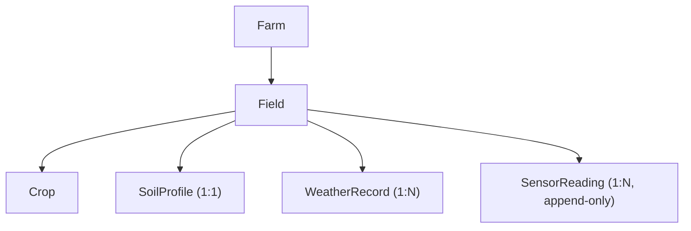

### Architecture Layers Implemented

```
app/core/enums.py                            ← Shared SensorType enum
app/db/models/sensor_reading.py              ← ORM model
app/db/migrations/versions/006_create...py  ← Alembic migration
app/schemas/sensor_reading.py               ← Pydantic schemas (no Update)
app/db/repositories/sensor_reading.py       ← Repository
app/services/sensor_reading.py              ← Service
app/api/sensor_readings/router.py           ← API router
app/api/deps.py                             ← SensorReadingServiceDep added
```

### Repository Decisions

`SensorReadingRepository` deliberately differs from `WeatherRecordRepository` in one key way: `list_by_field` has **no** `limit` / `offset` parameters (ADR-007-21, pagination deferred for Phase 7). The repository signature makes this explicit:

```python
async def list_by_field(self, field_id: uuid.UUID) -> list[SensorReading]:
    ...
```

`update` is inherited from `BaseRepository` but is **not re-declared** on the concrete class. The immutability contract is documented in the module docstring. Future service layer enforcement prevents `update` from being called.

### Database Changes

```sql
-- Migration: 006_create_sensor_readings_table

CREATE TYPE sensor_type AS ENUM (
    'SOIL_MOISTURE', 'SOIL_TEMPERATURE', 'AIR_TEMPERATURE', 'AIR_HUMIDITY',
    'LIGHT_INTENSITY', 'LEAF_WETNESS', 'ELECTRICAL_CONDUCTIVITY',
    'SOIL_SALINITY', 'WATER_LEVEL', 'BATTERY_STATUS', 'DEVICE_HEALTH'
);

CREATE TABLE sensor_readings (
    id              UUID PRIMARY KEY,
    field_id        UUID NOT NULL,
    sensor_type     sensor_type NOT NULL,
    sensor_value    DOUBLE PRECISION NOT NULL,
    unit            VARCHAR(50) NOT NULL,
    recorded_at     TIMESTAMPTZ NOT NULL,
    notes           TEXT,
    created_at      TIMESTAMPTZ NOT NULL DEFAULT now(),
    updated_at      TIMESTAMPTZ NOT NULL DEFAULT now(),
    CONSTRAINT fk_sensor_readings_field_id
        FOREIGN KEY (field_id) REFERENCES fields(id) ON DELETE CASCADE,
    CONSTRAINT pk_sensor_readings PRIMARY KEY (id)
);

-- Individual indexes
CREATE INDEX ix_sensor_readings_field_id    ON sensor_readings(field_id);
CREATE INDEX ix_sensor_readings_sensor_type ON sensor_readings(sensor_type);
CREATE INDEX ix_sensor_readings_recorded_at ON sensor_readings(recorded_at);

-- Compound indexes (primary telemetry access patterns)
CREATE INDEX ix_sensor_readings_field_id_recorded_at
    ON sensor_readings(field_id, recorded_at);
CREATE INDEX ix_sensor_readings_sensor_type_recorded_at
    ON sensor_readings(sensor_type, recorded_at);
```

**Why `ON DELETE CASCADE`?** Consistent with `cascade="all, delete-orphan"` on the ORM relationship. A Field deletion atomically removes all its sensor readings at the DB level.

### API Changes

```http
POST   /api/v1/fields/{field_id}/sensor-readings     201 Created
GET    /api/v1/fields/{field_id}/sensor-readings     200 OK (recorded_at DESC)
GET    /api/v1/sensor-readings/{sensor_reading_id}   200 OK
DELETE /api/v1/sensor-readings/{sensor_reading_id}  204 No Content
```

**No PATCH. No PUT.** Documented in the router module docstring referencing ADR-007-32.

### Exception → HTTP Mapping

| Exception | HTTP Status | Reason |
|---|---|---|
| `FieldNotFoundError` | 404 | Parent field does not exist |
| `SensorReadingNotFoundError` | 404 | Reading does not exist |
| `InvalidSensorTimestampError` (naive) | 422 | Timezone-naive timestamp is unprocessable |
| `InvalidSensorTimestampError` (future) | 422 | Future timestamp is unprocessable |

### Validation Rules

```
1. Field must exist before reading creation
2. recorded_at must not be None (handled by Pydantic schema)
3. recorded_at must be timezone-aware (ADR-007-25)
4. recorded_at must not be in the future (ADR-007-24)
5. No sensor value range validation — belongs to future ingestion service
```

### Service Extension Point

```python
# In create_sensor_reading(), after successful persistence:

# ── Future extension point (ADR-007-26) ───────────────────────────────────
# This is the intended boundary for the following integrations.
# Do NOT implement here; wire in a dedicated event-publishing adapter:
#
# - SensorReadingCreated event → Redpanda / Kafka topic
# - Digital Twin field-state update
# - CQRS read-model projection (e.g. latest reading per sensor_type)
# - GaaS orchestration trigger
# - Temporal workflow initiation (e.g. alert evaluation pipeline)
```

### AI Readiness Impact

Phase 7 sensor readings directly address several critical AI data gaps:

| Sensor Type | AI Capability Unlocked |
|---|---|
| `SOIL_MOISTURE` | Irrigation optimisation (P3) — the primary missing state variable |
| `SOIL_TEMPERATURE` | Disease prediction (P2) — root disease models |
| `LEAF_WETNESS` | Disease prediction (P2) — fungal infection epidemiology |
| `AIR_TEMPERATURE` | GDD accumulation (P1) — yield prediction inputs |
| `ELECTRICAL_CONDUCTIVITY` | Soil salinity monitoring — precision agriculture |
| `LIGHT_INTENSITY` | Solar radiation proxy — ET₀ calculation (P1) |

### ADRs Introduced

| ADR | Decision |
|---|---|
| ADR-007-17 | Repository owns persistence, not intelligence |
| ADR-007-18 | Telemetry queries return latest readings first (`ORDER BY recorded_at DESC`) |
| ADR-007-19 | SensorReading supports DELETE but not UPDATE |
| ADR-007-20 | Repository is event-agnostic — no Redpanda publishing from repository layer |
| ADR-007-21 | Phase 7 returns all readings for a field; pagination deferred |
| ADR-007-22 | Service layer owns telemetry intelligence (timestamp validation, future rules) |
| ADR-007-23 | Field must exist before telemetry creation |
| ADR-007-24 | Future timestamps are rejected |
| ADR-007-25 | Telemetry timestamps must be timezone-aware; naive datetimes are rejected |
| ADR-007-26 | Service layer is the future event publishing boundary |
| ADR-007-27 | Historical telemetry cannot be mutated |
| ADR-007-28 | Telemetry supports administrative deletion but not modification |
| ADR-007-29 | SensorReading API: POST + GET + DELETE; no PATCH, no PUT |
| ADR-007-30 | Telemetry responses return newest readings first |
| ADR-007-31 | Administrative deletion returns 204 No Content |
| ADR-007-32 | SensorReading is immutable; no PATCH endpoint |
| ADR-007-33 | Domain exceptions are translated to HTTP responses inside routers |

### Lessons Learned

- Shared enums in a dedicated `app/core/enums.py` module prevent circular imports and enable reuse across future domains without touching ORM model files.
- The two-phase timestamp validation (timezone first, then future check) has a specific ordering reason: a naive datetime cannot be safely compared to a UTC timestamp.
- Explicit `op.execute(sa.text("CREATE TYPE ..."))` for enum lifecycle management in Alembic is safer than implicit creation — it gives full control over both upgrade and downgrade paths.
- `DOUBLE PRECISION` vs `NUMERIC` is a meaningful choice for telemetry. Fixed-scale types are correct for accounting; floating-point is correct for sensor physics.

---

## 11. Current Domain Architecture (Post Phase 7)

### Complete Entity Relationship

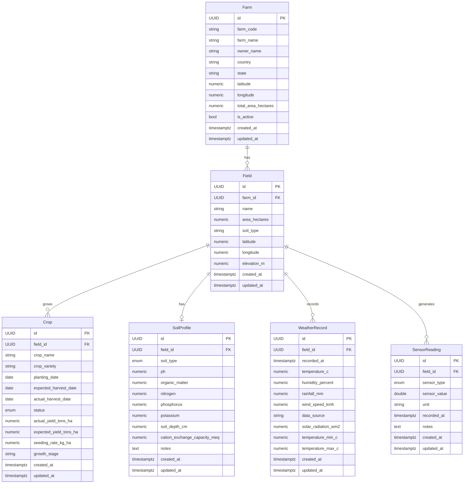

### Complete Migration History

| Migration | Change | Revision |
|---|---|---|
| `001_create_farms_table` | Farm table | `001` |
| `002_create_fields_table` | Field table | `002` |
| `003_create_crops_table` | Crop table + `crop_status` enum | `5c2d8e3f7a19` |
| `13aabbe35d51_add_soil_profiles_table` | SoilProfile table + `soil_type` enum | `13aabbe35d51` |
| `004_create_weather_records_table` | WeatherRecord table | `7d4f2a9b1e63` |
| `005_add_p1_ai_readiness_columns` | P1 AI columns across 4 tables | `f3a8c1d9e047` |
| `006_create_sensor_readings_table` | SensorReading table + `sensor_type` enum | `a8f3d1b6e924` |

### Complete API Surface (Post Phase 7)

```
Health
  GET  /api/v1/health/live
  GET  /api/v1/health/ready

Version
  GET  /api/v1/version

Fields
  POST   /api/v1/farms/{farm_id}/fields
  GET    /api/v1/farms/{farm_id}/fields
  GET    /api/v1/fields/{field_id}
  PATCH  /api/v1/fields/{field_id}
  DELETE /api/v1/fields/{field_id}

Crops
  POST   /api/v1/fields/{field_id}/crops
  GET    /api/v1/fields/{field_id}/crops
  GET    /api/v1/crops/{crop_id}
  PATCH  /api/v1/crops/{crop_id}
  DELETE /api/v1/crops/{crop_id}

Soil Profiles
  POST   /api/v1/fields/{field_id}/soil-profile
  GET    /api/v1/fields/{field_id}/soil-profile
  PATCH  /api/v1/soil-profiles/{soil_profile_id}
  DELETE /api/v1/soil-profiles/{soil_profile_id}

Weather Records
  POST   /api/v1/fields/{field_id}/weather-records
  GET    /api/v1/fields/{field_id}/weather-records
  GET    /api/v1/weather-records/{weather_record_id}
  PATCH  /api/v1/weather-records/{weather_record_id}
  DELETE /api/v1/weather-records/{weather_record_id}

Sensor Readings
  POST   /api/v1/fields/{field_id}/sensor-readings
  GET    /api/v1/fields/{field_id}/sensor-readings
  GET    /api/v1/sensor-readings/{sensor_reading_id}
  DELETE /api/v1/sensor-readings/{sensor_reading_id}
```

---

## 12. Future Architecture: TimescaleDB

### Problem Statement

As IoT networks scale to hundreds of sensors per field, `sensor_readings` will accumulate millions of rows per week. Standard B-tree indexes on `recorded_at` degrade under continuous time-series append loads. Analytical queries (e.g. "average soil moisture per hour over 90 days") require full table scans that PostgreSQL cannot optimize beyond sequential scan.

### What TimescaleDB Provides

TimescaleDB is a PostgreSQL extension that transparently partitions tables by time using **hypertables**. A hypertable appears to the application as a standard PostgreSQL table but internally stores data in time-ordered chunks, each of which can be independently indexed, compressed, and queried.

Key capabilities:
- **Automatic partitioning** by `recorded_at` into configurable chunk intervals (e.g. 1 week)
- **Chunk exclusion**: queries with `WHERE recorded_at BETWEEN` skip irrelevant chunks entirely
- **Continuous aggregates**: materialised views that auto-update as new data arrives
- **Data retention policies**: automatic chunk expiry after configurable TTL
- **Columnar compression**: 20–100× storage reduction for cold data

### Migration Path

The AGRIFLOW-AI `sensor_readings` table was intentionally designed for TimescaleDB promotion:

```sql
-- Step 1: Install TimescaleDB extension
CREATE EXTENSION IF NOT EXISTS timescaledb;

-- Step 2: Convert sensor_readings to a hypertable
-- The partition key maps directly to our existing recorded_at column
SELECT create_hypertable(
    'sensor_readings',
    'recorded_at',
    chunk_time_interval => INTERVAL '1 week',
    migrate_data => TRUE
);
```

**Zero application code changes required.** The ORM model, repository, service, and API layers remain completely unchanged. `list_by_field` with `ORDER BY recorded_at DESC` naturally aligns with the hypertable scan direction.

### Continuous Aggregates (Future)

```sql
-- Example: hourly average soil moisture per field
CREATE MATERIALIZED VIEW sensor_readings_hourly
WITH (timescaledb.continuous) AS
SELECT
    field_id,
    sensor_type,
    time_bucket('1 hour', recorded_at) AS bucket,
    AVG(sensor_value)                  AS avg_value,
    MIN(sensor_value)                  AS min_value,
    MAX(sensor_value)                  AS max_value,
    COUNT(*)                           AS reading_count
FROM sensor_readings
GROUP BY field_id, sensor_type, bucket;
```

This aggregate would be queried by a future `SensorAggregationRepository` without touching the `SensorReadingRepository`.

### Architecture Impact

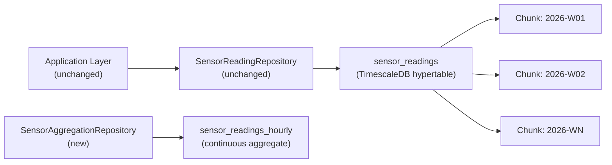

### Readiness Assessment

`sensor_readings` is **100% ready** for TimescaleDB promotion as designed. The only structural requirement — a `NOT NULL TIMESTAMPTZ` partition key — is already satisfied by `recorded_at`.

---

## 13. Future Architecture: Apache Cassandra

### Problem Statement

At agricultural scale (thousands of farms, millions of fields, billions of sensor readings per year), a single PostgreSQL instance — even with TimescaleDB — reaches vertical scaling limits. Cassandra provides linear horizontal scaling, multi-datacenter replication, and write throughput that relational databases cannot match.

### Cassandra Data Model

Cassandra requires thinking in access patterns, not relationships. The `list_by_field` access pattern maps directly to Cassandra's partition model:

```cql
-- Primary table: all readings for a field, newest first
CREATE TABLE sensor_readings_by_field (
    field_id      UUID,
    recorded_at   TIMESTAMP,
    id            UUID,
    sensor_type   TEXT,
    sensor_value  DOUBLE,
    unit          TEXT,
    notes         TEXT,
    created_at    TIMESTAMP,
    PRIMARY KEY ((field_id), recorded_at, id)
) WITH CLUSTERING ORDER BY (recorded_at DESC, id ASC)
  AND compaction = { 'class': 'TimeWindowCompactionStrategy',
                     'compaction_window_unit': 'DAYS',
                     'compaction_window_size': 7 };

-- Secondary table: all readings by sensor type
CREATE TABLE sensor_readings_by_type (
    sensor_type   TEXT,
    recorded_at   TIMESTAMP,
    field_id      UUID,
    id            UUID,
    sensor_value  DOUBLE,
    unit          TEXT,
    PRIMARY KEY ((sensor_type), recorded_at, field_id)
) WITH CLUSTERING ORDER BY (recorded_at DESC, field_id ASC);
```

### Migration Strategy

A CQRS split (see Section 14) enables incremental migration:

1. PostgreSQL remains the write store initially
2. Cassandra is introduced as the read store
3. A Redpanda consumer projects writes to Cassandra asynchronously
4. Read traffic is migrated to Cassandra `SensorReadingCassandraRepository`
5. PostgreSQL `sensor_readings` is deprecated for reads

### Application Layer Impact

A Cassandra migration requires introducing a new repository implementation but **no service or API changes**:

```python
# New file: app/db/repositories/sensor_reading_cassandra.py
class SensorReadingCassandraRepository:
    """Cassandra-backed implementation of the SensorReading read model."""

    async def list_by_field(self, field_id: UUID) -> list[SensorReadingReadModel]:
        # CQL: SELECT * FROM sensor_readings_by_field WHERE field_id = ?
        ...

    async def get_by_id(self, reading_id: UUID) -> SensorReadingReadModel | None:
        ...
```

The service receives whichever repository is injected via `deps.py`. No service code changes.

---

## 14. Future Architecture: CQRS

### Problem Statement

As AGRIFLOW-AI adds AI inference services, dashboards, and Digital Twin consumers, the read and write patterns for sensor data diverge dramatically:

- **Writes**: single reading, validated, appended, event published
- **Reads**: latest reading per type, hourly aggregates, anomaly detection windows, AI feature vectors

A single `SensorReadingRepository` serving both patterns becomes a performance bottleneck and a design coupling point.

### CQRS Split

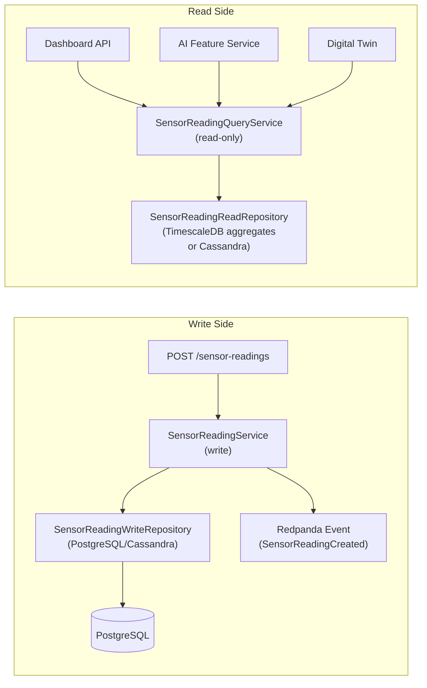

### Implementation Plan

**Phase 1**: Introduce the `SensorReadingCreated` domain event object. No publishing yet.

**Phase 2**: Add Redpanda publisher at the service layer extension point (already marked with a comment in `create_sensor_reading`).

**Phase 3**: Add `SensorReadingReadRepository` backed by TimescaleDB continuous aggregates or Cassandra.

**Phase 4**: Route read-side consumers to `SensorReadingReadRepository`.

**Phase 5**: Deprecate read operations from `SensorReadingRepository`.

### Impact on Current Architecture

Current write-side code is **already CQRS-ready**:
- `SensorReadingRepository` only needs `create` and `delete` for write operations
- `list_by_field` and `get_by_id` are already semantically read-side
- The future extension point comment in `create_sensor_reading` marks where event publishing goes

---

## 15. Future Architecture: Redpanda / Kafka

### Problem Statement

Multiple downstream consumers need to react to new sensor readings: Digital Twin updater, AI anomaly detector, alert evaluator, dashboard notifier. Implementing these as synchronous calls in `SensorReadingService.create_sensor_reading` would couple the write path to every consumer and make the ingestion endpoint as slow as the slowest downstream.

### Event-Driven Architecture

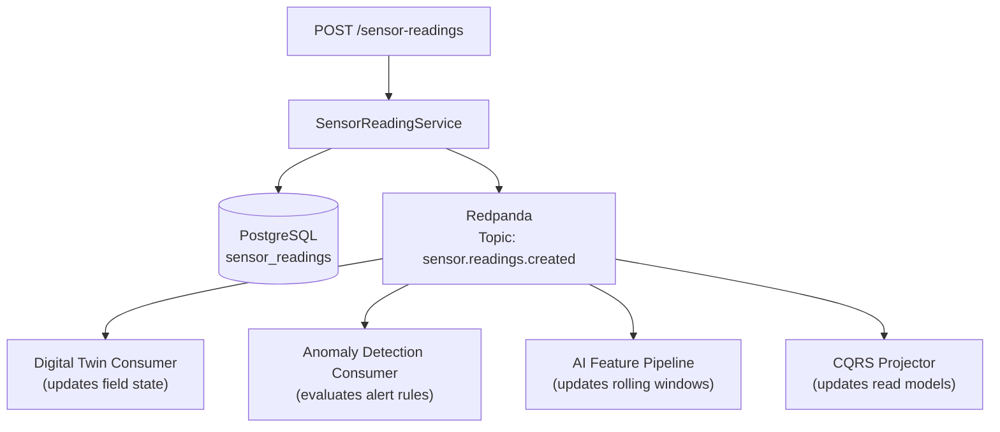

### Event Schema

```python
# app/events/sensor_reading.py (future)
@dataclass
class SensorReadingCreated:
    event_id:          UUID
    sensor_reading_id: UUID
    field_id:          UUID
    farm_id:           UUID
    sensor_type:       SensorType   # from app.core.enums
    sensor_value:      float
    unit:              str
    recorded_at:       datetime
    occurred_at:       datetime     # event publication time
```

### Service Layer Integration

The extension point comment in `create_sensor_reading` becomes:

```python
# After successful persistence:
event = SensorReadingCreated(
    event_id=uuid.uuid4(),
    sensor_reading_id=reading.id,
    field_id=field_id,
    sensor_type=payload.sensor_type,
    sensor_value=payload.sensor_value,
    unit=payload.unit,
    recorded_at=payload.recorded_at,
    occurred_at=datetime.now(timezone.utc),
)
await self._event_publisher.publish("sensor.readings.created", event)
```

The `_event_publisher` is injected via the constructor — the service layer remains testable without a real Redpanda instance.

### Readiness in Current Architecture

The current `SensorReadingService` constructor already accepts repositories via injection. Adding an `event_publisher` parameter follows the same pattern:

```python
def __init__(
    self,
    sensor_reading_repository: SensorReadingRepository,
    field_repository: FieldRepository,
    event_publisher: Optional[EventPublisher] = None,  # future
) -> None:
```

---

## 16. Future Architecture: Temporal Workflows

### Problem Statement

Sensor alert evaluation is a stateful, multi-step process:
1. A soil moisture reading arrives below threshold
2. Wait N minutes and check if the condition persists
3. If still below threshold, generate an irrigation recommendation
4. Notify the farm operator
5. Wait for acknowledgement
6. Auto-escalate if unacknowledged after TTL

This workflow involves timers, retries, and state — exactly what Temporal is designed for.

### Temporal Integration Point

The extension point in `create_sensor_reading` triggers a Temporal workflow:

```python
# After publishing the Redpanda event, optionally trigger a Temporal workflow
if payload.sensor_type == SensorType.SOIL_MOISTURE:
    await self._temporal_client.start_workflow(
        SoilMoistureAlertWorkflow.run,
        SoilMoistureAlertInput(
            field_id=field_id,
            sensor_reading_id=reading.id,
            sensor_value=payload.sensor_value,
            recorded_at=payload.recorded_at,
        ),
        id=f"soil-moisture-alert-{field_id}-{reading.id}",
        task_queue="alerts",
    )
```

### Temporal Workflow Definition (Future)

```python
@workflow.defn
class SoilMoistureAlertWorkflow:
    @workflow.run
    async def run(self, input: SoilMoistureAlertInput) -> None:
        # Wait 15 minutes for follow-up reading
        await workflow.sleep(timedelta(minutes=15))

        # Check current moisture level
        current = await workflow.execute_activity(
            get_latest_soil_moisture,
            GetLatestInput(field_id=input.field_id),
            start_to_close_timeout=timedelta(seconds=30),
        )

        if current.value < IRRIGATION_THRESHOLD:
            await workflow.execute_activity(
                create_irrigation_recommendation,
                IrrigationInput(field_id=input.field_id),
                start_to_close_timeout=timedelta(seconds=30),
            )
```

### Architecture Impact

Temporal is a side-car concern. The AGRIFLOW-AI application layer is unmodified — only `SensorReadingService` gains an optional Temporal client dependency.

---

## 17. Future Architecture: Digital Twin

### Problem Statement

A Digital Twin of a farm field is a continuously updated virtual model that mirrors the real field's state. When a new soil moisture reading arrives, the Digital Twin's soil moisture state updates. When the AI model predicts disease risk, the Digital Twin reflects the current risk level. Operators and automated systems query the Digital Twin to get the current state of any farm field without querying the raw time-series.

### Digital Twin State Model

```python
@dataclass
class FieldDigitalTwin:
    field_id:           UUID
    farm_id:            UUID
    last_updated:       datetime

    # Current sensor state (latest reading per type)
    soil_moisture:      float | None
    soil_temperature:   float | None
    air_temperature:    float | None
    air_humidity:       float | None
    leaf_wetness:       float | None
    electrical_conductivity: float | None

    # AI inference state
    yield_prediction_tons_ha: float | None
    disease_risk_score:       float | None
    irrigation_recommendation: str | None

    # Operational state
    active_crop:        str | None
    growth_stage:       str | None
    days_to_harvest:    int | None
```

### Update Triggers

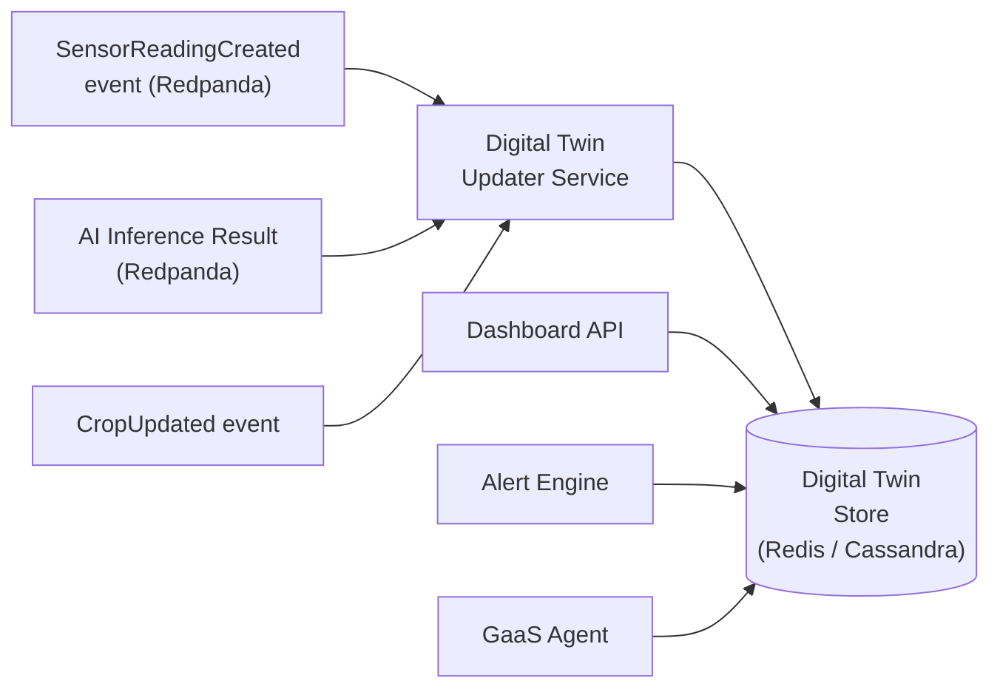

### Application Layer Integration

Phase 7 service extension point enables Digital Twin updates:

```python
# In create_sensor_reading(), after persistence:
if self._digital_twin_service:
    await self._digital_twin_service.update_sensor_state(
        field_id=field_id,
        sensor_type=payload.sensor_type,
        sensor_value=payload.sensor_value,
        recorded_at=payload.recorded_at,
    )
```

The `_digital_twin_service` is optional and injected — production deployments include it; test environments omit it.

### Readiness in Current Architecture

The `SensorType` shared enum in `app/core/enums.py` (established in Phase 7) was designed with the Digital Twin in mind. The enum's 11 values map directly to the `FieldDigitalTwin` state properties.

---

## 18. Future Architecture: Generative-As-A-Service (GaaS)

### Problem Statement

Farmers need conversational, actionable recommendations — not dashboards full of numbers. "My soil moisture sensor shows 18% — should I irrigate?" requires combining the sensor reading, the crop water requirements, the weather forecast, and the soil profile into a natural-language recommendation.

### GaaS Architecture

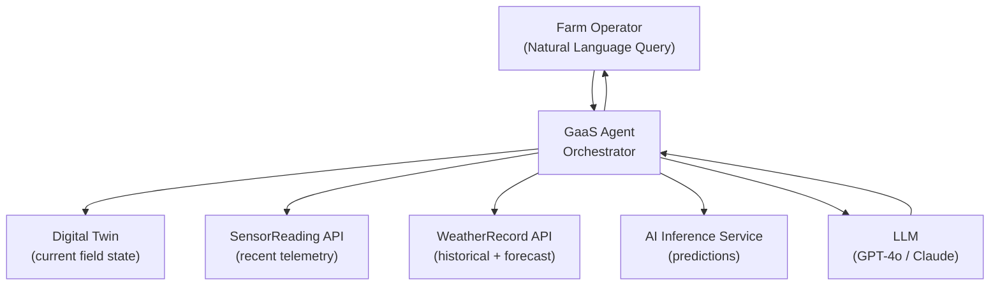

### Tool Integration

The GaaS agent uses the AGRIFLOW-AI API surface as tools:

```python
# GaaS tool definitions
tools = [
    {
        "name": "get_field_sensor_readings",
        "description": "Get the latest sensor readings for a field",
        "parameters": {
            "field_id": "UUID of the field",
            "sensor_type": "Optional sensor type filter",
            "limit": "Number of readings to return"
        }
    },
    {
        "name": "get_field_digital_twin",
        "description": "Get the current state of a field's digital twin",
        "parameters": { "field_id": "UUID of the field" }
    },
    {
        "name": "get_yield_prediction",
        "description": "Get the AI yield prediction for a crop",
        "parameters": { "crop_id": "UUID of the crop" }
    }
]
```

### Readiness in Current Architecture

The AGRIFLOW-AI REST API is already GaaS-ready:
- Structured JSON responses with typed schemas
- OpenAPI documentation auto-generated by FastAPI
- `SensorReadingResponse` includes all context needed for LLM reasoning
- `SensorType` enum values are self-documenting human-readable strings

The only missing piece is the GaaS orchestration layer — the underlying data APIs exist as of Phase 7.

---

## 19. Architecture Decision Register

### All ADRs by Phase

| ADR ID | Phase | Decision |
|---|---|---|
| ADR-001-01 | 1 | UUID v4 as universal primary key |
| ADR-001-02 | 1 | `AuditableModel` mixin on all tables |
| ADR-001-03 | 1 | Alembic as sole mechanism for schema change |
| ADR-001-04 | 1 | Async SQLAlchemy engine throughout |
| ADR-002-01 | 2 | Repository owns persistence only; services own business rules |
| ADR-002-02 | 2 | Transaction commit belongs to session dependency |
| ADR-002-03 | 2 | Domain exceptions are `ValueError` subclasses in the service module |
| ADR-002-04 | 2 | Routers translate domain exceptions to HTTP via `try/except` |
| ADR-002-05 | 2 | Service factories in `deps.py` are the sole DI wiring point |
| ADR-003-01 | 3 | All enums inherit `str` for VARCHAR storage |
| ADR-003-02 | 3 | PostgreSQL ENUM types must be created before their owning tables |
| ADR-003-03 | 3 | Service layer sets business-controlled defaults before repository delegation |
| ADR-003-04 | 3 | Optional query predicates belong in repositories, not services |
| ADR-004-01 | 4 | One-to-one cardinality enforced at DB level (UNIQUE) and service level |
| ADR-004-02 | 4 | `exists_for_field()` probe uses SELECT on PK column only |
| ADR-004-03 | 4 | `scalar_one_or_none()` used to surface accidental constraint violations |
| ADR-005-01 | 5 | Time-series entities use `TIMESTAMPTZ NOT NULL` — never naive TIMESTAMP |
| ADR-005-02 | 5 | Module-level `_validate_xxx()` functions for independently testable validation |
| ADR-005-03 | 5 | Service layer validates physical domain constraints (defence-in-depth) |
| ADR-005-04 | 5 | `list_by_field` returns `ORDER BY recorded_at DESC` |
| ADR-006-01 | 6 | P1 AI attributes are nullable ADD COLUMN — no backfill |
| ADR-006-02 | 6 | Business validation for new attributes added to existing service methods |
| ADR-006-03 | 6 | AI inference write-back fields are written by future inference services |
| ADR-007-17 | 7 | Repository owns persistence, not intelligence |
| ADR-007-18 | 7 | Telemetry queries return latest first |
| ADR-007-19 | 7 | SensorReading supports DELETE but not UPDATE |
| ADR-007-20 | 7 | Repository is event-agnostic |
| ADR-007-21 | 7 | Phase 7 returns all readings; pagination deferred |
| ADR-007-22 | 7 | Service layer owns telemetry intelligence |
| ADR-007-23 | 7 | Field must exist before telemetry creation |
| ADR-007-24 | 7 | Future timestamps are rejected |
| ADR-007-25 | 7 | Timezone-naive datetimes are rejected |
| ADR-007-26 | 7 | Service layer is the future event publishing boundary |
| ADR-007-27 | 7 | Historical telemetry cannot be mutated |
| ADR-007-28 | 7 | Telemetry supports administrative deletion but not modification |
| ADR-007-29 | 7 | SensorReading API: POST + GET + DELETE only |
| ADR-007-30 | 7 | Telemetry responses return newest first |
| ADR-007-31 | 7 | Administrative deletion returns 204 No Content |
| ADR-007-32 | 7 | No PATCH or PUT endpoint for SensorReading |
| ADR-007-33 | 7 | Domain exceptions are translated to HTTP in routers |

---

## 20. Technology Evolution Roadmap

### Current Stack

| Component | Technology | Version |
|---|---|---|
| API Framework | FastAPI | 0.115.5 |
| Language | Python | 3.12 |
| ORM | SQLAlchemy | 2.0.36 |
| Database | PostgreSQL | 17 |
| Schema Migration | Alembic | 1.14.0 |
| Validation | Pydantic | 2.10.3 |
| Driver (async) | asyncpg | 0.30.0 |
| Logging | structlog | 24.4.0 |
| Containerisation | Docker | — |

### Near-Term Additions (Phases 8–11)

| Component | Technology | Purpose |
|---|---|---|
| Time-Series DB | TimescaleDB | Sensor reading hypertables |
| Message Broker | Redpanda | Event streaming |
| Cache | Redis | Digital Twin state store |
| GIS | PostGIS | Field boundary polygons |
| Object Storage | Azure Blob / S3 | Satellite imagery |

### AI Layer (Phases 12–15)

| Component | Technology | Purpose |
|---|---|---|
| ML Framework | scikit-learn / XGBoost | Yield prediction, disease risk |
| Deep Learning | PyTorch / TensorFlow | LSTM time-series models |
| MLOps | MLflow / Azure ML | Model registry, experiment tracking |
| Serving | FastAPI + ONNX | Real-time inference endpoints |
| Workflow | Temporal | Multi-step agricultural workflows |
| LLM | GPT-4o / Claude | GaaS natural language interface |

### Architecture Evolution Path

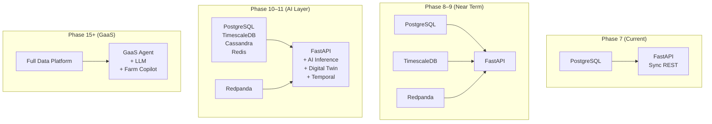

### Domain Roadmap

| Phase | Domain | Key Capability |
|---|---|---|
| ✅ 1 | Foundation | Platform skeleton |
| ✅ 2 | Field | Farm hierarchy |
| ✅ 3 | Crop | Lifecycle management |
| ✅ 4 | Soil | Nutrient intelligence |
| ✅ 5 | Weather | Climate time-series |
| ✅ 6 | AI Readiness | P1 attribute foundation |
| ✅ 7 | Sensor | IoT telemetry |
| 🔜 8 | Irrigation | Water management |
| 🔜 9 | Yield | Harvest intelligence |
| 🔜 10 | Disease Observation | Plant health |
| 🔜 11 | Satellite | Remote sensing |
| 🔮 12 | Yield Prediction Engine | First AI model |
| 🔮 13 | Disease Prediction Engine | Risk scoring |
| 🔮 14 | Irrigation Recommendation | Optimisation |
| 🔮 15 | Farm Intelligence Platform | Full Digital Twin + GaaS |

---

*This document is the authoritative implementation history and architecture reference for AGRIFLOW-AI. It should be updated at the completion of each phase.*

*Last updated: Phase 7 completion — June 2026*
