# AGRIFLOW-AI Architecture Diagrams

**Document:** Architecture Diagrams Reference  
**Version:** 1.1  
**Date:** June 2026  
**Scope:** Current State (Phase 11) and Target State (Phase 15) — visual architecture reference  
**Status:** Living Document  
**Author:** AGRIFLOW-AI Principal Enterprise Architecture

---

## Table of Contents

1. [AGRIFLOW Platform Evolution](#1-agriflow-platform-evolution)
2. [Current Domain Architecture](#2-current-domain-architecture)
3. [Current Clean Architecture](#3-current-clean-architecture)
4. [Current Request Flow](#4-current-request-flow)
5. [Current Database Architecture](#5-current-database-architecture)
6. [Current Sensor Telemetry Architecture](#6-current-sensor-telemetry-architecture)
7. [AI Readiness Architecture](#7-ai-readiness-architecture)
8. [Future Precision Agriculture Architecture](#8-future-precision-agriculture-architecture)
9. [Future Event-Driven Architecture](#9-future-event-driven-architecture)
10. [Future CQRS Architecture](#10-future-cqrs-architecture)
11. [Future TimescaleDB Architecture](#11-future-timescaledb-architecture)
12. [Future Cassandra Architecture](#12-future-cassandra-architecture)
13. [Future Temporal Workflow Architecture](#13-future-temporal-workflow-architecture)
14. [Future Digital Twin Architecture](#14-future-digital-twin-architecture)
15. [Future GaaS Architecture](#15-future-gaas-architecture)
16. [AGRIFLOW Target State Architecture — Phase 15 Vision](#16-agriflow-target-state-architecture--phase-15-vision)

---

## 1. AGRIFLOW Platform Evolution

### Title
AGRIFLOW-AI Platform Evolution — Phase 1 through Phase 11

### Purpose
Illustrate how each completed phase expanded the AGRIFLOW-AI platform from an empty backend foundation into a multi-domain, AI-ready agricultural intelligence system. This diagram captures the strategic trajectory: each phase added a new domain, new infrastructure, or a critical capability layer that unlocked the next phase.

### Explanation
The platform began with zero capability in Phase 1. By Phase 11, it operates a fully layered Clean Architecture with ten domain models, eleven database migrations, an AI readiness attribute set, append-only IoT telemetry, mutable operational event domains, two grandchild crop-cycle observation domains, and one field-anchored Earth observation domain (`SatelliteObservation`). Each vertical column in the diagram represents a phase boundary. Capabilities are cumulative — nothing is removed; each phase builds on all prior phases.

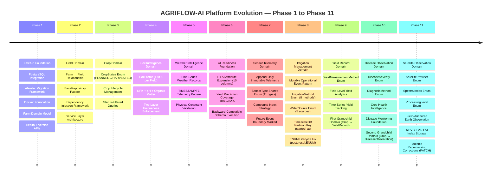

### Key Architectural Observations

- **Phase 1** established the non-negotiable cross-cutting concerns: `AuditableModel`, UUID PKs, Alembic, async SQLAlchemy. Every subsequent phase reuses these without modification.
- **Phase 2** created the five-layer architecture pattern (`Model → Schema → Repository → Service → Router`) that became the immutable template for all future domain additions.
- **Phase 6** was the only phase that did not add a new domain — instead it performed a systematic AI data gap analysis and backfilled the minimum P1 attribute set. This was the most strategically important phase for future AI model training.
- **Phase 7** introduced the first qualitatively different domain: append-only telemetry. The decision to make `SensorReading` immutable and to mark the service layer as the future Redpanda/Digital Twin/Temporal boundary was the platform's first explicit forward-architecture design.
- **Phase 8** introduced the first mutable operational event domain (`IrrigationEvent`) and the authoritative PostgreSQL ENUM lifecycle pattern (`postgresql.ENUM` with `create_type=False`). Both `sensor_readings` and `irrigation_events` are now TimescaleDB-ready.
- **Phase 9** introduced the first grandchild domain (`YieldRecord`), establishing crop-cycle anchoring with denormalized `field_id` for direct field-scoped analytics and time-series yield tracking.
- **Phase 10** extended the grandchild pattern to crop health (`DiseaseObservation`), adding structured disease severity labels and diagnosis method provenance — the primary training label source for the future Disease Risk Scoring Engine.
- **Phase 11** introduced the first field-anchored Earth observation domain (`SatelliteObservation`), storing spectral index values (`SpectralIndex`), satellite provider provenance (`SatelliteProvider`), and processing level metadata (`ProcessingLevel`). Unlike grandchild domains, `SatelliteObservation` anchors directly on `Field` — enabling geospatial analytics without crop-cycle coupling. PATCH is permitted for reprocessing corrections; `field_id` is immutable after creation.

---

## 2. Current Domain Architecture

### Title
AGRIFLOW-AI Current Domain Architecture — Post Phase 11

### Purpose
Show the complete domain model as it exists after Phase 11, including all entities, their relationships, cardinalities, and key attributes. This is the authoritative domain map for current state.

### Explanation
`Farm` is the root aggregate. All domain entities trace their ancestry to a `Farm` via the `Field` pivot. `SoilProfile` has a strict 1:1 cardinality with `Field`. `Crop`, `WeatherRecord`, `SensorReading`, `IrrigationEvent`, and `SatelliteObservation` are 1:N collections per `Field`. `YieldRecord` and `DiseaseObservation` are grandchild domains — they anchor to `Crop` (primary FK) and carry a denormalized `field_id` for direct field-scoped queries. `SensorReading` is the only domain with an explicit immutability contract. `IrrigationEvent`, `YieldRecord`, `DiseaseObservation`, and `SatelliteObservation` are mutable operational observation domains.

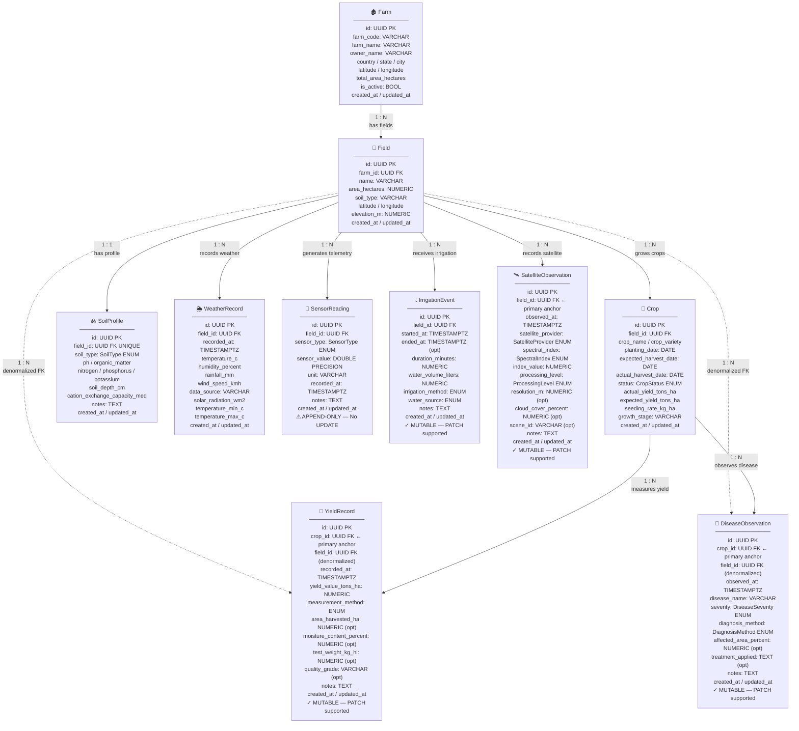

### Key Architectural Observations

- `Farm → Field → {Crop, SoilProfile, WeatherRecord, SensorReading, IrrigationEvent, SatelliteObservation}` is the stable aggregate hierarchy. `YieldRecord` and `DiseaseObservation` introduce grandchild paths: `Farm → Field → Crop → {YieldRecord, DiseaseObservation}`.
- `SoilProfile` is the only 1:1 entity. Its uniqueness is enforced at two levels: `UNIQUE` constraint in PostgreSQL and `DuplicateSoilProfileError` at the service layer.
- `WeatherRecord`, `SensorReading`, `IrrigationEvent`, `YieldRecord`, `DiseaseObservation`, and `SatelliteObservation` are all time-keyed domains with `TIMESTAMPTZ`. All six are TimescaleDB hypertable candidates.
- `SensorReading` is immutable (no PATCH, no UPDATE); `IrrigationEvent`, `YieldRecord`, `DiseaseObservation`, and `SatelliteObservation` are mutable (full CRUD). This contrast reflects the fundamental difference between sensor telemetry (immutable physical fact) and operational management records (correctible human actions or reprocessed observations).
- `YieldRecord` and `DiseaseObservation` are the first entities to carry two parent FKs (`crop_id` primary anchor, `field_id` denormalized). `SatelliteObservation` is field-anchored only — no crop FK — enabling Earth observation analytics independent of crop lifecycle state.
- All ten domain tables carry `created_at` and `updated_at` via `AuditableModel`.

---

## 3. Current Clean Architecture

### Title
AGRIFLOW-AI Current Clean Architecture — Layer Boundaries and Dependency Direction

### Purpose
Illustrate the strict five-layer Clean Architecture that governs every domain in AGRIFLOW-AI. Show the dependency rule: dependencies point inward only — outer layers depend on inner layers, never the reverse.

### Explanation
FastAPI routes are the outermost layer. They accept HTTP requests, validate via Pydantic schemas, and delegate to services. Services own business rules and domain invariants but have no knowledge of SQL. Repositories encapsulate all database access. ORM models define table structures. PostgreSQL is the persistence engine. `deps.py` is the wiring hub — it opens sessions, creates repositories, creates services, and injects them into routes.

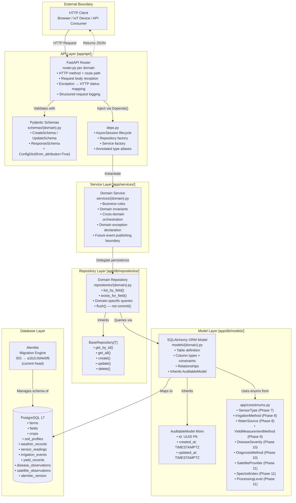

### Key Architectural Observations

- **Dependency inversion is absolute.** `Service` never imports from `Router`. `Repository` never imports from `Service`. This boundary is enforced by convention and code review.
- **`deps.py` is the composition root.** All object construction and wiring happens there. Routes and services are unaware of each other's construction details.
- **`BaseRepository` provides the CRUD contract.** Concrete repositories re-declare inherited methods with typed signatures for IDE and mypy support, but add no new CRUD logic.
- **`AuditableModel` is the universal base.** Adding any new table without inheriting `AuditableModel` is an architectural violation.
- **`app/core/enums.py` is the shared vocabulary layer.** `SensorType` (Phase 7), `IrrigationMethod` / `WaterSource` (Phase 8), `YieldMeasurementMethod` (Phase 9), `DiseaseSeverity` / `DiagnosisMethod` (Phase 10), and `SatelliteProvider` / `SpectralIndex` / `ProcessingLevel` (Phase 11) are placed there to enable reuse by Digital Twin, AI Engine, and GaaS components in future phases.
- **Phase 11 added `SatelliteObservation` across all five layers:** `models/satellite_observation.py` (ORM), `repositories/satellite_observation.py` (`SatelliteObservationRepository`), `services/satellite_observation.py` (`SatelliteObservationService`), `schemas/satellite_observation.py`, and `api/satellite_observations/router.py` — following the identical template established in Phase 2.
- **Phase 10 added `DiseaseObservation` across all five layers:** `models/disease_observation.py` (ORM), `repositories/disease_observation.py` (`DiseaseObservationRepository`), `services/disease_observation.py` (`DiseaseObservationService`), `schemas/disease_observation.py`, and `api/disease_observations/router.py` — following the identical template established in Phase 2.

---

## 4. Current Request Flow

### Title
AGRIFLOW-AI Current Request Flow — Full Lifecycle Sequence

### Purpose
Trace the complete lifecycle of an HTTP request from the moment a client sends it to the moment a JSON response is returned. Show every layer touched, every responsibility exercised, and the transaction boundary.

### Explanation
The sequence diagram uses `POST /api/v1/fields/{field_id}/sensor-readings` as the canonical example — it exercises the most validation steps. The transaction is opened by `deps.py` and committed only on success. If any layer raises an exception, the session context manager performs automatic rollback.

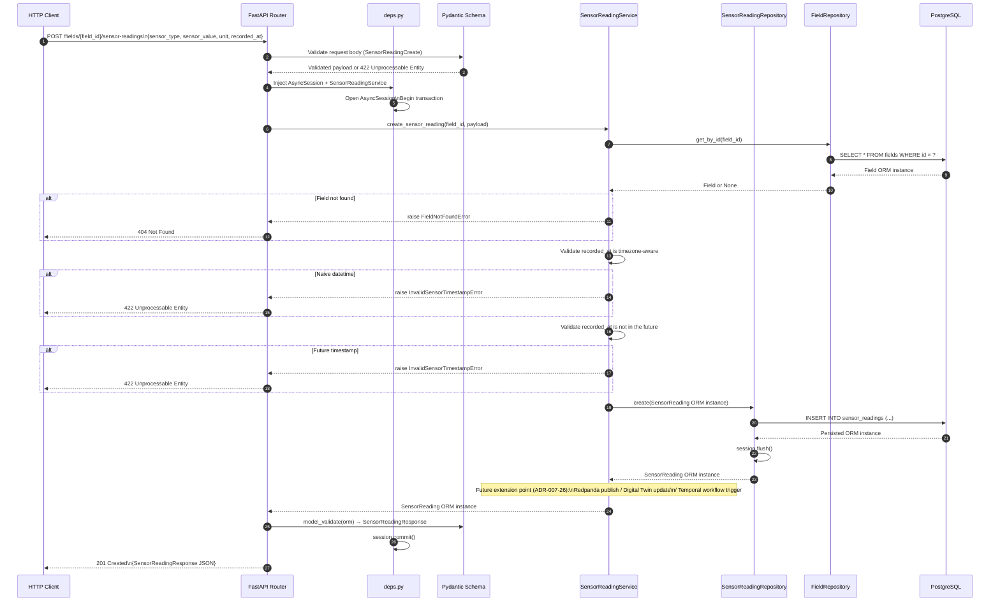

### Key Architectural Observations

- **The transaction is opened and closed exclusively by `deps.py`.** No service or repository calls `commit()` — this is the contract enforced by ADR-002-02.
- **Validation is layered.** Pydantic handles schema-level validation (field presence, type coercion). The service layer re-validates domain invariants (timezone-awareness, future timestamps). Both layers are necessary — Pydantic cannot reject a valid-format datetime that happens to be in the future.
- **The extension point at step 14 is architectural.** It is the intended insertion point for Redpanda publishing, Digital Twin updates, and Temporal workflow triggers. It requires no modification to any business logic above it.
- **Error translation belongs in the router.** Services raise typed domain exceptions. Routers translate them to HTTP status codes via `try/except`. This keeps services ignorant of HTTP semantics.

### Satellite Observation Request Flow (Phase 11 — Mutable Field-Anchored Pattern)

The sequence below uses `POST /api/v1/fields/{field_id}/satellite-observations` as the canonical Phase 11 example. Unlike append-only `SensorReading`, `SatelliteObservation` supports PATCH for reprocessing corrections. `field_id` is resolved at creation and is immutable thereafter.

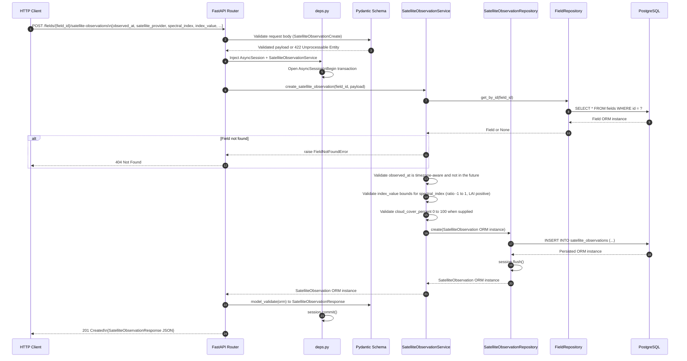

**Phase 11 status:** Implementation ✅ | Validation ⏳ Deferred | Testing ⏳ Deferred (Phase 16)

---

## 5. Current Database Architecture

### Title
AGRIFLOW-AI Current Database Architecture — Tables, Relationships, and Migration Strategy

### Purpose
Show the complete current database schema including all ten domain tables, their foreign key relationships, primary index strategy, and the Alembic migration chain that produced them. This diagram is the DBA reference view of the platform.

### Explanation
All tables use UUID v4 primary keys generated server-side. Foreign keys establish the `Farm → Field → {Crop, SoilProfile, WeatherRecord, SensorReading, IrrigationEvent, SatelliteObservation}` hierarchy, with grandchild domains `YieldRecord` and `DiseaseObservation` anchoring on `Crop` and carrying denormalized `field_id`. PostgreSQL ENUM types are created in separate calls before their owning tables to enable independent lifecycle management. Starting from Phase 8, `postgresql.ENUM` with `create_type=False` is the authoritative enum lifecycle pattern. Alembic migrations are linear and sequential.

```mermaid
erDiagram
    farms {
        UUID id PK
        VARCHAR farm_code
        VARCHAR farm_name
        VARCHAR owner_name
        VARCHAR country
        VARCHAR state
        VARCHAR city
        NUMERIC latitude
        NUMERIC longitude
        NUMERIC total_area_hectares
        BOOL is_active
        TIMESTAMPTZ created_at
        TIMESTAMPTZ updated_at
    }

    fields {
        UUID id PK
        UUID farm_id FK
        VARCHAR name
        NUMERIC area_hectares
        VARCHAR soil_type
        NUMERIC latitude
        NUMERIC longitude
        NUMERIC elevation_m
        TIMESTAMPTZ created_at
        TIMESTAMPTZ updated_at
    }

    crops {
        UUID id PK
        UUID field_id FK
        VARCHAR crop_name
        VARCHAR crop_variety
        DATE planting_date
        DATE expected_harvest_date
        DATE actual_harvest_date
        crop_status status
        NUMERIC actual_yield_tons_ha
        NUMERIC expected_yield_tons_ha
        NUMERIC seeding_rate_kg_ha
        VARCHAR growth_stage
        TIMESTAMPTZ created_at
        TIMESTAMPTZ updated_at
    }

    soil_profiles {
        UUID id PK
        UUID field_id FK_UNIQUE
        soil_type soil_type
        NUMERIC ph
        NUMERIC organic_matter
        NUMERIC nitrogen
        NUMERIC phosphorus
        NUMERIC potassium
        NUMERIC soil_depth_cm
        NUMERIC cation_exchange_capacity_meq
        TEXT notes
        TIMESTAMPTZ created_at
        TIMESTAMPTZ updated_at
    }

    weather_records {
        UUID id PK
        UUID field_id FK
        TIMESTAMPTZ recorded_at
        NUMERIC temperature_c
        NUMERIC humidity_percent
        NUMERIC rainfall_mm
        NUMERIC wind_speed_kmh
        VARCHAR data_source
        NUMERIC solar_radiation_wm2
        NUMERIC temperature_min_c
        NUMERIC temperature_max_c
        TIMESTAMPTZ created_at
        TIMESTAMPTZ updated_at
    }

    sensor_readings {
        UUID id PK
        UUID field_id FK
        sensor_type sensor_type
        DOUBLE_PRECISION sensor_value
        VARCHAR unit
        TIMESTAMPTZ recorded_at
        TEXT notes
        TIMESTAMPTZ created_at
        TIMESTAMPTZ updated_at
    }

    irrigation_events {
        UUID id PK
        UUID field_id FK
        TIMESTAMPTZ started_at
        TIMESTAMPTZ ended_at
        NUMERIC duration_minutes
        NUMERIC water_volume_liters
        irrigation_method irrigation_method
        water_source water_source
        TEXT notes
        TIMESTAMPTZ created_at
        TIMESTAMPTZ updated_at
    }

    yield_records {
        UUID id PK
        UUID crop_id FK
        UUID field_id FK
        TIMESTAMPTZ recorded_at
        NUMERIC yield_value_tons_ha
        yield_measurement_method measurement_method
        NUMERIC area_harvested_ha
        NUMERIC moisture_content_percent
        NUMERIC test_weight_kg_hl
        VARCHAR quality_grade
        TEXT notes
        TIMESTAMPTZ created_at
        TIMESTAMPTZ updated_at
    }

    disease_observations {
        UUID id PK
        UUID crop_id FK
        UUID field_id FK
        TIMESTAMPTZ observed_at
        VARCHAR disease_name
        disease_severity severity
        diagnosis_method diagnosis_method
        NUMERIC affected_area_percent
        TEXT treatment_applied
        TEXT notes
        TIMESTAMPTZ created_at
        TIMESTAMPTZ updated_at
    }

    satellite_observations {
        UUID id PK
        UUID field_id FK
        TIMESTAMPTZ observed_at
        satellite_provider satellite_provider
        spectral_index spectral_index
        NUMERIC index_value
        processing_level processing_level
        NUMERIC resolution_m
        NUMERIC cloud_cover_percent
        VARCHAR scene_id
        TEXT notes
        TIMESTAMPTZ created_at
        TIMESTAMPTZ updated_at
    }

    farms ||--o{ fields : "has"
    fields ||--o{ crops : "grows"
    fields ||--o| soil_profiles : "has profile"
    fields ||--o{ weather_records : "records"
    fields ||--o{ sensor_readings : "generates"
    fields ||--o{ irrigation_events : "receives"
    fields ||--o{ yield_records : "yields (denormalized)"
    fields ||--o{ disease_observations : "disease history (denormalized)"
    fields ||--o{ satellite_observations : "observes"
    crops ||--o{ yield_records : "measures"
    crops ||--o{ disease_observations : "observes"
```

### Migration Chain

```mermaid
graph LR
    M1["001\ncreate_farms_table\nFarm table\nUUID PK strategy"]
    M2["002\ncreate_fields_table\nField table\nfarm_id FK\nix_fields_farm_id"]
    M3["003\ncreate_crops_table\ncrop_status ENUM\nCrop table\nix_crops_field_id"]
    M4["13aabbe35d51\nadd_soil_profiles_table\nsoil_type ENUM\nsoil_profiles UNIQUE field_id"]
    M5["004\ncreate_weather_records_table\nWeatherRecord table\nix_recorded_at"]
    M6["005\nadd_p1_ai_readiness_columns\nADD COLUMN x10\n4 tables extended"]
    M7["006\ncreate_sensor_readings_table\nsensor_type ENUM\n5 indexes incl. compound"]
    M8["235a51cdf901\ncreate_irrigation_events_table\nirrigation_method ENUM\nwater_source ENUM\n3 indexes incl. compound"]
    M9["b7e2a9f4c8d3\ncreate_yield_records_table\nyield_measurement_method ENUM\n4 indexes incl. compound"]
    M10["d3e7b2a9f1c4\ncreate_disease_observations_table\ndisease_severity ENUM\ndiagnosis_method ENUM\n6 indexes incl. compound"]
    M11["a1b2c3d4e5f6\ncreate_satellite_observations_table\nsatellite_provider ENUM\nspectral_index ENUM\nprocessing_level ENUM\n7 indexes incl. compound"]

    M1 --> M2 --> M3 --> M4 --> M5 --> M6 --> M7 --> M8 --> M9 --> M10 --> M11
    M11 --> HEAD["HEAD\na1b2c3d4e5f6\n(current)"]
```

### Key Architectural Observations

- **All time-series tables index their primary time key.** `weather_records`, `sensor_readings`, `irrigation_events`, `yield_records`, `disease_observations`, and `satellite_observations` each have individual time indexes. `sensor_readings`, `irrigation_events`, `yield_records`, `disease_observations`, and `satellite_observations` add compound `(parent_id, time_key)` or `(spectral_index, observed_at)` indexes — the primary AI feature pipeline access pattern.
- **`soil_profiles.field_id` carries a `UNIQUE` constraint**, not a `UNIQUE INDEX`. The `UNIQUE` constraint is supplemented by a `UNIQUE INDEX` for explicit index naming.
- **Migration 005 used `ADD COLUMN` with no server defaults.** Adding nullable columns to existing tables with large row counts is instantaneous on PostgreSQL 11+ (metadata-only operation). This is the only safe strategy for live production schema evolution.
- **All Field children use `ON DELETE CASCADE`.** Deleting a `Field` atomically removes all its children at the database level.
- **Phase 8 established `postgresql.ENUM` as the authoritative enum migration pattern.** All future migrations must use `postgresql.ENUM` with `create_type=False` + explicit `.create()` / `.drop()` calls.

---

## 6. Current Sensor Telemetry Architecture

### Title
AGRIFLOW-AI Sensor Telemetry Architecture — Phase 7 IoT Data Ingestion Pipeline

### Purpose
Show how sensor data flows from IoT field devices through the ingestion API into immutable PostgreSQL storage, and illustrate the extension points where future event-driven components will be wired.

### Explanation
Phase 7 introduced the first real-time telemetry capability. IoT gateways submit sensor readings via REST. The API layer validates, the service layer enforces immutability rules (timezone-awareness, no future timestamps), and the repository persists to `sensor_readings`. The service contains a documented extension point (ADR-007-26) marking where Redpanda publishing, Digital Twin updates, and Temporal triggers will connect in future phases — without modifying the current business logic.

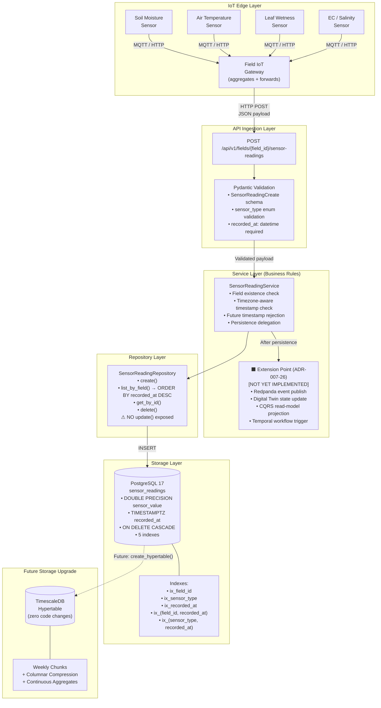

### Key Architectural Observations

- **Immutability is the defining characteristic of `SensorReading`.** No `PATCH` or `PUT` endpoint exists. The API router module docstring explicitly references ADR-007-32. Corrections to erroneous readings are expressed as new readings, not modifications.
- **`DOUBLE PRECISION` was chosen deliberately over `NUMERIC`.** Sensor ADC outputs and physical unit measurements (mV, µS/cm, lux) require IEEE 754 64-bit floating-point precision. Fixed-scale `NUMERIC` would silently truncate high-resolution readings.
- **The extension point is a zero-cost future capability.** Adding Redpanda publishing requires no changes to validation logic, field existence checks, or timestamp validation. The extension point is below all business logic.
- **TimescaleDB promotion requires zero application changes.** The `sensor_readings` table satisfies TimescaleDB's only structural requirement: a `NOT NULL TIMESTAMPTZ` partition column (`recorded_at`). `create_hypertable()` is a single SQL call.

---

## 7. AI Readiness Architecture

### Title
AGRIFLOW-AI AI Readiness Architecture — Data Feeds and Model Coverage

### Purpose
Show how the current data domains combine to feed four target AI use cases, and visualize the AI data coverage achieved after Phase 11 completion.

### Explanation
Phase 6 conducted a systematic gap analysis across every planned AI use case. The result was a prioritized attribute roadmap. 10 P1 attributes were added across 4 domains, raising yield prediction coverage from 18% to 82%. Phases 8–11 subsequently added `IrrigationEvent`, `YieldRecord`, `DiseaseObservation`, and `SatelliteObservation` domains, closing the major structural gaps for irrigation optimisation, yield prediction, disease monitoring, and remote sensing feature pipelines. The diagram shows the data-to-AI mapping and the current coverage state.

```mermaid
graph TB
    subgraph "Current Data Domains"
        FARM["🏚 Farm\n• GPS coordinates\n• total_area_hectares\n• country / climate zone"]
        FIELD["🌾 Field\n• latitude / longitude\n• elevation_m\n• area_hectares\n• soil_type"]
        CROP["🌱 Crop\n• crop_name / variety\n• planting_date\n• actual_harvest_date\n• actual_yield_tons_ha ✦\n• expected_yield_tons_ha ✦\n• seeding_rate_kg_ha ✦\n• growth_stage ✦"]
        SOIL["🪨 SoilProfile\n• NPK levels\n• pH / organic_matter\n• soil_depth_cm ✦\n• CEC meq ✦"]
        WEATHER["🌦 WeatherRecord\n• temperature_c / min / max ✦\n• humidity_percent\n• rainfall_mm\n• solar_radiation_wm2 ✦\n• wind_speed_kmh"]
        SENSOR["📡 SensorReading\n• SOIL_MOISTURE\n• SOIL_TEMPERATURE\n• AIR_TEMPERATURE\n• LEAF_WETNESS\n• ELECTRICAL_CONDUCTIVITY\n• LIGHT_INTENSITY\n• BATTERY_STATUS"]
        IRR["💧 IrrigationEvent ✅\n• started_at / ended_at\n• water_volume_liters\n• irrigation_method\n• water_source"]
        YIELD_D["🌾 YieldRecord ✅\n• yield_value_tons_ha\n• measurement_method\n• moisture_content_percent\n• quality_grade"]
        DISEASE_D["🦠 DiseaseObservation ✅\n• disease_name\n• severity (DiseaseSeverity)\n• diagnosis_method\n• affected_area_percent\n• observed_at"]
        SAT_D["🛰 SatelliteObservation ✅\n• spectral_index (NDVI/EVI/LAI)\n• index_value\n• satellite_provider\n• cloud_cover_percent\n• observed_at"]
    end

    subgraph "AI Use Cases — Current Coverage"
        YIELD["🌾 Yield Prediction\nCoverage: 100% ✅\n(was 18% pre-Phase 6)\nKey features: yield history,\nGDD inputs, seeding rate,\nsoil profile, weather,\ngranular YieldRecord labels,\nsatellite NDVI/EVI"]
        DISEASE["🦠 Disease Prediction\nCoverage: 90% 🟡\nKey gaps: multi-point LEAF_WETNESS\ntime-series depth"]
        IRRIGATION["💧 Irrigation Optimization\nCoverage: 85% 🟡\nKey gaps: ET₀ calc,\nfield capacity model"]
        WEATHER_AI["⛅ Weather Intelligence\nCoverage: 65% 🟡\nKey gaps: vapor pressure\ndeficit, atmospheric pressure,\nforecast integration"]
    end

    subgraph "Phase 11 — Remote Sensing (Implemented)"
        SAT["SatelliteObservation ✅\n• ndvi / evi / lai\n• cloud_cover\n• observed_at"]
    end

    FARM & FIELD & CROP --> YIELD
    SOIL & WEATHER & SENSOR --> YIELD
    YIELD_D --> YIELD
    SAT_D --> YIELD
    CROP & WEATHER & SENSOR --> DISEASE
    DISEASE_D --> DISEASE
    SAT_D --> DISEASE
    SOIL & SENSOR & IRR --> IRRIGATION
    WEATHER & SENSOR --> WEATHER_AI

    SAT -.->|"NDVI trend vectors"| DISEASE
    SAT -.->|"Remote sensing yield maps"| YIELD
```

> ✦ = P1 AI attribute added in Phase 6 migration 005

### Key Architectural Observations

- **Yield Prediction reached 100% structural coverage** after Phase 9 and was strengthened by Phase 11. `YieldRecord` provides granular time-series yield labels with measurement method provenance — the primary training label source for the Phase 12 Yield Prediction Engine. `SatelliteObservation` adds NDVI/EVI/LAI remote sensing features.
- **Disease Prediction improved from 40% to 90%** after Phases 10–11. `DiseaseObservation` supplies structured severity labels (`DiseaseSeverity`), diagnosis method provenance (`DiagnosisMethod`), and time-keyed observation history. `SatelliteObservation` closes the satellite NDVI structural gap. The remaining 10% gap is primarily multi-point `LEAF_WETNESS` time-series depth.
- **Irrigation Optimization reached 85%** after Phases 7–9. `IrrigationEvent` water volume combined with `SensorReading.SOIL_MOISTURE` and `YieldRecord` enables water-use efficiency calculations. Remaining gaps are ET₀ calculation inputs and field capacity modelling.
- **`SensorReading.SOIL_MOISTURE` remains the single most valuable telemetry attribute** for Irrigation Optimization — it provides the missing state variable (current soil water content) that no other domain supplies.
- **`SatelliteObservation` (Phase 11) is implemented** with field-anchored spectral index storage. API validation and automated testing are deferred to Phase 16.
- **The AI layer does not write back to these domains directly** (ADR-006-03). Future inference services will write to designated `_score` and `_prediction` columns, not to the core domain attributes.

---

## 8. Future Precision Agriculture Architecture

### Title
AGRIFLOW-AI Future Precision Agriculture Architecture — Multi-Source Intelligence Platform

### Purpose
Show the complete precision agriculture data integration vision where IoT sensors, weather intelligence, satellite imagery, soil science, and crop data converge into an AI analytics platform that produces actionable field-level recommendations.

### Explanation
Precision Agriculture is the application of observational technology to optimize agricultural inputs at the sub-field level. AGRIFLOW-AI's architecture assembles the four required data streams — geospatial (satellite), environmental (weather), physical (soil/sensor), and biological (crop) — and routes them through an AI analytics layer to produce prescriptions for irrigation, fertilization, disease management, and harvest scheduling.

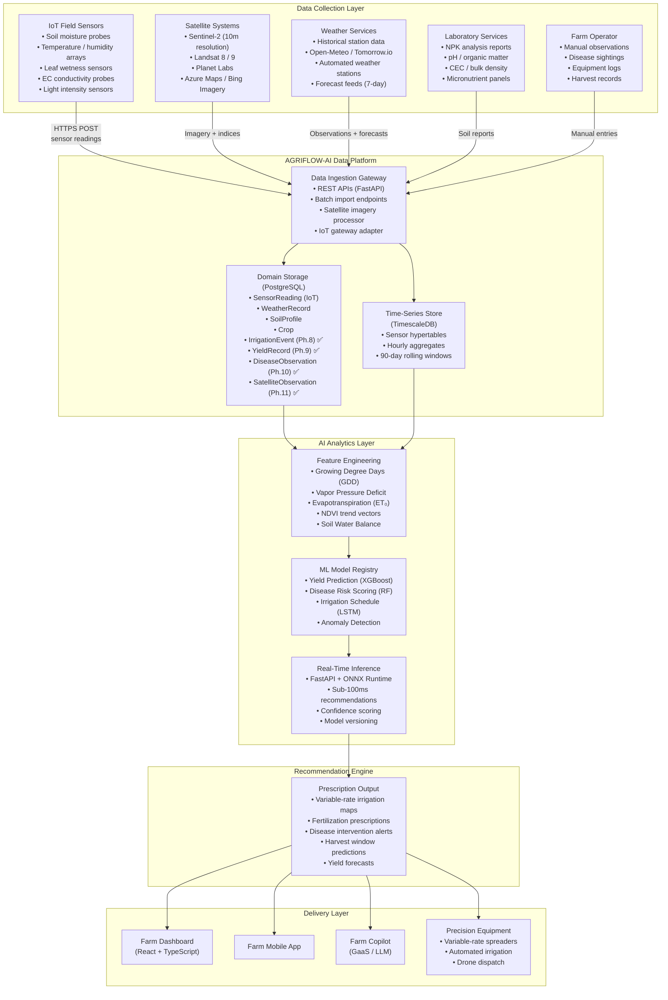

### Key Architectural Observations

- **The four data collection streams are orthogonal and independently valuable.** IoT provides high-frequency field-level telemetry. Satellite provides field-boundary-scale vegetation indices. Weather provides the environmental context. Soil profiles provide the slowly-changing substrate properties. No single stream can replace the others.
- **TimescaleDB is the bridge between raw telemetry and AI feature engineering.** Continuous aggregates (hourly, daily) reduce raw high-frequency data into the time-window features that ML models consume.
- **ONNX Runtime enables polyglot model serving.** Models trained in scikit-learn, XGBoost, or PyTorch can be exported to ONNX format and served by the existing FastAPI backend — no separate Python model-serving framework required.
- **Variable-rate prescriptions require sub-field spatial resolution.** The PostGIS `GEOMETRY` column (planned for `fields` in Phase 8+) enables field boundary-aware spatial join of satellite imagery and IoT sensor zones.

---

## 9. Future Event-Driven Architecture

### Title
AGRIFLOW-AI Future Event-Driven Architecture — Redpanda Streaming Platform

### Purpose
Illustrate how AGRIFLOW-AI will evolve from a synchronous REST-only platform to an event-driven architecture where IoT sensor events flow through Redpanda to multiple downstream consumers simultaneously, with zero coupling between producers and consumers.

### Explanation
The trigger for event-driven architecture is the `SensorReadingService` extension point documented in ADR-007-26. When Phase 8 introduces Redpanda, the existing service requires a single constructor injection to publish `SensorReadingCreated` events. All downstream consumers — Digital Twin updater, anomaly detector, CQRS projector, alert engine — subscribe independently. The write path remains fast and synchronous; downstream processing is asynchronous and isolated.

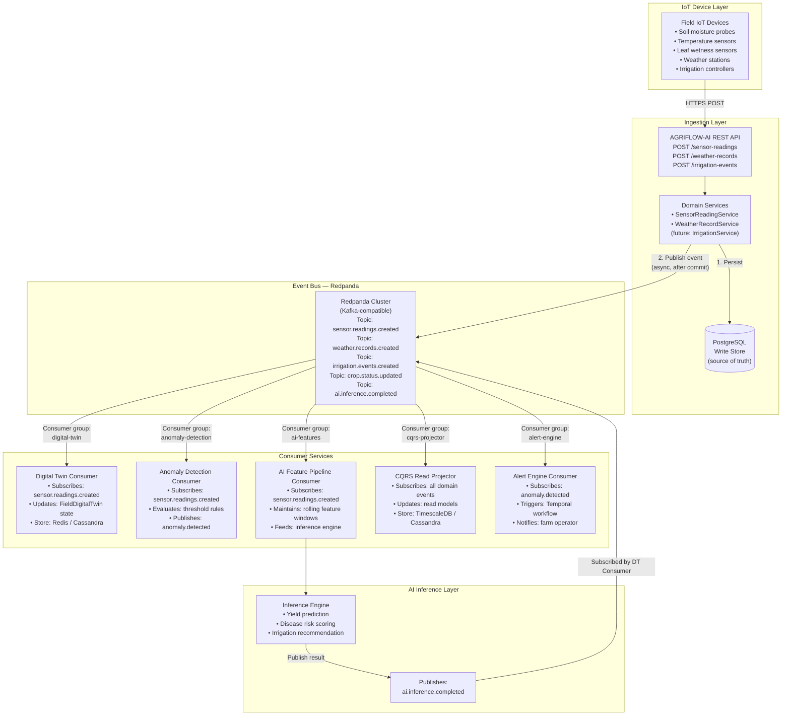

### Key Architectural Observations

- **Producer-consumer decoupling is the central value.** `SensorReadingService` publishes one event and its responsibility ends. Whether 3 or 30 consumers process that event has zero impact on write latency.
- **Redpanda was chosen over Apache Kafka** for lower operational overhead (no ZooKeeper, no JVM, single-binary deployment) and Kafka-protocol compatibility — all existing Kafka client libraries work with Redpanda unchanged.
- **Event ordering is guaranteed within a partition.** By partitioning `sensor.readings.created` on `field_id`, all readings from the same field arrive in `recorded_at` order at every consumer.
- **At-least-once delivery with idempotent consumers.** `SensorReading` has a UUID `id` that consumers use as an idempotency key to prevent duplicate processing on consumer restarts.
- **The current architecture is already publish-ready.** The `SensorReadingService` constructor accepts injected dependencies. Adding an `event_publisher: Optional[EventPublisher] = None` parameter requires changing one line in `deps.py`.

---

## 10. Future CQRS Architecture

### Title
AGRIFLOW-AI Future CQRS Architecture — Read/Write Separation for Sensor Telemetry

### Purpose
Show how AGRIFLOW-AI will split the `SensorReadingRepository` into separate Write and Read implementations backed by different storage engines, enabling independent scaling of ingestion throughput and query performance.

### Explanation
CQRS (Command Query Responsibility Segregation) is motivated by the structural divergence of write and read patterns. Writes are single-reading, low-latency, transactional. Reads range from single-record lookups to hour-aggregated feature vectors consumed by ML models. Serving both from the same `SensorReadingRepository` with PostgreSQL creates unnecessary coupling. The CQRS split preserves the service layer interface while routing commands and queries to optimal storage engines.

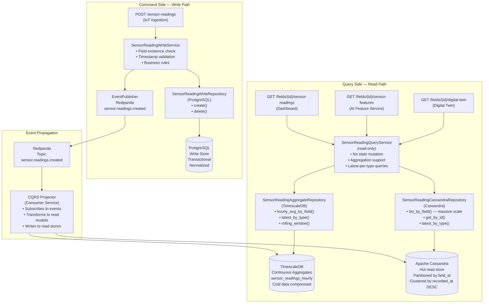

### Key Architectural Observations

- **The service layer contract is unchanged.** CQRS is a repository-layer concern. Service method signatures remain identical. The split is transparent to routers and to any consumer of the service interface.
- **Write consistency is PostgreSQL-level transactional.** The command path uses synchronous PostgreSQL writes. The eventual consistency is only in the read path — read models may lag writes by milliseconds.
- **Incremental migration is safe.** The CQRS split can be introduced one step at a time: (1) add event publishing, (2) add read repositories, (3) route read consumers to read repositories, (4) deprecate read operations from `SensorReadingWriteRepository`.
- **Query-side storage choice is access-pattern-driven.** TimescaleDB serves time-aggregated analytical queries (hourly averages, rolling windows). Cassandra serves high-throughput, low-latency latest-value lookups across millions of fields.

---

## 11. Future TimescaleDB Architecture

### Title
AGRIFLOW-AI Future TimescaleDB Architecture — High-Frequency Sensor Time-Series Storage

### Purpose
Show how the existing `sensor_readings` PostgreSQL table will be promoted to a TimescaleDB hypertable, enabling automatic time-partitioned storage, continuous aggregates, and columnar compression — with zero application code changes.

### Explanation
TimescaleDB is a PostgreSQL extension that transparently partitions tables by time into "chunks." Each chunk maps to a time interval (e.g. one week). Queries with time-range predicates skip irrelevant chunks entirely. Continuous aggregates are materialised views that auto-update as new data arrives. Columnar compression reduces cold chunk storage by 20–100×. The AGRIFLOW-AI `sensor_readings` table was designed from day one to satisfy TimescaleDB's only structural requirement: a `NOT NULL TIMESTAMPTZ` partition key.

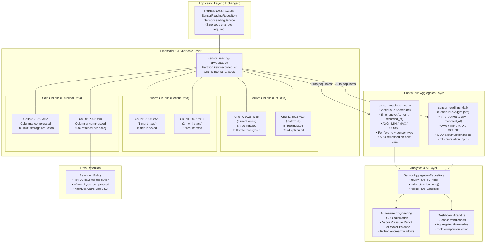

### Key Architectural Observations

- **Chunk exclusion is the performance multiplier.** A query for "last 7 days of soil moisture for field X" touches only 1–2 chunks out of potentially hundreds. Without TimescaleDB, the same query must scan the entire `sensor_readings` table.
- **Continuous aggregates eliminate repeated full-scan analytics.** Instead of computing "average hourly soil moisture" from raw data on every dashboard request, the continuous aggregate materialises the result incrementally.
- **Migration is non-destructive.** `create_hypertable('sensor_readings', 'recorded_at', migrate_data => TRUE)` converts the existing table in-place. Existing data is distributed across initial chunks. No export/re-import cycle is required.
- **Columnar compression is segment-aware.** TimescaleDB's native columnar compression is especially effective for sensor data because readings from the same field and sensor type have high temporal correlation — ideal for run-length and delta encoding.

---

## 12. Future Cassandra Architecture

### Title
AGRIFLOW-AI Future Cassandra Architecture — Distributed IoT Telemetry at Agricultural Scale

### Purpose
Show how Apache Cassandra will provide horizontally scalable, linearly-growing write throughput for AGRIFLOW-AI's sensor telemetry when farm deployments reach thousands of farms and billions of annual sensor readings — beyond what a single PostgreSQL instance can serve.

### Explanation
Cassandra's data model is designed for the access patterns AGRIFLOW-AI already uses. The primary access pattern — "all readings for a field, newest first" — maps exactly to Cassandra's partition + clustering key model: `PARTITION KEY (field_id)` with `CLUSTERING ORDER BY (recorded_at DESC)`. A secondary table enables "all readings of a given sensor type across all fields" — a cross-field analytics access pattern.

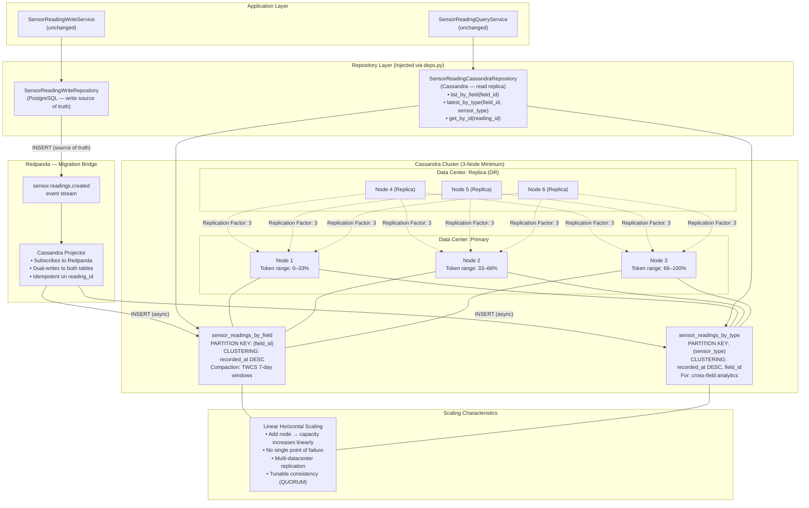

### Key Architectural Observations

- **Cassandra's partition model maps directly to existing access patterns.** The compound index `(field_id, recorded_at)` on PostgreSQL's `sensor_readings` table was architecturally equivalent to Cassandra's `PARTITION KEY (field_id) CLUSTERING recorded_at DESC`. No access-pattern redesign is required.
- **TimeWindowCompactionStrategy (TWCS) is the correct compaction for time-series.** TWCS groups SSTables into time windows (7 days default) and compacts within windows only. This prevents old data from being recompacted when new data arrives — essential for append-heavy workloads.
- **PostgreSQL remains the write source of truth.** Cassandra is introduced as an async read replica via Redpanda projections. This ensures no data loss if Cassandra is unavailable during a write burst — reads degrade gracefully to the PostgreSQL write store.
- **Service and API layers are completely isolated from this change.** The only modification required at integration time is swapping the repository injection in `deps.py`.

---

## 13. Future Temporal Workflow Architecture

### Title
AGRIFLOW-AI Future Temporal Workflow Architecture — Durable Agricultural Process Orchestration

### Purpose
Show how Temporal will orchestrate complex, long-running, stateful agricultural processes that span minutes to days — including soil moisture alert evaluation, yield prediction pipelines, irrigation scheduling, and satellite imagery processing — with guaranteed durability and exactly-once execution semantics.

### Explanation
Temporal is a workflow orchestration engine that persists workflow state durably. If a workflow's worker dies mid-execution, Temporal replays the workflow history to reconstruct state and continues from where it left off. This is the correct solution for agricultural processes that involve: waiting (soil moisture deficit persists for 15 minutes before alerting), retrying (external weather API may be temporarily unavailable), and coordinating (irrigation recommendation requires yield prediction + soil moisture + weather forecast).

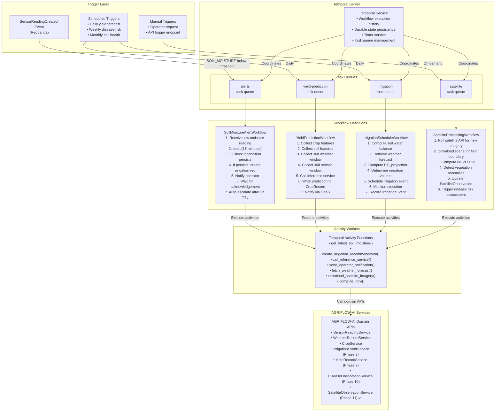

### Key Architectural Observations

- **Temporal solves the "orchestration without orchestrator" problem.** Without Temporal, `SensorReadingService` would need to implement timers, retries, and state persistence manually — a distributed systems problem that dwarfs the agricultural domain logic.
- **Workflows are pure business logic.** `SoilMoistureAlertWorkflow.run()` reads exactly like the agricultural decision process it models: wait, check, recommend, notify, escalate. The durability mechanism is invisible to the workflow author.
- **`SensorReadingService` is the only integration point.** The Temporal client is injected optionally into `SensorReadingService`. The extension point comment in Phase 7 (`# Temporal workflow initiation`) identifies the exact line where this integration wires in.
- **Long-running agricultural timescales are natural.** `YieldPredictionWorkflow` may take hours to complete if external data services are slow. `SatelliteProcessingWorkflow` may wait days for cloud-free imagery. Temporal handles these timescales natively; HTTP request timeouts cannot.

---

## 14. Future Digital Twin Architecture

### Title
AGRIFLOW-AI Future Digital Twin Architecture — Virtual Farm Intelligence Platform

### Purpose
Create a comprehensive architecture showing the complete Digital Twin stack for AGRIFLOW-AI: from physical farm sensors and satellite imagery through a continuously updated virtual model to AI simulation, prediction, and autonomous decision layers.

### Explanation
A Digital Twin is a live, continuously updated virtual representation of a physical entity. In agriculture, a Digital Twin of a field mirrors the field's current state: soil moisture, crop growth stage, disease risk, nutrient levels, weather conditions — updated in real-time as new sensor readings and satellite observations arrive. The AI layer runs against the twin's state to generate predictions and recommendations without needing to query the raw time-series data each time.

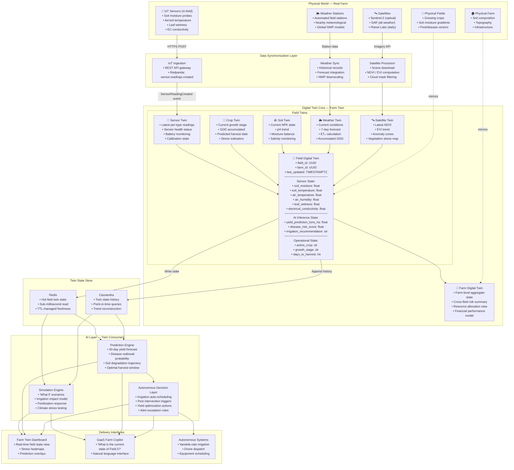

### Key Architectural Observations

- **The Digital Twin is a read model, not a new source of truth.** The source of truth remains the AGRIFLOW-AI domain databases (PostgreSQL for operational data, TimescaleDB for sensor time-series). The twin is a materialized projection optimized for instant state queries.
- **Redis serves the hot path.** Any query for "current field state" hits Redis with sub-millisecond latency. This enables the AI inference layer, dashboard, and GaaS to read field state without touching the database.
- **`SensorType` enum alignment was strategic.** The 11 values in `app/core/enums.py` (`SOIL_MOISTURE`, `SOIL_TEMPERATURE`, `AIR_TEMPERATURE`, etc.) map directly to `FieldDigitalTwin` state properties. This alignment was intentional in Phase 7 and requires no refactoring at Digital Twin integration time.
- **The Simulation Layer enables prescriptive agriculture.** "What happens to yield prediction if we irrigate Field 5 today with 30mm?" can be answered by running the prediction engine against a modified twin state — without touching real data.
- **Autonomous Decision Layer completes the autonomy stack.** At Phase 15+, the system can initiate irrigation, dispatch drones, and adjust equipment schedules without operator intervention — based on the digital twin's current state and the prediction engine's output.

---

## 15. Future GaaS Architecture

### Title
AGRIFLOW-AI Future GaaS Architecture — Generative-As-A-Service Agricultural Intelligence

### Purpose
Show the complete Generative-As-A-Service layer that transforms AGRIFLOW-AI from a data platform into a conversational agricultural intelligence system, where farmers and agronomists can ask natural language questions and receive contextual, data-grounded recommendations.

### Explanation
GaaS (Generative-As-A-Service) is AGRIFLOW-AI's LLM-powered intelligence interface. A Farm Copilot agent receives natural language queries, decomposes them into tool calls against the AGRIFLOW-AI API surface (already fully structured and documented via FastAPI's OpenAPI spec), retrieves current context from the Digital Twin, queries agricultural knowledge from a vector store, and synthesises a recommendation using an LLM. The result is a data-grounded, explainable recommendation — not hallucination.

```mermaid
graph TB
    subgraph "User Interaction Layer"
        FARMER["👩‍🌾 Farm Operator\n'Should I irrigate Field 5 today?'"]
        AGRO["🧑‍🔬 Agronomist\n'Analyze disease risk for my\nwheat crop in Field 3'"]
        MANAGER["👔 Farm Manager\n'Forecast this season yield\nacross all my fields'"]
        MOBILE_APP["Farm Mobile App"]
        WEB_DASH["Web Dashboard\nCopilot Chat Panel"]
    end

    subgraph "GaaS Orchestration Layer"
        COPILOT["🤖 Farm Copilot Agent\n(LangChain / LangGraph)\n• Query intent classification\n• Multi-step tool planning\n• Context window management\n• Response synthesis"]

        subgraph "Advisor Agents"
            YIELD_ADV["🌾 Yield Advisor\n• Harvest predictions\n• Season comparisons\n• Market timing advice"]
            DISEASE_ADV["🦠 Disease Advisor\n• Risk assessment\n• Treatment recommendations\n• Outbreak probability"]
            IRR_ADV["💧 Irrigation Advisor\n• Water budget analysis\n• Schedule optimization\n• Deficit irrigation strategies"]
            SOIL_ADV["🪨 Soil Advisor\n• Nutrient recommendations\n• pH management\n• Amendment schedules"]
        end
    end

    subgraph "Tool Layer — AGRIFLOW-AI APIs"
        T1["get_field_sensor_readings()\n→ GET /fields/{id}/sensor-readings"]
        T2["get_field_digital_twin()\n→ Digital Twin State (Redis)"]
        T3["get_yield_prediction()\n→ AI Inference Service"]
        T4["get_weather_records()\n→ GET /fields/{id}/weather-records"]
        T5["get_soil_profile()\n→ GET /fields/{id}/soil-profile"]
        T6["get_crop_status()\n→ GET /fields/{id}/crops"]
        T7["get_disease_risk()\n→ AI Disease Risk Score"]
        T8["get_satellite_observations()\n→ GET /fields/{id}/satellite"]
    end

    subgraph "Knowledge Layer"
        VECTOR["Vector Knowledge Base\n(Azure AI Search / Pinecone)\n• Agronomic best practices\n• Crop disease database\n• Irrigation manuals\n• Regional climate guides\n• Pesticide regulations"]
        RAG["RAG Pipeline\n• Semantic similarity search\n• Context retrieval\n• Source attribution\n• Confidence scoring"]
    end

    subgraph "LLM Layer"
        LLM["LLM Provider\n• GPT-4o (OpenAI)\n• Claude 3.5 Sonnet (Anthropic)\n• Azure OpenAI Service\n• Model router by task type"]
        GUARDRAILS["Safety Guardrails\n• Agri domain validation\n• Hallucination detection\n• Source verification\n• Regulatory compliance check"]
    end

    subgraph "AGRIFLOW-AI Data Platform"
        API_LAYER["AGRIFLOW-AI FastAPI\nAll domain APIs"]
        DT_STORE["Digital Twin Store\n(Redis / Cassandra)"]
        AI_MODELS["AI Model Registry\n• Yield prediction\n• Disease risk\n• Irrigation optimizer"]
    end

    FARMER & AGRO & MANAGER --> MOBILE_APP & WEB_DASH
    MOBILE_APP & WEB_DASH --> COPILOT

    COPILOT --> YIELD_ADV & DISEASE_ADV & IRR_ADV & SOIL_ADV

    COPILOT -->|"Tool calls"| T1 & T2 & T3 & T4 & T5 & T6 & T7 & T8

    T1 & T4 & T5 & T6 & T8 --> API_LAYER
    T2 --> DT_STORE
    T3 & T7 --> AI_MODELS

    COPILOT -->|"Semantic search"| RAG
    RAG --> VECTOR

    COPILOT -->|"Synthesis prompt"| LLM
    LLM --> GUARDRAILS
    GUARDRAILS -->|"Grounded recommendation"| COPILOT

    COPILOT -->|"Natural language response\n+ data citations"| MOBILE_APP & WEB_DASH
```

### Key Architectural Observations

- **The AGRIFLOW-AI REST API is already GaaS-ready.** FastAPI's auto-generated OpenAPI specification (`/docs`) is immediately consumable as an LLM tool manifest. No separate API wrapper layer is required.
- **RAG prevents hallucination in the agricultural domain.** An LLM without retrieval augmentation may invent pesticide dosages or irrigation thresholds. RAG grounds every recommendation in the vector knowledge base (which contains verified agronomic publications).
- **Specialized advisor agents are preferable to a single generalist agent.** The `YieldAdvisor`, `DiseaseAdvisor`, and `IrrigationAdvisor` agents carry domain-specific system prompts and tool subsets, reducing token cost and improving focus.
- **Source attribution is a trust requirement.** Farm operators acting on AI recommendations need to know whether a recommendation is based on sensor data from today, agronomic research from 2023, or AI inference. The GaaS layer must surface citations in every response.
- **Azure OpenAI Service is the preferred LLM deployment** for enterprise and cooperative customers with data sovereignty requirements. Data does not leave the Azure tenancy when using Azure OpenAI.

---

## 16. AGRIFLOW Target State Architecture — Phase 15 Vision

### Title
AGRIFLOW-AI Phase 15 Enterprise Target State — Complete Autonomous Agricultural Intelligence Platform

### Purpose
Present the final strategic vision for AGRIFLOW-AI as a complete enterprise-grade autonomous agricultural intelligence platform. This diagram is the "north star" architecture that every phase decision points toward.

### Explanation
Phase 15 represents the completion of AGRIFLOW-AI's evolutionary arc from Reactive Farming through Data-Driven, Predictive, and Intelligent Farming to Autonomous Agriculture. Every component in this diagram traces directly to an architectural decision made in Phases 1–7 or documented in the roadmap. The architecture integrates operational data management, real-time telemetry, event-driven intelligence, Digital Twin modeling, AI prediction, and Generative AI into a single coherent enterprise platform.

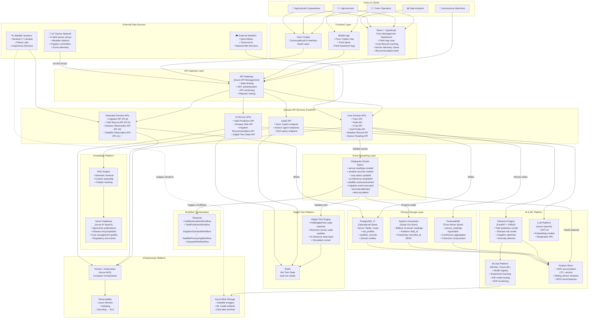

### Platform Capability Summary at Phase 15

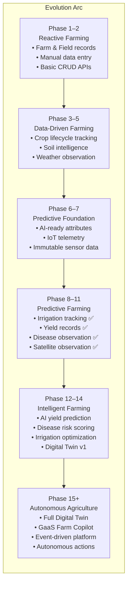

### Key Architectural Observations

- **Every component traces to a Phase 1–10 architectural decision.** The UUID primary key strategy enables Digital Twin state keys. The `AuditableModel` timestamps enable time-series analytics. The `app/core/enums.py` shared enum module enables Digital Twin sensor state mapping and disease severity classification. No foundational refactoring is required at Phase 15.
- **Redpanda is the central integration fabric.** Every major platform capability — Digital Twin, AI Feature Store, CQRS, Temporal, Alert Engine — connects to the platform via Redpanda topics. This ensures the core domain APIs remain stable as new consumers are added.
- **The five-layer Clean Architecture scales to Phase 15 without modification.** Completed domains (Irrigation ✅, Yield ✅, Disease Observation ✅, Satellite Observation ✅) follow the same `Model → Schema → Repository → Service → Router` pattern established in Phase 2. The only additions are Redpanda publishing in the service layer and Temporal workflow triggering at the extension point.
- **Azure is the preferred infrastructure platform** for enterprise and cooperative deployments due to Azure OpenAI Service data sovereignty, Azure Kubernetes Service (AKS) orchestration, Azure API Management gateway, and Azure AI Search vector capabilities — all available within a single Azure tenancy.
- **GaaS is the ultimate user interface.** The Phase 15 Farm Copilot makes the entire platform accessible to farm operators who have no interest in dashboards, APIs, or ML model outputs — they simply ask what they need to know and receive a grounded, cited, actionable recommendation.

---

## Document Notes

**Diagram Rendering:** All diagrams in this document are authored in Mermaid syntax and render natively in GitHub Markdown, GitLab Markdown, Notion, and any Mermaid-compatible viewer.

**Architecture Alignment:** Every diagram in this document is grounded in the decisions documented in:
- `docs/08-phase-architecture-handbook.md` — primary source of architectural decisions
- `docs/06-roadmap.md` — phase sequencing and domain roadmap
- `docs/AI_DATA_READINESS_ASSESSMENT.md` — AI coverage assessment and gap analysis

**Living Document:** This document should be updated at the completion of each phase to reflect new domain additions, architectural decisions, and technology adoptions.

**Last Updated:** Phase 11 completion — June 2026

---

*AGRIFLOW-AI Architecture Diagrams — Produced by AGRIFLOW-AI Principal Enterprise Architecture*  
*For implementation history, see `docs/08-phase-architecture-handbook.md`*  
*For phase roadmap, see `docs/06-roadmap.md`*
