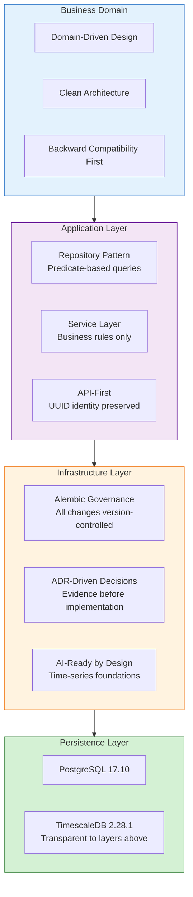
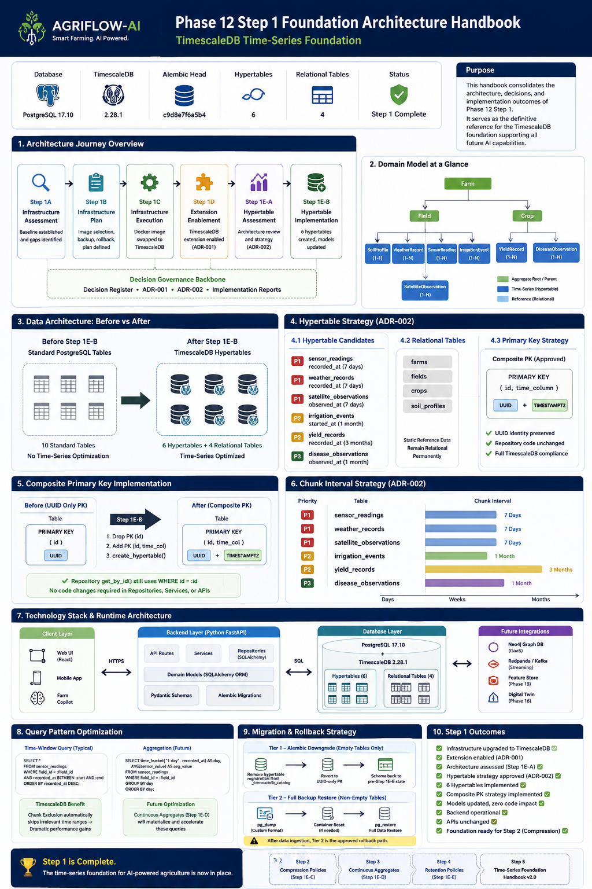
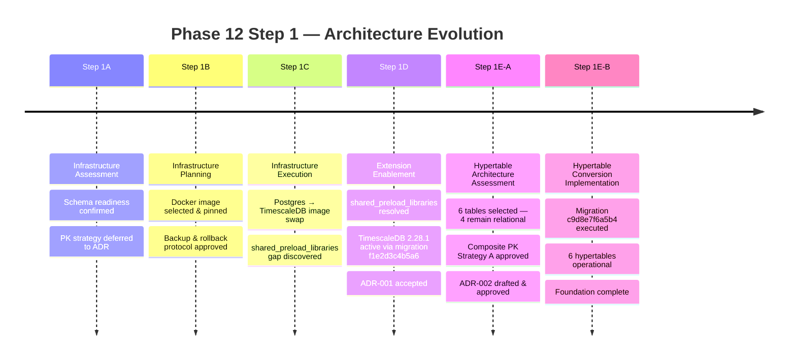
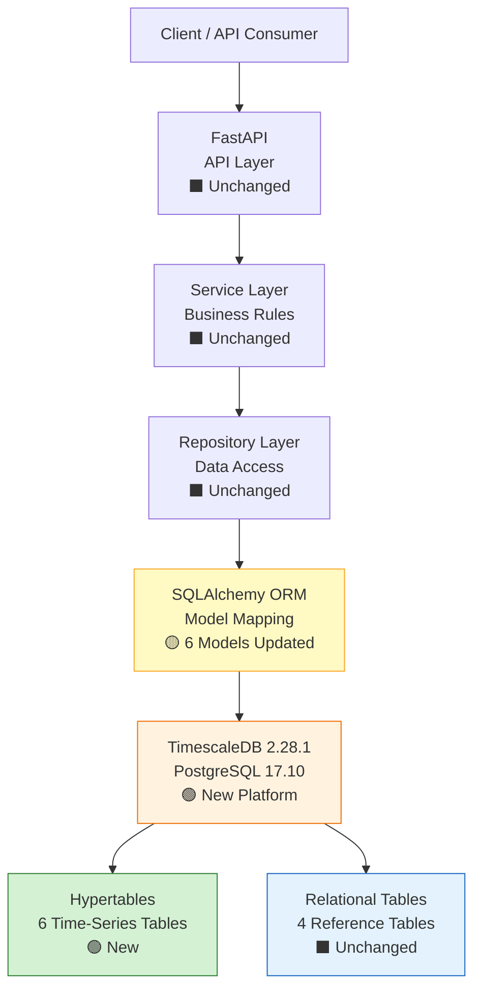
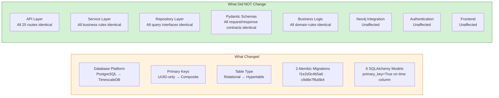
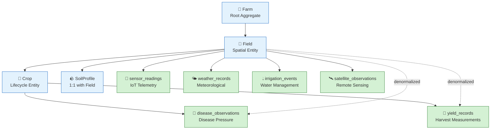
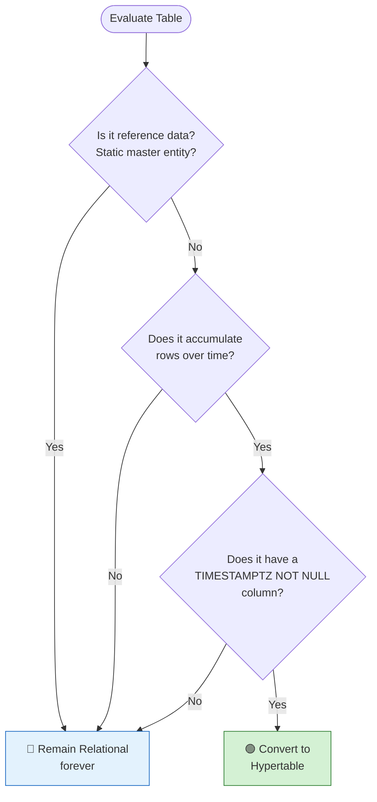
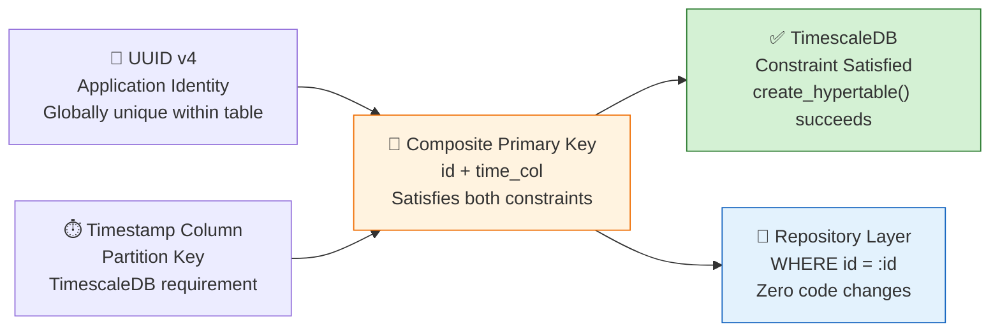
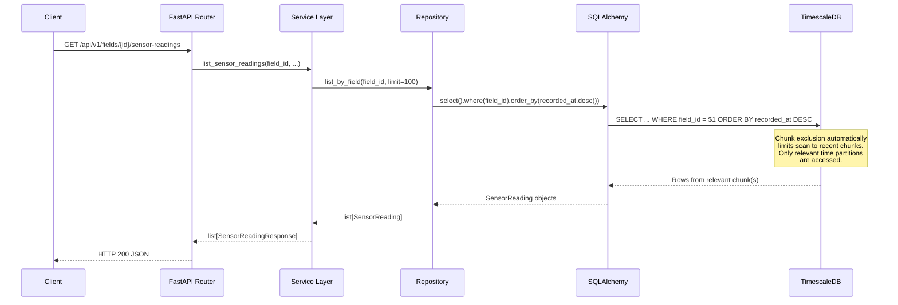
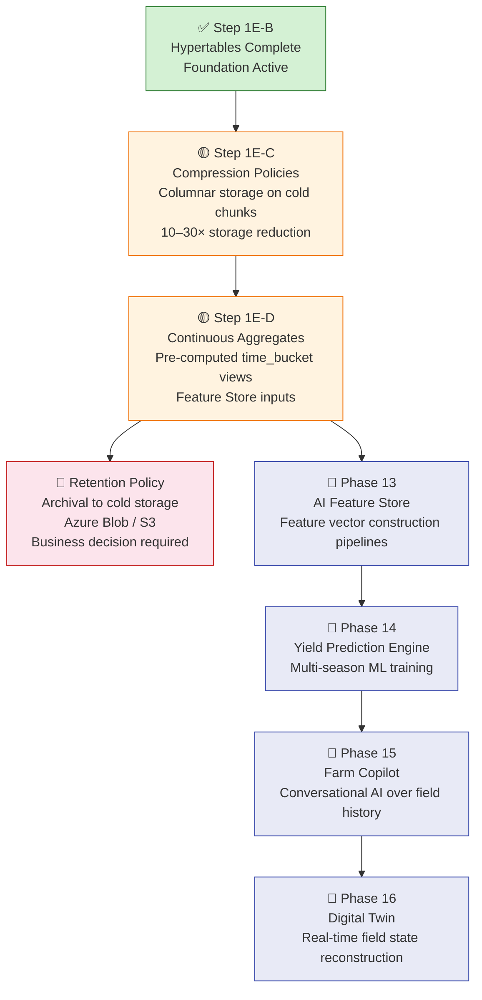

# Phase 12 Step 1 — TimescaleDB Foundation Architecture Handbook

**Version:** 1.1  
**Status:** Approved  
**Last Updated:** 2026-06-29  
**Related ADRs:** [ADR-001](adr/ADR-001-timescaledb-extension-enablement.md) · [ADR-002](adr/ADR-002-hypertable-primary-key-conversion-strategy.md)  
**Related Reports:** Step 1A · Step 1B · Step 1C · Step 1D · Step 1E-A · Step 1E-B  
**Decision Register:** [PHASE12_DECISION_REGISTER.md](report/PHASE12_DECISION_REGISTER.md) v1.4

---

## Phase 12 Step 1 at a Glance

| Metric | Value |
|---|---|
| Hypertables Created | **6** |
| Relational Tables (unchanged) | **4** |
| Architecture Decision Records | **2** (ADR-001, ADR-002) |
| Implementation Reports | **6** (Step 1A → 1E-B) |
| Decision Register Entries | **12** (P12-D001 → P12-D012) |
| Alembic Revisions | **13** total (2 added in Phase 12) |
| API Changes | **0** |
| Repository Changes | **0** |
| Service Changes | **0** |
| SQLAlchemy Models Updated | **6** (composite PK declaration only) |
| Pre-migration Backups Taken | **4** |
| Alembic Head | `c9d8e7f6a5b4` |

---

## Table of Contents

1. [Executive Summary](#1-executive-summary)
2. [Architecture Principles](#2-architecture-principles)
3. [Architecture Journey](#3-architecture-journey)
4. [Foundation Architecture](#4-foundation-architecture)
5. [What Did NOT Change](#5-what-did-not-change)
6. [Domain & Data Architecture](#6-domain--data-architecture)
7. [Hypertable Strategy](#7-hypertable-strategy)
8. [Primary Key Strategy](#8-primary-key-strategy)
9. [Runtime Architecture](#9-runtime-architecture)
10. [Engineering Lessons](#10-engineering-lessons)
11. [Architecture Traceability Matrix](#11-architecture-traceability-matrix)
12. [Foundation Outcomes](#12-foundation-outcomes)
13. [Roadmap Beyond Step 1](#13-roadmap-beyond-step-1)
14. [References](#14-references)

---

## 1. Executive Summary

### Why Phase 12 Exists

AGRIFLOW-AI entered Phase 12 as a fully operational agricultural management platform with eleven completed domain phases. The platform could record, store, and serve IoT sensor readings, weather observations, satellite imagery indices, irrigation events, yield measurements, and disease observations.

What it could not yet do was scale them.

Sensor readings accumulate at sub-hourly frequency. Satellite passes occur every 5–16 days per provider across multiple spectral indices. Weather stations ingest continuously. A production deployment of 100 farms with 1,000 fields and 100 sensors per field generates between 10 million and 100 million sensor rows per year — before any satellite or weather data is counted. Standard PostgreSQL B-tree index scans become proportionally slower as this history grows. Time-range queries, the primary access pattern for every AI model in the planned roadmap, have no natural acceleration mechanism without partitioning.

Phase 12 addresses this by upgrading PostgreSQL to TimescaleDB and converting the six measurement domains to hypertables — partitioned time-series tables that deliver chunk exclusion, native time aggregation, and columnar compression without any change to the existing application stack.

### Why AI Workloads Require Time-Series Architecture

Every AI engine planned in the AGRIFLOW-AI roadmap is fundamentally a time-window model:

- **Yield Prediction Engine** (Phase 13): trains on 90-day growing-season windows of sensor, weather, and satellite data per field
- **Disease Risk Scoring Engine** (Phase 14): correlates environmental conditions over multi-week incubation windows
- **Farm Copilot** (Phase 15): answers "last N days" conversational queries in real time
- **Digital Twin** (Phase 16): reconstructs field state by replaying event history across multiple domains simultaneously

All of these access patterns — range scans over a fixed time window anchored on a field — map directly to TimescaleDB's chunk exclusion mechanism. Without hypertables, every such query scans the full table. With hypertables, only the relevant time chunks are accessed.

### Phase 12 Step 1 Outcomes

| What | Result |
|---|---|
| Database platform | PostgreSQL 17.10 + TimescaleDB 2.28.1 |
| Hypertables created | 6 (sensor_readings, weather_records, satellite_observations, irrigation_events, yield_records, disease_observations) |
| Relational tables | 4 unchanged (farms, fields, crops, soil_profiles) |
| Application changes | Zero — API, service, and repository layers untouched |
| Migration governance | 2 ADRs + 1 Decision Register + 6 implementation reports |
| Alembic head | `c9d8e7f6a5b4` |

### Key Takeaways

- Phase 12 exists because AI roadmap workloads are fundamentally time-window models that require partitioned storage to scale.
- TimescaleDB was adopted as a PostgreSQL extension — the application stack required zero changes.
- Six time-series tables became hypertables; four reference data tables remain relational permanently.
- Governance was enforced through sequential ADRs, a living Decision Register, and mandatory pre-migration backups.

---

## 2. Architecture Principles

Phase 12 was constrained by a set of guiding principles that were upheld across every step from infrastructure assessment to hypertable conversion. These principles explain why the implementation followed the path it did, and why certain options were explicitly rejected.



### Preserve Clean Architecture

All domain business logic lives in the service layer. All data access lives in repositories. No layer was allowed to bypass its contract during Phase 12. The hypertable conversion affected only the persistence layer — the boundary was strictly maintained.

### Preserve Domain-Driven Design

The AGRIFLOW-AI domain model (`Farm → Field → Crop → ...`) was not restructured for TimescaleDB. The six time-series entities were designed as measurement domains from the start. Phase 12 activated their time-series capabilities; it did not change their domain semantics.

### Infrastructure evolves independently from business logic

The guiding constraint for every Phase 12 step was: *the upper layers must not know the lower layers changed.* This was validated at each step by confirming zero changes to API routes, service interfaces, and repository interfaces.

### Database evolution through Alembic governance

No database state change — including `CREATE EXTENSION`, primary key alterations, and `create_hypertable()` — was executed outside of an Alembic migration. This keeps all environment states reproducible from a single `alembic upgrade head` command.

### ADR-driven architecture decisions

Decisions with architectural impact (extension enablement strategy, primary key strategy, hypertable selection, chunk interval strategy) were not implemented until a formal Architecture Decision Record was approved. The primary key strategy was explicitly deferred from Step 1A until Step 1E-A had produced sufficient evidence for an ADR.

### Backward compatibility first

At every step, the question was asked: *what breaks above?* The answer at every step was: *nothing.* This was the primary evaluation criterion for approving the Composite Primary Key strategy over alternatives that would have required repository-layer changes.

### AI-ready architecture by design

Every time-series table in AGRIFLOW-AI was designed with TimescaleDB readiness before Phase 12 began — `TIMESTAMPTZ NOT NULL` partition columns, compound indexes aligned with time-window query patterns, FK topology flowing away from time-series tables. Phase 12 activated what was already designed.

### Key Takeaways

- Clean Architecture boundaries were the constraint that made zero-application-change adoption possible.
- Every schema change was version-controlled through Alembic — no exceptions.
- Architecture decisions required evidence-based ADRs before implementation.
- Backward compatibility was treated as a hard constraint, not a preference.

---

## 3. Architecture Journey



The Phase 12 Step 1 foundation was built across six sequential steps, each with a formal deliverable before the next step could proceed.

### Timeline



---

### Step 1A — Infrastructure Assessment

**Objective:** Evaluate the existing platform against TimescaleDB requirements before any changes.

**Key finding:** The existing schema was deliberately designed for TimescaleDB from the start. Every time-series table had a `TIMESTAMPTZ NOT NULL` partition key column, compound indexes aligned with TimescaleDB access patterns, and FK topology that flowed away from — not toward — the time-series tables. TimescaleDB adoption required no domain model redesign.

**Deferred:** The primary key strategy — how to satisfy TimescaleDB's requirement that all unique constraints include the partition column — was explicitly deferred to an Architecture Decision Review.

**Outcome:** Approved architecture baseline. Infrastructure swap authorized.

*Reference: PHASE12_STEP1A_INFRASTRUCTURE_ASSESSMENT.md*

---

### Step 1B — Infrastructure Plan

**Objective:** Select the TimescaleDB image, define version governance, establish the backup and rollback protocol.

**Key decision:** The official `timescale/timescaledb:2.28.1-pg17` image was selected over the HA image (unnecessary operational overhead) and the OSS-only image (full feature set needed). A three-tier rollback model was defined before any change was made.

**Outcome:** `timescale/timescaledb:2.28.1-pg17` pinned. Backup protocol (P12-D003) approved. Rollback tiers defined (P12-D005). *(See [ADR-001](adr/ADR-001-timescaledb-extension-enablement.md), [PHASE12_DECISION_REGISTER.md](report/PHASE12_DECISION_REGISTER.md) P12-D001–D003)*

---

### Step 1C — Infrastructure Execution

**Objective:** Swap the Docker database image from `postgres:17-alpine` to TimescaleDB.

**Notable issue discovered:** The existing Docker volume was initialised by the original `postgres:17-alpine` image. The TimescaleDB image's initialisation script — which sets `shared_preload_libraries = 'timescaledb'` — only runs on a fresh data directory, so it was skipped. This left TimescaleDB binaries present but not loadable.

**Outcome:** Image swap validated. TimescaleDB binaries confirmed present. Extension not yet installed. `shared_preload_libraries` gap documented for resolution in Step 1D.

*Reference: PHASE12_STEP1C_IMPLEMENTATION_REPORT.md*

---

### Step 1D — Extension Enablement (→ ADR-001)

**Objective:** Activate the TimescaleDB extension in the `agriflow` database.

**Key decision:** Extension enablement via a forward Alembic migration (`f1e2d3c4b5a6`) — not manual SQL, not a Docker init script. This keeps extension state version-controlled and reproducible across all environments.

**`shared_preload_libraries` resolution:** Applied `ALTER SYSTEM SET shared_preload_libraries = 'timescaledb'` followed by `docker compose restart db`. This is a database configuration operation, not an infrastructure change.

**Outcome:** TimescaleDB 2.28.1 active in `agriflow` database. Zero application changes. Documented in ADR-001.

*Reference: PHASE12_STEP1D_EXTENSION_ENABLEMENT_REPORT.md · [ADR-001](adr/ADR-001-timescaledb-extension-enablement.md)*

---

### Step 1E-A — Hypertable Architecture Assessment (→ ADR-002)

**Objective:** Determine which tables convert to hypertables and resolve the primary key strategy.

**Central finding:** TimescaleDB 2.28.x requires that every unique constraint — including primary keys — must include the partitioning column. All six time-series candidates carried `PRIMARY KEY (id)` with UUID only. Calling `create_hypertable()` would fail.

**Four strategies were evaluated.** Composite Primary Key `(id, time_col)` was approved as Strategy A because:
- Satisfies the TimescaleDB constraint
- Preserves UUID as application identity
- `BaseRepository.get_by_id` uses `WHERE id = :id` — a predicate query, not a composite PK tuple lookup — so zero repository code changes are needed
- No FK cascade impact (all FK references flow away from time-series tables, never toward them)

**Outcome:** Six tables approved for hypertable conversion. Four remain relational. Chunk intervals defined. weather_records compound index gap identified. ADR-002 drafted and approved.

*Reference: PHASE12_STEP1EA_HYPERTABLE_ARCHITECTURE_ASSESSMENT.md · [ADR-002](adr/ADR-002-hypertable-primary-key-conversion-strategy.md)*

---

### Step 1E-B — Hypertable Conversion Implementation

**Objective:** Execute the approved hypertable migration.

**Execution:** Alembic migration `c9d8e7f6a5b4` ran in under one second against empty tables. For each of the six tables: drop UUID-only PK, add composite PK `(id, time_col)`, call `create_hypertable()` with the approved chunk interval. Added the missing `weather_records` compound index. Updated six SQLAlchemy models to reflect the composite PK.

**Outcome:** 6 hypertables operational. Zero API, service, repository, or schema changes. Full validation completed.

*Reference: PHASE12_STEP1EB_HYPERTABLE_IMPLEMENTATION_REPORT.md*

---

### Key Takeaways

- The six sequential steps enforced a gate-driven process — no step began without the previous step's deliverable approved.
- TimescaleDB readiness was built into the schema from Phase 7 onward; Phase 12 activated what was already designed.
- The `shared_preload_libraries` gap in Step 1C demonstrates the importance of fresh-volume vs. reused-volume distinction in Docker deployments.
- Every architectural decision with cross-cutting impact was recorded in an ADR before implementation began.

---

## 4. Foundation Architecture

The Phase 12 Step 1 architecture is a pure persistence-layer upgrade. Every layer above the database is architecturally unchanged.



### Why the upper layers are unchanged

The architectural principle that enabled a zero-impact database upgrade is the Repository Pattern. Every query in `BaseRepository` — and all domain repositories that extend it — uses a `SELECT ... WHERE column = :value` predicate filter. None use primary key tuple lookups (`session.get(Model, pk_tuple)`). This means primary key composition changes at the database layer have no effect on any code above the repository.

| Layer | Changed in Step 1? | Reason |
|---|---|---|
| API routes | No | UUID path parameters unchanged |
| Pydantic schemas | No | No database constraint coupling |
| Service methods | No | Business logic has no PK awareness |
| Repository interfaces | No | All queries use WHERE predicate |
| SQLAlchemy models | Yes (6 models) | Reflect composite PK in ORM definition |
| Alembic migrations | Yes (2 new) | Schema evolution via migration only |
| Database schema | Yes | Composite PKs + hypertables |

The six SQLAlchemy model updates were exclusively adding `primary_key=True` to the time column in each model to match the new composite PK at the database level. No query logic, relationship, or business rule changed.

### Key Takeaways

- Phase 12 Step 1 is a persistence-layer upgrade only — all upper layers are architecturally frozen.
- The Repository Pattern's predicate-query design was the key enabler of zero-application-change adoption.
- Only 6 SQLAlchemy models were updated, and only to add `primary_key=True` to the time column.
- TimescaleDB is transparent to the application — it appears as a standard PostgreSQL table.

---

## 5. What Did NOT Change

A critical architectural objective throughout Phase 12 Step 1 was to ensure that the database infrastructure upgrade remained invisible to the application. This section makes that guarantee explicit.

> **The database changed. The application did not.**



### Application component status

| Component | Status | Notes |
|---|---|---|
| API Layer (25 routes) | **Unchanged** | All UUID path parameters identical |
| Service Layer (10 services) | **Unchanged** | All business rules identical |
| Repository Layer (10 repositories) | **Unchanged** | All query interfaces identical |
| Pydantic Schemas | **Unchanged** | All request/response contracts identical |
| Business Logic | **Unchanged** | No domain rule was altered |
| `BaseRepository.get_by_id` | **Unchanged** | `WHERE id = :id` predicate unaffected by PK composition |
| `BaseRepository.create/update/delete` | **Unchanged** | No PK-structure coupling |
| Neo4j Integration | **Unchanged** | UUID as graph node identity — still valid |
| Authentication | **Unchanged** | Not impacted by persistence layer changes |
| Frontend | **Unchanged** | Consumes the unchanged API contracts |

### Why preserving these layers was the primary objective

AGRIFLOW-AI is an evolving platform. It has 25 active API routes, 10 service classes, 10 repository classes, and a frontend consuming all of them. A database infrastructure upgrade that required changes to any of these layers would have introduced regression risk across the entire platform — for a change whose value is purely at the storage layer.

The Composite Primary Key strategy was approved specifically because it satisfied TimescaleDB's constraint requirements while preserving all of these contracts. Alternative strategies (integer surrogate keys, removing unique constraints) were rejected because they would have propagated change upward.

> **Architectural principle:** Infrastructure changes should be absorbed at their layer boundary. They should never require renegotiation of contracts established in layers above.

### Key Takeaways

- Zero API routes, services, or repositories were modified.
- The architecture change was fully contained below the SQLAlchemy ORM boundary.
- Only 6 model declarations changed — no business logic, no query logic, no interface contracts.
- This containment was an explicit design objective, not an accidental outcome.

---

## 6. Domain & Data Architecture

### Domain Hierarchy



*Green = hypertable after Phase 12 Step 1. Blue = relational table (permanent).*

### Table Classification

| Table | Classification | Partition Key | Chunk Interval | Rationale |
|---|---|---|---|---|
| `sensor_readings` | **Hypertable** | `recorded_at` | 7 days | Highest insert frequency; IoT telemetry; AI Feature Store backbone |
| `weather_records` | **Hypertable** | `recorded_at` | 7 days | Continuous meteorological ingestion; GDD/ET₀ source |
| `satellite_observations` | **Hypertable** | `observed_at` | 7 days | Multi-spectral AI training data; Sentinel-2 5-day revisit |
| `irrigation_events` | **Hypertable** | `started_at` | 30 days | Seasonal water management events; FAO-56 analytics |
| `yield_records` | **Hypertable** | `recorded_at` | 90 days | Harvest measurements; sparse ingest; Yield Prediction Engine target |
| `disease_observations` | **Hypertable** | `observed_at` | 30 days | Episodic disease pressure; Disease Risk Scoring Engine |
| `farms` | **Relational** | — | — | Root master data; no time-series growth; unique `farm_code` constraint |
| `fields` | **Relational** | — | — | Spatial dimension entity; time-series data anchors on fields, not in them |
| `crops` | **Relational** | — | — | Lifecycle entity; planting/harvest dates are milestones, not time-series |
| `soil_profiles` | **Relational** | — | — | One-to-one with fields; UNIQUE(field_id) incompatible with partitioning |

### Key Takeaways

- The domain separation between reference data (farms, fields, crops, soil_profiles) and measurement data (the six hypertables) is clean and permanent.
- All six hypertables are direct or indirect children of `Field` — the spatial entity that anchors all time-series observations.
- Chunk intervals were sized per table to match ingest frequency and dominant query window.
- `yield_records` and `disease_observations` are grandchildren of `Crop`; `field_id` is denormalized on both for direct field-scoped queries.

---

## 7. Hypertable Strategy

### Decision Logic



### Why six tables are hypertables

All six tables share the same pattern: they accumulate time-ordered rows indefinitely, they are queried primarily by time-window ranges anchored on a parent entity (field or crop), and their dominant AI access pattern is a range scan — not a point lookup.

### Why four tables remain relational

The four relational tables fail the decision criteria in different ways:

- **`farms`**: Root aggregate with very low row count (tens to hundreds per deployment) and a business key unique constraint (`farm_code`) that has no time dimension.
- **`fields`**: The *dimension* entity, not a measurement entity. All time-series data hangs off fields via FK — the field record itself is never the thing being measured over time.
- **`crops`**: Lifecycle milestone entity. `planting_date` and `actual_harvest_date` are `DATE` scalars, not high-frequency `TIMESTAMPTZ` observations. One to a few records per field per year.
- **`soil_profiles`**: One-to-one with `fields`. Bounded by field count. The `UNIQUE(field_id)` constraint enforcing the one-to-one relationship cannot semantically include a time partition column — there is no time dimension to a soil profile.

### Key Takeaways

- The hypertable / relational boundary maps cleanly to the domain boundary between reference entities and measurement entities.
- Six tables converted; four remain relational permanently — this is a final, authoritative classification per ADR-002.
- `soil_profiles` is a particularly important case: its `UNIQUE(field_id)` constraint is semantically incompatible with hypertable partitioning.
- Any future table that accumulates high-frequency time-series observations should be designed as a hypertable candidate from the start.

---

## 8. Primary Key Strategy

### The Problem

TimescaleDB 2.28.x enforces a strict rule: every unique constraint on a hypertable — including the primary key — must include the partition column. Calling `create_hypertable('sensor_readings', 'recorded_at')` on a table with `PRIMARY KEY (id)` produces:

```
ERROR: cannot create a unique index without the column "recorded_at" (used in partitioning)
```

### The Solution



### Approved strategy: Composite PK `(id, time_col)`

For each of the six tables, the primary key was changed from `PRIMARY KEY (id)` to `PRIMARY KEY (id, <partition_col>)`. UUID remains in the composite key at position 1 — it is still globally unique within the table, and still the identity used by every API route, service method, and schema.

The critical compatibility insight: `BaseRepository.get_by_id` uses:

```python
select(self._model).where(self._model.id == record_id)
```

This is a `WHERE` predicate filter on the `id` column. It does not use `session.get(Model, pk_tuple)`. The query executes identically regardless of whether the primary key is `(id)` or `(id, recorded_at)`. **Zero repository code changes were required.**

### Per-table composite keys

| Table | Primary Key Before | Primary Key After |
|---|---|---|
| `sensor_readings` | `(id)` | `(id, recorded_at)` |
| `weather_records` | `(id)` | `(id, recorded_at)` |
| `satellite_observations` | `(id)` | `(id, observed_at)` |
| `irrigation_events` | `(id)` | `(id, started_at)` |
| `yield_records` | `(id)` | `(id, recorded_at)` |
| `disease_observations` | `(id)` | `(id, observed_at)` |

### SQLAlchemy model update

Each of the six models received a single-line change to their time column declaration:

```python
# Before
recorded_at: Mapped[datetime] = mapped_column(DateTime(timezone=True), nullable=False, index=True)

# After
recorded_at: Mapped[datetime] = mapped_column(DateTime(timezone=True), nullable=False, primary_key=True)
```

When SQLAlchemy sees two columns with `primary_key=True` in the same model, it declares a composite primary key. The `id` column inherits `primary_key=True` from `UUIDPrimaryKeyMixin` in `AuditableModel`. No base class changes were required.

> **Note:** The composite PK adds a small storage overhead per row — 8 bytes for the additional `TIMESTAMPTZ` column in the index. At 100M rows in `sensor_readings`, this is approximately 800 MB, which is offset by the 10–30× storage compression achievable in Step 1E-C.

### Key Takeaways

- UUID identity is fully preserved — `id` remains at position 1 in all composite PKs.
- The predicate-query pattern in `BaseRepository` was the architectural property that made zero-repository-change adoption possible.
- SQLAlchemy composite PKs require only `primary_key=True` on both columns — no base class changes, no query logic changes.
- Hypertable conversion is a one-way operation in production; the downgrade path is governance-restricted to empty tables only.

---

## 9. Runtime Architecture

Once a table is a hypertable, TimescaleDB is fully transparent to the application. From the application's perspective, it is still a PostgreSQL table.



### What TimescaleDB adds at runtime

When a query includes a `WHERE recorded_at BETWEEN :start AND :end` or `ORDER BY recorded_at DESC LIMIT N`, TimescaleDB's query planner uses chunk exclusion to eliminate irrelevant time partitions from the scan. A query over the last 90 days on `sensor_readings` with 7-day chunks accesses at most 13 chunks, regardless of how many years of history the table holds.

No application code change is needed to benefit from this. The existing repository queries already use time-ordered access patterns that align directly with TimescaleDB's optimization.

### Key Takeaways

- TimescaleDB is completely transparent to the application — the request lifecycle is unchanged from the application's perspective.
- Chunk exclusion fires automatically on time-predicate queries; no application-level query changes are needed.
- A "last 90 days" query on `sensor_readings` accesses 13 chunks (7-day interval) regardless of total table history.
- The existing compound indexes (`field_id, recorded_at`) combine with chunk exclusion for maximum query efficiency.

---

## 10. Engineering Lessons

### Alembic as the single source of truth

Every database state change — including infrastructure operations like `CREATE EXTENSION` — went through an Alembic migration. This ensures that fresh deployments running `alembic upgrade head` always arrive at the correct state, regardless of environment. Manual SQL and Docker init scripts were explicitly rejected because they leave no version-controlled record.

### ADR-driven architecture change

The primary key strategy question was deliberately deferred from Step 1A to a formal Architecture Decision Review. This prevented premature implementation that would have required reversal. ADR-002 was drafted only after the Step 1E-A assessment provided evidence from the live schema, codebase review, and FK audit. Decisions were sequential and evidence-based.

### TimescaleDB shared_preload_libraries gap

When an existing Docker volume is reused after an image swap, the new image's initialisation scripts do not run. TimescaleDB requires `shared_preload_libraries = 'timescaledb'` to be set before `CREATE EXTENSION`. This gap was not caught in Step 1C and caused the first migration attempt in Step 1D to fail. The resolution (`ALTER SYSTEM SET`) is a database configuration change — not an infrastructure change — and required no Compose modification.

> **Warning:** When migrating to TimescaleDB on an existing Docker volume, always verify `SHOW shared_preload_libraries;` before running `CREATE EXTENSION timescaledb`. Fresh volumes configure this automatically; reused volumes do not.

### Pre-migration backups are mandatory gates

A `pg_dump` backup was taken before every infrastructure-affecting step (1B, 1C, 1D, 1E-B). In a development environment with empty tables, these are small and fast. In production with years of data, they are the only safe recovery path if a migration fails mid-execution. The backup protocol should be non-negotiable regardless of environment.

### The composite PK insight

The key architectural insight that made zero-code-change hypertable adoption possible: `BaseRepository.get_by_id` uses `WHERE id = :id`, not `session.get(Model, pk)`. This predicate-based pattern decouples the application from PK composition. Had the repository used session identity lookups, every composite PK change would have required a paired repository change. Predicate queries are more resilient to schema evolution.

> **Tip:** When designing repositories for future time-series domains, always use `WHERE id = :id` predicate queries rather than composite PK tuple lookups. This future-proofs the repository against hypertable adoption.

### Decision Register as living governance

The PHASE12_DECISION_REGISTER.md tracked every decision from P12-D001 (Docker image selection) through P12-D012 (continuous aggregate strategy). Deferred decisions were explicitly documented as deferred — not silently skipped. This prevented out-of-scope work from creeping into individual steps and kept each step cleanly bounded.

### TimescaleDB does not have a public "un-hypertable" API

Converting a table to a hypertable is a one-way operation in production. TimescaleDB 2.x has no public function to reverse the conversion without dropping the table. The downgrade path for Step 1E-B is governance-restricted: valid only for empty tables, and relies on direct catalog manipulation. For non-empty environments, the only rollback path is Tier 2 pg_dump restore. This should be understood before initiating hypertable conversion in any environment.

> **Warning:** Do not attempt hypertable conversion on tables with production data without a validated `pg_dump` backup and a documented rollback plan. The migration cannot be reversed without data loss once data has been ingested into hypertable chunks.

### Key Takeaways

- Alembic is the single source of truth for all database state — no exception for infrastructure-level DDL.
- Defer architectural decisions until evidence is available; premature implementation has a high reversal cost.
- Verify `shared_preload_libraries` before enabling TimescaleDB on reused Docker volumes.
- Backups are mandatory gates — not optional best practices.
- Predicate-query repositories are naturally resilient to primary key composition changes.
- Hypertable conversion is production-irreversible — plan the rollback path before starting.

---

## 11. Architecture Traceability Matrix

This matrix traces every major Phase 12 Step 1 decision from its governing document to its implementation step, allowing readers to find the authoritative source for any architectural choice.

| Decision | Governing Document | Decision Register | Implemented In | Status |
|---|---|---|---|---|
| Docker image selection (`timescale/timescaledb:2.28.1-pg17`) | [ADR-001](adr/ADR-001-timescaledb-extension-enablement.md) | P12-D001 | Step 1C | ✅ Complete |
| Version pinning strategy (exact semver tag) | [ADR-001](adr/ADR-001-timescaledb-extension-enablement.md) | P12-D002 | Step 1C | ✅ Complete |
| Pre-migration backup protocol (pg_dump custom format) | [ADR-001](adr/ADR-001-timescaledb-extension-enablement.md) | P12-D003 | Steps 1C, 1D, 1E-B | ✅ Complete |
| Extension enablement strategy (Alembic migration) | [ADR-001](adr/ADR-001-timescaledb-extension-enablement.md) | P12-D004 | Step 1D (`f1e2d3c4b5a6`) | ✅ Complete |
| Infrastructure rollback strategy (3-tier model) | [ADR-001](adr/ADR-001-timescaledb-extension-enablement.md) | P12-D005 | Steps 1B, 1C | ✅ Complete |
| `shared_preload_libraries` configuration gap | [ADR-001](adr/ADR-001-timescaledb-extension-enablement.md) | P12-D006 | Step 1D | ✅ Complete |
| Hypertable primary key strategy (Composite PK Strategy A) | [ADR-002](adr/ADR-002-hypertable-primary-key-conversion-strategy.md) | P12-D007 | Step 1E-B (`c9d8e7f6a5b4`) | ✅ Complete |
| Hypertable candidate tables & conversion sequence | [ADR-002](adr/ADR-002-hypertable-primary-key-conversion-strategy.md) | P12-D008 | Step 1E-B | ✅ Complete |
| Chunk interval strategy (per-table intervals) | [ADR-002](adr/ADR-002-hypertable-primary-key-conversion-strategy.md) | P12-D009 | Step 1E-B | ✅ Complete |
| Compression policy strategy | [ADR-002](adr/ADR-002-hypertable-primary-key-conversion-strategy.md) | P12-D010 | Step 1E-C (future) | ⏳ Deferred |
| Retention policy strategy | [ADR-002](adr/ADR-002-hypertable-primary-key-conversion-strategy.md) | P12-D011 | Design-time (future) | ⏳ Deferred |
| Continuous aggregate strategy | [ADR-002](adr/ADR-002-hypertable-primary-key-conversion-strategy.md) | P12-D012 | Step 1E-D (future) | ⏳ Deferred |

### Key Takeaways

- Every implemented decision traces to either ADR-001 or ADR-002 as its governing authority.
- Decisions P12-D010 through P12-D012 are formally deferred — they require their own ADRs before implementation begins.
- The Decision Register at v1.4 is the authoritative log for all 12 Phase 12 decisions.
- No architectural decision was implemented without first appearing in the Decision Register.

---

## 12. Foundation Outcomes

### Infrastructure

| Attribute | Value |
|---|---|
| PostgreSQL | 17.10 |
| TimescaleDB | 2.28.1 |
| Docker image | `timescale/timescaledb:2.28.1-pg17` |
| Deployment | Docker Compose (Azure-ready) |

### Architecture

| Attribute | Outcome |
|---|---|
| Architecture style | Clean Architecture — unchanged |
| Repository pattern | Unchanged |
| Service layer | Unchanged |
| API contracts | Unchanged |
| Domain model | Unchanged |
| ORM | SQLAlchemy 2.x — composite PK declared in 6 models |

### Governance

| Artifact | Description |
|---|---|
| ADR-001 | TimescaleDB Extension Enablement — Accepted |
| ADR-002 | Hypertable Primary Key & Conversion Strategy — Approved |
| Decision Register | v1.4 — 12 decisions recorded (P12-D001 to P12-D012) |
| Pre-migration backups | 4 backups taken across Steps 1C, 1D, 1E-B |
| Implementation reports | 6 reports (Step 1A through 1E-B) |

### Database

| Attribute | Before Phase 12 | After Step 1E-B |
|---|---|---|
| Engine | PostgreSQL 17 | PostgreSQL 17 + TimescaleDB 2.28.1 |
| Hypertables | 0 | 6 |
| Composite PKs | 0 | 6 |
| Alembic head | `a1b2c3d4e5f6` | `c9d8e7f6a5b4` |
| Migration chain | 11 revisions | 13 revisions |
| `weather_records` compound index | Missing | Added |

### Future AI Readiness

| AI Capability | Enabled By Step 1 |
|---|---|
| Time-window feature extraction | Chunk exclusion on all 6 hypertables |
| `time_bucket()` aggregation | Hypertable requirement satisfied |
| Columnar compression (Step 1E-C) | Hypertables required |
| Continuous aggregates (Step 1E-D) | Hypertables required |
| Multi-season training data access | Efficient historical range scans |
| Parallel batch AI training | Parallel chunk queries |

### Key Takeaways

- The platform now runs on a fully operational TimescaleDB foundation with 6 hypertables and 4 relational tables.
- Architecture, governance, and application contracts are all preserved from the pre-Phase 12 baseline.
- The 2 ADRs and 12 Decision Register entries provide complete traceability for all Phase 12 decisions.
- Every subsequent AI capability in Phases 13–16 depends on the hypertable foundation established in Step 1.

---

## 13. Roadmap Beyond Step 1



### Step 1E-C — Compression Policies

Columnar compression on cold hypertable chunks provides 10–30× storage reduction for IoT and satellite data. `sensor_readings` is the primary target (append-only, never updated). Mutable tables (`irrigation_events`, `yield_records`, `disease_observations`) require age-threshold tuning to avoid compressing chunks that may still receive UPDATE operations. This step requires its own ADR.

*Governed by: [P12-D010](report/PHASE12_DECISION_REGISTER.md)*

### Step 1E-D — Continuous Aggregates

Continuous aggregates pre-compute `time_bucket()` aggregations as materialised views that refresh automatically. Primary targets: hourly average sensor readings by `(field_id, sensor_type)`, daily weather summaries for GDD and ET₀ calculations, and daily NDVI/EVI means by `(field_id, spectral_index)`. These become the primary inputs to Phase 13 Feature Store extraction pipelines.

*Governed by: [P12-D012](report/PHASE12_DECISION_REGISTER.md)*

### Phase 13 — AI Feature Store

The Feature Store constructs feature vectors from hypertable time windows. A query for "last 90 days of sensor data for field X" accesses 13 chunks (7-day interval) rather than the full table. `list_by_field_and_date_range` on `satellite_observations` — already implemented in the repository — maps directly to an optimized hypertable range scan with no code changes.

### Phase 14 — Yield Prediction Engine

Multi-year `yield_records` history (the AI training label), combined with multi-season `weather_records`, `sensor_readings`, and `satellite_observations` feature windows, forms the training dataset. Hypertable partitioning makes batch feature extraction over five growing seasons feasible without full-table scans.

### Phase 15 — Farm Copilot (Conversational AI)

The Copilot will answer natural language queries like "How has soil moisture changed over the last week?" against real-time hypertable data. A "last 7 days" query on `sensor_readings` with 7-day chunks accesses exactly one chunk. Response latency at conversational speeds depends on this efficiency at production scale.

### Phase 16 — Digital Twin

The Digital Twin reconstructs field state by replaying events across `sensor_readings`, `weather_records`, `satellite_observations`, and `irrigation_events`. Multi-domain time-window queries on four hypertables simultaneously benefit from chunk exclusion independently on each, with parallel query execution across chunks.

### Key Takeaways

- Steps 1E-C and 1E-D are the immediate next steps; each requires its own ADR before implementation.
- All Phase 13–16 AI capabilities are gated on the hypertable foundation established in Step 1.
- The roadmap is sequential: compression → aggregates → Feature Store → Prediction → Copilot → Digital Twin.
- Retention policy decisions require product owner input on data lifecycle before implementation.

---

## 14. References

### Architecture Decision Records

| Document | Title | Status |
|---|---|---|
| [ADR-001](adr/ADR-001-timescaledb-extension-enablement.md) | TimescaleDB Extension Enablement | Accepted |
| [ADR-002](adr/ADR-002-hypertable-primary-key-conversion-strategy.md) | Hypertable Primary Key & Conversion Strategy | Approved |

### Decision Register

| Document | Version | Entries |
|---|---|---|
| [PHASE12_DECISION_REGISTER.md](report/PHASE12_DECISION_REGISTER.md) | v1.4 | P12-D001 to P12-D012 |

### Implementation Reports

| Report | Scope |
|---|---|
| PHASE12_STEP1A_INFRASTRUCTURE_ASSESSMENT.md | Schema readiness & architecture baseline |
| PHASE12_STEP1B_TIMESCALEDB_INFRASTRUCTURE_PLAN.md | Docker image selection, backup, rollback plan |
| PHASE12_STEP1C_IMPLEMENTATION_REPORT.md | Docker image swap execution |
| PHASE12_STEP1D_EXTENSION_ENABLEMENT_REPORT.md | TimescaleDB extension activation |
| PHASE12_STEP1EA_HYPERTABLE_ARCHITECTURE_ASSESSMENT.md | Hypertable & PK strategy assessment |
| PHASE12_STEP1EB_HYPERTABLE_IMPLEMENTATION_REPORT.md | Hypertable conversion execution & validation |

### Architecture Documentation

| Document | Purpose |
|---|---|
| [02-architecture.md](02-architecture.md) | Platform-wide Clean Architecture reference |
| [08-phase-architecture-handbook.md](08-phase-architecture-handbook.md) | Phase 1–11 architecture history and domain ADRs |
| [09-architecture-diagrams.md](09-architecture-diagrams.md) | Architecture diagrams library |

### Database Documentation

| Document | Purpose |
|---|---|
| [03-database.md](03-database.md) | Full domain schema reference (pre-Phase 12 baseline) |

### Roadmap

| Document | Purpose |
|---|---|
| [06-roadmap.md](06-roadmap.md) | Full AGRIFLOW-AI platform roadmap |

---

*Phase 12 Step 1 — TimescaleDB Foundation Architecture Handbook v1.1 — 2026-06-29*  
*Status: Approved | Governing ADRs: ADR-001, ADR-002*  
*Revision: v1.1 — Architecture Principles, At a Glance, Traceability Matrix, Timeline, What Did NOT Change, Key Takeaways, and enhanced navigation added.*
