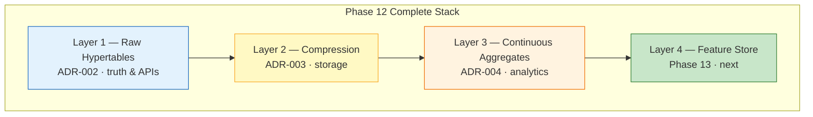
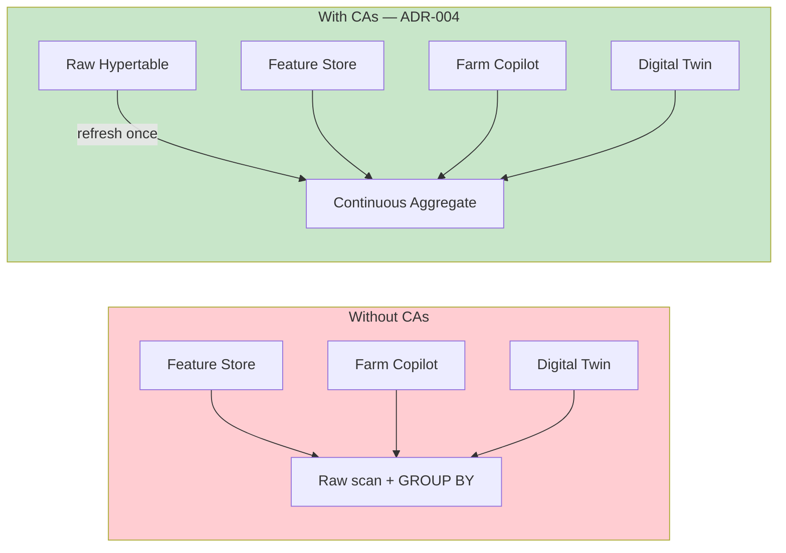
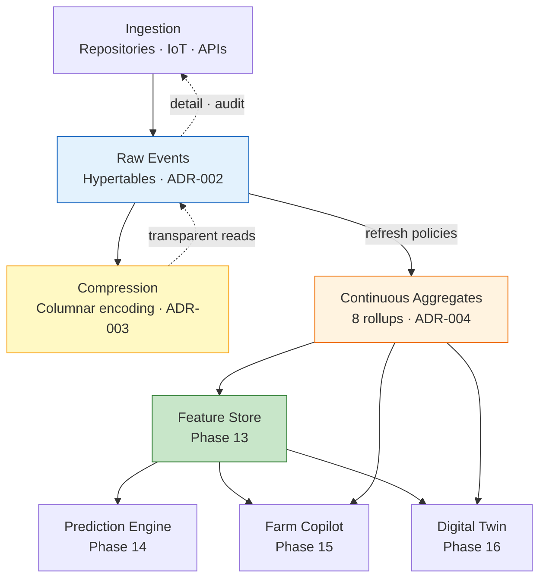
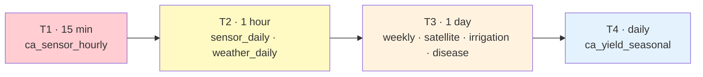
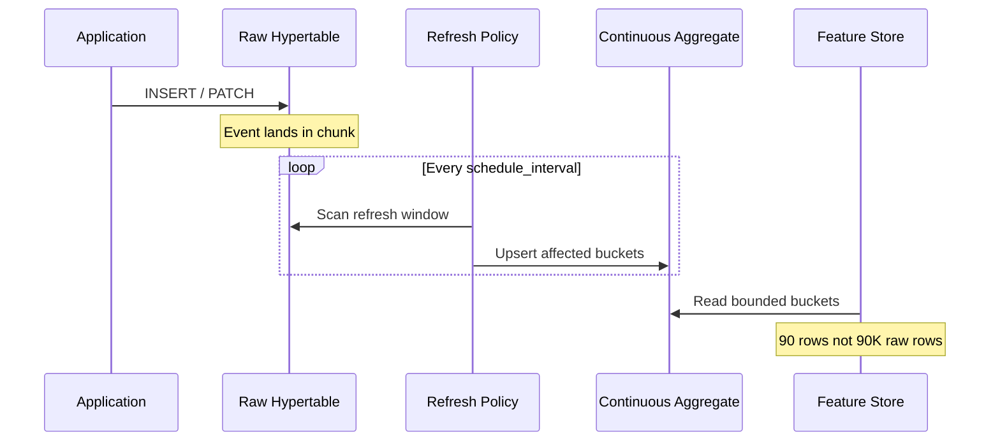
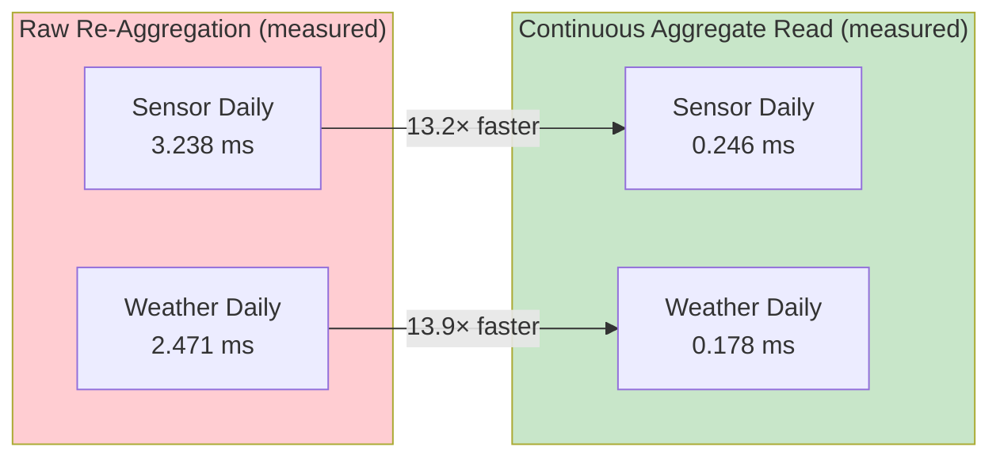
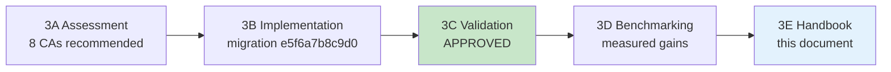
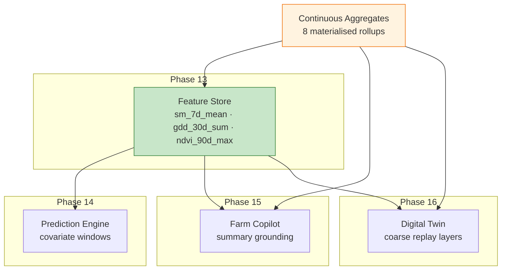
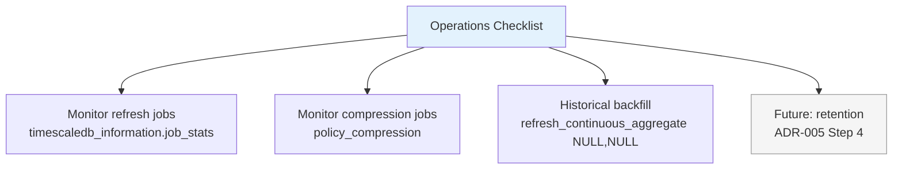
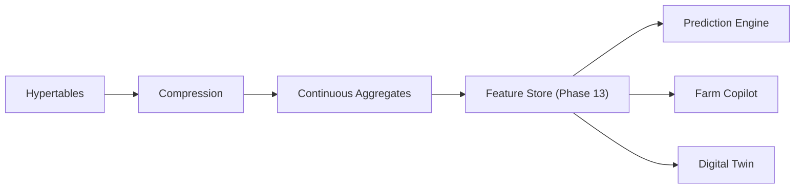

# Phase 12 — Analytical Platform Handbook

**Version:** 1.0  
**Status:** Approved  
**Last Updated:** 2026-06-30  
**Scope:** Phase 12 Step 3 — Continuous Aggregates & Analytical Layer  
**Related ADRs:** [ADR-003](adr/ADR-003-timescaledb-compression-policy-strategy.md) · [ADR-004](adr/ADR-004-timescaledb-continuous-aggregate-strategy.md)  
**Prerequisites:** [ADR-001](adr/ADR-001-timescaledb-extension-enablement.md) · [ADR-002](adr/ADR-002-hypertable-primary-key-conversion-strategy.md)  
**Foundation Handbook:** [10-phase12-step1-foundation-handbook.md](10-phase12-step1-foundation-handbook.md)  
**Decision Register:** [PHASE12_DECISION_REGISTER.md](report/PHASE12_DECISION_REGISTER.md) — P12-D012

---

## Phase 12 Step 3 at a Glance

| Metric | Value |
|---|---|
| Continuous Aggregates | **8** (ADR-004 catalogue) |
| Source Hypertables | **6** |
| Refresh Policy Tiers | **T1–T4** |
| Alembic Head | `e5f6a7b8c9d0` |
| Application Changes | **0** |
| CDD Validation | v1.0.0 — 458,645 rows |
| Query Correctness | **0 mismatches** (Step 3C) |
| Step 3C Status | **APPROVED** |

---

## Table of Contents

1. [Executive Overview](#1-executive-overview)
2. [Analytical Architecture](#2-analytical-architecture)
3. [End-to-End Data Flow](#3-end-to-end-data-flow)
4. [Aggregate Catalogue](#4-aggregate-catalogue)
5. [Refresh Lifecycle](#5-refresh-lifecycle)
6. [Performance Summary](#6-performance-summary)
7. [Engineering Journey](#7-engineering-journey)
8. [AI Readiness](#8-ai-readiness)
9. [Operational Guidance](#9-operational-guidance)
10. [Key Takeaways](#10-key-takeaways)
11. [References](#11-references)

---

## 1. Executive Overview

Phase 12 Steps 1–2 established the **time-series foundation**: six hypertables, columnar compression, and the Canonical Development Dataset (CDD). **Step 3 completes the analytical layer** by adding eight TimescaleDB continuous aggregates — incrementally refreshed `time_bucket()` rollups that sit between raw hypertables and the AI Feature Store.



**What Step 3 delivers:**

| Capability | Outcome |
|---|---|
| Pre-computed rollups | Eight aggregates across sensor, weather, satellite, irrigation, disease, and yield domains |
| Tiered refresh | T1 near-real-time through T4 event-driven (approximated) |
| Zero API impact | Persistence-layer addition only; repositories and services unchanged |
| Validated correctness | Full CDD materialisation; raw vs CA equivalence confirmed |
| Measured performance | 13–14× faster analytical reads vs raw re-aggregation |

**Who should read this handbook:** engineers onboarding to the data platform, architects reviewing Phase 13 readiness, and reviewers auditing Phase 12 completion. Detailed evidence lives in the Step 3A–3D reports referenced throughout — this document summarises and cross-references; it does not replace them.

---

## Phase 12 Analytical Platform at a Glance

| Layer | Technology | Responsibility | Introduced |
|---|---|---|---|
| Raw Storage | PostgreSQL + TimescaleDB Hypertables | Authoritative time-series data | Step 1 |
| Storage Optimization | TimescaleDB Compression | Reduce storage footprint and optimize historical reads | Step 2 |
| Analytical Layer | Continuous Aggregates | Precomputed analytical rollups | Step 3 |
| AI Feature Layer | Feature Store (Upcoming) | Versioned reusable ML features | Phase 13 |
| AI Applications | Prediction Engine, Farm Copilot, Digital Twin | AI workloads consuming analytical data | Phases 14–16 |

Phase 12 constructs the complete analytical persistence layer — from raw event storage through compression and pre-computed rollups — that all subsequent AI phases build upon. Steps 1–3 deliver the storage, optimization, and analytical tiers; Phases 13–16 consume that foundation without requiring persistence-layer redesign.

---

## 2. Analytical Architecture

### Why Continuous Aggregates Exist

Phase 12 Step 1 (hypertables) answers: *"What happened at time T?"*  
Phase 12 Step 2 (compression) answers: *"How do we store it efficiently?"*  
Phase 12 Step 3 (continuous aggregates) answers: *"What was the hourly/daily/weekly pattern?"*

AI workloads — Feature Store refresh, Farm Copilot, Digital Twin, training pipelines — repeatedly execute the same `GROUP BY time_bucket()` over identical windows. Without continuous aggregates, every consumer re-scans and re-aggregates raw hypertable rows.



### Relationship to ADR-004

[ADR-004](adr/ADR-004-timescaledb-continuous-aggregate-strategy.md) is the **authoritative architecture** for Step 3. It defines:

- The eight-aggregate catalogue (no additions without ADR amendment)
- Naming convention: `ca_{domain}_{interval}`
- Refresh tiers T1–T4 and policy parameters
- Rollout sequence and AI consumer mapping
- Validation requirements (fulfilled in Step 3C)

Step 3B implemented ADR-004 via migration `e5f6a7b8c9d0`. Step 3C validated runtime behaviour. Step 3D quantified performance. This handbook consolidates the outcome.

### Architectural Principles (Step 3)

| Principle | Meaning |
|---|---|
| Raw remains truth | APIs, audit, and fine-grain replay use hypertables |
| Compute once, read many | CAs materialise during refresh; consumers read buckets |
| Application transparency | No repository, service, or API changes |
| Alembic governance | All CA DDL and policies in versioned migrations |
| Compression synergy | CAs avoid repeated decompression on identical aggregations |

---

## 3. End-to-End Data Flow



| Stage | Responsibility | Written By | Read By |
|---|---|---|---|
| Raw events | Authoritative measurements | Application repositories | APIs, audit, detail queries |
| Hypertables | Time-partitioned storage | ADR-002 migration | All time-range queries |
| Compression | Storage reduction | TimescaleDB policy jobs | Transparent to queries |
| Continuous aggregates | Analytical rollups | TimescaleDB refresh jobs | Feature Store, Copilot, Twin |
| Feature Store | Versioned feature vectors | Phase 13 pipelines | Prediction Engine, Copilot, Twin |

---

## 4. Aggregate Catalogue

Authoritative source: [ADR-004 §4](adr/ADR-004-timescaledb-continuous-aggregate-strategy.md). Implementation: migration `e5f6a7b8c9d0`.

| Aggregate | Source Hypertable | Bucket | Primary Consumers | Tier |
|---|---|---|---|---|
| `ca_sensor_hourly` | `sensor_readings` | 1 hour | Feature Store (`sm_7d_mean`), Copilot, Twin | **T1** |
| `ca_sensor_daily` | `sensor_readings` | 1 day | Feature Store, dashboards, yield stress | **T2** |
| `ca_weather_daily` | `weather_records` | 1 day | Feature Store (`gdd_30d_sum`), ET₀, Copilot | **T2** |
| `ca_satellite_daily` | `satellite_observations` | 1 day | Feature Store (`ndvi_90d_max`), yield canopy | **T3** |
| `ca_weather_weekly` | `weather_records` | 1 week | Seasonal analytics, Copilot, climate features | **T3** |
| `ca_irrigation_monthly` | `irrigation_events` | 1 month | Feature Store (`irrigation_30d_mm`), water dashboards | **T3** |
| `ca_disease_weekly` | `disease_observations` | 1 week | Disease risk model, Copilot, scouting | **T3** |
| `ca_yield_seasonal` | `yield_records` | 90 days (season proxy) | Lagged yield features, Copilot, training labels | **T4** |

### Refresh Tier Summary



| Tier | Schedule | Aggregates | Intent |
|---|---|---|---|
| **T1** | 15 minutes | `ca_sensor_hourly` | Near-real-time IoT freshness |
| **T2** | 1 hour | `ca_sensor_daily`, `ca_weather_daily` | Feature Store daily pipeline cadence |
| **T3** | 1 day | Weekly, satellite, irrigation, disease | Batch feature engineering |
| **T4** | 1 day (approx.) | `ca_yield_seasonal` | Sparse harvest events; lowest priority |

---

## 5. Refresh Lifecycle

Continuous aggregates refresh **incrementally** — only buckets within `[now() − start_offset, now() − end_offset]` are recomputed when source data changes.



### Policy Parameters (Governed)

| Parameter | Purpose |
|---|---|
| `start_offset` | How far back to re-scan (late-arriving data, PATCH corrections) |
| `end_offset` | Buffer before `now()` — excludes in-flight incomplete buckets |
| `schedule_interval` | Background job cadence per tier |

**Implementation note:** `ca_weather_weekly` uses `start_offset = 21 days` (not ADR domain default of 7 days) to satisfy TimescaleDB's minimum window of 2× bucket width. Documented in [Step 3B Report](report/PHASE12_STEP3B_CONTINUOUS_AGGREGATE_IMPLEMENTATION_REPORT.md) v1.3.

### Historical Backfill

CAs are created `WITH NO DATA`. Automatic policies scan only `now()`-relative windows. Environments with **historical data** (e.g. CDD) require a one-time:

```
CALL refresh_continuous_aggregate('<aggregate_name>', NULL, NULL);
```

See [Step 3C Validation Report](report/PHASE12_STEP3C_CONTINUOUS_AGGREGATE_VALIDATION_REPORT.md) §5.

---

## 6. Performance Summary

Measured on CDD v1.0.0 (PostgreSQL 17.10 / TimescaleDB 2.28.1). Full methodology and SQL: [Step 3D Benchmark Report](report/PHASE12_STEP3D_PERFORMANCE_BENCHMARK_REPORT.md).

| Layer | Measured Result | Source |
|---|---|---|
| Raw hypertable queries | 1–12 ms wall-clock | Step 2C-D |
| Compression (`sensor_readings`) | 5.63× ratio · 79% reduction | Step 2C-D |
| Decompression overhead | +0 to +6 ms | Step 2C-D |
| CA vs raw (sensor daily, 90d) | **3.238 ms → 0.246 ms** (13.2×) | Step 3C |
| CA vs raw (weather daily, 90d) | **2.471 ms → 0.178 ms** (13.9×) | Step 3C |
| Correctness | 0 mismatches / 8 aggregates | Step 3C |



**At CDD scale**, absolute gains are single-digit milliseconds. The architectural benefit is **elimination of redundant aggregation** across Feature Store, Copilot, and Twin — advantage compounds at 10×–100× production volume. See Step 3D §5 for scaling discussion.

---

## 7. Engineering Journey

Phase 12 Step 3 progressed through assessment → implementation → validation → benchmarking. The implementation required **three runtime correction cycles** before full success.



| Step | Deliverable | Outcome |
|---|---|---|
| **3A** | [Architecture Assessment](report/PHASE12_STEP3A_CONTINUOUS_AGGREGATES_ARCHITECTURE_ASSESSMENT.md) | 8 CAs; tiered refresh; P12-D012 resolved |
| **3B** | [Implementation Report](report/PHASE12_STEP3B_CONTINUOUS_AGGREGATE_IMPLEMENTATION_REPORT.md) | Migration authored; v1.1–v1.3 corrections |
| **3B** | [Lessons Learned](report/PHASE12_STEP3B_IMPLEMENTATION_LESSONS_LEARNED.md) | Root-cause knowledge capture |
| **3C** | [Validation Report](report/PHASE12_STEP3C_CONTINUOUS_AGGREGATE_VALIDATION_REPORT.md) | Runtime verification; **APPROVED** |
| **3D** | [Benchmark Report](report/PHASE12_STEP3D_PERFORMANCE_BENCHMARK_REPORT.md) | Performance quantification |

**Critical implementation lessons** (detail in [Lessons Learned](report/PHASE12_STEP3B_IMPLEMENTATION_LESSONS_LEARNED.md)):

1. TimescaleDB CAs use `CREATE MATERIALIZED VIEW` syntax but are stored as `relkind = 'v'` — use `COMMENT ON VIEW`, not `COMMENT ON MATERIALIZED VIEW`.
2. Refresh policies require `start_offset − end_offset ≥ 2 × bucket_width` per aggregate, not per domain.
3. Historical datasets need manual `refresh_continuous_aggregate(NULL, NULL)` after migration.

---

## 8. AI Readiness

The analytical platform satisfies persistence-layer prerequisites for Phases 13–16. Application and Feature Store schema work remains in those phases.



| Phase | How CAs Enable It | Example Aggregate |
|---|---|---|
| **13 — Feature Store** | Bounded-cardinality reads; no per-pipeline raw re-aggregation | `ca_sensor_daily`, `ca_weather_daily`, `ca_satellite_daily` |
| **14 — Prediction Engine** | Pre-computed covariate windows for training and inference | `ca_sensor_daily`, `ca_weather_weekly` |
| **15 — Farm Copilot** | Sub-ms summary stats for conversational grounding | `ca_sensor_hourly`, `ca_weather_daily` |
| **16 — Digital Twin** | Daily/hourly coarse state layers without full raw replay | `ca_sensor_hourly`, `ca_satellite_daily` |

**Validated:** Step 3C confirmed 0 correctness mismatches and materialisation of all eight aggregates against CDD v1.0.0. Step 3C [Validation Decision](report/PHASE12_STEP3C_CONTINUOUS_AGGREGATE_VALIDATION_REPORT.md#validation-decision) formally approves progression to Phase 13.

---

## 9. Operational Guidance



### Refresh Cadence

| Tier | Interval | Monitor For |
|---|---|---|
| T1 | 15 minutes | `last_run_status != Success` |
| T2 | 1 hour | Lag > 2× schedule_interval |
| T3 | 1 day | Startup failures (observed transiently in Step 3C) |
| T4 | 1 day | Sparse data — manual refresh after harvest if needed |

### Monitoring

| Signal | Source | Action |
|---|---|---|
| CA refresh failures | `job_stats.total_failures` | Investigate; see Step 3C job 1013–1015 |
| Materialisation lag | `last_successful_finish` vs `now()` | Check policy window vs data arrival |
| Compression status | `hypertable_compression_stats` | Re-evaluate ratio at production volume |
| Storage growth | `hypertable_size()` | Plan ADR-005 retention |

### Compression Interaction

Compression (ADR-003) and continuous aggregates (ADR-004) are complementary:

- Compression reduces raw storage; transparent decompression adds small query overhead (+0–6 ms at CDD scale).
- CAs materialise summaries during refresh, avoiding repeated decompression for identical analytical queries.
- `start_offset` values for mutable hypertables exceed compression age thresholds — PATCH corrections within the refresh window trigger bucket recomputation.

### Future: Retention Policies

Retention is **out of scope** for Step 3 — deferred to [ADR-005](adr/) (Phase 12 Step 4). Retention will govern lifecycle of both raw chunks and CA materialisation hypertables.

---

## 10. Key Takeaways

1. **Three layers, one stack.** Hypertables (truth) → compression (storage) → continuous aggregates (analytics). Each layer addresses a distinct scalability dimension.

2. **ADR-004 is the contract.** Eight aggregates, four refresh tiers, zero application changes. Implementation and validation proved the architecture on CDD v1.0.0.

3. **Raw stays authoritative.** CAs are derived. APIs, audit, and fine-grain replay continue to use hypertables.

4. **Runtime validation is mandatory.** Step 3B surfaced two TimescaleDB-specific behaviours invisible at authoring time — CA object type and refresh window minimums. See [Lessons Learned](report/PHASE12_STEP3B_IMPLEMENTATION_LESSONS_LEARNED.md).

5. **Historical data needs explicit backfill.** `WITH NO DATA` + `now()`-relative policies do not populate past buckets automatically.

6. **Performance compounds across consumers.** Measured 13–14× per-query improvement; architectural value is eliminating N× redundant aggregation across Feature Store, Copilot, and Twin.

7. **Phase 13 is unblocked.** The analytical layer is validated, benchmarked, and approved. Feature Store design may proceed.

---

## 11. References

### Architecture Decision Records

| ADR | Title | Role in Step 3 |
|---|---|---|
| [ADR-001](adr/ADR-001-timescaledb-extension-enablement.md) | TimescaleDB Extension | Prerequisite |
| [ADR-002](adr/ADR-002-hypertable-primary-key-conversion-strategy.md) | Hypertable Strategy | Source layer for CAs |
| [ADR-003](adr/ADR-003-timescaledb-compression-policy-strategy.md) | Compression Strategy | Storage layer beneath CAs |
| [ADR-004](adr/ADR-004-timescaledb-continuous-aggregate-strategy.md) | Continuous Aggregate Strategy | **Authoritative Step 3 architecture** |

### Step 3 Reports

| Report | Step | Content |
|---|---|---|
| [PHASE12_STEP3A_CONTINUOUS_AGGREGATES_ARCHITECTURE_ASSESSMENT.md](report/PHASE12_STEP3A_CONTINUOUS_AGGREGATES_ARCHITECTURE_ASSESSMENT.md) | 3A | Evidence base for ADR-004 |
| [PHASE12_STEP3B_CONTINUOUS_AGGREGATE_IMPLEMENTATION_REPORT.md](report/PHASE12_STEP3B_CONTINUOUS_AGGREGATE_IMPLEMENTATION_REPORT.md) | 3B | Migration `e5f6a7b8c9d0`; corrections v1.1–v1.3 |
| [PHASE12_STEP3B_IMPLEMENTATION_LESSONS_LEARNED.md](report/PHASE12_STEP3B_IMPLEMENTATION_LESSONS_LEARNED.md) | 3B | Debugging journey; institutional knowledge |
| [PHASE12_STEP3C_CONTINUOUS_AGGREGATE_VALIDATION_REPORT.md](report/PHASE12_STEP3C_CONTINUOUS_AGGREGATE_VALIDATION_REPORT.md) | 3C | Runtime validation; **APPROVED** |
| [PHASE12_STEP3D_PERFORMANCE_BENCHMARK_REPORT.md](report/PHASE12_STEP3D_PERFORMANCE_BENCHMARK_REPORT.md) | 3D | Measured performance |

### Related Handbooks & Foundation

| Document | Relationship |
|---|---|
| [10-phase12-step1-foundation-handbook.md](10-phase12-step1-foundation-handbook.md) | Hypertable foundation; Phase 12 roadmap |
| [PHASE12_STEP2CD_RUNTIME_VALIDATION_AND_BENCHMARK_REPORT.md](report/PHASE12_STEP2CD_RUNTIME_VALIDATION_AND_BENCHMARK_REPORT.md) | Compression and raw query baselines |
| [PHASE12_DECISION_REGISTER.md](report/PHASE12_DECISION_REGISTER.md) | P12-D012 resolution |

### Implementation Artifact

| File | Revision |
|---|---|
| `backend/app/db/migrations/versions/e5f6a7b8c9d0_create_continuous_aggregates.py` | `e5f6a7b8c9d0` |

---

## Next Phase

Phase 12 has completed the analytical persistence platform. **Phase 13** introduces the Feature Store — the next layer that transforms validated continuous aggregates into reusable, versioned feature vectors for machine learning and conversational AI workloads.



- **Phase 12** established the storage, optimization, and analytical layers — hypertables (ADR-002), compression (ADR-003), and continuous aggregates (ADR-004).
- **Phase 13** introduces reusable, versioned feature vectors derived from the eight validated continuous aggregates.
- **No redesign of the persistence layer is expected** — Phase 13 builds on the architecture validated in Steps 3C and 3D.
- **Phase 13 will build directly** on the validated continuous aggregates created in Phase 12 Step 3.

Phase 12 concludes the construction of the AGRIFLOW-AI analytical persistence layer.

The next phase (Phase 13) builds upon this foundation by introducing the Feature Store.

The Feature Store will consume validated Continuous Aggregates to produce reusable, versioned feature vectors for:

- Yield Prediction
- Disease Risk Scoring
- Farm Copilot
- Digital Twin

No additional persistence redesign is expected.

Phase 12 serves as the **permanent analytical foundation** for all subsequent AI capabilities in the AGRIFLOW-AI platform. The persistence stack validated through Steps 1–3E is complete; Feature Store development and AI application phases may proceed with confidence in the underlying data architecture.

---

*11-phase12-analytical-platform-handbook.md v1.0 — 2026-06-30 — Phase 12 Step 3E*
