# Phase 12 — Complete Architecture Handbook

**Version:** 1.0  
**Status:** Approved  
**Last Updated:** 2026-06-30  
**Scope:** Phase 12 — Complete TimescaleDB Analytical Data Platform  
**Related ADRs:** [ADR-001](adr/ADR-001-timescaledb-extension-enablement.md) · [ADR-002](adr/ADR-002-hypertable-primary-key-conversion-strategy.md) · [ADR-003](adr/ADR-003-timescaledb-compression-policy-strategy.md) · [ADR-004](adr/ADR-004-timescaledb-continuous-aggregate-strategy.md) · [ADR-005](adr/ADR-005-timescaledb-retention-policy-strategy.md)  
**Prerequisites:** [10-phase12-step1-foundation-handbook.md](10-phase12-step1-foundation-handbook.md) · [11-phase12-analytical-platform-handbook.md](11-phase12-analytical-platform-handbook.md)  
**Decision Register:** [PHASE12_DECISION_REGISTER.md](report/PHASE12_DECISION_REGISTER.md)

---

## Phase 12 at a Glance

| Metric | Value |
|---|---|
| **Status** | ✅ Complete — validated end-to-end |
| **Database platform** | PostgreSQL 17.10 + TimescaleDB 2.28.1 |
| **Architecture Decision Records** | **5** (ADR-001 → ADR-005) |
| **TimescaleDB Alembic migrations** | **5** (`f1e2d3c4b5a6` → `f6a7b8c9d0e1`) |
| **Alembic head** | `f6a7b8c9d0e1` |
| **Hypertables** | **6** |
| **Relational tables (unchanged)** | **4** |
| **Compression policies** | **6** |
| **Continuous aggregates** | **8** |
| **CA refresh policies** | **8** (T1–T4) |
| **Retention policies** | **11** (5 raw + 6 CA) |
| **Background jobs (platform)** | **27** |
| **CDD validation corpus** | v1.0.0 — 458,645 rows |
| **Application layer changes** | **0** (API · service · repository) |
| **Runtime validation** | Step 2C-D · Step 3C · Step 4C — all **APPROVED** |

---

## Table of Contents

1. [Executive Summary](#1-executive-summary)
2. [Before vs After Phase 12](#2-before-vs-after-phase-12)
3. [Phase 12 Objectives](#3-phase-12-objectives)
4. [Complete Layered Architecture](#4-complete-layered-architecture)
5. [End-to-End Data Journey](#5-end-to-end-data-journey)
6. [Query Lifecycle](#6-query-lifecycle)
7. [Chunk Lifecycle](#7-chunk-lifecycle)
8. [Background Job Ecosystem](#8-background-job-ecosystem)
9. [Architecture Decision Evolution](#9-architecture-decision-evolution)
10. [Performance Story](#10-performance-story)
11. [Operational Lifecycle](#11-operational-lifecycle)
12. [AI Readiness](#12-ai-readiness)
13. [Production Readiness](#13-production-readiness)
14. [Engineering Lessons Learned](#14-engineering-lessons-learned)
15. [Engineering Metrics Dashboard](#15-engineering-metrics-dashboard)
16. [Complete Phase 12 Timeline](#16-complete-phase-12-timeline)
17. [Future Architecture](#17-future-architecture)
18. [Further Reading](#18-further-reading)

---

## 1. Executive Summary

### Why Phase 12 Exists

AGRIFLOW-AI entered Phase 12 as a fully operational agricultural management platform. Eleven prior phases delivered domain APIs, repositories, and relational persistence for farms, fields, crops, and six measurement domains. The platform could record and serve sensor, weather, satellite, irrigation, yield, and disease data — but it could not **scale** that history for enterprise deployments or the AI roadmap.

Production-scale telemetry (10M–100M `sensor_readings` rows per year at 100 farms) overwhelms standard PostgreSQL range scans. Every planned AI capability — Feature Store, Prediction Engine, Farm Copilot, Digital Twin — is fundamentally a **time-window model**. Phase 12 upgrades the persistence layer to TimescaleDB and builds a four-tier analytical stack on top of PostgreSQL without changing the application layer.

### Problems Solved

| Problem | Phase 12 Solution | ADR |
|---|---|---|
| Full-table scans on growing history | Hypertable chunk exclusion | ADR-002 |
| Unbounded storage growth | Columnar compression on cold chunks | ADR-003 |
| Repeated identical aggregations | Pre-computed continuous aggregates | ADR-004 |
| Unpredictable long-term storage cost | Domain-tiered retention with CA preservation | ADR-005 |
| No repeatable validation corpus | Canonical Development Dataset (CDD) v1.0.0 | Step 2C-A |

### Technologies Introduced

| Technology | Role |
|---|---|
| **TimescaleDB 2.28.1** | PostgreSQL extension — hypertables, compression, CAs, retention |
| **`timescale/timescaledb:2.28.1-pg17`** | Official Docker image (P12-D001, P12-D002) |
| **Policy-based automation** | Compression, CA refresh, retention background jobs |
| **CDD v1.0.0** | Deterministic 365-day agricultural validation corpus |

### Architectural Outcomes

Phase 12 delivers a **complete analytical persistence platform**:

```
Raw Hypertables → Compression → Continuous Aggregates → Retention → (Future) Feature Store
```

- **Zero application-layer changes** — Clean Architecture preserved; all optimisation is persistence infrastructure.
- **Governance-first delivery** — Five ADRs, twelve Decision Register entries, assessment → implementation → validation for every capability.
- **Measured validation** — CDD v1.0.0 (458,645 rows) exercised at Steps 2C, 3C, and 4C.

### AI Readiness

Phase 12 satisfies the persistence prerequisites for Phases 13–16. Bounded-cardinality CA reads, multi-season summary retention, and indefinite yield label preservation prepare the platform for Feature Store materialisation without persistence-layer redesign.

**Key takeaway:** Phase 12 is the analytical foundation. It answers *how data is stored, compressed, summarised, and retired* — enabling Phase 13+ to answer *what features and models consume that data*.

---

## 2. Before vs After Phase 12

### Before — Standard PostgreSQL

| Attribute | State |
|---|---|
| Engine | PostgreSQL 17 (`postgres:17-alpine`) |
| Time-series tables | Standard B-tree indexed relations |
| Partitioning | None |
| Compression | Row-oriented only |
| Pre-computed analytics | None |
| Data lifecycle | Unbounded growth |
| AI query pattern | Full raw scans per consumer |

### After — TimescaleDB Analytical Platform

| Attribute | State |
|---|---|
| Engine | PostgreSQL 17.10 + TimescaleDB 2.28.1 |
| Time-series tables | 6 hypertables with chunk exclusion |
| Compression | 6 policy-driven columnar cold tiers |
| Pre-computed analytics | 8 continuous aggregates, tiered refresh |
| Data lifecycle | 11 retention policies; 3 exemptions |
| AI query pattern | CA-backed bounded reads; raw for detail |

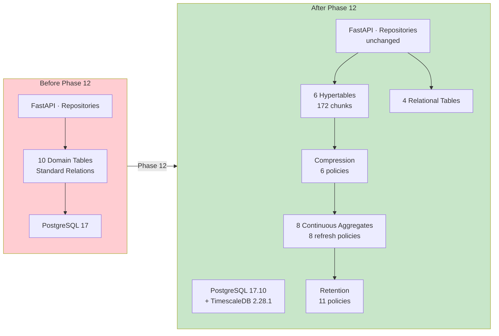

**What did not change:** API routes, service interfaces, repository contracts, domain models (except composite PK declarations on six ORM models), Docker Compose topology, and Clean Architecture boundaries. See [Foundation Handbook §5](10-phase12-step1-foundation-handbook.md).

---

## 3. Phase 12 Objectives

| Step | Purpose | Outcome | Governing ADR | Validation |
|---|---|---|---|---|
| **1A–1B** | Infrastructure assessment and planning | TimescaleDB image selected; backup/rollback protocol | P12-D001–D005 | Step 1A/1B reports |
| **1C** | Docker image swap | `timescale/timescaledb:2.28.1-pg17` operational | P12-D001 | [Step 1C Report](report/PHASE12_STEP1C_IMPLEMENTATION_REPORT.md) |
| **1D** | Extension enablement | TimescaleDB 2.28.1 active via Alembic | ADR-001 | [Step 1D Report](report/PHASE12_STEP1D_EXTENSION_ENABLEMENT_REPORT.md) |
| **1E** | Hypertable conversion | 6 hypertables; composite PKs; 0 app changes | ADR-002 | [Step 1E-B Report](report/PHASE12_STEP1EB_HYPERTABLE_IMPLEMENTATION_REPORT.md) |
| **2A–2B** | Compression strategy and implementation | 6 compression policies authored | ADR-003 | [Step 2B Report](report/PHASE12_STEP2B_COMPRESSION_IMPLEMENTATION_REPORT.md) |
| **2C** | CDD and runtime validation | 458,645 rows; 5.63× sensor compression measured | ADR-003 | [Step 2C-D Report](report/PHASE12_STEP2CD_RUNTIME_VALIDATION_AND_BENCHMARK_REPORT.md) |
| **3A–3B** | Continuous aggregate strategy and DDL | 8 CAs; 8 refresh policies | ADR-004 | [Step 3B Report](report/PHASE12_STEP3B_CONTINUOUS_AGGREGATE_IMPLEMENTATION_REPORT.md) |
| **3C** | CA runtime validation | 0 correctness mismatches; 13–14× query gain | ADR-004 | [Step 3C Report](report/PHASE12_STEP3C_CONTINUOUS_AGGREGATE_VALIDATION_REPORT.md) |
| **3D** | Performance benchmarking | Measured stack characterisation | ADR-003, ADR-004 | [Step 3D Report](report/PHASE12_STEP3D_PERFORMANCE_BENCHMARK_REPORT.md) |
| **4A** | Retention architecture assessment | Domain-tiered lifecycle designed | — | [Step 4A Report](report/PHASE12_STEP4A_RETENTION_ARCHITECTURE_ASSESSMENT.md) |
| **4B** | Retention implementation | 11 retention policies authored | ADR-005 | [Step 4B Report](report/PHASE12_STEP4B_RETENTION_IMPLEMENTATION_REPORT.md) |
| **4C** | Retention runtime validation | 11 jobs registered; exemptions verified | ADR-005 | [Step 4C Report](report/PHASE12_STEP4C_RETENTION_RUNTIME_VALIDATION_REPORT.md) |

---

## 4. Complete Layered Architecture

Phase 12 extends — never replaces — the existing Clean Architecture stack. TimescaleDB capabilities sit entirely below the repository layer.

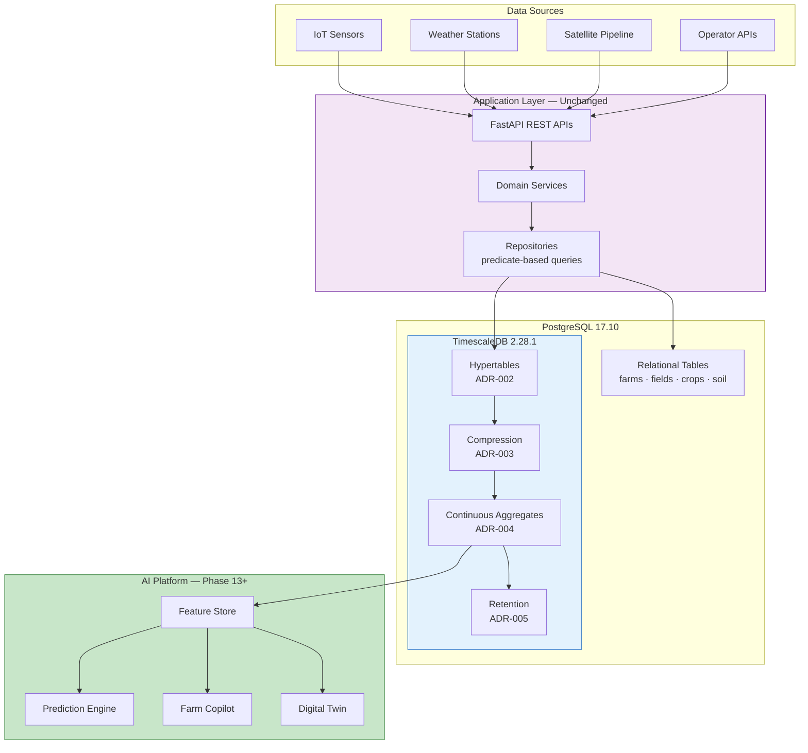

### Layer Reference

| Layer | Responsibility | Phase 12 Artifact | Application Awareness |
|---|---|---|---|
| **IoT / APIs** | Ingest measurements | Existing domain APIs | Yes — writes via repositories |
| **Services** | Business rules | Unchanged | Yes |
| **Repositories** | Data access | Unchanged predicate queries | Yes — opaque to TimescaleDB |
| **Relational tables** | Reference data | 4 tables permanent | Yes |
| **Hypertables** | Time-partitioned truth | 6 tables, 172 chunks | No |
| **Compression** | Cold storage efficiency | 6 policies | No |
| **Continuous aggregates** | Analytical rollups | 8 CAs, 8 refresh policies | No (Phase 13+ read paths) |
| **Retention** | Lifecycle governance | 11 policies, 3 exemptions | No |
| **Feature Store** | Versioned ML features | Phase 13 | Future |

Detail per layer: [Foundation Handbook](10-phase12-step1-foundation-handbook.md) (Steps 1–2) · [Analytical Platform Handbook](11-phase12-analytical-platform-handbook.md) (Step 3) · [ADR-005](adr/ADR-005-timescaledb-retention-policy-strategy.md) (Step 4).

---

## 5. End-to-End Data Journey

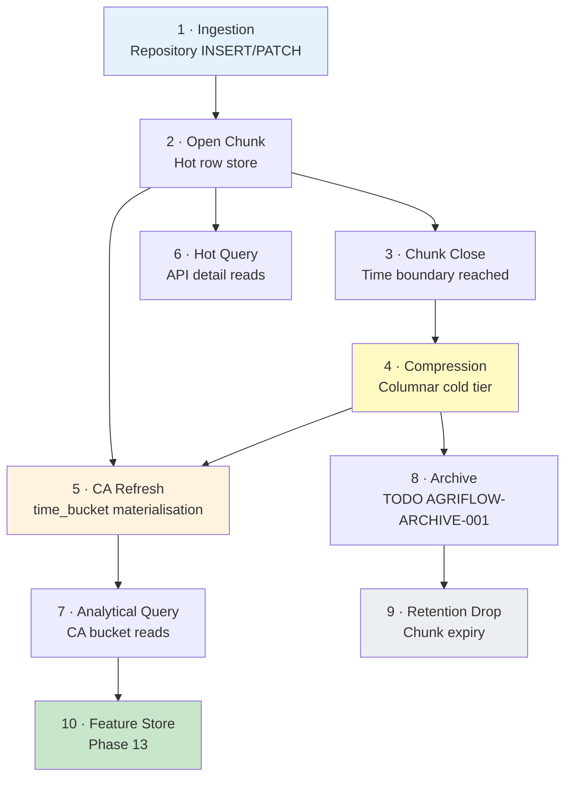

### Journey Stages

1. **Ingestion** — Application repositories write to hypertables. UUID identity and composite PKs (`id`, `time_col`) per ADR-002.
2. **Hot storage** — Recent chunks remain uncompressed for write performance and PATCH semantics on mutable domains.
3. **Compression** — `policy_compression` transitions cold chunks to columnar storage per ADR-003 age thresholds.
4. **CA refresh** — `policy_refresh_continuous_aggregate` incrementally materialises `time_bucket()` rollups per ADR-004 tiers T1–T4.
5. **Consumption** — APIs read raw hypertables; analytical/AI consumers read CAs (Phase 13+).
6. **Archive** — Future Azure Blob export before production drops (`AGRIFLOW-ARCHIVE-001`).
7. **Retention** — `policy_retention` drops aged chunks; CAs preserve summaries beyond raw expiry per ADR-005.

CDD exercises the full journey at development scale. See [CDD Architecture](report/PHASE12_STEP2CA_CANONICAL_DEVELOPMENT_DATASET_ARCHITECTURE.md).

---

## 6. Query Lifecycle

Analytical queries benefit from four stacked optimisations introduced across Phase 12.

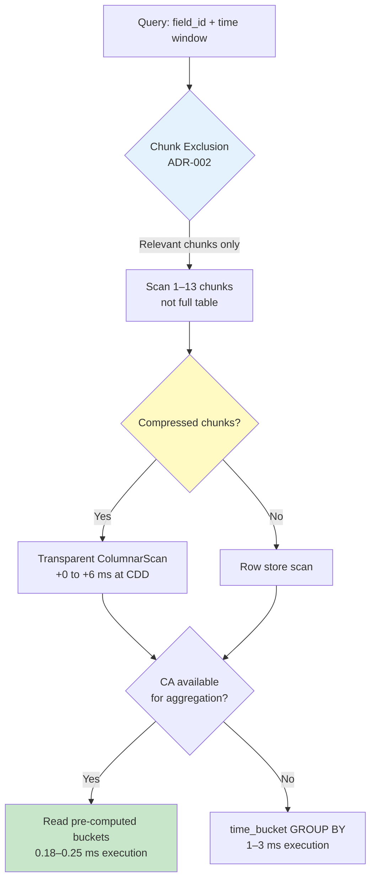

### Optimisation Summary

| Optimisation | Mechanism | Measured Benefit (CDD) | Reference |
|---|---|---|---|
| **Chunk exclusion** | Partition pruning on time dimension | Hot window 1 ms; 30-day 5 ms | [Step 2C-D](report/PHASE12_STEP2CD_RUNTIME_VALIDATION_AND_BENCHMARK_REPORT.md) |
| **Compression** | Columnar encoding; fewer bytes read | 5.63× sensor ratio; 79% reduction | [Step 2C-D](report/PHASE12_STEP2CD_RUNTIME_VALIDATION_AND_BENCHMARK_REPORT.md) |
| **Transparent decompression** | Query planner ColumnarScan | +0 to +6 ms overhead | [Step 2C-D](report/PHASE12_STEP2CD_RUNTIME_VALIDATION_AND_BENCHMARK_REPORT.md) |
| **Continuous aggregates** | Pre-materialised buckets | 13.2× sensor daily; 13.9× weather daily | [Step 3C](report/PHASE12_STEP3C_CONTINUOUS_AGGREGATE_VALIDATION_REPORT.md) |

**Routing guidance:** API point-in-time detail → raw hypertable. Feature Store / Copilot summaries → continuous aggregates. Audit and fine-grain replay → raw within retention window.

---

## 7. Chunk Lifecycle

Every measurement row lives inside a TimescaleDB chunk. Phase 12 automates the full chunk lifecycle.

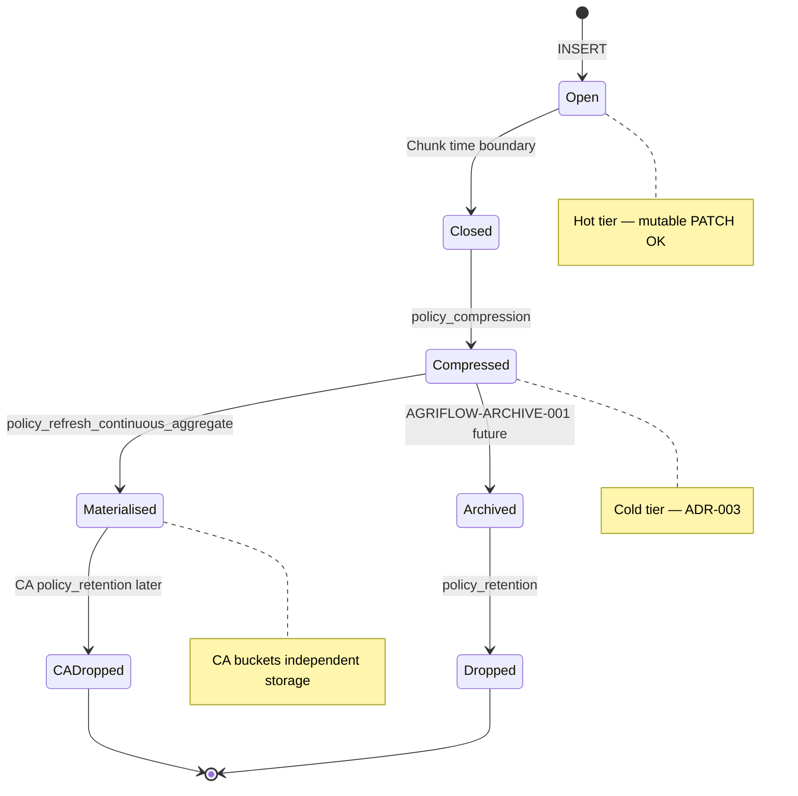

### Chunk Intervals (ADR-002)

| Hypertable | Chunk Interval | Retention `drop_after` |
|---|---|---|
| `sensor_readings` | 7 days | 24 months (2 years) |
| `weather_records` | 7 days | 36 months (3 years) |
| `satellite_observations` | 7 days | 36 months (3 years) |
| `irrigation_events` | 30 days | 7 years |
| `disease_observations` | 30 days | 7 years |
| `yield_records` | 90 days | **Exempt** |

At CDD scale: **172 chunks**, **0 drops** (oldest data ~395 days < shortest 2-year horizon). See [Step 4C](report/PHASE12_STEP4C_RETENTION_RUNTIME_VALIDATION_REPORT.md).

---

## 8. Background Job Ecosystem

TimescaleDB policy jobs automate the analytical platform. Measured at Step 4C validation (2026-06-30).

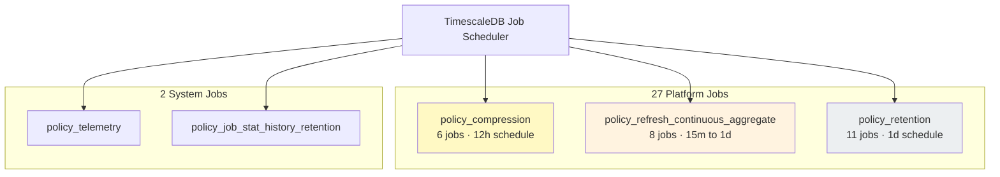

### Implementation Metrics (Runtime — Step 4C)

| Job Type | Count | ADR | Schedule (measured) | Last Status |
|---|---|---|---|---|
| `policy_compression` | 6 | ADR-003 | 12 hours | Success |
| `policy_refresh_continuous_aggregate` | 8 | ADR-004 | 15 min – 1 day (T1–T4) | Success |
| `policy_retention` | 6 raw + 5 CA* | ADR-005 | 1 day (default) | 11 of 11 Success |
| System | 2 | — | Internal | Active |

\*CA retention jobs register against logical `ca_*` view names per TimescaleDB API.

### Compression Pipeline

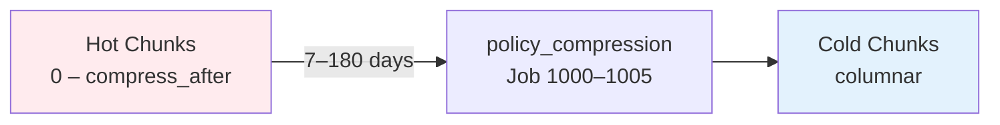

Per-table thresholds: [ADR-003 §4](adr/ADR-003-timescaledb-compression-policy-strategy.md).

### Continuous Aggregate Pipeline

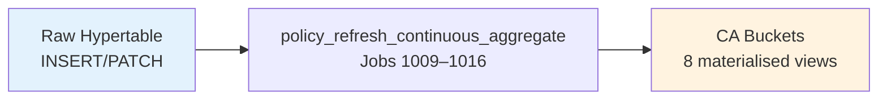

Refresh tiers T1–T4: [ADR-004 §6](adr/ADR-004-timescaledb-continuous-aggregate-strategy.md) · [Analytical Handbook §5](11-phase12-analytical-platform-handbook.md).

---

## 9. Architecture Decision Evolution

Each ADR unlocks the next capability. Phase 12 deliberately sequenced decisions to avoid implementing optimisation before prerequisites existed.

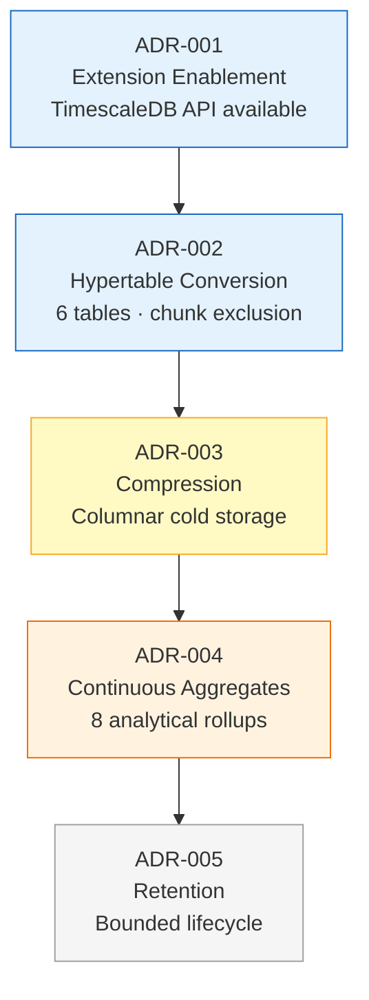

| ADR | Enables | Depends On |
|---|---|---|
| **ADR-001** | `create_hypertable()`, compression, CAs, retention APIs | Docker image (P12-D001) |
| **ADR-002** | Chunk exclusion; time partitioning; composite PKs | ADR-001 |
| **ADR-003** | 10–30× cold storage reduction; compression jobs | ADR-002 hypertables |
| **ADR-004** | Bounded analytical reads; `time_bucket()` materialisation | ADR-002 + ideally ADR-003 |
| **ADR-005** | Storage plateau; CA-outlives-raw lifecycle | ADR-002–004 + CDD validation |

### Alembic Migration Chain

```
f1e2d3c4b5a6  enable_timescaledb_extension           (ADR-001)
c9d8e7f6a5b4  convert_time_series_tables_to_hypertables (ADR-002)
d4f5e6a7b8c9  enable_hypertable_compression_policies   (ADR-003)
e5f6a7b8c9d0  create_continuous_aggregates             (ADR-004)
f6a7b8c9d0e1  enable_retention_policies                (ADR-005)  ← head
```

---

## 10. Performance Story

All figures below are **measured** on CDD v1.0.0 (PostgreSQL 17.10 / TimescaleDB 2.28.1, macOS Docker). Sources: [Step 2C-D](report/PHASE12_STEP2CD_RUNTIME_VALIDATION_AND_BENCHMARK_REPORT.md), [Step 3C](report/PHASE12_STEP3C_CONTINUOUS_AGGREGATE_VALIDATION_REPORT.md), [Step 3D](report/PHASE12_STEP3D_PERFORMANCE_BENCHMARK_REPORT.md).

### Compression (Step 2C-D)

| Hypertable | Before | After | Ratio | Reduction |
|---|---|---|---|---|
| `sensor_readings` | 106.7 MB | 21.9 MB | **5.63×** | **79%** |
| `weather_records` | 9.0 MB | 5.3 MB | 1.69× | 41% |
| `satellite_observations` | 9.3 MB | 6.1 MB | 1.52× | 34% |

Total hypertable storage post Phase-1 compression: **~41 MB** (458,645 rows).

ADR-003 production target ≥10× on `sensor_readings` — not met at CDD dev scale; architecture validated, ratio expected to improve at production volume. See [Step 2C-D §Compression Ratios](report/PHASE12_STEP2CD_RUNTIME_VALIDATION_AND_BENCHMARK_REPORT.md).

### Raw Query Latency (Step 2C-D)

| Query | Elapsed |
|---|---|
| Hot window — 7-day sensor aggregate | **1 ms** |
| Last 30 days soil moisture | **5 ms** (7 ms post-compression) |
| Daily weather trends — 365 days | **7 ms** (12 ms post-compression) |
| NDVI trajectory | **5 ms** (11 ms post-compression) |

### Continuous Aggregate Performance (Step 3C)

| Query | Raw Execution | CA Execution | Improvement |
|---|---|---|---|
| Sensor daily avg, 90-day, SOIL_MOISTURE | **3.238 ms** | **0.246 ms** | **13.2×** |
| Weather daily avg+sum, 90-day | **2.471 ms** | **0.178 ms** | **13.9×** |

**Correctness:** 0 mismatches across all 8 aggregates at full CDD scale.

### Architectural Performance Conclusion

At CDD scale, absolute latencies are single-digit milliseconds. The architectural value is **elimination of redundant aggregation** across Feature Store, Copilot, and Twin — advantage compounds at 10×–100× production volume. See [Step 3D §8 Scaling Discussion](report/PHASE12_STEP3D_PERFORMANCE_BENCHMARK_REPORT.md).

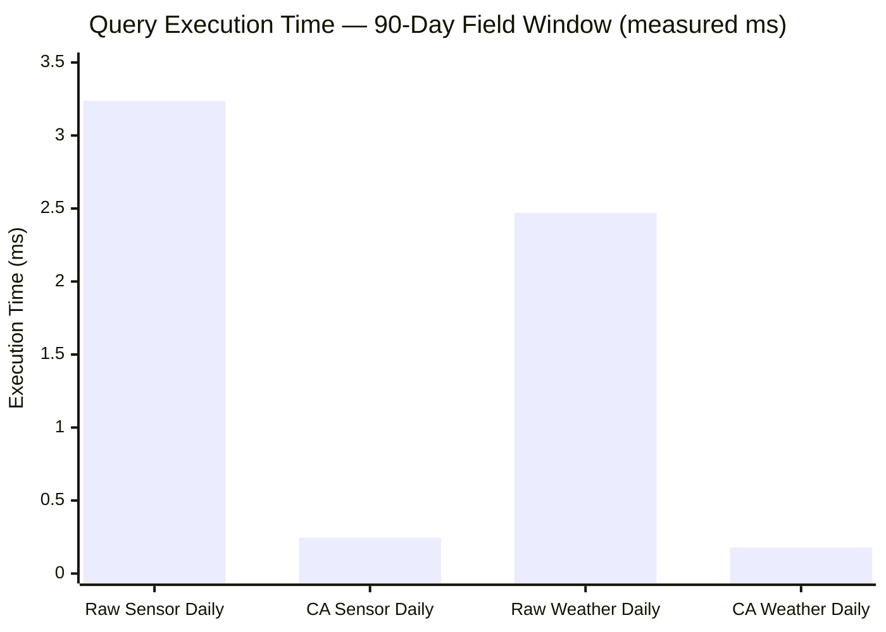

---

## 11. Operational Lifecycle

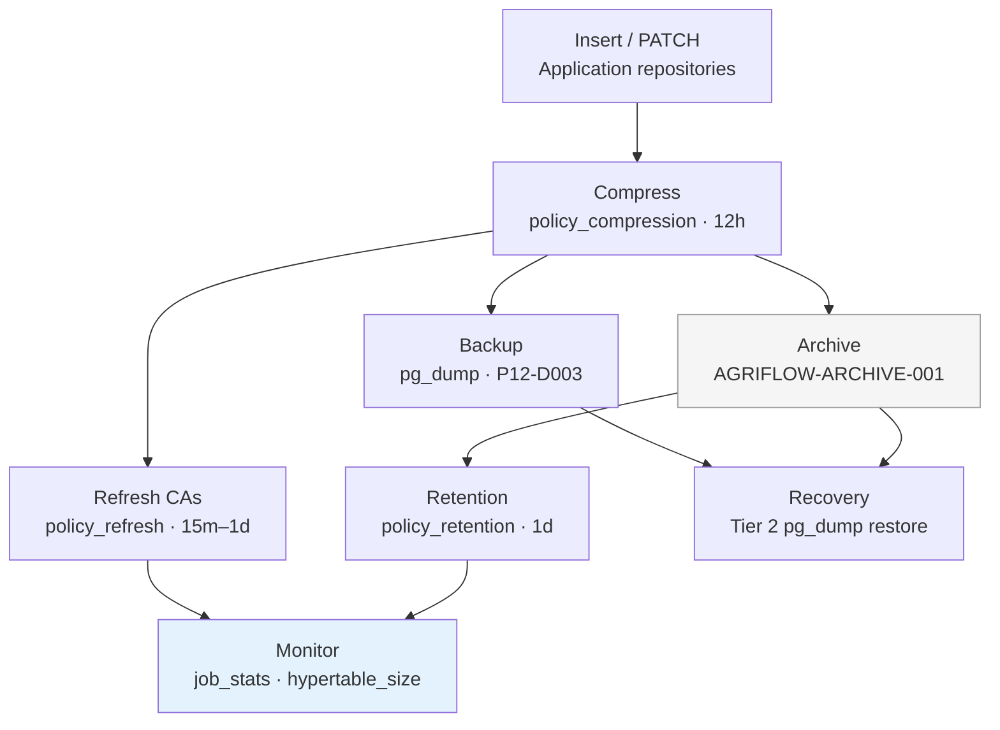

### Operational Reference

| Activity | Mechanism | Governance |
|---|---|---|
| **Insert** | Repository layer | Unchanged application code |
| **Compress** | 6 `policy_compression` jobs | ADR-003 |
| **Refresh** | 8 `policy_refresh_continuous_aggregate` jobs | ADR-004 |
| **Backup** | `pg_dump` before every migration | P12-D003 |
| **Archive** | Azure Blob Parquet (deferred) | ADR-005 · `AGRIFLOW-ARCHIVE-001` |
| **Retention** | 11 `policy_retention` jobs | ADR-005 |
| **Monitor** | `timescaledb_information.job_stats` | [Analytical Handbook §9](11-phase12-analytical-platform-handbook.md) |
| **Recovery** | Tier 2 `pg_dump` restore | P12-D005 |

**Production gate:** Retention drops require archive-before-delete pipeline before production activation. See [Step 4B](report/PHASE12_STEP4B_RETENTION_IMPLEMENTATION_REPORT.md).

---

## 12. AI Readiness

Phase 12 delivers the persistence foundation for Phases 13–16. No redesign of the storage layer is expected.

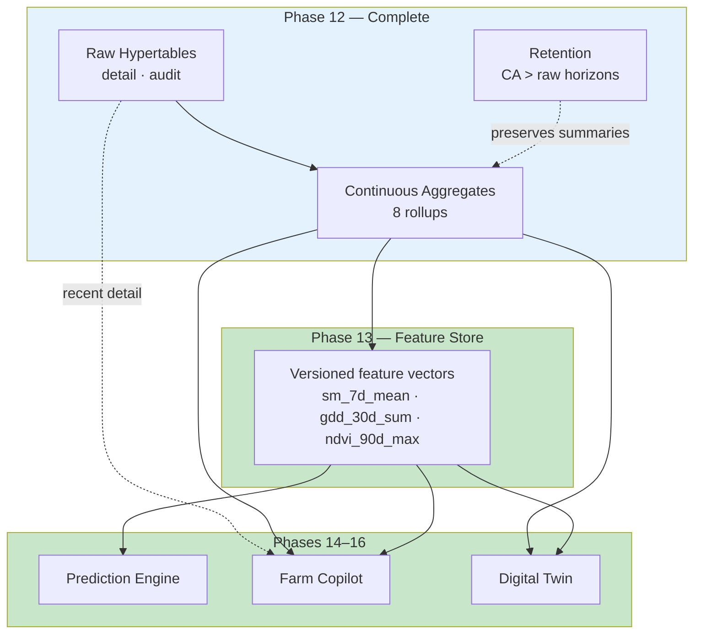

| Phase | Capability | Phase 12 Enabler | Primary Data Path |
|---|---|---|---|
| **13 — Feature Store** | Versioned ML feature vectors | 8 CAs; bounded cardinality; CDD feature windows | `ca_sensor_daily`, `ca_weather_daily`, `ca_satellite_daily` |
| **14 — Prediction Engine** | Multi-season model training | CA covariates; indefinite `yield_records` | CAs + raw yield labels |
| **15 — Farm Copilot** | Conversational field intelligence | Sub-ms CA reads; summary grounding | `ca_sensor_hourly`, `ca_weather_daily` |
| **16 — Digital Twin** | Field state replay | Hourly/daily CA timelines; raw for current season | CAs coarse mode + raw fine-grain |

Feature-to-CA mapping: [ADR-004 §10](adr/ADR-004-timescaledb-continuous-aggregate-strategy.md) · [Analytical Handbook §8](11-phase12-analytical-platform-handbook.md).

---

## 13. Production Readiness

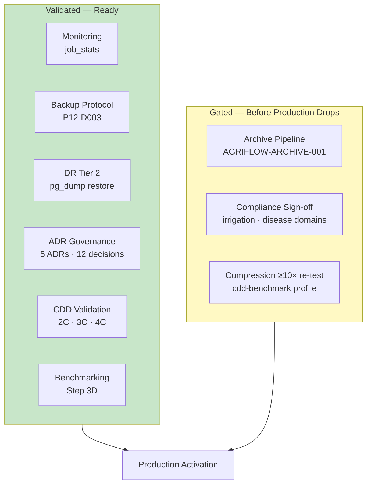

| Area | Status | Reference |
|---|---|---|
| **Monitoring** | `job_stats` for compression, refresh, retention | [Step 4C §9.1](report/PHASE12_STEP4C_RETENTION_RUNTIME_VALIDATION_REPORT.md) |
| **Backup** | Mandatory pre-migration `pg_dump` | P12-D003 |
| **Disaster recovery** | Tier 2 restore; archive tertiary (future) | P12-D005 · ADR-005 |
| **Governance** | ADR-amendment required for policy changes | [Decision Register](report/PHASE12_DECISION_REGISTER.md) |
| **Migration strategy** | Forward Alembic only; governance-first batch execution | Step 2B/3B/4B reports |
| **Validation strategy** | CDD v1.0.0 simulation gates per step | [CDD Architecture](report/PHASE12_STEP2CA_CANONICAL_DEVELOPMENT_DATASET_ARCHITECTURE.md) |
| **Benchmarking** | Step 2C-D + Step 3D measured baselines | [Step 3D](report/PHASE12_STEP3D_PERFORMANCE_BENCHMARK_REPORT.md) |
| **Archive pipeline** | ⏳ Deferred | `TODO(AGRIFLOW-ARCHIVE-001)` |

---

## 14. Engineering Lessons Learned

Phase 12 surfaced infrastructure patterns that apply beyond TimescaleDB. Full debugging narratives live in dedicated documents — this section summarises cross-cutting lessons.

| Lesson | Context | Detail In |
|---|---|---|
| **Governance-first execution** | Migrations authored and reviewed before batch runtime | [Step 2B](report/PHASE12_STEP2B_COMPRESSION_IMPLEMENTATION_REPORT.md), [Step 3B](report/PHASE12_STEP3B_CONTINUOUS_AGGREGATE_IMPLEMENTATION_REPORT.md) |
| **ADR-before-implementation** | No capability deployed without approved ADR | All five ADRs |
| **CA object type is `relkind='v'`** | `COMMENT ON MATERIALIZED VIEW` fails; use `COMMENT ON VIEW` | [Step 3 Lessons Learned](report/PHASE12_STEP3B_IMPLEMENTATION_LESSONS_LEARNED.md) |
| **Refresh window ≥ 2 × bucket width** | `ca_weather_weekly` required 21-day `start_offset` | [Step 3 Lessons Learned](report/PHASE12_STEP3B_IMPLEMENTATION_LESSONS_LEARNED.md) |
| **Historical CDD needs manual CA backfill** | `WITH NO DATA` + `now()`-relative policies skip history | [Step 3C](report/PHASE12_STEP3C_CONTINUOUS_AGGREGATE_VALIDATION_REPORT.md) |
| **`shared_preload_libraries` gap** | Extension enablement required preload config | [ADR-001](adr/ADR-001-timescaledb-extension-enablement.md) |
| **Composite PK preserves UUID APIs** | `WHERE id = :id` unchanged; zero repository impact | [ADR-002](adr/ADR-002-hypertable-primary-key-conversion-strategy.md) |
| **Retention on logical CA names** | `add_retention_policy('ca_sensor_daily', ...)` is official API | [Step 4B](report/PHASE12_STEP4B_RETENTION_IMPLEMENTATION_REPORT.md) |
| **Interval normalisation** | `24 months` stored as `2 years` in job config | [Step 4C](report/PHASE12_STEP4C_RETENTION_RUNTIME_VALIDATION_REPORT.md) |
| **CDD as single validation corpus** | All benchmarks and validations use identical deterministic data | [CDD Architecture](report/PHASE12_STEP2CA_CANONICAL_DEVELOPMENT_DATASET_ARCHITECTURE.md) |

**Principle:** Extension-specific DDL authored against ADRs is necessary but not sufficient. Runtime validation against representative data (CDD) is mandatory.

---

## 15. Engineering Metrics Dashboard

### Platform Metrics (Runtime — Step 4C)

| Category | Metric | Value |
|---|---|---|
| **Infrastructure** | PostgreSQL version | 17.10 |
| | TimescaleDB version | 2.28.1 |
| | Docker image | `timescale/timescaledb:2.28.1-pg17` |
| **Schema** | Hypertables | 6 |
| | Relational tables | 4 |
| | Total chunks (CDD) | 172 |
| | CDD rows | 458,645 |
| **Policies** | Compression | 6 |
| | CA refresh | 8 |
| | Retention | 11 |
| | Policy exemptions | 3 (`yield_records`, `ca_irrigation_monthly`, `ca_yield_seasonal`) |
| **Background jobs** | Platform jobs | 27 |
| | System jobs | 2 |
| **Storage** | Total hypertable size (compressed) | ~41 MB (Step 2C-D) |
| | Largest domain | `sensor_readings` 22 MB |
| **Performance** | Sensor compression ratio | 5.63× |
| | CA vs raw (sensor 90d) | 13.2× |
| | CA vs raw (weather 90d) | 13.9× |
| | CA correctness mismatches | 0 |
| **Application** | API changes | 0 |
| | Repository changes | 0 |
| | Service changes | 0 |

### Governance Metrics

| Category | Metric | Value |
|---|---|---|
| **ADRs** | Architecture Decision Records | 5 |
| **Decision Register** | Entries (P12-D001 → P12-D012) | 12 |
| **Alembic** | Phase 12 TimescaleDB migrations | 5 |
| | Current head | `f6a7b8c9d0e1` |
| **Pre-migration backups** | Taken across Phase 12 | 4+ |
| **Architecture assessments** | Step 1A, 1E-A, 2A, 3A, 4A | 5 |
| **Implementation reports** | Steps 1C–1E, 2B, 2C-C, 3B, 4B | 8+ |
| **Runtime validation reports** | Steps 2C-D, 3C, 4C | 3 |
| **Benchmark reports** | Step 3D | 1 |
| **Handbooks** | Foundation + Analytical + Complete | 3 |
| **Lessons learned** | Step 3B CA debugging | 1 |

---

## 16. Complete Phase 12 Timeline

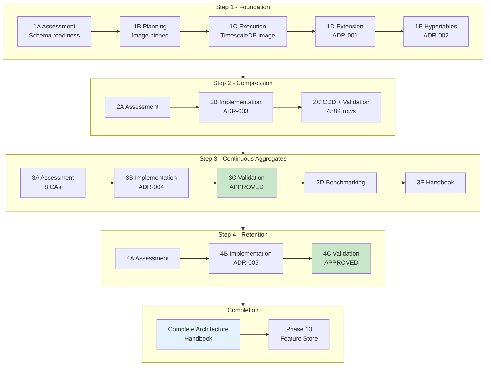

### Step Summary

| Phase | Steps | ADRs | Key Deliverable |
|---|---|---|---|
| **Step 1** | 1A → 1E | ADR-001, ADR-002 | Hypertable foundation |
| **Step 2** | 2A → 2C | ADR-003 | Compression + CDD |
| **Step 3** | 3A → 3E | ADR-004 | Continuous aggregates |
| **Step 4** | 4A → 4C | ADR-005 | Retention lifecycle |
| **Completion** | Handbook | — | This document |

---

## 17. Future Architecture

Phase 12 completes the **persistence and analytical infrastructure**. Phases 13–16 build application-layer AI capabilities on this foundation.

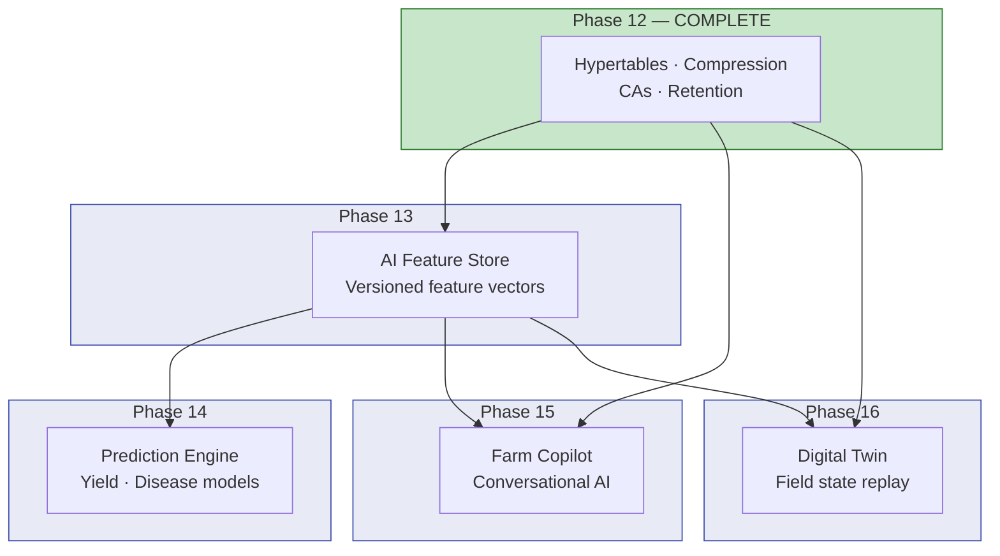

### Complete AGRIFLOW-AI Platform Architecture

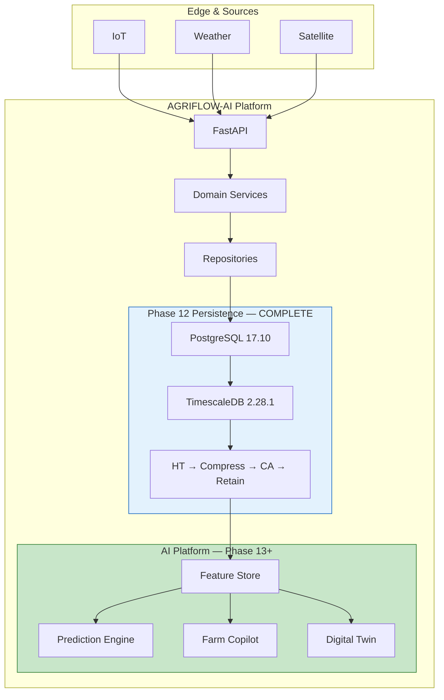

**No persistence redesign is expected.** Phase 13 introduces Feature Store schema and extraction pipelines that **consume** Phase 12 outputs. Future enhancements (archive pipeline, CA compression, `cdd-benchmark` profile) extend the stack without replacing it. See [ADR-005 §9 Future Considerations](adr/ADR-005-timescaledb-retention-policy-strategy.md).

---

## 18. Further Reading

### Architecture Decision Records

| Topic | Primary Reference |
|---|---|
| Extension enablement | [ADR-001](adr/ADR-001-timescaledb-extension-enablement.md) |
| Hypertables & composite PKs | [ADR-002](adr/ADR-002-hypertable-primary-key-conversion-strategy.md) |
| Compression policies | [ADR-003](adr/ADR-003-timescaledb-compression-policy-strategy.md) |
| Continuous aggregates | [ADR-004](adr/ADR-004-timescaledb-continuous-aggregate-strategy.md) |
| Retention & lifecycle | [ADR-005](adr/ADR-005-timescaledb-retention-policy-strategy.md) |

### Handbooks

| Topic | Primary Reference |
|---|---|
| Step 1 foundation (hypertables, principles) | [10-phase12-step1-foundation-handbook.md](10-phase12-step1-foundation-handbook.md) |
| Step 3 analytical layer (CAs, refresh) | [11-phase12-analytical-platform-handbook.md](11-phase12-analytical-platform-handbook.md) |
| **Complete Phase 12 reference** | **This document** |

### Architecture Assessments

| Topic | Primary Reference |
|---|---|
| Infrastructure readiness | [PHASE12_STEP1A_INFRASTRUCTURE_ASSESSMENT.md](report/PHASE12_STEP1A_INFRASTRUCTURE_ASSESSMENT.md) |
| Hypertable strategy | [PHASE12_STEP1EA_HYPERTABLE_ARCHITECTURE_ASSESSMENT.md](report/PHASE12_STEP1EA_HYPERTABLE_ARCHITECTURE_ASSESSMENT.md) |
| Compression strategy | [PHASE12_STEP2A_COMPRESSION_ARCHITECTURE_ASSESSMENT.md](report/PHASE12_STEP2A_COMPRESSION_ARCHITECTURE_ASSESSMENT.md) |
| Continuous aggregate strategy | [PHASE12_STEP3A_CONTINUOUS_AGGREGATES_ARCHITECTURE_ASSESSMENT.md](report/PHASE12_STEP3A_CONTINUOUS_AGGREGATES_ARCHITECTURE_ASSESSMENT.md) |
| Retention strategy | [PHASE12_STEP4A_RETENTION_ARCHITECTURE_ASSESSMENT.md](report/PHASE12_STEP4A_RETENTION_ARCHITECTURE_ASSESSMENT.md) |

### Implementation Reports

| Topic | Primary Reference |
|---|---|
| Infrastructure (Docker image) | [PHASE12_STEP1C_IMPLEMENTATION_REPORT.md](report/PHASE12_STEP1C_IMPLEMENTATION_REPORT.md) |
| Extension enablement | [PHASE12_STEP1D_EXTENSION_ENABLEMENT_REPORT.md](report/PHASE12_STEP1D_EXTENSION_ENABLEMENT_REPORT.md) |
| Hypertable conversion | [PHASE12_STEP1EB_HYPERTABLE_IMPLEMENTATION_REPORT.md](report/PHASE12_STEP1EB_HYPERTABLE_IMPLEMENTATION_REPORT.md) |
| Compression DDL | [PHASE12_STEP2B_COMPRESSION_IMPLEMENTATION_REPORT.md](report/PHASE12_STEP2B_COMPRESSION_IMPLEMENTATION_REPORT.md) |
| CDD persistence | [PHASE12_STEP2CC_CDD_GENERATION_AND_PERSISTENCE_REPORT.md](report/PHASE12_STEP2CC_CDD_GENERATION_AND_PERSISTENCE_REPORT.md) |
| Continuous aggregate DDL | [PHASE12_STEP3B_CONTINUOUS_AGGREGATE_IMPLEMENTATION_REPORT.md](report/PHASE12_STEP3B_CONTINUOUS_AGGREGATE_IMPLEMENTATION_REPORT.md) |
| Retention DDL | [PHASE12_STEP4B_RETENTION_IMPLEMENTATION_REPORT.md](report/PHASE12_STEP4B_RETENTION_IMPLEMENTATION_REPORT.md) |

### Validation & Benchmarking

| Topic | Primary Reference |
|---|---|
| Compression validation | [PHASE12_STEP2CD_RUNTIME_VALIDATION_AND_BENCHMARK_REPORT.md](report/PHASE12_STEP2CD_RUNTIME_VALIDATION_AND_BENCHMARK_REPORT.md) |
| CA validation | [PHASE12_STEP3C_CONTINUOUS_AGGREGATE_VALIDATION_REPORT.md](report/PHASE12_STEP3C_CONTINUOUS_AGGREGATE_VALIDATION_REPORT.md) |
| Performance benchmarks | [PHASE12_STEP3D_PERFORMANCE_BENCHMARK_REPORT.md](report/PHASE12_STEP3D_PERFORMANCE_BENCHMARK_REPORT.md) |
| Retention validation | [PHASE12_STEP4C_RETENTION_RUNTIME_VALIDATION_REPORT.md](report/PHASE12_STEP4C_RETENTION_RUNTIME_VALIDATION_REPORT.md) |

### Dataset & Lessons

| Topic | Primary Reference |
|---|---|
| CDD architecture | [PHASE12_STEP2CA_CANONICAL_DEVELOPMENT_DATASET_ARCHITECTURE.md](report/PHASE12_STEP2CA_CANONICAL_DEVELOPMENT_DATASET_ARCHITECTURE.md) |
| CDD generation guide | [backend/app/cdd/README.md](../backend/app/cdd/README.md) |
| CA implementation lessons | [PHASE12_STEP3B_IMPLEMENTATION_LESSONS_LEARNED.md](report/PHASE12_STEP3B_IMPLEMENTATION_LESSONS_LEARNED.md) |
| Decision register | [PHASE12_DECISION_REGISTER.md](report/PHASE12_DECISION_REGISTER.md) |

### Alembic Migrations

| ADR | Migration File | Revision |
|---|---|---|
| ADR-001 | `backend/app/db/migrations/versions/f1e2d3c4b5a6_enable_timescaledb_extension.py` | `f1e2d3c4b5a6` |
| ADR-002 | `backend/app/db/migrations/versions/c9d8e7f6a5b4_convert_time_series_tables_to_hypertables.py` | `c9d8e7f6a5b4` |
| ADR-003 | `backend/app/db/migrations/versions/d4f5e6a7b8c9_enable_hypertable_compression_policies.py` | `d4f5e6a7b8c9` |
| ADR-004 | `backend/app/db/migrations/versions/e5f6a7b8c9d0_create_continuous_aggregates.py` | `e5f6a7b8c9d0` |
| ADR-005 | `backend/app/db/migrations/versions/f6a7b8c9d0e1_enable_retention_policies.py` | `f6a7b8c9d0e1` |

---

## Phase 12 Completion Statement

Phase 12 is **complete**. The AGRIFLOW-AI analytical data platform delivers:

- **Query scalability** through hypertable chunk exclusion (ADR-002)
- **Storage efficiency** through policy-based compression (ADR-003)
- **Analytical scalability** through eight continuous aggregates (ADR-004)
- **Lifecycle governance** through domain-tiered retention (ADR-005)

All capabilities are validated against CDD v1.0.0, governed by five ADRs, and implemented with **zero application-layer changes**. The platform is ready for **Phase 13 — AI Feature Store**.

---

*12-phase12-complete-architecture-handbook.md v1.0 — 2026-06-30 — Phase 12 Complete*
