# Phase 12 — Platform Bootstrap Guide

**Version:** 1.6  
**Status:** Approved  
**Last Updated:** 2026-07-01  
**Scope:** Operational guide — rebuild the complete Phase 12 analytical platform from scratch  
**Architecture Reference:** [12-phase12-complete-architecture-handbook.md](12-phase12-complete-architecture-handbook.md)  
**CDD Reference:** [backend/app/cdd/README.md](../backend/app/cdd/README.md)

---

## Purpose

This guide enables a developer to **completely rebuild** the AGRIFLOW-AI Phase 12 analytical platform — from an empty machine through a fully validated TimescaleDB deployment with CDD v1.0.0 — without reading implementation reports.

Use this guide for:

- New developer onboarding
- New machine setup
- Database rebuild after volume wipe
- Docker environment recreation
- Disaster recovery (Tier 2 `pg_dump` restore)
- Local development environment recreation

**Expected outcome:** PostgreSQL 17.10 + TimescaleDB 2.28.1, Alembic at `f6a7b8c9d0e1`, 6 hypertables, 6 compression policies, 8 continuous aggregates, 11 retention policies, 27 platform background jobs, and CDD v1.0.0 (458,645 rows) validated.

---

## Cross-Platform Command Compatibility

AGRIFLOW-AI local development is validated on **macOS (Apple Silicon)**, **Linux**, and **Windows (Intel, PowerShell)**. Commands in this guide are written to run on all three unless explicitly noted.

### Supported Platforms

| Platform | Shell | Validated |
|---|---|---|
| macOS | bash / zsh | ✓ Apple Silicon |
| Linux | bash | ✓ |
| Windows | PowerShell | ✓ Intel |

### Line Continuation

| Platform | Line continuation character |
|---|---|
| macOS / Linux | `\` (backslash) |
| Windows PowerShell | `` ` `` (backtick) |

**Preference:** This guide uses **single-line commands** wherever practical so the same command works on every platform without line-continuation syntax.

> **Command Compatibility**
>
> Commands shown in this guide are written to be platform-independent whenever possible.
>
> When shell syntax genuinely differs, separate examples are provided for **macOS / Linux** and **Windows PowerShell**.
>
> Every command block is prefixed with a **📍 location indicator** — Repository Root, `backend/`, Docker Container, PostgreSQL (psql), or Host Machine — so you always know where to run it.

### Platform Validation Notes

This bootstrap guide has been validated on:

- ✓ **macOS Apple Silicon** (bash / zsh)
- ✓ **Windows Intel** (PowerShell)

Platform-specific differences discovered during validation — virtual environment activation, file copy, directory creation, and shell-only loops — are documented inline. Docker, Alembic, and `docker compose exec … psql -c "…"` commands are identical across platforms.

---

## Platform Bootstrap Philosophy

This guide is an **operational runbook** — it tells you what to run, in what order, and how to verify success. It does not explain *why* the architecture was designed this way. For architectural rationale, use the [Phase 12 Complete Architecture Handbook](12-phase12-complete-architecture-handbook.md).

**Guiding principles:**

1. **Execute sequentially.** Each stage depends on the previous one. Do not run Alembic before Docker is healthy, or seed CDD before migrations complete.
2. **Never skip validation.** Every major step includes verification commands. A passing migration does not guarantee a healthy platform — confirm hypertables, policies, row counts, and API health.
3. **Resolve failures before proceeding.** A failed validation at any stage blocks all downstream steps. Fix the root cause, then re-run validation from that stage forward.
4. **Cross-reference, don't duplicate.** ADRs, handbooks, and validation reports contain the detailed explanations. This guide links to them instead of repeating architectural content.
5. **Treat this as the operational companion** to the Complete Architecture Handbook — architecture explains *what* was built; this guide explains *how to build it again*.

> **Working directory legend:** Commands are prefixed with **📍 Repository Root**, **📍 `backend/`**, **📍 Host Machine**, **📍 Docker Container**, or **📍 PostgreSQL (psql)**. See [Cross-Platform Command Compatibility](#cross-platform-command-compatibility) for platform-specific shell notes.

---

## TimescaleDB Platform Initialization

AGRIFLOW-AI begins bootstrap with a **standard PostgreSQL schema** — relational domain tables created through Alembic migrations `8f3a1c2d9e04` through `a1b2c3d4e5f6`. The platform **progressively transforms** into a complete TimescaleDB analytical stack through five additional Phase 12 migrations (`f1e2d3c4b5a6` → `f6a7b8c9d0e1`). No manual DDL is required beyond `alembic upgrade head`; every TimescaleDB capability is version-controlled and reproducible.

### Why TimescaleDB Is Required

AGRIFLOW-AI ingests high-frequency, unbounded time-series data — IoT sensor telemetry, weather observations, satellite imagery, irrigation events, yield records, and disease observations. Phases 13–16 (Feature Store, Prediction Engine, Farm Copilot, Digital Twin) depend on:

- **Chunk exclusion** — time-window queries skip irrelevant partitions
- **Columnar compression** — 10–30× storage reduction on cold chunks
- **Continuous Aggregates** — pre-computed `time_bucket()` rollups for AI feature extraction
- **Retention policies** — governed lifecycle for raw and derived data

These capabilities are TimescaleDB-specific. Standard PostgreSQL cannot provide them natively.

### Why PostgreSQL Alone Is Insufficient

Plain PostgreSQL stores time-series rows in monolithic heap tables. As historical data grows:

| Limitation | Impact |
|---|---|
| No time-based partitioning | Full-table scans on `WHERE recorded_at BETWEEN …` |
| No columnar compression | Storage cost grows linearly with sensor volume |
| No incremental rollups | Repeated aggregation scans raw hypertables on every Feature Store run |
| No chunk-level retention | Manual partition management or ad-hoc `DELETE` scripts |

ADR-002 documents the architectural evidence: six domain tables exhibit time-ordered growth patterns that require hypertable conversion. Relational reference tables (`farms`, `fields`, `crops`, `soil_profiles`) remain standard PostgreSQL permanently.

### Why the Extension Must Exist Before Hypertable Conversion

TimescaleDB functions (`create_hypertable`, `add_compression_policy`, `create_materialized_view … WITH (timescaledb.continuous)`, `add_retention_policy`) are registered by the `timescaledb` extension. Migration `c9d8e7f6a5b4` calls `create_hypertable()` — if the extension is not active, Alembic fails immediately.

The approved sequence (ADR-001 → ADR-002) is non-negotiable:

1. **Extension enablement** (`f1e2d3c4b5a6`) — `CREATE EXTENSION timescaledb`
2. **Hypertable conversion** (`c9d8e7f6a5b4`) — partition six tables by time column
3. **Compression** (`d4f5e6a7b8c9`) — columnar encoding on closed chunks
4. **Continuous Aggregates** (`e5f6a7b8c9d0`) — derived analytical layer
5. **Retention** (`f6a7b8c9d0e1`) — governed data lifecycle

Each layer depends on the previous one. Compression requires hypertables. Continuous aggregates require hypertables. Retention policies target hypertables and CA materialisations.

### Complete Initialization Workflow

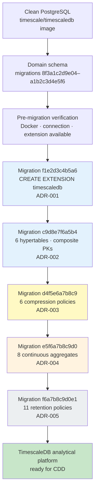

For architectural rationale, see [ADR-001](adr/ADR-001-timescaledb-extension-enablement.md) through [ADR-005](adr/ADR-005-timescaledb-retention-policy-strategy.md) and the [Complete Architecture Handbook](12-phase12-complete-architecture-handbook.md).

---

## Platform Verification Gates

Bootstrap is a **gated pipeline**. Each gate must pass before proceeding to the next stage. Do not skip gates — a passing `alembic upgrade head` does not guarantee hypertables, policies, or populated aggregates.

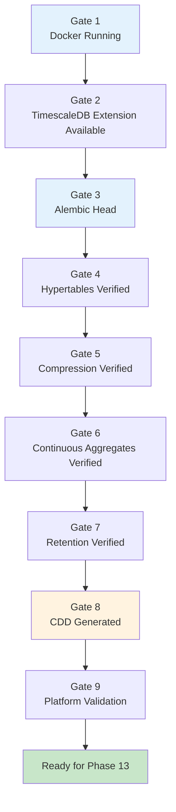

| Gate | Validates | Section | Blocking if failed |
|---|---|---|---|
| **Gate 1** | `db` container healthy; TimescaleDB image running | [Section 3](#3-docker-environment) | Alembic, CDD, all SQL checks |
| **Gate 2** | Extension binaries available; correct container connected | [Section 5](#verify-timescaledb-before-running-alembic) | `CREATE EXTENSION` fails |
| **Gate 3** | Alembic at `f6a7b8c9d0e1` (head) | [Section 5](#5-schema-creation) | CDD persistence, policy objects missing |
| **Gate 4** | 6 hypertables in `timescaledb_information.hypertables` | [Section 7](#7-platform-validation) | Chunk creation, compression, CAs |
| **Gate 5** | 6 compression policies registered | [Section 7](#7-platform-validation) | Storage optimisation inactive |
| **Gate 6** | 8 continuous aggregates + 8 refresh policies | [Section 7](#7-platform-validation) | Analytical rollups empty |
| **Gate 7** | 11 retention policies registered | [Section 7](#7-platform-validation) | Lifecycle governance incomplete |
| **Gate 8** | CDD v1.0.0 persisted (458,645 rows) | [Section 6](#6-canonical-development-dataset-cdd) | Validation corpus absent |
| **Gate 9** | SQL checks + API health pass | [Section 7](#7-platform-validation) | Phase 13 blocked |

**Rule:** Resolve the root cause at the failed gate, re-run verification from that gate forward, then continue.

---

## Phase 12 Platform Build Pipeline

End-to-end build process from empty machine to Phase 13 readiness:

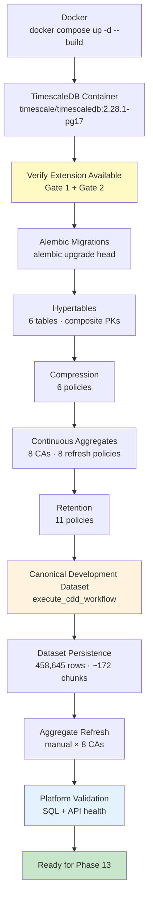

| Stage | Action | Outcome |
|---|---|---|
| **Docker** | Start `db` + `backend` services | PostgreSQL 17.10 reachable on port `25432` |
| **TimescaleDB Container** | `timescale/timescaledb:2.28.1-pg17` image | Extension binaries present in image |
| **Verify Extension** | Pre-migration checks (Gates 1–2) | Confirms correct database target |
| **Alembic Migrations** | `alembic upgrade head` | Full schema + TimescaleDB stack at head |
| **Hypertables** | Migration `c9d8e7f6a5b4` | Time-partitioned storage for 6 tables |
| **Compression** | Migration `d4f5e6a7b8c9` | Columnar encoding policies on all hypertables |
| **Continuous Aggregates** | Migration `e5f6a7b8c9d0` | 8 pre-computed rollups `WITH NO DATA` |
| **Retention** | Migration `f6a7b8c9d0e1` | 11 lifecycle policies on raw + CA objects |
| **Canonical Development Dataset** | `execute_cdd_workflow` | Deterministic validation corpus |
| **Dataset Persistence** | Bulk insert into hypertables | ~172 chunks created; FK integrity verified |
| **Aggregate Refresh** | Manual `refresh_continuous_aggregate` × 8 | Historical CDD buckets materialised |
| **Platform Validation** | SQL cheat sheet + `/health/*` | All gates pass; Phase 13 unblocked |

---

## Database Evolution Through Alembic

Alembic applies migrations in strict linear order. The platform evolves through distinct layers — each layer unlocks the next.

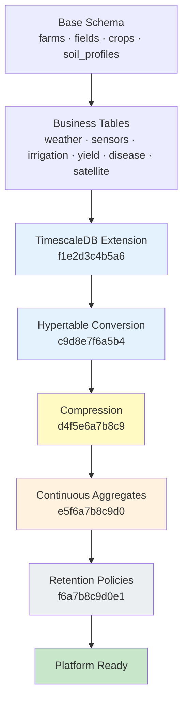

### Complete Migration Sequence

Actual Alembic history (oldest → newest):

| Revision | Description | Layer |
|---|---|---|
| `8f3a1c2d9e04` | Create `farms` table | Base schema |
| `3b7e9f1a2c85` | Create `fields` table | Base schema |
| `5c2d8e3f7a19` | Create `crops` table | Base schema |
| `13aabbe35d51` | Add `soil_profiles` table | Base schema |
| `7d4f2a9b1e63` | Create `weather_records` table | Business tables |
| `f3a8c1d9e047` | Add P1 AI readiness columns | Business tables |
| `a8f3d1b6e924` | Create `sensor_readings` table | Business tables |
| `235a51cdf901` | Create `irrigation_events` table | Business tables |
| `b7e2a9f4c8d3` | Create `yield_records` table | Business tables |
| `d3e7b2a9f1c4` | Create `disease_observations` table | Business tables |
| `a1b2c3d4e5f6` | Create `satellite_observations` table | Business tables |
| `f1e2d3c4b5a6` | Enable TimescaleDB extension | TimescaleDB extension — [ADR-001](adr/ADR-001-timescaledb-extension-enablement.md) |
| `c9d8e7f6a5b4` | Convert 6 tables to hypertables | Hypertable conversion — [ADR-002](adr/ADR-002-hypertable-primary-key-conversion-strategy.md) |
| `d4f5e6a7b8c9` | Enable compression policies | Compression — [ADR-003](adr/ADR-003-timescaledb-compression-policy-strategy.md) |
| `e5f6a7b8c9d0` | Create continuous aggregates | Continuous aggregates — [ADR-004](adr/ADR-004-timescaledb-continuous-aggregate-strategy.md) |
| `f6a7b8c9d0e1` | Enable retention policies | Retention — [ADR-005](adr/ADR-005-timescaledb-retention-policy-strategy.md) |

Domain migrations establish the relational foundation. Phase 12 migrations (`f1e2d3c4b5a6` onward) transform time-series tables into an analytical platform. CDD generation and runtime validation occur **after** all migrations complete.

---

## TimescaleDB Conversion Matrix

Six time-series domain tables are converted to hypertables by migration `c9d8e7f6a5b4` (ADR-002). Four reference tables remain standard PostgreSQL relations permanently.

| Table | Converted | Time Column | Chunk Interval | Purpose | TimescaleDB Benefit |
|---|---|---|---|---|---|
| `sensor_readings` | ✅ Hypertable | `recorded_at` | 7 days | IoT telemetry (438K CDD rows) | Chunk exclusion on sub-hourly scans; compression on cold telemetry |
| `weather_records` | ✅ Hypertable | `recorded_at` | 7 days | Meteorological observations | Efficient field-scoped weather window queries |
| `satellite_observations` | ✅ Hypertable | `observed_at` | 7 days | Multi-spectral imagery events | Partition pruning on revisit-cycle data |
| `irrigation_events` | ✅ Hypertable | `started_at` | 1 month | Water management events | Monthly chunking for sparse event data |
| `disease_observations` | ✅ Hypertable | `observed_at` | 1 month | Crop disease pressure events | Time-bucketed disease trend analysis |
| `yield_records` | ✅ Hypertable | `recorded_at` | 3 months | Harvest measurements | Season-aligned storage; exempt from retention drop |
| `farms` | ❌ Relational | — | — | Farm aggregate root | Low row count; UUID identity preserved |
| `fields` | ❌ Relational | — | — | Field aggregate | Reference FK anchor for all time-series |
| `crops` | ❌ Relational | — | — | Crop planting records | Season metadata; not time-partitioned |
| `soil_profiles` | ❌ Relational | — | — | Soil composition | Static reference data |

Each hypertable receives a composite primary key `(id, <time_column>)` per ADR-002. Application-layer UUID identity is unchanged — repositories continue `WHERE id = :id` predicate queries.

Detail: [ADR-002 §Approved Decisions](adr/ADR-002-hypertable-primary-key-conversion-strategy.md).

---

## Phase 12 Timeline Mapping

Direct mapping between Phase 12 implementation steps, Alembic migrations, and operational outcomes:

| Phase 12 Step | Alembic Migration | Revision | Outcome |
|---|---|---|---|
| Step 1C — Infrastructure execution | *(Docker image only)* | — | `timescale/timescaledb:2.28.1-pg17` running |
| Step 1D — Extension enablement | Enable TimescaleDB | `f1e2d3c4b5a6` | `timescaledb` extension active |
| Step 1E-B — Hypertable conversion | Convert time-series tables | `c9d8e7f6a5b4` | 6 hypertables; composite PKs |
| Step 2B — Compression implementation | Enable compression policies | `d4f5e6a7b8c9` | 6 compression jobs |
| Step 3B — Continuous aggregate DDL | Create continuous aggregates | `e5f6a7b8c9d0` | 8 CAs + 8 refresh policies |
| Step 4B — Retention implementation | Enable retention policies | `f6a7b8c9d0e1` | 11 retention jobs |
| Step 2C — CDD persistence | *(application workflow)* | — | 458,645 rows; chunk creation |
| Step 3C — CA validation | *(manual refresh)* | — | 8 CAs populated with buckets |

Domain table migrations (`8f3a1c2d9e04`–`a1b2c3d4e5f6`) precede all Phase 12 TimescaleDB steps and are applied automatically during `alembic upgrade head`.

Cross-reference: [Foundation Handbook](10-phase12-step1-foundation-handbook.md) · [Complete Architecture Handbook §Phase Map](12-phase12-complete-architecture-handbook.md).

---

## Expected Platform State After Successful Bootstrap

When bootstrap completes successfully, the platform matches this end state:

| Category | Component | Expected Value |
|---|---|---|
| **Infrastructure** | PostgreSQL | 17.10 |
| | TimescaleDB | 2.28.1 |
| | Docker services | `db` (healthy) + `backend` (running) |
| | Alembic revision | `f6a7b8c9d0e1` (head) |
| **Database** | Hypertables | 6 |
| | Compression policies | 6 |
| | Continuous aggregates | 8 |
| | Refresh policies | 8 |
| | Retention policies | 11 |
| | Background jobs (platform) | 27 (+ 2 system) |
| **Data** | Canonical Development Dataset | `cdd-v1.0.0` / profile `cdd-dev` / seed `42` |
| | Total rows | 458,645 |
| | Materialised aggregates | 8 CAs with bucket data (post manual refresh) |
| **Application** | API health (`/health/live`) | HTTP 200 — `alive` |
| | API readiness (`/health/ready`) | HTTP 200 — database reachable |
| **Architecture** | Phase 13 ready | ✅ Persistence layer complete — Feature Store may begin |

---

## Estimated Execution Timeline

Approximate durations on a typical development machine (macOS / Windows with Docker Desktop):

| Stage | Estimated Duration |
|---|---|
| Repository setup (clone, venv, dependencies, `.env`) | 5–10 min |
| Docker startup (`docker compose up -d --build`) | 1–3 min |
| Alembic migrations (`alembic upgrade head`) | < 1 min |
| CDD generation (in-memory) | ~5 s |
| Dataset persistence (`execute_cdd_workflow`) | ~28 s |
| Continuous aggregate refresh (manual × 8) | ~30 s |
| Platform validation (SQL + API checks) | ~2 min |
| **Complete rebuild (total)** | **~5–10 min** |

> **Tip:** First-time Docker image pulls add 2–5 minutes. Subsequent rebuilds are faster.

> **⚠️ Common First-Time Mistakes**
>
> - **Forgetting to activate the Python virtual environment** before running Alembic or CDD — commands fail with `ModuleNotFoundError`. See [Section 2](#2-repository-setup).
> - **Using PostgreSQL port `5432` instead of `25432` from the host** — Alembic and CDD cannot connect. Set `POSTGRES_PORT=25432` in `backend/.env`. See [Section 11](#11-troubleshooting).
> - **Running Alembic before Docker is healthy** — connection refused. Wait for `docker compose ps` to show `db` as `healthy`. See [Section 3](#3-docker-environment).
> - **Forgetting the root `.env` file** — `POSTGRES_PASSWORD must be set` on `docker compose up`. Create `.env` at repository root. See [Section 2](#2-repository-setup).
> - **Running CDD persistence twice without cleaning the database** — duplicate primary key errors. Wipe with `docker compose down -v` or truncate tables first. See [Section 6](#6-canonical-development-dataset-cdd).
> - **Forgetting the one-time manual Continuous Aggregate refresh** after initial CDD load — CAs appear empty. Run `refresh_continuous_aggregate(..., NULL, NULL)` for all 8 aggregates. See [Section 6](#6-canonical-development-dataset-cdd) and [Step 3C](report/PHASE12_STEP3C_CONTINUOUS_AGGREGATE_VALIDATION_REPORT.md).

---

## Daily Developer Commands

Quick reference for everyday development. Run all Docker commands from the repository root unless noted.

### Local Developer Startup Workflow

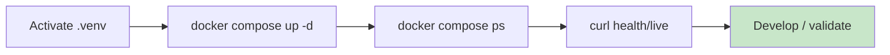

### Daily Development Cycle

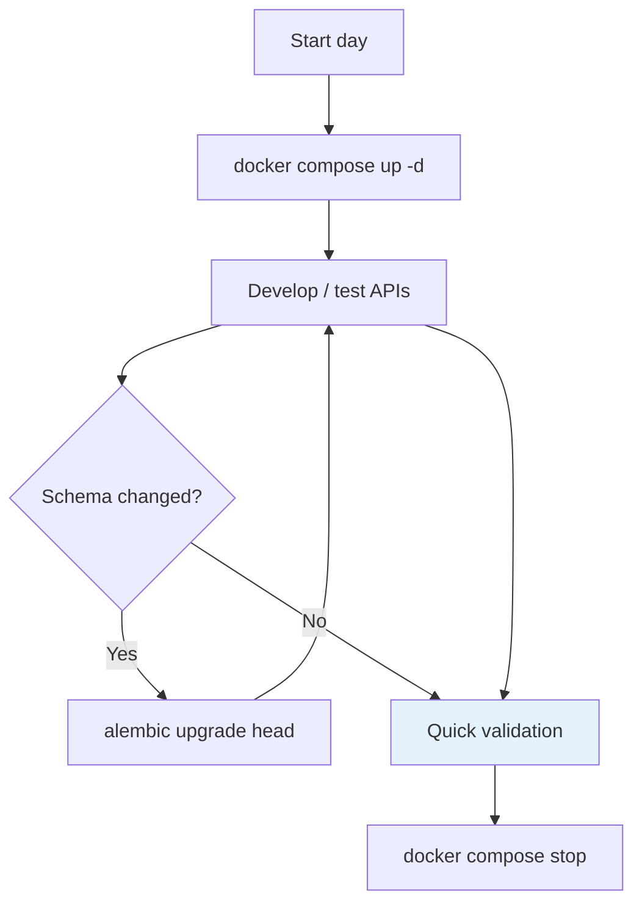

### Docker

| Command | Purpose | Expected Result |
|---|---|---|
| `docker compose up -d` | Start `db` and `backend` in background | Both containers `Up`; `db` becomes `healthy` |
| `docker compose stop` | Stop containers without removing volumes | Containers stopped; data preserved |
| `docker compose restart` | Restart all services | Containers recycle; connections briefly drop |
| `docker compose ps` | List running containers | `db` healthy, `backend` running |
| `docker compose logs -f backend` | Stream backend logs | Uvicorn startup and request logs |
| `docker compose logs -f db` | Stream database logs | PostgreSQL ready messages |
| `docker compose logs --tail 50 db` | Recent database log lines | Last 50 log entries |
| `docker compose down -v` | Stop and **delete** `postgres_data` volume | Full database wipe — use only for rebuild |

> **📍 Repository Root**

```bash
# Start services
docker compose up -d

# Stop services (data preserved)
docker compose stop

# Restart after config change
docker compose restart

# View running containers
docker compose ps

# View logs (last 50 lines)
docker compose logs --tail 50 backend
docker compose logs --tail 50 db
```

### Python Environment

> **📍 Repository Root** (activate venv) · **📍 `backend/`** (install dependencies)

```bash
# Activate virtual environment (macOS / Linux)
source .venv/bin/activate

# Activate virtual environment (Windows PowerShell)
.venv\Scripts\activate

# Install / update dependencies
cd backend
pip install -r requirements.txt

# Verify Python version
python --version
```

**Expected:** `Python 3.12.x` and `import fastapi, sqlalchemy, alembic` succeeds.

### Alembic

> **📍 `backend/`** (venv active)

```bash
cd backend

# Show current revision
alembic current

# Show migration history
alembic history

# Apply all pending migrations
alembic upgrade head
```

| Command | What it does | Expected output |
|---|---|---|
| `alembic current` | Prints the revision applied to the connected database | `f6a7b8c9d0e1 (head)` on a current platform |
| `alembic history` | Lists all migration revisions in dependency order | 16 revisions ending at `f6a7b8c9d0e1` |
| `alembic upgrade head` | Runs all pending migrations via async SQLAlchemy engine | Sequential `Running upgrade` lines; no errors |

**Verification:** `alembic current` matches `f6a7b8c9d0e1 (head)`.

### PostgreSQL

> **📍 Repository Root** (commands execute inside Docker `db` container via `docker compose exec`)

```bash
# Interactive psql session
docker compose exec db psql -U agriflow -d agriflow

# Verify TimescaleDB extension
docker compose exec -T db psql -U agriflow -d agriflow -c "SELECT extname, extversion FROM pg_extension WHERE extname = 'timescaledb';"

# List databases
docker compose exec -T db psql -U agriflow -d postgres -c "\l"
```

**Expected:** Extension version `2.28.1`; database `agriflow` exists and is owned by user `agriflow`.

### Backup & Restore

> **📍 Repository Root** (output file written to current directory)

```bash
# Create backup (custom format)
docker compose exec -T db pg_dump -U agriflow -d agriflow -F c > agriflow_backup.dump

# Restore backup
docker compose exec -T db pg_restore -U agriflow -d agriflow --clean --if-exists < agriflow_backup.dump
```

**Expected:** Backup file ~40–50 MB with CDD loaded; restore completes without fatal errors. See [Section 9](#9-backup--restore).

### Platform Validation (Quick Checklist)

Run these after schema changes, CDD reload, or container restart:

> **📍 `backend/`** + **📍 Repository Root** (mixed — see comments in block)

```bash
# 1. Alembic head
cd backend
alembic current

# 2. Hypertable count
docker compose exec -T db psql -U agriflow -d agriflow -c "SELECT COUNT(*) FROM timescaledb_information.hypertables;"

# 3. Background job summary
docker compose exec -T db psql -U agriflow -d agriflow -c "SELECT proc_name, COUNT(*) FROM timescaledb_information.jobs GROUP BY proc_name ORDER BY proc_name;"

# 4. CDD sensor row count
docker compose exec -T db psql -U agriflow -d agriflow -c "SELECT COUNT(*) FROM sensor_readings;"

# 5. API health
curl -s http://localhost:8000/api/v1/health/live
curl -s http://localhost:8000/api/v1/health/ready
```

**Expected:** Head `f6a7b8c9d0e1`; 6 hypertables; 27 policy jobs; 438,000 sensor rows; HTTP 200 on both health endpoints.

### Further Reading (Daily Commands)

| Topic | Document |
|---|---|
| Complete architecture | [12-phase12-complete-architecture-handbook.md](12-phase12-complete-architecture-handbook.md) |
| Full validation SQL | [Section 8](#8-sql-verification-cheat-sheet) of this guide |
| Troubleshooting | [Section 11](#11-troubleshooting) of this guide |

---

## Table of Contents

- [Platform Bootstrap Philosophy](#platform-bootstrap-philosophy)
- [Cross-Platform Command Compatibility](#cross-platform-command-compatibility)
- [TimescaleDB Platform Initialization](#timescaledb-platform-initialization)
- [Platform Verification Gates](#platform-verification-gates)
- [Phase 12 Platform Build Pipeline](#phase-12-platform-build-pipeline)
- [Database Evolution Through Alembic](#database-evolution-through-alembic)
- [TimescaleDB Conversion Matrix](#timescaledb-conversion-matrix)
- [Phase 12 Timeline Mapping](#phase-12-timeline-mapping)
- [Expected Platform State After Successful Bootstrap](#expected-platform-state-after-successful-bootstrap)
- [Estimated Execution Timeline](#estimated-execution-timeline)
- [Daily Developer Commands](#daily-developer-commands)
1. [Prerequisites](#1-prerequisites)
2. [Repository Setup](#2-repository-setup)
- [Repository Layout](#repository-layout)
3. [Docker Environment](#3-docker-environment)
4. [Database Initialization](#4-database-initialization)
5. [Schema Creation](#5-schema-creation)
6. [Canonical Development Dataset (CDD)](#6-canonical-development-dataset-cdd)
7. [Platform Validation](#7-platform-validation)
8. [SQL Verification Cheat Sheet](#8-sql-verification-cheat-sheet)
9. [Backup & Restore](#9-backup--restore)
- [Development vs Production Backup Strategy](#development-vs-production-backup-strategy)
10. [Complete Platform Rebuild](#10-complete-platform-rebuild)
11. [Troubleshooting](#11-troubleshooting)
12. [Platform Health Checklist](#12-platform-health-checklist)
- [Platform Verification Dashboard](#platform-verification-dashboard)
- [Complete Platform Rebuild Checklist](#complete-platform-rebuild-checklist)
- [Platform Lifecycle](#platform-lifecycle)
- [Next Steps](#next-steps)

---

## 1. Prerequisites

### Required Software

| Tool | Version | Purpose |
|---|---|---|
| **Git** | 2.x+ | Clone repository |
| **Python** | **3.12.x** | Backend runtime (see `.python-version`) |
| **Docker Desktop** | 24.x+ | Container runtime |
| **Docker Compose** | 2.x+ | Service orchestration |

> **Python 3.14 is not supported.** Use Python 3.12.x until upstream `pydantic-core` compatibility is confirmed.

### Platform Versions (Phase 12)

| Component | Version | Source |
|---|---|---|
| PostgreSQL | 17.10 | `timescale/timescaledb:2.28.1-pg17` image |
| TimescaleDB | 2.28.1 | Same image |
| FastAPI | 0.115.5 | `backend/requirements.txt` |
| SQLAlchemy | 2.0.36 | `backend/requirements.txt` |
| Alembic | 1.14.0 | `backend/requirements.txt` |
| Alembic head | `f6a7b8c9d0e1` | Phase 12 retention policies |

### Version Compatibility Matrix

Verified platform versions for Phase 12 bootstrap. Do not mix major versions across components.

| Component | Required Version | Notes |
|---|---|---|
| **Python** | 3.12.x | See `.python-version`; 3.14 not supported |
| **Docker** | 24.x+ | Docker Desktop on macOS / Windows |
| **Docker Compose** | 2.x+ | Bundled with Docker Desktop |
| **PostgreSQL** | 17.10 | Via `timescale/timescaledb:2.28.1-pg17` image |
| **TimescaleDB** | 2.28.1 | Extension enabled by migration `f1e2d3c4b5a6` |
| **FastAPI** | 0.115.5 | `backend/requirements.txt` |
| **SQLAlchemy** | 2.0.36 | Async engine; Alembic migrations |
| **Alembic** | 1.14.0 | Head revision `f6a7b8c9d0e1` |
| **CDD Version** | `cdd-v1.0.0` | Profile `cdd-dev`, seed `42` |
| **Alembic Head Revision** | `f6a7b8c9d0e1` | Retention policies — final Phase 12 migration |

### Optional Tools

| Tool | Purpose |
|---|---|
| `pyenv` | Automatic Python 3.12 selection via `.python-version` |
| `pgAdmin` | GUI database inspection (`localhost:25432`) |
| `curl` / `httpie` | API health checks |

### Network & Ports

| Service | Host Port | Container Port |
|---|---|---|
| PostgreSQL | `25432` | `5432` |
| FastAPI | `8000` | `8000` |

### Further Reading

| Topic | Document |
|---|---|
| Local development setup | [05-local-setup.md](05-local-setup.md) |
| Phase 12 architecture | [12-phase12-complete-architecture-handbook.md](12-phase12-complete-architecture-handbook.md) |

---

## 2. Repository Setup

### Clone Repository

> **📍 Host Machine**

```bash
git clone <repository-url>
cd AGRIFLOW-AI
```

**Expected outcome:** Repository root contains `docker-compose.yml`, `backend/`, and `docs/`.

### Create Python Virtual Environment

**macOS / Linux:**

> **📍 Repository Root**

```bash
python3.12 -m venv .venv
source .venv/bin/activate
```

**Windows (PowerShell):**

> **📍 Repository Root**

```powershell
python -m venv .venv
.venv\Scripts\activate
```

**Expected outcome:** Shell prompt shows `(.venv)` active.

### Install Dependencies

> **📍 `backend/`** (venv active)

```bash
cd backend
pip install -r requirements.txt
```

**Expected outcome:** All packages install without error. Verify with:

> **📍 `backend/`**

```bash
python -c "import fastapi, sqlalchemy, alembic; print('OK')"
```

### Configure Environment Files

Docker Compose requires `POSTGRES_PASSWORD` at the **project root**. The backend reads credentials from `backend/.env`.

**Step 1 — Backend environment:**

> **📍 Repository Root**

**macOS / Linux:**

```bash
cp backend/.env.example backend/.env
```

**Windows (PowerShell):**

```powershell
Copy-Item backend\.env.example backend\.env
```

Edit `backend/.env`:

```env
POSTGRES_HOST=localhost
POSTGRES_PORT=25432
POSTGRES_DB=agriflow
POSTGRES_USER=agriflow
POSTGRES_PASSWORD=changeme
SECRET_KEY=your-super-secret-key-change-in-production-min-32-chars
```

> **Important:** When running Alembic or CDD from the **host machine**, use port **25432** (Docker host mapping). When the backend runs **inside Docker**, Compose overrides `POSTGRES_HOST=db` and port `5432` automatically.

**Step 2 — Docker Compose root environment:**

Create a `.env` file at the repository root (same password as `backend/.env`):

> **📍 Repository Root**

**macOS / Linux:**

```bash
echo "POSTGRES_PASSWORD=changeme" > .env
```

**Windows (PowerShell):**

```powershell
Set-Content -Path .env -Value "POSTGRES_PASSWORD=changeme"
```

**Expected outcome:** `docker compose config` resolves `POSTGRES_PASSWORD` without error.

---

## Repository Layout

Simplified tree of directories developers interact with during Phase 12 bootstrap:

```text
AGRIFLOW-AI/
├── docs/                          Phase 12 handbooks, ADRs, validation reports
├── docker-compose.yml             Local Docker stack (PostgreSQL + FastAPI)
├── backend/
│   ├── alembic.ini                Alembic configuration and migration entry point
│   ├── requirements.txt           Python dependencies
│   └── app/
│       ├── cdd/                   Canonical Development Dataset generator and persistence
│       ├── db/
│       │   ├── migrations/        Alembic revisions (domain schema + TimescaleDB stack)
│       │   ├── models/            SQLAlchemy ORM models
│       │   └── repositories/    Data access layer (unchanged in Phase 12)
│       ├── api/                   FastAPI routers and health endpoints
│       └── services/              Domain business logic (unchanged in Phase 12)
```

| Directory | Purpose |
|---|---|
| `docs/` | Architecture handbooks, ADRs, bootstrap guide, and validation reports |
| `docker-compose.yml` | Defines `db` (TimescaleDB) and `backend` (FastAPI) services |
| `backend/app/cdd/` | Deterministic dataset generation, validation, and persistence workflow |
| `backend/app/db/migrations/` | All Alembic revisions including Phase 12 TimescaleDB migrations |
| `backend/app/db/models/` | ORM models — six time-series models use composite PKs per ADR-002 |
| `backend/app/db/repositories/` | Repository layer — no Phase 12 changes; queries work against hypertables transparently |
| `backend/app/api/` | REST API including `/api/v1/health/live` and `/ready` validation endpoints |
| `backend/app/services/` | Service layer — unchanged in Phase 12 |

### Further Reading

| Topic | Document |
|---|---|
| Environment configuration | [05-local-setup.md](05-local-setup.md) |
| Decision register (backup protocol) | [PHASE12_DECISION_REGISTER.md](report/PHASE12_DECISION_REGISTER.md) |

---

## 3. Docker Environment

### Bootstrap Workflow Overview

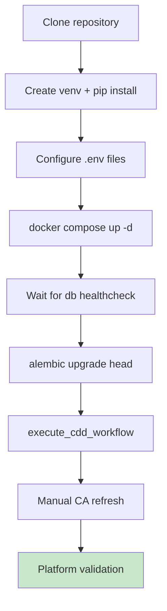

### Start Containers

> **📍 Repository Root**

```bash
# From repository root
docker compose up -d --build
```

**Expected outcome:**

```text
✔ Container agriflow-ai-db-1       Started (healthy)
✔ Container agriflow-ai-backend-1  Started
```

#### What this command does

`docker compose up -d --build` pulls or builds the TimescaleDB and FastAPI images, creates the `postgres_data` volume if absent, starts the `db` service, waits for `pg_isready` healthcheck success, then starts `backend` with live-reload mounted source. PostgreSQL initialises on first volume creation; existing data is preserved on subsequent starts.

#### Expected Output

Both containers report `Started`. The `db` container transitions to `healthy` within ~10–30 seconds. Backend binds port `8000` on the host.

#### Verification

> **📍 Repository Root**

```bash
docker compose ps
docker compose exec db pg_isready -U agriflow -d agriflow
curl -s http://localhost:8000/api/v1/health/live
```

#### Troubleshooting

See [Section 11](#11-troubleshooting) — `POSTGRES_PASSWORD must be set`, connection refused, wrong image.

### Verify Services

> **📍 Repository Root**

```bash
docker compose ps
```

| Service | Expected State | Health |
|---|---|---|
| `db` | `Up` | `healthy` |
| `backend` | `Up` | running |

**Database connectivity:**

> **📍 Repository Root** → **📍 Docker Container (`db`)**

```bash
docker compose exec db pg_isready -U agriflow -d agriflow
```

**Expected output:** `agriflow:5432 - accepting connections`

**API liveness:**

> **📍 Host Machine** (Repository Root)

```bash
curl -s http://localhost:8000/api/v1/health/live
```

**Expected output:** `{"status":"alive"}` (HTTP 200)

### Restart Containers

> **📍 Repository Root**

```bash
docker compose restart
```

Use after configuration changes that do not require image rebuild.

### Stop Containers

> **📍 Repository Root**

```bash
docker compose stop
```

### Stop and Remove Volumes (Full Database Wipe)

> **📍 Repository Root**

```bash
docker compose down -v
```

> **Warning:** `-v` deletes the `postgres_data` volume. All database content is lost. Use only for a clean rebuild or when restoring from backup.

### Further Reading

| Topic | Document |
|---|---|
| ADR-001 (TimescaleDB image) | [ADR-001-timescaledb-extension-enablement.md](adr/ADR-001-timescaledb-extension-enablement.md) |
| Foundation handbook | [10-phase12-step1-foundation-handbook.md](10-phase12-step1-foundation-handbook.md) |
| Daily commands | [Daily Developer Commands](#daily-developer-commands) |

---

## 4. Database Initialization

> **Context:** This section covers PostgreSQL startup (Gate 1). TimescaleDB extension installation occurs during Alembic migration `f1e2d3c4b5a6` — pre-migration availability checks are in [Section 5](#verify-timescaledb-before-running-alembic) (Gate 2). For the complete evolution path, see [TimescaleDB Platform Initialization](#timescaledb-platform-initialization).

### Database Initialization Flow

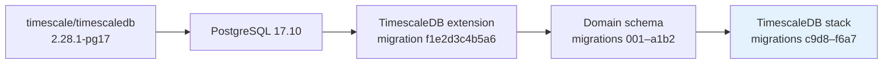

### PostgreSQL Startup

PostgreSQL starts automatically with `docker compose up -d`. The `db` service uses:

- **Image:** `timescale/timescaledb:2.28.1-pg17`
- **Volume:** `postgres_data` (persistent)
- **Healthcheck:** `pg_isready` every 10 seconds

Wait for healthy status before running migrations:

> **Gate 1:** `db` must report `healthy` before any Alembic or CDD command. See [Platform Verification Gates](#platform-verification-gates).

> **📍 Repository Root**

```bash
docker compose ps db
```

### TimescaleDB Extension

The extension is **not** active on a fresh PostgreSQL instance until migration `f1e2d3c4b5a6` runs. Verify after migrations (Section 5):

> **📍 Repository Root** → **📍 PostgreSQL (psql)**

```bash
docker compose exec -T db psql -U agriflow -d agriflow -c "SELECT extname, extversion FROM pg_extension WHERE extname = 'timescaledb';"
```

**Expected output:**

```text
   extname   | extversion
-------------+------------
 timescaledb | 2.28.1
```

### Database Verification (Pre-Migration)

On a brand-new volume, only system catalogs exist:

> **📍 Repository Root** → **📍 PostgreSQL (psql)**

```bash
docker compose exec -T db psql -U agriflow -d agriflow -c "\dt"
```

**Expected output:** No application tables (or only `alembic_version` after first migration attempt).

### Further Reading

| Topic | Document |
|---|---|
| ADR-001 | [ADR-001-timescaledb-extension-enablement.md](adr/ADR-001-timescaledb-extension-enablement.md) |
| Extension enablement report | [PHASE12_STEP1D_EXTENSION_ENABLEMENT_REPORT.md](report/PHASE12_STEP1D_EXTENSION_ENABLEMENT_REPORT.md) |
| Foundation handbook | [10-phase12-step1-foundation-handbook.md](10-phase12-step1-foundation-handbook.md) |

---

## 5. Schema Creation

### Verify TimescaleDB Before Running Alembic

> **Gates 1–2 must pass before proceeding.** Do not run `alembic upgrade head` until every check below succeeds.

Alembic migration `f1e2d3c4b5a6` executes `CREATE EXTENSION timescaledb`. This requires a TimescaleDB-capable PostgreSQL instance — not a local PostgreSQL installation, not a plain `postgres` Docker image, and not a misconfigured connection string pointing at the wrong host or port.

#### Gate 1 — Verify Docker Container

> **📍 Repository Root**

**macOS / Linux:**

```bash
docker compose ps db
docker compose config | grep -i timescale
```

**Windows (PowerShell):**

```powershell
docker compose ps db
docker compose config | Select-String -Pattern timescale
```

**Expected:**

- `db` service status: `Up (healthy)`
- Image: `timescale/timescaledb:2.28.1-pg17`

If the container is not healthy, wait or inspect logs (`docker compose logs db --tail 50`) before continuing. See [Section 3](#3-docker-environment).

#### Gate 2 — Verify PostgreSQL Connection

> **📍 Repository Root** → **📍 PostgreSQL (psql)**

```bash
docker compose exec -T db psql -U agriflow -d agriflow -c "SELECT version();"
```

**Expected output** (abbreviated):

```text
PostgreSQL 17.10 on x86_64-pc-linux-musl, compiled by gcc ...
```

The version string must report **PostgreSQL 17.10** from the TimescaleDB image. If connection fails, verify `POSTGRES_PORT=25432` in `backend/.env` and that Docker is running.

#### Gate 2 — Verify TimescaleDB Extension Availability

On a **fresh database** (before migration `f1e2d3c4b5a6`), the extension is not yet *installed* but must be *available* in the image:

> **📍 Repository Root** → **📍 PostgreSQL (psql)**

```bash
docker compose exec -T db psql -U agriflow -d agriflow -c "SELECT name, default_version, installed_version FROM pg_available_extensions WHERE name = 'timescaledb';"
```

**Expected output:**

```text
    name     | default_version | installed_version
-------------+-----------------+-------------------
 timescaledb | 2.28.1          |
```

`default_version = 2.28.1` confirms the TimescaleDB binaries are present. `installed_version` is empty **before** Alembic runs — this is normal.

After migrations complete, confirm installation:

```sql
SELECT extname, extversion
FROM pg_extension
WHERE extname = 'timescaledb';
```

**Expected output (post-migration):**

```text
   extname   | extversion
-------------+------------
 timescaledb | 2.28.1
```

#### Pre-Migration Warning

> **⚠️ STOP if TimescaleDB is not available**
>
> If `pg_available_extensions` returns **no row** for `timescaledb`, or if migration fails with:
>
> ```text
> extension "timescaledb" is not available
> ```
>
> **Do not continue.** This error means Alembic is connected to a PostgreSQL instance that does not include TimescaleDB binaries. Common root causes:
>
> - Wrong Docker image (plain `postgres` instead of `timescale/timescaledb`)
> - `DATABASE_URL` pointing at a local PostgreSQL installation on port `5432`
> - Wrong host port in `backend/.env` (must be `25432` from the host)
> - Stale container from a previous non-TimescaleDB setup
>
> Verify the container image, connection string, and port before re-running migrations. See [TimescaleDB Extension Missing](#timescaledb-extension-missing) in [Section 11](#11-troubleshooting).

### Run All Migrations

From the `backend` directory with venv active:

> **📍 `backend/`** (venv active)

```bash
cd backend
alembic upgrade head
```

**Alternative — run inside Docker:**

> **📍 Repository Root**

```bash
docker compose run --rm backend alembic upgrade head
```

**Expected output:** Migrations apply sequentially ending at `f6a7b8c9d0e1`.

#### What this command does

`alembic upgrade head` connects to PostgreSQL using `DATABASE_URL` from `backend/.env`, then executes each pending migration revision in order inside async transactions. Domain migrations (`001`–`a1b2c3d4e5f6`) create relational tables. Phase 12 migrations enable TimescaleDB, convert six tables to hypertables, register compression policies, create continuous aggregates, and register retention policies. The `alembic_version` table records the applied head revision.

#### Expected Output

Sequential `INFO` lines: `Running upgrade <rev> -> <rev>, <description>`. Final revision: `f6a7b8c9d0e1`. No `ERROR` or rollback messages.

#### Verification

> **📍 `backend/`**

```bash
alembic current
docker compose exec -T db psql -U agriflow -d agriflow -c "SELECT version_num FROM alembic_version;"
```

Both should show `f6a7b8c9d0e1`.

> **Gate 3 passed.** Proceed to Gates 4–7 via [Section 7](#7-platform-validation) before generating CDD (Gate 8).

#### Troubleshooting

Wrong port (`25432` from host), missing extension image, or hypertable migration before domain schema — see [Section 11](#11-troubleshooting) and [ADR-002](adr/ADR-002-hypertable-primary-key-conversion-strategy.md).

**Verify Alembic head:**

> **📍 `backend/`**

```bash
alembic current
```

**Expected output:**

```text
f6a7b8c9d0e1 (head)
```

### Database Migration Lifecycle

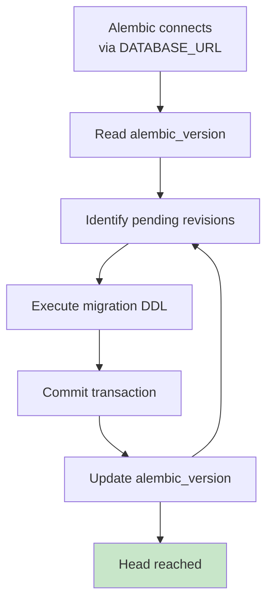

### Migration Sequence

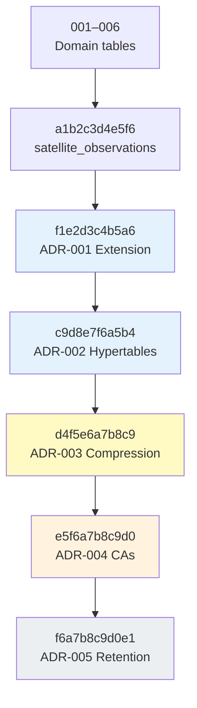

### What Each Phase 12 Migration Introduces

| Revision | ADR | Introduces |
|---|---|---|
| `f1e2d3c4b5a6` | ADR-001 | `CREATE EXTENSION timescaledb` — enables hypertable, compression, CA, and retention APIs |
| `c9d8e7f6a5b4` | ADR-002 | Converts 6 time-series tables to hypertables; composite PKs `(id, time_col)`; chunk intervals per table |
| `d4f5e6a7b8c9` | ADR-003 | Enables columnar compression + 6 `add_compression_policy()` jobs (12-hour schedule) |
| `e5f6a7b8c9d0` | ADR-004 | Creates 8 continuous aggregates `WITH NO DATA` + 8 `add_continuous_aggregate_policy()` jobs (T1–T4) |
| `f6a7b8c9d0e1` | ADR-005 | Registers 11 `add_retention_policy()` jobs (5 raw + 6 CA); exempts `yield_records`, `ca_irrigation_monthly`, `ca_yield_seasonal` |

Prior migrations (`001` through `a1b2c3d4e5f6`) create the standard PostgreSQL domain schema (farms, fields, crops, soil, weather, sensors, irrigation, yield, disease, satellite).

**Detail:** [ADR-001](adr/ADR-001-timescaledb-extension-enablement.md) through [ADR-005](adr/ADR-005-timescaledb-retention-policy-strategy.md).

### Further Reading

| Topic | Document |
|---|---|
| ADR-002 (hypertables) | [ADR-002-hypertable-primary-key-conversion-strategy.md](adr/ADR-002-hypertable-primary-key-conversion-strategy.md) |
| ADR-003 (compression) | [ADR-003-timescaledb-compression-policy-strategy.md](adr/ADR-003-timescaledb-compression-policy-strategy.md) |
| ADR-004 (continuous aggregates) | [ADR-004-timescaledb-continuous-aggregate-strategy.md](adr/ADR-004-timescaledb-continuous-aggregate-strategy.md) |
| ADR-005 (retention) | [ADR-005-timescaledb-retention-policy-strategy.md](adr/ADR-005-timescaledb-retention-policy-strategy.md) |
| Complete architecture | [12-phase12-complete-architecture-handbook.md](12-phase12-complete-architecture-handbook.md) |

---

## 6. Canonical Development Dataset (CDD)

### CDD Generation Timing

> **Gate 8 — CDD must be generated only after Gates 1–7 pass.**

CDD persistence (`execute_cdd_workflow`) creates ~172 hypertable chunks, triggers compression eligibility, and requires continuous aggregate and retention policy objects to exist. Generating data **before** platform initialization completes produces an incorrect validation state.

**Generate CDD only after all of the following are confirmed:**

| Prerequisite | Gate | Verification |
|---|---|---|
| Docker healthy | Gate 1 | `docker compose ps` — `db` healthy |
| TimescaleDB extension installed | Gate 2–3 | `pg_extension` shows `timescaledb 2.28.1` |
| Alembic at head | Gate 3 | `alembic current` → `f6a7b8c9d0e1` |
| 6 hypertables exist | Gate 4 | `timescaledb_information.hypertables` count = 6 |
| 6 compression policies | Gate 5 | Compression jobs registered |
| 8 continuous aggregates | Gate 6 | `timescaledb_information.continuous_aggregates` count = 8 |
| 11 retention policies | Gate 7 | Retention jobs registered |

**Why early CDD generation is incorrect:**

- **Before hypertables:** Inserts go to plain PostgreSQL heap tables; chunk exclusion and TimescaleDB APIs are inactive.
- **Before compression policies:** CDD cannot validate columnar compression behaviour.
- **Before continuous aggregates:** No CA objects exist to refresh; analytical validation is blocked.
- **Before retention policies:** Platform lifecycle governance is incomplete.

In-memory generation (`generate_cdd()`) may be run earlier to validate determinism — but **database persistence must wait** until the TimescaleDB stack is fully initialised.

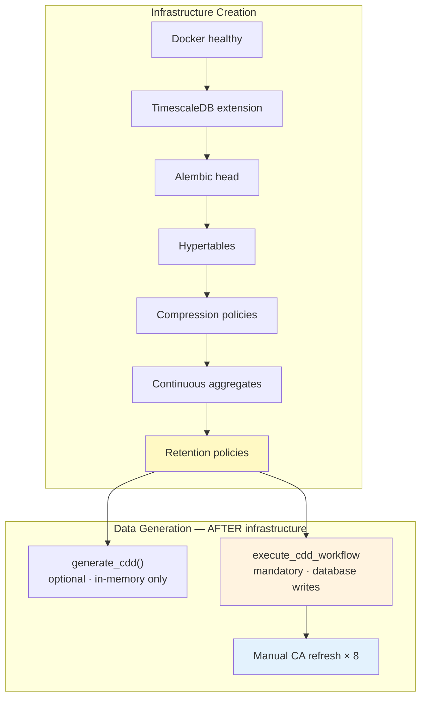

See [Platform Verification Gates](#platform-verification-gates) and [Phase 12 Platform Build Pipeline](#phase-12-platform-build-pipeline).

### CDD Overview

| Attribute | Value |
|---|---|
| Version | `cdd-v1.0.0` |
| Profile | `cdd-dev` |
| Seed | `42` |
| Temporal window | 2025-06-01 → 2026-05-31 (America/Chicago) |
| Total rows | **458,645** |
| Sensor rows | 438,000 |

CDD provides deterministic, reproducible agricultural data for validation and benchmarking. See [CDD Architecture](report/PHASE12_STEP2CA_CANONICAL_DEVELOPMENT_DATASET_ARCHITECTURE.md).

### Dataset Generation Flow

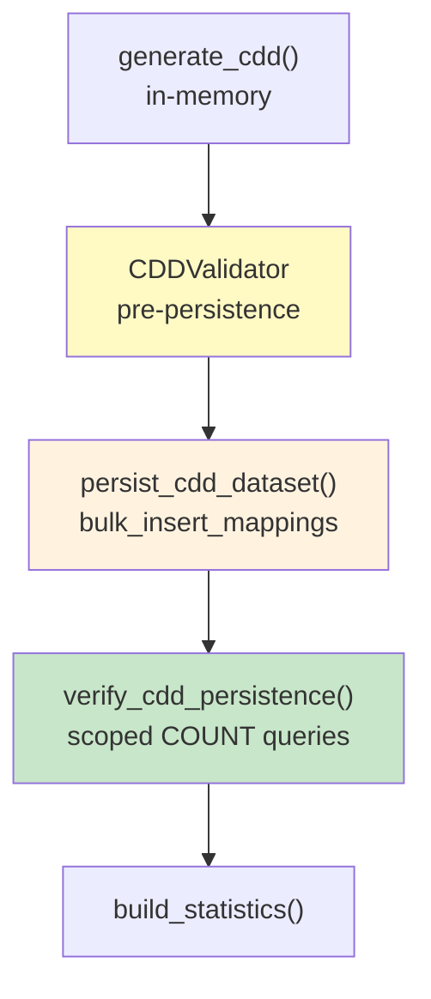

### Canonical Development Dataset Generation (End-to-End)

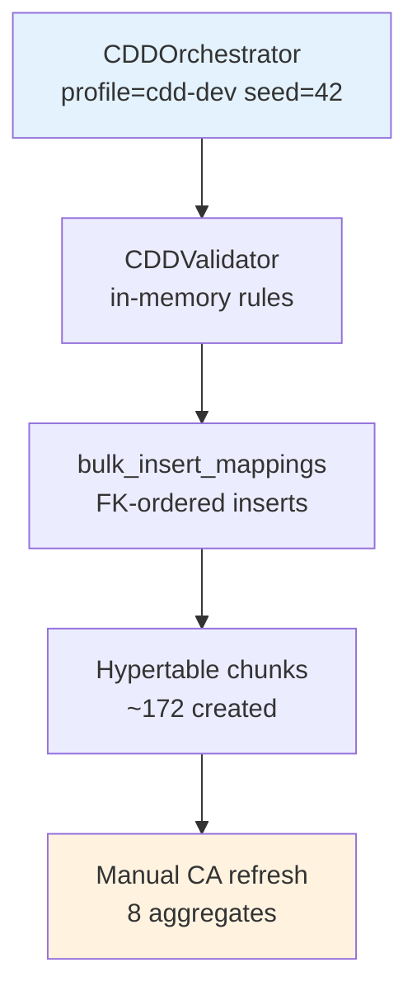

### Generate and Persist CDD

> **Gate 8:** Run only after Gates 1–7 pass. See [CDD Generation Timing](#cdd-generation-timing).

There is no `make cdd-regenerate` target yet. Run the workflow from Python:

> **📍 `backend/`** (venv active)

```bash
cd backend
python -c "
import asyncio
from app.cdd import execute_cdd_workflow

async def main():
    report = await execute_cdd_workflow(notes='platform bootstrap')
    print(f'success={report.success}')
    if report.statistics:
        s = report.statistics
        rows = sum(s.persisted_row_counts.values())
        print(f'version={s.version} seed={s.seed} rows={rows}')
        print(f'generation_ms={s.generation_duration_ms} persistence_ms={s.persistence_duration_ms}')
    if report.errors:
        for e in report.errors:
            print(f'ERROR: {e}')

asyncio.run(main())
"
```

**Expected outcome:**

```text
success=True
version=cdd-v1.0.0 seed=42 rows=458645
generation_ms=~5000 persistence_ms=~28500
```

#### What this command does

`execute_cdd_workflow` runs the full CDD pipeline: `generate_cdd()` builds 458,645 in-memory records via deterministic UUID v5 and scoped PRNG; `CDDValidator` checks FK integrity and row counts; `persist_cdd_dataset()` writes via `bulk_insert_mappings` in FK order (farms → fields → … → yield) in a single transaction; `verify_cdd_persistence()` compares scoped PostgreSQL counts against generated expectations.

#### Expected Output

`success=True`, `version=cdd-v1.0.0`, `seed=42`, `rows=458645`. Generation ~5 s; persistence ~28 s.

#### Verification

> **📍 Repository Root** → **📍 PostgreSQL (psql)**

```bash
docker compose exec -T db psql -U agriflow -d agriflow -c "SELECT COUNT(*) FROM sensor_readings;"
```

Expected: `438000`. Full counts in [Section 8](#cdd-row-counts).

#### Troubleshooting

Duplicate key on re-run (wipe DB first), `RETURNING` errors (use `execute_cdd_workflow`, not `add_all`) — see [Step 2C-C](report/PHASE12_STEP2CC_CDD_GENERATION_AND_PERSISTENCE_REPORT.md) and [Section 11](#11-troubleshooting).

| Phase | Duration (measured) | Reference |
|---|---|---|
| Generation | ~5 s | [Step 2C-C](report/PHASE12_STEP2CC_CDD_GENERATION_AND_PERSISTENCE_REPORT.md) |
| Persistence | ~28 s | Step 2C-C |
| Total workflow | ~34 s | Step 2C-C |

**Pre-persistence validation:** 0 errors (1 non-blocking warning on `disease_observations` count 48 vs target 54 is expected).

### Generation Only (No Database Writes)

> **📍 `backend/`** (venv active)

```bash
cd backend
python -c "
from app.cdd import generate_cdd
r = generate_cdd(profile='cdd-dev', seed=42)
print(f'rows={r.dataset.total_row_count} passed={r.validation_report.passed}')
"
```

**Expected output:** `rows=458645 passed=True`

#### What this command does

`generate_cdd()` runs the orchestrator and validator only — no database connection. Use this to confirm determinism and validation rules before persisting, or to inspect row counts without writing data.

#### Expected Output

`rows=458645 passed=True`

#### Verification

Re-run with the same `seed=42`; row count and UUIDs are identical across runs.

#### Troubleshooting

Validation failures block persistence — inspect `report.errors()` output. See [backend/app/cdd/README.md](../backend/app/cdd/README.md).

### Deterministic Regeneration

Identical inputs produce identical UUIDs and values:

- `CDD_VERSION` = `cdd-v1.0.0`
- `CDD_SEED` = `42`
- Profile = `cdd-dev`

Constants are defined in `backend/app/cdd/config.py`. **Always wipe the database** (or truncate all domain tables) before re-seeding to avoid primary-key conflicts.

### Post-CDD: Manual Continuous Aggregate Refresh

CAs are created `WITH NO DATA`. Automatic refresh policies scan only recent windows relative to `now()`. CDD data is predominantly historical — a **one-time full refresh** is required after first seed.

Run each aggregate individually (cannot run inside a transaction). Run all eight commands from **📍 Repository Root**:

```bash
echo "CALL refresh_continuous_aggregate('ca_sensor_hourly', NULL, NULL);" | docker compose exec -T db psql -U agriflow -d agriflow
echo "CALL refresh_continuous_aggregate('ca_sensor_daily', NULL, NULL);" | docker compose exec -T db psql -U agriflow -d agriflow
echo "CALL refresh_continuous_aggregate('ca_weather_daily', NULL, NULL);" | docker compose exec -T db psql -U agriflow -d agriflow
echo "CALL refresh_continuous_aggregate('ca_satellite_daily', NULL, NULL);" | docker compose exec -T db psql -U agriflow -d agriflow
echo "CALL refresh_continuous_aggregate('ca_weather_weekly', NULL, NULL);" | docker compose exec -T db psql -U agriflow -d agriflow
echo "CALL refresh_continuous_aggregate('ca_irrigation_monthly', NULL, NULL);" | docker compose exec -T db psql -U agriflow -d agriflow
echo "CALL refresh_continuous_aggregate('ca_disease_weekly', NULL, NULL);" | docker compose exec -T db psql -U agriflow -d agriflow
echo "CALL refresh_continuous_aggregate('ca_yield_seasonal', NULL, NULL);" | docker compose exec -T db psql -U agriflow -d agriflow
```

**Expected outcome:** Each command returns `CALL` with no error. After refresh, all 8 CAs contain materialised buckets.

**Why this is required:** Documented in [Step 3C](report/PHASE12_STEP3C_CONTINUOUS_AGGREGATE_VALIDATION_REPORT.md) — not a defect.

### CDD Verification (SQL)

> **📍 Repository Root** → **📍 PostgreSQL (psql)**

```bash
docker compose exec -T db psql -U agriflow -d agriflow -c "SELECT 'sensor_readings' AS tbl, COUNT(*) FROM sensor_readings UNION ALL SELECT 'weather_records', COUNT(*) FROM weather_records UNION ALL SELECT 'yield_records', COUNT(*) FROM yield_records;"
```

**Expected output:**

| tbl | count |
|---|---|
| sensor_readings | 438000 |
| weather_records | 14600 |
| yield_records | 22 |

Full domain counts: Section 8.

### Further Reading

| Topic | Document |
|---|---|
| CDD generator package | [backend/app/cdd/README.md](../backend/app/cdd/README.md) |
| CDD architecture | [PHASE12_STEP2CA_CANONICAL_DEVELOPMENT_DATASET_ARCHITECTURE.md](report/PHASE12_STEP2CA_CANONICAL_DEVELOPMENT_DATASET_ARCHITECTURE.md) |
| CDD persistence report | [PHASE12_STEP2CC_CDD_GENERATION_AND_PERSISTENCE_REPORT.md](report/PHASE12_STEP2CC_CDD_GENERATION_AND_PERSISTENCE_REPORT.md) |
| CA validation (manual refresh) | [PHASE12_STEP3C_CONTINUOUS_AGGREGATE_VALIDATION_REPORT.md](report/PHASE12_STEP3C_CONTINUOUS_AGGREGATE_VALIDATION_REPORT.md) |

---

## 7. Platform Validation

> **Gates 4–9:** This section validates hypertables (Gate 4), compression (Gate 5), continuous aggregates (Gate 6), retention (Gate 7), CDD row counts (Gate 8), and API health (Gate 9). Complete all checks before declaring Phase 13 readiness. See [Platform Verification Gates](#platform-verification-gates).

### Validation Flow

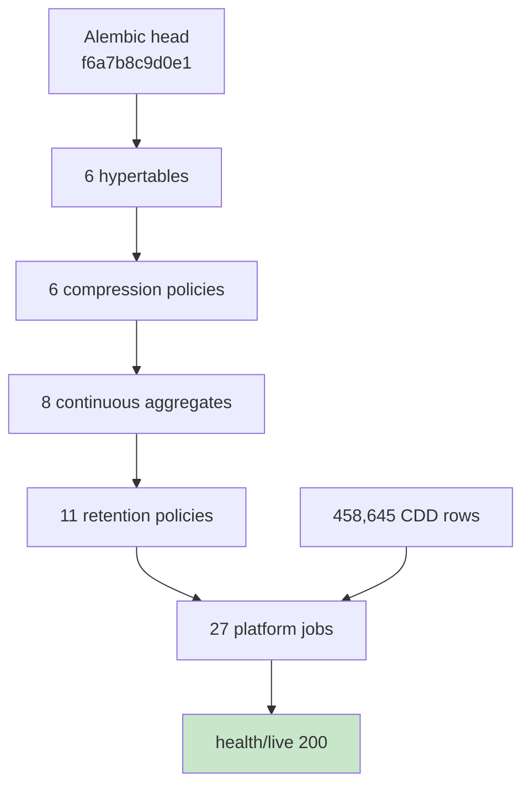

### Platform Validation Workflow

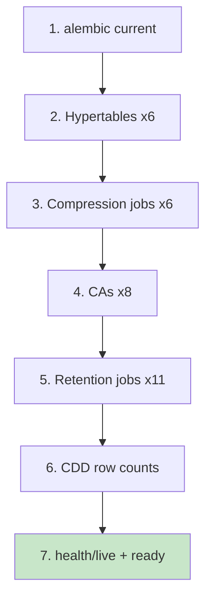

#### What these commands do

Platform validation confirms the full TimescaleDB stack is registered and operational after migrations and CDD load. Queries against `timescaledb_information.*` inspect hypertables, policy jobs, and continuous aggregates. Row-count queries confirm CDD persistence. Health endpoints confirm the FastAPI application can reach PostgreSQL.

#### Expected Output

| Check | Expected |
|---|---|
| Alembic head | `f6a7b8c9d0e1` |
| Hypertables | 6 |
| Compression jobs | 6 |
| Continuous aggregates | 8 |
| Refresh jobs | 8 |
| Retention jobs | 11 |
| Sensor rows | 438,000 |
| API health | HTTP 200 |

#### Verification

Run all commands in this section sequentially. Cross-check with [Section 8](#8-sql-verification-cheat-sheet) for detailed SQL.

#### Troubleshooting

Failed background jobs, empty CAs, wrong counts — see [Section 11](#11-troubleshooting) and runtime validation reports (Steps 2C-D, 3C, 4C).

### Alembic Version

> **📍 `backend/`**

```bash
cd backend
alembic current
```

**Expected:** `f6a7b8c9d0e1 (head)`

### Hypertables (6)

> **📍 Repository Root** → **📍 PostgreSQL (psql)**

```bash
docker compose exec -T db psql -U agriflow -d agriflow -c "SELECT hypertable_name, compression_enabled, num_chunks FROM timescaledb_information.hypertables WHERE hypertable_schema = 'public' ORDER BY hypertable_name;"
```

**Expected:** 6 rows; all `compression_enabled = t`; total chunks ≈ **172** after CDD load.

### Compression Policies (6)

> **📍 Repository Root** → **📍 PostgreSQL (psql)**

```bash
docker compose exec -T db psql -U agriflow -d agriflow -c "SELECT COUNT(*) FROM timescaledb_information.jobs WHERE proc_name = 'policy_compression';"
```

**Expected:** `6`

### Continuous Aggregates (8)

> **📍 Repository Root** → **📍 PostgreSQL (psql)**

```bash
docker compose exec -T db psql -U agriflow -d agriflow -c "SELECT COUNT(*) FROM timescaledb_information.continuous_aggregates;"
```

**Expected:** `8`

### Refresh Policies (8)

> **📍 Repository Root** → **📍 PostgreSQL (psql)**

```bash
docker compose exec -T db psql -U agriflow -d agriflow -c "SELECT COUNT(*) FROM timescaledb_information.jobs WHERE proc_name = 'policy_refresh_continuous_aggregate';"
```

**Expected:** `8`

### Retention Policies (11)

> **📍 Repository Root** → **📍 PostgreSQL (psql)**

```bash
docker compose exec -T db psql -U agriflow -d agriflow -c "SELECT COUNT(*) FROM timescaledb_information.jobs WHERE proc_name = 'policy_retention';"
```

**Expected:** `11`

**Exemptions verified:**

> **📍 Repository Root** → **📍 PostgreSQL (psql)**

```bash
docker compose exec -T db psql -U agriflow -d agriflow -c "SELECT COUNT(*) FROM timescaledb_information.jobs WHERE proc_name = 'policy_retention' AND hypertable_name = 'yield_records';"
```

**Expected:** `0`

### Background Jobs (27 platform + 2 system)

> **📍 Repository Root** → **📍 PostgreSQL (psql)**

```bash
docker compose exec -T db psql -U agriflow -d agriflow -c "SELECT proc_name, COUNT(*) FROM timescaledb_information.jobs GROUP BY proc_name ORDER BY proc_name;"
```

**Expected:**

| proc_name | count |
|---|---|
| policy_compression | 6 |
| policy_job_stat_history_retention | 1 |
| policy_refresh_continuous_aggregate | 8 |
| policy_retention | 11 |
| policy_telemetry | 1 |

**Total:** 27 jobs. All `last_run_status = Success` after first policy cycle (verify via Section 8).

### Application Health

> **📍 Host Machine** (Repository Root — `curl` to localhost)

```bash
curl -s http://localhost:8000/api/v1/health/live
curl -s http://localhost:8000/api/v1/health/ready
```

**Expected:** `alive` (200) and `ready` (200) after DB is reachable.

### Further Reading

| Topic | Document |
|---|---|
| Runtime validation (compression) | [PHASE12_STEP2CD_RUNTIME_VALIDATION_AND_BENCHMARK_REPORT.md](report/PHASE12_STEP2CD_RUNTIME_VALIDATION_AND_BENCHMARK_REPORT.md) |
| Runtime validation (CAs) | [PHASE12_STEP3C_CONTINUOUS_AGGREGATE_VALIDATION_REPORT.md](report/PHASE12_STEP3C_CONTINUOUS_AGGREGATE_VALIDATION_REPORT.md) |
| Runtime validation (retention) | [PHASE12_STEP4C_RETENTION_RUNTIME_VALIDATION_REPORT.md](report/PHASE12_STEP4C_RETENTION_RUNTIME_VALIDATION_REPORT.md) |
| Analytical platform handbook | [11-phase12-analytical-platform-handbook.md](11-phase12-analytical-platform-handbook.md) |

---

## 8. SQL Verification Cheat Sheet

Run all queries via:

> **📍 Repository Root** → **📍 PostgreSQL (psql)** (interactive session)

```bash
docker compose exec -T db psql -U agriflow -d agriflow
```

Or pipe single queries with `-c` as shown below. All `-c` examples use **single-line shell syntax** compatible with macOS, Linux, and PowerShell.

> **📍 PostgreSQL (psql)** — all `sql` blocks below execute inside the `agriflow` database. Copy SQL directly into an interactive `psql` session, or use the `-c "…"` one-liner form from Section 7.

### Infrastructure

```sql
-- TimescaleDB version
SELECT extname, extversion FROM pg_extension WHERE extname = 'timescaledb';

-- Alembic head
SELECT version_num FROM alembic_version;
```

**Expected:** `2.28.1` and `f6a7b8c9d0e1`

### Hypertables

```sql
SELECT hypertable_name, num_dimensions, compression_enabled,
       primary_dimension, num_chunks
FROM timescaledb_information.hypertables
WHERE hypertable_schema = 'public'
ORDER BY hypertable_name;
```

```sql
SELECT hypertable_name, COUNT(*) AS chunk_count
FROM timescaledb_information.chunks
WHERE hypertable_schema = 'public'
GROUP BY hypertable_name
ORDER BY hypertable_name;
```

**Expected:** 6 hypertables; ~172 total chunks after CDD.

### Compression

```sql
SELECT j.job_id, j.hypertable_name, j.scheduled, j.schedule_interval,
       js.last_run_status, js.total_successes
FROM timescaledb_information.jobs j
LEFT JOIN timescaledb_information.job_stats js ON j.job_id = js.job_id
WHERE j.proc_name = 'policy_compression'
ORDER BY j.job_id;
```

```sql
SELECT hypertable_name,
       pg_size_pretty(before_compression_total_bytes) AS before,
       pg_size_pretty(after_compression_total_bytes) AS after,
       round(before_compression_total_bytes::numeric
             / NULLIF(after_compression_total_bytes, 0), 2) AS ratio
FROM timescaledb_information.hypertable_compression_stats
WHERE hypertable_name = 'sensor_readings';
```

**Expected (CDD, post-compression):** sensor ratio ≈ **5.63×**; 79% storage reduction. See [Step 2C-D](report/PHASE12_STEP2CD_RUNTIME_VALIDATION_AND_BENCHMARK_REPORT.md).

### Continuous Aggregates

```sql
SELECT view_name, materialization_hypertable_name, view_definition IS NOT NULL AS has_def
FROM timescaledb_information.continuous_aggregates
ORDER BY view_name;
```

```sql
SELECT 'ca_sensor_hourly' AS agg, COUNT(*), MIN(bucket), MAX(bucket) FROM ca_sensor_hourly
UNION ALL SELECT 'ca_sensor_daily', COUNT(*), MIN(bucket), MAX(bucket) FROM ca_sensor_daily
UNION ALL SELECT 'ca_weather_daily', COUNT(*), MIN(bucket), MAX(bucket) FROM ca_weather_daily
UNION ALL SELECT 'ca_satellite_daily', COUNT(*), MIN(bucket), MAX(bucket) FROM ca_satellite_daily
UNION ALL SELECT 'ca_weather_weekly', COUNT(*), MIN(bucket), MAX(bucket) FROM ca_weather_weekly
UNION ALL SELECT 'ca_irrigation_monthly', COUNT(*), MIN(bucket), MAX(bucket) FROM ca_irrigation_monthly
UNION ALL SELECT 'ca_disease_weekly', COUNT(*), MIN(bucket), MAX(bucket) FROM ca_disease_weekly
UNION ALL SELECT 'ca_yield_seasonal', COUNT(*), MIN(bucket), MAX(bucket) FROM ca_yield_seasonal;
```

**Expected:** All 8 aggregates return rows after manual refresh (Section 6).

### Retention

```sql
SELECT j.job_id, j.hypertable_name, j.config->>'drop_after' AS drop_after,
       j.scheduled, js.last_run_status
FROM timescaledb_information.jobs j
LEFT JOIN timescaledb_information.job_stats js ON j.job_id = js.job_id
WHERE j.proc_name = 'policy_retention'
ORDER BY j.job_id;
```

```sql
-- yield_records exemption
SELECT COUNT(*) FROM timescaledb_information.jobs
WHERE proc_name = 'policy_retention' AND hypertable_name = 'yield_records';
```

**Expected:** 11 retention jobs; 0 for `yield_records`.

### Jobs (All Policies)

```sql
SELECT proc_name, COUNT(*) AS job_count
FROM timescaledb_information.jobs
GROUP BY proc_name
ORDER BY proc_name;
```

```sql
SELECT j.job_id, j.hypertable_name, j.proc_name, js.last_run_status
FROM timescaledb_information.jobs j
LEFT JOIN timescaledb_information.job_stats js ON j.job_id = js.job_id
WHERE j.proc_name IN ('policy_compression', 'policy_refresh_continuous_aggregate', 'policy_retention')
ORDER BY j.proc_name, j.job_id;
```

### Storage

```sql
SELECT hypertable_name,
       pg_size_pretty(hypertable_size(format('%I.%I', hypertable_schema, hypertable_name)::regclass)) AS total_size
FROM timescaledb_information.hypertables
WHERE hypertable_schema = 'public'
ORDER BY hypertable_name;
```

**Expected (CDD, compressed):** Total hypertable storage ≈ **41 MB**.

### CDD Row Counts

```sql
SELECT 'farms' AS domain, COUNT(*) FROM farms
UNION ALL SELECT 'fields', COUNT(*) FROM fields
UNION ALL SELECT 'crops', COUNT(*) FROM crops
UNION ALL SELECT 'weather_records', COUNT(*) FROM weather_records
UNION ALL SELECT 'sensor_readings', COUNT(*) FROM sensor_readings
UNION ALL SELECT 'satellite_observations', COUNT(*) FROM satellite_observations
UNION ALL SELECT 'irrigation_events', COUNT(*) FROM irrigation_events
UNION ALL SELECT 'disease_observations', COUNT(*) FROM disease_observations
UNION ALL SELECT 'yield_records', COUNT(*) FROM yield_records;
```

**Expected totals:**

| Domain | Rows |
|---|---|
| farms | 1 |
| fields | 10 |
| crops | 18 |
| weather_records | 14,600 |
| sensor_readings | 438,000 |
| satellite_observations | 5,840 |
| irrigation_events | 96 |
| disease_observations | 48 |
| yield_records | 22 |
| **Total** | **458,645** |

### Hypertable Time Ranges

```sql
SELECT 'sensor_readings' AS tbl, MIN(recorded_at), MAX(recorded_at), COUNT(*) FROM sensor_readings
UNION ALL SELECT 'weather_records', MIN(recorded_at), MAX(recorded_at), COUNT(*) FROM weather_records
UNION ALL SELECT 'yield_records', MIN(recorded_at), MAX(recorded_at), COUNT(*) FROM yield_records;
```

**Expected:** Data spans 2025-06-01 through 2026-06-01 (UTC-aligned per CDD).

### Further Reading

| Topic | Document |
|---|---|
| Step 2C-D validation SQL | [PHASE12_STEP2CD_RUNTIME_VALIDATION_AND_BENCHMARK_REPORT.md](report/PHASE12_STEP2CD_RUNTIME_VALIDATION_AND_BENCHMARK_REPORT.md) |
| Step 4C SQL appendix | [PHASE12_STEP4C_RETENTION_RUNTIME_VALIDATION_REPORT.md](report/PHASE12_STEP4C_RETENTION_RUNTIME_VALIDATION_REPORT.md) |
| Complete architecture | [12-phase12-complete-architecture-handbook.md](12-phase12-complete-architecture-handbook.md) |

---

## 9. Backup & Restore

### Operational Lifecycle

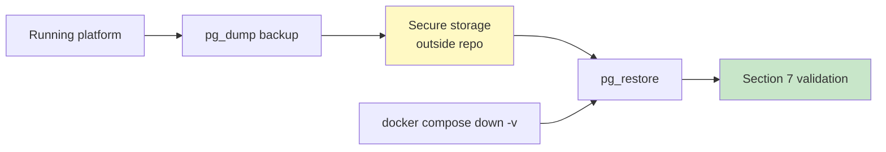

### Backup and Restore Workflow

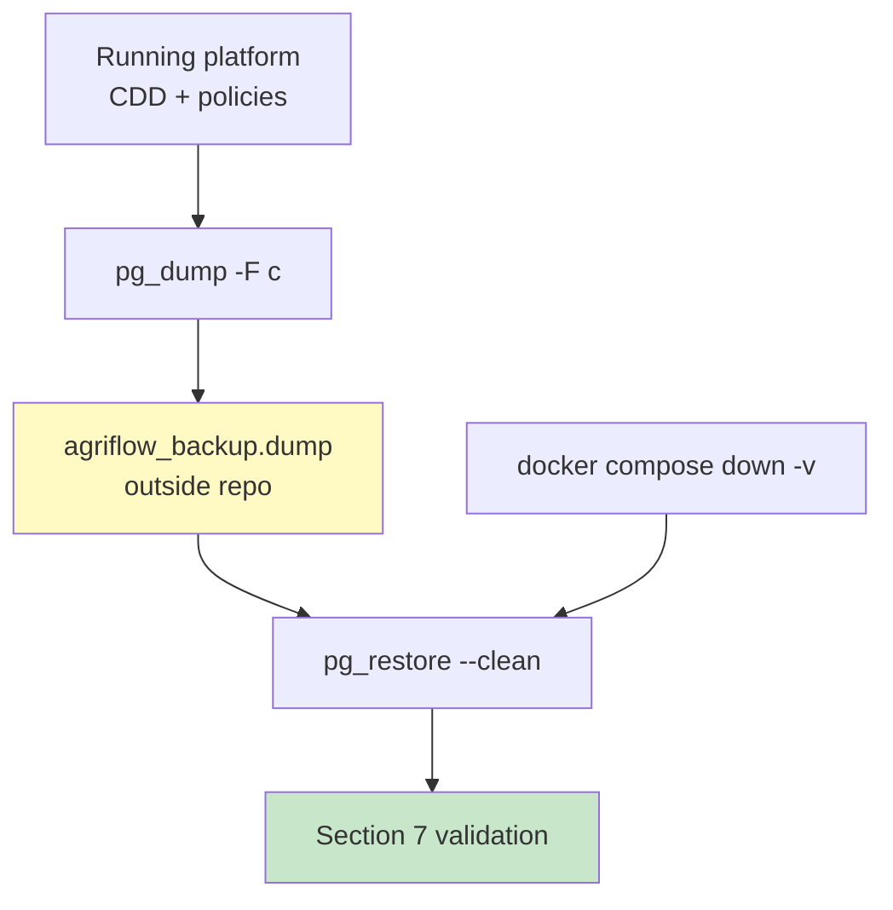

### Create Backup

> **📍 Repository Root** (backup file written to current directory) · **📍 Host Machine** (local `pg_dump` variant)

**Custom format (recommended):**

```bash
docker compose exec -T db pg_dump -U agriflow -d agriflow -F c > agriflow_backup.dump
```

**Plain SQL:**

```bash
docker compose exec -T db pg_dump -U agriflow -d agriflow > agriflow_backup.sql
```

**From host (if `pg_dump` installed locally):**

> **📍 Host Machine**

```bash
pg_dump -h localhost -p 25432 -U agriflow -d agriflow -F c -f agriflow_backup.dump
```

**Expected outcome:** Backup file created. Size ≈ 40–50 MB with CDD loaded and compressed.

#### What this command does

`pg_dump` exports a logical snapshot of the `agriflow` database — schema, hypertable metadata, TimescaleDB policies, continuous aggregates, and all row data — into a portable file. Custom format (`-F c`) supports selective restore and compression.

#### Expected Output

File `agriflow_backup.dump` created on disk. No error output from `pg_dump`.

#### Verification

> **📍 Repository Root**

**macOS / Linux:**

```bash
ls -lh agriflow_backup.dump
```

**Windows (PowerShell):**

```powershell
Get-Item agriflow_backup.dump | Select-Object Name, Length
```

Non-zero file size (~40–50 MB with CDD).

#### Troubleshooting

Permission denied or connection refused — confirm `db` container is running and credentials match. See [Section 11](#11-troubleshooting).

> **Never commit backup files to Git.** Store outside the repository.

### Restore Backup

**Prerequisite:** Database container running; target database exists (empty or wiped).

> **📍 Repository Root** (stdin redirected into Docker `db` container)

**Custom format restore:**

```bash
docker compose exec -T db pg_restore -U agriflow -d agriflow --clean --if-exists < agriflow_backup.dump
```

**Plain SQL restore:**

```bash
docker compose exec -T db psql -U agriflow -d agriflow < agriflow_backup.sql
```

**Expected outcome:** All tables, hypertables, policies, and data restored.

#### What this command does

`pg_restore` replays the dump into the target database, recreating tables, TimescaleDB extension objects, hypertable chunks, policy jobs, and row data. `--clean --if-exists` drops conflicting objects before restore.

#### Expected Output

Restore completes without `FATAL` errors. Warnings about existing objects may appear with `--clean`.

#### Verification

Run [Verify After Restore](#verify-after-restore) commands below.

#### Troubleshooting

Restore into non-empty database may conflict — prefer wipe (`docker compose down -v`) or use `--clean`. See P12-D003 in [Decision Register](report/PHASE12_DECISION_REGISTER.md).

### Verify After Restore

> **📍 Repository Root** + **📍 Host Machine** (`curl`)

```bash
docker compose exec -T db psql -U agriflow -d agriflow -c "SELECT version_num FROM alembic_version;"
docker compose exec -T db psql -U agriflow -d agriflow -c "SELECT COUNT(*) FROM sensor_readings;"
curl -s http://localhost:8000/api/v1/health/ready
```

**Expected:** Alembic at head; sensor count 438,000; health `ready`.

**Governance:** Pre-migration backups are mandatory per P12-D003. See [Decision Register](report/PHASE12_DECISION_REGISTER.md).

### Further Reading

| Topic | Document |
|---|---|
| Backup protocol | [PHASE12_DECISION_REGISTER.md](report/PHASE12_DECISION_REGISTER.md) — P12-D003 |
| Operational lifecycle | [12-phase12-complete-architecture-handbook.md](12-phase12-complete-architecture-handbook.md) §11 |

---

## Development vs Production Backup Strategy

Section 9 documents **how** to create and restore backups. This section explains **when** backups matter — and why development and production follow different rules.

### Development Environment

The Canonical Development Dataset (CDD) is **deterministic**. Identical inputs (`cdd-v1.0.0`, profile `cdd-dev`, seed `42`) produce identical UUIDs, row counts, and values on every machine. The development database is therefore **regenerable**, not irreplaceable.

A complete analytical platform can be recreated from source at any time:

```text
docker compose down -v
docker compose up -d --build
alembic upgrade head
execute_cdd_workflow
```

This sequence wipes the Docker volume, rebuilds containers, applies all migrations, and repopulates 458,645 CDD rows. No backup file is required for routine development.

**Development implications:**

- Docker volumes (`postgres_data`) may be deleted without risk — data is reproducible.
- `docker compose down -v` is the preferred clean-slate mechanism, not a last resort.
- Local database backups are **optional** and exist only as a convenience.

**Optional backup use cases in development:**

| Scenario | Why a local backup helps |
|---|---|
| Before experimenting with Alembic downgrades | Roll back quickly without re-running CDD |
| Before large refactoring | Snapshot current state for comparison |
| Before major architectural changes | Preserve a known-good platform for diff testing |

Even in these cases, the authoritative recovery path remains: rebuild from Git + CDD regeneration.

### Production Environment

Production data is **not deterministic**. Real farm measurements, user actions, audit trails, and operational history cannot be regenerated from the CDD generator.

Production databases must always be backed up **before**:

- Schema migrations (`alembic upgrade`)
- Major application upgrades
- TimescaleDB or PostgreSQL version changes
- Infrastructure maintenance (volume migration, host replacement, cluster failover)

Production backup, restore, disaster recovery, replication, and high availability are **out of scope** for this guide. They will be documented separately in future infrastructure phases. Section 9 commands remain valid for ad-hoc production snapshots when authorised by platform operations.

### Backup Philosophy

> **Source code belongs in Git. Generated data does not.**
>
> - **Database backups do not** — environment-specific operational snapshots.
> - **Docker volumes do not** — ephemeral runtime state, reproducible in development.
> - **Generated Canonical Development Datasets do not** — derived from deterministic code, not stored as files.
>
> **Git stores:** source code, Alembic migrations, documentation, architecture handbooks, and ADRs.
>
> **Git does not store:** PostgreSQL data, `pg_dump` files, or local backup directories. These are environment-specific operational artifacts — each developer or deployment maintains its own copies outside version control.

### Local Backup Directory

Developers may optionally create a local `backups/` directory at the repository root to store PostgreSQL backup files created via Section 9 commands.

| Property | Guidance |
|---|---|
| **Optional** | Not required to bootstrap the platform |
| **Purpose** | Local development convenience only |
| **Ownership** | Every developer maintains their own local backups |
| **Scope** | Environment-specific operational artifacts — not shared |

Bootstrap never depends on a backup file. The authoritative development path remains: clone from Git → Docker → Alembic → CDD generation.

**Why `backups/` must be excluded from Git:**

- Backups are **generated artifacts**, not source code.
- In development, data can be **regenerated** from deterministic CDD generation (`execute_cdd_workflow`).
- Backup files **quickly become outdated** as Alembic migrations and platform policies evolve.
- Committed dumps **unnecessarily increase repository size** (40–50 MB per CDD-loaded snapshot).
- Keeping backups local ensures the repository remains **clean, lightweight, and reproducible**.

**Recommended `.gitignore` entries:**

```gitignore
backups/
*.dump
*.sql
*.backup
*.bak
```

> **Git should contain only:** source code, Alembic migrations, documentation, ADRs, and architecture handbooks.
>
> **Git must never be used as a storage location for database backups.**

### Recommended Backup Directory

When creating optional development snapshots, use a local `backups/` directory at the repository root:

```text
AGRIFLOW-AI/
├── docs/
├── backend/
└── backups/
    ├── README.md
    ├── agriflow_before_phase13.dump
    └── agriflow_before_phase14.dump
```

| Rule | Rationale |
|---|---|
| Keep `backups/` **local** | Backups are machine-specific; not shared via Git |
| Exclude from Git | Prevents large binary files and stale data in the repository |
| Each developer maintains their own | Deterministic CDD makes shared backup files unnecessary |

Create `backups/README.md` locally to document your snapshot naming convention (date, phase, purpose). Do not commit backup files.

**Example — save before an experiment** (file path only; commands unchanged from Section 9):

> **📍 Repository Root**

**macOS / Linux:**

```bash
mkdir -p backups
docker compose exec -T db pg_dump -U agriflow -d agriflow -F c > backups/agriflow_before_phase13.dump
```

**Windows (PowerShell):**

```powershell
New-Item -ItemType Directory -Force -Path backups
docker compose exec -T db pg_dump -U agriflow -d agriflow -F c > backups/agriflow_before_phase13.dump
```

### Git Ignore Recommendation

Add the following entries to `.gitignore` to prevent accidental commits of backup artifacts:

```gitignore
backups/
*.dump
*.sql
*.backup
*.bak
```

**Why backup files must never be committed:**

- **Size** — CDD-loaded dumps are 40–50 MB; they bloat repository history permanently.
- **Stale data** — committed dumps become outdated after the next migration or CDD version bump.
- **Environment coupling** — dumps may contain machine-specific state incompatible with other developers.
- **Determinism** — the CDD generator is the canonical data source; backup files duplicate what code already reproduces.

The repository already excludes some backup patterns. Align local `.gitignore` with the entries above for complete coverage.

### Deterministic Dataset Philosophy

The Canonical Development Dataset is **intentionally deterministic** — a core architectural decision of Phase 12.

| Principle | Effect |
|---|---|
| **Regenerate, don't restore** | Development databases are rebuilt from code, not replayed from dumps |
| **Lightweight repository** | No multi-megabyte data files in Git |
| **Identical datasets everywhere** | Every developer obtains the same 458,645 rows from the same seed |
| **Reproducible validation** | Platform checks (hypertables, compression, CAs, retention) yield consistent results |

Because CDD v1.0.0 is defined entirely by version, profile, and seed constants in `backend/app/cdd/config.py`, the development backup file adds no information that the generator cannot recreate in ~34 seconds.

Detail: [CDD Architecture](report/PHASE12_STEP2CA_CANONICAL_DEVELOPMENT_DATASET_ARCHITECTURE.md) · [CDD generator package](../backend/app/cdd/README.md) · [Section 6](#6-canonical-development-dataset-cdd).

### Development vs Production Data Flow

```mermaid
flowchart TD
    subgraph dev ["Development — Deterministic Regeneration"]
        SC["Source Code"]
        GIT["Git Repository"]
        CLONE["Clone Repository"]
        DOCKER["Docker"]
        TSDB["TimescaleDB"]
        ALE["Alembic"]
        CDD["Generate CDD"]
        DEVDB["Development Database"]

        SC --> GIT --> CLONE --> DOCKER --> TSDB --> ALE --> CDD --> DEVDB
    end

    subgraph prod ["Production — Backup Required"]
        PRODDB["Production Database"]
        BACKUP["Backup<br/>pg_dump"]
        RESTORE["Restore<br/>pg_restore"]
        PRODDB2["Production Database"]

        PRODDB --> BACKUP --> RESTORE --> PRODDB2
    end

    style DEVDB fill:#c8e6c9
    style BACKUP fill:#fff9c4
    style PRODDB fill:#ffebee
    style PRODDB2 fill:#ffebee
```

**Development path:** Git is the source of truth. Data is generated on demand — backups are optional convenience, not dependency.

**Production path:** The database is the source of truth. Backups are mandatory before any destructive or irreversible operation.

### Further Reading

| Topic | Document |
|---|---|
| CDD architecture | [PHASE12_STEP2CA_CANONICAL_DEVELOPMENT_DATASET_ARCHITECTURE.md](report/PHASE12_STEP2CA_CANONICAL_DEVELOPMENT_DATASET_ARCHITECTURE.md) |
| Backup commands | [Section 9](#9-backup--restore) |
| Complete rebuild | [Section 10](#10-complete-platform-rebuild) |
| Backup governance (migrations) | [PHASE12_DECISION_REGISTER.md](report/PHASE12_DECISION_REGISTER.md) — P12-D003 |

---

## 10. Complete Platform Rebuild

### Full Rebuild Workflow

Execute these steps in order for a **clean rebuild from empty environment**:

| Step | Command / Action | Expected Outcome |
|---|---|---|
| 1 | Clone repo + create venv + `pip install -r backend/requirements.txt` | Dependencies installed |
| 2 | Configure `backend/.env` and root `.env` | Credentials set; port 25432 on host |
| 3 | `docker compose down -v` | Old volume removed (optional) |
| 4 | `docker compose up -d --build` | `db` healthy, `backend` running |
| 5 | `cd backend` then `alembic upgrade head` | Head = `f6a7b8c9d0e1` |
| 6 | Run `execute_cdd_workflow` (Section 6) | 458,645 rows persisted |
| 7 | Manual CA refresh loop (Section 6) | 8 CAs materialised |
| 8 | Run Section 7 validation | All counts match |
| 9 | `curl /api/v1/health/live` and `/ready` | HTTP 200 |

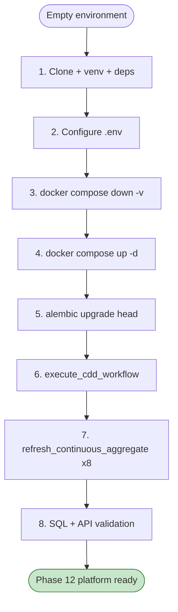

### Complete Platform Bootstrap

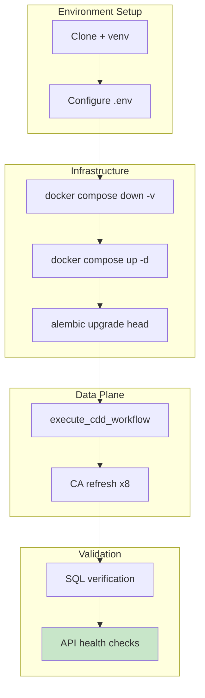

### Estimated Time

| Phase | Duration |
|---|---|
| Docker build + startup | 1–3 min |
| Alembic migrations | < 1 min |
| CDD workflow | ~35 s |
| CA manual refresh | ~30 s |
| Validation | ~2 min |
| **Total** | **~5–10 min** |

### Further Reading

| Topic | Document |
|---|---|
| Complete architecture handbook | [12-phase12-complete-architecture-handbook.md](12-phase12-complete-architecture-handbook.md) |
| Bootstrap guide checklist | [Complete Platform Rebuild Checklist](#complete-platform-rebuild-checklist) |

---

## 11. Troubleshooting

This section summarises common Phase 12 issues. Full debugging narratives are in dedicated documents — not duplicated here.

### TimescaleDB Extension Missing

#### Symptoms

- `alembic upgrade head` fails at migration `f1e2d3c4b5a6`
- Hypertable migration fails with extension-related errors
- `pg_available_extensions` returns no row for `timescaledb`
- Post-migration check: `pg_extension` query returns zero rows

#### Root Cause

Alembic is connected to a PostgreSQL instance that does not include TimescaleDB extension binaries, or the connection targets the wrong database host.

#### Typical Error Messages

```text
extension "timescaledb" is not available
```

```text
extension "timescaledb" does not exist
```

The first message indicates the **server lacks TimescaleDB binaries** (wrong image or local PostgreSQL). The second typically appears when code references TimescaleDB functions before `CREATE EXTENSION` has run.

#### Resolution

1. **Verify Docker image** — `docker compose config` must show `timescale/timescaledb:2.28.1-pg17`. If using plain `postgres`, update `docker-compose.yml` and recreate the volume.
2. **Verify connection target** — `backend/.env` must use `POSTGRES_PORT=25432` from the host (not `5432` unless running inside the Docker network).
3. **Eliminate local PostgreSQL conflicts** — if a local PostgreSQL service listens on port `5432`, ensure `DATABASE_URL` does not accidentally connect to it instead of the Docker-mapped port.
4. **Recreate on persistent wrong state** — if a volume was initialised with a non-TimescaleDB image: `docker compose down -v` then `docker compose up -d --build`.
5. **Re-run pre-migration checks** — [Verify TimescaleDB Before Running Alembic](#verify-timescaledb-before-running-alembic).

#### Verification

After resolution, confirm before re-running Alembic:

> **📍 Repository Root** → **📍 PostgreSQL (psql)**

```bash
docker compose exec -T db psql -U agriflow -d agriflow -c "SELECT name, default_version FROM pg_available_extensions WHERE name = 'timescaledb';"
```

Expected: one row with `default_version = 2.28.1`.

Cross-reference: [ADR-001](adr/ADR-001-timescaledb-extension-enablement.md) · [Step 3B Implementation Lessons Learned](report/PHASE12_STEP3B_IMPLEMENTATION_LESSONS_LEARNED.md) (extension and CA debugging patterns) · [Foundation Handbook §Known Issues](10-phase12-step1-foundation-handbook.md).

---

| Symptom | Likely Cause | Resolution | Detail In |
|---|---|---|---|
| `POSTGRES_PASSWORD must be set` on `docker compose up` | Missing root `.env` | Create `.env` at repo root with `POSTGRES_PASSWORD` | Section 2 |
| Alembic connection refused | Wrong port in `backend/.env` | Use `POSTGRES_PORT=25432` from host | Section 2 |
| `extension "timescaledb" is not available` | Wrong Docker image or connection | Verify TimescaleDB container and port; see [TimescaleDB Extension Missing](#timescaledb-extension-missing) | [ADR-001](adr/ADR-001-timescaledb-extension-enablement.md) |
| `extension "timescaledb" does not exist` | Extension not yet installed | Run `alembic upgrade head` through `f1e2d3c4b5a6`; verify pre-migration checks | [Verify TimescaleDB Before Running Alembic](#verify-timescaledb-before-running-alembic) |
| Migration fails on hypertable PK | Pre-Phase-12 schema state | Ensure all domain migrations applied before `c9d8e7f6a5b4` | [ADR-002](adr/ADR-002-hypertable-primary-key-conversion-strategy.md) |
| CDD persistence `RETURNING` error | Composite PK + `add_all()` | Use `execute_cdd_workflow` (uses `bulk_insert_mappings`) | [Step 2C-C](report/PHASE12_STEP2CC_CDD_GENERATION_AND_PERSISTENCE_REPORT.md) |
| CAs empty after migration | `WITH NO DATA` + historical CDD | Run manual `refresh_continuous_aggregate(NULL, NULL)` | [Step 3C](report/PHASE12_STEP3C_CONTINUOUS_AGGREGATE_VALIDATION_REPORT.md) |
| CA refresh policy registration fails | `start_offset` < 2 × bucket width | Fixed in migration v1.3 for `ca_weather_weekly` | [Step 3 Lessons Learned](report/PHASE12_STEP3B_IMPLEMENTATION_LESSONS_LEARNED.md) |
| `COMMENT ON MATERIALIZED VIEW` fails | CAs are `relkind='v'` | Use `COMMENT ON VIEW` in migrations | Step 3 Lessons Learned |
| Compression ratio low at CDD scale | Dev dataset below production volume | Architecture validated; ratio improves at scale | [Step 2C-D](report/PHASE12_STEP2CD_RUNTIME_VALIDATION_AND_BENCHMARK_REPORT.md) |
| Retention dropped CDD data unexpectedly | Should not happen at CDD age (~395 days) | Verify `drop_after` ≥ 24 months for sensors | [Step 4C](report/PHASE12_STEP4C_RETENTION_RUNTIME_VALIDATION_REPORT.md) |
| Duplicate key on CDD re-run | Existing data in database | Wipe volume or truncate before re-seed | Section 6 |
| `refresh_continuous_aggregate` in transaction error | TimescaleDB restriction | Pipe each `CALL` individually via `psql` | Step 3C |

### Diagnostic Commands

> **📍 Repository Root**

```bash
# Container logs
docker compose logs db --tail 50
docker compose logs backend --tail 50

# Failed background jobs
docker compose exec -T db psql -U agriflow -d agriflow -c "SELECT j.job_id, j.proc_name, j.hypertable_name, js.last_run_status, js.last_run_status_detail FROM timescaledb_information.jobs j JOIN timescaledb_information.job_stats js ON j.job_id = js.job_id WHERE js.last_run_status != 'Success';"
```

### Further Reading

| Topic | Document |
|---|---|
| CA implementation lessons | [PHASE12_STEP3B_IMPLEMENTATION_LESSONS_LEARNED.md](report/PHASE12_STEP3B_IMPLEMENTATION_LESSONS_LEARNED.md) |
| ADR-001 (extension) | [ADR-001-timescaledb-extension-enablement.md](adr/ADR-001-timescaledb-extension-enablement.md) |
| ADR-004 (CAs) | [ADR-004-timescaledb-continuous-aggregate-strategy.md](adr/ADR-004-timescaledb-continuous-aggregate-strategy.md) |
| ADR-005 (retention) | [ADR-005-timescaledb-retention-policy-strategy.md](adr/ADR-005-timescaledb-retention-policy-strategy.md) |

---

## Platform Lifecycle

The bootstrap guide supports an iterative engineering workflow. After initial setup, developers repeat subsets of this cycle as the platform evolves.

```mermaid
flowchart TD
    DEV["Developer"]
    CODE["Code Changes"]
    MIG["Database Migration<br/>alembic upgrade head"]
    CDD["CDD Generation<br/>execute_cdd_workflow"]
    REF["CA Refresh<br/>manual or policy"]
    VAL["Platform Validation<br/>SQL + API health"]
    TEST["Testing / Smoke checks"]
    COMMIT["Git Commit"]
    NEXT["Next Phase Development"]

    DEV --> CODE --> MIG
    MIG --> CDD
    MIG --> REF
    CDD --> REF --> VAL --> TEST --> COMMIT --> NEXT
    NEXT --> CODE

    style VAL fill:#e3f2fd
    style NEXT fill:#c8e6c9
```

**How this supports safe iteration:**

- **Migrations first** — schema and TimescaleDB policy changes are version-controlled and reversible in development.
- **CDD re-seed after wipe** — deterministic data restores a known validation corpus without manual test data entry.
- **CA refresh after data changes** — ensures analytical rollups reflect new or regenerated data.
- **Validation before commit** — SQL checks and health endpoints catch policy registration failures, empty aggregates, and connection issues early.
- **Phase 13 builds on this cycle** — Feature Store development adds extraction pipelines atop the validated persistence layer without redesigning storage.

### Further Reading

| Topic | Document |
|---|---|
| Operational lifecycle | [12-phase12-complete-architecture-handbook.md](12-phase12-complete-architecture-handbook.md) §11 |
| Complete rebuild checklist | [Complete Platform Rebuild Checklist](#complete-platform-rebuild-checklist) |

---

## 12. Platform Health Checklist

Use this checklist to confirm the platform is fully operational and ready for **Phase 13 — Feature Store**.

### Phase 13 Readiness

```mermaid
flowchart TD
    subgraph infra ["Infrastructure"]
        I1["PostgreSQL 17.10"]
        I2["TimescaleDB 2.28.1"]
        I3["Alembic f6a7b8c9d0e1"]
    end

    subgraph stack ["TimescaleDB Stack"]
        S1["6 hypertables"]
        S2["6 compression policies"]
        S3["8 continuous aggregates"]
        S4["11 retention policies"]
        S5["27 background jobs"]
    end

    subgraph data ["Data Plane"]
        D1["CDD v1.0.0 loaded"]
        D2["458,645 rows"]
        D3["CAs materialised"]
    end

    subgraph app ["Application"]
        A1["API health/live 200"]
        A2["API health/ready 200"]
        A3["0 app-layer changes"]
    end

    infra --> stack --> data --> app --> P13["Phase 13 Feature Store"]

    style P13 fill:#c8e6c9,stroke:#2e7d32
```

### Checklist

| # | Check | Command / Query | Expected |
|---|---|---|---|
| 1 | Docker services healthy | `docker compose ps` | `db` healthy, `backend` up |
| 2 | TimescaleDB active | `SELECT extversion FROM pg_extension WHERE extname='timescaledb'` | `2.28.1` |
| 3 | Alembic at head | `alembic current` | `f6a7b8c9d0e1` |
| 4 | Hypertables | `SELECT COUNT(*) FROM timescaledb_information.hypertables` | `6` |
| 5 | Chunks created | `SELECT SUM(num_chunks) FROM timescaledb_information.hypertables` | `~172` |
| 6 | Compression policies | `jobs WHERE proc_name='policy_compression'` | `6` |
| 7 | Continuous aggregates | `continuous_aggregates` count | `8` |
| 8 | CA refresh policies | `jobs WHERE proc_name='policy_refresh_continuous_aggregate'` | `8` |
| 9 | CAs materialised | `SELECT COUNT(*) FROM ca_sensor_daily` | `> 0` |
| 10 | Retention policies | `jobs WHERE proc_name='policy_retention'` | `11` |
| 11 | `yield_records` exempt | retention jobs on `yield_records` | `0` |
| 12 | Background jobs success | all policy `last_run_status` | `Success` |
| 13 | CDD row count | `SUM` across domains | `458,645` |
| 14 | API liveness | `GET /api/v1/health/live` | `200 alive` |
| 15 | API readiness | `GET /api/v1/health/ready` | `200 ready` |

When all 15 checks pass, the Phase 12 analytical platform is **bootstrap-complete** and ready for Phase 13 development.

### Further Reading

| Topic | Document |
|---|---|
| Complete architecture | [12-phase12-complete-architecture-handbook.md](12-phase12-complete-architecture-handbook.md) |
| Phase 13 readiness | [12-phase12-complete-architecture-handbook.md](12-phase12-complete-architecture-handbook.md) §12 |

---

## Platform Verification Dashboard

One-page status summary. Replace status indicators after running validation commands.

| Capability | Verification | Expected Status |
|---|---|---|
| Docker | `docker compose ps` — `db` healthy, `backend` up | ✅ Running |
| PostgreSQL | `pg_isready -U agriflow -d agriflow` | ✅ Connected |
| TimescaleDB | `SELECT extversion FROM pg_extension WHERE extname='timescaledb'` | ✅ Extension Loaded (`2.28.1`) |
| Alembic | `alembic current` | ✅ Latest Revision (`f6a7b8c9d0e1`) |
| Hypertables | `SELECT COUNT(*) FROM timescaledb_information.hypertables` | ✅ Present (`6`) |
| Compression | `jobs WHERE proc_name='policy_compression'` | ✅ Enabled (`6` jobs) |
| Continuous Aggregates | `SELECT COUNT(*) FROM timescaledb_information.continuous_aggregates` | ✅ Registered (`8`) |
| Refresh Policies | `jobs WHERE proc_name='policy_refresh_continuous_aggregate'` | ✅ Active (`8` jobs) |
| Retention Policies | `jobs WHERE proc_name='policy_retention'` | ✅ Active (`11` jobs) |
| Canonical Development Dataset | `SELECT COUNT(*) FROM sensor_readings` | ✅ Generated (`438000`) |
| Platform Ready | All checks above + `health/ready` 200 | ✅ Yes |

**Quick verify all** (run sequentially from **📍 Repository Root**, then **📍 `backend/`** for Alembic):

```bash
docker compose ps
cd backend
alembic current
docker compose exec -T db psql -U agriflow -d agriflow -c "SELECT (SELECT extversion FROM pg_extension WHERE extname='timescaledb') AS tsdb, (SELECT COUNT(*) FROM timescaledb_information.hypertables) AS hypertables, (SELECT COUNT(*) FROM timescaledb_information.continuous_aggregates) AS cas, (SELECT COUNT(*) FROM sensor_readings) AS sensors;"
curl -s http://localhost:8000/api/v1/health/ready
```

---

## Complete Platform Rebuild Checklist

Practical checklist for rebuilding from an empty Docker environment. Check each step before proceeding.

| Step | Action | Status |
|---|---|---|
| Clone repository | `git clone` + `cd AGRIFLOW-AI` | ☐ |
| Create virtual environment | `python3.12 -m venv .venv` + activate | ☐ |
| Install dependencies | `cd backend` then `pip install -r requirements.txt` | ☐ |
| Configure `backend/.env` | Port `25432`, credentials set | ☐ |
| Configure root `.env` | `POSTGRES_PASSWORD` set | ☐ |
| Start Docker | `docker compose up -d --build` | ☐ |
| Verify PostgreSQL | `pg_isready` returns accepting connections | ☐ |
| Verify TimescaleDB | Extension query returns `2.28.1` (after migrations) | ☐ |
| Run Alembic migrations | `alembic upgrade head` | ☐ |
| Verify Alembic head | `f6a7b8c9d0e1 (head)` | ☐ |
| Generate Canonical Development Dataset | `execute_cdd_workflow` — `success=True` | ☐ |
| Persist dataset | 458,645 rows committed | ☐ |
| Refresh continuous aggregates | Manual `refresh_continuous_aggregate` × 8 | ☐ |
| Verify Hypertables | 6 hypertables, ~172 chunks | ☐ |
| Verify Compression | 6 `policy_compression` jobs | ☐ |
| Verify Continuous Aggregates | 8 CAs with rows | ☐ |
| Verify Retention Policies | 11 `policy_retention` jobs | ☐ |
| Verify Background Jobs | 27 platform jobs, `Success` status | ☐ |
| Execute validation SQL | [Section 8](#8-sql-verification-cheat-sheet) row counts | ☐ |
| Verify API health | `health/live` and `health/ready` → 200 | ☐ |
| Platform ready for Phase 13 | All checks pass | ☐ |

---

## Next Steps

After successfully completing bootstrap and passing the [Platform Health Checklist](#12-platform-health-checklist), proceed as follows.

### Read

| Document | Why |
|---|---|
| [12-phase12-complete-architecture-handbook.md](12-phase12-complete-architecture-handbook.md) | Definitive Phase 12 architecture — single entry point |
| [10-phase12-step1-foundation-handbook.md](10-phase12-step1-foundation-handbook.md) | Hypertable foundation, principles, and runtime behaviour |
| [11-phase12-analytical-platform-handbook.md](11-phase12-analytical-platform-handbook.md) | Continuous aggregates, refresh tiers, and analytical queries |

### Understand

| ADR | Topic |
|---|---|
| [ADR-001](adr/ADR-001-timescaledb-extension-enablement.md) | TimescaleDB extension enablement |
| [ADR-002](adr/ADR-002-hypertable-primary-key-conversion-strategy.md) | Hypertable conversion and composite PKs |
| [ADR-003](adr/ADR-003-timescaledb-compression-policy-strategy.md) | Compression policies |
| [ADR-004](adr/ADR-004-timescaledb-continuous-aggregate-strategy.md) | Continuous aggregate catalogue and refresh tiers |
| [ADR-005](adr/ADR-005-timescaledb-retention-policy-strategy.md) | Retention lifecycle and exemptions |

### Use During Development

| Resource | Location in this guide |
|---|---|
| SQL Verification Cheat Sheet | [Section 8](#8-sql-verification-cheat-sheet) |
| Platform Validation commands | [Section 7](#7-platform-validation) |
| Daily Developer Commands | [Daily Developer Commands](#daily-developer-commands) |
| Troubleshooting | [Section 11](#11-troubleshooting) |
| CDD regeneration | [Section 6](#6-canonical-development-dataset-cdd) |

### Continue With — Phase 13: AI Feature Store

Phase 12 delivers the **persistence and analytical infrastructure**. Phase 13 introduces the **AI Feature Store** — versioned feature vectors materialised from continuous aggregates (`ca_sensor_daily`, `ca_weather_daily`, `ca_satellite_daily`, etc.). No redesign of the TimescaleDB layer is required.

The completed platform provides:

- Bounded-cardinality CA reads for feature extraction
- Raw hypertable detail for audit and fine-grain replay
- Retention-governed lifecycle preserving multi-season summaries
- Zero application-layer changes — Feature Store adds new read paths, not storage replacements

Begin Phase 13 by reading the Complete Architecture Handbook [§12 AI Readiness](12-phase12-complete-architecture-handbook.md) and the Analytical Platform Handbook [§8 AI Readiness](11-phase12-analytical-platform-handbook.md).

---

## Further Reading

| Topic | Document |
|---|---|
| Complete Phase 12 architecture | [12-phase12-complete-architecture-handbook.md](12-phase12-complete-architecture-handbook.md) |
| Foundation (hypertables) | [10-phase12-step1-foundation-handbook.md](10-phase12-step1-foundation-handbook.md) |
| Analytical layer (CAs) | [11-phase12-analytical-platform-handbook.md](11-phase12-analytical-platform-handbook.md) |
| CDD generator package | [backend/app/cdd/README.md](../backend/app/cdd/README.md) |
| CDD architecture | [PHASE12_STEP2CA_CANONICAL_DEVELOPMENT_DATASET_ARCHITECTURE.md](report/PHASE12_STEP2CA_CANONICAL_DEVELOPMENT_DATASET_ARCHITECTURE.md) |
| CA implementation lessons | [PHASE12_STEP3B_IMPLEMENTATION_LESSONS_LEARNED.md](report/PHASE12_STEP3B_IMPLEMENTATION_LESSONS_LEARNED.md) |
| Runtime validation (compression) | [PHASE12_STEP2CD_RUNTIME_VALIDATION_AND_BENCHMARK_REPORT.md](report/PHASE12_STEP2CD_RUNTIME_VALIDATION_AND_BENCHMARK_REPORT.md) |
| Runtime validation (CAs) | [PHASE12_STEP3C_CONTINUOUS_AGGREGATE_VALIDATION_REPORT.md](report/PHASE12_STEP3C_CONTINUOUS_AGGREGATE_VALIDATION_REPORT.md) |
| Runtime validation (retention) | [PHASE12_STEP4C_RETENTION_RUNTIME_VALIDATION_REPORT.md](report/PHASE12_STEP4C_RETENTION_RUNTIME_VALIDATION_REPORT.md) |

---

*13-phase12-platform-bootstrap-guide.md v1.6 — 2026-07-01*
