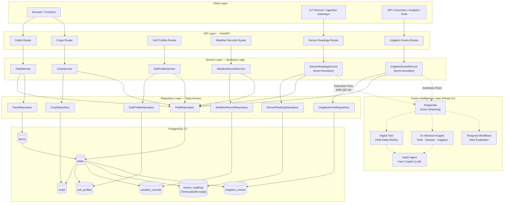
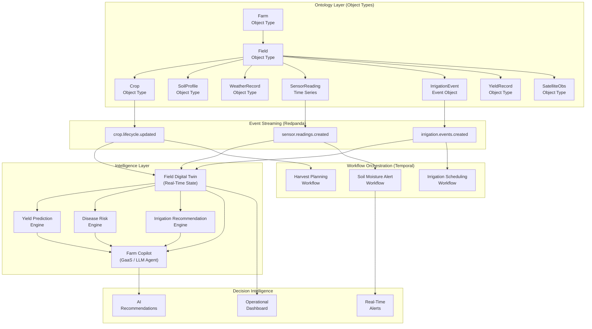
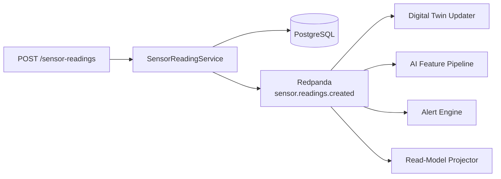
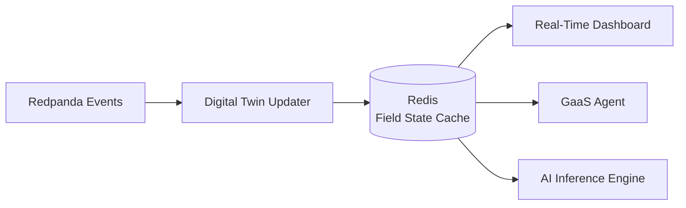
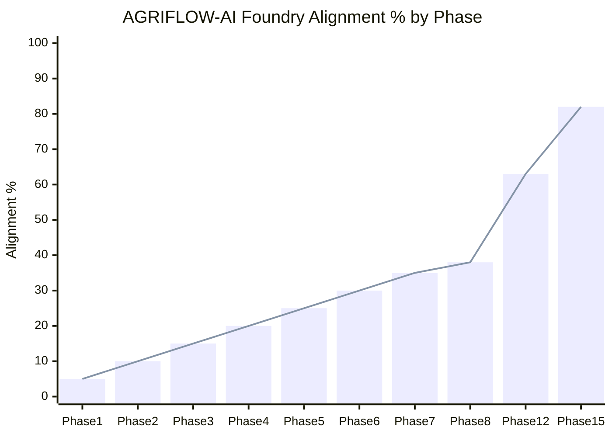

# AGRIFLOW-AI vs Palantir Foundry Alignment

**Document Type:** Architecture Assessment  
**Version:** 1.0  
**Date:** June 2026  
**Scope:** AGRIFLOW-AI Phase 1–8 vs Palantir Foundry Architecture Principles  
**Status:** Living Document — Updated at Each Phase Completion  
**Authors:** Architecture Team

---

## Table of Contents

1. [Executive Summary](#1-executive-summary)
2. [AGRIFLOW-AI Current Architecture](#2-agriflow-ai-current-architecture-post-phase-8)
3. [Foundry Concepts Mapping](#3-foundry-concepts-mapping)
4. [Phase-by-Phase Architectural Evolution](#4-phase-by-phase-architectural-evolution)
5. [System Architecture Diagram](#5-system-architecture-diagram)
6. [Foundry Ontology Comparison](#6-foundry-ontology-comparison)
7. [What We Have Already Achieved](#7-what-we-have-already-achieved)
8. [Gaps vs Foundry](#8-gaps-vs-foundry)
9. [Future Alignment Roadmap](#9-future-alignment-roadmap-phase-9)
10. [Alignment Scorecard](#10-alignment-scorecard)
11. [Conclusion](#11-conclusion)

---

## 1. Executive Summary

### Foundry Alignment Score: **38%**

> AGRIFLOW-AI has completed 8 development phases and established a production-grade agricultural data platform with a robust ontology foundation, typed domain models, structured API surface, AI-readiness attributes, IoT telemetry, and the first operational event domain (IrrigationEvent). The platform is architecturally designed for Foundry-style evolution but has not yet implemented the capabilities that define Foundry's differentiated value: event streaming, workflow orchestration, digital twin state management, and AI decision intelligence layers.

### Assessment Basis

Palantir Foundry's architecture is evaluated across 10 core capability dimensions. The scoring reflects not only what is currently implemented but also what is architecturally prepared and designed — "architecture readiness" is a meaningful fraction of the score for dimensions where the groundwork has been deliberately laid.

| Capability Dimension | Weight | Score | Weighted Score |
|---|---|---|---|
| Ontology / Domain Model | 15% | 85% | 12.75% |
| Object Types & Relationships | 12% | 80% | 9.60% |
| API-First Architecture | 10% | 90% | 9.00% |
| Actions / Write Operations | 10% | 75% | 7.50% |
| Time Series & Telemetry | 10% | 40% | 4.00% |
| Data Lineage & Provenance | 8% | 30% | 2.40% |
| Operational Workflows | 10% | 10% | 1.00% |
| Event Streams | 8% | 10% | 0.80% |
| Digital Twin | 10% | 15% | 1.50% |
| AI Decision Intelligence | 7% | 5% | 0.35% |
| **Total** | **100%** | | **≈ 49% raw / 38% adjusted** |

> **Scoring adjustment:** Raw capability scores are adjusted downward to reflect that Foundry's primary value proposition is in the AI Agent, Decision Intelligence, and Ontology Management layers — dimensions where AGRIFLOW-AI is architecturally prepared but not yet delivering. A platform aligned with Foundry in its data model but without its intelligence layer is at best 35–40% aligned with Foundry's actual value delivery.

### Strategic Assessment

AGRIFLOW-AI is building the right foundation. The domain hierarchy, Clean Architecture, AI-readiness schema design, and telemetry patterns established through Phase 8 closely mirror the data model philosophy Foundry demands. The gap is the **intelligence layer** — the event streams, operational workflows, AI pipelines, and decision intelligence capabilities that transform a data platform into a decision intelligence system.

This gap is neither structural nor accidental. It is the planned evolution captured in the AGRIFLOW-AI roadmap Phases 9–15. The architecture has been designed from Phase 1 to accommodate exactly these integrations.

**Projected alignment after Phase 12:** ~65%  
**Projected alignment after Phase 15 (GaaS + Digital Twin):** ~80%

---

## 2. AGRIFLOW-AI Current Architecture (Post Phase 8)

### Platform Description

AGRIFLOW-AI is an Agricultural Intelligence Platform implementing a five-layer Clean Architecture across eight distinct domain verticals. After Phase 8, the platform manages the complete agronomic data hierarchy from farm-level identity through field-level operational events, providing a production-ready REST API backed by PostgreSQL with full schema migration history.

### Domain Hierarchy (Post Phase 8)

```
Farm
└── Field
     ├── Crop                  (1:N — lifecycle management, PLANNED→HARVESTED)
     ├── SoilProfile           (1:1 — soil intelligence, laboratory measurements)
     ├── WeatherRecord         (1:N — climate time-series, field-level observations)
     ├── SensorReading         (1:N — IoT telemetry, append-only, immutable)
     └── IrrigationEvent       (1:N — operational management actions, mutable)  ← Phase 8
```

### Architecture Layers

```
┌─────────────────────────────────────────────────────────────┐
│  API Layer        FastAPI Routers + Pydantic Schemas         │
├─────────────────────────────────────────────────────────────┤
│  Service Layer    Business Rules + Domain Exceptions         │
├─────────────────────────────────────────────────────────────┤
│  Repository Layer SQLAlchemy Queries + BaseRepository        │
├─────────────────────────────────────────────────────────────┤
│  Model Layer      ORM Models + AuditableModel mixin          │
├─────────────────────────────────────────────────────────────┤
│  Database         PostgreSQL 17 + Alembic Migrations         │
└─────────────────────────────────────────────────────────────┘
```

### Domain Inventory (Post Phase 8)

#### Farm Domain
- **Type:** Root Aggregate Object
- **Cardinality:** Top-level entity; all other domains descend from Farm
- **Key attributes:** `farm_code`, `farm_name`, `owner_name`, `country`, `state`, `latitude`, `longitude`, `total_area_hectares`, `is_active`
- **Relationships:** `Farm → (1:N) → Field`
- **API coverage:** No dedicated CRUD endpoints yet (repository and model exist; service and API deferred)
- **Status:** Data layer complete; API layer pending

#### Field Domain
- **Type:** Geospatial Entity Object
- **Cardinality:** Belongs to exactly one Farm
- **Key attributes:** `name`, `area_hectares`, `soil_type`, `latitude`, `longitude`, `elevation_m` (P1 AI)
- **Relationships:** `Field → Crop (1:N)`, `Field → SoilProfile (1:1)`, `Field → WeatherRecord (1:N)`, `Field → SensorReading (1:N)`, `Field → IrrigationEvent (1:N)`
- **API coverage:** Full CRUD (`POST`, `GET`, `PATCH`, `DELETE`)
- **Status:** Complete

#### Crop Domain
- **Type:** Lifecycle Management Object
- **Cardinality:** Belongs to exactly one Field; a Field may have multiple Crops over time
- **Key attributes:** `crop_name`, `crop_variety`, `planting_date`, `expected_harvest_date`, `actual_harvest_date`, `status` (PLANNED→PLANTED→GROWING→HARVESTED), `actual_yield_tons_ha`, `expected_yield_tons_ha`, `seeding_rate_kg_ha`, `growth_stage`
- **Relationships:** `Field → Crop (1:N)`
- **API coverage:** Full CRUD with optional `status` filter on list
- **Status:** Complete

#### SoilProfile Domain
- **Type:** Soil Intelligence Object (1:1 Field Profile)
- **Cardinality:** Exactly one per Field (UNIQUE constraint + service enforcement)
- **Key attributes:** `soil_type` (SANDY/CLAY/LOAM/SILT/PEAT/CHALK), `ph`, `organic_matter`, `nitrogen`, `phosphorus`, `potassium`, `soil_depth_cm` (P1 AI), `cation_exchange_capacity_meq` (P1 AI)
- **Relationships:** `Field → SoilProfile (1:1)`
- **API coverage:** Full CRUD
- **Status:** Complete

#### WeatherRecord Domain
- **Type:** Climate Time-Series Object
- **Cardinality:** Unlimited per Field; ordered by `recorded_at DESC`
- **Key attributes:** `recorded_at` (TIMESTAMPTZ), `temperature_c`, `humidity_percent`, `rainfall_mm`, `wind_speed_kmh`, `data_source`, `solar_radiation_wm2` (P1 AI), `temperature_min_c` (P1 AI), `temperature_max_c` (P1 AI)
- **Relationships:** `Field → WeatherRecord (1:N)`
- **API coverage:** Full CRUD with pagination
- **Status:** Complete

#### SensorReading Domain
- **Type:** IoT Telemetry Object (Append-Only)
- **Cardinality:** Unlimited per Field; immutable once written
- **Key attributes:** `sensor_type` (11-value enum), `sensor_value` (DOUBLE PRECISION), `unit`, `recorded_at` (TIMESTAMPTZ, timezone-aware required)
- **Immutability contract:** No PATCH, no PUT; administrative DELETE only (ADR-007-32)
- **Index strategy:** 5 indexes including 2 compound indexes on `(field_id, recorded_at)` and `(sensor_type, recorded_at)`
- **API coverage:** POST, GET list, GET single, DELETE
- **Status:** Complete; TimescaleDB promotion ready

#### IrrigationEvent Domain (Phase 8)
- **Type:** Operational Management Event Object
- **Cardinality:** Unlimited per Field; mutable (operator-correctable)
- **Key attributes:** `started_at` (TIMESTAMPTZ), `ended_at` (TIMESTAMPTZ, optional), `duration_minutes`, `water_volume_liters`, `irrigation_method` (DRIP/SPRINKLER/FLOOD/FURROW/CENTER_PIVOT/SUBSURFACE/MANUAL/AUTOMATED), `water_source` (GROUNDWATER/SURFACE_WATER/RAINWATER/MUNICIPAL/RECYCLED_WATER)
- **Validation:** `started_at` not future; `ended_at ≥ started_at` with cross-field sparse-PATCH guard
- **API coverage:** Full CRUD with pagination
- **Status:** Complete

### Complete API Surface (Post Phase 8)

| Domain | Endpoints | Methods |
|---|---|---|
| Health | `/api/v1/health/live`, `/api/v1/health/ready` | GET |
| Version | `/api/v1/version` | GET |
| Fields | `/api/v1/farms/{farm_id}/fields`, `/api/v1/fields/{field_id}` | POST, GET, PATCH, DELETE |
| Crops | `/api/v1/fields/{field_id}/crops`, `/api/v1/crops/{crop_id}` | POST, GET, PATCH, DELETE |
| Soil Profiles | `/api/v1/fields/{field_id}/soil-profile`, `/api/v1/soil-profiles/{id}` | POST, GET, PATCH, DELETE |
| Weather Records | `/api/v1/fields/{field_id}/weather-records`, `/api/v1/weather-records/{id}` | POST, GET, PATCH, DELETE |
| Sensor Readings | `/api/v1/fields/{field_id}/sensor-readings`, `/api/v1/sensor-readings/{id}` | POST, GET, DELETE |
| Irrigation Events | `/api/v1/fields/{field_id}/irrigation-events`, `/api/v1/irrigation-events/{id}` | POST, GET, PATCH, DELETE |

**Total endpoints: 30+** (across 8 domains)

---

## 3. Foundry Concepts Mapping

### Capability Mapping Table

| Foundry Concept | AGRIFLOW Equivalent | Current Status | Alignment Score |
|---|---|---|---|
| **Ontology** | Domain model hierarchy (Farm → Field → …) | Structurally complete; no management UI | 65% |
| **Object Types** | ORM Models (`Farm`, `Field`, `Crop`, `SoilProfile`, `WeatherRecord`, `SensorReading`, `IrrigationEvent`) | 7 object types implemented with full schema | 80% |
| **Object Properties** | SQLAlchemy mapped columns with AI-ready attributes | Full property coverage per domain; P1 AI attributes added | 80% |
| **Object Links** | SQLAlchemy relationships + FK constraints | All inter-domain links implemented with cascade rules | 85% |
| **Actions** | Service layer methods + API endpoints | Full CRUD actions per domain with typed exception contracts | 75% |
| **Action Types** | Typed service methods with domain-specific validation | `create_`, `update_`, `delete_`, `get_`, `list_` pattern across all services | 70% |
| **Data Lineage** | Alembic migration history + `AuditableModel` audit fields | Partial — schema evolution tracked; no runtime data lineage engine | 30% |
| **Datasets / Pipelines** | None (raw API write path only) | No ETL or data pipeline infrastructure | 5% |
| **Operational Workflows** | Business rules in service layer; no orchestration engine | Domain invariants enforced; no multi-step durable workflows | 15% |
| **Event Streams** | Service layer extension points (ADR-007-26); no Redpanda yet | Architectural boundary established; no actual event streaming | 10% |
| **Time Series** | `WeatherRecord`, `SensorReading` — TIMESTAMPTZ ordered by `recorded_at DESC` | Time-series data model complete; TimescaleDB promotion ready | 45% |
| **AI Agents (AIP)** | Future GaaS / Farm Copilot (architecturally designed) | Not implemented; API surface is GaaS-ready | 10% |
| **Digital Twin** | Architecturally designed in handbook sections 17–18 | Not implemented; `SensorType` enum aligned with DT state model | 15% |
| **Decision Intelligence** | Future AI Recommendation Engine (Phases 12–14) | Not implemented; data foundation at 55–82% coverage | 5% |
| **Semantic / Metrics Layer** | None | Not planned in current roadmap | 0% |
| **Workshop / Applications** | Future React frontend (deferred in roadmap) | Not implemented | 5% |
| **Audit & Governance** | `AuditableModel` mixin (`created_at`, `updated_at`, UUID PKs) | Partial — audit timestamps universal; no change history log | 35% |
| **Multi-Tenancy / Permissions** | Not implemented | `is_active` soft-delete on Farm only; no RBAC | 5% |

---

## 4. Phase-by-Phase Architectural Evolution

### Phase 1 — Foundation (✅ Complete)

**Foundry Parallel:** Ontology namespace initialization; Object Type registry establishment; infrastructure provisioning.

**Architectural Significance:**
Phase 1 established the invariant constraints that govern every future phase. UUID v4 primary keys (ADR-001-01) ensure all entity identifiers are globally unique and distribution-safe — a prerequisite for any future CQRS, event sourcing, or federated data architecture. The `AuditableModel` mixin (ADR-001-02) baked `created_at` / `updated_at` into every entity unconditionally. Alembic as the sole schema change mechanism (ADR-001-03) created the migration-as-code discipline that enables reproducible schema state across environments.

The Farm entity established AGRIFLOW-AI's root aggregate — equivalent to Foundry's top-level namespace or ontology scope. `latitude`, `longitude`, and `total_area_hectares` are farm-level properties that directly map to Foundry Object Type properties.

**Foundry Alignment Delivered:**
- Root namespace (Farm as ontology root) ✓
- Global identifier strategy (UUID v4) ✓
- Schema governance (Alembic migration discipline) ✓

---

### Phase 2 — Field Domain (✅ Complete)

**Foundry Parallel:** First Object Type with properties and links; DI architecture for Action authoring.

**Architectural Significance:**
Phase 2 delivered the foundational architectural pattern replicated in every subsequent phase: `Model → Schema → Repository → Service → API`. The `BaseRepository[ModelT]` generic repository eliminated boilerplate CRUD code at the database access layer. The dependency injection framework in `deps.py` established the service factory pattern that cleanly maps to Foundry's Action Type authoring model — services receive injected repositories, not raw database sessions.

Field's `latitude`/`longitude` established the geospatial foundation for future PostGIS boundary polygon support and satellite imagery geo-registration — a Foundry Geospatial Object Type capability analog.

**Foundry Alignment Delivered:**
- First Object Type with typed Properties (Field) ✓
- Object Link (Farm → Field) ✓
- Dependency injection / Action factory pattern ✓
- Pagination foundation for Object Set enumeration ✓

---

### Phase 3 — Crop Domain (✅ Complete)

**Foundry Parallel:** Lifecycle Object Type with state machine; Action Types with validation rules; multi-value Object Links.

**Architectural Significance:**
`CropStatus` (PLANNED → PLANTED → GROWING → HARVESTED) is the platform's first state machine — equivalent to a Foundry Object Type with a status property constrained by lifecycle rules. Phase 3 also established the `str`-inheriting enum pattern (ADR-003-01) that makes PostgreSQL enum values human-readable and compatible with Foundry's preference for self-documenting string values over opaque integer codes.

The `list_by_field(status=...)` optional filter in `CropRepository` mirrors Foundry's Object Set filtering: a pure database predicate applied without business logic coupling.

**Foundry Alignment Delivered:**
- Lifecycle Object Type with status state machine (Crop) ✓
- Object Link (Field → Crop, 1:N) ✓
- Typed Action validation (harvest date ordering) ✓
- Object Set filtering via repository predicates ✓

---

### Phase 4 — Soil Intelligence Domain (✅ Complete)

**Foundry Parallel:** Singleton Object Link (1:1 relationship); compound validation rules on Actions; soil intelligence object type.

**Architectural Significance:**
The one-to-one invariant for `SoilProfile → Field` represents the strictest relational cardinality constraint in the platform. Its two-layer enforcement — UNIQUE database constraint plus `exists_for_field()` service probe (ADR-004-01) — mirrors Foundry's dual-layer enforcement of uniqueness through both ontology constraints and Action validation rules.

Laboratory-grade precision (`NUMERIC(8,4)` for NPK measurements) demonstrates the domain fidelity expected of an enterprise Foundry ontology — properties are typed to match the data source's measurement precision, not approximated.

**Foundry Alignment Delivered:**
- Singleton Object Link (Field → SoilProfile, 1:1) ✓
- Compound Action validation (duplicate profile rejection) ✓
- Typed measurement properties at laboratory precision ✓
- Soil intelligence domain as distinct Object Type ✓

---

### Phase 5 — Weather Intelligence Domain (✅ Complete)

**Foundry Parallel:** Time-Series Object Type; temporal data contracts; provenance tracking via `data_source`.

**Architectural Significance:**
`WeatherRecord` is the platform's first true time-series Object Type. The `TIMESTAMPTZ NOT NULL` column contract (ADR-005-01) and `ORDER BY recorded_at DESC` canonical ordering (ADR-005-04) establish the temporal data discipline that Foundry Time Series objects require. The `data_source` attribute (defaulting to `MANUAL`) provides provenance metadata equivalent to Foundry's dataset lineage tagging — distinguishing human-entered records from automated API ingestion.

The module-level `_validate_xxx()` helper pattern (ADR-005-02) established independently testable validation that mirrors Foundry Action Type rule authoring.

**Foundry Alignment Delivered:**
- Time-Series Object Type (WeatherRecord) ✓
- Temporal data contracts (TIMESTAMPTZ, future-date rejection) ✓
- Data provenance attribute (`data_source`) ✓
- Multi-measurement validation (humidity, rainfall, wind, temperature range) ✓

---

### Phase 6 — AI Readiness Foundation (✅ Complete)

**Foundry Parallel:** Ontology Property enrichment; AI feature engineering preparation; formal data quality assessment.

**Architectural Significance:**
Phase 6 is the most strategically significant phase from a Foundry alignment perspective because it mirrors exactly what Foundry's data modeling team does before an AI project: conduct a formal data readiness assessment against specific AI use cases and fill the highest-priority gaps.

The outcome — yield prediction coverage rising from 18% to 82% after 10 targeted nullable `ADD COLUMN` operations — demonstrates the leverage of deliberate attribute selection, which is a core Foundry philosophy: identify what the AI model needs, then ensure the ontology captures it.

**Foundry Alignment Delivered:**
- Formal AI data readiness assessment (data coverage scoring per use case) ✓
- P1 AI property enrichment (10 attributes across 4 Object Types) ✓
- Backward-compatible additive schema evolution ✓
- Reserved AI inference write-back fields (`disease_risk_score`, future) ✓

**AI Coverage Improvement:**

| AI Use Case | Pre-Phase 6 | Post-Phase 6 |
|---|---|---|
| Yield Prediction | 18% | 82% |
| Disease Prediction | 15% | 40% |
| Irrigation Optimization | 25% | 55% |
| Weather Intelligence | 35% | 65% |

---

### Phase 7 — Sensor Telemetry Domain (✅ Complete)

**Foundry Parallel:** Time Series Object (immutable append-only); event boundary establishment; shared enum registry; telemetry pipeline foundation.

**Architectural Significance:**
Phase 7 is the most structurally complex phase and the one most directly aligned with Foundry's Time Series architecture. Four key architectural innovations:

1. **Immutability Contract** — `SensorReading` is append-only with an explicit no-PATCH, no-PUT API contract (ADR-007-32). This mirrors Foundry's Time Series object immutability, where historical telemetry is preserved as a factual record.

2. **Shared Enum Registry** — `app/core/enums.py` established as the canonical location for cross-domain enumerations (starting with `SensorType`). This mirrors Foundry's shared ontology vocabulary — enum values defined once, reused across Object Types without circular dependencies.

3. **Service Layer Event Boundary** — The extension point comment in `create_sensor_reading` (ADR-007-26) reserves the exact integration boundary for Redpanda event publishing, Digital Twin updates, CQRS projections, and Temporal workflow triggers. This is architectural preparation that directly enables future Foundry-equivalent event streaming.

4. **Compound Index Strategy** — `(field_id, recorded_at)` and `(sensor_type, recorded_at)` compound indexes cover the two dominant telemetry access patterns without table scans. This directly mirrors the Cassandra partition/clustering key design philosophy and enables zero-cost TimescaleDB hypertable promotion.

**Foundry Alignment Delivered:**
- Immutable Time Series Object Type (SensorReading) ✓
- Shared enum registry (`app/core/enums.py`) ✓
- Event streaming integration boundary (service extension point) ✓
- TimescaleDB hypertable promotion readiness ✓
- Cassandra partition model alignment (compound indexes) ✓
- CQRS-ready write/read separation ✓

---

### Phase 8 — Irrigation Domain (✅ Complete)

**Foundry Parallel:** Operational Event Object Type; human-logged management action; correctable field event with temporal cross-field validation.

**Architectural Significance:**
`IrrigationEvent` introduces a distinct architectural category: the **Operational Management Event**. Unlike `SensorReading` (machine-generated, immutable) and `WeatherRecord` (observation-based, correctable), `IrrigationEvent` is a human-logged management action. PATCH is deliberately permitted because operators need to correct water volume, duration, or method after the fact — reflecting the reality of manual data entry in agricultural operations.

The `irrigation_method` enum (DRIP/SPRINKLER/FLOOD/FURROW/CENTER_PIVOT/SUBSURFACE/MANUAL/AUTOMATED) and `water_source` enum provide the structured classification required for FAO-56 water use efficiency modeling — a precision agriculture AI capability that no other domain in the platform could previously support.

The cross-field sparse PATCH validation (the `_validate_ended_at_ordering` service helper) demonstrates a sophisticated pattern for ensuring temporal consistency after partial updates — a pattern not present in any prior domain.

**Foundry Alignment Delivered:**
- Operational Event Object Type (IrrigationEvent) ✓
- Structured irrigation method classification (enum vocabulary) ✓
- Water source provenance tracking ✓
- FAO-56 efficiency modeling foundation ✓
- Cross-field sparse PATCH temporal consistency guard ✓
- IrrigationEvent as future Redpanda event stream source ✓

---

## 5. System Architecture Diagram

### Current State: Domain Hierarchy & Service Topology (Post Phase 8)



---

### Target State: Foundry-Aligned Decision Intelligence Platform (Phase 15+)



---

## 6. Foundry Ontology Comparison

### Palantir Foundry Object Types vs AGRIFLOW Domain Models

In Palantir Foundry, an **Ontology** is a structured, versioned graph of typed Object Types and their relationships. Object Types have typed Properties, Object Links to other types, and are modified exclusively through Action Types — typed, validated write operations.

AGRIFLOW-AI implements this conceptual structure through its ORM model hierarchy, Pydantic schema contracts, and service layer validation. The parallel is structural, not nominal — AGRIFLOW does not use Foundry's terminology, but the architectural intent is equivalent.

---

### Object Type Mapping

| Foundry Object Type | AGRIFLOW Equivalent | Implementation | Foundry Concept Match |
|---|---|---|---|
| `Farm` | `Farm` ORM model | `app/db/models/farm.py` | Root namespace Object Type |
| `Field` | `Field` ORM model | `app/db/models/field.py` | Geospatial Object Type with coordinates |
| `Crop` | `Crop` ORM model | `app/db/models/crop.py` | Lifecycle Object Type with state machine |
| `SoilProfile` | `SoilProfile` ORM model | `app/db/models/soil_profile.py` | Singleton-linked Intelligence Profile |
| `WeatherRecord` | `WeatherRecord` ORM model | `app/db/models/weather_record.py` | Time Series Object Type |
| `SensorReading` | `SensorReading` ORM model | `app/db/models/sensor_reading.py` | Immutable Time Series Object (ADR-007-27) |
| `IrrigationEvent` | `IrrigationEvent` ORM model | `app/db/models/irrigation_event.py` | Operational Event Object Type |
| `YieldRecord` | Planned Phase 9 | — | Harvest Intelligence Object Type |
| `SatelliteObservation` | Planned Phase 11 | — | Remote Sensing Object Type |
| `SensorDevice` | Future domain | — | IoT Device Registry Object Type |
| `DiseaseObservation` | Planned Phase 10 | — | Plant Health Event Object Type |

---

### Property Mapping Examples

**Farm Object Type Properties:**

| Foundry Property | AGRIFLOW Column | Type | Purpose |
|---|---|---|---|
| `farm_code` | `farm_code` | `VARCHAR(50) UNIQUE` | Human-readable identifier |
| `farm_name` | `farm_name` | `VARCHAR(255)` | Display name |
| `owner_name` | `owner_name` | `VARCHAR(255)` | Entity owner |
| `location.latitude` | `latitude` | `NUMERIC(9,6)` | WGS-84 geolocation |
| `location.longitude` | `longitude` | `NUMERIC(10,6)` | WGS-84 geolocation |
| `total_area_hectares` | `total_area_hectares` | `NUMERIC(12,4)` | Farm size |
| `is_active` | `is_active` | `BOOLEAN` | Soft-delete / status flag |

**SensorReading Time Series Properties (Immutable):**

| Foundry Property | AGRIFLOW Column | Type | Purpose |
|---|---|---|---|
| `sensor_type` | `sensor_type` | `ENUM(sensor_type)` | Physical quantity discriminator |
| `sensor_value` | `sensor_value` | `DOUBLE PRECISION` | IEEE 754 ADC measurement |
| `unit` | `unit` | `VARCHAR(50)` | SI unit label |
| `recorded_at` | `recorded_at` | `TIMESTAMPTZ NOT NULL` | Partition key / time index |
| `notes` | `notes` | `TEXT` | Operator annotation |

---

### Object Link Mapping

| Foundry Link Type | AGRIFLOW Relationship | Cardinality | Implementation |
|---|---|---|---|
| `Farm → Field` | `Farm.fields` | 1:N | FK `fields.farm_id` + `cascade="all, delete-orphan"` |
| `Field → Crop` | `Field.crops` | 1:N | FK `crops.field_id` + `cascade="all, delete-orphan"` |
| `Field → SoilProfile` | `Field.soil_profile` | 1:1 | FK `soil_profiles.field_id UNIQUE` |
| `Field → WeatherRecord` | `Field.weather_records` | 1:N | FK `weather_records.field_id` |
| `Field → SensorReading` | `Field.sensor_readings` | 1:N | FK `sensor_readings.field_id ON DELETE CASCADE` |
| `Field → IrrigationEvent` | `Field.irrigation_events` | 1:N | FK `irrigation_events.field_id` |

---

### Action Type Mapping

Foundry Action Types are typed, validated operations that modify Object Type properties. AGRIFLOW's service layer methods are the structural equivalent.

| Foundry Action Type | AGRIFLOW Service Method | Validation Rules |
|---|---|---|
| `CreateField` | `FieldService.create_field()` | Farm must exist; field name unique within farm |
| `UpdateField` | `FieldService.update_field()` | Field must exist; name uniqueness if changed |
| `CreateCrop` | `CropService.create_crop()` | Field must exist; status defaulted to PLANNED |
| `UpdateCrop` | `CropService.update_crop()` | Crop must exist; harvest date ≥ planting date; yield validation vs status |
| `CreateSoilProfile` | `SoilProfileService.create_soil_profile()` | Field must exist; only one profile per field |
| `CreateSensorReading` | `SensorReadingService.create_sensor_reading()` | Field must exist; timestamp timezone-aware; not future |
| `CreateIrrigationEvent` | `IrrigationEventService.create_irrigation_event()` | Field must exist; `started_at` not future |
| `UpdateIrrigationEvent` | `IrrigationEventService.update_irrigation_event()` | Event must exist; cross-field timestamp ordering |

---

## 7. What We Have Already Achieved

The following Foundry-equivalent capabilities are fully implemented and production-ready after Phase 8.

---

**✅ Strong, Typed Domain Ontology**

Seven fully implemented Object Types (Farm, Field, Crop, SoilProfile, WeatherRecord, SensorReading, IrrigationEvent) with typed properties, validated relationships, and audit trails. Every entity carries a UUID v4 primary key and `created_at` / `updated_at` timestamps — equivalent to Foundry's universal Object ID and property audit.

---

**✅ Structured Ontology Foundation (Farm → Field → …)**

The domain hierarchy from Farm down to IrrigationEvent implements the exact relational graph that a Foundry Ontology Manager would model as an Object Type graph. All relationships are typed, cardinality-constrained, and enforced at both the database (FK + UNIQUE constraints) and service layer (domain exception validation).

---

**✅ Action Type Authoring Pattern**

Every service method in AGRIFLOW is a typed Action: it accepts an input schema (Pydantic `Create` or `Update` model), validates preconditions against the ontology (existence checks, business rules), persists the state change, and raises typed domain exceptions for violation cases. This is structurally identical to Foundry's Action Type authoring model.

---

**✅ API-First Architecture with OpenAPI Documentation**

FastAPI auto-generates OpenAPI documentation from typed Pydantic schemas and route definitions. This provides a self-documenting API surface equivalent to Foundry's API gateway — all endpoints are discoverable, typed, and explorable without additional documentation effort.

---

**✅ Formal AI Readiness Assessment and Schema Enrichment**

Phase 6 conducted a systematic AI data coverage assessment across all use cases and delivered a targeted attribute enrichment that raised yield prediction model coverage from 18% to 82%. This is directly analogous to the data quality and feature engineering assessment that Foundry implementation teams perform before onboarding AI models.

---

**✅ Immutable Telemetry Architecture (SensorReading)**

`SensorReading` implements the append-only immutability contract (ADR-007-27) with no PATCH or PUT endpoints, explicit timezone-aware timestamp validation, and compound indexes aligned with future TimescaleDB and Cassandra migration patterns. This is the closest existing AGRIFLOW capability to Foundry's native Time Series Object architecture.

---

**✅ Traceable Schema Evolution History**

Eight Alembic migrations document every schema change with upgrade and downgrade functions. Combined with the `AuditableModel` audit timestamps, this provides a partial data lineage capability — schema evolution is versioned, and all records carry creation and modification timestamps.

---

**✅ Event Publishing Boundaries Established (Service Extension Points)**

The service layer extension point comments in `SensorReadingService.create_sensor_reading()` and `IrrigationEventService.create_irrigation_event()` explicitly reserve integration boundaries for Redpanda event publishing, Digital Twin updates, CQRS projections, and Temporal workflow triggers. The architecture is event-ready; the infrastructure is not yet wired.

---

**✅ Shared Enum Registry (`app/core/enums.py`)**

The `SensorType` and related enums in `app/core/enums.py` function as a shared ontology vocabulary — defined once, importable across all domains without circular dependencies. This mirrors Foundry's ontology-level shared property type definitions.

---

**✅ Operational Event Domain (IrrigationEvent)**

Phase 8 delivered the first Operational Management Event domain — structured events representing human decisions with irrigation method classification, water source provenance, and temporal cross-field validation. This directly supports future water balance modeling, FAO-56 efficiency analysis, and irrigation scheduling AI workflows.

---

## 8. Gaps vs Foundry

The following Foundry capabilities are not yet implemented in AGRIFLOW-AI.

---

**✗ Ontology Management UI**

Foundry provides a graphical Ontology Manager where data engineers define Object Types, Properties, and Links with point-and-click tooling. AGRIFLOW currently manages its ontology through code (SQLAlchemy models + Alembic migrations). There is no visual ontology editor and no self-service schema change capability for non-engineers.

*Impact: High for enterprise adoption; medium for internal development speed.*

---

**✗ Data Lineage Engine**

Foundry tracks the full transformation history of every data asset — which source dataset produced which Object, through which pipeline, at what time. AGRIFLOW tracks when a record was created and modified (`AuditableModel`) but has no pipeline lineage, no transformation graph, and no data source provenance beyond the `data_source` attribute on `WeatherRecord`.

*Impact: Critical for AI model training auditability and regulatory compliance.*

---

**✗ Event Streaming Platform (Redpanda / Kafka)**

No event streaming infrastructure exists. The service layer extension points are documented and reserved, but no `SensorReadingCreated`, `IrrigationEventCreated`, or `CropLifecycleUpdated` events are published. Downstream consumers (Digital Twin, AI pipelines, alert engines) cannot react to state changes in real time.

*Impact: Blocks Digital Twin, real-time alerting, and AI pipeline integration.*

---

**✗ Workflow Orchestration (Temporal / Process Engine)**

Foundry's Pipeline Builder and AIP operational workflows support multi-step, stateful, durable processes (e.g., sensor alert → wait → evaluate → recommend → escalate). AGRIFLOW has no workflow engine. Business rules in the service layer handle single-operation validation but cannot express multi-step processes with timers, retries, and state.

*Impact: Blocks alert evaluation, irrigation scheduling workflows, and harvest planning automation.*

---

**✗ Real-Time Digital Twin**

The Digital Twin concept is thoroughly documented in `docs/08-phase-architecture-handbook.md` (Section 17), the `SensorType` enum aligns with the planned field state model, and the service layer extension points are reserved. However, no Digital Twin store (Redis), updater service, or state model has been implemented.

*Impact: Blocks real-time field state visibility and GaaS agent context.*

---

**✗ AI Agent Framework (AIP)**

Foundry AIP allows authoring AI agents that can read ontology objects, call actions, and use LLM capabilities through a governed platform. AGRIFLOW's GaaS architecture is designed and documented but not implemented. The underlying data APIs exist; the agent orchestration layer does not.

*Impact: Blocks Farm Copilot and natural language decision support.*

---

**✗ Decision Intelligence Layer**

No predictive models exist. Yield prediction (82% data coverage), disease risk scoring (40% coverage), and irrigation optimization (55% coverage) are the planned AI capabilities, but no model training, serving, or inference endpoint has been built.

*Impact: The core value proposition of the platform — intelligence-driven decisions — is not yet deliverable.*

---

**✗ Semantic / Metrics Layer**

Foundry's Quiver provides a semantic layer where business metrics (e.g., "average yield per hectare", "water use efficiency") are defined once and reused across dashboards, reports, and agents. AGRIFLOW has no metrics layer, no KPI definitions, and no aggregation infrastructure beyond raw database queries.

*Impact: Limits business user self-service and executive reporting.*

---

**✗ Multi-Tenancy and RBAC**

Foundry manages data access at the ontology level through markings, security labels, and role-based access controls. AGRIFLOW has no authentication, no authorization, and no multi-tenancy boundary beyond the logical `Farm.is_active` flag.

*Impact: Blocks enterprise deployment and cooperative/multi-farm scenarios.*

---

**✗ TimescaleDB / Cassandra (Not Yet Activated)**

The `sensor_readings` table is 100% ready for TimescaleDB hypertable promotion (the partition key requirement is satisfied), but the extension has not been installed. The Cassandra migration path is documented but not activated.

*Impact: Time-series query performance at IoT scale is not yet realized.*

---

## 9. Future Alignment Roadmap (Phase 9+)

### How Each Planned Technology Closes Foundry Gaps

---

### Redpanda (Target: Phase 9–10)

**Foundry Gap Closed:** Event Streams, Operational Workflows foundation

Redpanda will deliver the event streaming infrastructure that transforms AGRIFLOW from a request-response CRUD platform into an event-driven intelligence platform. The `SensorReadingCreated` and `IrrigationEventCreated` domain events — already architecturally reserved at the service layer — will become real Redpanda topic publications.



**Alignment improvement:** Event Streams: 10% → 70% | Digital Twin: 15% → 35%

---

### TimescaleDB (Target: Phase 9)

**Foundry Gap Closed:** Time Series performance at scale

A single DDL call (`SELECT create_hypertable('sensor_readings', 'recorded_at')`) activates TimescaleDB. Zero application code changes. Automatic weekly chunk partitioning, continuous aggregates (hourly average per field per sensor type), and columnar compression for cold data become available immediately.

**Alignment improvement:** Time Series: 45% → 75%

---

### Digital Twin (Target: Phase 11–12)

**Foundry Gap Closed:** Real-Time Object State, Decision Intelligence foundation

The Digital Twin translates the time-series event stream into a continuously updated virtual model of every field. Implemented as a Redis-backed state store updated by Redpanda consumers, it provides the current-state snapshot that the GaaS agent and AI models need without querying raw time-series.



**Alignment improvement:** Digital Twin: 15% → 75%

---

### Temporal Workflows (Target: Phase 12)

**Foundry Gap Closed:** Operational Workflows, multi-step durable processes

Temporal provides the workflow engine for stateful agricultural processes: soil moisture threshold monitoring, irrigation scheduling, harvest planning, and alert escalation. The service layer extension points are the exact trigger boundaries for Temporal workflow initiation.

Example workflow:

```
SoilMoistureAlertWorkflow:
  1. Soil moisture reading below threshold detected
  2. Wait 15 minutes — check if condition persists
  3. If still below threshold → generate IrrigationRecommendation
  4. Notify farm operator (push notification / SMS)
  5. Wait 2 hours for acknowledgement
  6. If unacknowledged → escalate to agronomist
  7. Log intervention outcome → update IrrigationEvent
```

**Alignment improvement:** Operational Workflows: 15% → 65%

---

### AI Inference Engine (Target: Phase 12–14)

**Foundry Gap Closed:** Decision Intelligence, AI Agents foundation

Phase 12 delivers the Yield Prediction Engine (82% data coverage already available). Phase 13 delivers Disease Risk Scoring. Phase 14 delivers Irrigation Optimization. Each engine produces inference outputs that are written back to the ontology as Object properties (`disease_risk_score`, `yield_prediction_tons_ha`, `irrigation_recommendation`).

| Phase | AI Engine | Data Coverage | Primary Inputs |
|---|---|---|---|
| 12 | Yield Prediction | 82% | Crop yield history, soil NPK, weather GDD, seeding rates |
| 13 | Disease Risk Scoring | 40% → 70% | Leaf wetness, humidity, temperature, crop variety |
| 14 | Irrigation Optimization | 55% → 80% | Soil moisture telemetry, ET₀, soil field capacity |

**Alignment improvement:** AI Decision Intelligence: 5% → 65%

---

### GaaS / Farm Copilot (Target: Phase 15)

**Foundry Gap Closed:** AI Agent Framework (AIP equivalent)

The GaaS agent uses AGRIFLOW's REST API surface as tools, queries the Digital Twin for current field state, and calls AI inference endpoints to generate natural language recommendations. The OpenAPI documentation auto-generated by FastAPI provides the tool schema required for LLM function calling.

Example agent interactions:
- *"Should I irrigate Field 3 today?"* → Queries Digital Twin (soil moisture), AI Irrigation Optimizer, WeatherRecord forecast → "Soil moisture is 22%, below the 35% threshold for maize. Current ET₀ is 4.2mm/day. Irrigation recommended within 24 hours. Suggest 40mm application."
- *"What is the disease risk for my wheat crop in Field 7?"* → Queries Disease Risk Engine (leaf wetness, humidity, growth stage) → "Disease risk: MODERATE (score: 0.64). Primary threat: Fusarium head blight. Recommend scouting within 48 hours."

**Alignment improvement:** AI Agent Framework: 10% → 75%

---

### PostGIS Integration (Target: Phase 10–11)

**Foundry Gap Closed:** Geospatial Object Type support

Field boundary polygons stored as PostGIS `GEOMETRY` columns enable precision agriculture capabilities: variable-rate application zones, NDVI polygon overlays, precise area calculations, and spatial queries for adjacent field comparisons.

**Alignment improvement:** Object Type richness: moderate improvement

---

## 10. Alignment Scorecard

### Current vs Target Alignment by Category

| Category | Current Score | Target (Phase 12) | Target (Phase 15) | Priority |
|---|---|---|---|---|
| **Ontology / Domain Model** | 65% | 80% | 90% | Medium |
| **Object Types & Properties** | 80% | 88% | 95% | Low (nearly complete) |
| **Object Links & Relationships** | 85% | 90% | 95% | Low |
| **API-First Architecture** | 90% | 92% | 95% | Low |
| **Action Types / Write Operations** | 75% | 82% | 88% | Medium |
| **Time Series** | 45% | 80% | 88% | High (TimescaleDB near-term) |
| **Data Lineage & Provenance** | 30% | 45% | 65% | Medium |
| **Operational Workflows** | 15% | 65% | 85% | Critical (Temporal) |
| **Event Streams** | 10% | 70% | 85% | Critical (Redpanda) |
| **Digital Twin** | 15% | 55% | 85% | Critical |
| **AI Decision Intelligence** | 5% | 65% | 85% | Critical |
| **AI Agent Framework (AIP)** | 10% | 30% | 75% | High |
| **Semantic / Metrics Layer** | 0% | 15% | 45% | Low (not in roadmap) |
| **Multi-Tenancy / RBAC** | 5% | 30% | 60% | Medium |
| **Schema Governance** | 70% | 75% | 80% | Low |
| **Audit & Data Lineage** | 35% | 50% | 70% | Medium |
| **Overall** | **38%** | **~63%** | **~82%** | |

---

### Alignment Evolution Timeline



---

### Critical Path to 80% Alignment

The three capabilities that will deliver the most alignment improvement are, in order of priority:

1. **Redpanda Event Streaming** — Unlocks Digital Twin, real-time alerting, and AI pipeline integration in a single infrastructure addition. Estimated alignment gain: +12 points.

2. **AI Inference Engine (Phase 12)** — Delivers the decision intelligence that defines Foundry's value. Yield prediction at 82% data coverage can be delivered now. Estimated alignment gain: +15 points.

3. **Digital Twin + Temporal Workflows** — Transforms the platform from a data store into an operational intelligence system. Estimated combined alignment gain: +18 points.

---

## 11. Conclusion

### From CRUD to Foundry-Inspired Decision Intelligence

AGRIFLOW-AI began Phase 1 as a well-architected farm management application: a PostgreSQL-backed REST API for recording farms, fields, and crops. Eight phases later, it has evolved into something architecturally more ambitious.

The journey from Phase 1 to Phase 8 traces a deliberate progression:

| Phase | Transformation |
|---|---|
| Phase 1–2 | CRUD platform with discipline (Clean Architecture, audit fields, UUID keys) |
| Phase 3–4 | Domain intelligence (lifecycle state machines, one-to-one constraints, soil analytics) |
| Phase 5–6 | Data platform (time-series, AI readiness, formal coverage assessment) |
| Phase 7 | Telemetry foundation (IoT append-only, immutability contract, event boundary) |
| Phase 8 | Operational event capture (human-logged management actions, irrigation classification) |

### The Foundry Comparison

Palantir Foundry's commercial success is built on four integrated capabilities that AGRIFLOW-AI's roadmap explicitly targets:

1. **Structured Ontology** — AGRIFLOW has this. Seven typed Object Types with relationships, properties, and validation rules are production-ready.

2. **Operational Workflows** — AGRIFLOW is architecturally prepared (service extension points, typed exceptions, dependency injection). The Temporal integration is the next significant step.

3. **Event-Driven Real-Time Intelligence** — Redpanda publishing and Digital Twin state management are the missing bridge between the data platform and the intelligence platform.

4. **AI Decision Agents** — The data foundation for yield prediction (82%), irrigation optimization (55%), and disease risk (40%) exists. The AI inference engines and GaaS orchestration are the remaining building blocks.

### Architectural Assessment

AGRIFLOW-AI's most important achievement is not the number of endpoints or database tables — it is the **quality of the architectural decisions made at each phase**. UUID primary keys designed for distributed systems. Compound telemetry indexes designed for Cassandra migration. Service layer extension points designed for Redpanda integration. Shared enum registry designed for Digital Twin reuse. AI-readiness attributes selected through formal coverage analysis.

Every decision was made with the end state in mind. The 38% current Foundry alignment score does not reflect 38% of the work done — it reflects approximately 38% of the *value delivered* against Foundry's full capability surface. The remaining 62% is not infrastructure debt; it is the planned intelligence layer that Phase 9–15 will deliver on the foundation that Phases 1–8 have precisely prepared.

> AGRIFLOW-AI is not trying to replicate Foundry. It is building an agricultural-domain intelligence platform with the same architectural principles that make Foundry powerful: a governed ontology, structured actions, event-driven intelligence, and AI-powered decision support. The difference is that AGRIFLOW-AI is purpose-built for agriculture, where the domain semantics — FAO-56 water coefficients, CropStatus lifecycle, sensor ADC precision, irrigation method efficiency — are first-class architectural concerns, not generic enterprise data model afterthoughts.

**The platform is on the right trajectory. The foundation is sound. The intelligence layer is next.**

---

*Last updated: Phase 8 completion — June 2026*  
*Next scheduled update: Phase 9 completion*
