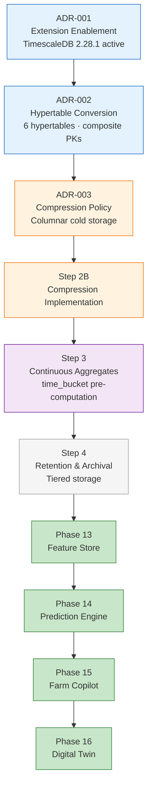

# ADR-003 — TimescaleDB Compression Policy Strategy

**Status:** Approved  
**Date:** 2026-06-29  
**Phase:** 12 — TimescaleDB Time-Series Foundation  
**Step:** 2A (Assessment) → 2B (Implementation Authorized)  
**Decision Makers:** Senior Platform Architecture  
**Governance Reference:** `PHASE12_DECISION_REGISTER.md` P12-D010

### Decision Status Metadata

| Attribute | Value |
|---|---|
| Decision ID | ADR-003 |
| Status | Approved |
| Implementation Status | Pending Step 2B |
| Effective Date | Upon successful Step 2B implementation |
| Owner | Platform Architecture |
| Review After | Step 2C Validation |
| Depends On | ADR-001, ADR-002 |
| Enables | Step 2B, Step 3, Step 4, Phases 13–16 |

---

## Related ADRs

| ADR | Title | Relationship |
|---|---|---|
| ADR-001 | TimescaleDB Extension Enablement | Prerequisite — TimescaleDB 2.28.1 active in the `agriflow` database. |
| ADR-002 | Hypertable Primary Key & Conversion Strategy | Prerequisite — six hypertables operational with composite primary keys (migration `c9d8e7f6a5b4`). ADR-003 depends on ADR-002 having been executed. |

---

## 1. Executive Summary

Following successful hypertable implementation under ADR-002, the next architectural optimization in the Phase 12 TimescaleDB stack is **native columnar compression** on cold hypertable chunks.

ADR-002 established time partitioning and chunk exclusion — solving query scalability for time-window workloads. Compression addresses **storage scalability**: IoT telemetry, weather, and satellite data accumulate at rates that make uncompressed multi-year retention economically unsustainable without tiered storage.

This ADR formalises the approved compression strategy documented in `PHASE12_STEP2A_COMPRESSION_ARCHITECTURE_ASSESSMENT.md`. The objective is to:

- **Reduce storage** — achieve 10–30× compression on cold IoT and satellite chunks, containing primary database growth at production scale.
- **Preserve historical AI datasets** — retain full multi-season archives required by the Feature Store, Prediction Engine, and Digital Twin without prohibitive storage cost.
- **Maintain transparent application access** — compression is a persistence-layer concern; repositories, services, and APIs require zero changes.
- **Prepare for Continuous Aggregates (Step 3)** — compression on cold raw data reduces I/O for aggregate refresh jobs and establishes the storage foundation that Step 3 and Step 4 build upon.

**ADR-003 authorises Step 2B implementation** — compression policy activation via Alembic migration, subject to the constraints recorded in this document.

---

## 2. Context

### Current Architecture

At the time of this decision, the AGRIFLOW-AI persistence layer consists of:

| Attribute | Value |
|---|---|
| Database | PostgreSQL 17.10 |
| TimescaleDB | 2.28.1 (active in `agriflow` database) |
| Alembic head | `c9d8e7f6a5b4` |
| Hypertables | 6 operational |
| Relational tables | 4 unchanged (`farms`, `fields`, `crops`, `soil_profiles`) |
| Primary key strategy | Composite `(id, time_col)` per ADR-002 |
| Application changes from Phase 12 Step 1 | Zero — API, service, and repository layers untouched |
| Compression policies | 0 — all hypertables `compression_enabled = false` |

The six hypertables and their approved chunk intervals (ADR-002):

| Hypertable | Partition Column | Chunk Interval | Mutability |
|---|---|---|---|
| `sensor_readings` | `recorded_at` | 7 days | Append-only |
| `weather_records` | `recorded_at` | 7 days | Append-only |
| `satellite_observations` | `observed_at` | 7 days | Mutable (PATCH) |
| `irrigation_events` | `started_at` | 30 days | Mutable (PATCH) |
| `yield_records` | `recorded_at` | 90 days | Mutable (PATCH) |
| `disease_observations` | `observed_at` | 30 days | Mutable (PATCH) |

### Why Compression Is Necessary

Hypertable partitioning eliminates full-table scans for time-window queries but does not reduce the physical storage footprint of historical rows. At projected production scale — 10M–100M `sensor_readings` rows per year across a 100-farm deployment — uncompressed storage grows linearly with every growing season retained.

Every AI capability in the AGRIFLOW-AI roadmap (Phases 13–16) depends on retaining deep historical archives:

- **Feature Store (Phase 13)** — bulk extraction over 90–365-day windows per field per season.
- **Prediction Engine (Phase 14)** — multi-year training on sensor, weather, satellite, and yield history.
- **Farm Copilot (Phase 15)** — conversational queries over recent and seasonal data windows.
- **Digital Twin (Phase 16)** — multi-domain historical replay across the full field event archive.

ADR-002 explicitly deferred compression to a follow-on step (documented as Step 1E-C; renumbered Step 2 in the Phase 12 roadmap). Hypertable conversion has been validated in Step 1E-B. The precondition for compression activation is satisfied.

The question resolved by this ADR: **How should TimescaleDB native compression be configured and rolled out across the six hypertables?**

---

## Decision Drivers

The architectural forces that produced ADR-003 are summarised below. These drivers informed the policy-based compression approach approved in §3 and the per-table configuration in §4.

| Driver | Why It Matters |
|---|---|
| Storage Growth | High-volume telemetry requires efficient long-term storage |
| AI Historical Retention | Multi-season datasets are required for model training |
| Repository Transparency | Compression must remain invisible to the application |
| Operational Simplicity | Automated policy-based lifecycle management |
| Cost Optimization | Reduce storage growth without sacrificing query capability |
| Phase 13 Readiness | Compression prepares the Feature Store foundation |

---

## 3. Decision

### Approved Decision

**Adopt TimescaleDB policy-based native compression on all six hypertables**, with per-table age thresholds, `compress_segmentby` / `compress_orderby` configuration, and a phased rollout sequence.

### Compression Philosophy

**Policy-based compression after data ages** — not immediate compression on chunk close.

TimescaleDB `add_compression_policy()` automatically compresses chunks once they exceed a configured age threshold. Recent data remains in uncompressed row-store format for write performance and low-latency operational queries. Only data that has passed the immutability window transitions to columnar compressed storage.

This approach implements **Option 3** evaluated in Step 2A (see §6).

### Compression Scope

Compression applies to **all six hypertables**. Priority and age thresholds differ by insert volume, mutability, and AI workload sensitivity — not by inclusion or exclusion from the compression programme.

| Tier | Tables | Rationale |
|---|---|---|
| P1 — Critical | `sensor_readings`, `weather_records`, `satellite_observations` | Highest row accumulation; primary storage cost drivers; compress earliest |
| P2 — High | `irrigation_events`, `yield_records` | Mutable; lower volume; longer age thresholds required |
| P3 — Standard | `disease_observations` | Episodic; lowest immediate compression benefit; included for long-term archive consistency |

### Hot / Warm / Cold Lifecycle

AGRIFLOW-AI adopts a three-tier data temperature model within each hypertable:

| Tier | State | Write Activity | Read Frequency |
|---|---|---|---|
| **Hot** | Uncompressed chunks within the compression age threshold | Active INSERT; PATCH on mutable tables | Very high — dashboards, APIs, real-time AI inference |
| **Warm** | Chunks at the threshold boundary; compression policy job pending | Rare INSERT into closing chunk | Moderate — recent analytics, Farm Copilot |
| **Cold** | Columnar compressed chunks beyond the age threshold | None — immutable | Historical — Feature Store batch jobs, Digital Twin replay, multi-year training |

Compression age thresholds are set so that mutable tables (`satellite_observations`, `irrigation_events`, `yield_records`, `disease_observations`) remain hot through their expected PATCH correction window. Detailed temperature analysis is recorded in Step 2A §2.

### Transparent Application Architecture

Compression is invisible to all layers above the persistence tier:

- Repository queries (`select().where(...).order_by(time_col.desc())`) execute identically against compressed and uncompressed chunks.
- TimescaleDB handles selective decompression within the query planner — no application-level awareness required.
- No API versioning, no service interface changes, no Pydantic schema changes, no SQLAlchemy model changes for Step 2B.

This transparency was validated during Step 1E-B — hypertable reads are already transparent to the application; compression extends the same principle to cold storage.

---

## 4. Approved Compression Policies

The following table is the authoritative compression configuration for Step 2B implementation. All values are approved as stated.

| Hypertable | Compress After | Segment By | Order By | Rollout Priority |
|---|---|---|---|---|
| `sensor_readings` | 7 days | `field_id`, `sensor_type` | `recorded_at DESC` | Phase 1 |
| `weather_records` | 7 days | `field_id` | `recorded_at DESC` | Phase 1 |
| `satellite_observations` | 14 days | `field_id`, `spectral_index` | `observed_at DESC` | Phase 1 |
| `irrigation_events` | 60 days | `field_id` | `started_at DESC` | Phase 2 |
| `yield_records` | 180 days | `crop_id` | `recorded_at DESC` | Phase 2 |
| `disease_observations` | 60 days | `crop_id` | `observed_at DESC` | Phase 3 |

### Rollout Sequence

Step 2B implementation must follow this phased sequence with validation gates between phases:

| Phase | Tables | Validation Gate |
|---|---|---|
| **Phase 1** | `sensor_readings`, `weather_records`, `satellite_observations` | Compressed chunks confirmed; compression ratio benchmarked; API smoke test passes |
| **Phase 2** | `irrigation_events`, `yield_records` | PATCH on recent records succeeds; compressed chunks confirmed |
| **Phase 3** | `disease_observations` | Full six-table compression audit complete |

### Configuration Rationale (Summary)

- **`compress_segmentby`** mirrors repository filter columns — `field_id` for field-anchored domains, `crop_id` for crop-cycle domains. Secondary segment columns (`sensor_type`, `spectral_index`) group low-cardinality correlated values within a field for higher compression ratio.
- **`compress_orderby`** uses DESC on the partition time column to align with all `list_by_*` repository queries.
- **`satellite_observations` at 14 days** (not 7) provides a safety margin for PATCH reprocessing within the first week after ingestion.
- **Mutable P2/P3 tables at 60–180 days** exceed the maximum expected PATCH correction window.

Full access-pattern analysis is recorded in Step 2A §4 and §5.

---

## 5. Architectural Principles

The approved compression strategy preserves AGRIFLOW-AI's architectural foundations established in ADR-001 and ADR-002:

**Compress only immutable data.** Compression age thresholds must exceed the chunk close interval and the maximum expected UPDATE window for mutable tables. Compressed chunks cannot receive `UPDATE` or `DELETE` without prior decompression.

**Preserve write performance.** Hot chunks remain uncompressed row-store format. IoT ingestion, weather station feeds, and satellite pipeline writes are unaffected by compression policy activation.

**Match repository query patterns.** `compress_segmentby` and `compress_orderby` are configured to align with the dominant `WHERE parent_id = :id ORDER BY time_col DESC` access pattern used across all six domain repositories.

**AI-first storage architecture.** Compression enables economically viable retention of multi-year training archives. Storage efficiency is a prerequisite for Feature Store depth, Prediction Engine training sets, and Digital Twin replay — not an optional optimisation.

**No repository changes.** Compression is transparent to predicate-based repository queries. `BaseRepository.get_by_id` and all `list_by_*` methods require zero modification.

**No API changes.** All routes continue to use `/{id}` UUID path parameters. Response schemas are unchanged.

**Alembic governed.** All compression configuration and policy activation must be implemented exclusively through a forward Alembic migration with a documented downgrade path. No manual SQL execution outside migration governance.

**Backup before migration.** A mandatory `pg_dump` backup per P12-D003 must be taken before Step 2B migration execution. This is non-negotiable regardless of environment.

**Synthetic data validation.** Step 2B must include compression ratio benchmarking on representative data volumes before production rollout. Empty dev environments do not validate compression behaviour at scale.

**Decompress-on-update as operational fallback.** If a PATCH operation must target a compressed chunk, manual decompression is the approved fallback. Automated decompress-on-update is not authorised.

---

## 6. Alternatives Considered

Three options were evaluated in Step 2A. This section records the decision rationale without repeating the full assessment.

### Option 1 — No Compression

Retain row-oriented storage for all hypertable chunks indefinitely.

**Rejected.** Storage cost grows linearly with historical depth. Multi-year AI training archives and Digital Twin replay become economically unsustainable. Contradicts P12-D010 and the Phase 12 roadmap documented in the Foundation Handbook §13.

### Option 2 — Immediate Compression

Enable compression on all chunks at or near chunk close (0-day or minimal age threshold).

**Rejected.** All queries — including dashboards and 14-day disease prediction windows — would hit compressed data. PATCH operations on mutable tables would fail immediately. No hot/warm/cold tier separation.

### Option 3 — Policy-Based Compression After Aging ✅ Approved

Enable `add_compression_policy()` per hypertable with table-specific age thresholds. P1 append-only tables compress at 7–14 days; mutable P2/P3 tables compress at 60–180 days.

**Approved** because it:

- Delivers 10–30× storage reduction on cold data while preserving hot-query performance.
- Protects mutable table PATCH semantics through conservative age thresholds.
- Aligns with TimescaleDB best practices and the deferred P12-D010 decision.
- Requires zero application-layer changes.
- Enables phased rollout with validation gates, limiting operational risk.

---

## 7. Consequences

### Positive Outcomes

- **Lower storage cost** — estimated 10–30× reduction on `sensor_readings`; 8–15× on `weather_records`; 8–20× on `satellite_observations` at production volumes.
- **Better scalability** — multi-year data retention within PostgreSQL without mandatory external object storage for the warm/cold tier.
- **Multi-year AI history** — Feature Store and Prediction Engine can retain full seasonal archives as economically viable training material.
- **Digital Twin readiness** — field-scoped historical replay across sensor, weather, satellite, and irrigation domains becomes storage-feasible at enterprise scale.
- **Feature Store readiness** — cold compressed chunks serve batch feature extraction; hot uncompressed chunks serve incremental refresh.
- **Zero application impact** — compression is transparent to repositories, services, and APIs.
- **Continuous Aggregates foundation** — Step 3 aggregate refresh operates on a smaller cold-data footprint once compression is active.

### Accepted Trade-offs

- **Compression background jobs** — TimescaleDB compression policies run as scheduled background jobs. Misconfiguration may compress unintended chunks; monitoring via `timescaledb_information.jobs` is required in Step 2B.
- **Decompression cost** — first access to compressed chunks incurs CPU decompression overhead. Acceptable for batch AI training and Digital Twin replay; mitigated by `compress_segmentby` alignment and OS page cache warming.
- **Mutable tables require delayed compression** — `irrigation_events`, `yield_records`, `disease_observations`, and `satellite_observations` cannot compress until PATCH activity has ceased. Conservative age thresholds (14–180 days) are the accepted mitigation.
- **Downgrade complexity** — Alembic downgrade must decompress all chunks before removing compression settings. Tier 2 `pg_dump` restore remains the production rollback path per P12-D005.

### Explicitly Deferred

| Topic | Deferred To | ADR Reference |
|---|---|---|
| Continuous aggregates | Step 3 | P12-D012 |
| Retention / tiered archival | Step 4 | P12-D011 |
| `time_bucket()` repository methods | Future ADR per domain | Step 1A §2.2 |

Step 2B must not include continuous aggregate, retention policy, or repository analytics DDL.

---

## 8. Risks

The following risks are acknowledged. Detailed analysis, severity ratings, and mitigation procedures are recorded in `PHASE12_STEP2A_COMPRESSION_ARCHITECTURE_ASSESSMENT.md` §7.

| Risk | Severity | Summary Mitigation |
|---|---|---|
| Compressing data too early | High | Per-table age thresholds exceed chunk interval and PATCH window |
| UPDATE on compressed chunks | High | Mutable tables: 60–180 day thresholds; decompress fallback documented |
| Query latency on compressed data | Medium | `SEGMENTBY` alignment; Step 3 continuous aggregates for hot summaries |
| Decompression CPU cost | Medium | Batch jobs scheduled off-peak; segment-scoped decompression |
| Downgrade without decompression | Medium | Mandatory backup; decompress-all in migration downgrade path |
| Untested at production scale | Low | Synthetic data validation required in Step 2B |

---

## Success Metrics

The following metrics define implementation success for ADR-003. They will be verified during **Step 2C Validation** following Step 2B migration execution.

| Metric | Target |
|---|---|
| Compression Ratio | ≥10× (target) |
| Repository Changes | 0 |
| Service Changes | 0 |
| API Changes | 0 |
| SQLAlchemy Model Changes | 0 |
| Alembic Migration | 1 |
| Rollback Strategy | Documented |
| Synthetic Data Validation | Mandatory |
| Production Readiness | Step 2C |

Step 2C is the formal validation gate at which compression ratio benchmarks, API smoke tests, mutable-table PATCH verification, and rollback procedure documentation are confirmed against these targets before production rollout is declared complete.

---

## 9. Governance

| Attribute | Value |
|---|---|
| **Decision Register** | P12-D010 — Compression Policy Strategy |
| **Assessment** | `PHASE12_STEP2A_COMPRESSION_ARCHITECTURE_ASSESSMENT.md` v1.0 |
| **Supersedes** | None |
| **Depends On** | ADR-001 (extension enablement), ADR-002 (hypertable conversion) |
| **Authorises** | Step 2B — Compression Implementation (Alembic migration) |

### Enables

| Step / Phase | Capability Enabled |
|---|---|
| **Step 2B** | Compression policy activation via Alembic migration |
| **Step 3** | Continuous aggregates on compressed hypertables (P12-D012) |
| **Step 4** | Retention and tiered archival on compressed cold data (P12-D011) |
| **Phase 13** | AI Feature Store — economical multi-season feature archives |
| **Phase 14** | Prediction Engine — multi-year training data retention |
| **Phase 15** | Farm Copilot — deep historical query capability |
| **Phase 16** | Digital Twin — multi-domain historical state replay |

### Implementation Constraints (Step 2B)

1. Compression configuration must match the approved policies in §4 exactly. Changes require a Decision Register update and ADR amendment.
2. Rollout must follow the Phase 1 → Phase 2 → Phase 3 sequence with validation gates.
3. A pre-migration `pg_dump` backup is mandatory per P12-D003.
4. No repository, service, API, or SQLAlchemy model changes are authorised in Step 2B.
5. No continuous aggregates, retention policies, or `time_bucket()` methods in Step 2B.
6. Synthetic data validation and compression ratio benchmarking are mandatory before production rollout.
7. If a new architectural decision is required during Step 2B execution, it must be recorded in the Decision Register before implementation proceeds.

---

## Future ADR Relationships

ADR-003 forms the **storage optimization layer** in the Phase 12 TimescaleDB stack. Subsequent architectural decisions build upon compressed hypertables rather than replacing the compression foundation established here.

| Future ADR | Relationship |
|---|---|
| ADR-004 | Continuous Aggregates build upon compressed hypertables |
| ADR-005 | Retention policies operate on compressed historical chunks |
| ADR-006 | AI Feature Store consumes compressed historical datasets |

Changes to compression age thresholds, `compress_segmentby` / `compress_orderby` configuration, or rollout sequence require an ADR-003 amendment and Decision Register update. Future ADRs must not contradict the policies approved in §4 without explicit supersession.

---

## 10. Phase 12 Governance Architecture

This diagram is the authoritative Phase 12 governance chain: each ADR unlocks the next infrastructure capability, which in turn enables the AI platform phases.

---

## 11. Decision Summary

- **Adopt TimescaleDB native compression** on all six hypertables using policy-based activation after data ages.
- **Philosophy:** Option 3 — compress cold data only; hot chunks remain uncompressed for writes and real-time queries.
- **Scope:** All six hypertables with tiered age thresholds — 7 days (sensor/weather), 14 days (satellite), 60 days (irrigation/disease), 180 days (yield).
- **Configuration:** Segment by primary query filter (`field_id` or `crop_id`); order by partition time DESC; secondary segments for `sensor_type` and `spectral_index`.
- **Rollout:** Three phases — P1 tables first, P2 mutable tables second, P3 disease table third — with validation gates between phases.
- **Application impact:** Zero — compression is transparent to repositories, services, and APIs.
- **Governance:** Alembic migration only; mandatory pre-migration backup; synthetic data validation in Step 2B.
- **Deferred:** Continuous aggregates (Step 3), retention policies (Step 4) — not in Step 2B scope.
- **ADR-003 authorises Step 2B** and implements Decision Register entry P12-D010.

---

## References

* `PHASE12_STEP2A_COMPRESSION_ARCHITECTURE_ASSESSMENT.md` v1.0 — authoritative evidence base for this ADR
* `10-phase12-step1-foundation-handbook.md` v1.1 — §13 Roadmap Beyond Step 1
* `PHASE12_DECISION_REGISTER.md` v1.4 — P12-D010, P12-D003, P12-D005, P12-D011, P12-D012
* `PHASE12_STEP1EB_HYPERTABLE_IMPLEMENTATION_REPORT.md` v1.0 — hypertable baseline
* `docs/adr/ADR-001-timescaledb-extension-enablement.md` — Accepted 2026-06-29
* `docs/adr/ADR-002-hypertable-primary-key-conversion-strategy.md` — Approved 2026-06-29
* [TimescaleDB Compression Documentation](https://docs.timescale.com/use-timescale/latest/compression/)

---

## Document Control

| Field | Value |
|---|---|
| Document Version | 1.1 |
| Architecture Status | Approved |
| Implementation Status | Pending Step 2B |
| Last Updated | 2026-06-29 |
| Next Review | After Step 2C |
| Classification | Architecture Decision Record |

---

*ADR-003 v1.1 — Approved: 2026-06-29 — Phase 12 Step 2A → Step 2B*
