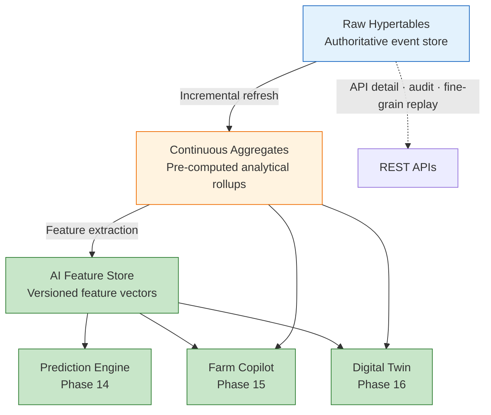
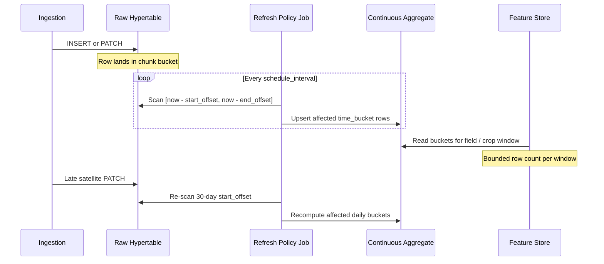
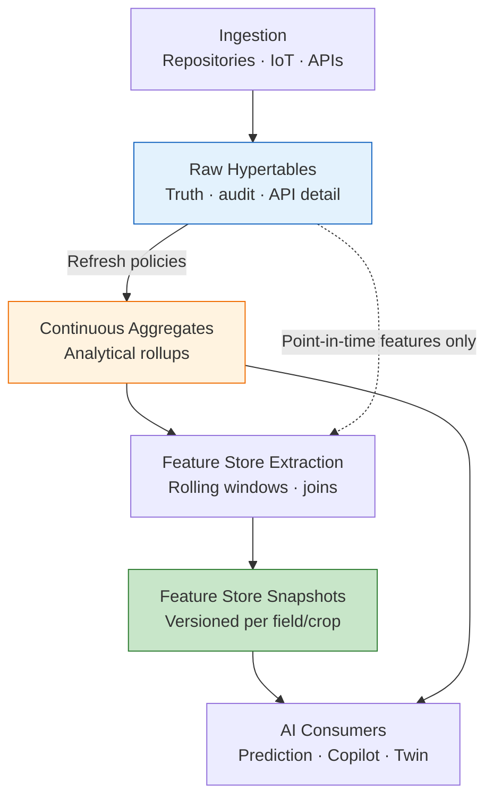
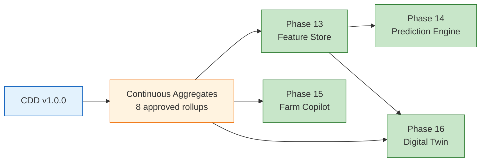
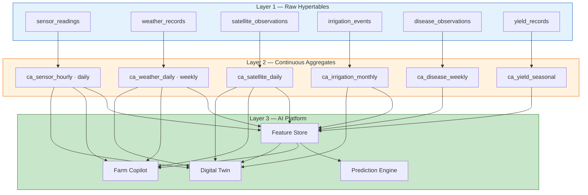
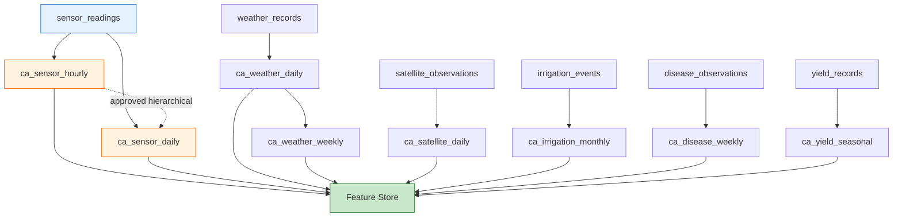
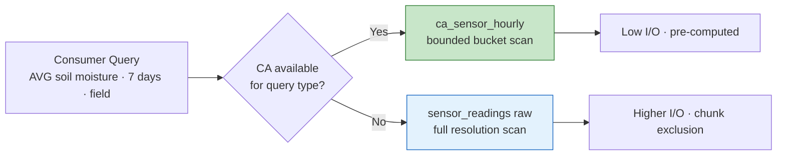
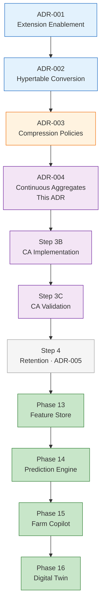

# ADR-004 — TimescaleDB Continuous Aggregate Strategy

**Status:** Approved  
**Date:** 2026-06-29  
**Phase:** 12 — TimescaleDB Time-Series Foundation  
**Step:** 3A (Assessment) → 3B (Implementation Authorized)  
**Decision Makers:** Senior Platform Architecture  
**Governance Reference:** `PHASE12_DECISION_REGISTER.md` P12-D012

### Decision Status Metadata

| Attribute | Value |
|---|---|
| **ADR Number** | ADR-004 |
| **Title** | TimescaleDB Continuous Aggregate Strategy |
| **Status** | Approved |
| **Implementation Status** | Pending Step 3B |
| **Effective Date** | Upon successful Step 3B implementation |
| **Decision Owner** | Platform Architecture |
| **Review After** | Step 3C Validation |
| **Depends On** | ADR-001, ADR-002, ADR-003 |
| **Enables** | Step 3B, Step 3C, Step 4, Phases 13–16 |
| **Supersedes** | None |
| **Superseded By** | None |
| **Tags** | `timescaledb`, `continuous-aggregates`, `phase-12`, `feature-store`, `time-bucket`, `analytics`, `P12-D012` |

---

## Related ADRs

| ADR | Title | Relationship |
|---|---|---|
| ADR-001 | TimescaleDB Extension Enablement | Prerequisite — TimescaleDB 2.28.1 active in the `agriflow` database. |
| ADR-002 | Hypertable Primary Key & Conversion Strategy | Prerequisite — six hypertables operational with composite primary keys (migration `c9d8e7f6a5b4`). |
| ADR-003 | TimescaleDB Compression Policy Strategy | Prerequisite — compression enabled on all six hypertables (migration `d4f5e6a7b8c9`); CDD runtime validation complete (Step 2C-D). |

### Related Documents

| Document | Relationship |
|---|---|
| `PHASE12_STEP3A_CONTINUOUS_AGGREGATES_ARCHITECTURE_ASSESSMENT.md` v1.0 | Authoritative evidence base for this ADR |
| `10-phase12-step1-foundation-handbook.md` v1.1 | Phase 12 foundation and roadmap context |
| `PHASE12_STEP2CD_RUNTIME_VALIDATION_AND_BENCHMARK_REPORT.md` v1.0 | Hypertable, chunk, and compression baseline |
| `PHASE12_STEP2CA_CANONICAL_DEVELOPMENT_DATASET_ARCHITECTURE.md` v1.0 | CDD feature windows and Step 3 validation scenarios |
| `06-roadmap.md` | Phase 12–16 sequencing |
| `PHASE12_DECISION_REGISTER.md` v1.4 | P12-D012 resolution |

---

## 1. Executive Summary

Following successful hypertable implementation (ADR-002), compression policy activation (ADR-003), Canonical Development Dataset (CDD) population (Step 2C-C), and runtime validation (Step 2C-D), the next architectural capability in the Phase 12 TimescaleDB stack is **Continuous Aggregates** — incrementally refreshed, pre-computed `time_bucket()` rollups over hypertables.

ADR-002 established chunk exclusion for time-window queries. ADR-003 established columnar compression for storage scalability. Continuous Aggregates address **analytical scalability**: the repeated aggregation of the same time windows by Feature Store pipelines, dashboards, Farm Copilot, and Digital Twin workloads.

This ADR formalises the approved continuous aggregate strategy documented in `PHASE12_STEP3A_CONTINUOUS_AGGREGATES_ARCHITECTURE_ASSESSMENT.md`. The objective is to:

- **Eliminate redundant aggregation** — compute `time_bucket()` rollups once; read many times across AI consumers.
- **Bound Feature Store extraction cardinality** — 90-day windows read pre-aggregated buckets, not full raw hypertable scans.
- **Accelerate AI workloads** — Phases 13–16 consume summary statistics; continuous aggregates align storage with consumption.
- **Preserve raw hypertables as truth** — CAs are derived, auto-refreshed layers; APIs and audit retain raw event access.
- **Maintain application transparency** — no changes to existing repository, service, or API contracts in Step 3B.

**ADR-004 authorises Step 3B implementation** — continuous aggregate DDL and refresh policy activation via Alembic migration, subject to the constraints recorded in this document.

### Approved Data Architecture

```
Raw Hypertables
        ↓
Continuous Aggregates
        ↓
AI Feature Store
        ↓
Prediction Engine → Farm Copilot → Digital Twin
```

---

## 2. Context

### Platform State at Time of Decision

Phase 12 Steps 1–2 and Step 2C are complete. The persistence layer consists of:

| Attribute | Value |
|---|---|
| Database | PostgreSQL 17.10 |
| TimescaleDB | 2.28.1 (active in `agriflow` database) |
| Alembic head | `d4f5e6a7b8c9` |
| Hypertables | 6 operational |
| Relational tables | 4 unchanged (`farms`, `fields`, `crops`, `soil_profiles`) |
| CDD | `cdd-v1.0.0` — 458,645 rows persisted and verified |
| Chunks | 172 across six hypertables |
| Compression | Enabled on all six hypertables per ADR-003 |
| Continuous aggregates | 0 — deferred since Step 1E-A (P12-D012) |
| Application changes from Phase 12 Steps 1–2 | Zero — API, service, and repository layers untouched |

The six hypertables (ADR-002, unchanged):

| Hypertable | Partition Column | Chunk Interval | Mutability |
|---|---|---|---|
| `sensor_readings` | `recorded_at` | 7 days | Append-only |
| `weather_records` | `recorded_at` | 7 days | Append-only |
| `satellite_observations` | `observed_at` | 7 days | Mutable (PATCH) |
| `irrigation_events` | `started_at` | 30 days | Mutable (PATCH) |
| `yield_records` | `recorded_at` | 90 days | Mutable (PATCH) |
| `disease_observations` | `observed_at` | 30 days | Mutable (PATCH) |

### Completed Prerequisites

| Step | Capability | Status |
|---|---|---|
| Step 1 | Hypertable conversion (ADR-002) | ✅ Complete |
| Step 2B | Compression policies (ADR-003) | ✅ Complete |
| Step 2C-C | CDD generation and persistence | ✅ Complete |
| Step 2C-D | Runtime validation and compression benchmark | ✅ Complete |
| Step 3A | Continuous aggregate architecture assessment | ✅ Complete |

### Why Raw Hypertables Alone Are Insufficient

Step 2C-D confirmed that raw hypertable queries are correct and performant at CDD scale (1–12 ms for representative analytics). However, raw hypertables alone do not satisfy the **repeated aggregation** requirements of AI and analytical workloads:

| Workload Pattern | Raw Hypertable Limitation |
|---|---|
| **Feature Store refresh** | Re-aggregates 90-day sensor windows from 438K+ rows on every pipeline run |
| **Rolling window features** | `sm_7d_mean`, `gdd_30d_sum`, `ndvi_90d_max` require identical `GROUP BY time_bucket()` on each materialisation |
| **Dashboard analytics** | Daily weather trends re-group 14,600 raw rows per chart refresh |
| **Farm Copilot** | Conversational queries ("average soil moisture last week") scan raw hourly series |
| **Training batch jobs** | Hyperparameter search re-reads the same multi-season covariate windows thousands of times |
| **Compressed cold data** | Aggregating over compressed chunks incurs repeated decompression CPU |

Raw hypertables answer: *"What happened at time T?"*  
Continuous aggregates answer: *"What was the hourly/daily/weekly pattern?"*  
The Feature Store answers: *"What features does the model need for this field on this date?"*

### Growing Analytical and AI Requirements

Every AI capability in Phases 13–16 is fundamentally a **time-window aggregation model**:

- **Repeated aggregations** — the same `time_bucket()` grouping executed by Feature Store, dashboards, and Copilot.
- **Rolling windows** — 7-day, 14-day, 30-day, and 90-day features defined in CDD v1.0.0.
- **Feature engineering** — multi-domain covariate construction from sensor, weather, satellite, irrigation, and disease histories.
- **Conversational analytics** — Farm Copilot natural-language queries map to summary statistics, not point readings.

ADR-003 explicitly deferred continuous aggregates to Step 3 (P12-D012). Hypertables, compression, and CDD validation are complete. The precondition for continuous aggregate activation is satisfied.

The question resolved by this ADR: **Which continuous aggregates should AGRIFLOW-AI adopt, how should they refresh, and how do they govern the analytical layer between raw hypertables and the AI Feature Store?**

---

## Decision Drivers

| Driver | Why It Matters |
|---|---|
| Feature Store readiness | Phase 13 requires bounded-cardinality feature extraction over 90–365-day windows |
| AI workload alignment | Phases 14–16 consume aggregated statistics, not raw point readings, for most queries |
| Query repetition | Same groupings executed by multiple consumers — compute once, read many |
| Compression synergy | CAs materialise on hot/warm data; reduce repeated decompression during batch analytics |
| Repository alignment | Grouping dimensions match existing `list_by_field` and `list_by_field_and_spectral_index` patterns |
| Zero API impact | CAs are a persistence-layer addition; existing contracts preserved in Step 3B |
| CDD validation | Step 2C-A defines three CA validation scenarios; CDD infrastructure is operational |

---

## 3. Decision

### Approved Decision

**Adopt eight TimescaleDB continuous aggregates across six hypertables** as the official analytical layer between raw hypertables and the AI Feature Store, with tiered refresh policies (T1–T4), policy-based incremental refresh, and phased rollout.

### Continuous Aggregate Philosophy

**Policy-based incremental refresh** — not full materialised view recomputation.

TimescaleDB `add_continuous_aggregate_policy()` automatically refreshes affected `time_bucket()` buckets when new raw data arrives or existing data is PATCHed within the refresh window. Only buckets within `[now() - start_offset, now() - end_offset]` are recomputed. Historical CA buckets remain queryable even after source chunks compress under ADR-003.

### Architectural Position

Continuous Aggregates become the **official analytical layer** in the AGRIFLOW-AI data platform:



### Scope

This ADR governs:

| Governed Topic | Authority |
|---|---|
| Aggregate naming convention | `ca_{domain}_{interval}` — §5 |
| Approved aggregate catalogue | Eight aggregates — §4 |
| Refresh policy strategy | Tiers T1–T4 — §6 |
| Materialization strategy | Raw → CA → Feature Store — §7 |
| Ownership and lifecycle | §9 |
| Validation requirements | Step 3C — §12 |
| Monitoring expectations | `timescaledb_information.job_stats` — §9 |
| Rollout sequence | Phase 1 → Phase 2 → Phase 3 — §4 |

**Implementation occurs in Step 3B.** Validation occurs in Step 3C. This ADR does not authorise repository analytics method changes — those are deferred to Step 3C or a subsequent ADR per domain if required.

### Out of Scope (Step 3B)

| Topic | Deferred To |
|---|---|
| Retention policies | ADR-005 (Step 4) |
| Feature Store schema | Phase 13 |
| Repository `time_bucket()` read methods | Step 3C (if authorised) |
| API changes | Not authorised |
| SQLAlchemy model changes | Not authorised |

---

## 4. Approved Continuous Aggregate Catalogue

The following table is the authoritative continuous aggregate configuration for Step 3B implementation. All values are approved as stated. No additional aggregates may be introduced without an ADR-004 amendment.

| # | Approved Name | Source Hypertable | Interval | Grouping Dimensions | Metrics | Intended Consumers | Refresh Tier |
|---|---|---|---|---|---|---|---|
| 1 | `ca_sensor_hourly` | `sensor_readings` | 1 hour | `field_id`, `sensor_type` | `AVG`, `MIN`, `MAX`, `COUNT` of `sensor_value` | Feature Store (`sm_7d_mean`), Farm Copilot (recent trends), Digital Twin (hourly coarse mode) | T1 |
| 2 | `ca_sensor_daily` | `sensor_readings` | 1 day | `field_id`, `sensor_type` | `AVG`, `MIN`, `MAX`, `STDDEV`, `COUNT` | Feature Store (30/90-day rolling), dashboards, Yield model stress features | T2 |
| 3 | `ca_weather_daily` | `weather_records` | 1 day | `field_id` | `AVG`/`MIN`/`MAX` temperature, `SUM` rainfall, `AVG` humidity, `SUM` solar radiation | Feature Store (`gdd_30d_sum`, `rainfall_14d_sum`), ET₀ inputs, Farm Copilot | T2 |
| 4 | `ca_weather_weekly` | `weather_records` | 1 week | `field_id` | `SUM` rainfall, `AVG` temperature, frost-day count | Seasonal analytics, multi-season Copilot, lagged climate features | T3 |
| 5 | `ca_satellite_daily` | `satellite_observations` | 1 day | `field_id`, `spectral_index` | `AVG`, `MIN`, `MAX` of `index_value`; `AVG` cloud cover | Feature Store (`ndvi_90d_max`), Yield canopy features, Farm Copilot NDVI trends | T3 |
| 6 | `ca_irrigation_monthly` | `irrigation_events` | 1 month | `field_id`, `irrigation_method` | `SUM` water volume, `COUNT` events, `SUM` duration | Feature Store (`irrigation_30d_mm`), water-use dashboards, irrigation optimisation model | T3 |
| 7 | `ca_disease_weekly` | `disease_observations` | 1 week | `field_id`, `crop_id` | `MAX` severity, `COUNT` observations, `AVG` affected area | Disease risk model, Farm Copilot disease timeline, scouting dashboards | T3 |
| 8 | `ca_yield_seasonal` | `yield_records` | 1 crop season | `field_id`, `crop_id` | `AVG`/`MAX` yield value, `COUNT` harvest events | Lagged yield features, season-over-season Copilot, training label enrichment | T4 |

### Rollout Sequence

Step 3B implementation must follow this phased sequence with validation gates between phases:

| Phase | Aggregates | Source Hypertables | Validation Gate (Step 3C) |
|---|---|---|---|
| **Phase 1** | `ca_sensor_hourly`, `ca_sensor_daily`, `ca_weather_daily`, `ca_satellite_daily` | `sensor_readings`, `weather_records`, `satellite_observations` | Refresh jobs succeed; hourly sensor avg, daily weather summary, daily NDVI mean match raw aggregation |
| **Phase 2** | `ca_weather_weekly`, `ca_irrigation_monthly` | `weather_records`, `irrigation_events` | Weekly weather and monthly irrigation rollups verified |
| **Phase 3** | `ca_disease_weekly`, `ca_yield_seasonal` | `disease_observations`, `yield_records` | Sparse-domain aggregates verified; lowest-priority `ca_yield_seasonal` may defer to Feature Store-only if seasonal bucketing is impractical |

### Configuration Rationale (Summary)

- **Grouping dimensions** mirror repository filter columns — `field_id` for field-anchored domains, `crop_id` for crop-cycle domains, `sensor_type` and `spectral_index` as secondary segments per ADR-003 `compress_segmentby` alignment.
- **`ca_sensor_daily` hierarchical dependency** on `ca_sensor_hourly` is **approved for the sensor domain only** — optional implementation detail for Step 3B; all other aggregates refresh independently from raw hypertables.
- **`ca_yield_seasonal` is lowest priority** — if season-aligned `time_bucket` semantics prove impractical in TimescaleDB, Feature Store may compute lagged yield features from raw `yield_records` only; ADR-004 amendment required to remove from catalogue.
- **No farm-level cross-field aggregates** — cross-field rollups belong in Feature Store or API layer; field-scoped queries preserve chunk exclusion.

Full per-domain justification is recorded in Step 3A §Candidate Continuous Aggregates.

### Aggregates Explicitly Excluded

| Pattern | Reason |
|---|---|
| Sub-hourly sensor rollups | No consumer at current scale |
| Per-crop sensor aggregates | Sensors anchor on `field_id`; crop joins at Feature Store layer |
| Farm-level hypertable aggregates | Loses chunk exclusion; belongs above persistence layer |
| Duplicate relational metadata | `soil_profiles`, `crops` — not time-series |

---

## 5. Naming Convention

All continuous aggregates use the approved logical naming pattern:

```
ca_{domain}_{interval}
```

| Component | Rule | Example |
|---|---|---|
| Prefix | `ca_` identifies continuous aggregate objects | `ca_sensor_hourly` |
| Domain | Hypertable semantic name (singular) | `sensor`, `weather`, `satellite` |
| Interval | `hourly`, `daily`, `weekly`, `monthly`, `seasonal` | `ca_weather_daily` |

TimescaleDB internal materialisation objects use TimescaleDB-generated names. Alembic migration comments, monitoring dashboards, and documentation reference the `ca_*` logical names exclusively.

---

## 6. Refresh Strategy

### Policy Parameters

Each continuous aggregate receives an `add_continuous_aggregate_policy()` with three governed parameters:

| Parameter | Purpose |
|---|---|
| **`start_offset`** | How far back in time to re-scan for new, modified, or late-arriving data. Must exceed the PATCH correction window for mutable hypertables (ADR-003). |
| **`end_offset`** | How close to `now()` to materialise. Buffers in-flight writes from incomplete buckets. |
| **`schedule_interval`** | How often the refresh background job executes. |

### Incremental Refresh

TimescaleDB continuous aggregates refresh **incrementally** — only `time_bucket()` buckets affected by raw hypertable changes within the refresh window are recomputed. This is the primary advantage over traditional PostgreSQL materialised views, which require full recomputation.

Incremental refresh depends on:

- Raw INSERT operations landing in buckets within the policy window.
- PATCH operations on mutable hypertables (P2/P3) potentially invalidating recent buckets — `start_offset` must exceed ADR-003 compression age thresholds for mutable tables.

### Late-Arriving Data

| Domain | Late-Arrival Risk | Approved `start_offset` |
|---|---|---|
| `sensor_readings` | Low | 3 days |
| `weather_records` | Low–medium | 7 days |
| `satellite_observations` | High (reprocessing, cloud mask revisions) | 30 days |
| `irrigation_events` | Medium (operator PATCH) | 90 days |
| `disease_observations` | Medium (scouting backfill) | 60 days |
| `yield_records` | Low | 14 days |

### Refresh Tiers

| Tier | Name | Aggregates | `schedule_interval` | `end_offset` | `start_offset` | Rationale |
|---|---|---|---|---|---|---|
| **T1** | Near-real-time | `ca_sensor_hourly` | 15 minutes | 1 hour | 3 days | Copilot and dashboard freshness for recent IoT data |
| **T2** | Hourly | `ca_sensor_daily`, `ca_weather_daily` | 1 hour | 1 day | 7 days | Feature Store daily pipeline cadence |
| **T3** | Daily | `ca_weather_weekly`, `ca_satellite_daily`, `ca_irrigation_monthly`, `ca_disease_weekly` | 1 day | 1 day | 14–90 days (per domain table above) | Batch feature engineering; tolerates day-level staleness |
| **T4** | Event-driven | `ca_yield_seasonal` | Post-harvest trigger / manual | Full season window | Full season window | Sparse harvest events; lowest refresh frequency |

### Refresh Lifecycle



### Accepted Refresh Trade-offs

| Approach | Advantage | Disadvantage |
|---|---|---|
| Aggressive refresh (T1) | Lower staleness for Copilot and dashboards | Higher background job CPU |
| Conservative refresh (T3) | Lower operational overhead | Feature Store may read summaries up to 24 hours stale |
| Wide `start_offset` | Handles late satellite data and PATCH corrections | Re-processes more buckets per cycle |
| Hierarchical sensor CA | Faster `ca_sensor_daily` refresh from hourly source | `ca_sensor_hourly` failure blocks daily if hierarchical |

---

## 7. Materialization Strategy

### Layer Responsibilities



| Layer | Responsibility | Written By | Read By |
|---|---|---|---|
| **Raw Hypertables** | Authoritative measurement event store | Application repositories (INSERT/PATCH) | APIs, audit, fine-grain Digital Twin replay |
| **Continuous Aggregates** | Derived `time_bucket()` rollups | TimescaleDB refresh jobs only | Feature Store extraction, dashboards, Copilot, Twin warm-state |
| **Feature Store** | Versioned, model-ready feature vectors | AI Engineering pipelines | Prediction Engine, Copilot grounding, Twin initialization |
| **AI Consumers** | Inference, conversation, replay | — | End users, model training jobs |

### Why This Architecture Reduces Analytical Workload

1. **Compute once, read many** — daily weather summary materialised during CA refresh; Feature Store, Copilot, and dashboards read the same buckets.
2. **Bounded cardinality** — 90-day Feature Store extraction reads 90 daily CA rows per field per metric, not thousands of raw rows.
3. **Compression synergy** — CAs materialise on hot/warm data; historical CA buckets remain queryable after source chunks compress.
4. **Separation of concerns** — raw serves APIs; CAs serve analytics; Feature Store serves ML. Clean Architecture preserved.
5. **Copilot efficiency** — summary-level grounding reduces LLM context payload versus raw time series.

**No application layer writes to continuous aggregates.** All CA mutations occur through TimescaleDB refresh policies.

---

## 8. Architectural Principles

The approved continuous aggregate strategy preserves AGRIFLOW-AI's architectural foundations established in ADR-001 through ADR-003:

**Raw hypertables remain authoritative.** Continuous aggregates are derived views. Raw data is never replaced or bypassed for audit, API detail, or fine-grain replay.

**Match repository access patterns.** Grouping dimensions align with `list_by_field`, `list_by_field_and_date_range`, and `list_by_field_and_spectral_index` repository filters.

**AI-first analytical architecture.** Continuous aggregates exist to accelerate Phases 13–16 — not as a general-purpose caching layer.

**No repository changes in Step 3B.** Existing `list_by_field` and `get_by_id` contracts are unchanged. CA read paths are additive in Step 3C if authorised.

**No API changes.** Response schemas and route contracts are unchanged.

**Alembic governed.** All continuous aggregate DDL and refresh policy activation must be implemented exclusively through forward Alembic migration(s) with documented downgrade paths.

**CDD validation mandatory.** Step 3C must validate refresh against CDD v1.0.0 per the Step 2C-A benchmark matrix before production declaration.

**Compression awareness.** Refresh `start_offset` values for mutable tables must exceed ADR-003 compression age thresholds to handle PATCH invalidation within the refresh window.

---

## 9. Governance Rules

### Naming Convention

All continuous aggregates follow `ca_{domain}_{interval}` per §5. Deviations require ADR-004 amendment.

### Ownership

| Role | Responsibility |
|---|---|
| **Platform Architecture** | ADR-004 approval, aggregate catalogue, refresh tier definitions, amendment authority |
| **Data Engineering** | Step 3B Alembic migrations, refresh policy DDL, Step 3C CDD validation |
| **AI Engineering** | Feature Store consumption contracts; feature-to-CA mapping per §10 |
| **All Developers** | No direct CA DDL outside Alembic; propose new aggregates via ADR amendment |

### Change Management

| Event | Required Action |
|---|---|
| New aggregate | ADR-004 amendment + Alembic migration + Step 3C CDD validation |
| New grouping dimension | ADR amendment (breaking — requires CA rebuild) |
| Refresh policy tuning | ADR-004 patch + migration if narrowing windows; migration-only if widening |
| CDD version bump | Re-validate all CA refresh jobs against new row counts |
| Deprecation | ADR supersession; `remove_continuous_aggregate_policy()` in downgrade path |

### ADR Amendment Process

1. Propose change in Decision Register with evidence (access pattern analysis, AI consumer requirement).
2. Platform Architecture reviews against Step 3A assessment — no new architecture without assessment update.
3. ADR-004 version increment (patch for refresh tuning; minor for new aggregate; major for catalogue redesign).
4. Alembic migration authored before runtime execution.
5. Step 3C validation against CDD before production declaration.

### Monitoring Expectations

| Monitor | Source | Alert Condition |
|---|---|---|
| CA refresh job status | `timescaledb_information.job_stats` | `last_run_status != Success` |
| CA refresh failures | `timescaledb_information.job_stats.total_failures` | Incrementing failure count |
| CA materialisation lag | `last_successful_finish` vs `now()` | Exceeds 2× `schedule_interval` |
| CA storage growth | `hypertable_size()` on materialisation hypertables | Unbounded growth beyond projected cardinality |

Monitoring is implemented in Step 3B/3C operational runbooks — not in Step 3B application code.

### Deprecation Process

1. Mark aggregate deprecated in ADR-004 amendment with successor identified.
2. Migrate Feature Store and consumer dependencies to successor.
3. `remove_continuous_aggregate_policy()` then drop CA in Alembic downgrade-safe migration.
4. Document in `PHASE12_DECISION_REGISTER.md`.

---

## 10. AI Traceability

### Aggregate-to-Phase Matrix

| Continuous Aggregate | Phase 13 — Feature Store | Phase 14 — Prediction Engine | Phase 15 — Farm Copilot | Phase 16 — Digital Twin |
|---|---|---|---|---|
| `ca_sensor_hourly` | `sm_7d_mean`, rolling moisture trends | Soil moisture deficit covariates | "Soil moisture last week" trend answers | Hourly state timeline (coarse mode) |
| `ca_sensor_daily` | 30/90-day rolling stats, stress indicators | Water stress during reproductive stage | "Monthly average soil temperature" | Daily field health snapshot |
| `ca_weather_daily` | `gdd_30d_sum`, `rainfall_14d_sum`, ET₀ inputs | Temperature/rainfall yield covariates | "How much rain last week?" | Daily weather layer in replay |
| `ca_weather_weekly` | Seasonal rainfall accumulation | Multi-season climate normalisation | "Compare rainfall to last season" | Seasonal climate context |
| `ca_satellite_daily` | `ndvi_90d_max`, NDWI water stress | Canopy health yield features | "Show NDVI trend for corn field" | Vegetation health daily state |
| `ca_irrigation_monthly` | `irrigation_30d_mm` | Irrigation response features | Irrigation volume context for field queries | Irrigation intervention summary layer |
| `ca_disease_weekly` | `disease_severity_max` | Disease risk training labels | "Any critical disease severity?" | Disease pressure state updates |
| `ca_yield_seasonal` | Lagged yield features | Training label enrichment | "What was last season's corn yield?" | Harvest outcome in replay terminal state |

### CDD Feature Window Alignment

| CDD Feature | Primary CA | Secondary Source |
|---|---|---|
| `sm_7d_mean` | `ca_sensor_hourly` | `ca_sensor_daily` |
| `gdd_30d_sum` | `ca_weather_daily` | — |
| `ndvi_90d_max` | `ca_satellite_daily` | — |
| `rainfall_14d_sum` | `ca_weather_daily` | — |
| `irrigation_30d_mm` | `ca_irrigation_monthly` | Raw `irrigation_events` |
| `disease_severity_max` | `ca_disease_weekly` | Raw `disease_observations` |
| `yield_actual` | Raw `yield_records` | `ca_yield_seasonal` |

### Phase Benefit Summary

| Phase | Why Continuous Aggregates Matter |
|---|---|
| **Phase 13 — Feature Store** | Bounded-cardinality extraction; deterministic bucket reads; pipeline idempotency across reruns |
| **Phase 14 — Prediction Engine** | Stable training covariates; epoch iterations reuse materialised buckets; multi-season batch efficiency |
| **Phase 15 — Farm Copilot** | Summary-level NL grounding; reduced query latency at scale; smaller LLM context payloads |
| **Phase 16 — Digital Twin** | Daily warm-state snapshots for timeline visualisation; raw streams retained for event-level replay |

### AI Consumption Flow



---

## 11. Architecture Diagrams

### Continuous Aggregate Architecture



### Aggregate Dependency Graph



### Query Acceleration Workflow



---

## 12. Validation Strategy

Step 3C validates continuous aggregate behaviour against CDD v1.0.0. This ADR defines governance only — validation execution is deferred to Step 3C.

### Step 3C Verification Scope

| Verification Area | Success Criteria |
|---|---|
| **Refresh jobs** | All eight refresh policies registered; `last_run_status = Success` in `timescaledb_information.job_stats` |
| **Materialisation** | CA buckets populated for all Phase 1 aggregates after CDD load |
| **Incremental refresh** | New raw INSERT produces updated CA bucket within policy `schedule_interval` |
| **Query correctness** | CA query results match equivalent raw `time_bucket()` aggregation for CDD sample windows |
| **Query performance** | Qualitative improvement vs raw aggregation at CDD scale; no regression on hot-window API queries |

### CDD Validation Scenarios (from Step 2C-A)

| Aggregate | CDD Input | Validation Intent |
|---|---|---|
| Hourly sensor average | 438,000 `sensor_readings` | `ca_sensor_hourly` buckets match raw hourly grouping |
| Daily weather summary | 14,600 `weather_records` | `ca_weather_daily` temperature and rainfall match raw daily rollup |
| Daily NDVI mean | ~730 NDVI rows (73 passes × 10 fields) | `ca_satellite_daily` NDVI buckets match raw daily mean |

### Validation Constraints

- Validation uses CDD v1.0.0 (`cdd-dev` profile, seed `42`) — no ad-hoc test data.
- No TimescaleDB configuration changes solely to improve validation metrics.
- Validation documents system behaviour exactly as deployed.

---

## 13. Alternatives Considered

Five alternatives were evaluated in Step 3A. This section records the decision rationale.

### PostgreSQL Materialised Views

**Rejected.** Traditional materialised views require full `REFRESH MATERIALIZED VIEW` recomputation. They lack TimescaleDB hypertable-aware incremental refresh and do not integrate with chunk lifecycle or compression policies.

### Redis Caching

**Rejected.** Application-level cache has no `time_bucket` semantics; invalidation complexity scales with consumer count; does not reduce database aggregation cost; adds infrastructure dependency outside the persistence layer.

### Application-Level Aggregation

**Rejected.** Duplicates aggregation logic across Feature Store, dashboards, Copilot, and training pipelines; violates single-responsibility at the persistence layer; pipeline duration grows linearly with raw volume.

### Ad-Hoc SQL Aggregation

**Rejected.** Acceptable at CDD scale (458K rows) per Step 2C-D; does not scale to production farm counts (100 farms, 1,000 fields); identical queries re-execute on every consumer request.

### Feature Store-Only Aggregation

**Rejected.** Centralises logic in one consumer but does not serve dashboards, Copilot real-time grounding, or Digital Twin warm-state without Feature Store dependency for all analytical reads; violates compute-once-read-many principle.

### Approved: TimescaleDB Continuous Aggregates ✅

**Approved** because it:

- Provides hypertable-aware incremental refresh natively.
- Aligns with the ADR-001 through ADR-003 sequential stack.
- Serves multiple consumers from a single materialised layer.
- Requires zero API changes in Step 3B.
- Maps directly to CDD feature windows and Phase 13–16 access patterns.

---

## 14. Consequences

### Positive Outcomes

- **Bounded Feature Store extraction** — 90-day windows read pre-aggregated buckets, not full raw scans.
- **Multi-consumer efficiency** — Feature Store, Copilot, dashboards, and training jobs share materialised rollups.
- **Predictable pipeline duration** — feature extraction cardinality determined by bucket count, not raw row growth.
- **Compression synergy** — reduces repeated decompression of cold chunks during batch analytics.
- **Copilot readiness** — summary-level grounding with lower latency and smaller context payloads at production scale.
- **Digital Twin warm-state** — daily snapshots for timeline visualisation without re-aggregating raw streams.
- **Zero Step 3B application impact** — existing repository, service, and API contracts unchanged.
- **P12-D012 resolved** — continuous aggregate strategy deferred since Step 1E-A is now governed.

### Accepted Trade-offs

- **Storage overhead** — eight CAs add derived storage atop raw hypertables; cardinality is bounded by `(fields × dimensions × buckets)` and remains small relative to raw at AGRIFLOW scale.
- **Refresh lag** — T3 daily refresh tolerates up to 24-hour staleness for batch features; T1/T2 mitigate for time-sensitive consumers.
- **Operational complexity** — eight aggregates × refresh policies increase monitoring surface; mitigated by phased rollout and `job_stats` monitoring.
- **Hierarchical dependency** — `ca_sensor_daily` optionally depends on `ca_sensor_hourly`; failure cascades if hierarchical implementation is chosen.
- **Mutable table interaction** — PATCH on irrigation, disease, and satellite data forces bucket recomputation within `start_offset` windows.
- **Compression × refresh cost** — refresh jobs scanning compressed chunks incur decompression CPU; mitigated by materialising CAs before chunks age into compression where possible.

### Interaction with Compression (ADR-003)

| Interaction | Governance |
|---|---|
| CA refresh on hot uncompressed chunks | Preferred — lowest refresh cost |
| CA refresh on compressed source chunks | Permitted within `start_offset`; higher CPU cost accepted |
| Historical CA buckets after source compression | Remain queryable — CA is independent storage |
| Mutable table PATCH window | `start_offset` must exceed ADR-003 compression age for P2/P3 tables |

### Future Maintenance

- Refresh policy tuning via ADR-004 patch amendments as production access patterns emerge.
- New aggregates require ADR amendment — not ad-hoc DDL.
- Step 4 retention policies (ADR-005) must account for CA materialisation when defining raw data lifecycle.

---

## 15. Risks

| Risk | Severity | Summary Mitigation |
|---|---|---|
| Refresh lag | Medium | T1/T2 for time-sensitive features; staleness documented in Feature Store metadata |
| Stale aggregates | Medium | Per-domain `start_offset` covering late arrivals and PATCH windows |
| Storage overhead | Low–Medium | Monitor `hypertable_size()`; cardinality bounded by design |
| Dependency management | Medium | Hierarchical CA limited to sensor domain only |
| Mutable table PATCH invalidation | High | `start_offset` exceeds ADR-003 compression age for P2/P3 |
| Compression × refresh conflict | Medium | Materialise on hot data; narrow `start_offset` for P1 domains |
| Over-aggregation | Low | Raw hypertable retained for peak/detection features |
| Operational complexity | Medium | Phased rollout; unified `job_stats` monitoring |

Detailed risk analysis is recorded in `PHASE12_STEP3A_CONTINUOUS_AGGREGATES_ARCHITECTURE_ASSESSMENT.md` §Risks.

---

## 16. Future Evolution

The following enhancements are documented for future consideration. **None are approved or in scope for Step 3B.**

| Enhancement | Description | Trigger |
|---|---|---|
| **Hierarchical aggregates** | Additional CA-on-CA chains beyond sensor domain | Measured refresh cost reduction justifies dependency |
| **Crop-specific aggregates** | Join crop calendar to sensor CA for phenology-aligned buckets | Phase 14 model requirements |
| **`cdd-benchmark` profile tuning** | Validate CA refresh at 15-minute sensor cadence (~4.4M rows) | Production-scale refresh benchmarking |
| **Production refresh optimisation** | Tune `schedule_interval` and offsets from production telemetry | Post-Phase 13 Feature Store operational data |
| **Real-time CA for Copilot** | Sub-hourly refresh for specific Copilot query classes | Phase 15 latency requirements |
| **Cross-field farm aggregates** | Farm-level rollups in Feature Store layer (not hypertable CA) | Farm Copilot multi-field queries |

Future enhancements require ADR-004 amendment and Step 3C re-validation where applicable.

---

## 17. Governance

| Attribute | Value |
|---|---|
| **Decision Register** | P12-D012 — Continuous Aggregate Strategy (Resolved) |
| **Assessment** | `PHASE12_STEP3A_CONTINUOUS_AGGREGATES_ARCHITECTURE_ASSESSMENT.md` v1.0 |
| **Supersedes** | None |
| **Superseded By** | None |
| **Depends On** | ADR-001, ADR-002, ADR-003 |
| **Authorises** | Step 3B — Continuous Aggregate Implementation (Alembic migration) |

### Enables

| Step / Phase | Capability Enabled |
|---|---|
| **Step 3B** | Continuous aggregate DDL and refresh policy activation |
| **Step 3C** | CDD validation of refresh, correctness, and performance |
| **Step 4** | Retention policies on raw hypertables with CA preservation (ADR-005) |
| **Phase 13** | AI Feature Store — bounded-cardinality feature extraction |
| **Phase 14** | Prediction Engine — stable training covariates |
| **Phase 15** | Farm Copilot — summary-level NL grounding |
| **Phase 16** | Digital Twin — daily warm-state snapshots |

### Implementation Constraints (Step 3B)

1. Aggregate catalogue must match §4 exactly. Changes require ADR-004 amendment.
2. Rollout must follow Phase 1 → Phase 2 → Phase 3 with validation gates in Step 3C.
3. A pre-migration `pg_dump` backup is mandatory per P12-D003.
4. No repository, service, API, or SQLAlchemy model changes are authorised in Step 3B.
5. No retention policies in Step 3B.
6. CDD v1.0.0 validation is mandatory in Step 3C before production declaration.
7. If a new architectural decision is required during Step 3B execution, it must be recorded in the Decision Register before implementation proceeds.

### P12-D012 Resolution

| P12-D012 Item | ADR-004 Resolution |
|---|---|
| Hourly sensor by `(field_id, sensor_type)` | ✅ `ca_sensor_hourly` |
| Daily weather by `field_id` | ✅ `ca_weather_daily` |
| Daily NDVI by `(field_id, spectral_index)` | ✅ `ca_satellite_daily` |
| Monthly irrigation by `field_id` | ✅ `ca_irrigation_monthly` |
| Status | ⏳ Deferred → **✅ Approved — Pending Step 3B Implementation** |

---

## Future ADR Relationships

ADR-004 forms the **analytical pre-computation layer** in the Phase 12 TimescaleDB stack. Subsequent architectural decisions build upon continuous aggregates rather than replacing the foundation established here.

| Future ADR | Relationship |
|---|---|
| ADR-005 | Retention policies operate on raw hypertables; CAs must be preserved or independently governed when raw data ages out |
| ADR-006 | AI Feature Store schema and consumption contracts reference CA outputs per §10 |

Changes to the aggregate catalogue, grouping dimensions, refresh tiers, or rollout sequence require an ADR-004 amendment and Decision Register update. Future ADRs must not contradict the policies approved in §4 without explicit supersession.

---

## 18. Phase 12 Governance Architecture



---

## 19. Decision Summary

- **Adopt TimescaleDB continuous aggregates** as the official analytical layer between raw hypertables and the AI Feature Store.
- **Scope:** Eight aggregates across six hypertables — catalogue in §4 is authoritative.
- **Philosophy:** Policy-based incremental refresh with tiered T1–T4 cadences.
- **Naming:** `ca_{domain}_{interval}` for all logical aggregate names.
- **Materialization:** Raw → CA → Feature Store → AI consumers; no application writes to CAs.
- **Rollout:** Three phases — P1 (sensor, weather, satellite) → P2 (weekly weather, irrigation) → P3 (disease, yield).
- **Application impact (Step 3B):** Zero — no repository, service, API, or model changes.
- **Validation:** Step 3C against CDD v1.0.0 per Step 2C-A benchmark matrix.
- **Deferred:** Retention (ADR-005), repository CA read methods (Step 3C), Feature Store schema (Phase 13).
- **ADR-004 authorises Step 3B** and resolves Decision Register entry P12-D012.

---

## References

* `PHASE12_STEP3A_CONTINUOUS_AGGREGATES_ARCHITECTURE_ASSESSMENT.md` v1.0 — authoritative evidence base for this ADR
* `PHASE12_STEP2CD_RUNTIME_VALIDATION_AND_BENCHMARK_REPORT.md` v1.0 — hypertable, chunk, compression baseline
* `PHASE12_STEP2CA_CANONICAL_DEVELOPMENT_DATASET_ARCHITECTURE.md` v1.0 — CDD feature windows and Step 3 validation scenarios
* `10-phase12-step1-foundation-handbook.md` v1.1 — §13 Roadmap Beyond Step 1
* `06-roadmap.md` — Phase 12–16 sequencing
* `PHASE12_DECISION_REGISTER.md` v1.4 — P12-D012, P12-D003, P12-D011
* `docs/adr/ADR-001-timescaledb-extension-enablement.md` — Accepted 2026-06-29
* `docs/adr/ADR-002-hypertable-primary-key-conversion-strategy.md` — Approved 2026-06-29
* `docs/adr/ADR-003-timescaledb-compression-policy-strategy.md` — Approved 2026-06-29
* [TimescaleDB Continuous Aggregates Documentation](https://docs.timescale.com/use-timescale/latest/continuous-aggregates/)

---

## Document Control

| Field | Value |
|---|---|
| Document Version | 1.0 |
| Architecture Status | Approved |
| Implementation Status | Pending Step 3B |
| Last Updated | 2026-06-29 |
| Next Review | After Step 3C |
| Classification | Architecture Decision Record |

---

*ADR-004 v1.0 — Approved: 2026-06-29 — Phase 12 Step 3A → Step 3B*
