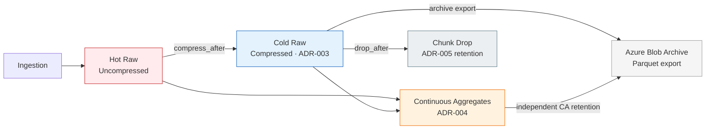
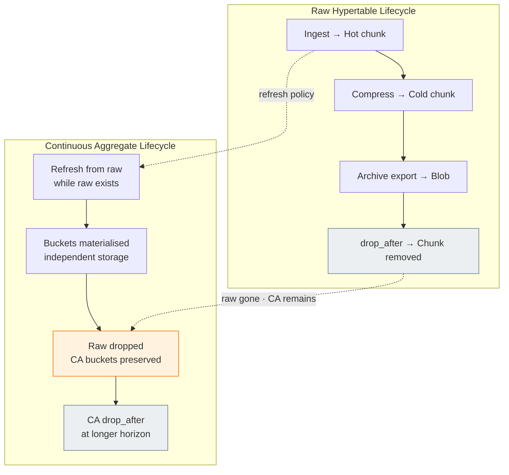
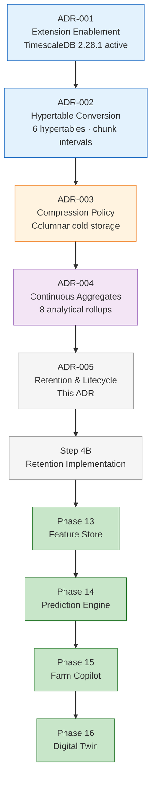
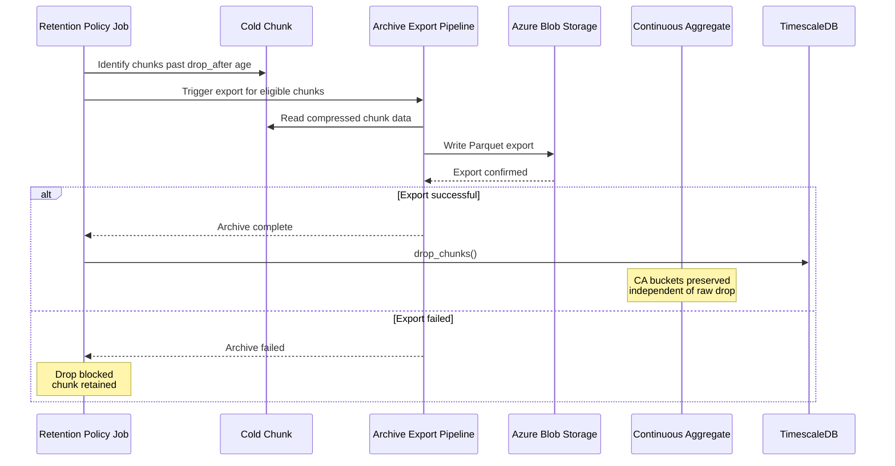
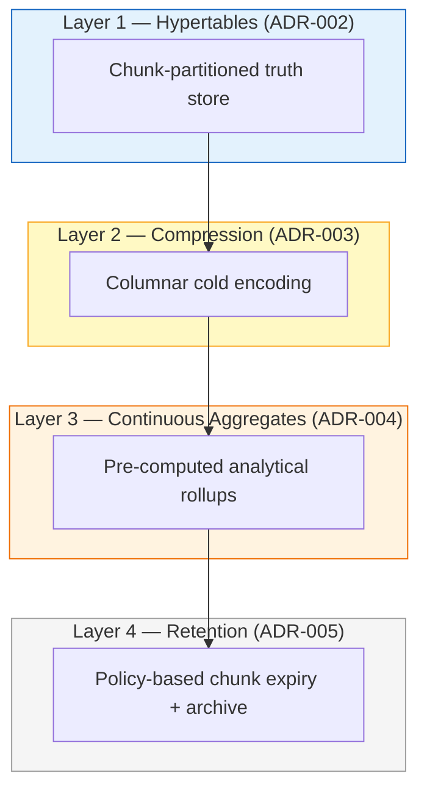
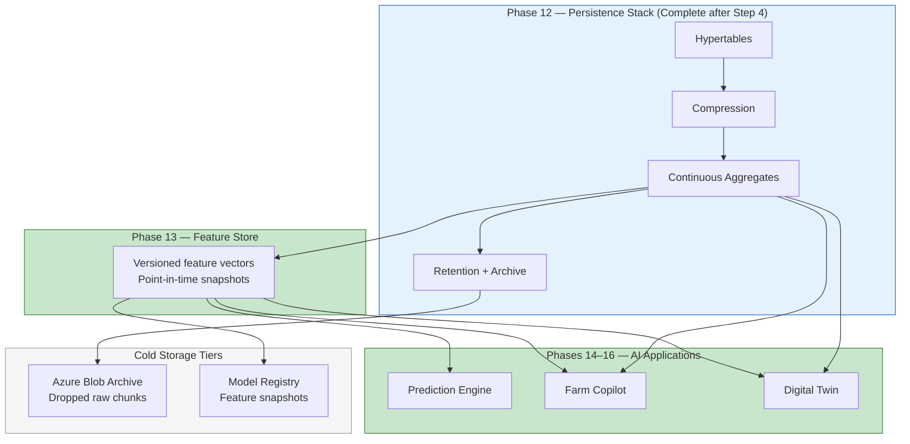

# ADR-005 — TimescaleDB Data Retention & Lifecycle Strategy

**Status:** Accepted  
**Date:** 2026-06-30  
**Phase:** 12 — TimescaleDB Time-Series Foundation  
**Step:** 4A (Assessment) → 4B (Implementation Authorized)  
**Decision Makers:** Senior Platform Architecture  
**Governance Reference:** `PHASE12_DECISION_REGISTER.md` P12-D011

### Decision Status Metadata

| Attribute | Value |
|---|---|
| **ADR Number** | ADR-005 |
| **Title** | TimescaleDB Data Retention & Lifecycle Strategy |
| **Status** | Accepted |
| **Implementation Status** | Pending Step 4B |
| **Effective Date** | Upon successful Step 4B implementation |
| **Decision Owner** | Platform Architecture |
| **Review After** | Step 4C Validation |
| **Depends On** | ADR-001, ADR-002, ADR-003, ADR-004 |
| **Enables** | Step 4B, Step 4C, Phases 13–16 operational sustainability |
| **Supersedes** | None |
| **Superseded By** | None |
| **Tags** | `timescaledb`, `retention`, `data-lifecycle`, `phase-12`, `archive`, `P12-D011` |

---

## Related ADRs

| ADR | Title | Relationship |
|---|---|---|
| ADR-001 | TimescaleDB Extension Enablement | Prerequisite — TimescaleDB 2.28.1 active in the `agriflow` database. |
| ADR-002 | Hypertable Primary Key & Conversion Strategy | Prerequisite — six hypertables operational with composite primary keys and per-table chunk intervals (migration `c9d8e7f6a5b4`). Retention operates on chunks created by ADR-002. |
| ADR-003 | TimescaleDB Compression Policy Strategy | Prerequisite — compression enabled on all six hypertables (migration `d4f5e6a7b8c9`); retention age thresholds must exceed compression age thresholds. |
| ADR-004 | TimescaleDB Continuous Aggregate Strategy | Prerequisite — eight continuous aggregates materialised (migration `e5f6a7b8c9d0`); CA materialisation hypertables require independent retention governance. |

### Related Documents

| Document | Relationship |
|---|---|
| `PHASE12_STEP4A_RETENTION_ARCHITECTURE_ASSESSMENT.md` v1.0 | Authoritative evidence base for this ADR |
| `10-phase12-step1-foundation-handbook.md` v1.1 | Production scale projections; Phase 12 roadmap |
| `11-phase12-analytical-platform-handbook.md` v1.0 | Four-layer stack; operational monitoring |
| `PHASE12_STEP2CD_RUNTIME_VALIDATION_AND_BENCHMARK_REPORT.md` v1.0 | Compression and storage baseline |
| `PHASE12_STEP3C_CONTINUOUS_AGGREGATE_VALIDATION_REPORT.md` v1.0 | CA correctness and backfill behaviour |
| `PHASE12_STEP3D_PERFORMANCE_BENCHMARK_REPORT.md` v1.0 | Scaling projections; retention urgency at 100× CDD |
| `PHASE12_STEP2CA_CANONICAL_DEVELOPMENT_DATASET_ARCHITECTURE.md` v1.0 | Retention simulation benchmark matrix |
| `PHASE12_DECISION_REGISTER.md` v1.4 | P12-D011 resolution |

---

## 1. Executive Summary

Following successful hypertable implementation (ADR-002), compression policy activation (ADR-003), continuous aggregate materialisation (ADR-004), CDD validation (Steps 2C–3D), and retention architecture assessment (Step 4A), the final architectural capability in the Phase 12 TimescaleDB stack is **Data Retention & Lifecycle Governance** — policy-based chunk expiry with archive-before-delete, domain-specific retention horizons, and independent continuous aggregate lifecycle management.

ADR-002 established chunk-partitioned time-series storage. ADR-003 established columnar compression on cold data. ADR-004 established pre-computed analytical rollups. Retention addresses **bounded lifecycle governance**: converting linear unbounded storage growth into predictable plateau storage while preserving AI-relevant historical signal in continuous aggregates and cold archives.

This ADR formalises the approved retention strategy documented in `PHASE12_STEP4A_RETENTION_ARCHITECTURE_ASSESSMENT.md`. The objective is to:

- **Cap storage growth** — plateau raw hypertable storage at domain-specific business horizons at production scale.
- **Preserve AI signal** — retain continuous aggregates and yield labels beyond raw expiry; decouple raw resolution from model-relevant summaries.
- **Mandate archive-before-delete** — export cold chunks to Azure Blob Storage before any `drop_after` policy executes (P12-D011).
- **Exempt irreplaceable data** — `yield_records` receives no drop policy; harvest labels are permanent training targets.
- **Maintain application transparency** — retention is a persistence-layer lifecycle concern; repositories, services, and APIs require zero changes in Step 4B.

**ADR-005 authorises Step 4B implementation** — retention policy and archive pipeline activation via Alembic migration, subject to the constraints recorded in this document.

### Approved Lifecycle Architecture

```
Ingestion → Hot Raw → Compressed Cold → Continuous Aggregates → Archive → Chunk Drop
                                                              ↓
                                                    Feature Store (Phase 13)
                                                              ↓
                                          Prediction Engine → Farm Copilot → Digital Twin
```

---

## 2. Context

### Architectural Evolution Through Phase 12

Phase 12 upgraded AGRIFLOW-AI from standard PostgreSQL to a four-layer TimescaleDB analytical persistence platform. Each layer addresses a distinct scalability dimension:

| Step | ADR | Capability | Problem Solved |
|---|---|---|---|
| Step 1 | ADR-001, ADR-002 | Extension enablement + hypertable conversion | Query scalability via chunk exclusion |
| Step 2 | ADR-003 | Compression policies | Storage efficiency on cold data |
| Step 3 | ADR-004 | Continuous aggregates | Analytical scalability via pre-computed rollups |
| **Step 4** | **ADR-005** | **Retention & archival** | **Bounded lifecycle / predictable operational cost** |

The Foundation Handbook establishes that production deployments generate **10 million to 100 million `sensor_readings` rows per year** across a 100-farm deployment. Compression (ADR-003) reduces the growth rate — Step 2C-D measured **5.63×** compression on `sensor_readings` at CDD scale — but does not cap total volume. Step 3D projects that at 100× CDD scale, chunk count grows from 172 to **~1,700+**, making retention operationally critical.

Continuous aggregates (ADR-004) validated at Step 3C with **0 correctness mismatches** and **13–14×** measured query improvement over raw re-aggregation. This validation is a prerequisite for retention: AI consumers can trust that summary buckets accurately represent dropped raw history.

### Platform State at Time of Decision

| Attribute | Value |
|---|---|
| Database | PostgreSQL 17.10 |
| TimescaleDB | 2.28.1 (active in `agriflow` database) |
| Alembic head | `e5f6a7b8c9d0` |
| Hypertables | 6 operational |
| Compression policies | 6 registered per ADR-003 |
| Continuous aggregates | 8 materialised per ADR-004 |
| Retention policies | 0 — deferred since Step 1E-A (P12-D011) |
| CDD | v1.0.0 — 458,645 rows; ~41 MB compressed hypertable storage |
| Application changes from Phase 12 Steps 1–3 | Zero |

### Why Retention Is the Final Infrastructure Capability

Hypertables, compression, and continuous aggregates together solve **how data is stored, compressed, and summarised**. None of them answer **how long data should remain in the primary database**. Without retention:

- Storage grows linearly with every growing season retained.
- Backup duration, DR restore time, and background job surface area grow without bound.
- Operational cost on Azure becomes unpredictable at multi-farm production scale.

Retention completes the Phase 12 persistence stack. After Step 4, the platform has a governed answer for every stage of the agricultural data lifecycle — from real-time ingestion through cold archive — without requiring persistence-layer redesign for Phases 13–16.

P12-D011 initially deferred retention with the finding: *"Do not enable automatic retention deletion policies at this stage — all time-series data is AI training material."* Step 4A and this ADR resolve P12-D011 by adopting a **tiered AI data lifecycle**: preserve model-relevant signal in continuous aggregates and Feature Store snapshots while releasing fine-grain raw events that no longer serve analytical or regulatory purpose, with mandatory archival before any deletion.

---

## 3. Problem Statement

The following operational, storage, maintenance, and AI lifecycle challenges require formal resolution before Step 4B implementation.

### 3.1 Storage Growth

Without retention, time-series data accumulates unboundedly. At production scale (100M `sensor_readings` rows/year, 10× compression), five years of sensor history alone accumulates **7.5–12.5 GB compressed** — with total six-domain estimates of **10–20 GB compressed** and growing linearly (Step 4A §6.3). Compression slows the slope; retention caps the ceiling.

### 3.2 Operational Cost

Each additional chunk increases backup duration (Tier 2 `pg_dump` per P12-D003), background job CPU (compression, CA refresh, retention), and Azure provisioned disk cost. Retention policies automate chunk expiry on schedule, replacing ad-hoc manual pruning and preventing surprise storage budget overruns.

### 3.3 Long-Term Maintenance

Enterprise agricultural platforms operate across multi-decade farm relationships. Unbounded database growth extends Alembic migration windows, DR restore times, and TimescaleDB upgrade testing cycles. Retention bounds maximum primary-database size, keeping the persistence layer maintainable across the platform's expected 10+ year lifecycle.

### 3.4 AI Data Lifecycle

Phases 13–16 consume data at different resolutions:

| AI Consumer | Resolution Need | Primary Data Path |
|---|---|---|
| Feature Store (Phase 13) | 7–90 day rolling windows | Continuous aggregates |
| Prediction Engine (Phase 14) | Multi-season covariates + yield labels | CAs + raw `yield_records` |
| Farm Copilot (Phase 15) | Recent detail + seasonal summaries | Raw (recent) + CAs (historical) |
| Digital Twin (Phase 16) | Fine-grain replay (current season) + coarse timeline (historical) | Raw (current) + CAs (prior seasons) |

Indiscriminate deletion of all historical data would degrade model quality. Indefinite retention of all raw high-frequency telemetry is storage-prohibitive. The platform requires **domain-specific retention** that preserves AI signal in continuous aggregates while releasing raw resolution that no longer serves a consumer.

### 3.5 Questions Resolved by This ADR

1. **What retention period applies to each raw hypertable?** Domain-specific horizons based on business, compliance, and AI requirements.
2. **How are continuous aggregates governed independently?** CA materialisation hypertables receive equal or longer retention than their source hypertables.
3. **What happens to data before it is dropped?** Mandatory archive export to Azure Blob Storage — no bare deletion.
4. **Which data is exempt from drop policies?** `yield_records` — irreplaceable harvest labels.
5. **At what granularity does retention operate?** Chunk level per ADR-002 chunk intervals — not row level.

---

## 4. Decision

### Approved Decision

**Adopt TimescaleDB policy-based retention on five of six hypertables** with domain-specific `drop_after` ages, **independent retention on eight continuous aggregate materialisation hypertables**, **mandatory archive-before-delete** to Azure Blob Storage, and **permanent exemption** of `yield_records` from all drop policies.

### Retention Philosophy

**Archive-first, domain-tiered chunk expiry** — not uniform deletion or infinite retention.

TimescaleDB `add_retention_policy()` automatically drops chunks older than a configured age threshold. AGRIFLOW-AI adds a governance gate: **no chunk drop executes without a successful archive export** of the chunk contents to cold storage. Continuous aggregates outlive raw hypertables for high-volume domains, preserving multi-season AI signal at bounded cardinality.

This approach implements the strategy evaluated and approved in Step 4A.

### Decision Components

#### 4.1 Domain-Specific Raw Hypertable Retention

Each hypertable receives an independent `drop_after` age reflecting its ingest frequency, business value, compliance exposure, and AI consumption pattern. High-frequency domains (sensor) receive the shortest raw retention; sparse irreplaceable domains (yield) receive no drop policy.

Retention ages are **multiples of ADR-002 chunk intervals** and **exceed ADR-003 compression age thresholds plus maximum PATCH windows** for mutable tables.

#### 4.2 Independent Continuous Aggregate Retention

Continuous aggregate materialisation hypertables (ADR-004 catalogue) are independent TimescaleDB storage objects. CA buckets computed from dropped raw chunks **remain queryable** after source chunk expiry. CA retention policies must be configured explicitly — they are not automatic consequences of raw retention.

**Governing rule:** For high-volume domains, **raw retention < CA retention**.

#### 4.3 Archive-Before-Delete Policy

No `drop_after` retention policy executes without a preceding successful archive export of the affected chunk(s) to **Azure Blob Storage** in Parquet format. This satisfies P12-D011 and ADR-002 §Future Retention Policies.

Archive exports constitute the **secondary storage tier** — indefinite lifecycle-managed Blob storage for compliance, model retraining, and DR tertiary recovery.

#### 4.4 Yield Data Exemption

`yield_records` receives **no `add_retention_policy()`**. Harvest measurements are irreplaceable training labels for the Yield Prediction Engine (Phase 14), financial audit records, and crop insurance evidence. Storage cost is negligible (tens of rows per field per decade).

`ca_yield_seasonal` retention is **indefinite**.

#### 4.5 Chunk-Based Lifecycle Management

Retention operates at the **chunk** level — the natural drop unit established by ADR-002:

| Hypertable | Chunk Interval | Drop Granularity |
|---|---|---|
| `sensor_readings` | 7 days | Weekly chunk drops |
| `weather_records` | 7 days | Weekly chunk drops |
| `satellite_observations` | 7 days | Weekly chunk drops |
| `irrigation_events` | 30 days | Monthly chunk drops |
| `yield_records` | 90 days | Exempt — no drops |
| `disease_observations` | 30 days | Monthly chunk drops |

### Retention Lifecycle



### Governing Principles

| # | Principle | Authority |
|---|---|---|
| R-01 | Archive before drop | P12-D011, ADR-002, this ADR |
| R-02 | Raw retention < CA retention (high-volume domains) | Step 4A §7.1 |
| R-03 | Retention age > compression age + PATCH window | ADR-003, ADR-004 |
| R-04 | Retention age is multiple of chunk interval | ADR-002 |
| R-05 | Yield data exempt from drop | Step 4A §3.7 |
| R-06 | CA materialisation has independent policies | ADR-004 |
| R-07 | Business/compliance sign-off before production activation | P12-D011 |
| R-08 | CDD retention simulation gate before production | Step 2C-A benchmark matrix |

---

## 5. Retention Matrix

The following tables are the authoritative retention configuration for Step 4B implementation. All values are approved as stated. Changes require an ADR-005 amendment and Decision Register update.

### 5.1 Raw Hypertable Retention

| # | Hypertable | Domain | Approved `drop_after` | Chunk Drops | Compress After (ADR-003) | Status |
|---|---|---|---|---|---|---|
| 1 | `sensor_readings` | Sensor | **24 months** | ~104 × 7-day chunks | 7 days | Drop policy |
| 2 | `weather_records` | Weather | **36 months** | ~156 × 7-day chunks | 7 days | Drop policy |
| 3 | `satellite_observations` | Satellite | **36 months** | ~156 × 7-day chunks | 14 days | Drop policy |
| 4 | `irrigation_events` | Irrigation | **7 years** | ~28 × 30-day chunks | 60 days | Drop policy |
| 5 | `disease_observations` | Disease | **7 years** | ~28 × 30-day chunks | 60 days | Drop policy |
| 6 | `yield_records` | Yield | **Indefinite — no drop policy** | N/A | 180 days | **Exempt** |

### 5.2 Domain Retention Justification

| Domain | Raw Retention | Business Justification | AI Justification |
|---|---|---|---|
| **Sensor** | 24 months | Two full growing seasons of fine-grain IoT for operational dashboards and root-cause analysis | `ca_sensor_hourly` (36 mo) and `ca_sensor_daily` (10 yr) preserve model covariates beyond raw expiry; Digital Twin transitions to coarse replay for prior seasons |
| **Weather** | 36 months | Three seasons of sub-daily weather for ET₀ recalculation and agronomic audit | `ca_weather_daily` and `ca_weather_weekly` (15 yr) preserve climate baseline features for GDD and seasonal Copilot comparisons |
| **Satellite** | 36 months | Three seasons of pass-level imagery for vegetation monitoring and carbon-credit evidence | `ca_satellite_daily` (10 yr) preserves NDVI/EVI trend features; 30-day PATCH window (ADR-004) satisfied before drop boundary |
| **Irrigation** | 7 years | Water rights compliance and utility audit reporting | `ca_irrigation_monthly` (indefinite) preserves permanent water-use history at negligible storage cost |
| **Disease** | 7 years | Crop protection product application regulatory audit | `ca_disease_weekly` (10 yr) preserves disease pressure baselines for risk models |
| **Yield** | Indefinite | Financial reporting, crop insurance, land valuation — permanent business facts | `yield_actual` training label is irreplaceable; `ca_yield_seasonal` (indefinite) for season-over-season features |

### 5.3 Continuous Aggregate Retention

| # | Continuous Aggregate | Source Hypertable | Approved Retention | Raw Retention | Relationship |
|---|---|---|---|---|---|
| 1 | `ca_sensor_hourly` | `sensor_readings` | **36 months** | 24 months | CA > raw (+12 months) |
| 2 | `ca_sensor_daily` | `sensor_readings` | **10 years** | 24 months | CA > raw |
| 3 | `ca_weather_daily` | `weather_records` | **15 years** | 36 months | CA > raw |
| 4 | `ca_weather_weekly` | `weather_records` | **15 years** | 36 months | CA > raw |
| 5 | `ca_satellite_daily` | `satellite_observations` | **10 years** | 36 months | CA > raw |
| 6 | `ca_irrigation_monthly` | `irrigation_events` | **Indefinite** | 7 years | CA ≥ raw |
| 7 | `ca_disease_weekly` | `disease_observations` | **10 years** | 7 years | CA > raw |
| 8 | `ca_yield_seasonal` | `yield_records` | **Indefinite** | Indefinite | Both indefinite |

### 5.4 Archive Tier

| Tier | Technology | Contents | Retention |
|---|---|---|---|
| **Primary** | PostgreSQL / TimescaleDB | Hot + cold chunks + CAs within policy windows | Per §5.1–5.3 |
| **Secondary** | Azure Blob Storage (Parquet) | Pre-drop chunk exports; annual archive snapshots | Indefinite (Blob lifecycle-managed) |
| **Tertiary** | Feature Store model registry (Phase 13) | Versioned feature snapshots bound to production models | Per model governance policy |

### 5.5 Rollout Sequence

Step 4B implementation must follow this phased sequence with validation gates:

| Phase | Scope | Validation Gate |
|---|---|---|
| **Phase 1** | Archive export pipeline + `sensor_readings` retention | CDD simulation: rows older than 24 months dropped; younger preserved (Step 2C-A benchmark) |
| **Phase 2** | `weather_records`, `satellite_observations` retention | CA correctness spot-check after raw drop |
| **Phase 3** | `irrigation_events`, `disease_observations` retention | Compliance review sign-off |
| **Phase 4** | CA materialisation retention policies | Feature Store pipeline validation (Phase 13) |
| **Exempt** | `yield_records` — confirm no drop policy registered | Indefinite retention verified |

---

## 6. Alternatives Considered

Five alternatives were evaluated in Step 4A. This section records the decision rationale.

### Option 1 — Infinite Retention

Retain all raw hypertable chunks indefinitely without drop policies.

**Rejected.** Storage cost grows linearly with every growing season. At production scale (100M sensor rows/year, 10× compression), five-year accumulation reaches **10–20 GB compressed** across six domains with **860+ sensor chunks** — growing without bound. Backup duration, DR restore time, and Azure disk cost become unpredictable. Contradicts the Phase 12 roadmap objective of predictable operational cost at enterprise scale. Compression (ADR-003) alone is insufficient without a lifecycle ceiling.

### Option 2 — Uniform Retention Period

Apply a single `drop_after` age (e.g., 3 years) across all six hypertables.

**Rejected.** Domains have fundamentally different business semantics, compliance exposure, and AI consumption patterns. Yield labels are irreplaceable and must never be dropped. Irrigation and disease records require 7-year compliance horizons. Sensor telemetry at sub-hourly frequency is the primary storage cost driver and warrants the shortest raw retention. A uniform policy either over-retains expensive sensor data or under-retains compliance-critical irrigation records.

### Option 3 — Delete Without Archive

Enable `add_retention_policy()` drop policies without a preceding cold archive export.

**Rejected.** Violates P12-D011 ("archive cold data to Azure Blob Storage before deletion") and ADR-002 §Future Retention Policies. Dropped chunks are recoverable only from pre-drop `pg_dump` backups — not a sustainable long-term recovery model for compliance, model retraining, or regulatory audit. Archive-before-delete is a hard governance requirement for ADR-005.

### Option 4 — Application-Managed Cleanup

Implement retention logic in repository or service layers — application code deletes aged rows via `DELETE FROM ... WHERE time_col < :cutoff`.

**Rejected.** Row-level deletion on hypertables is operationally inefficient (per-row vacuum overhead, lock contention on large tables) and bypasses TimescaleDB's chunk-level drop optimisation. Violates Clean Architecture — retention is a persistence infrastructure concern, not a business logic concern. Application-managed cleanup would require new service-layer concepts, repository methods, and scheduled job infrastructure — contradicting the zero-application-change principle upheld across ADR-001 through ADR-004.

### Option 5 — Manual Cleanup

Rely on database administrators to periodically execute manual `drop_chunks()` without automated policies.

**Rejected.** Not reproducible across environments; not version-controlled through Alembic; not auditable; creates operational toil and human-error risk (accidental drop of wrong chunks, inconsistent retention across environments). Violates AGRIFLOW-AI's infrastructure-as-code principle. Policy-based automation with monitoring via `timescaledb_information.job_stats` is the approved operational model (consistent with ADR-003 compression and ADR-004 refresh policies).

### Approved: Domain-Tiered Policy Retention with Archive-Before-Delete ✅

**Approved** because it:

- Caps storage growth at domain-appropriate horizons while preserving AI signal in continuous aggregates.
- Satisfies P12-D011 archive-before-delete requirement.
- Exempts irreplaceable yield labels from all drop policies.
- Operates at chunk level — aligned with ADR-002 partitioning.
- Requires zero application-layer changes in Step 4B.
- Follows the same policy-based automation pattern as ADR-003 and ADR-004.

---

## 7. Consequences

### 7.1 Positive Outcomes

- **Predictable storage plateau** — sensor raw storage caps at ~3–5 GB compressed (24 months × 1.5–2.5 GB/year at production scale); total primary database stabilises at an operationally predictable ceiling (Step 4A §6.3).
- **Reduced operational cost** — smaller backups, faster DR restores, fewer chunks to manage at steady state.
- **AI signal preserved** — continuous aggregates outlive raw data for all high-volume domains; Feature Store, Copilot, and Prediction Engine retain multi-season analytical capability.
- **Compliance alignment** — 7-year raw retention for irrigation and disease domains; indefinite yield retention.
- **Regulatory recoverability** — Azure Blob archive provides tertiary recovery tier for dropped chunks.
- **Phase 12 stack completion** — four-layer persistence architecture (hypertables → compression → CAs → retention) is governed end-to-end by ADR-001 through ADR-005.
- **Zero Step 4B application impact** — retention is transparent to repositories, services, and APIs.
- **P12-D011 resolved** — retention policy strategy deferred since Step 1E-A is now governed.

### 7.2 Accepted Trade-offs

- **Loss of fine-grain raw resolution beyond retention window** — sub-hourly sensor probe data older than 24 months is dropped from primary storage; Digital Twin transitions from fine-grain to coarse (CA-based) replay for prior seasons. Accepted: agronomic and AI consumers use daily/hourly summaries beyond two seasons.
- **Archive pipeline operational complexity** — archive export jobs add a new background process category alongside compression and CA refresh. Mitigated by phased rollout and `job_stats` monitoring.
- **CA immutability after raw drop** — CA buckets for dropped raw periods become immutable (refresh policies cannot recompute from deleted source). Accepted: Step 3C validated CA correctness; buckets are accurate historical archives.
- **Business sign-off dependency** — retention periods require product owner and legal review before production activation. Engineering recommendations in this ADR are authoritative for implementation; compliance sign-off is a prerequisite gate.
- **CDD simulation required** — retention policies must be validated against CDD v1.0.0 before production declaration. At CDD scale (~41 MB), retention is architecturally designed but not yet operationally necessary.

### 7.3 Operational Implications

| Area | Implication |
|---|---|
| **Background jobs** | Third job category (`policy_retention`) joins `policy_compression` and CA refresh in `timescaledb_information.job_stats` monitoring |
| **Backup** | Backup size decreases at steady state as aged chunks are dropped; pre-drop archive provides independent recovery path |
| **DR** | Tier 2 `pg_dump` restore remains primary path; Azure Blob archive is tertiary recovery for dropped data |
| **CA backfill** | Mandatory `refresh_continuous_aggregate(NULL, NULL)` before retention activation (Step 3C lesson) |
| **Monitoring** | Alert on `policy_retention` job failures, unexpected chunk drop counts, archive export failures, CA row count decreases |
| **Compliance** | Legal review gate for irrigation (7 yr) and disease (7 yr) domains before production |

### 7.4 Raw vs Continuous Aggregate Lifecycle



---

## 8. Relationship to Previous ADRs

ADR-005 is the **lifecycle governance layer** in the Phase 12 TimescaleDB stack. It operates on infrastructure established by ADR-001 through ADR-004 — it does not replace or modify prior decisions.

### 8.1 Dependency Chain



### 8.2 Per-ADR Interaction

| ADR | What It Provides | How ADR-005 Builds Upon It |
|---|---|---|
| **ADR-001** | TimescaleDB extension active | Retention policies require TimescaleDB `add_retention_policy()` API |
| **ADR-002** | Six hypertables with chunk intervals | Chunks are the retention drop unit; retention ages are multiples of chunk intervals |
| **ADR-003** | Compression on cold chunks | Retention operates on compressed cold data; retention age > compress_after + PATCH window |
| **ADR-004** | Eight continuous aggregates | CA materialisation hypertables have independent retention; CAs preserve AI signal after raw drop |

### 8.3 Archive-Before-Delete Workflow



### 8.4 Four-Layer Stack (Complete)



---

## 9. Future Considerations

The following enhancements are documented for future evaluation. **None are approved or in scope for Step 4B.**

| Enhancement | Description | Trigger |
|---|---|---|
| **Azure Blob tiered lifecycle** | Automatic transition from Hot → Cool → Archive Blob tiers based on export age | Archive volume exceeds cost threshold |
| **TimescaleDB native tiered storage** | TimescaleDB tiered storage to S3/Azure Blob for automatic chunk offload | TimescaleDB tiered storage GA for Azure; cost analysis favours native integration |
| **Regulatory evolution** | Retention period adjustments for new compliance requirements (e.g., EU Data Act, state water regulations) | Legal review identifies new minimum retention periods |
| **Feature Store snapshots** | Versioned feature vectors as independent retention tier (tertiary per Step 4A §7.4) | Phase 13 Feature Store operational; model governance policy defined |
| **Model governance linkage** | Bind production model registry to specific Feature Store snapshot versions; retain inputs for model audit | Phase 14 Prediction Engine in production |
| **CA compression policies** | Compress CA materialisation hypertables after cardinality profiling | Post-production storage profiling |
| **`cdd-benchmark` retention simulation** | Validate retention at 10×–100× CDD scale before multi-farm rollout | Pre-production gate |

### Future AI Architecture



Future ADRs (e.g., ADR-006 Feature Store schema) must reference ADR-005 retention horizons when defining feature recomputation windows and snapshot retention policies. Feature Store pipelines must read from continuous aggregate paths for features whose raw source exceeds raw retention age (ADR-004 consumer mapping).

---

## 10. Risks

| Risk | Severity | Summary Mitigation |
|---|---|---|
| Dropping raw before CA materialisation complete | High | Mandatory CA backfill before retention activation (Step 3C) |
| CA retention shorter than raw retention | High | Independent CA policies per §5.3; monitor CA row counts |
| Archive export failure before drop | High | Drop blocked until export confirmed |
| Regulatory retention shorter than legal requirement | High | Legal/compliance review gate before production |
| Yield record accidental drop | Critical | Exempt `yield_records` from all drop policies |
| Feature Store reads raw after drop window | Medium | Phase 13 must use CA read paths per ADR-004 |
| Digital Twin fine-grain replay beyond raw retention | Medium | Documented coarse-mode transition; accepted trade-off |

Detailed risk analysis is recorded in `PHASE12_STEP4A_RETENTION_ARCHITECTURE_ASSESSMENT.md` §8.

---

## 11. Governance

| Attribute | Value |
|---|---|
| **Decision Register** | P12-D011 — Retention Policy Strategy |
| **Assessment** | `PHASE12_STEP4A_RETENTION_ARCHITECTURE_ASSESSMENT.md` v1.0 |
| **Supersedes** | None |
| **Depends On** | ADR-001, ADR-002, ADR-003, ADR-004 |
| **Authorises** | Step 4B — Retention Implementation (Alembic migration + archive pipeline) |

### Enables

| Step / Phase | Capability Enabled |
|---|---|
| **Step 4B** | Retention policy activation and archive export pipeline |
| **Step 4C** | CDD retention simulation validation |
| **Phase 13** | Feature Store — bounded primary storage with long-horizon CA signal |
| **Phase 14** | Prediction Engine — indefinite yield labels; multi-season CA covariates |
| **Phase 15** | Farm Copilot — seasonal summaries beyond raw retention via CAs |
| **Phase 16** | Digital Twin — coarse historical replay via CA layers |

### Implementation Constraints (Step 4B)

1. Raw retention configuration must match §5.1 exactly. CA retention must match §5.3. Changes require ADR-005 amendment.
2. Archive-before-delete is mandatory — no bare `drop_after` without successful Blob export.
3. `yield_records` must not receive any `add_retention_policy()` call.
4. Rollout must follow Phase 1 → Phase 2 → Phase 3 → Phase 4 with validation gates.
5. A pre-migration `pg_dump` backup is mandatory per P12-D003.
6. No repository, service, API, or SQLAlchemy model changes are authorised in Step 4B.
7. No modification to ADR-003 compression policies or ADR-004 refresh policies in Step 4B.
8. CDD v1.0.0 retention simulation is mandatory before production declaration.
9. Business/compliance sign-off is required before production activation.
10. If a new architectural decision is required during Step 4B execution, it must be recorded in the Decision Register before implementation proceeds.

### P12-D011 Resolution

| P12-D011 Item | ADR-005 Resolution |
|---|---|
| Retention policy strategy deferred | ✅ **Resolved — domain-tiered policy retention approved** |
| No automatic deletion at baseline | ✅ **Superseded for production — archive-before-delete governs all drops** |
| Archive to Azure Blob before deletion | ✅ **Mandatory archive export pipeline approved** |
| Business data lifecycle decision required | ✅ **Domain-specific periods approved; legal sign-off gate retained** |
| Status | ⏳ Deferred → **✅ Accepted — Pending Step 4B Implementation** |

---

## 12. Decision Summary

- **Adopt TimescaleDB policy-based retention** on five of six hypertables with domain-specific `drop_after` ages.
- **Exempt `yield_records`** from all drop policies — indefinite raw retention.
- **Independent CA retention** on all eight continuous aggregates — equal or longer than source raw retention.
- **Archive-before-delete** to Azure Blob Storage (Parquet) — mandatory before any chunk drop.
- **Philosophy:** Domain-tiered, archive-first chunk expiry — not infinite retention, uniform deletion, or bare drop.
- **Raw retention:** Sensor 24 mo, Weather 36 mo, Satellite 36 mo, Irrigation 7 yr, Disease 7 yr, Yield indefinite.
- **CA retention:** Hourly sensor 36 mo, daily sensor 10 yr, weather 15 yr, satellite 10 yr, irrigation indefinite, disease 10 yr, yield indefinite.
- **Rollout:** Four phases — sensor first → weather/satellite → irrigation/disease → CA policies.
- **Application impact (Step 4B):** Zero — no repository, service, API, or model changes.
- **Validation:** Step 4C against CDD v1.0.0 per Step 2C-A retention benchmark matrix.
- **ADR-005 authorises Step 4B** and resolves Decision Register entry P12-D011.

---

## 13. References

* `PHASE12_STEP4A_RETENTION_ARCHITECTURE_ASSESSMENT.md` v1.0 — authoritative evidence base for this ADR
* `10-phase12-step1-foundation-handbook.md` v1.1 — §13 Roadmap Beyond Step 1; production scale projections
* `11-phase12-analytical-platform-handbook.md` v1.0 — §9 Operational Guidance; four-layer stack
* `PHASE12_STEP2CD_RUNTIME_VALIDATION_AND_BENCHMARK_REPORT.md` v1.0 — compression ratios, chunk inventory, CDD baseline
* `PHASE12_STEP3C_CONTINUOUS_AGGREGATE_VALIDATION_REPORT.md` v1.0 — CA correctness, historical backfill
* `PHASE12_STEP3D_PERFORMANCE_BENCHMARK_REPORT.md` v1.0 — scaling projections; retention urgency at 100× CDD
* `PHASE12_STEP2CA_CANONICAL_DEVELOPMENT_DATASET_ARCHITECTURE.md` v1.0 — retention simulation benchmark
* `PHASE12_DECISION_REGISTER.md` v1.4 — P12-D011, P12-D003, P12-D005
* `docs/adr/ADR-001-timescaledb-extension-enablement.md` — Accepted 2026-06-29
* `docs/adr/ADR-002-hypertable-primary-key-conversion-strategy.md` — Approved 2026-06-29
* `docs/adr/ADR-003-timescaledb-compression-policy-strategy.md` — Approved 2026-06-29
* `docs/adr/ADR-004-timescaledb-continuous-aggregate-strategy.md` — Approved 2026-06-29
* [TimescaleDB Data Retention Documentation](https://docs.timescale.com/use-timescale/latest/data-retention/)

---

## Document Control

| Field | Value |
|---|---|
| Document Version | 1.0 |
| Architecture Status | Accepted |
| Implementation Status | Pending Step 4B |
| Last Updated | 2026-06-30 |
| Next Review | After Step 4C |
| Classification | Architecture Decision Record |

---

*ADR-005 v1.0 — Accepted: 2026-06-30 — Phase 12 Step 4A → Step 4B*
