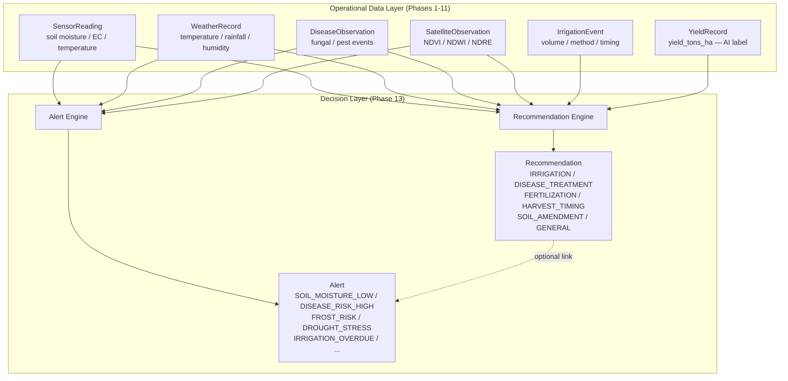
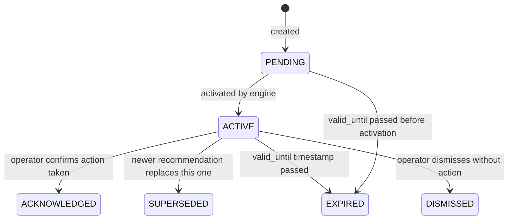

# Phase 13 — Enterprise Decision & Recommendation Platform

**Status:** ✅ Complete  
**Date:** October 2026  
**Migration revisions:** `g1h2i3j4k5l6` (recommendations) → `h2i3j4k5l6m7` (alerts)  
**Revises:** `f6a7b8c9d0e1` (Phase 12 TimescaleDB platform)  
**Migration HEAD:** `h2i3j4k5l6m7`

---

## What This Phase Achieved

Phase 13 transformed AGRIFLOW-AI from a **data collection platform** into an **AI-driven decision platform**. It delivered three major deliverables:

1. **Farm CRUD API** — completed the long-deferred farm management layer (deferred since Phase 1)
2. **Recommendation domain** — structured, trackable AI/agronomist recommendations per field/crop
3. **Alert domain** — real-time condition-triggered alerts with severity levels and acknowledgement lifecycle

Together, these three domains form the **decision layer** of the platform — the surface through which the AI communicates actionable intelligence to farmers and operators.

---

## Architecture Overview

### Full Domain Hierarchy After Phase 13

```
Farm  ←── Phase 13: Farm CRUD API completed
└── Field
     ├── Crop
     │    ├── YieldRecord           (Phase 9)
     │    └── DiseaseObservation    (Phase 10)
     │
     ├── SoilProfile                (Phase 4 — one-to-one)
     │
     ├── WeatherRecord              (Phase 5 — mutable time-series)
     ├── SensorReading              (Phase 7 — append-only telemetry)
     ├── IrrigationEvent            (Phase 8 — mutable operational event)
     ├── SatelliteObservation       (Phase 11 — Earth observation)
     │
     ├── Recommendation             ← Phase 13 NEW (decision layer)
     │    └── [optional] Crop       (crop context, nullable)
     │
     └── Alert                      ← Phase 13 NEW (alert layer)
          ├── [optional] Crop       (crop context, nullable)
          └── [optional] Recommendation (linked recommendation, nullable)
```

### Decision Layer Data Flow



### Recommendation Status Lifecycle



### Alert and Recommendation Relationship

```mermaid
erDiagram
    FIELD ||--o{ RECOMMENDATION : "has"
    FIELD ||--o{ ALERT : "has"
    CROP }o--o{ RECOMMENDATION : "optional context"
    CROP }o--o{ ALERT : "optional context"
    RECOMMENDATION }o--o{ ALERT : "optional link"

    RECOMMENDATION {
        uuid id PK
        uuid field_id FK
        uuid crop_id FK_nullable
        enum recommendation_type
        enum status
        enum priority
        varchar title
        text recommended_action
        numeric confidence_score
        timestamptz valid_from
        timestamptz valid_until
    }

    ALERT {
        uuid id PK
        uuid field_id FK
        uuid crop_id FK_nullable
        uuid recommendation_id FK_nullable
        enum alert_type
        enum severity
        varchar title
        text message
        timestamptz triggered_at
        boolean is_acknowledged
        numeric source_value
        numeric threshold_value
    }
```

---

## Deliverable 1: Farm CRUD API

The Farm entity existed since Phase 1 (migration `8f3a1c2d9e04`), but the CRUD API was explicitly deferred. Phase 13 completed it.

**APIs delivered:**

| Method | Endpoint | Description |
|--------|----------|-------------|
| POST | `/api/v1/farms` | Create a farm |
| GET | `/api/v1/farms` | List all farms (paginated) |
| GET | `/api/v1/farms/{farm_id}` | Get a single farm |
| PATCH | `/api/v1/farms/{farm_id}` | Partial update |
| DELETE | `/api/v1/farms/{farm_id}` | Soft delete (`is_active = false`) |

**Key design notes:**
- `farm_code` (VARCHAR 50) is a unique business identifier — enforced at both schema and service layer
- DELETE performs a **soft delete** (`is_active = false`) rather than physical deletion, preserving the farm's full data history

---

## Deliverable 2: Recommendation Domain

### Database Changes

**PostgreSQL ENUM types created:**

`recommendation_type`:

| Value | Meaning |
|-------|---------|
| `IRRIGATION` | Prescribe an irrigation event |
| `DISEASE_TREATMENT` | Apply a fungicide, pesticide, or biological agent |
| `FERTILIZATION` | Nutrient application — NPK or micronutrient |
| `HARVEST_TIMING` | Optimal harvest window recommendation |
| `SOIL_AMENDMENT` | pH correction, organic matter addition |
| `GENERAL` | General agronomic advisory |

`recommendation_status`:

| Value | Meaning |
|-------|---------|
| `PENDING` | Newly created, not yet delivered to operator |
| `ACTIVE` | Delivered and in the operator's action queue |
| `ACKNOWLEDGED` | Operator confirmed action taken |
| `SUPERSEDED` | A newer recommendation has replaced this one |
| `EXPIRED` | `valid_until` passed without acknowledgement |
| `DISMISSED` | Operator dismissed without acting |

`recommendation_priority`:

| Value |
|-------|
| `LOW` |
| `MEDIUM` |
| `HIGH` |
| `CRITICAL` |

**Table: `recommendations`**

| Column | Type | Nullable | Default | Notes |
|--------|------|----------|---------|-------|
| `id` | UUID (PK) | NOT NULL | — | UUID v4 |
| `field_id` | UUID (FK → fields.id, CASCADE) | NOT NULL | — | Owning field |
| `crop_id` | UUID (FK → crops.id, SET NULL) | NULL | — | Optional crop context; SET NULL on crop delete |
| `recommendation_type` | ENUM | NOT NULL | — | Category |
| `status` | ENUM | NOT NULL | `PENDING` | Lifecycle state |
| `priority` | ENUM | NOT NULL | `MEDIUM` | Urgency |
| `title` | VARCHAR(255) | NOT NULL | — | Short summary |
| `description` | TEXT | NULL | — | Detailed rationale |
| `recommended_action` | TEXT | NOT NULL | — | Specific actionable instruction |
| `recommended_value` | NUMERIC(12,4) | NULL | — | Numeric magnitude (e.g. `25.0` litres/m²) |
| `recommended_unit` | VARCHAR(50) | NULL | — | Unit (e.g. `L/m²`, `kg/ha`) |
| `confidence_score` | NUMERIC(4,3) | NULL | — | AI engine confidence in [0.000, 1.000] |
| `evidence_summary` | TEXT | NULL | — | Data signals that triggered this recommendation |
| `engine_version` | VARCHAR(50) | NULL | — | Recommendation engine version identifier |
| `valid_from` | TIMESTAMPTZ | NOT NULL | — | Start of validity window |
| `valid_until` | TIMESTAMPTZ | NULL | — | End of validity window; NULL = open-ended |
| `acknowledged_at` | TIMESTAMPTZ | NULL | — | Operator acknowledgement timestamp |
| `notes` | TEXT | NULL | — | Operator notes |
| `created_at` | TIMESTAMPTZ | NOT NULL | `now()` | |
| `updated_at` | TIMESTAMPTZ | NOT NULL | `now()` | |

**Indexes (5 total):**

| Name | Columns | Purpose |
|------|---------|---------|
| `ix_recommendations_field_id` | `field_id` | All recommendations for a field |
| `ix_recommendations_crop_id` | `crop_id` | Recommendations by crop cycle |
| `ix_recommendations_field_id_status` | `(field_id, status)` | **Active queue**: `WHERE field_id=? AND status='ACTIVE'` |
| `ix_recommendations_field_id_type` | `(field_id, recommendation_type)` | Filter by recommendation category |
| `ix_recommendations_field_id_valid_from` | `(field_id, valid_from)` | Time-window queries |

**APIs delivered:**

| Method | Endpoint | Description |
|--------|----------|-------------|
| POST | `/api/v1/fields/{field_id}/recommendations` | Create a recommendation |
| GET | `/api/v1/fields/{field_id}/recommendations` | List for field (paginated, max 500) |
| GET | `/api/v1/recommendations/{recommendation_id}` | Get single |
| PATCH | `/api/v1/recommendations/{recommendation_id}` | Update status, priority, notes |
| DELETE | `/api/v1/recommendations/{recommendation_id}` | Delete |

**Business rules enforced:**

| Rule | Where enforced |
|------|---------------|
| Field must exist | `RecommendationService` |
| `crop_id`, if provided, must belong to the same field | `RecommendationService` — raises `CropFieldMismatchError` (422) |
| `valid_until`, if provided, must be after `valid_from` | `RecommendationService` |
| `confidence_score` must be in [0.000, 1.000] | Pydantic schema validator |

---

## Deliverable 3: Alert Domain

### Database Changes

**PostgreSQL ENUM types created:**

`alert_type` (10 values):

| Value | Trigger Condition |
|-------|-----------------|
| `SOIL_MOISTURE_LOW` | Soil moisture sensor below threshold |
| `SOIL_MOISTURE_HIGH` | Soil moisture sensor above threshold |
| `DISEASE_RISK_HIGH` | Disease risk model score above threshold |
| `DISEASE_OUTBREAK` | Active disease observation logged at HIGH/CRITICAL severity |
| `FROST_RISK` | Temperature forecast below crop frost threshold |
| `HEAT_STRESS` | Temperature above crop heat tolerance threshold |
| `DROUGHT_STRESS` | Combined NDWI + soil moisture deficit signal |
| `SENSOR_ANOMALY` | Sensor reading outside physically plausible range |
| `IRRIGATION_OVERDUE` | Expected irrigation window passed without a logged event |
| `HARVEST_WINDOW_OPEN` | AI model predicts optimal harvest window active |

`alert_severity` (4 values):

| Value | Meaning |
|-------|---------|
| `INFO` | Informational — no immediate action required |
| `WARNING` | Monitor closely — action may be needed |
| `HIGH` | Action required within hours |
| `CRITICAL` | Immediate action required |

**Table: `alerts`**

| Column | Type | Nullable | Default | Notes |
|--------|------|----------|---------|-------|
| `id` | UUID (PK) | NOT NULL | — | UUID v4 |
| `field_id` | UUID (FK → fields.id, CASCADE) | NOT NULL | — | Owning field |
| `crop_id` | UUID (FK → crops.id, SET NULL) | NULL | — | Optional crop context |
| `recommendation_id` | UUID (FK → recommendations.id, SET NULL) | NULL | — | Optional linked recommendation |
| `alert_type` | ENUM `alert_type` | NOT NULL | — | Condition that triggered the alert |
| `severity` | ENUM `alert_severity` | NOT NULL | — | `INFO` / `WARNING` / `HIGH` / `CRITICAL` |
| `title` | VARCHAR(255) | NOT NULL | — | Short alert title |
| `message` | TEXT | NOT NULL | — | Detailed alert message |
| `triggered_at` | TIMESTAMPTZ | NOT NULL | — | When condition was detected (not row creation time) |
| `expires_at` | TIMESTAMPTZ | NULL | — | NULL = active until acknowledged |
| `is_acknowledged` | BOOLEAN | NOT NULL | `false` | Acknowledgement flag |
| `acknowledged_at` | TIMESTAMPTZ | NULL | — | Acknowledgement timestamp |
| `source_metric` | VARCHAR(100) | NULL | — | Name of triggering metric (e.g. `soil_moisture_percent`) |
| `source_value` | NUMERIC(12,4) | NULL | — | Actual metric value at trigger time |
| `threshold_value` | NUMERIC(12,4) | NULL | — | Threshold value that was crossed |
| `created_at` | TIMESTAMPTZ | NOT NULL | `now()` | |
| `updated_at` | TIMESTAMPTZ | NOT NULL | `now()` | |

**Key design:** `triggered_at` is the detection time, not `created_at`. An alert may be written to the database with a delay (e.g., batch processing); the `triggered_at` timestamp anchors the alert to when the condition actually occurred.

**Indexes (6 total):**

| Name | Columns | Purpose |
|------|---------|---------|
| `ix_alerts_field_id` | `field_id` | All alerts for a field |
| `ix_alerts_crop_id` | `crop_id` | Alerts by crop cycle |
| `ix_alerts_recommendation_id` | `recommendation_id` | All alerts linked to a recommendation |
| `ix_alerts_field_id_triggered_at` | `(field_id, triggered_at)` | **Alert timeline** — field alerts in time order |
| `ix_alerts_field_id_severity` | `(field_id, severity)` | Filter HIGH/CRITICAL for priority dashboard |
| `ix_alerts_field_id_is_acknowledged` | `(field_id, is_acknowledged)` | **Active alert queue**: unacknowledged alerts |

**APIs delivered:**

| Method | Endpoint | Description |
|--------|----------|-------------|
| POST | `/api/v1/fields/{field_id}/alerts` | Create an alert |
| GET | `/api/v1/fields/{field_id}/alerts` | List all alerts for field (paginated) |
| GET | `/api/v1/fields/{field_id}/alerts/active` | List only unacknowledged alerts |
| GET | `/api/v1/alerts/{alert_id}` | Get single alert |
| PATCH | `/api/v1/alerts/{alert_id}` | Acknowledge alert; update severity or notes |
| DELETE | `/api/v1/alerts/{alert_id}` | Delete |

**Business rules enforced:**

| Rule | Where enforced |
|------|---------------|
| Field must exist | `AlertService` |
| `recommendation_id`, if provided, must belong to the same field | `AlertService` — raises `AlertRecommendationMismatchError` (422) |
| `crop_id`, if provided, must belong to the same field | `AlertService` |
| `expires_at`, if provided, must be after `triggered_at` | `AlertService` |
| `source_value` and `threshold_value` are informational only — no cross-field validation | By design |

---

## Migration Chain (Full)

```
8f3a1c2d9e04  Phase 1  — farms
      ↓
3b7e9f1a2c85  Phase 2  — fields
      ↓
5c2d8e3f7a19  Phase 3  — crops
      ↓
13aabbe35d51  Phase 4  — soil_profiles
      ↓
7d4f2a9b1e63  Phase 5  — weather_records
      ↓
f3a8c1d9e047  Phase 6  — AI readiness columns
      ↓
a8f3d1b6e924  Phase 7  — sensor_readings
      ↓
235a51cdf901  Phase 8  — irrigation_events
      ↓
b7e2a9f4c8d3  Phase 9  — yield_records
      ↓
d3e7b2a9f1c4  Phase 10 — disease_observations
      ↓
a1b2c3d4e5f6  Phase 11 — satellite_observations
      ↓
c9d8e7f6a5b4  Phase 12 — TimescaleDB hypertables + CAs + retention
      ↓
f6a7b8c9d0e1  Phase 12 — continuous aggregate refresh policies
      ↓
g1h2i3j4k5l6  Phase 13 — recommendations
      ↓
h2i3j4k5l6m7  Phase 13 — alerts              ← CURRENT HEAD
```

---

## Enum Summary: `backend/app/core/enums.py` After Phase 13

By Phase 13, `enums.py` contains **14 enum classes** covering all domain classification types:

| Enum | Domain | Phase |
|------|--------|-------|
| `SoilType` | SoilProfile | 4 |
| `CropStatus` | Crop | 3 |
| `SensorType` | SensorReading | 7 |
| `IrrigationMethod` | IrrigationEvent | 8 |
| `WaterSource` | IrrigationEvent | 8 |
| `YieldMeasurementMethod` | YieldRecord | 9 |
| `DiseaseSeverity` | DiseaseObservation | 10 |
| `DiagnosisMethod` | DiseaseObservation | 10 |
| `SatelliteProvider` | SatelliteObservation | 11 |
| `SpectralIndex` | SatelliteObservation | 11 |
| `ProcessingLevel` | SatelliteObservation | 11 |
| `RecommendationType` | Recommendation | 13 |
| `RecommendationStatus` | Recommendation | 13 |
| `RecommendationPriority` | Recommendation | 13 |
| `AlertType` | Alert | 13 |
| `AlertSeverity` | Alert | 13 |

---

## Architecture Established

**Decision layer separation** — Recommendation and Alert are explicitly not stored in the time-series tables (sensor readings, weather records, etc.). They are first-class entities with their own lifecycle, validity windows, and acknowledgement state. This keeps the operational data layer clean and separates *observation* from *decision*.

**Alert → Recommendation linkage** — `alerts.recommendation_id` (nullable FK, SET NULL) creates a soft link from an alert to the recommendation that addresses it. This enables the UI to surface: "You have a `SOIL_MOISTURE_LOW` alert — here is the `IRRIGATION` recommendation that resolves it." The SET NULL on recommendation delete means alerts persist independently of their linked recommendation.

**`crop_id` nullable on both tables** — Recommendations and alerts are primarily field-level constructs. Crop context is optional because alerts like `DROUGHT_STRESS` and `FROST_RISK` apply to the field as a whole, not a specific crop. Crop context is captured when available (e.g., `DISEASE_TREATMENT` recommendations reference the affected crop).

**`triggered_at` vs `created_at` on Alert** — alerts may be written with a delay from batch processing. `triggered_at` is the condition-detection timestamp; `created_at` is the row-creation timestamp. Queries for "alerts in the last 24 hours" should use `triggered_at`, not `created_at`.

**Phase 14 event insertion points** — Both `RecommendationService.create_recommendation()` and `AlertService.create_alert()` are the intended insertion points for Phase 14 Redpanda event publishing (`RecommendationCreated`, `AlertTriggered` domain events).

---

## Business Value

- Farmers receive structured, trackable recommendations rather than raw data
- Alert engine covers 10 condition types from soil, weather, disease, satellite, and irrigation signals
- `confidence_score` on Recommendation enables AI transparency — operators can see how certain the engine is
- `is_acknowledged` + `acknowledged_at` create a complete operator action audit trail
- `source_value` + `threshold_value` on Alert give operators full context on why the alert fired
- Status lifecycle on Recommendation (`PENDING → ACTIVE → ACKNOWLEDGED → SUPERSEDED/EXPIRED/DISMISSED`) supports a full recommendation management workflow

---

## What Was Deferred

- Phase 14: Redpanda event publishing (`RecommendationCreated`, `AlertTriggered` events)
- Phase 14: Alert deduplication (prevent repeated alerts for the same sustained condition)
- Phase 15: Real-time alert websocket push to operator dashboard
- Phase 16: AI model-generated recommendation pipeline (Phase 13 recommendations are manually or rule-based created; full ML pipeline is Phase 16)
- Automated API tests
