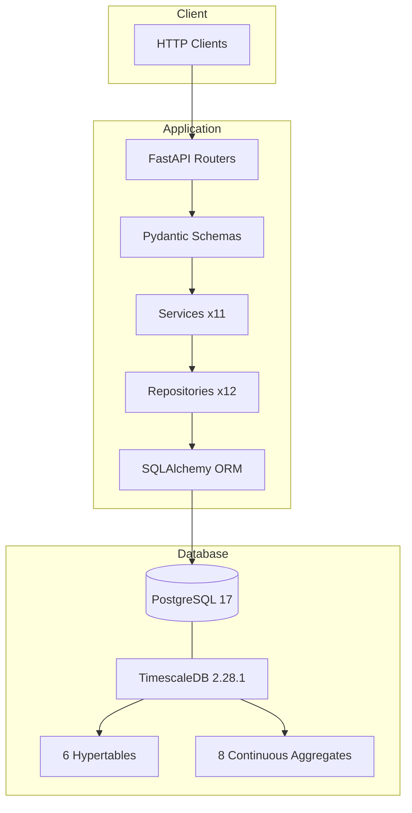
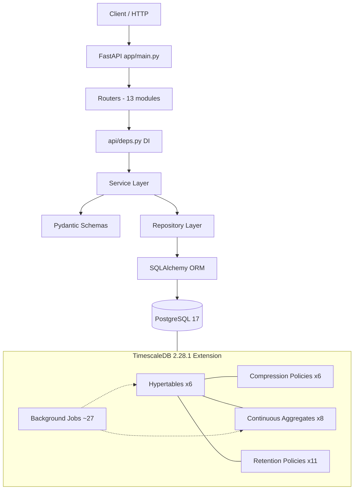

# AGRIFLOW-AI Architecture Archaeology & Implementation History Report

**Document Type:** Repository-Grounded Architecture & Implementation History  
**Scope:** Phase 1 through completed Phase 13  
**Date:** October 2026  
**Evidence Basis:** Source code, Alembic migrations, formal ADRs, tests, configuration, documentation, Git history  
**Status:** Living historical record — implementation wins over documentation where conflicts exist

---

# 1. Executive Summary

AGRIFLOW-AI evolved from a **single-domain FastAPI foundation** (Phase 1) into a **twelve-domain agricultural data platform** with an **enterprise TimescaleDB analytical layer** and a **Decision Intelligence domain** (Phase 13) beneath unchanged repository and API contracts. The transformation is deliberate, migration-driven, and layered:

| Era | Phases | Architectural Character |
|---|---|---|
| **Foundation** | 1 | FastAPI + PostgreSQL + Alembic + Farm model + Podman + health/version APIs |
| **Core agricultural domain** | 2–5 | Farm → Field → Crop hierarchy; SoilProfile (1:1); WeatherRecord (first time-series table) |
| **AI readiness** | 6 | P1 nullable AI columns across 4 tables; no new APIs; yield prediction coverage 18% → 82% |
| **Observational intelligence** | 7–11 | Sensor telemetry (append-only), irrigation events, yield/disease grandchildren, satellite Earth observation |
| **Enterprise time-series platform** | 12 | TimescaleDB 2.28.1 extension; 6 hypertables; compression; 8 continuous aggregates; 11 retention policies |
| **AI decision intelligence** | 13 | Recommendation domain, Alert domain, Farm CRUD API; 5 ADRs; 5 new enums; 2 migrations |

**FACT:** Phase 12 was an **infrastructure phase**. It changed persistence beneath the repository layer with **zero API breaking changes** (verified: no router/schema/service interface changes in Phase 12 migrations).

**FACT:** Phase 13 delivered the Decision Intelligence Layer — `Recommendation` and `Alert` domains as standard PostgreSQL tables (not TimescaleDB hypertables), Farm CRUD API completion, five new enums (14 total in `core/enums.py`), and five formal ADRs (ADR-013-01 through ADR-013-05). Two Alembic migrations (total 18). HEAD: `h2i3j4k5l6m7`.

**FACT:** Git history in this repository begins approximately at **Phase 9–10** (earliest commits reference Phase 9–10 work). Phases 1–8 chronology is reconstructed from Alembic migration timestamps, `docs/07-phase-history.md`, and source structure. See §Git History note below.

---

# 2. Architecture at Phase 1

## Initial architecture (implemented)

**FACT:** Phase 1 established the patterns still used at Phase 12:

| Component | Location | Phase 1 state |
|---|---|---|
| FastAPI entry | `backend/app/main.py` | App factory, CORS, global exception handler, lifespan |
| Settings | `backend/app/core/config/settings.py` | Pydantic `BaseSettings`, `.env` loading |
| Logging | `backend/app/core/logging/logger.py` | structlog JSON/console |
| ORM base | `backend/app/db/base.py` | `Base`, `AuditableModel` (UUID PK + timestamps) |
| Session | `backend/app/db/session.py` | asyncpg async engine + pool |
| Migrations | `backend/app/db/migrations/` | Alembic async env |
| Farm model | `backend/app/db/models/farm.py` | Aggregate root |
| Farm repository | `backend/app/db/repositories/farm.py` | `BaseRepository[Farm]` |
| Health API | `backend/app/api/health/router.py` | `/health/live`, `/health/ready` |
| Version API | `backend/app/api/version/router.py` | `/version` |
| Docker | `docker-compose.yml`, `backend/Dockerfile` | PostgreSQL + backend (TimescaleDB image added later in Phase 12) |

## Major Phase 1 architectural decisions

### UUID primary key strategy
- **Decision:** UUID v4 client-generated primary keys on all domain entities (`UUIDPrimaryKeyMixin` in `backend/app/db/base.py`).
- **Problem:** Sequential integer IDs expose enumeration in public APIs.
- **Rationale:** Security and distributed ID generation readiness.
- **Alternatives:** Not documented formally.
- **Consequences:** All APIs use UUID path parameters; composite PK addition in Phase 12 retained UUID as PK component.
- **Future impact:** Enabled TimescaleDB composite PK `(id, time_column)` without changing API identity semantics.
- **Status:** **INFERRED — NO FORMAL ADR FOUND** (documented in `docs/07-phase-history.md`).

### Server-side audit timestamps
- **Decision:** `created_at` / `updated_at` as `TIMESTAMPTZ NOT NULL` with PostgreSQL `now()` defaults.
- **Problem:** Application clock skew in distributed deployments.
- **Rationale:** DB-authoritative timestamps.
- **Consequences:** All 10 domain tables carry audit columns; no separate audit log table.
- **Status:** **INFERRED — NO FORMAL ADR FOUND**.

### Migration-as-code
- **Decision:** Alembic as sole schema evolution mechanism; first migration `8f3a1c2d9e04` creates `farms`.
- **Problem:** Ad-hoc SQL schema changes are untraceable.
- **Rationale:** Reproducible environments, Azure-ready deployment.
- **Consequences:** 16 linear migrations by Phase 12; no branches.
- **Status:** **INFERRED — NO FORMAL ADR FOUND**.

### Farm without public CRUD API (Phase 1–12 gap — resolved Phase 13)
- **Decision:** Farm ORM + repository exist; no Farm service, schema, or router.
- **Problem:** Fields reference `farm_id`; farm creation assumed via seed/migration/direct DB.
- **Rationale:** Phase 2 Field domain uses farm as parent reference only.
- **Consequences:** Farm management API absent at Phase 12; `FieldService` validates farm existence via `FarmRepository`. **RESOLVED in Phase 13** — full Farm vertical slice (service, schema, router) with 5 CRUD endpoints delivered.
- **Status:** **INFERRED — NO FORMAL ADR FOUND**; noted in `palantir-alignment.md`.

### Repository pattern (minimal at Phase 1)
- **Decision:** `BaseRepository` generic CRUD; `FarmRepository` extends it.
- **Status:** Expanded Phase 2 onward.

### Dependency injection
- **Decision:** FastAPI `Depends()` for session and services (`backend/app/api/deps.py`).
- **Note:** Secondary `get_db()` in `backend/app/db/dependencies.py` also exists but is **not used by API routers** — **INFERRED — NO FORMAL ADR FOUND**.

### Container foundation
- **Decision:** Multi-stage `backend/Dockerfile`; compose stack for local dev.
- **Phase 12 update:** compose file uses `timescale/timescaledb:2.28.1-pg17` image.
- **Phase 13 update:** Docker Desktop replaced by **Podman Desktop**; `docker-compose.yml` renamed to `compose.yaml`; `docker compose` → `podman compose`. Container image unchanged.

---

# 3. Phase-by-Phase Implementation History

## Phase 1 — Foundation

### Objective
Establish FastAPI backend, PostgreSQL, Alembic, Farm domain, Docker, health/version APIs.

### Problem Being Solved
Need a reproducible agricultural platform foundation with governed schema evolution.

### Implementation
- FastAPI application structure
- PostgreSQL integration via SQLAlchemy 2.x async
- Alembic migration framework
- `farms` table and `Farm` ORM model
- `FarmRepository` (BaseRepository only)
- Health and version endpoints
- Docker multi-stage build

### Files / Modules
- `backend/app/main.py`
- `backend/app/db/base.py`, `session.py`
- `backend/app/db/models/farm.py`
- `backend/app/db/repositories/base.py`, `farm.py`
- `backend/app/db/migrations/versions/001_create_farms_table.py`
- `backend/app/api/health/router.py`, `version/router.py`
- `backend/Dockerfile`, `docker-compose.yml`

### Database Changes
- Migration `8f3a1c2d9e04`: CREATE `farms` (UUID PK, farm_code UNIQUE, location NUMERIC coords, is_active, audit columns)

### API Changes
- `GET /api/v1/health/live`
- `GET /api/v1/health/ready`
- `GET /api/v1/version`
- No Farm CRUD endpoints

### Service Layer Changes
- None (Farm has repository only)

### Repository Changes
- `BaseRepository`: get_by_id, get_all, create, update, delete
- `FarmRepository`: typed wrappers only

### Architectural Decisions
- UUID PK, audit model, Alembic-first — **INFERRED — NO FORMAL ADR FOUND**

### Testing / Validation
- `docs/07-phase-history.md` records automated testing as **deferred** in Phase 1.
- **FACT:** `backend/app/tests/test_health.py` exists (2 tests) — likely added later; not attributable to Phase 1 commit history.

### Business Capability Delivered
Farm entity persistence as aggregate root; platform operability probes.

### Future Architecture Enabled
Field domain (Phase 2), entire domain hierarchy, migration discipline.

---

## Phase 2 — Field Domain

### Objective
Second-level domain entity under Farm; full vertical slice (model → API).

### Problem Being Solved
Farm management requires subdivided field parcels with geospatial metadata.

### Implementation
- `Field` ORM with `farm_id` FK
- `FieldRepository`, `FieldService`, Pydantic schemas
- Field API router (5 endpoints)
- `FieldServiceDep` in `backend/app/api/deps.py`

### Files / Modules
- `backend/app/db/models/field.py`
- `backend/app/db/repositories/field.py`
- `backend/app/services/field.py`
- `backend/app/schemas/field.py`
- `backend/app/api/fields/router.py`
- Migration `3b7e9f1a2c85`

### Database Changes
- CREATE `fields`: `farm_id` FK → `farms.id`, name, area, soil_type (VARCHAR), lat/long, audit columns
- INDEX `ix_fields_farm_id`

### API Changes
| Method | Path |
|---|---|
| POST | `/farms/{farm_id}/fields` |
| GET | `/farms/{farm_id}/fields` |
| GET | `/fields/{field_id}` |
| PATCH | `/fields/{field_id}` |
| DELETE | `/fields/{field_id}` |

### Service Layer Changes
- Rules: farm exists; unique field name per farm (case-insensitive); existence on update/delete
- Exceptions: `FarmNotFoundError`, `FieldNotFoundError`, `DuplicateFieldNameError`

### Repository Changes
- `get_by_farm_id(farm_id, limit, offset)` ordered by name

### Architectural Decisions
- Clean Architecture vertical slice established — **INFERRED — NO FORMAL ADR FOUND**
- Service receives repositories, not session — **INFERRED — NO FORMAL ADR FOUND**

### Testing / Validation
- Documented in phase history; no domain-specific test files in repository.

### Business Capability Delivered
Field management under farms; geospatial foundation per field.

### Future Architecture Enabled
Crop (Phase 3), all field-anchored time-series domains (Phases 5–8, 11).

---

## Phase 3 — Crop Domain

### Objective
Crop lifecycle entity under Field.

### Problem Being Solved
Track crop cycles with agronomic status machine.

### Implementation
- `Crop` ORM, `CropStatus` enum (model-local)
- Full vertical slice
- Migration `5c2d8e3f7a19`

### Database Changes
- CREATE `crops`: `field_id` FK, dates, `crop_status` enum (PLANNED/PLANTED/GROWING/HARVESTED)
- INDEX `ix_crops_field_id`
- **Note:** Enum `.create()` commented out in migration — enum lifecycle lesson for later phases

### API Changes
| Method | Path |
|---|---|
| POST | `/fields/{field_id}/crops` |
| GET | `/fields/{field_id}/crops` |
| GET | `/crops/{crop_id}` |
| PATCH | `/crops/{crop_id}` |
| DELETE | `/crops/{crop_id}` |

Filter: `status` query param on list.

### Service Layer Changes
- Harvest date ≥ planting date; yield fields only when HARVESTED; non-negative yield/seeding rates
- Exceptions: `CropNotFoundError`, `InvalidHarvestDateError`, `InvalidYieldDataError`

### Repository Changes
- `list_by_field(field_id, status?, limit, offset)` — planting_date DESC
- `exists(record_id)`

### Architectural Decisions
- `CropStatus` in model file, not `core/enums.py` — **INFERRED — NO FORMAL ADR FOUND**

### Testing / Validation
- No crop-specific tests in repository.

### Business Capability Delivered
Crop lifecycle management and planning foundation.

### Future Architecture Enabled
Yield and disease grandchild domains (Phases 9–10).

---

## Phase 4 — Soil Intelligence Domain

### Objective
One-to-one soil profile per field.

### Problem Being Solved
Soil nutrient and texture data for precision agriculture.

### Implementation
- `SoilProfile` ORM, `SoilType` enum (model-local)
- Migration `13aabbe35d51`
- 4 API endpoints (nested create/get under field; patch/delete by profile id)

### Database Changes
- CREATE `soil_profiles`: `field_id` FK **UNIQUE** (1:1), `soil_type` enum, ph, nutrients, notes
- UNIQUE INDEX on `field_id`

### API Changes
| Method | Path |
|---|---|
| POST | `/fields/{field_id}/soil-profile` |
| GET | `/fields/{field_id}/soil-profile` |
| PATCH | `/soil-profiles/{soil_profile_id}` |
| DELETE | `/soil-profiles/{soil_profile_id}` |

### Service Layer Changes
- One profile per field; field must exist; pH and nutrient validation
- Exceptions: `SoilProfileNotFoundError`, `DuplicateSoilProfileError`

### Repository Changes
- `get_by_field_id`, `exists_for_field`

### Architectural Decisions
- 1:1 enforced at DB (UNIQUE) + service — **INFERRED — NO FORMAL ADR FOUND**
- **Constraint for Phase 12:** `soil_profiles` permanently excluded from hypertable conversion (ADR-002): no time dimension; UNIQUE incompatible with partitioning

### Business Capability Delivered
Soil profile management; nutrient tracking.

### Future Architecture Enabled
AI soil features (Phase 6), CDD soil factory, yield/disease covariates.

---

## Phase 5 — Weather Intelligence Domain

### Objective
Field-level historical weather observations.

### Problem Being Solved
Climate data foundation for irrigation and yield models.

### Implementation
- `WeatherRecord` ORM — first **time-keyed** domain table
- Migration `7d4f2a9b1e63`
- 5 CRUD endpoints

### Database Changes
- CREATE `weather_records`: `field_id` FK, `recorded_at TIMESTAMPTZ NOT NULL`, weather measurements, `data_source` default MANUAL
- INDEXes on `field_id`, `recorded_at` (no compound index initially — added Phase 12)

### API Changes
| Method | Path |
|---|---|
| POST | `/fields/{field_id}/weather-records` |
| GET | `/fields/{field_id}/weather-records` |
| GET | `/weather-records/{weather_record_id}` |
| PATCH | `/weather-records/{weather_record_id}` |
| DELETE | `/weather-records/{weather_record_id}` |

### Service Layer Changes
- Future timestamp rejection; humidity [0,100]; rainfall/wind non-negative; temperature range on sparse PATCH
- Exceptions: `WeatherRecordNotFoundError`, `InvalidWeatherTimestampError`, `InvalidWeatherMeasurementError`, `InvalidTemperatureRangeError`

### Repository Changes
- `list_by_field` — recorded_at DESC; `exists`

### Architectural Decisions
- `recorded_at` as partition key candidate — **INFERRED — NO FORMAL ADR FOUND** (forward-compatible comments in model)
- Mutable weather records (PATCH allowed)

### Business Capability Delivered
Historical weather tracking per field.

### Future Architecture Enabled
Phase 6 GDD/ET₀ columns; Phase 12 hypertable on `recorded_at`; `ca_weather_daily`, `ca_weather_weekly`.

---

## Phase 6 — AI Readiness Foundation

### Objective
Add P1 AI attributes without breaking APIs.

### Problem Being Solved
Yield prediction models blocked by missing schema features (18% coverage per assessment doc).

### Implementation
- Migration `f3a8c1d9e047` — 10 nullable columns across 4 tables
- Schema updates to expose new fields in API responses
- No new endpoints

### Database Changes
| Table | Columns added |
|---|---|
| `crops` | actual_yield_tons_ha, expected_yield_tons_ha, seeding_rate_kg_ha, growth_stage |
| `weather_records` | solar_radiation_wm2, temperature_min_c, temperature_max_c |
| `soil_profiles` | soil_depth_cm, cation_exchange_capacity_meq |
| `fields` | elevation_m |

### API Changes
- **None new** — existing endpoints return additional nullable fields

### Service Layer Changes
- Crop yield validation rules extended for new fields

### Architectural Decisions
- Nullable ADD COLUMN only (instantaneous DDL) — documented in migration
- Assessment-driven attribute selection — `../phases/phase06/ai-data-readiness-assessment.md`

### Testing / Validation
- Phase history documents backward compatibility verification; no automated test files.

### Business Capability Delivered
Yield prediction feature coverage 18% → 82% (per roadmap documentation).

### Future Architecture Enabled
Phase 12 TimescaleDB feature pipelines; Phase 13 Recommendation/Alert domains consumed these AI-ready attributes as decision inputs.

---

## Phase 7 — Sensor Telemetry

### Objective
Append-only IoT telemetry domain.

### Problem Being Solved
Persist sensor readings for precision agriculture and future real-time pipelines.

### Implementation
- `SensorType` enum in `backend/app/core/enums.py` (first shared enum module usage)
- `SensorReading` ORM, repository, service, router
- Migration `a8f3d1b6e924`
- 4 endpoints (no PATCH)

### Database Changes
- CREATE PostgreSQL enum `sensor_type` (11 values)
- CREATE `sensor_readings`: `field_id` ON DELETE CASCADE, `sensor_value DOUBLE PRECISION`, `recorded_at TIMESTAMPTZ`
- 5 indexes including compound `(field_id, recorded_at)`, `(sensor_type, recorded_at)`

### API Changes
| Method | Path |
|---|---|
| POST | `/fields/{field_id}/sensor-readings` |
| GET | `/fields/{field_id}/sensor-readings` |
| GET | `/sensor-readings/{sensor_reading_id}` |
| DELETE | `/sensor-readings/{sensor_reading_id}` |

**Note:** List returns **all** readings — no pagination (ADR-007-21 per documentation).

### Service Layer Changes
- Append-only (no update method); timezone-aware `recorded_at`; no future timestamps
- **Extension point** in `create_sensor_reading()` for future Redpanda/Temporal (ADR-007-26)
- Exceptions: `SensorReadingNotFoundError`, `InvalidSensorTimestampError`

### Architectural Decisions (DOCUMENTATION-ONLY — ADR-007 series)
| ID | Decision |
|---|---|
| ADR-007-24 | No future timestamps |
| ADR-007-25 | Timezone-naive timestamps rejected |
| ADR-007-27 | Append-only immutability |
| ADR-007-26 | Service as event-streaming boundary |
| ADR-007 | DOUBLE PRECISION for sensor values |

**Status:** DOCUMENTATION-ONLY — no file in `docs/adr/`

### Business Capability Delivered
IoT telemetry persistence; Digital Twin / alert pipeline preparation (comments only).

### Future Architecture Enabled
TimescaleDB hypertable (Phase 12); Redpanda (Phase 14); highest-frequency time-series domain.

---

## Phase 8 — Irrigation Management

### Objective
Mutable operational irrigation event logging.

### Problem Being Solved
Track water applications with method and source classification for FAO-56 water balance.

### Implementation
- `IrrigationMethod`, `WaterSource` in `core/enums.py`
- Migration `235a51cdf901`
- Full CRUD with pagination

### Database Changes
- Enums: `irrigation_method` (8), `water_source` (5)
- CREATE `irrigation_events`: `started_at TIMESTAMPTZ`, optional `ended_at`, volume, method, source
- Compound index `(field_id, started_at)`

### API Changes
| Method | Path |
|---|---|
| POST | `/fields/{field_id}/irrigation-events` |
| GET | `/fields/{field_id}/irrigation-events` |
| GET | `/irrigation-events/{event_id}` |
| PATCH | `/irrigation-events/{event_id}` |
| DELETE | `/irrigation-events/{event_id}` |

### Service Layer Changes
- Mutable PATCH; sparse PATCH ordering guard (`ended_at >= started_at`)
- Future timestamp rejection on `started_at`

### Architectural Decisions (DOCUMENTATION-ONLY — ADR-008 series)
| ID | Decision |
|---|---|
| ADR-008-01 | `postgresql.ENUM` + `create_type=False` lifecycle |
| ADR-008-02 | IrrigationEvent is mutable |
| ADR-008-03 | `started_at` as TimescaleDB partition key |
| ADR-008-04 | Sparse PATCH ordering guard |
| ADR-008-05 | Enums in `core/enums.py` |

### Business Capability Delivered
Irrigation event logging; water-use efficiency computable with yield (Phase 9).

### Future Architecture Enabled
Phase 12 hypertable; `ca_irrigation_monthly`; Phase 14 irrigation recommendation engine (planned).

---

## Phase 9 — Yield Intelligence

### Objective
First **grandchild** domain — yield observations per crop cycle.

### Problem Being Solved
Discrete yield measurements as AI training labels.

### Implementation
- `YieldMeasurementMethod` enum in `core/enums.py`
- Migration `b7e2a9f4c8d3`
- Crop-anchored API paths

### Database Changes
- Enum `yield_measurement_method`
- CREATE `yield_records`: `crop_id` + **denormalized** `field_id`, `recorded_at`, yield value, quality attrs
- Compound index `(crop_id, recorded_at)`

### API Changes
| Method | Path |
|---|---|
| POST | `/crops/{crop_id}/yield-records` |
| GET | `/crops/{crop_id}/yield-records` |
| GET | `/yield-records/{yield_record_id}` |
| PATCH | `/yield-records/{yield_record_id}` |
| DELETE | `/yield-records/{yield_record_id}` |

### Service Layer Changes
- `field_id` resolved from crop; `crop_id` immutable; `area_harvested_ha > 0` service guard
- Redpanda extension point comment on create

### Architectural Decisions (DOCUMENTATION-ONLY — ADR-009 series)
| ID | Decision |
|---|---|
| ADR-009-01 | Anchor on `crop_id` (yield per crop cycle) |
| ADR-009-02 | Denormalized `field_id` for direct field queries |
| ADR-009-04 | Mutable PATCH |
| ADR-009-05 | `crop_id` immutable after create |
| ADR-009-06 | area_harvested_ha > 0 (not >= 0) |

### Git History
- Earliest commit in repository: `a641851 phase 9 : docs: updated plantir flow document`

### Business Capability Delivered
Granular yield labels; water-use efficiency with irrigation events.

### Future Architecture Enabled
Phase 12 hypertable; `ca_yield_seasonal`; **permanent retention** (ADR-005 exempt).

---

## Phase 10 — Disease Observation

### Objective
Crop-cycle disease pressure observations.

### Problem Being Solved
Plant health intelligence and disease risk model labels.

### Implementation
- `DiseaseSeverity`, `DiagnosisMethod` in `core/enums.py`
- Migration `d3e7b2a9f1c4`
- Dual list paths (by crop and by field)

### Database Changes
- Enums: `disease_severity`, `diagnosis_method`
- CREATE `disease_observations`: crop_id + denormalized field_id, observed_at, disease_name, severity, etc.
- 6 indexes

### API Changes
| Method | Path |
|---|---|
| POST | `/crops/{crop_id}/disease-observations` |
| GET | `/crops/{crop_id}/disease-observations` |
| GET | `/fields/{field_id}/disease-observations` |
| GET | `/disease-observations/{observation_id}` |
| PATCH | `/disease-observations/{observation_id}` |
| DELETE | `/disease-observations/{observation_id}` |

### Architectural Decisions (DOCUMENTATION-ONLY — ADR-010 series)
- Same grandchild + denormalized field_id pattern as yield (ADR-010-01/02)
- Mutable; crop_id immutable (ADR-010-05)

### Business Capability Delivered
Disease monitoring; field-scoped disease history without JOIN through crops.

### Future Architecture Enabled
Phase 14 Disease Risk Scoring Engine (ML, planned); `ca_disease_weekly` analytical read path.

---

## Phase 11 — Satellite Observation

### Objective
Field-anchored Earth observation / spectral index time-series.

### Problem Being Solved
Remote sensing features (NDVI, NDWI, etc.) for yield, disease, irrigation models.

### Implementation
- `SatelliteProvider`, `SpectralIndex`, `ProcessingLevel` in `core/enums.py`
- Migration `a1b2c3d4e5f6`
- Richest query API surface (9 endpoints)

### Database Changes
- 3 PostgreSQL enums
- CREATE `satellite_observations`: field_id, observed_at, provider, processing_level, spectral_index, index_value, metadata
- 7 indexes including compounds

### API Changes
| Method | Path |
|---|---|
| POST | `/fields/{field_id}/satellite-observations` |
| GET | `/fields/{field_id}/satellite-observations` |
| GET | `/fields/{field_id}/satellite-observations/range` |
| GET | `/fields/{field_id}/satellite-observations/latest` |
| GET | `/satellite-observations/by-provider/{provider}` |
| GET | `/satellite-observations/by-processing-level/{level}` |
| GET | `/satellite-observations/{observation_id}` |
| PATCH | `/satellite-observations/{observation_id}` |
| DELETE | `/satellite-observations/{observation_id}` |

### Repository Changes
- `list_by_field_and_date_range`, `get_latest_by_field_and_spectral_index`, `list_by_provider`, `list_by_processing_level` — primary AI feature extraction patterns

### Architectural Decisions (DOCUMENTATION-ONLY — ADR-011 series per phase history)
- Field-anchored (not crop) — spectral data covers entire field footprint

### Testing / Validation
- Phase history: **Validation Deferred | Testing Deferred** for Phase 11

### Business Capability Delivered
NDVI/EVI/LAI/NDWI time-series foundation.

### Future Architecture Enabled
Phase 12 hypertable + `ca_satellite_daily`; Phase 14 AI engines (ML prediction planned).

---

## Phase 12 — TimescaleDB Time-Series Foundation

### Objective
Upgrade six time-series tables to TimescaleDB hypertables with compression, continuous aggregates, and retention — **without changing API, service, or repository interfaces**.

### Problem Being Solved
Enterprise-scale time-series storage and analytics for AI workloads; repeated aggregation cost at query time.

### Implementation (5 formal ADRs, 5 migrations)

| Step | Migration | Deliverable |
|---|---|---|
| 1D | `f1e2d3c4b5a6` | TimescaleDB extension enablement (ADR-001) |
| 1E-B | `c9d8e7f6a5b4` | 6 hypertables + composite PKs (ADR-002) |
| 2B | `d4f5e6a7b8c9` | 6 compression policies (ADR-003) |
| 3B | `e5f6a7b8c9d0` | 8 continuous aggregates + refresh policies (ADR-004) |
| 4B | `f6a7b8c9d0e1` | 11 retention policies (ADR-005) |

**CDD (Canonical Development Dataset):** `backend/app/cdd/` — deterministic 458,645-row validation corpus (v1.0.0 per documentation); orchestrator, factories, validation rules, persistence.

### Database Changes
- Extension: `CREATE EXTENSION timescaledb`
- 6 tables → hypertables with composite PK `(id, time_column)`
- 8 CA views (not ORM-mapped)
- Compression + retention background jobs (~27 per roadmap)

### API Changes
- **None** — explicit Phase 12 constraint in all TimescaleDB migrations

### Service / Repository Changes
- **None** to interfaces — repository transparency principle

### Architectural Decisions (FORMAL ADRs)
See §7 ADR Register — ADR-001 through ADR-005.

### Testing / Validation
- Phase 12 Step 2C/3C/4C runtime validation reports in `../archive/phase12/reports/`
- CDD validation framework in `backend/app/cdd/validation/`
- **FACT:** No automated pytest suite for TimescaleDB in `backend/app/tests/`

### Business Capability Delivered
Enterprise time-series storage, compression, pre-computed rollups, governed lifecycle.

### Future Architecture Enabled
Phase 13 Decision Intelligence layer built on these analytical foundations; Feature Store (Phase 15 planned); Phase 14 ML model training inputs from CAs.

---

## Phase 13 — AI Decision Intelligence Layer

### Objective
Deliver the Decision Intelligence infrastructure: Recommendation domain, Alert domain, Farm CRUD API completion.

### Problem Being Solved
Platform lacked decision persistence — there was no structure to record AI-generated recommendations or system-detected alerts. Farm entity also lacked a public CRUD API despite being the aggregate root since Phase 1.

### Implementation (5 formal ADRs, 2 migrations)
- `RecommendationType`, `RecommendationStatus`, `RecommendationPriority`, `AlertType`, `AlertSeverity` added to `core/enums.py` (14 total)
- `Recommendation` ORM, repository, service, router — 5 endpoints
- `Alert` ORM, repository, service, router — 5 endpoints
- `Farm` service, schema, router — 5 endpoints (vertical slice completed)
- Migrations `g1h2i3j4k5l6` and `h2i3j4k5l6m7`

### Files / Modules
- `backend/app/db/models/recommendation.py`, `alert.py`
- `backend/app/db/repositories/recommendation.py`, `alert.py`
- `backend/app/services/recommendation.py`, `alert.py`, `farm.py`
- `backend/app/schemas/recommendation.py`, `alert.py`, `farm.py`
- `backend/app/api/recommendations/router.py`, `alerts/router.py`, `farms/router.py`

### Database Changes

| Migration | Deliverable |
|---|---|
| `g1h2i3j4k5l6` | `recommendations` table; 3 new enums (`recommendation_type`, `recommendation_status`, `recommendation_priority`) |
| `h2i3j4k5l6m7` | `alerts` table; 2 new enums (`alert_type`, `alert_severity`) |

**Key schema decisions:**
- `crop_id` nullable with `SET NULL` on Recommendation (ADR-013-01) and Alert (ADR-013-02) — field-level entities; crop context optional
- `recommendation_id` nullable FK on Alert with `SET NULL` — soft link enabling traceability without hard dependency
- `triggered_at TIMESTAMPTZ NOT NULL` on Alert — event detection time, distinct from `created_at` (ADR-013-03)
- `confidence_score NUMERIC(4,3)` on Recommendation — exact decimal arithmetic for ML threshold comparisons (ADR-013-04)
- `engine_version VARCHAR(50)` on Recommendation — ML model provenance (ADR-013-05)
- Both tables are **standard PostgreSQL** — not TimescaleDB hypertables (low-volume mutable decision records)

### API Changes

| Method | Path |
|---|---|
| POST | `/api/v1/farms` |
| GET | `/api/v1/farms` |
| GET | `/api/v1/farms/{farm_id}` |
| PATCH | `/api/v1/farms/{farm_id}` |
| DELETE | `/api/v1/farms/{farm_id}` |
| POST | `/api/v1/fields/{field_id}/recommendations` |
| GET | `/api/v1/fields/{field_id}/recommendations` |
| GET | `/api/v1/recommendations/{recommendation_id}` |
| PATCH | `/api/v1/recommendations/{recommendation_id}` |
| DELETE | `/api/v1/recommendations/{recommendation_id}` |
| POST | `/api/v1/fields/{field_id}/alerts` |
| GET | `/api/v1/fields/{field_id}/alerts` |
| GET | `/api/v1/alerts/{alert_id}` |
| PATCH | `/api/v1/alerts/{alert_id}` |
| DELETE | `/api/v1/alerts/{alert_id}` |

### Architectural Decisions (FORMAL ADRs — ADR-013 series)

| ID | Decision |
|---|---|
| ADR-013-01 | `crop_id` nullable with SET NULL on Recommendation — field-level entity |
| ADR-013-02 | `crop_id` nullable with SET NULL on Alert — field-level entity |
| ADR-013-03 | `triggered_at` mandatory on Alert — event detection time distinct from `created_at` |
| ADR-013-04 | `confidence_score NUMERIC(4,3)` — exact decimal arithmetic for ML threshold comparisons |
| ADR-013-05 | `engine_version VARCHAR(50)` — ML model provenance tracking |

### Infrastructure Change
- Docker Desktop → **Podman Desktop** (same container image `timescale/timescaledb:2.28.1-pg17`)
- `docker-compose.yml` → `compose.yaml`
- `docker compose` → `podman compose`

### Business Capability Delivered
Decision persistence layer — AI-generated recommendations and system alerts can now be stored, queried, and managed. Farm CRUD gap (Phase 1 debt) resolved.

### Future Architecture Enabled
Phase 14 ML prediction engines (Yield, Disease Risk, Irrigation) will write inference results into `recommendations` and `alerts` via the established service layer. Alert domain is the alerting backbone for the Phase 14 event-driven pipeline.

---

# 4. Complete Database Evolution

## Master migration table

| # | Revision | File | Down | Phase | Purpose | Upgrade | Downgrade |
|---|---|---|---|---|---|---|---|
| 1 | `8f3a1c2d9e04` | 001_create_farms_table | — | 1 | Farm root entity | CREATE farms | DROP farms |
| 2 | `3b7e9f1a2c85` | 002_create_fields_table | 8f3a… | 2 | Field under farm | CREATE fields | DROP fields |
| 3 | `5c2d8e3f7a19` | 003_create_crops_table | 3b7e… | 3 | Crop cycles | CREATE crops | DROP crops |
| 4 | `13aabbe35d51` | 13aabbe35d51_add_soil_profiles | 5c2d… | 4 | 1:1 soil profile | CREATE soil_profiles | DROP |
| 5 | `7d4f2a9b1e63` | 004_create_weather_records | 13aab… | 5 | Weather time-series | CREATE weather_records | DROP |
| 6 | `f3a8c1d9e047` | 005_add_p1_ai_readiness_columns | 7d4f… | 6 | P1 AI columns | ADD 10 columns | DROP columns |
| 7 | `a8f3d1b6e924` | 006_create_sensor_readings | f3a8… | 7 | IoT telemetry | CREATE sensor_readings + enum | DROP + enum |
| 8 | `235a51cdf901` | 235a51cdf901_create_irrigation_events | a8f3… | 8 | Irrigation events | CREATE irrigation_events + enums | DROP |
| 9 | `b7e2a9f4c8d3` | b7e2a9f4c8d3_create_yield_records | 235a… | 9 | Yield observations | CREATE yield_records + enum | DROP |
| 10 | `d3e7b2a9f1c4` | d3e7b2a9f1c4_create_disease_observations | b7e2… | 10 | Disease observations | CREATE disease_observations + enums | DROP |
| 11 | `a1b2c3d4e5f6` | a1b2c3d4e5f6_create_satellite_observations | d3e7… | 11 | Satellite indices | CREATE satellite_observations + enums | DROP |
| 12 | `f1e2d3c4b5a6` | f1e2d3c4b5a6_enable_timescaledb_extension | a1b2… | 12-1D | TimescaleDB ext | CREATE EXTENSION | DROP EXTENSION (dev only) |
| 13 | `c9d8e7f6a5b4` | c9d8e7f6a5b4_convert_time_series_tables | f1e2… | 12-1E | Hypertables | Composite PK + create_hypertable ×6 | Revert PK (empty dev only) |
| 14 | `d4f5e6a7b8c9` | d4f5e6a7b8c9_enable_compression | c9d8… | 12-2B | Compression | add_compression_policy ×6 | remove policies |
| 15 | `e5f6a7b8c9d0` | e5f6a7b8c9d0_create_continuous_aggregates | d4f5… | 12-3B | 8 CAs + refresh | CREATE CA views | DROP CA views |
| 16 | `f6a7b8c9d0e1` | f6a7b8c9d0e1_enable_retention | e5f6… | 12-4B | Retention | add_retention_policy ×11 | remove policies |
| 17 | `g1h2i3j4k5l6` | g1h2i3j4k5l6_create_recommendations_table | f6a7… | 13 | Recommendation domain | CREATE recommendations + 3 enums | DROP |
| 18 | `h2i3j4k5l6m7` | h2i3j4k5l6m7_create_alerts_table | g1h2… | 13 | Alert domain | CREATE alerts + 2 enums | DROP |

**Current head:** `h2i3j4k5l6m7`

---

# 5. Current Database Schema — Phase 13

## PostgreSQL Reference / Relational Tables

### `farms`
- **Purpose:** Aggregate root; farm identity and location
- **PK:** `id` UUID
- **Unique:** `farm_code`
- **Mutability:** Mutable (no dedicated API)
- **TimescaleDB:** No

### `fields`
- **Purpose:** Subdivided parcel under farm
- **PK:** `id` UUID | **FK:** `farm_id` → farms
- **Mutability:** Mutable
- **TimescaleDB:** No

### `crops`
- **Purpose:** Crop cycle with status machine
- **PK:** `id` UUID | **FK:** `field_id` → fields
- **Enum:** `crop_status`
- **AI columns:** actual/expected yield, seeding_rate, growth_stage (Phase 6)
- **TimescaleDB:** No

### `soil_profiles`
- **Purpose:** 1:1 soil composition per field
- **PK:** `id` UUID | **FK:** `field_id` UNIQUE → fields
- **Enum:** `soil_type`
- **TimescaleDB:** No — permanently relational per ADR-002

### `recommendations` (Phase 13)
- **Purpose:** AI-generated decision recommendations per field
- **PK:** `id` UUID | **FK:** `field_id` → fields; `crop_id` → crops (nullable, SET NULL)
- **Enums:** `recommendation_type`, `recommendation_status`, `recommendation_priority`
- **Key fields:** `confidence_score NUMERIC(4,3)`, `engine_version VARCHAR(50)`, `valid_from / valid_until TIMESTAMPTZ`
- **Mutability:** Mutable (full CRUD)
- **TimescaleDB:** No — standard PostgreSQL (low-volume mutable decision records, ADR-013-01)

### `alerts` (Phase 13)
- **Purpose:** System-detected operational alerts per field
- **PK:** `id` UUID | **FK:** `field_id` → fields; `crop_id` → crops (nullable, SET NULL); `recommendation_id` → recommendations (nullable, SET NULL)
- **Enums:** `alert_type`, `alert_severity`
- **Key fields:** `triggered_at TIMESTAMPTZ NOT NULL` (event detection time, ADR-013-03), `resolved_at TIMESTAMPTZ` (optional)
- **Mutability:** Mutable (full CRUD)
- **TimescaleDB:** No — standard PostgreSQL (ADR-013-02)

## TimescaleDB Hypertables

| Table | Partition | Chunk | Composite PK | Compression after | Raw retention | CAs |
|---|---|---|---|---|---|---|
| weather_records | recorded_at | 7d | (id, recorded_at) | 7d | 36mo | ca_weather_daily, ca_weather_weekly |
| sensor_readings | recorded_at | 7d | (id, recorded_at) | 7d | 24mo | ca_sensor_hourly, ca_sensor_daily |
| irrigation_events | started_at | 1mo | (id, started_at) | 60d | 7yr | ca_irrigation_monthly (CA exempt) |
| yield_records | recorded_at | 3mo | (id, recorded_at) | 180d | **EXEMPT** | ca_yield_seasonal (CA exempt) |
| disease_observations | observed_at | 1mo | (id, observed_at) | 60d | 7yr | ca_disease_weekly |
| satellite_observations | observed_at | 7d | (id, observed_at) | 14d | 36mo | ca_satellite_daily |

**Full column inventories:** See migration and ORM evidence in §4 and Phase 13 discovery report (`../archive/phase13/discovery-report.md`).

**ORM note:** `weather_records` compound index `ix_weather_records_field_id_recorded_at` exists in DB (migration 13) but is **not declared** in ORM `__table_args__` — documentation/implementation gap.

---

# 6. PostgreSQL + TimescaleDB Architecture

## Versions
- **PostgreSQL:** 17 (`timescale/timescaledb:2.28.1-pg17` in `compose.yaml`)
- **TimescaleDB:** 2.28.1
- **Container runtime:** Podman Desktop (replaces Docker Desktop since Phase 13)

## Extension as PostgreSQL extension (not separate database)
- **Decision (ADR-001):** `CREATE EXTENSION IF NOT EXISTS timescaledb CASCADE` via Alembic
- **Rationale:** Single connection string; JOIN hypertables with relational tables; no application dual-database complexity
- **Migration:** `f1e2d3c4b5a6`

## Hypertable conversion (ADR-002)
- Composite PK Strategy A: `(id, time_column)` on 6 tables
- Reference tables excluded: farms, fields, crops, soil_profiles
- `create_hypertable(..., migrate_data => TRUE, chunk_time_interval => ...)`
- Added missing `ix_weather_records_field_id_recorded_at`

## Compression (ADR-003)
- Policy-based on all 6 hypertables
- segmentby/orderby per table (e.g., sensor: field_id+sensor_type, recorded_at DESC)
- compress_after: 7d–180d depending on table mutability/frequency

## Continuous aggregates (ADR-004)
- 8 views using `time_bucket()`
- Tiered refresh T1–T4 (15 min to 1 day)
- **FACT:** Not queried from application Python code — DB-layer only

## Retention (ADR-005)
- 5 raw hypertable policies + 6 CA policies = 11 total
- yield_records permanently retained
- `TODO(AGRIFLOW-ARCHIVE-001)`: no Azure Blob archive gate before production drops

## CDD validation
- `backend/app/cdd/orchestrator.py`: FK-safe generation order
- `backend/app/cdd/correlation/engine.py`: deterministic cross-domain physics for test data
- Validated in Phase 12 reports (Steps 2C, 3C, 4C)

## Repository transparency
**TimescaleDB sits below the repository layer.**

| Layer | Phase 12 change |
|---|---|
| API routers | **Unchanged** |
| Pydantic schemas | **Unchanged** |
| Services | **Unchanged** |
| Repository interfaces | **Unchanged** |
| ORM models | Composite PK columns added (primary_key=True on time columns) |
| PostgreSQL/TimescaleDB | Extension, hypertables, policies, CAs |

---

# 7. ADR Register

## Master ADR table

| ADR | Phase | Decision | Status | Type | Implementation | Future Impact |
|---|---|---|---|---|---|---|
| ADR-001 | 12 | Enable TimescaleDB via Alembic extension migration | Approved | **FORMAL** | `f1e2d3c4b5a6` | Hypertables, CAs, compression |
| ADR-002 | 12 | Composite PK + 6 hypertables; 4 tables stay relational | Approved | **FORMAL** | `c9d8e7f6a5b4` | Chunk exclusion; AI time-window queries |
| ADR-003 | 12 | Compression policies on all 6 hypertables | Approved v1.1 | **FORMAL** | `d4f5e6a7b8c9` | Storage scalability |
| ADR-004 | 12 | 8 continuous aggregates + refresh tiers | Approved v1.0 | **FORMAL** | `e5f6a7b8c9d0` | Feature Store / dashboard read path |
| ADR-005 | 12 | Domain-tiered retention; yield exempt | Accepted v1.0 | **FORMAL** | `f6a7b8c9d0e1` | Lifecycle governance |
| ADR-006 | 15 (planned) | AI Feature Store | Referenced | **DOCUMENTATION-ONLY** | Not implemented | Phase 15 |
| ADR-007-01…33 | 7 | Sensor telemetry patterns | Accepted in docs | **DOCUMENTATION-ONLY** | Phase 7 code | Event streaming boundary |
| ADR-008-01…06 | 8 | Irrigation domain + ENUM lifecycle | Accepted in docs | **DOCUMENTATION-ONLY** | Phase 8 code | Enum migration pattern reused |
| ADR-009-01…12 | 9 | Yield grandchild + denorm field_id | Accepted in docs | **DOCUMENTATION-ONLY** | Phase 9 code | Disease pattern reused |
| ADR-010-01…06 | 10 | Disease grandchild pattern | Accepted in docs | **DOCUMENTATION-ONLY** | Phase 10 code | Risk scoring labels |
| ADR-011 (series) | 11 | Satellite field-anchoring | Accepted in docs | **DOCUMENTATION-ONLY** | Phase 11 code | Remote sensing AI |
| ADR-013-01 | 13 | `crop_id` nullable with SET NULL on Recommendation | Approved | **FORMAL** | `g1h2i3j4k5l6` | Field-level entity pattern |
| ADR-013-02 | 13 | `crop_id` nullable with SET NULL on Alert | Approved | **FORMAL** | `h2i3j4k5l6m7` | Field-level entity pattern |
| ADR-013-03 | 13 | `triggered_at` mandatory on Alert — event detection time distinct from `created_at` | Approved | **FORMAL** | `h2i3j4k5l6m7` | Audit trail integrity |
| ADR-013-04 | 13 | `confidence_score NUMERIC(4,3)` — exact decimal arithmetic for ML thresholds | Approved | **FORMAL** | `g1h2i3j4k5l6` | ML scoring precision |
| ADR-013-05 | 13 | `engine_version VARCHAR(50)` — ML model provenance on Recommendation | Approved | **FORMAL** | `g1h2i3j4k5l6` | Model lineage |

**FACT:** ADR-001–005 and ADR-013-01–005 exist as files in `docs/adr/`.

---

# 8. Architectural Pattern Evolution

| Pattern | Introduced | Why | Where | Later phases |
|---|---|---|---|---|
| Clean Architecture layers | Phase 2 | Separation of concerns | api/schemas/services/repositories | All phases |
| Repository Pattern | Phase 1–2 | Data access abstraction | `BaseRepository`, domain repos | Phase 12 transparency |
| Service Layer | Phase 2 | Business rules | `backend/app/services/` | Extension points Ph 7+ |
| Dependency Injection | Phase 2 | Testability, composition | `api/deps.py` | All services |
| Domain exceptions | Phase 2 | HTTP mapping in routers | Per-service `*Error` classes | All domains |
| UUID identifiers | Phase 1 | API security | `UUIDPrimaryKeyMixin` | Composite PK Phase 12 |
| Audit model | Phase 1 | created_at/updated_at | All AuditableModel tables | All domains |
| Shared enum registry | Phase 7 | Cross-domain vocabulary | `core/enums.py` | Phases 8–13; 14 shared enums |
| Append-only telemetry | Phase 7 | IoT immutability | SensorReading | Redpanda-ready |
| Mutable operational events | Phase 8 | Operator correction | Irrigation, yield, disease, satellite | Compression delay tuning |
| Grandchild domain | Phase 9 | Crop-cycle anchoring | Yield, Disease | Denorm field_id |
| Denormalized FK | Phase 9 | Field-scoped queries without JOIN | yield_records, disease_observations | Field list APIs Ph 10 |
| Compound time indexes | Phase 7+ | Time-range query performance | All time-series tables | Hypertable chunk exclusion |
| postgresql.ENUM lifecycle | Phase 8 | Avoid duplicate CREATE TYPE | Migrations 006+ | All new enums |
| Migration-as-code | Phase 1 | Schema governance | Alembic | 18 migrations |
| TimescaleDB transparency | Phase 12 | Zero API regression | Infrastructure-only migrations | Phase 13+ read layer |
| Continuous aggregate read path | Phase 12 | Pre-computed analytics | DB views (not app yet) | Phase 15 Feature Store |
| Decision Layer Pattern | Phase 13 | Low-volume mutable records → standard PG | recommendations, alerts | ML engine write-back (Phase 14) |
| Nullable crop context FK | Phase 13 | Field-level entity; crop optional | recommendations.crop_id, alerts.crop_id | ADR-013-01/-02 |
| Soft nullable FK (Alert → Recommendation) | Phase 13 | Traceability without hard dependency | alerts.recommendation_id | Alert-recommendation linkage |

---

# 9. API Evolution

## Endpoints added by phase

| Phase | Endpoints added | Cumulative total |
|---|---|---|
| 1 | 3 (health×2, version×1) | 3 |
| 2 | 5 (fields) | 8 |
| 3 | 5 (crops) | 13 |
| 4 | 4 (soil) | 17 |
| 5 | 5 (weather) | 22 |
| 6 | 0 | 22 |
| 7 | 4 (sensor) | 26 |
| 8 | 5 (irrigation) | 31 |
| 9 | 5 (yield) | 36 |
| 10 | 6 (disease) | 42 |
| 11 | 9 (satellite) | 51 |
| 12 | 0 | 51 |
| 13 | 15 (Farm ×5, Recommendation ×5, Alert ×5) | **66** |

**Note:** Subagent counted 47 domain + infra; recount with infra = 51. Phase 13 adds 15. All paths under `/api/v1`.

## Current Phase 13 API inventory (66 endpoints)

See Phase 10–11 sections above for full path list plus Phase 13 section for Farm/Recommendation/Alert paths. Key mutability rules:
- **Append-only:** SensorReading (POST, GET, DELETE only)
- **Mutable PATCH:** Field, Crop, Soil, Weather, Irrigation, Yield, Disease, Satellite, Farm, Recommendation, Alert
- **Pagination:** Standard on most lists except SensorReading list (returns all)
- **Richest filters:** Satellite (date range, latest by index, provider, processing level); Crop list (`status`)

## Error handling
- Per-router domain exception → HTTP status mapping
- Global unhandled → 500 in `main.py`

---

# 10. Domain Model Evolution

## Stage 1 (Phase 1)
```
Farm
```

## Stage 2 (Phase 2)
```
Farm
└── Field
```

## Stage 3 (Phase 3)
```
Farm
└── Field
    └── Crop
```

## Stage 4 (Phase 4)
```
Farm
└── Field
    ├── Crop
    └── SoilProfile (1:1)
```

## Stage 5 (Phase 5)
```
Farm
└── Field
    ├── Crop
    ├── SoilProfile (1:1)
    └── WeatherRecord
```

## Stage 7–8 (Phases 7–8)
```
Farm
└── Field
    ├── Crop
    ├── SoilProfile (1:1)
    ├── WeatherRecord
    ├── SensorReading (append-only)
    └── IrrigationEvent (mutable)
```

## Stage 9–10 (Phases 9–10)
```
Farm
└── Field
    ├── Crop
    │   ├── YieldRecord (mutable, crop-anchored, denorm field_id)
    │   └── DiseaseObservation (mutable, crop-anchored, denorm field_id)
    ├── SoilProfile (1:1)
    ├── WeatherRecord
    ├── SensorReading
    └── IrrigationEvent
```

## Stage 11–12
```
Farm (relational)
└── Field (relational)
    ├── Crop (relational)
    │   ├── YieldRecord (hypertable)
    │   └── DiseaseObservation (hypertable)
    ├── SoilProfile (relational, 1:1)
    ├── WeatherRecord (hypertable)
    ├── SensorReading (hypertable, append-only)
    ├── IrrigationEvent (hypertable, mutable)
    └── SatelliteObservation (hypertable, mutable, field-anchored)
```

## Stage 13 (Current)
```
Farm (relational) ← Farm CRUD API completed
└── Field (relational)
    ├── Crop (relational)
    │   ├── YieldRecord (hypertable)
    │   └── DiseaseObservation (hypertable)
    ├── SoilProfile (relational, 1:1)
    ├── WeatherRecord (hypertable)
    ├── SensorReading (hypertable, append-only)
    ├── IrrigationEvent (hypertable, mutable)
    ├── SatelliteObservation (hypertable, mutable, field-anchored)
    ├── Recommendation (relational, mutable; crop_id nullable)
    └── Alert (relational, mutable; crop_id nullable; recommendation_id nullable)
```

### Anchoring decisions
- **Field-anchored:** Weather, Sensor, Irrigation, Satellite (spatial/field operations)
- **Field-anchored (decision):** Recommendation, Alert (decision records; crop context optional via nullable FK)
- **Crop-anchored:** Yield, Disease (crop-cycle measurements)
- **Denormalized field_id:** Yield, Disease — ADR-009-02 / ADR-010-02 pattern

---

# 11. AI Readiness Evolution

| Phase | AI contribution |
|---|---|
| 6 | P1 schema attributes: elevation, yield targets, GDD inputs, soil depth, CEC |
| 7 | High-frequency telemetry; SensorType vocabulary |
| 8 | Irrigation method/source for FAO-56 efficiency coefficients |
| 9 | Granular yield labels with measurement method provenance |
| 10 | Disease severity + diagnosis method labels |
| 11 | Spectral indices, provider/processing provenance, date-range queries |
| 12 | `time_bucket()` rollups via 8 CAs; governed retention; CDD 458k+ rows |
| 13 | Recommendation persistence (`confidence_score`, `engine_version`, `recommendation_type`); Alert persistence (`triggered_at`, `alert_type`, `alert_severity`); 5 new enums; 5 formal ADRs |

## Feature Store readiness (PLANNED — Phase 15)
- ADR-004 and roadmap reference a Phase 15 Feature Store consuming CAs
- Phase 13 delivered the decision *output* layer (recommendations, alerts) — Phase 14 will deliver the ML *inference* engines; Phase 15 will materialize the Feature Store
- **FACT:** No Feature Store code exists

## Why Phase 14 ML engines are now architecturally plausible
1. **Labels exist:** yield, disease severity, crop status
2. **Features exist:** weather, soil, telemetry, satellite indices
3. **Time-series infrastructure exists:** hypertables + CAs + compression
4. **Decision output layer exists:** `recommendations` and `alerts` tables for ML write-back
5. **Vocabulary exists:** `core/enums.py` with 14 AI-oriented enums (including 5 Phase 13 decision enums)
6. **Validation corpus exists:** CDD framework
7. **API stability:** CRUD contracts unchanged through Phase 13 — intelligence layer composes existing endpoints

---

# 12. Cross-Phase Architectural Decisions

| Decision | Origin | Later consequence |
|---|---|---|
| UUID PK | Phase 1 | Composite PK in Phase 12 without API change |
| TIMESTAMPTZ time keys | Phase 5+ | TimescaleDB partition columns |
| Enum in `core/enums.py` | Phase 7+ | Shared AI vocabulary; CropStatus/SoilType remain local |
| Compound (parent_id, time) indexes | Phase 7+ | Hypertable chunk exclusion alignment |
| Service as event boundary | Phase 7 (ADR-007-26) | Redpanda/Temporal deferred to Phase 14+ |
| postgresql.ENUM create_type=False | Phase 8 (ADR-008-01) | Standard for all subsequent enum migrations |
| Denormalized field_id | Phase 9 | Phase 10 field-scoped disease list without JOIN |
| Append-only sensor | Phase 7 | CQRS write model candidate (planned) |
| Relational reference tables | ADR-002 | farms/fields/crops/soil never hypertables |
| Repository transparency | Phase 12 | Phase 13 added new domains without altering TimescaleDB repos |
| Cassandra partition model comments | Phase 7 models | field_id + time DESC maps to future CQRS (planned) |
| Decision Layer as standard PG | Phase 13 (ADR-013-01–02) | Low-volume mutable records → no hypertable; ML write-back via service layer |
| Nullable crop FK (SET NULL) | Phase 13 (ADR-013-01–02) | Field-level decisions survive crop deletion |
| `triggered_at` vs `created_at` | Phase 13 (ADR-013-03) | Event detection time distinct from persistence time |

---

# 13. Architecture Decision Timeline

```
Phase 1 → UUID PK + audit timestamps → Phase 12 composite PK compatible
Phase 1 → Alembic migrations → Phase 12 TimescaleDB DDL in same chain
Phase 2 → Service/Repository/DI → All 10 domains follow same pattern
Phase 4 → soil_profiles UNIQUE field_id → ADR-002 excludes from hypertables
Phase 5 → recorded_at TIMESTAMPTZ → Phase 12 weather hypertable partition key
Phase 6 → nullable AI columns → Phase 13 feature inputs without migration risk
Phase 7 → append-only + compound indexes → TimescaleDB sensor hypertable P1 priority
Phase 7 → service event boundary comment → Phase 14 Redpanda integration point defined
Phase 8 → ENUM lifecycle pattern → Phases 9–11 enum migrations
Phase 9 → crop anchor + denorm field_id → Phase 10 reuses pattern
Phase 9 → yield recorded_at → permanent retention in ADR-005
Phase 11 → satellite query methods → AI feature extraction without new tables
Phase 12 ADR-001 → extension in PostgreSQL → single DATABASE_URL unchanged
Phase 12 ADR-002 → composite PK → TimescaleDB compatibility
Phase 12 ADR-004 → 8 CAs → Phase 15 Feature Store analytical reads (wiring deferred)
Phase 12 → zero API changes → Phase 13 additive-only intelligence layer
Phase 13 ADR-013-01/02 → nullable crop FK on Recommendation/Alert → field-level decisions survive crop deletion
Phase 13 ADR-013-03 → triggered_at mandatory → event detection time separate from audit timestamps
Phase 13 ADR-013-04 → NUMERIC(4,3) confidence_score → ML threshold precision without floating-point drift
Phase 13 ADR-013-05 → engine_version VARCHAR(50) → ML model lineage in decision records
Phase 13 → Farm CRUD completed → Phase 1 architectural debt (19 months) resolved
```

---

# 14. Current Phase 13 Architecture

## Application architecture
- Python 3.12, FastAPI 0.115.5, SQLAlchemy 2.0 async, Pydantic 2.x
- Single monolith backend at `backend/app/`
- No frontend in repository

## Domain architecture
- 12 ORM models, 11 services, 66 API endpoints

## Database architecture
- PostgreSQL 17 + TimescaleDB 2.28.1
- 12 domain tables (6 relational, 6 hypertables) + 8 continuous aggregate views
- Migration head: `h2i3j4k5l6m7`

## API architecture
- Prefix `/api/v1`; routers aggregated in `api/router.py`
- No authentication middleware

## Persistence architecture
- asyncpg connection pool; request-scoped session via `get_session()`

## TimescaleDB architecture
- 6 hypertables, 6 compression policies, 8 CAs, 11 retention policies, ~27 background jobs

## Testing architecture
- **Minimal:** `backend/app/tests/test_health.py` (2 tests)
- CDD manual/ report-based validation for Phase 12

## Container architecture
- `compose.yaml`: db (TimescaleDB via Podman) + backend (uvicorn --reload)
- Multi-stage Dockerfile; non-root runtime user
- Podman Desktop replaces Docker Desktop (Phase 13)

## Configuration architecture
- `backend/.env` + `Settings` in `core/config/settings.py`
- SECRET_KEY required but auth not enforced



---

# 15. Current Database Architecture Diagram

```mermaid
erDiagram
    farms ||--o{ fields : owns
    fields ||--o{ crops : contains
    fields ||--o| soil_profiles : "1:1"
    fields ||--o{ weather_records : "hypertable"
    fields ||--o{ sensor_readings : "hypertable append-only"
    fields ||--o{ irrigation_events : "hypertable"
    fields ||--o{ satellite_observations : "hypertable"
    fields ||--o{ recommendations : "relational"
    fields ||--o{ alerts : "relational"
    crops ||--o{ yield_records : "hypertable"
    crops ||--o{ disease_observations : "hypertable"
    crops ||--o{ recommendations : "nullable FK"
    crops ||--o{ alerts : "nullable FK"
    fields ||--o{ yield_records : "denorm FK"
    fields ||--o{ disease_observations : "denorm FK"
    recommendations ||--o{ alerts : "soft nullable"

    farms {
        uuid id PK
        varchar farm_code UK
        timestamptz created_at
    }
    fields {
        uuid id PK
        uuid farm_id FK
        numeric elevation_m
    }
    crops {
        uuid id PK
        uuid field_id FK
        enum crop_status
    }
    soil_profiles {
        uuid id PK
        uuid field_id FK_UK
        enum soil_type
    }
    weather_records {
        uuid id PK
        timestamptz recorded_at PK
        uuid field_id FK
    }
    sensor_readings {
        uuid id PK
        timestamptz recorded_at PK
        uuid field_id FK
        enum sensor_type
    }
    irrigation_events {
        uuid id PK
        timestamptz started_at PK
        uuid field_id FK
    }
    yield_records {
        uuid id PK
        timestamptz recorded_at PK
        uuid crop_id FK
        uuid field_id FK
    }
    disease_observations {
        uuid id PK
        timestamptz observed_at PK
        uuid crop_id FK
        uuid field_id FK
    }
    satellite_observations {
        uuid id PK
        timestamptz observed_at PK
        uuid field_id FK
        enum spectral_index
    }
    recommendations {
        uuid id PK
        uuid field_id FK
        uuid crop_id FK_nullable
        enum recommendation_type
        numeric confidence_score
        varchar engine_version
    }
    alerts {
        uuid id PK
        uuid field_id FK
        uuid crop_id FK_nullable
        uuid recommendation_id FK_nullable
        enum alert_type
        timestamptz triggered_at
    }
```

**Legend:** Tables with composite PK including time column = TimescaleDB hypertables (Phase 12). `recommendations` and `alerts` are standard PostgreSQL relational tables (Phase 13).

---

# 16. Current Application Architecture Diagram



---

# 17. Future Architecture Enabled by Phases 1–12

**All items below are PLANNED / FUTURE — not implemented unless noted.**

| Capability | Planned Phase | Repository evidence |
|---|---|---|
| ML Yield Prediction Engine | 14 | Roadmap; `recommendations` table ready for write-back |
| ML Disease Risk Scoring Engine | 14 | Roadmap; `recommendations` + `alerts` tables ready |
| ML Irrigation Optimization Engine | 14 | Roadmap; `recommendations` table ready |
| AI Feature Store | 15 | ADR-004, roadmap; Phase 13 decision layer in place |
| Enterprise Ontology formalization | 15 | Implicit in ORM; no ontology module |
| Redpanda event streaming | 14 | Service extension point comments (SensorReading, etc.) |
| Domain Events / Outbox | 14 | Roadmap only |
| CQRS | 15 | Repository comments; service boundary |
| Cassandra | Future | Model forward-compat comments |
| Temporal workflows | 14–16 | Service comments |
| Digital Twin | 15–16 | Enum docstrings, roadmap |
| Farm Copilot / GaaS | 15–16 | Roadmap, Palantir doc |
| PostGIS | Future | Roadmap cross-cutting |
| Authentication/Authorization | Deferred since Phase 1 | Settings + deps present; not enforced |
| Observability platform | 16 | Roadmap |
| MCP | 16 | Roadmap |

---

# 18. Architectural Strengths

| Strength | Evidence |
|---|---|
| Migration discipline | 18 linear Alembic revisions; Phase 12 infrastructure and Phase 13 domains via migrations |
| Clean separation of concerns | No SQL in routers; services delegate to repositories |
| Domain model evolution | 12 domains with consistent vertical slice; Farm API gap resolved Phase 13 |
| API stability through Phase 13 | Zero endpoint changes in TimescaleDB migrations; Phase 13 additive only |
| TimescaleDB transparency | Repository interfaces unchanged post-hypertable |
| Time-series readiness | Compound indexes, TIMESTAMPTZ, partition keys designed Phases 5–11 |
| AI readiness | Phase 6 columns + Phases 7–11 labels and telemetry |
| Event-driven boundaries documented | ADR-007-26 extension points without premature implementation |
| Enum governance | Shared module + PostgreSQL enum lifecycle pattern |
| CDD validation framework | Deterministic 458k-row corpus for platform validation |
| Formal ADRs for infrastructure | ADR-001–005 with migration traceability |
| Docker/Azure-ready container | Multi-stage build, non-root user, env-based config |

---

# 19. Architectural Debt / Gaps

| Gap | Type | Evidence |
|---|---|---|
| No domain/integration tests | **Technical debt** | Only `test_health.py` |
| No authentication enforcement | **Intentional future work** (Phase 1 deferred) + **production gap** | Security stub; open API |
| ~~Farm incomplete vertical slice~~ | **RESOLVED Phase 13** | Farm CRUD (service + router + schema) delivered |
| Continuous aggregates unused in app | **Architectural limitation** | CAs exist in DB only |
| ADR-007–011 not formalized | **Missing ADR** | Documentation-only in phase history |
| Dual session DI patterns | **Technical debt** | `get_db` vs `get_session` |
| CropStatus/SoilType outside core/enums | **Documentation gap** | Inconsistent enum registry |
| Phase 11 validation deferred | **Intentional future work** | Phase history status |
| No CI/CD | **Technical debt** | No `.github/workflows` |
| Retention without archive gate | **Architectural limitation** | `TODO(AGRIFLOW-ARCHIVE-001)` |
| ORM missing weather compound index | **Implementation/doc gap** | Index in migration 13, not in ORM |
| No frontend | **Intentional future work** | Deferred Phase 1 |

---

# 20. Documentation vs Implementation Reconciliation

## Documentation matches implementation

| Topic | Source | Evidence |
|---|---|---|
| 12 domain tables | Roadmap, architecture docs | `db/models/__init__.py` exports 12 models |
| 6 hypertables | ADR-002, Phase 12 docs | Migration `c9d8e7f6a5b4` |
| 8 continuous aggregates | ADR-004 | Migration `e5f6a7b8c9d0` |
| Phase 12 zero API changes | ADR-002, migration scope constraints | No router changes in Phase 12 commits |
| 14 shared enums in core/enums.py | Phase 13 delivery | `backend/app/core/enums.py` |
| SensorReading append-only | ADR-007-27, service code | No update method/route |
| TimescaleDB 2.28.1 + PG 17 | docker-compose, ADRs | `timescale/timescaledb:2.28.1-pg17` |

## Documentation differs from implementation

| Topic | Documentation | Implementation | Reconciliation |
|---|---|---|---|
| Phase 13 naming | README: "AI Feature Store & Recommendation Services" | Roadmap: "Enterprise Decision & Recommendation Platform" | README outdated — align in future doc update |
| Phase 12 doc `02-architecture.md` | Lists yield_record in models but may predate satellite | 10 models including satellite | Update architecture doc model list |
| API endpoint count | Phase history: "25 active API routes" (Phase 12 handbook) | 51 endpoints counted from routers | Handbook figure outdated |
| Automated testing | Phase 1 history: "deferred" | `test_health.py` exists | Partial — health only, domain tests still deferred |
| Formal ADR count | Some docs imply ADR-007+ exist as files | Only ADR-001–005 in `docs/adr/` | Domain ADRs are documentation-only sub-entries |

## Documentation is incomplete

- Farm API intentionally absent but not always explicitly marked "by design" in all docs
- Phase 11 "Validation Deferred" status not reflected in OpenAPI
- Archive-before-delete workflow documented but not implemented

## Architecture implemented but not formally documented

- `get_session()` vs `get_db()` dual DI — **INFERRED — NO FORMAL ADR FOUND**
- Global exception handler returning generic 500 — implemented in `main.py`, minimal doc
- CDD correlation engine as deterministic BI — code in `cdd/correlation/engine.py`, not in main architecture handbook

---

# 21. Phase 1–13 Master Summary

| Phase | Capability | Major Implementation | DB Changes | Major ADRs | Architectural Contribution | Future Enabled |
|---|---|---|---|---|---|---|
| 1 | Foundation | FastAPI, Farm, Alembic, Podman, health/version | `farms` | — (inferred) | UUID PK, audit model, migrations | All phases |
| 2 | Field domain | Field CRUD vertical slice | `fields` | — (inferred) | Repository + Service + DI pattern | Crop, all field children |
| 3 | Crop domain | Crop lifecycle, CropStatus | `crops` | — (inferred) | Third hierarchy level | Yield, disease |
| 4 | Soil intelligence | 1:1 SoilProfile | `soil_profiles` | — (inferred) | UNIQUE FK pattern | AI soil features |
| 5 | Weather intelligence | First time-series table | `weather_records` | — (inferred) | TIMESTAMPTZ time keys | Hypertable, GDD |
| 6 | AI readiness | 10 P1 nullable columns | ALTER 4 tables | — | Assessment-driven schema | Yield prediction |
| 7 | Sensor telemetry | Append-only SensorReading | `sensor_readings`, sensor_type enum | ADR-007 (doc only) | Shared enums, immutability | Hypertable, Redpanda boundary |
| 8 | Irrigation | Mutable irrigation events | `irrigation_events`, 2 enums | ADR-008 (doc only) | ENUM lifecycle pattern | Water balance AI |
| 9 | Yield intelligence | Grandchild yield records | `yield_records`, enum | ADR-009 (doc only) | Denorm field_id | Permanent labels |
| 10 | Disease observation | Grandchild disease obs | `disease_observations`, 2 enums | ADR-010 (doc only) | Field-scoped list path | Risk scoring |
| 11 | Satellite observation | 9 AI-oriented endpoints | `satellite_observations`, 3 enums | ADR-011 (doc only) | Richest query repository | NDVI/NDWI features |
| 12 | TimescaleDB platform | Hypertables, compression, CAs, retention, CDD | 5 migrations, 8 CAs | ADR-001–005 (formal) | Repository transparency | Phase 13 analytics |
| 13 | AI Decision Intelligence | Recommendation domain, Alert domain, Farm CRUD; 5 formal ADRs | `recommendations`, `alerts`, 5 enums | ADR-013-01–05 (formal) | Decision Layer Pattern (standard PG); nullable crop FK; triggered_at | Phase 14 ML engines write-back |

---

# 22. Final Architectural Narrative

AGRIFLOW-AI began as a **well-structured agricultural CRUD foundation**: a FastAPI monolith with PostgreSQL, Alembic migrations, UUID-identified entities, and a Farm aggregate root — but without farm-facing APIs, authentication, or comprehensive tests. Phase 1 made the critical early bets that paid off later: **migration-as-code**, **UUID identity**, and **layered architecture hooks** (repository base class, async session, structured logging).

**Phases 2–5** built **domain intelligence** atop that foundation. Each phase added a complete vertical slice — model, schema, repository, service, router — establishing the pattern every subsequent domain follows. The hierarchy grew from Farm → Field → Crop to include SoilProfile (1:1 cardinality enforced at the database) and WeatherRecord (the first time-keyed table). These phases encoded agronomic reality into schema: crop status machines, soil nutrients, weather measurements with `recorded_at` timestamps that would later become TimescaleDB partition keys.

**Phase 6** shifted from building domains to **AI readiness** — not by adding ML, but by conducting a data coverage assessment and adding ten nullable columns across four tables. This phase proved the platform could evolve schema for AI without breaking API contracts — a pattern Phase 12 would repeat at the infrastructure layer.

**Phases 7–11** delivered **precision agriculture observational intelligence**. SensorReading introduced append-only telemetry and the shared enum registry. IrrigationEvent introduced mutable operational events and the PostgreSQL ENUM lifecycle pattern that became mandatory for all subsequent migrations. YieldRecord and DiseaseObservation introduced the **grandchild domain pattern** with denormalized `field_id` — a deliberate query optimization that enabled field-scoped disease history without JOINs. SatelliteObservation added the richest analytical query surface in the platform. Throughout, services accumulated **documented extension points** for event streaming and workflows — boundaries drawn early, implementations deferred.

**Phase 12** transformed PostgreSQL into **PostgreSQL + TimescaleDB as a single analytical platform** — not by rewriting application code, but by five governed migrations implementing five formal ADRs: extension enablement, hypertable conversion with composite primary keys, compression, continuous aggregates with tiered refresh, and domain-tiered retention. Six tables became hypertables; eight continuous aggregates pre-compute `time_bucket()` rollups; eleven retention policies govern lifecycle; a Canonical Development Dataset validates the entire stack. Critically, **nothing changed above the repository layer** — API consumers, service contracts, and repository interfaces remained stable. TimescaleDB sits below the repository layer.

**Phase 13 — AI Decision Intelligence** delivered on the architectural promise: the `Recommendation` and `Alert` domains, Farm CRUD API completion, five new enums (14 total), and five formal ADRs (ADR-013-01 through ADR-013-05). Both decision domains are standard PostgreSQL relations — not TimescaleDB hypertables — reflecting a deliberate architectural pattern: low-volume mutable decision records do not require time-series partitioning. The `triggered_at` / `created_at` distinction on Alert, the nullable `crop_id` (field-level entities survive crop deletion), and the `confidence_score NUMERIC(4,3)` (exact decimal arithmetic for ML thresholds) are Phase 13's governing invariants. The Farm CRUD gap — a deliberate omission since Phase 1 — was finally resolved. Eighteen total Alembic migrations; head `h2i3j4k5l6m7`.

The arc from Phase 1 to Phase 13 is not feature accumulation alone; it is **progressive architectural constraint**. Each phase closed doors that would have caused pain later (immutable telemetry, ENUM lifecycle, denormalized field queries, composite PKs, repository transparency, nullable crop FK) while leaving documented doors open for Phase 14 ML engines, Redpanda, CQRS, Cassandra, Temporal, and GaaS — always planned, never prematurely implemented.

---

# Git History Note

**FACT:** Git history in this repository begins with Phase 9–10 era commits (earliest: `a641851 phase 9`). Phases 1–8 chronology is reconstructed from Alembic migration `Create Date` metadata, `docs/07-phase-history.md`, and source structure. Phase 12 commits are well-represented (Steps 1D–4C, ADR approvals, documentation updates).

---

# Report Metadata

| Item | Value |
|---|---|
| **File** | `AGRIFLOW-AI_ARCHITECTURE_IMPLEMENTATION_HISTORY.md` (repository root) |
| **Action** | Created (no prior file existed) |
| **Approximate length** | ~850 lines |
| **Phases covered** | 1–13 (complete); 14+ as PLANNED only |
| **Migrations reviewed** | 18 / 18 |
| **Formal ADRs reviewed** | 10 (ADR-001–005 + ADR-013-01–005) + documentation-only ADR-007–011 series |
| **Database tables reviewed** | 12 domain tables + 8 continuous aggregate views |
| **TimescaleDB objects reviewed** | 6 hypertables, 6 compression policies, 8 CAs, 11 retention policies |
| **Documentation/implementation discrepancies** | 5 documented (§20) |
| **Insufficient evidence areas** | Phases 1–8 exact commit dates; Phase 11 runtime validation status; production deployment state |

---

*End of report.*
