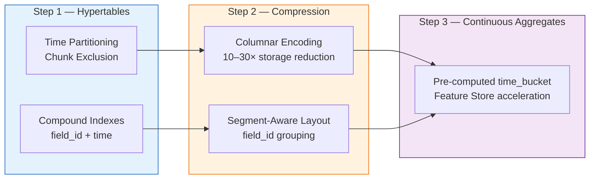
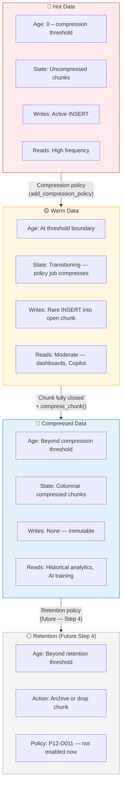
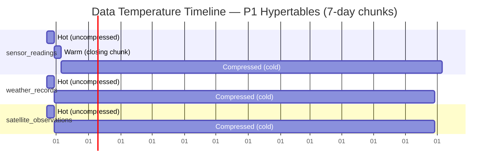
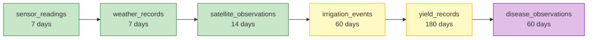
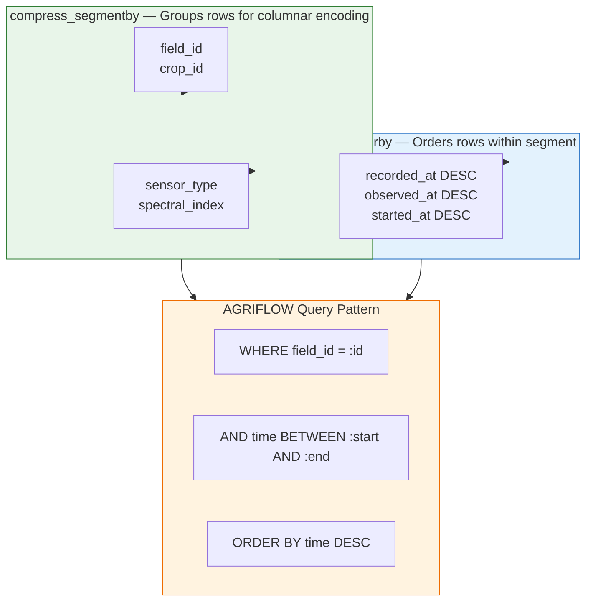
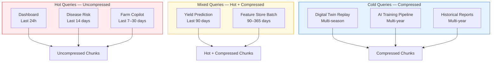
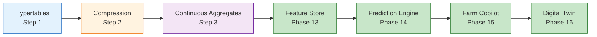
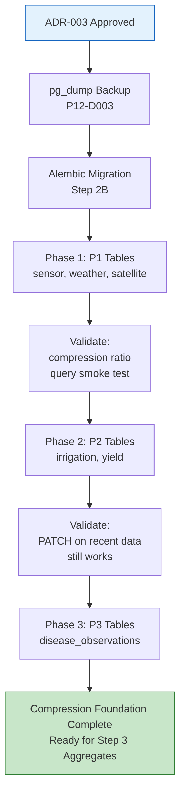
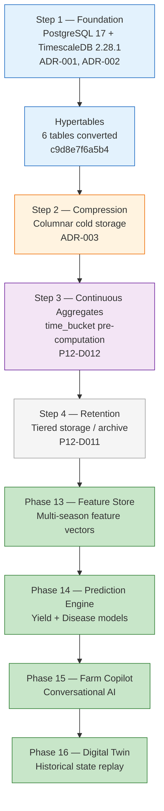

# AGRIFLOW-AI — Phase 12 Step 2A

## Compression Architecture Assessment

**Document Type:** Architecture Assessment (Read-Only)  
**Version:** 1.0  
**Date:** 2026-06-29  
**Scope:** Phase 12 Step 2A — TimescaleDB Native Compression Strategy; ADR-003 Preparation  
**Status:** Architecture Assessment — Pending Review  
**Author:** Senior Platform Architecture  
**Governance References:**

| Document | Version | Status |
|---|---|---|
| `10-phase12-step1-foundation-handbook.md` | 1.1 | ✅ Approved |
| `08-phase-architecture-handbook.md` | Current | ✅ Approved |
| `09-architecture-diagrams.md` | Current | ✅ Approved |
| `PHASE12_STEP1A_INFRASTRUCTURE_ASSESSMENT.md` | 1.3 | ✅ Approved |
| `PHASE12_STEP1B_TIMESCALEDB_INFRASTRUCTURE_PLAN.md` | 1.1 | ✅ Approved |
| `PHASE12_STEP1C_IMPLEMENTATION_REPORT.md` | 1.0 | ✅ Approved |
| `PHASE12_STEP1D_EXTENSION_ENABLEMENT_REPORT.md` | 1.0 | ✅ Approved |
| `PHASE12_STEP1EA_HYPERTABLE_ARCHITECTURE_ASSESSMENT.md` | 1.0 | ✅ Approved |
| `PHASE12_STEP1EB_HYPERTABLE_IMPLEMENTATION_REPORT.md` | 1.0 | ✅ Complete |
| `PHASE12_DECISION_REGISTER.md` | 1.4 | Active |
| `docs/adr/ADR-001-timescaledb-extension-enablement.md` | Accepted | Active |
| `docs/adr/ADR-002-hypertable-primary-key-conversion-strategy.md` | Approved | Active |

**Read-Only Activity Notice:** This document is a pre-implementation architecture review. No schema changes, migrations, compression policies, Docker modifications, or application code modifications were made during its preparation.

---

## Assessment at a Glance

| Metric | Value |
|---|---|
| Hypertables assessed | **6** |
| Compression policies active | **0** (baseline) |
| Recommended for compression | **6** (with tiered age thresholds) |
| Primary compression targets | `sensor_readings`, `weather_records`, `satellite_observations` |
| Mutable hypertables requiring caution | `irrigation_events`, `yield_records`, `disease_observations` |
| Governing deferred decision | P12-D010 — Compression Policy Strategy |
| Target ADR | ADR-003 — Compression Policy |
| Application layer impact | **0** (reads transparent; no API/repository changes) |

---

## Implementation Traceability

```
Step 1 Foundation (ADR-001, ADR-002)
        ↓
Hypertables (Step 1E-B — c9d8e7f6a5b4)
        ↓
Compression Architecture Assessment
        ↓
     Step 2A  ← Current (Read-Only Assessment)
Compression Implementation (Step 2B — Pending ADR-003)
        ↓
Continuous Aggregates (Step 3 — P12-D012)
        ↓
Retention / Tiered Storage (Step 4 — P12-D011)
        ↓
Feature Store → Prediction Engine → Farm Copilot → Digital Twin
```

---

## Current Platform State

| Attribute | Value |
|---|---|
| Database | PostgreSQL 17.10 |
| TimescaleDB | 2.28.1 (active in `agriflow` database) |
| Alembic head | `c9d8e7f6a5b4` |
| Hypertables | 6 operational |
| Relational tables | 4 unchanged (`farms`, `fields`, `crops`, `soil_profiles`) |
| Compression enabled | No — all hypertables `compression_enabled = false` |
| Continuous aggregates | 0 |
| Retention policies | 0 |
| Repository / Service / API changes | 0 |

### Hypertable Baseline (Post Step 1E-B)

| Hypertable | Partition Column | Chunk Interval | Mutability | Priority |
|---|---|---|---|---|
| `sensor_readings` | `recorded_at` | 7 days | Append-only | P1 — Critical |
| `weather_records` | `recorded_at` | 7 days | Append-only (no PATCH) | P1 — Critical |
| `satellite_observations` | `observed_at` | 7 days | Mutable (PATCH) | P1 — Critical |
| `irrigation_events` | `started_at` | 30 days | Mutable (PATCH) | P2 — High |
| `yield_records` | `recorded_at` | 90 days (3 months) | Mutable (PATCH) | P2 — High |
| `disease_observations` | `observed_at` | 30 days | Mutable (PATCH) | P3 — Standard |

---

## Section 1 — Why Compression?

Hypertable conversion (Step 1) solved the **query scalability** problem: chunk exclusion eliminates full-table scans for time-window queries. Compression solves the **storage scalability** problem: as historical data accumulates across seasons and years, row-oriented PostgreSQL storage becomes the dominant cost driver — not query latency on hot data.

### 1.1 Storage Optimization

| Domain | Estimated Annual Row Volume (100-farm deployment) | Uncompressed Growth Risk |
|---|---|---|
| `sensor_readings` | 10M–100M rows/year | **Critical** — primary storage cost driver |
| `weather_records` | 1M–10M rows/year | **High** |
| `satellite_observations` | 500K–5M rows/year (8 indices × multiple passes) | **High** |
| `irrigation_events` | 50K–500K rows/year | Moderate |
| `yield_records` | 5K–50K rows/year | Low (sparse, but multi-year accumulation) |
| `disease_observations` | 10K–100K rows/year | Low–Moderate |

TimescaleDB native columnar compression achieves **10–30× storage reduction** on cold IoT and satellite chunks. At 100M `sensor_readings` rows/year (~15–25 GB uncompressed), compression reduces multi-year retention from terabyte-scale projections to manageable PostgreSQL volume — without external object storage for the hot/warm tier.

### 1.2 Query Performance

Compression is not only a storage mechanism. Properly configured `compress_segmentby` and `compress_orderby` align compressed chunk layout with AGRIFLOW-AI's dominant access patterns (`field_id` + time DESC). For historical analytics queries that scan beyond the hot window:

- **Chunk exclusion** still applies — only relevant time partitions are accessed.
- **Columnar decompression** is selective — TimescaleDB decompresses only the columns and row ranges needed by the query plan.
- **Hot chunks remain uncompressed** — recent operational queries (dashboards, ingestion validation) retain full row-store performance.

### 1.3 Historical Analytics

Agricultural analytics are inherently seasonal and multi-year:

- Growing Degree Days (GDD) and Penman-Monteith ET₀ require multi-season weather history.
- NDVI/EVI trajectories require multi-year satellite archives per field.
- Irrigation water balance models require multi-season intervention history.

Compression makes retaining **full historical depth** economically viable. Without compression, the platform faces a false choice between expensive storage and truncated history — both of which degrade analytics quality.

### 1.4 AI Feature Generation (Phase 13)

The AI Feature Store constructs feature vectors over fixed time windows (e.g., 90-day growing-season windows). Feature extraction pipelines issue bulk `SELECT ... WHERE field_id = :id AND recorded_at BETWEEN :start AND :end` queries across `sensor_readings`, `weather_records`, and `satellite_observations`.

Compression supports this workload by:

- Reducing I/O volume for historical window scans (columnar encoding is efficient for correlated telemetry).
- Keeping the Feature Store's working set (recent 90–180 days) in uncompressed hot chunks for low-latency refresh.
- Enabling multi-season training data retention without prohibitive storage cost.

### 1.5 Digital Twin Replay (Phase 16)

Digital Twin state reconstruction replays event history across multiple domains simultaneously — sensor telemetry, weather, irrigation events, and satellite indices — anchored on a field and a time range. Replay workloads are **read-heavy, range-scanned, and historically deep**.

Compressed chunks serve replay efficiently because:

- Replay queries are predominantly sequential time-range scans per field.
- `SEGMENTBY field_id` groups all telemetry for a field within a compressed segment — the natural replay unit.
- Decompression cost is amortized across the full replay window, not per-row.

### 1.6 Farm Copilot Historical Queries (Phase 15)

Farm Copilot answers conversational queries such as *"What was soil moisture trend over the last 30 days?"* or *"Compare NDVI this season vs. last season."* These map to:

- **Hot queries** (last 7–30 days): served from uncompressed chunks — sub-second response.
- **Warm queries** (30–180 days): may touch one or two compressed chunks — acceptable latency with chunk exclusion.
- **Cold queries** (multi-season comparison): scan compressed historical chunks — higher latency but rare in conversational context; can be pre-aggregated via continuous aggregates (Step 3).

### 1.7 Why Compression Follows Hypertables



| Capability | Requires Hypertables? | Requires Compression? |
|---|---|---|
| Chunk exclusion on time-range queries | ✅ Yes | No |
| `time_bucket()` aggregation | ✅ Yes | No |
| Columnar compression on cold chunks | ✅ Yes | ✅ Enabled by policy |
| `add_compression_policy()` | ✅ Yes | ✅ Yes |
| Continuous aggregates on compressed data | ✅ Yes | Recommended (reduces refresh I/O) |
| Retention / tiered storage policies | ✅ Yes | Recommended (compress before archive) |

**Compression operates on chunks.** Without hypertables, there are no chunks to compress. Step 1 established the partition boundary; Step 2 applies columnar encoding within those boundaries. This is the logical next optimization layer in the TimescaleDB capability stack documented in the Foundation Handbook §13.

### Key Takeaways

- Hypertables solve query scalability; compression solves storage scalability — both are required for enterprise-scale AI workloads.
- All six AI roadmap capabilities (Feature Store, Prediction, Copilot, Digital Twin) depend on retaining deep historical archives economically.
- Compression is transparent to the application layer — reads on compressed chunks require no repository or API changes.
- Compression must follow hypertable conversion; it cannot precede it.

---

## Section 2 — Hot / Warm / Cold Data Strategy

AGRIFLOW-AI adopts a three-tier data temperature model within each hypertable. Temperature is determined by **age since partition time**, **write activity**, and **read frequency** — not by separate physical stores (tiered object storage is a future Step 4 consideration per P12-D011).



### Temperature Tier Characteristics

| Tier | Age (P1 Tables) | Age (P2/P3 Tables) | Write Activity | Read Frequency | Update Frequency | Storage Format |
|---|---|---|---|---|---|---|
| **Hot** | 0–7 days | 0–30 days (P2) / 0–90 days (yield) | Continuous INSERT (P1); episodic INSERT (P2/P3) | Very high — dashboards, live APIs, ingestion | None (sensor/weather); occasional PATCH (mutable) | Row store (uncompressed) |
| **Warm** | 7–14 days | 30–60 days | INSERT into closing chunk only | Moderate — recent analytics, Copilot "last N days" | PATCH possible on mutable tables — **must not compress yet** | Row store → transitioning |
| **Compressed (Cold)** | >7 days | >30 days (P2/P3) / >90 days (yield) | None — chunk closed | Low–moderate — historical analytics, batch AI training | **Blocked** — UPDATE requires decompression | Columnar compressed |
| **Retention (Future)** | Business-defined | Business-defined | None | Archive access only | N/A | External tier (Azure Blob) or dropped |

### Per-Domain Temperature Profile



### Write / Read / Update Summary by Stage

| Stage | `sensor_readings` | `weather_records` | `satellite_observations` | `irrigation_events` | `yield_records` | `disease_observations` |
|---|---|---|---|---|---|---|
| **Hot — Writes** | Continuous IoT ingestion | Station/API ingestion | Satellite pipeline ingestion | Operator logging | Harvest-time entry | Scouting events |
| **Hot — Reads** | Real-time dashboards | ET₀/GDD dashboards | NDVI charts | Irrigation schedule | Harvest reports | Disease alerts |
| **Hot — Updates** | None (append-only) | None | PATCH (reprocessing) | PATCH (corrections) | PATCH (corrections) | PATCH (severity updates) |
| **Compressed — Writes** | None | None | None | None | None | None |
| **Compressed — Reads** | Feature Store batch extraction | Multi-season climate analysis | Multi-season NDVI training | Water balance history | Multi-year yield training | Disease incidence history |
| **Compressed — Updates** | N/A | N/A | Requires decompress | Requires decompress | Requires decompress | Requires decompress |

### Key Takeaways

- Hot data must remain uncompressed for write performance and mutable-table PATCH support.
- Compression age thresholds must exceed the maximum expected UPDATE window for mutable tables.
- Retention (Step 4) operates on compressed cold data — compression is a prerequisite for cost-effective long-term retention.

---

## Section 3 — Hypertable Compression Assessment

| Hypertable | Compression Recommended | Compression Age | Business Justification | AI Justification |
|---|---|---|---|---|
| `sensor_readings` | **✅ Yes — P1 Priority** | **7 days** (1 chunk) | Highest row volume; primary storage cost driver; append-only semantics eliminate UPDATE risk; 7-day threshold aligns with chunk interval | Core Feature Store input; 90-day yield model windows scan 13+ chunks — compression reduces training I/O by 10–30× on historical portions; Digital Twin replay primary data source |
| `weather_records` | **✅ Yes — P1 Priority** | **7 days** (1 chunk) | Continuous ingestion at 1–24 records/field/day; GDD/ET₀ historical queries require multi-year retention; append-only | Temperature, humidity, solar radiation features for Yield Prediction (90-day window) and Disease Risk (14-day incubation window); compressed historical weather enables multi-season climate baselines |
| `satellite_observations` | **✅ Yes — P1 Priority** | **14 days** (2 chunks) | 8 spectral indices × multiple providers; high row accumulation; storage-intensive NUMERIC columns | NDVI/EVI/NDWI core remote sensing feature vector; `list_by_field_and_date_range` is the primary AI extraction query; multi-season vegetation models require irreplaceable satellite archives |
| `irrigation_events` | **✅ Yes — P2 Priority** | **60 days** (2 chunks) | Lower volume but multi-year accumulation; water consumption reporting; FAO-56 water balance | Irrigation frequency/volume features for water stress models; Digital Twin water-balance state; PATCH corrections possible within 30 days — 60-day threshold provides safety margin |
| `yield_records` | **✅ Yes — P2 Priority** | **180 days** (2 chunks) | Sparse data (1–5 records/crop cycle); low immediate compression benefit; long-term multi-season history | **Target variable** for Yield Prediction Engine; multi-year yield history is irreplaceable training signal; 90-day chunk interval means compress after 2 closed chunks; PATCH corrections rare beyond harvest window |
| `disease_observations` | **✅ Yes — P3 Priority** | **60 days** (2 chunks) | Episodic, event-driven; lower volume than P1 tables; disease history valuable for compliance reporting | Disease pressure features for Disease Risk Scoring Engine; treatment efficacy time series; 14-day prediction window reads hot data; compressed history supports multi-season incidence models |

### Compression Priority Rollout



### Key Takeaways

- All six hypertables are compression candidates; priority and age thresholds differ by mutability and volume.
- P1 tables compress earliest (7–14 days); mutable P2/P3 tables require longer thresholds.
- `satellite_observations` uses 14 days (not 7) because PATCH reprocessing can occur within the first week after ingestion.

---

## Section 4 — Compression Configuration Strategy

TimescaleDB compression is configured per hypertable via `ALTER TABLE ... SET (`compression settings`)` followed by `add_compression_policy()`. Two settings dominate compression efficiency and query performance: `compress_segmentby` and `compress_orderby`.

### 4.1 Configuration Principles

| Principle | Rationale |
|---|---|
| **Segment by the primary filter column** | AGRIFLOW-AI queries almost always filter by `field_id` or `crop_id` before time range — segmenting by this column groups correlated rows for maximum compression ratio |
| **Order by time DESC** | Repository queries use `ORDER BY time_col DESC` — descending time order within segments matches read patterns and improves skip-scan efficiency |
| **Include secondary segment columns sparingly** | Additional segment columns (e.g., `sensor_type`, `spectral_index`) improve compression when values are low-cardinality within a field — but too many segment columns reduce compression ratio |
| **Never segment by UUID `id`** | UUID has no correlation; segmenting by `id` would create one-row segments — worst-case compression |
| **Do not compress audit columns into segmentby** | `created_at`, `updated_at` are not query filters — exclude from segmentby |

### 4.2 Recommended Configuration per Hypertable

| Hypertable | `compress_segmentby` | `compress_orderby` | Rationale |
|---|---|---|---|
| `sensor_readings` | `field_id, sensor_type` | `recorded_at DESC` | Dominant query: `list_by_field` + sensor type filter; `(field_id, recorded_at)` and `(sensor_type, recorded_at)` compound indexes confirm pattern; sensor_type is low-cardinality per field |
| `weather_records` | `field_id` | `recorded_at DESC` | All queries are field-scoped; single segment column sufficient; GDD/ET₀ calculations scan sequential weather within a field |
| `satellite_observations` | `field_id, spectral_index` | `observed_at DESC` | `list_by_field_and_date_range` and `get_latest_by_field_and_spectral_index` are primary AI queries; 8 spectral indices per field create natural compression groups |
| `irrigation_events` | `field_id` | `started_at DESC` | Field-scoped irrigation history; monthly chunks align with water management reporting |
| `yield_records` | `crop_id` | `recorded_at DESC` | Primary anchor is crop cycle; `list_by_crop` is dominant query pattern; `field_id` available via denormalization but crop_id is the AI training grain |
| `disease_observations` | `crop_id` | `observed_at DESC` | Disease pressure is per-crop-cycle; `get_by_crop` ordered by `observed_at DESC` is the primary access pattern |

### 4.3 Configuration Diagram



### 4.4 Illustrative DDL (Assessment Only — Not for Implementation)

The following illustrates the intended configuration. **This SQL must not be executed until ADR-003 is approved and Step 2B migration is authorized.**

```sql
-- sensor_readings (illustrative)
ALTER TABLE sensor_readings SET (
    timescaledb.compress,
    timescaledb.compress_segmentby = 'field_id, sensor_type',
    timescaledb.compress_orderby = 'recorded_at DESC'
);
SELECT add_compression_policy('sensor_readings', INTERVAL '7 days');
```

### 4.5 Columns Excluded from Compression Consideration

| Column Category | Treatment | Reason |
|---|---|---|
| UUID `id` | Included in row, not segmentby/orderby | Application identity; no compression grouping value |
| FK columns (`field_id`, `crop_id`) | segmentby candidates | Primary query filter |
| Partition time column | orderby (always) | Mandatory ordering key |
| Measurement values (`sensor_value`, `index_value`, etc.) | Compressed as columnar data | High compression ratio — correlated numeric sequences |
| Enum columns (`sensor_type`, `spectral_index`, etc.) | segmentby candidates | Low cardinality within segment |
| Text columns (`notes`, `scene_id`) | Compressed as columnar data | Low read frequency in AI pipelines; acceptable decompression cost |

### Key Takeaways

- `compress_segmentby` must mirror the repository filter columns (`field_id` or `crop_id`).
- `compress_orderby` must use DESC on the partition time column to match `list_by_*` query direction.
- P1 tables benefit from a secondary segment column (`sensor_type`, `spectral_index`) for additional compression grouping.

---

## Section 5 — Query Pattern Analysis

### 5.1 Dominant Query Patterns by Consumer

| Consumer | Tables | Typical Query | Time Window | Touches Compressed Data? |
|---|---|---|---|---|
| **REST API — Dashboards** | All 6 | `list_by_field` / `list_by_crop` LIMIT N | Last 24h–7d | No (hot chunks) |
| **Yield Prediction Engine** | `sensor_readings`, `weather_records`, `satellite_observations`, `yield_records` | Field-scoped range scan | **Last 90 days** (growing season) | Partial — days 8–90 compressed (P1 tables) |
| **Disease Risk Scoring** | `disease_observations`, `weather_records`, `sensor_readings` | Field/crop range scan | **Last 14 days** (incubation) | No (hot chunks) |
| **Farm Copilot** | All 6 | Natural language → parameterized range query | **Last N days** (user-defined, typically 7–30) | Rarely — mostly hot data |
| **Digital Twin Replay** | `sensor_readings`, `weather_records`, `satellite_observations`, `irrigation_events` | Multi-domain parallel range scan | **Full history** or season replay | Yes — predominantly compressed |
| **Feature Store Batch Job** | P1 tables + `yield_records` | Bulk extraction per field per season | **90–365 days** per training window | Yes — majority compressed |
| **Reporting** | All 6 | Aggregated summaries | Season / year | Yes — compressed + aggregates (Step 3) |

### 5.2 Query Pattern Flow



### 5.3 Compression Interaction by Workload

| Workload | Compression Impact | Mitigation |
|---|---|---|
| **Yield Prediction (90-day window)** | ~83% of window may be compressed (days 8–90 on P1 tables) | Acceptable — batch training is not latency-sensitive; segmentby `field_id` minimizes decompression scope |
| **Disease Prediction (14-day window)** | 100% hot data on P1 tables | No impact — compression threshold (7 days) keeps 14-day window mostly in hot + one compressed chunk at boundary |
| **Farm Copilot (last N days)** | N ≤ 30: predominantly hot | No mitigation needed for typical queries; multi-season comparisons may use continuous aggregates (Step 3) |
| **Digital Twin (historical replay)** | Majority compressed | `SEGMENTBY field_id` ensures replay decompresses one field at a time; parallel chunk decompression across domains |
| **PATCH on mutable tables** | Blocked on compressed chunks | Age thresholds (60–180 days) exceed correction window; decompress-on-update only as operational fallback |
| **Aggregation queries (`time_bucket`)** | Compressed chunks support aggregation | Step 3 continuous aggregates will pre-compute — reducing need to scan raw compressed data |

### 5.4 Repository Query Alignment

All six hypertable repositories follow the same predicate-based pattern established in Step 1:

```python
select(Model).where(Model.parent_id == id).order_by(Model.time_col.desc())
```

This pattern is **compression-transparent** — SQLAlchemy issues standard SQL; TimescaleDB's query planner handles chunk exclusion and selective decompression. No repository changes are required.

### Key Takeaways

- Hot workloads (14-day disease, 7-day Copilot) are unaffected by compression.
- Mixed workloads (90-day yield) benefit from compression on the historical portion without latency penalty in batch context.
- Cold workloads (Digital Twin, multi-year training) are the primary compression beneficiaries.

---

## Section 6 — AI Architecture Alignment

### Phase 13 — Feature Store

| Aspect | Compression Support |
|---|---|
| **Data sources** | `sensor_readings`, `weather_records`, `satellite_observations` (primary); `irrigation_events`, `yield_records`, `disease_observations` (secondary) |
| **Extraction pattern** | Bulk `SELECT` over `(parent_id, time_range)` per field per season |
| **Compression benefit** | 10–30× storage reduction enables retaining full multi-season feature history; segmentby alignment minimizes decompression I/O per extraction job |
| **Hot window** | Most recent 7 days uncompressed — supports incremental feature refresh without decompression latency |
| **Dependency** | Feature Store batch jobs should run after compression policies are stable; continuous aggregates (Step 3) further accelerate feature materialization |

### Phase 14 — Prediction Engine

| Aspect | Compression Support |
|---|---|
| **Models** | Yield Prediction (90-day window); Disease Risk Scoring (14-day window) |
| **Training data** | Multi-season historical features from compressed chunks + `yield_records` / `disease_observations` as labels |
| **Compression benefit** | Training pipelines are batch-oriented — decompression cost is amortized; storage savings enable multi-year training sets without storage budget constraints |
| **Inference data** | Real-time inference uses hot (uncompressed) data for the current prediction window — no decompression latency |
| **Risk** | None for inference; training job duration may increase marginally on first access to cold compressed chunks (cache warming) |

### Phase 15 — Farm Copilot

| Aspect | Compression Support |
|---|---|
| **Query pattern** | Conversational → parameterized time-range SQL; typically last 7–30 days |
| **Compression benefit** | Indirect — compression keeps storage costs manageable as Copilot's accessible history deepens; Copilot can eventually answer multi-season questions without storage constraints |
| **Latency** | Hot data served uncompressed — sub-second Copilot response for typical queries preserved |
| **Future** | Multi-season Copilot queries ("compare this year vs. last year") will scan compressed chunks — mitigated by Step 3 continuous aggregates providing pre-computed summaries |

### Phase 16 — Digital Twin

| Aspect | Compression Support |
|---|---|
| **Replay pattern** | Multi-domain parallel time-range reconstruction per field across full history |
| **Compression benefit** | **Critical** — Digital Twin is the highest-volume consumer of historical data; without compression, replay of multi-year field state is storage-prohibitive |
| **Segment alignment** | `SEGMENTBY field_id` ensures replay decompresses field-scoped segments — the natural Digital Twin replay unit |
| **Update interaction** | Replay is read-only — no conflict with compressed chunk immutability |
| **Dependency** | Digital Twin should not launch until compression policies are validated on production-scale data volumes |

### AI Phase Dependency Chain



### Key Takeaways

- Compression is a prerequisite for economically viable Feature Store depth and Digital Twin replay.
- Real-time AI inference (Phases 14–15) operates on hot uncompressed data — no latency regression.
- Batch AI training (Phases 13–14) is the primary consumer of compressed historical data.

---

## Section 7 — Risks

| Risk | Severity | Description | Mitigation |
|---|---|---|---|
| **Compressing data too early** | **High** | Applying compression before chunks are fully closed, or before mutable-table correction windows expire, causes UPDATE failures or forces decompression | Per-table age thresholds exceed chunk interval + correction window; P1: 7–14 days; P2/P3 mutable: 60–180 days; validate with `timescaledb_information.chunks` before policy activation |
| **Updating compressed chunks** | **High** | TimescaleDB blocks UPDATE/DELETE on compressed chunks; PATCH on `irrigation_events`, `yield_records`, `disease_observations`, `satellite_observations` will fail | Set compression age > maximum expected PATCH recency; document decompress-then-update as operational fallback; monitor `pg_stat_activity` for compression-related errors |
| **Query latency on compressed data** | **Medium** | First access to compressed chunks incurs decompression CPU cost; Digital Twin replay across many years may show elevated latency | `compress_segmentby` alignment minimizes decompression scope; Step 3 continuous aggregates reduce raw scan need; benchmark with production-scale data in Step 2B validation |
| **Decompression cost** | **Medium** | Bulk training jobs scanning years of compressed data consume CPU for decompression | Schedule batch jobs off-peak; rely on OS page cache after first decompression; consider parallel query across chunks (TimescaleDB default) |
| **Maintenance overhead** | **Low–Medium** | Compression policies run as background jobs; misconfigured policies may compress unintended chunks | Single Alembic migration per policy; monitor via `timescaledb_information.jobs`; include compression status in health check dashboard |
| **Operational complexity** | **Low** | Six hypertables × distinct configurations increases operational surface | Phased rollout (P1 → P2 → P3); single ADR-003 governs all configurations; Decision Register P12-D010 provides traceability |
| **Downgrade complexity** | **Medium** | Alembic downgrade must decompress all chunks before removing compression settings | Document decompress-all procedure in ADR-003; mandatory pre-migration backup (P12-D003); test downgrade on dev environment |
| **Empty-table validation gap** | **Low** | Current dev environment has empty hypertables — compression behavior untested at scale | Step 2B must include validation with synthetic data load before production rollout; benchmark compression ratio per table |

### Risk Mitigation Architecture

```mermaid
flowchart TD
    R1[Compress too early] --> M1[Age threshold > chunk interval\n+ PATCH window]
    R2[UPDATE on compressed] --> M2[Mutable tables: 60–180 day threshold\nDecompress fallback documented]
    R3[Query latency] --> M3[SEGMENTBY field_id\nContinuous aggregates Step 3]
    R4[Downgrade risk] --> M4[pg_dump backup mandatory\nDecompress-all in downgrade()]
    R5[Untested at scale] --> M5[Synthetic data validation\nin Step 2B]

    style R1 fill:#ffebee,stroke:#c62828
    style R2 fill:#ffebee,stroke:#c62828
    style R3 fill:#fff8e1,stroke:#f9a825
    style R4 fill:#fff8e1,stroke:#f9a825
    style R5 fill:#fff8e1,stroke:#f9a825
    style M1 fill:#e8f5e9,stroke:#2e7d32
    style M2 fill:#e8f5e9,stroke:#2e7d32
    style M3 fill:#e8f5e9,stroke:#2e7d32
    style M4 fill:#e8f5e9,stroke:#2e7d32
    style M5 fill:#e8f5e9,stroke:#2e7d32
```

### Key Takeaways

- The highest risks are temporal — compressing before data is immutable.
- Mutable tables require conservative age thresholds.
- All risks are mitigable with policy configuration and phased rollout — no architectural blockers identified.

---

## Section 8 — Alternatives Considered

### Option 1 — No Compression

| Aspect | Assessment |
|---|---|
| **Description** | Retain row-oriented storage for all hypertable chunks indefinitely |
| **Storage impact** | 100M sensor rows/year → 15–25 GB/year uncompressed; 5-year retention → 75–125 GB for sensors alone |
| **Query impact** | No decompression overhead; hot and cold queries perform identically |
| **AI impact** | Feature Store and Digital Twin remain viable but storage costs grow linearly; multi-year training data retention becomes expensive |
| **Operational impact** | Simplest operationally — no compression policies to manage |
| **Verdict** | **❌ Not Recommended** — storage cost grows unsustainably; contradicts P12-D010 assessment and Foundation Handbook §13 roadmap |

### Option 2 — Compress Every Hypertable Immediately

| Aspect | Assessment |
|---|---|
| **Description** | Enable compression on all chunks regardless of age (0-day threshold or compress on chunk close) |
| **Storage impact** | Maximum immediate storage savings |
| **Query impact** | **Severe** — all queries including dashboards and 14-day disease windows hit compressed data |
| **AI impact** | Inference latency degraded; PATCH on mutable tables fails immediately |
| **Operational impact** | High risk of production incidents on mutable tables; no hot/warm tier |
| **Verdict** | **❌ Not Recommended** — violates hot/warm/cold strategy; breaks mutable table PATCH semantics |

### Option 3 — Policy-Based Compression After Aging ✅ RECOMMENDED

| Aspect | Assessment |
|---|---|
| **Description** | `add_compression_policy()` per hypertable with table-specific age thresholds; P1 tables at 7–14 days; mutable P2/P3 at 60–180 days |
| **Storage impact** | 10–30× reduction on cold data; hot data uncompressed |
| **Query impact** | Hot queries unaffected; cold queries pay acceptable decompression cost in batch context |
| **AI impact** | Feature Store and Digital Twin benefit from economical deep history; inference uses hot data |
| **Operational impact** | Moderate — six policies to configure and monitor; phased rollout reduces risk |
| **Verdict** | **✅ Recommended** — aligns with TimescaleDB best practices, AGRIFLOW-AI query patterns, and P12-D010 deferred decision |

### Alternatives Comparison

| Criterion | Option 1: No Compression | Option 2: Immediate | Option 3: Policy-Based ✅ |
|---|---|---|---|
| Storage efficiency | ❌ Poor | ✅ Maximum | ✅ High (cold data) |
| Hot query performance | ✅ Optimal | ❌ Degraded | ✅ Optimal |
| Mutable table safety | ✅ Safe | ❌ Broken | ✅ Safe (with thresholds) |
| AI training viability | ⚠️ Cost-limited | ✅ Data accessible | ✅ Economically viable |
| Digital Twin feasibility | ⚠️ Storage-limited | ✅ Data accessible | ✅ Scalable |
| Operational complexity | ✅ Low | ⚠️ Medium | ⚠️ Medium |
| TimescaleDB alignment | ❌ Incomplete | ❌ Anti-pattern | ✅ Best practice |
| P12-D010 alignment | ❌ Contradicts | ❌ Contradicts | ✅ Implements |

### Key Takeaways

- Option 3 (policy-based compression after aging) is the only alternative that balances storage efficiency, query performance, mutable table safety, and AI readiness.
- This option directly implements the P12-D010 deferred decision from Step 1E-A.

---

## Section 9 — Recommended Compression Policy

### 9.1 Policy Philosophy

1. **Compress cold data only** — hot chunks remain uncompressed for write performance and real-time queries.
2. **Age thresholds exceed correction windows** — mutable tables compress only after PATCH activity has ceased.
3. **Segment by query filter, order by time DESC** — compression layout mirrors repository access patterns.
4. **Phased rollout** — P1 tables first, validate, then P2, then P3.
5. **No application changes** — compression is a persistence-layer optimization transparent to repositories, services, and APIs.
6. **Alembic-governed** — all compression DDL via versioned migration after ADR-003 approval.
7. **Backup before activation** — mandatory `pg_dump` per P12-D003 before Step 2B migration.

### 9.2 Compression Thresholds

| Hypertable | `compress_after` | `compress_segmentby` | `compress_orderby` | Rollout Phase |
|---|---|---|---|---|
| `sensor_readings` | `7 days` | `field_id, sensor_type` | `recorded_at DESC` | Phase 1 |
| `weather_records` | `7 days` | `field_id` | `recorded_at DESC` | Phase 1 |
| `satellite_observations` | `14 days` | `field_id, spectral_index` | `observed_at DESC` | Phase 1 |
| `irrigation_events` | `60 days` | `field_id` | `started_at DESC` | Phase 2 |
| `yield_records` | `180 days` | `crop_id` | `recorded_at DESC` | Phase 2 |
| `disease_observations` | `60 days` | `crop_id` | `observed_at DESC` | Phase 3 |

### 9.3 Rollout Strategy



| Rollout Phase | Tables | Validation Gate | Rollback |
|---|---|---|---|
| **Phase 1** | `sensor_readings`, `weather_records`, `satellite_observations` | `timescaledb_information.chunks` shows `is_compressed = true`; compression ratio > 5× on synthetic data; API smoke test passes | `decompress_chunk()` all + `remove_compression_policy()` |
| **Phase 2** | `irrigation_events`, `yield_records` | PATCH on recent records succeeds; compressed chunks have `is_compressed = true` | Same as Phase 1 |
| **Phase 3** | `disease_observations` | Full six-table compression audit; Decision Register P12-D010 marked Implemented | Tier 2 pg_dump restore |

### 9.4 Monitoring Recommendations (Step 2B Scope)

| Metric | Source | Alert Threshold |
|---|---|---|
| Chunks compressed vs. total | `timescaledb_information.chunks` | Policy running but 0 chunks compressed after 2× compress_after interval |
| Compression ratio per table | `hypertable_compression_stats()` | Ratio < 3× on P1 tables with > 10K rows |
| Compression job failures | `timescaledb_information.job_stats` | Any failed `compression_policy` job |
| PATCH failures on mutable tables | Application error logs | Any `UPDATE` failure referencing compressed chunk |

### Key Takeaways

- Six distinct policies — one per hypertable — with tiered age thresholds.
- Three-phase rollout with validation gates between phases.
- Implementation deferred to Step 2B pending ADR-003 approval.

---

## Section 10 — Architecture Decision Preparation (ADR-003)

The following decisions must be formalized in **ADR-003 — TimescaleDB Compression Policy** before Step 2B implementation.

| # | Decision | Recommendation | Status |
|---|---|---|---|
| ADR-003-01 | Adopt TimescaleDB native compression for all six hypertables | Yes — with tiered age thresholds | **Requires ADR** |
| ADR-003-02 | Compression policy philosophy | Option 3 — Policy-based compression after aging | **Requires ADR** |
| ADR-003-03 | `sensor_readings` compression age | 7 days | **Requires ADR** |
| ADR-003-04 | `weather_records` compression age | 7 days | **Requires ADR** |
| ADR-003-05 | `satellite_observations` compression age | 14 days (extended for reprocessing PATCH window) | **Requires ADR** |
| ADR-003-06 | `irrigation_events` compression age | 60 days | **Requires ADR** |
| ADR-003-07 | `yield_records` compression age | 180 days | **Requires ADR** |
| ADR-003-08 | `disease_observations` compression age | 60 days | **Requires ADR** |
| ADR-003-09 | `compress_segmentby` configuration per table | Per Section 4.2 matrix | **Requires ADR** |
| ADR-003-10 | `compress_orderby` configuration per table | Time column DESC per Section 4.2 matrix | **Requires ADR** |
| ADR-003-11 | Phased rollout sequence | P1 → P2 → P3 with validation gates | **Requires ADR** |
| ADR-003-12 | Application layer impact | Zero changes — compression transparent to repositories | **Approved** (confirmed by Step 1E-B — no code changes needed) |
| ADR-003-13 | Pre-migration backup requirement | Mandatory pg_dump per P12-D003 | **Approved** (inherited from P12-D003) |
| ADR-003-14 | Alembic migration governance | All compression DDL via Alembic revision | **Approved** (inherited from Foundation Handbook §2) |
| ADR-003-15 | Decompress-on-update operational fallback | Document procedure; not automated | **Requires ADR** |
| ADR-003-16 | Continuous aggregates timing | Defer to Step 3 after compression validated | **Deferred** (P12-D012) |
| ADR-003-17 | Retention policy interaction | Defer to Step 4; compress before archive | **Deferred** (P12-D011) |
| ADR-003-18 | Synthetic data validation requirement | Mandatory in Step 2B before production | **Requires ADR** |

### ADR-003 Decision Summary

| Category | Count |
|---|---|
| **Requires ADR** (must be decided in ADR-003) | 12 |
| **Approved** (inherited from prior ADRs / governance) | 3 |
| **Deferred** (Step 3 / Step 4 scope) | 3 |

### Key Takeaways

- ADR-003 should be drafted immediately following approval of this assessment.
- Twelve decisions require explicit ADR-003 recording; three are already approved by prior governance; three are deferred to later steps.

---

## Section 11 — Architecture Traceability



### Traceability Matrix

| Decision | Governing Document | Decision Register | Assessment | Implementation | Status |
|---|---|---|---|---|---|
| TimescaleDB extension | ADR-001 | P12-D004 | Step 1D | `f1e2d3c4b5a6` | ✅ Complete |
| Hypertable conversion | ADR-002 | P12-D007–D009 | Step 1E-A | `c9d8e7f6a5b4` | ✅ Complete |
| Compression policy strategy | ADR-003 (pending) | P12-D010 | **Step 2A (this document)** | Step 2B (pending) | ⏳ Assessment Complete |
| Continuous aggregates | ADR (pending) | P12-D012 | Future Step 3 | Pending | ⏳ Deferred |
| Retention policy | ADR (pending) | P12-D011 | Future Step 4 | Pending | ⏳ Deferred |
| Feature Store | Phase 13 plan | — | — | Pending | 🔜 Planned |
| Prediction Engine | Phase 14 plan | — | — | Pending | 🔜 Planned |
| Farm Copilot | Phase 15 plan | — | — | Pending | 🔜 Planned |
| Digital Twin | Phase 16 plan | — | — | Pending | 🔜 Planned |

### Key Takeaways

- Step 2 (Compression) is the second layer in the TimescaleDB optimization stack — between hypertables and continuous aggregates.
- Every AI phase (13–16) depends on the storage efficiency that compression provides.
- This assessment completes the design gate for P12-D010; implementation awaits ADR-003.

---

## Section 12 — Executive Recommendation

### Why Compression Should Be Adopted

AGRIFLOW-AI has completed hypertable conversion — the query scalability foundation is in place. The platform now faces the storage scalability challenge: IoT telemetry, weather, and satellite data accumulate at rates that make uncompressed multi-year retention economically unsustainable. Every AI capability planned in Phases 13–16 — Feature Store feature extraction, Prediction Engine training, Farm Copilot historical queries, and Digital Twin replay — depends on retaining deep historical archives. Compression is the mechanism that makes this retention viable without external object storage for the warm/cold tier.

### Recommended Strategy

**Option 3 — Policy-based compression after aging** with per-table configuration:

- P1 append-only tables (`sensor_readings`, `weather_records`) compress after **7 days**.
- P1 mutable table (`satellite_observations`) compresses after **14 days** (reprocessing safety margin).
- P2 mutable tables (`irrigation_events`, `yield_records`) compress after **60–180 days**.
- P3 mutable table (`disease_observations`) compresses after **60 days**.
- All tables segment by primary query filter (`field_id` or `crop_id`) and order by time DESC.

### Why Implementation Should Proceed

1. **Zero application impact** — compression is transparent to repositories, services, and APIs (validated in Step 1E-B).
2. **Governance-ready** — this assessment provides evidence for all twelve ADR-003 decisions; P12-D010 can be marked for implementation.
3. **Sequential roadmap alignment** — continuous aggregates (Step 3) and retention (Step 4) depend on compression being active.
4. **Low risk with phased rollout** — P1 append-only tables first; mutable tables only after validation gates pass.
5. **Empty-table safety** — current dev environment allows risk-free policy activation; synthetic data validation in Step 2B confirms behavior at scale.

### Why ADR-003 Should Be Created

ADR-001 governed extension enablement. ADR-002 governed hypertable conversion. Compression is the third architectural decision in the TimescaleDB stack — it affects storage layout, query performance on historical data, and mutable table UPDATE semantics. Implementing compression without ADR-003 would violate the ADR-driven governance model established in Phase 12 Step 1. This assessment provides the evidence base; ADR-003 provides the formal decision record.

### Recommended Next Steps

| Step | Action | Owner |
|---|---|---|
| 1 | Architecture review of this assessment | Platform Architecture |
| 2 | Draft and approve ADR-003 | Platform Architecture |
| 3 | Update Decision Register P12-D010 → Approved for Implementation | Platform Architecture |
| 4 | Execute Step 2B — Compression Implementation (Alembic migration) | Engineering |
| 5 | Validate with synthetic data load and compression ratio benchmarks | Engineering |
| 6 | Proceed to Step 3 — Continuous Aggregates Architecture Assessment | Platform Architecture |

---

## Compliance Statement

| Constraint | Compliant |
|---|---|
| No database objects modified | ✅ |
| No SQL migrations created | ✅ |
| No compression settings enabled | ✅ |
| No SQLAlchemy models modified | ✅ |
| No repositories modified | ✅ |
| No services modified | ✅ |
| No APIs modified | ✅ |
| No existing documentation modified | ✅ |
| All mandatory reference documents reviewed | ✅ |
| Assessment suitable for architecture review | ✅ |
| ADR-003 preparation complete | ✅ |

---

## References

| Document | Path |
|---|---|
| Phase 12 Step 1 Foundation Handbook | `docs/10-phase12-step1-foundation-handbook.md` |
| Phase Architecture Handbook | `docs/08-phase-architecture-handbook.md` |
| Architecture Diagrams | `docs/09-architecture-diagrams.md` |
| Step 1A Infrastructure Assessment | `docs/report/PHASE12_STEP1A_INFRASTRUCTURE_ASSESSMENT.md` |
| Step 1B Infrastructure Plan | `docs/report/PHASE12_STEP1B_TIMESCALEDB_INFRASTRUCTURE_PLAN.md` |
| Step 1C Implementation Report | `docs/report/PHASE12_STEP1C_IMPLEMENTATION_REPORT.md` |
| Step 1D Extension Enablement Report | `docs/report/PHASE12_STEP1D_EXTENSION_ENABLEMENT_REPORT.md` |
| Step 1E-A Hypertable Assessment | `docs/report/PHASE12_STEP1EA_HYPERTABLE_ARCHITECTURE_ASSESSMENT.md` |
| Step 1E-B Hypertable Implementation | `docs/report/PHASE12_STEP1EB_HYPERTABLE_IMPLEMENTATION_REPORT.md` |
| Decision Register | `docs/report/PHASE12_DECISION_REGISTER.md` |
| ADR-001 | `docs/adr/ADR-001-timescaledb-extension-enablement.md` |
| ADR-002 | `docs/adr/ADR-002-hypertable-primary-key-conversion-strategy.md` |

---

*Phase 12 Step 2A Compression Architecture Assessment v1.0 — 2026-06-29*
