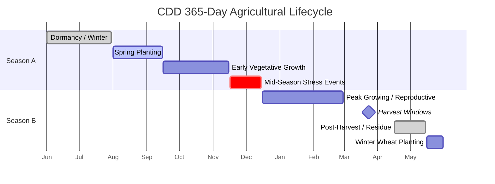
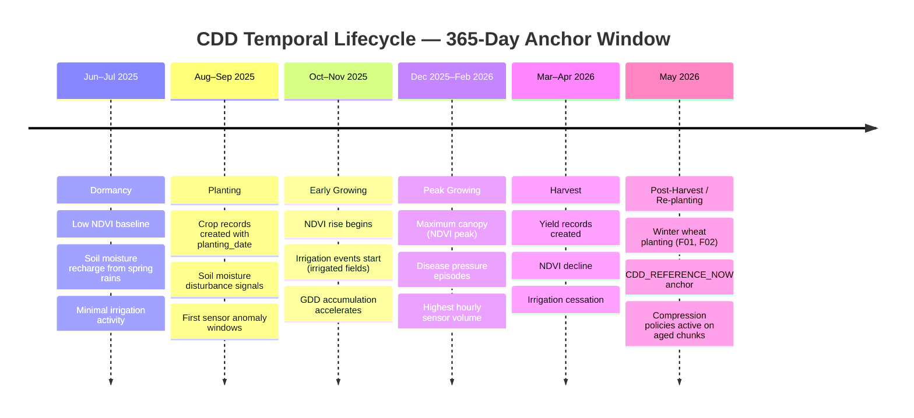
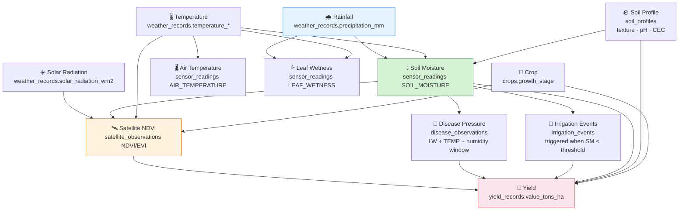
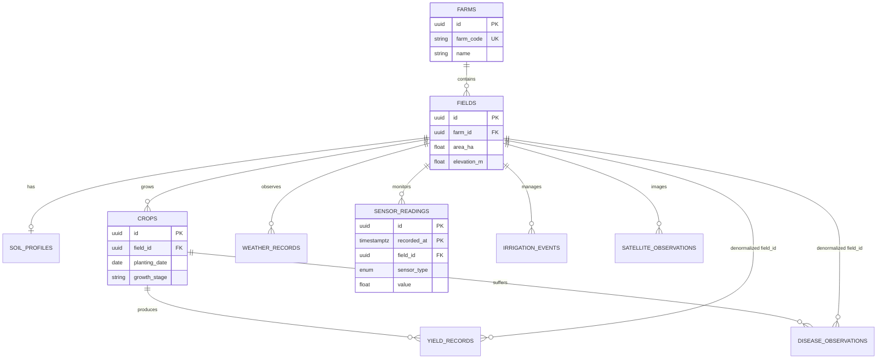
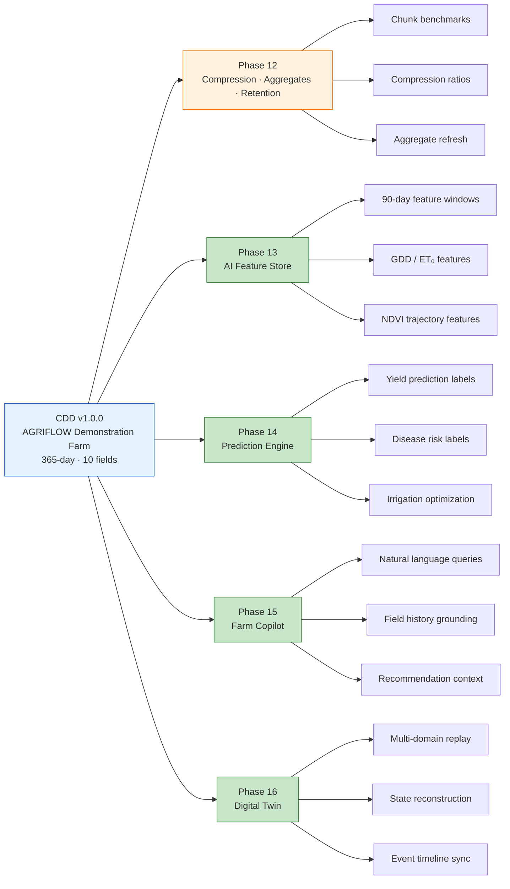
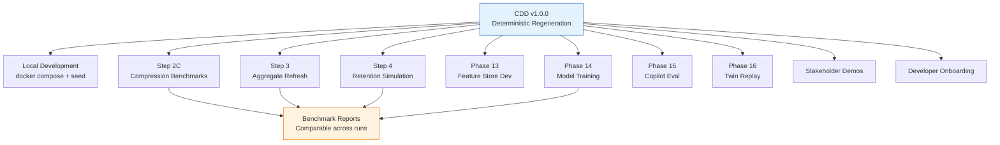
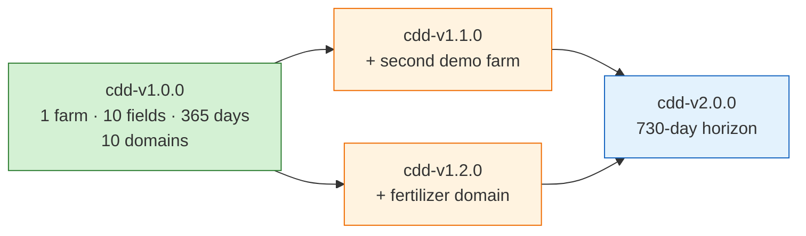
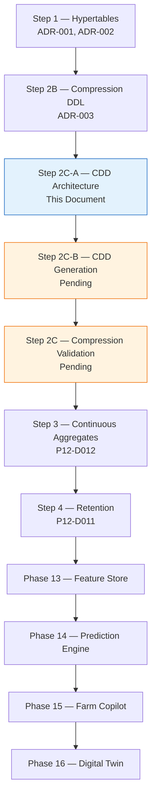

# AGRIFLOW-AI — Phase 12 Step 2C-A

## Canonical Development Dataset (CDD) Architecture

**Document Type:** Architecture Specification (Read-Only)  
**Version:** 1.0  
**Date:** 2026-06-29  
**Scope:** Phase 12 Step 2C-A — Canonical Development Dataset Design; Synthetic Data Generation Blueprint  
**Status:** Architecture Specification — Pending Review  
**Author:** Senior Platform Architecture  
**Governance References:**

| Document | Version | Status |
|---|---|---|
| `10-phase12-step1-foundation-handbook.md` | 1.1 | ✅ Approved |
| `PHASE12_STEP2A_COMPRESSION_ARCHITECTURE_ASSESSMENT.md` | 1.0 | ✅ Approved |
| `PHASE12_STEP2B_COMPRESSION_IMPLEMENTATION_REPORT.md` | 1.1 | ✅ Complete |
| `ADR-003-timescaledb-compression-policy-strategy.md` | 1.1 | ✅ Approved |
| `PHASE12_DECISION_REGISTER.md` | 1.1 | Active |
| `06-roadmap.md` | Current | Active |

**Read-Only Activity Notice:** This document defines architecture only. No Python code, Faker scripts, SQL, CSV files, database inserts, or migrations are produced by this step. Data generation is deferred to Step 2C-B and subsequent implementation steps.

---

## Executive Summary

AGRIFLOW-AI has completed TimescaleDB hypertable conversion (Step 1) and compression policy authoring (Step 2B). The development database currently contains **zero agricultural measurement data**. Every remaining Phase 12 validation gate — compression ratio benchmarks (Step 2C), continuous aggregate refresh (Step 3), retention policy simulation (Step 4) — and every downstream AI phase (13–16) requires a **known, repeatable, agriculturally coherent dataset** that exercises all ten domain entities across a full seasonal cycle.

The **Canonical Development Dataset (CDD)** is that dataset.

The CDD is not ad-hoc test data. It is the **official engineering dataset** for AGRIFLOW-AI: a single, versioned, deterministically regenerable synthetic farm environment that every developer, benchmark, validation suite, AI training pipeline, and demonstration uses by default.

### Why AGRIFLOW-AI Requires a CDD

| Need | Without CDD | With CDD |
|---|---|---|
| **Repeatable development** | Each developer seeds different random data; bugs reproduce inconsistently | Identical dataset from `CDD_VERSION` + seed produces identical state |
| **Benchmark consistency** | Compression ratios, query latencies, and aggregate refresh times are incomparable across runs | Fixed row counts and temporal distribution enable apples-to-apples benchmarks |
| **Compression validation** | Empty hypertables cannot activate compression policies or measure ratios (ADR-003 Step 2C gate) | ~400K+ sensor rows spanning 52+ chunks validate 7-day compression thresholds |
| **Continuous aggregate validation** | `time_bucket()` materialised views have nothing to roll up | Hourly sensor and daily weather/satellite series feed aggregate refresh jobs |
| **AI feature engineering** | Feature Store pipelines train on noise without cross-domain correlation | Rainfall → soil moisture → irrigation → NDVI → yield causal chain is modelled |
| **Digital Twin replay** | Multi-domain replay has no synchronized event history | 365-day aligned timelines across six hypertables per field |
| **Farm Copilot conversations** | LLM grounding queries return empty or inconsistent answers | Copilot can answer "How did soil moisture change during the July heatwave on Field 3?" with real data |
| **Onboarding new developers** | New contributors spend days inventing seed scripts | `docs/` + CDD manifest = immediate productive environment |
| **Demonstrations** | Sales and stakeholder demos require manual data entry | AGRIFLOW Demonstration Farm is always demo-ready after regeneration |

### CDD at a Glance

| Metric | Value |
|---|---|
| **Farm** | 1 — AGRIFLOW Demonstration Farm |
| **Fields** | 10 |
| **Crop cycles** | 18 (across two growing seasons within horizon) |
| **Temporal horizon** | 365 days (fixed anchor window) |
| **Hypertable rows (target)** | ~465,000 |
| **Relational rows (target)** | ~39 |
| **Total target rows** | ~465,039 |
| **Hypertable chunks (approx.)** | 52+ per high-frequency table |
| **CDD version** | `cdd-v1.0.0` (initial) |
| **Data policy** | Synthetic only — no production or PII data |

---

## Section 1 — Dataset Philosophy

### This Is NOT Test Data

Conventional test data exists to assert that code paths execute correctly: a single `SensorReading` with `value = 42.0` proves the repository `create` method works. That pattern remains appropriate for **unit tests**, which should continue to use minimal inline fixtures.

The CDD serves a fundamentally different purpose.

| Attribute | Unit Test Fixtures | Canonical Development Dataset |
|---|---|---|
| **Scope** | Single entity, single assertion | Full domain hierarchy, all ten entities |
| **Volume** | 1–5 rows | ~465,000 rows |
| **Temporal depth** | Point-in-time or absent | 365-day continuous history |
| **Cross-domain correlation** | None required | Agriculturally realistic causal chains |
| **Lifecycle** | Created and destroyed per test | Versioned, regenerated, shared across team |
| **Audience** | CI unit test runner | Developers, benchmarks, AI pipelines, demos |
| **Stability** | Ephemeral | Deterministic and repeatable |

### This Is the Official Engineering Dataset

The CDD becomes the **default data plane** for AGRIFLOW-AI engineering:

1. **Local development** — `docker compose up` + CDD regeneration = fully populated platform.
2. **Integration testing** — end-to-end workflows run against CDD, not invented per-suite fixtures.
3. **TimescaleDB validation** — compression, chunks, aggregates, and retention policies are benchmarked exclusively against CDD volumes.
4. **AI development** — Feature Store, Prediction Engine, Farm Copilot, and Digital Twin use CDD as the canonical training and evaluation corpus until production data is available.
5. **Documentation and demos** — every screenshot, API walkthrough, and architecture review references the same farm.

### Design Principles

| Principle | Description |
|---|---|
| **Agricultural realism** | Values, seasonality, and cross-domain relationships reflect real crop production physics — not uniform random numbers. |
| **Determinism** | Same `CDD_VERSION` + `CDD_SEED` → identical UUIDs, timestamps, and values on every regeneration. |
| **Schema fidelity** | All data conforms to existing ORM models, enums, validation rules, and FK topology — no schema shortcuts. |
| **Bounded scale** | Large enough to exercise TimescaleDB (chunks, compression, aggregates); small enough to regenerate in minutes on a laptop. |
| **Extension without redesign** | New domains (e.g., fertilizer events, pest observations) extend the CDD manifest — they do not replace it. |
| **Synthetic-only** | No production farm data, no PII, no licensed third-party datasets. Fully redistributable within the engineering team. |

---

## Section 2 — Digital Farm Design

### AGRIFLOW Demonstration Farm

The CDD models a single mixed-crop commercial farm in a temperate continental climate (US Midwest analogue). The farm exercises every irrigation method, soil texture class, crop rotation pattern, and sensor configuration present in the AGRIFLOW-AI domain model.

**Farm identity (relational):**

| Attribute | Value |
|---|---|
| `farm_code` | `AGRIFLOW-DEMO` |
| `name` | AGRIFLOW Demonstration Farm |
| `location` | Synthetic — 41.88°N, 93.10°W (central Iowa analogue) |
| `total_area_ha` | 275 (sum of field areas) |
| `timezone` | `America/Chicago` |

### Field Portfolio

| Field # | Name | Area (ha) | Soil Texture | Primary Irrigation | Primary Crop (Year 1) | Secondary Crop |
|---|---|---|---|---|---|---|
| F01 | North Wheat Pivot | 45 | Loam | CENTER_PIVOT | Winter Wheat | Soybean (following) |
| F02 | South Corn Block | 38 | Clay Loam | SPRINKLER | Corn | Winter Wheat |
| F03 | East Soy Belt | 52 | Silt Loam | Rain-fed | Soybean | Corn |
| F04 | West Mixed Rotation | 41 | Sandy Loam | DRIP | Corn | Alfalfa |
| F05 | River Bottom Alfalfa | 28 | Silty Clay | FLOOD | Alfalfa (perennial) | — |
| F06 | Hilltop Barley | 22 | Loam | Rain-fed | Barley | Soybean |
| F07 | Valley Potato | 18 | Sandy | DRIP | Potato | — |
| F08 | Orchard Edge | 15 | Loam | SUBSURFACE | Apple (perennial) | — |
| F09 | Research Plot A | 8 | Clay | MANUAL | Corn (high-density trial) | — |
| F10 | Research Plot B | 8 | Loam | AUTOMATED | Soybean (irrigation trial) | — |

### Soil Profiles

Each field carries exactly one `SoilProfile` (1:1 constraint per domain rules). Profiles vary by texture, pH, organic matter, CEC, and depth to support differentiated AI feature vectors across fields.

### Crop Rotations

Within the 365-day horizon, the CDD spans **two partial growing seasons**:

- **Season A (Days 1–180):** Winter dormancy → spring planting → early vegetative growth → mid-season stress events.
- **Season B (Days 181–365):** Late vegetative → reproductive → harvest → post-harvest → winter wheat planting (selected fields).

18 `Crop` records cover single-season annuals, relay crops, and perennial anchors (alfalfa, apple orchard).

### Measurement Domains

Each field receives the full measurement stack defined in Phases 5–11:

- **Weather** — 4 observations per day (6-hour cadence): temperature, humidity, rainfall, wind, solar radiation.
- **Sensors** — 5 IoT types per field at hourly cadence: `SOIL_MOISTURE`, `SOIL_TEMPERATURE`, `AIR_TEMPERATURE`, `AIR_HUMIDITY`, `LEAF_WETNESS`.
- **Satellite** — Sentinel-2 analogue passes every 5 days; 8 spectral indices per pass per field.
- **Irrigation** — Seasonal events correlated with soil moisture deficit (irrigated fields only).
- **Disease** — Episodic observations during humid/warm windows on susceptible crops.
- **Yield** — Harvest measurements at crop cycle completion.

### Digital Farm Hierarchy

```mermaid
graph TD
    FARM["🏡 AGRIFLOW Demonstration Farm<br/>farm_code: AGRIFLOW-DEMO<br/>275 ha · 10 fields"]

    FARM --> F01["F01 North Wheat Pivot<br/>45 ha · Loam · CENTER_PIVOT"]
    FARM --> F02["F02 South Corn Block<br/>38 ha · Clay Loam · SPRINKLER"]
    FARM --> F03["F03 East Soy Belt<br/>52 ha · Silt Loam · Rain-fed"]
    FARM --> F04["F04 West Mixed Rotation<br/>41 ha · Sandy Loam · DRIP"]
    FARM --> F05["F05 River Bottom Alfalfa<br/>28 ha · Silty Clay · FLOOD"]
    FARM --> F06["F06 Hilltop Barley<br/>22 ha · Loam · Rain-fed"]
    FARM --> F07["F07 Valley Potato<br/>18 ha · Sandy · DRIP"]
    FARM --> F08["F08 Orchard Edge<br/>15 ha · Loam · SUBSURFACE"]
    FARM --> F09["F09 Research Plot A<br/>8 ha · Clay · MANUAL"]
    FARM --> F10["F10 Research Plot B<br/>8 ha · Loam · AUTOMATED"]

    F01 --> S01["SoilProfile · Wheat Crop"]
    F02 --> S02["SoilProfile · Corn Crop"]
    F03 --> S03["SoilProfile · Soy Crop"]
    F04 --> S04["SoilProfile · Corn + Alfalfa"]
    F05 --> S05["SoilProfile · Alfalfa Perennial"]
    F06 --> S06["SoilProfile · Barley Crop"]
    F07 --> S07["SoilProfile · Potato Crop"]
    F08 --> S08["SoilProfile · Apple Perennial"]
    F09 --> S09["SoilProfile · Corn Trial"]
    F10 --> S10["SoilProfile · Soy Trial"]

    S01 --> M01["Weather · Sensors · Satellite · Irrigation"]
    S02 --> M02["Weather · Sensors · Satellite · Irrigation"]
    S03 --> M03["Weather · Sensors · Satellite"]
    S04 --> M04["Weather · Sensors · Satellite · Irrigation"]
    S05 --> M05["Weather · Sensors · Satellite · Irrigation"]
    S06 --> M06["Weather · Sensors · Satellite"]
    S07 --> M07["Weather · Sensors · Satellite · Irrigation"]
    S08 --> M08["Weather · Sensors · Satellite · Irrigation"]
    S09 --> M09["Weather · Sensors · Satellite · Irrigation"]
    S10 --> M10["Weather · Sensors · Satellite · Irrigation"]

    style FARM fill:#e3f2fd,stroke:#1565c0
    style F01 fill:#fff3e0,stroke:#ef6c00
    style F02 fill:#fff3e0,stroke:#ef6c00
    style F03 fill:#fff3e0,stroke:#ef6c00
    style F04 fill:#fff3e0,stroke:#ef6c00
    style F05 fill:#fff3e0,stroke:#ef6c00
    style F06 fill:#fff3e0,stroke:#ef6c00
    style F07 fill:#fff3e0,stroke:#ef6c00
    style F08 fill:#fff3e0,stroke:#ef6c00
    style F09 fill:#fff3e0,stroke:#ef6c00
    style F10 fill:#fff3e0,stroke:#ef6c00
```

---

## Section 3 — Domain Coverage

### Coverage Table

| Domain | Table / Entity | Records (Target) | Time Horizon | Purpose |
|---|---|---|---|---|
| **Farm** | `farms` | 1 | Static | Root aggregate; tenancy and farm-level API entry point |
| **Field** | `fields` | 10 | Static | Spatial anchor for all time-series measurements; geospatial foundation |
| **Crop** | `crops` | 18 | 365-day lifecycle | Crop rotation history; planting/harvest milestones; grandchild FK anchor |
| **Soil** | `soil_profiles` | 10 | Static snapshot | Nutrient baseline; texture differentiation; 1:1 field constraint validation |
| **Weather** | `weather_records` | 14,600 | 365 days | 4× daily × 10 fields; GDD/ET₀ inputs; rainfall driver for moisture model |
| **Sensor** | `sensor_readings` | 438,000 | 365 days | 5 types × hourly × 10 fields; IoT backbone; compression primary target |
| **Irrigation** | `irrigation_events` | 96 | Seasonal (Apr–Oct) | ~8–12 events per irrigated field (8 of 10); FAO-56 water balance inputs |
| **Satellite** | `satellite_observations` | 5,840 | 365 days | ~73 passes × 8 indices × 10 fields; NDVI/NDWI AI features |
| **Disease** | `disease_observations` | 54 | Growing season | ~3 per crop cycle; severity labels for disease risk models |
| **Yield** | `yield_records` | 22 | Harvest windows | 1–2 per crop; primary ML training labels |
| | **Total** | **~458,651** | | |

### Volume Rationale

| Domain | Volume Driver | TimescaleDB Relevance |
|---|---|---|
| `sensor_readings` | Highest frequency (hourly × 5 types × 10 fields) | Creates ~52 chunks at 7-day interval; primary compression benchmark (ADR-003 target ≥10×) |
| `weather_records` | 4× daily cadence | Second-highest chunk count; GDD aggregate input for Step 3 |
| `satellite_observations` | 5-day revisit × 8 indices | Exercises `spectral_index` segmentby compression; PATCH window validation at 14 days |
| `irrigation_events` | Event-driven (not continuous) | 30-day chunks; mutable PATCH validation at 60-day threshold |
| `yield_records` | Sparse harvest events | 90-day chunks; crop-anchored `compress_segmentby` |
| `disease_observations` | Episodic scouting | Crop-anchored; disease risk label corpus |

### Enum Coverage

The CDD must exercise all production enums at least once:

| Enum | CDD Coverage Requirement |
|---|---|
| `SensorType` | 5 of 11 types deployed (agricultural core set) |
| `IrrigationMethod` | CENTER_PIVOT, SPRINKLER, DRIP, FLOOD, SUBSURFACE, MANUAL, AUTOMATED |
| `WaterSource` | GROUNDWATER, SURFACE_WATER, MUNICIPAL, RECYCLED_WATER |
| `YieldMeasurementMethod` | COMBINE_MONITOR, YIELD_MAP, MANUAL_SCALE, ESTIMATED |
| `DiseaseSeverity` | LOW, MEDIUM, HIGH, CRITICAL |
| `DiagnosisMethod` | VISUAL_INSPECTION, IMAGE_AI, AGRONOMIST, SENSOR_DETECTED |
| `SatelliteProvider` | SENTINEL_2 (primary), LANDSAT_8 (supplementary passes) |
| `SpectralIndex` | All 8 indices (NDVI, EVI, SAVI, NDRE, NDWI, LAI, GNDVI, MSAVI) |
| `ProcessingLevel` | L2A (atmospherically corrected) |

---

## Section 4 — Temporal Design

### 365-Day History

The CDD uses a **fixed temporal anchor** — not a rolling window — to guarantee deterministic regeneration:

| Parameter | Value |
|---|---|
| `CDD_TEMPORAL_START` | `2025-06-01T00:00:00-05:00` (America/Chicago) |
| `CDD_TEMPORAL_END` | `2026-05-31T23:59:59-05:00` |
| `CDD_DURATION_DAYS` | 365 |
| `CDD_REFERENCE_NOW` | `2026-05-31` (dataset "current date" for Copilot queries) |

All `TIMESTAMPTZ` values are timezone-aware per ADR-007-25. No future timestamps relative to `CDD_REFERENCE_NOW`.

### Seasonality Model

Agricultural seasonality is modelled through **parameterised curves** — not independent random draws:

| Season | Approximate Days | Dominant Signals |
|---|---|---|
| **Dormancy** | 1–60, 330–365 | Low NDVI; soil moisture recharge; minimal irrigation |
| **Planting** | 61–90 | Tillage soil moisture spike; planting date milestones on `crops` |
| **Early Growth** | 91–150 | Rising NDVI; increasing soil moisture demand; first irrigation events |
| **Peak Growing** | 151–240 | Maximum NDVI; highest ET₀; peak sensor activity; disease pressure windows |
| **Reproductive** | 241–280 | NDVI plateau; leaf wetness events; late-season disease risk |
| **Harvest** | 281–310 | NDVI decline; yield records; reduced irrigation |
| **Post-Harvest** | 311–329 | Residue moisture; cover crop planting (selected fields) |

### Crop Lifecycle Alignment

### Time Lifecycle Diagram

### Chunk Alignment

At 365 days with 7-day chunk intervals, each high-frequency hypertable produces **~52 chunks** — sufficient to validate:

- Chunk creation during bulk ingestion (Step 2C)
- Compression policy activation on chunks aged past 7/14 days (ADR-003)
- Chunk exclusion on 90-day Feature Store windows (13 chunks max)
- Continuous aggregate refresh across multiple chunks (Step 3)

---

## Section 5 — Data Relationships

### Agricultural Causal Model

The CDD models **physically plausible relationships** between domains. Values are not independently random — they are derived from a layered causal model:

### Relationship Rules

| Relationship | Rule | Implementation Constraint |
|---|---|---|
| Rainfall → Soil Moisture | Precipitation increases moisture with soil-texture-dependent infiltration rate | Loam +10 mm/hr absorption; sand faster; clay slower |
| Soil Moisture → Irrigation | Irrigation fires when SM < field-specific threshold for ≥ 24 hours | Only on irrigated fields (F01, F02, F04, F05, F07, F08, F09, F10) |
| Temperature + Humidity → Leaf Wetness | LW elevated when temp 15–25°C and humidity > 80% for ≥ 6 hours | Drives disease observation timing |
| NDVI → Growth Stage | NDVI curve follows sigmoid aligned to `crops.growth_stage` | Vegetative → peak → senescence |
| Disease → Yield | HIGH/CRITICAL severity reduces yield by 5–25% vs expected | `crops.expected_yield_tons_ha` vs `yield_records` |
| Irrigation → Yield | Water stress (SM < threshold during reproductive stage) reduces yield 10–30% | F03, F06 rain-fed fields demonstrate stress scenario |

### Entity Relationship Model

### FK Generation Order

CDD data generation must respect referential integrity in this sequence:

1. `farms` → 2. `fields` → 3. `soil_profiles` + `crops` → 4. `weather_records` + `sensor_readings` + `satellite_observations` + `irrigation_events` → 5. `disease_observations` + `yield_records`

---

## Section 6 — AI Readiness

### Phase Traceability

The CDD is designed to be the **sole development corpus** for all AI capabilities through Phase 16. The traceability matrix maps CDD domains to downstream AI consumers:

### AI Traceability Matrix

| CDD Domain | Phase 13 — Feature Store | Phase 14 — Prediction Engine | Phase 15 — Farm Copilot | Phase 16 — Digital Twin |
|---|---|---|---|---|
| `sensor_readings` | 90-day rolling means, min/max, trend slopes per `sensor_type` | Soil moisture deficit features for irrigation model; leaf wetness for disease model | "What is the current soil moisture on Field 3?" | Real-time field state: moisture, temperature |
| `weather_records` | GDD, ET₀, rainfall accumulation, frost days | Temperature/rainfall covariates for yield and disease models | "How much rain fell last week?" | Weather layer in replay timeline |
| `satellite_observations` | NDVI/EVI/NDWI trajectory features per field | Canopy health features for yield prediction; NDWI for water stress | "Show me the NDVI trend for the corn field" | Vegetation health state snapshots |
| `irrigation_events` | Water applied (mm), frequency, method efficiency | Irrigation response features; water-use efficiency | "When was Field 7 last irrigated?" | Irrigation intervention events in replay |
| `disease_observations` | Severity encoding, days-since-observation | Primary disease risk training labels | "Any disease reported on the soybean field?" | Disease pressure state updates |
| `yield_records` | Lagged yield features (prior season) | **Primary training labels** for yield prediction | "What was last season's corn yield?" | Harvest outcome in replay terminal state |
| `crops` | Growth stage, planting date, expected yield | Crop calendar features; phenology alignment | "When was the wheat planted?" | Crop lifecycle milestones |
| `soil_profiles` | Static features: texture, pH, CEC, depth | Soil covariates in yield model | "What is the soil type on Field 5?" | Soil baseline in twin initialization |
| `fields` | Area, elevation features | Spatial covariates | "How big is the potato field?" | Spatial entity anchor |
| `farms` | Tenancy scope | — | Farm-level aggregation queries | Root entity in twin topology |

### Feature Window Design

| Feature | Source Domains | Window | CDD Validation Scenario |
|---|---|---|---|
| `sm_7d_mean` | `sensor_readings` (SOIL_MOISTURE) | 7 days | July heatwave stress on F03 (rain-fed) |
| `gdd_30d_sum` | `weather_records` | 30 days | Peak growing season (Dec–Jan) |
| `ndvi_90d_max` | `satellite_observations` (NDVI) | 90 days | Corn field canopy peak (F02, F04) |
| `rainfall_14d_sum` | `weather_records` | 14 days | Pre-disease-pressure window |
| `irrigation_30d_mm` | `irrigation_events` | 30 days | Center pivot field (F01) |
| `disease_severity_max` | `disease_observations` | Season | Potato late blight scenario (F07) |
| `yield_actual` | `yield_records` | Point-in-time | Harvest label for yield model |

---

## Section 7 — Benchmark Strategy

The CDD is the **single benchmark corpus** for all TimescaleDB infrastructure validation and AI pipeline evaluation. Every benchmark run uses `CDD_VERSION=cdd-v1.0.0` to ensure comparability.

### Benchmark Matrix

| Benchmark | CDD Domains Used | Success Criteria | Phase 12 Step |
|---|---|---|---|
| **Compression ratio** | `sensor_readings`, `weather_records`, `satellite_observations` | ≥10× on `sensor_readings`; per-table ratios per ADR-003 §9 | Step 2C |
| **Chunk creation** | All 6 hypertables | ~52 chunks for 7-day tables; chunk count matches `timescaledb_information.chunks` | Step 2C |
| **Compression policy activation** | All 6 hypertables | `is_compressed = true` on chunks past age threshold | Step 2C |
| **Continuous aggregate refresh** | `sensor_readings`, `weather_records`, `satellite_observations` | Hourly sensor avg, daily weather summary, daily NDVI mean refresh without error | Step 3 |
| **Retention policy** | `sensor_readings` (primary) | Rows older than retention window dropped; younger rows preserved | Step 4 |
| **Prediction accuracy** | All domains | Yield model R² > baseline on CDD holdout fields; disease classifier F1 > 0.7 | Phase 14 |
| **Digital Twin replay** | `sensor_readings`, `weather_records`, `satellite_observations`, `irrigation_events` | Full 90-day replay completes in < 30s on dev hardware | Phase 16 |
| **Copilot grounding** | All domains | 20 canonical questions return correct field-scoped answers | Phase 15 |

### Compression Validation Scenarios (Step 2C)

| Scenario | CDD Configuration | Expected Outcome |
|---|---|---|
| Hot chunk query | Query last 7 days of `sensor_readings` for F01 | Uncompressed chunks only; API latency < 100ms |
| Cold chunk query | Query days 60–90 of `sensor_readings` for F01 | Compressed chunks; transparent decompression; correct values |
| Compression ratio measurement | Full `sensor_readings` table after policy job | Ratio ≥10× per ADR-003 |
| Mutable table PATCH | PATCH `irrigation_events` within 30-day window | Succeeds on uncompressed chunk |
| Segmentby validation | Query `sensor_readings` filtered by `field_id` + `sensor_type` | Chunk exclusion + segment pruning |

### Continuous Aggregate Validation Scenarios (Step 3)

| Aggregate | CDD Input | Validation Query |
|---|---|---|
| Hourly sensor average | 438,000 `sensor_readings` | `AVG(value) GROUP BY field_id, sensor_type, time_bucket('1 hour', recorded_at)` |
| Daily weather summary | 14,600 `weather_records` | Daily `temperature_max_c`, `precipitation_mm` per field |
| Daily NDVI mean | 730 NDVI rows (73 passes × 10 fields) | `AVG(index_value) GROUP BY field_id, time_bucket('1 day', observed_at)` |

### Dataset Reuse Across Engineering Lifecycle

---

## Section 8 — Dataset Growth Strategy

The CDD is designed for **extension without redesign**. New domains, farms, or temporal horizons are additive — they do not invalidate existing CDD versions.

### Extension Dimensions

| Dimension | Extension Mechanism | Backward Compatibility |
|---|---|---|
| **New domain** (e.g., `fertilizer_events`) | Add domain section to CDD manifest; add generation phase after existing FK order | Existing `cdd-v1.x` data unchanged; new domain starts at `cdd-v2.0.0` |
| **Additional farm** | Add `farm_code: AGRIFLOW-DEMO-2` with independent field portfolio | `cdd-v1.0.0` remains single-farm; multi-farm at `cdd-v1.1.0` |
| **Extended horizon** | Extend `CDD_TEMPORAL_END` by N days; append time-series rows | Prior 365-day window preserved; version bump required |
| **Higher sensor frequency** | Increase cadence parameter in manifest (hourly → 15-min) | Volume scales; causal model unchanged |
| **New sensor types** | Add enum values to field sensor configuration | Existing 5-type fields unchanged |
| **Production-scale volume** | `cdd-scale-production` profile (100 farms, 1000 fields) | Separate profile — not a replacement for `cdd-v1.0.0` |

### Version Progression Model

### Scale Profiles (Future)

| Profile | Farms | Fields | Sensor Rows | Purpose |
|---|---|---|---|---|
| `cdd-dev` (default) | 1 | 10 | ~438K | Daily development, CI, demos |
| `cdd-benchmark` | 1 | 10 | ~4.4M (15-min cadence) | Compression and query perf benchmarks |
| `cdd-scale` | 100 | 1,000 | ~440M | Production-scale simulation (Phase 16+) |

The `cdd-dev` profile is the **mandatory default**. Scale profiles are opt-in and never replace the canonical `cdd-v1.0.0` baseline.

---

## Section 9 — Governance

### Versioning

| Attribute | Specification |
|---|---|
| **Version format** | SemVer: `cdd-vMAJOR.MINOR.PATCH` |
| **Initial version** | `cdd-v1.0.0` |
| **Version bump rules** | MAJOR: breaking schema or temporal anchor change; MINOR: new domain or farm; PATCH: value distribution tuning without row count change |
| **Manifest file** | `backend/cdd/manifest.yaml` (future — Step 2C-B) |
| **Changelog** | `docs/report/CDD_CHANGELOG.md` (future) |

### Dataset Ownership

| Role | Responsibility |
|---|---|
| **Platform Architecture** | CDD schema design, volume targets, causal model approval |
| **Data Engineering** | Generation pipeline implementation and regeneration automation |
| **AI Engineering** | Feature window requirements, label quality validation |
| **All Developers** | Use CDD as default; propose extensions via manifest PR |

### Regeneration Strategy

| Trigger | Action |
|---|---|
| Fresh developer setup | `make cdd-regenerate` (future) — full deterministic regeneration |
| After schema migration | Regenerate if ORM models or enums change |
| After CDD version bump | Mandatory regeneration; document in changelog |
| CI pipeline | Regenerate CDD before integration test suite |
| Never | Manual ad-hoc SQL inserts for development data |

### Repeatability

| Parameter | Value | Purpose |
|---|---|---|
| `CDD_VERSION` | `cdd-v1.0.0` | Identifies dataset specification |
| `CDD_SEED` | `42` (default) | PRNG seed for all stochastic variation |
| `CDD_TEMPORAL_START` | `2025-06-01T00:00:00-05:00` | Fixed time anchor |
| UUID generation | UUID v5 from `(CDD_SEED, entity_type, ordinal)` | Deterministic IDs across regenerations |

### Deterministic Generation

All apparent randomness in the CDD is **seeded pseudorandom**:

- Weather noise: `numpy.random.default_rng(CDD_SEED + day_offset)`
- Sensor noise: `CDD_SEED + field_id_hash + hour_offset`
- Disease episode timing: deterministic selection from humid windows
- UUID assignment: UUID v5 namespace prevents collision on regeneration

Two engineers running regeneration with the same `CDD_VERSION` and `CDD_SEED` produce **byte-identical** database dumps (excluding `created_at`/`updated_at` audit timestamps if excluded from generation).

### Synthetic-Only Policy

| Rule | Detail |
|---|---|
| **No production data** | CDD never imports, copies, or derives from production databases |
| **No PII** | Farm, field, and operator names are fictional |
| **No licensed data** | No Copernicus, NOAA, or USDA datasets embedded — values are modelled, not ingested |
| **Redistributable** | CDD dumps may be committed to `backups/` (gitignored) and shared within the engineering team |
| **Labeling** | All CDD-generated rows carry `source = 'CDD'` in generation metadata (future manifest field) |

---

## Section 10 — Architecture Decision

### Decision

**Adopt the Canonical Development Dataset (CDD) as the official development dataset for AGRIFLOW-AI**, versioned as `cdd-v1.0.0`, modelling the AGRIFLOW Demonstration Farm with 10 fields, 365-day temporal history, and full coverage of all ten domain entities.

### Rationale

1. **Empty database blocker** — Phase 12 Steps 2C–4 and all AI phases require populated hypertables. The CDD is the governed path from empty schema to validated data plane.
2. **ADR-003 compliance** — Compression validation (Step 2C) mandates synthetic data load with ratio benchmarks. The CDD defines the volume and distribution for that load.
3. **Benchmark comparability** — Fixed version + seed ensures compression ratios, query latencies, and model metrics are comparable across time and contributors.
4. **Agricultural coherence** — Cross-domain causal modelling (rainfall → moisture → irrigation → yield) produces meaningful AI training signal, not noise.
5. **Extension without redesign** — SemVer manifest versioning allows future domains and scale profiles without invalidating the baseline.
6. **Governance alignment** — Follows the ADR-driven, evidence-before-implementation model established in Phase 12 Step 1.

### Alternatives Considered

| Alternative | Rejected Because |
|---|---|
| Ad-hoc per-developer seed scripts | Non-repeatable; incomparable benchmarks; onboarding friction |
| Production data snapshot | PII risk; licensing constraints; non-deterministic; unavailable in early development |
| Minimal test fixtures only | Insufficient volume for chunk/compression/aggregate validation |
| Third-party agricultural datasets | Licensing complexity; schema mismatch; no control over FK topology |
| Faker-only random generation | No cross-domain correlation; agriculturally implausible values |

### Consequences

| Consequence | Detail |
|---|---|
| Step 2C-B required | Generation pipeline implementation follows this architecture spec |
| Manifest file introduced | `backend/cdd/manifest.yaml` becomes source of truth for volumes and parameters |
| `make cdd-regenerate` target | Standard developer workflow command (future) |
| Benchmark reports reference CDD version | All Phase 12 benchmark documents must cite `CDD_VERSION` |
| No redesign for Phases 13–16 | AI teams consume CDD; extensions are version bumps, not new datasets |

### Recommended Next Steps

| Step | Action | Owner |
|---|---|---|
| 2C-A | Approve this architecture specification | Platform Architecture |
| 2C-B | Implement deterministic generation pipeline per manifest | Data Engineering |
| 2C | Execute compression benchmarks against CDD load | Platform Architecture |
| 3 | Validate continuous aggregates against CDD | Platform Architecture |
| 4 | Validate retention policies against CDD | Platform Architecture |
| 13+ | Feature Store and AI pipelines declare `CDD_VERSION` dependency | AI Engineering |

---

## Appendix A — Implementation Traceability

## Appendix B — Canonical Copilot Evaluation Questions

The following 20 questions form the Farm Copilot evaluation suite (Phase 15), answerable from CDD v1.0.0:

| # | Question | Primary Domain |
|---|---|---|
| 1 | What is the soil moisture on Field 3 right now? | `sensor_readings` |
| 2 | How much rain fell on the corn field last week? | `weather_records` |
| 3 | What is the current NDVI for Field 2? | `satellite_observations` |
| 4 | When was Field 7 last irrigated? | `irrigation_events` |
| 5 | What disease was reported on the potato field? | `disease_observations` |
| 6 | What was the corn yield last season on Field 4? | `yield_records` |
| 7 | What soil type does Field 5 have? | `soil_profiles` |
| 8 | When was the wheat planted on Field 1? | `crops` |
| 9 | Which field has the highest elevation? | `fields` |
| 10 | How many irrigation events occurred in August? | `irrigation_events` |
| 11 | Show the soil moisture trend for the rain-fed soy field | `sensor_readings` |
| 12 | What was the maximum temperature in July? | `weather_records` |
| 13 | Is there any critical disease severity in the dataset? | `disease_observations` |
| 14 | What spectral indices are available for Field 10? | `satellite_observations` |
| 15 | What is the expected vs actual yield for Field 9? | `crops` + `yield_records` |
| 16 | How many fields does AGRIFLOW Demonstration Farm have? | `farms` + `fields` |
| 17 | Which fields are rain-fed? | `fields` + `irrigation_events` |
| 18 | What was the leaf wetness pattern before the disease outbreak on F07? | `sensor_readings` + `disease_observations` |
| 19 | Compare NDVI trajectories between Field 2 and Field 4 | `satellite_observations` |
| 20 | What is the total farm area? | `farms` |

---

## References

| Document | Path |
|---|---|
| Phase 12 Step 1 Foundation Handbook | `docs/10-phase12-step1-foundation-handbook.md` |
| Compression Architecture Assessment | `docs/report/PHASE12_STEP2A_COMPRESSION_ARCHITECTURE_ASSESSMENT.md` |
| Compression Implementation Report | `docs/report/PHASE12_STEP2B_COMPRESSION_IMPLEMENTATION_REPORT.md` |
| ADR-003 Compression Policy Strategy | `docs/adr/ADR-003-timescaledb-compression-policy-strategy.md` |
| Phase 12 Decision Register | `docs/report/PHASE12_DECISION_REGISTER.md` |
| AGRIFLOW-AI Roadmap | `docs/06-roadmap.md` |

---

*This document is the definitive reference for all synthetic data generation throughout Phase 12 Steps 2C–4 and Phases 13–16. Future contributors should extend the CDD via version bumps — not redesign the development dataset.*
