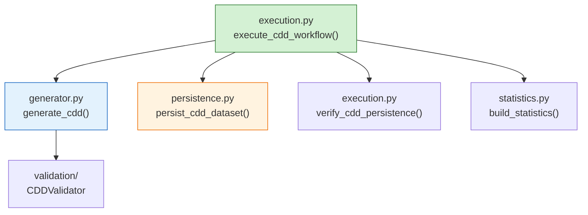

# AGRIFLOW-AI — Phase 12 Step 2C-C

## Canonical Development Dataset — Generation, Validation & Persistence

**Document Type:** Implementation Report  
**Version:** 1.0  
**Date:** 2026-06-29  
**Scope:** Phase 12 Step 2C-C — CDD execution layer (generation → persistence → verification)  
**Status:** Implementation Complete  
**Author:** Senior Platform Architecture  
**Governance References:**

| Document | Version | Status |
|---|---|---|
| `PHASE12_STEP2CA_CANONICAL_DEVELOPMENT_DATASET_ARCHITECTURE.md` | 1.0 | ✅ Approved |
| `PHASE12_STEP2B_COMPRESSION_IMPLEMENTATION_REPORT.md` | 1.1 | ✅ Complete |
| `backend/app/cdd/README.md` | Current | ✅ Active |

---

## Executive Summary

Phase 12 Step 2C-C delivers the **execution layer** for the Canonical Development Dataset (CDD). Building on the Step 2C-B generation framework, this step adds:

1. A public **generator entry point** (`generator.py`)
2. An isolated **persistence layer** (`persistence.py`)
3. **Execution statistics** (`statistics.py`)
4. An end-to-end **workflow orchestrator** (`execution.py`)

A full workflow run against the local PostgreSQL 17 / TimescaleDB 2.28 development database completed successfully:

| Metric | Result |
|---|---|
| **CDD version** | `cdd-v1.0.0` |
| **Profile** | `cdd-dev` |
| **Seed** | `42` |
| **Generator version** | `2c-c.1` |
| **Total rows generated** | 458,645 |
| **Total rows persisted** | 458,645 |
| **Pre-persistence validation** | Passed (0 errors, 1 warning) |
| **Post-persistence verification** | Passed (8/8 domains matched) |
| **Generation duration** | ~5.0 s |
| **Persistence duration** | ~28.5 s |
| **Total workflow duration** | ~33.8 s |

The CDD is now loadable into PostgreSQL deterministically, preparing Step 2C-D compression benchmarking.

---

## Architecture

The execution layer extends the approved CDD package without modifying repositories, services, APIs, ORM models, or Alembic migrations.



### Module Responsibilities

| Module | Responsibility | Persists? |
|---|---|---|
| `generator.py` | Orchestrator → metadata → validator | No |
| `persistence.py` | FK-ordered ORM bulk inserts, single commit | Yes |
| `statistics.py` | Aggregate counts, timing, validation summary | No |
| `execution.py` | Full workflow + verification + report | Orchestrates |

### Design Constraints Honoured

- No repository or service layer changes
- No API exposure
- No schema or migration changes
- Deterministic UUID v5 identities preserved through explicit `id` mapping
- Single transaction per execution with rollback on failure

---

## Execution Workflow

```
Generation (CDDOrchestrator)
        ↓
Metadata (CDDDataset.attach_metadata)
        ↓
Validation (CDDValidator — in-memory)
        ↓
Persistence (persist_cdd_dataset — FK order)
        ↓
Verification (scoped PostgreSQL COUNT queries)
        ↓
Statistics (build_statistics)
        ↓
Execution Report (CDDExecutionReport)
```

### Public API

```python
from app.cdd import generate_cdd, execute_cdd_workflow

# Generation only (no database writes)
result = generate_cdd(profile="cdd-dev", seed=42)

# Full workflow (async)
report = await execute_cdd_workflow(notes="local dev seed")
assert report.success
```

### FK Persistence Order

1. `farms`
2. `fields`
3. `soil_profiles` + `crops`
4. `weather_records` + `sensor_readings` + `satellite_observations` + `irrigation_events`
5. `disease_observations` + `yield_records`

---

## Validation

Pre-persistence validation uses the Step 2C-B `CDDValidator` framework with all default rules:

| Rule | Purpose |
|---|---|
| `profile_consistency` | Farm/field counts match manifest |
| `row_counts` | Per-domain counts vs manifest targets |
| `foreign_keys` | All FK references resolve in-memory |
| `unique_ids` | No duplicate UUIDs |
| `temporal_bounds` | Timestamps within anchor window |
| `seasonal_consistency` | Crop dates within 365-day horizon |
| `domain_coverage` | All ten domains present |

### Validation Outcome (cdd-dev, seed=42)

| Severity | Count | Notes |
|---|---|---|
| ERROR | 0 | Workflow proceeds to persistence |
| WARNING | 1 | `disease_observations` count 48 vs manifest target 54 (non-blocking) |

Validation failures block persistence. The execution workflow returns a `CDDExecutionReport` with `success=False` and does not write to PostgreSQL.

---

## Persistence

### Strategy

- **ORM bulk mappings** via `session.bulk_insert_mappings()` batched at 5,000 rows
- **Explicit deterministic IDs** passed in mappings (not server-generated UUID v4)
- **Single `commit()`** after all domains are queued
- **`rollback()`** on any exception

### Why Bulk Mappings

TimescaleDB hypertables use composite primary keys `(id, time_column)` per ADR-002. SQLAlchemy 2.x `session.add_all()` with `insertmanyvalues` RETURNING fails on these tables due to sentinel-value matching errors with timezone-aware timestamps. `bulk_insert_mappings` avoids RETURNING while remaining within the SQLAlchemy ORM session.

### Persisted Row Counts (Verified Run)

| Domain | Rows |
|---|---|
| farms | 1 |
| fields | 10 |
| soil_profiles | 10 |
| crops | 18 |
| weather_records | 14,600 |
| sensor_readings | 438,000 |
| satellite_observations | 5,840 |
| irrigation_events | 96 |
| disease_observations | 48 |
| yield_records | 22 |
| **Total** | **458,645** |

---

## Verification

Post-persistence verification compares **scoped PostgreSQL counts** against the generated dataset:

| Domain | Scope | Expected | Actual |
|---|---|---|---|
| farms | `farm.id IN (...)` | 1 | 1 |
| fields | `farm_id IN (...)` | 10 | 10 |
| crops | `field_id IN (...)` | 18 | 18 |
| weather_records | `field_id IN (...)` | 14,600 | 14,600 |
| sensor_readings | `field_id IN (...)` | 438,000 | 438,000 |
| satellite_observations | `field_id IN (...)` | 5,840 | 5,840 |
| disease_observations | `crop_id IN (...)` | 48 | 48 |
| yield_records | `crop_id IN (...)` | 22 | 22 |

Scoped queries ensure verification accuracy when unrelated data exists in the database. Mismatches fail the workflow and are reported in `CDDExecutionReport.errors`.

---

## Statistics

`CDDStatistics` captures:

| Field | Example (verified run) |
|---|---|
| `profile` | `cdd-dev` |
| `version` | `cdd-v1.0.0` |
| `seed` | `42` |
| `generator_version` | `2c-c.1` |
| `generation_duration_ms` | 4,998 |
| `persistence_duration_ms` | 28,484 |
| `total_elapsed_ms` | 33,761 |
| `validation_passed` | `true` |
| `verification_passed` | `true` |
| `generated_row_counts` | Per-domain dict |
| `persisted_row_counts` | Per-domain dict |

No compression ratios, query latencies, or chunk benchmarks are included — those belong to Step 2C-D.

---

## Lessons Learned

1. **Composite PK batch inserts** — TimescaleDB hypertable composite keys require `bulk_insert_mappings` rather than ORM `add_all()` with SQLAlchemy 2.x insertmanyvalues RETURNING.

2. **Temporal clamp on harvest dates** — The yield factory's multi-harvest date spread could exceed `TEMPORAL_END` / `CDD_REFERENCE_NOW` for late-season crops. A minimal clamp in `factories/yield_.py` was required to pass `temporal_bounds` validation before persistence could execute.

3. **Scoped verification** — Full-table `COUNT(*)` is insufficient for idempotent re-runs in shared databases. Verification scoped to generated entity IDs is more reliable.

4. **Disease count variance** — Manifest target of 54 disease observations vs actual 48 is a WARNING-level row count mismatch driven by episodic generation rules; non-blocking per validation framework design.

---

## Future Work

| Step | Action |
|---|---|
| **2C-D** | Compression ratio benchmarks against persisted CDD load |
| **CLI** | `make cdd-regenerate` wrapping `execute_cdd_workflow` |
| **CI** | Regenerate CDD before integration test suite |
| **Truncation policy** | Optional pre-persistence truncate for clean regeneration |
| **cdd-benchmark profile** | 15-minute sensor cadence for performance testing |
| **Disease volume tuning** | Align episodic factory output with manifest target 54 |

---

## References

| Document | Path |
|---|---|
| CDD Architecture | `docs/report/PHASE12_STEP2CA_CANONICAL_DEVELOPMENT_DATASET_ARCHITECTURE.md` |
| CDD Package README | `backend/app/cdd/README.md` |
| Compression Report | `docs/report/PHASE12_STEP2B_COMPRESSION_IMPLEMENTATION_REPORT.md` |
| Generator | `backend/app/cdd/generator.py` |
| Persistence | `backend/app/cdd/persistence.py` |
| Statistics | `backend/app/cdd/statistics.py` |
| Execution | `backend/app/cdd/execution.py` |

---

*This report documents Step 2C-C implementation. The CDD execution layer is ready for Step 2C-D compression benchmarking.*
