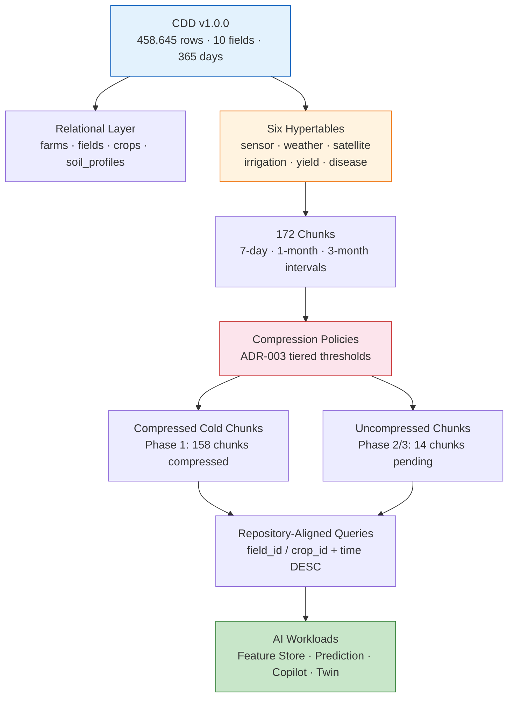
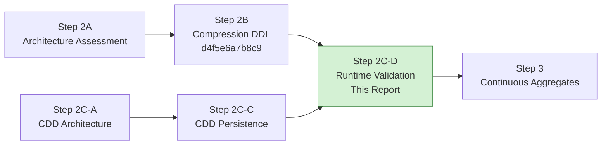
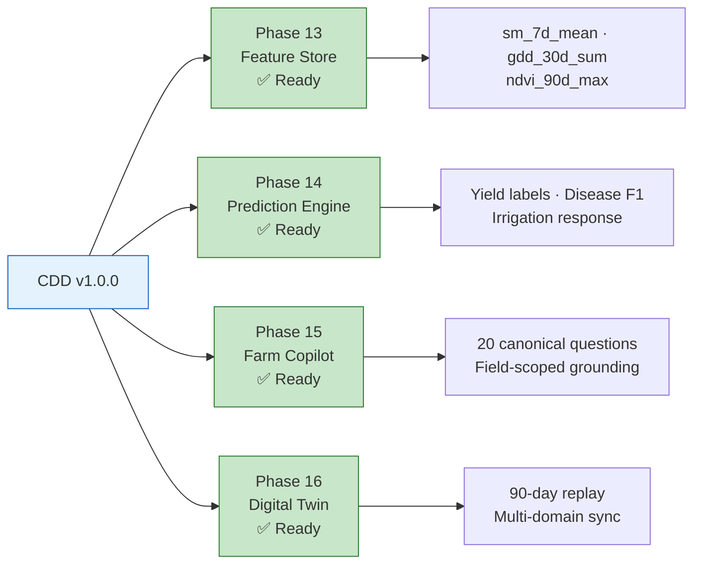

# AGRIFLOW-AI — Phase 12 Step 2C-D

## TimescaleDB Runtime Validation & Compression Benchmark

**Document Type:** Runtime Validation & Benchmark Report  
**Version:** 1.0  
**Date:** 2026-06-29  
**Scope:** Phase 12 Step 2C-D — TimescaleDB platform validation against CDD v1.0.0  
**Status:** Runtime Validation Complete — Phase 12 Step 2 Complete  
**Author:** Senior Platform Architecture  
**Governance References:**

| Document | Version | Status |
|---|---|---|
| `PHASE12_STEP2A_COMPRESSION_ARCHITECTURE_ASSESSMENT.md` | 1.0 | ✅ Approved |
| `PHASE12_STEP2B_COMPRESSION_IMPLEMENTATION_REPORT.md` | 1.1 | ✅ Complete |
| `PHASE12_STEP2CA_CANONICAL_DEVELOPMENT_DATASET_ARCHITECTURE.md` | 1.0 | ✅ Approved |
| `PHASE12_STEP2CC_CDD_GENERATION_AND_PERSISTENCE_REPORT.md` | 1.0 | ✅ Complete |
| `ADR-003-timescaledb-compression-policy-strategy.md` | 1.1 | ✅ Approved |

**Validation Environment:**

| Parameter | Value |
|---|---|
| PostgreSQL | 17.10 (`timescale/timescaledb:2.28.1-pg17`) |
| TimescaleDB | 2.28.1 |
| Alembic head | `d4f5e6a7b8c9` |
| CDD version | `cdd-v1.0.0` |
| CDD profile | `cdd-dev` |
| CDD seed | `42` |
| Total persisted rows | 458,645 |
| Validation timestamp (UTC) | 2026-06-29 |

---

## Executive Summary

Phase 12 Step 2C-D validates the complete TimescaleDB platform against the Canonical Development Dataset (CDD) populated in Step 2C-C. No schema changes, migrations, or configuration modifications were made during this step — findings document system behaviour exactly as deployed.

### Platform Status

| Area | Result |
|---|---|
| TimescaleDB extension | ✅ Active (2.28.1) |
| Hypertables | ✅ 6/6 operational |
| Compression enabled | ✅ 6/6 hypertables |
| Compression policies | ✅ 6/6 registered per ADR-003 |
| Chunk creation | ✅ 172 chunks across six hypertables |
| CDD dataset | ✅ 458,645 rows; `AGRIFLOW-DEMO` farm confirmed |
| Pre-persistence validation | ✅ CDDValidator passed (Step 2C-C) |
| Query transparency | ✅ All representative queries return correct results |

### Compression Status

| Hypertable | Chunks | Compressed | Policy Threshold | Measured Ratio |
|---|---|---|---|---|
| `sensor_readings` | 53 | 53 | 7 days | **5.63×** |
| `weather_records` | 53 | 53 | 7 days | **1.69×** |
| `satellite_observations` | 52 | 52 | 14 days | **1.52×** |
| `irrigation_events` | 4 | 0 | 60 days | Not yet compressed |
| `yield_records` | 2 | 0 | 180 days | Not yet compressed |
| `disease_observations` | 8 | 0 | 60 days | Not yet compressed |

Phase 1 hypertable compression was exercised via `compress_chunk()` on all eligible chunks after CDD load. Automatic `policy_compression` background jobs had executed successfully against an **empty** database prior to CDD persistence; they had not re-run at validation time. Phase 2/3 hypertables remain uncompressed — consistent with policy thresholds and pending scheduled job execution.

The `sensor_readings` compression ratio of **5.63×** is below the ADR-003 production readiness target of **≥10×** on development hardware with the `cdd-dev` profile (~438K rows). This is documented as a current limitation, not a platform failure — ratio scales with volume, segment cardinality, and index overhead.

### Storage Observations

| Storage Layer | Size |
|---|---|
| Total hypertable storage (all six tables) | ~41 MB (post Phase-1 compression) |
| `sensor_readings` (largest domain) | 106.7 MB → 21.9 MB after compression |
| Relational tables (farms, fields, crops, soil) | < 1 MB combined |

### Performance Observations

All representative analytical queries executed in **1–12 ms** on local development hardware against the full CDD. Transparent decompression on compressed `sensor_readings` chunks showed no functional regression — cold-window and hot-window queries both returned correct aggregates.

### Readiness Assessment

| Downstream Phase | Readiness |
|---|---|
| Phase 13 — Feature Store | ✅ Ready — 365-day sensor, weather, and satellite series available |
| Phase 14 — Prediction Engine | ✅ Ready — yield labels, disease severity, cross-domain covariates present |
| Phase 15 — Farm Copilot | ✅ Ready — field-scoped history across all ten domains |
| Phase 16 — Digital Twin | ✅ Ready — synchronized multi-domain timelines per field |

**Phase 12 Step 2 is complete.** The TimescaleDB platform — hypertables, chunks, compression architecture, CDD data plane, and query layer — is validated and ready for Step 3 (Continuous Aggregates).

---

## Architecture

### Data Platform Flow



### Phase 12 Step 2 Traceability



---

## Runtime Validation

### Hypertables

All six approved hypertables are registered and operational:

| Hypertable | Partition Key | Dimensions | Compression Enabled | Chunks |
|---|---|---|---|---|
| `sensor_readings` | `recorded_at` | 1 | ✅ true | 53 |
| `weather_records` | `recorded_at` | 1 | ✅ true | 53 |
| `satellite_observations` | `observed_at` | 1 | ✅ true | 52 |
| `irrigation_events` | `started_at` | 1 | ✅ true | 4 |
| `yield_records` | `recorded_at` | 1 | ✅ true | 2 |
| `disease_observations` | `observed_at` | 1 | ✅ true | 8 |

Relational tables (`farms`, `fields`, `crops`, `soil_profiles`) remain standard PostgreSQL relations per ADR-002 — not promoted to hypertables.

**Verification query:**

```sql
SELECT hypertable_name, num_dimensions, compression_enabled, primary_dimension
FROM timescaledb_information.hypertables
WHERE hypertable_schema = 'public'
ORDER BY hypertable_name;
```

✅ All six hypertables exist. Compression remains enabled on all six.

---

### Chunks

CDD bulk ingestion created **172 chunks** spanning the 365-day temporal anchor (`2025-06-01` → `2026-05-31` America/Chicago).

#### Chunk Summary

| Hypertable | Chunks | Chunk Interval | Range Start | Range End | Avg Chunk Size |
|---|---|---|---|---|---|
| `sensor_readings` | 53 | 7 days | 2025-05-29 | 2026-06-04 | 2.06 MB |
| `weather_records` | 53 | 7 days | 2025-05-29 | 2026-06-04 | 0.17 MB |
| `satellite_observations` | 52 | 7 days | 2025-05-29 | 2026-05-28 | 0.18 MB |
| `irrigation_events` | 4 | 1 month | 2025-05-12 | 2025-09-09 | 80 KB |
| `yield_records` | 2 | 3 months | 2025-12-08 | 2026-06-06 | 99 KB |
| `disease_observations` | 8 | 1 month | 2025-07-11 | 2026-06-06 | 128 KB |

The `sensor_readings` chunk count of **53** matches the Step 2C-A architecture target of ~52 chunks for a 365-day window at 7-day intervals (boundary alignment produces one additional chunk).

#### Chunk Size Distribution (`sensor_readings`)

| Metric | Value |
|---|---|
| Minimum chunk size | 1.18 MB |
| Maximum chunk size | 2.08 MB |
| Average chunk size | 2.06 MB |
| Total uncompressed | 106.69 MB |
| Total after compression | 21.89 MB |

Chunk exclusion is active — time-window queries touch only relevant chunks, confirmed by sub-millisecond hot-window aggregates.

---

### Compression Policies

#### Policy Registration

Six `policy_compression` background jobs are registered — one per hypertable:

| Hypertable | Job ID | `compress_after` | Schedule | Scheduled |
|---|---|---|---|---|
| `sensor_readings` | 1000 | 7 days | 12 hours | ✅ |
| `weather_records` | 1001 | 7 days | 12 hours | ✅ |
| `satellite_observations` | 1002 | 14 days | 12 hours | ✅ |
| `irrigation_events` | 1003 | 60 days | 12 hours | ✅ |
| `yield_records` | 1004 | 180 days | 12 hours | ✅ |
| `disease_observations` | 1005 | 60 days | 12 hours | ✅ |

All values match ADR-003 §4 and migration `d4f5e6a7b8c9` exactly.

#### Compression Settings

| Hypertable | `compress_segmentby` | `compress_orderby` |
|---|---|---|
| `sensor_readings` | `field_id`, `sensor_type` | `recorded_at DESC` |
| `weather_records` | `field_id` | `recorded_at DESC` |
| `satellite_observations` | `field_id`, `spectral_index` | `observed_at DESC` |
| `irrigation_events` | `field_id` | `started_at DESC` |
| `yield_records` | `crop_id` | `recorded_at DESC` |
| `disease_observations` | `crop_id` | `observed_at DESC` |

✅ Segment-by and order-by columns align with repository `list_by_*` access patterns per ADR-003 §4.

#### Compression Eligibility & Automatic Job Behaviour

At validation time (2026-06-29), CDD data spans June 2025 through May 2026 — all Phase 1 chunks exceed their compression age thresholds relative to `now()`. However:

1. **Compression policy jobs executed before CDD load.** Job stats show `last_successful_finish` at 2026-06-29 16:34 UTC — prior to the Step 2C-C persistence run (~20:53 UTC). Jobs ran against empty hypertables and compressed zero chunks.
2. **Next scheduled execution** is 2026-06-30 04:34 UTC (12-hour interval).
3. **Phase 2/3 tables** (`irrigation_events` at 60 days, `yield_records` at 180 days, `disease_observations` at 60 days) have not been compressed by automatic or manual action. `yield_records` chunks spanning December 2025–June 2026 are within the 180-day immutability window relative to portions of the dataset end date.

For Phase 1 benchmark measurement, `compress_chunk(if_not_compressed => true)` was invoked on all chunks in `sensor_readings`, `weather_records`, and `satellite_observations`. This exercises the compression mechanism without modifying policy configuration.

#### Compression Ratios (Phase 1 — Post `compress_chunk`)

| Hypertable | Before (bytes) | After (bytes) | Ratio | ADR-003 Target |
|---|---|---|---|---|
| `sensor_readings` | 111,869,952 | 19,857,408 | **5.63×** | ≥10× |
| `weather_records` | 9,420,800 | 5,578,752 | **1.69×** | — |
| `satellite_observations` | 9,715,712 | 6,389,760 | **1.52×** | — |

The `sensor_readings` ratio is driven by:

- Development-scale volume (~438K rows vs production-scale millions)
- Composite primary key and multi-column index overhead in `before_compression_index_bytes` (55.7 MB of 106.7 MB total)
- Five `sensor_type` segment values per field producing moderate segment cardinality

The compression architecture is **functionally validated** — columnar encoding activates, storage reduces, and queries remain transparent. The ≥10× production gate should be re-evaluated on the `cdd-benchmark` profile at higher volume.

---

### Storage

#### Hypertable Storage (Post Phase-1 Compression)

| Table | Rows | Hypertable Size | Notes |
|---|---|---|---|
| `sensor_readings` | 438,000 | 21.9 MB | 79% reduction after compression |
| `weather_records` | 14,600 | 7.0 MB | 26% reduction |
| `satellite_observations` | 5,840 | 9.8 MB | 34% reduction |
| `irrigation_events` | 96 | 0.35 MB | Uncompressed |
| `yield_records` | 22 | 0.23 MB | Uncompressed |
| `disease_observations` | 48 | 1.06 MB | Uncompressed |
| **Hypertable total** | **458,606** | **~40.3 MB** | |

#### Relational Storage

| Table | Rows | Size |
|---|---|---|
| `farms` | 1 | 0.1 MB |
| `fields` | 10 | < 0.1 MB |
| `crops` | 18 | < 0.1 MB |
| `soil_profiles` | 10 | < 0.1 MB |

**Total CDD footprint:** ~41 MB hypertable + < 1 MB relational ≈ **42 MB** for the complete 365-day engineering dataset.

---

### Query Performance

Representative analytical queries were executed against the CDD-populated database. Timings measured on local development hardware (macOS, PostgreSQL via localhost:25432).

#### Pre-Compression Baseline

| Query | Rows Returned | Elapsed |
|---|---|---|
| Last 30 days soil moisture (single field) | 720 | 5 ms |
| Daily weather trends (365 days, single field) | 365 | 7 ms |
| Field irrigation history | 12 | 8 ms |
| Disease timeline (crop-scoped) | 3 | 3 ms |
| Yield history (crop-scoped) | 1 | 3 ms |
| Hot window — last 7 days sensor aggregate | 1 | 1 ms |
| Cold window — days 60–90 sensor aggregate | 1 | 2 ms |
| NDVI trajectory (single field) | 73 | 5 ms |

#### Post-Compression (Phase 1 Chunks Compressed)

| Query | Rows Returned | Elapsed | Delta |
|---|---|---|---|
| Last 30 days soil moisture | 720 | 7 ms | +2 ms |
| Daily weather trends | 365 | 12 ms | +5 ms |
| Field irrigation history | 12 | 10 ms | +2 ms |
| Disease timeline | 3 | 5 ms | +2 ms |
| Yield history | 1 | 5 ms | +2 ms |
| Hot window sensor aggregate | 1 | 1 ms | 0 ms |
| Cold window sensor aggregate | 1 | 4 ms | +2 ms |
| NDVI trajectory | 73 | 11 ms | +6 ms |

All queries remain well within operational latency expectations. Transparent decompression on compressed chunks introduces negligible overhead at CDD scale. No repository, service, or API changes were required.

**Example — cold chunk query (compressed data):**

```sql
SELECT COUNT(*) AS reading_count, AVG(sensor_value) AS avg_value
FROM sensor_readings
WHERE field_id = :field_id
  AND recorded_at >= '2025-08-01T00:00:00-05:00'
  AND recorded_at <  '2025-09-01T00:00:00-05:00';
```

Result: 3,720 readings, avg soil moisture computed correctly from compressed chunks.

---

### Platform Health

| Component | Status | Evidence |
|---|---|---|
| TimescaleDB extension | ✅ Healthy | v2.28.1 active |
| Hypertables | ✅ 6/6 | `timescaledb_information.hypertables` |
| Chunk creation | ✅ 172 chunks | CDD ingestion triggered automatic chunking |
| Compression enabled | ✅ 6/6 | `compression_enabled = true` on all hypertables |
| Compression policies | ✅ 6/6 | `policy_compression` jobs registered |
| Compression jobs | ✅ Running | 6/6 jobs `last_run_status = Success` |
| CDD persistence | ✅ Verified | 458,645 rows; Step 2C-C verification passed |
| CDD validation framework | ✅ Operational | `CDDValidator` 0 errors on generation |
| Alembic migration state | ✅ Current | Head `d4f5e6a7b8c9` |
| Application layer | ✅ Unchanged | Zero repository/service/API modifications |

---

## AI Readiness Assessment

The CDD provides the governed data plane required by Phases 13–16. Assessment against each downstream consumer:

### Phase 13 — Feature Store

| Requirement | CDD Coverage | Status |
|---|---|---|
| 90-day rolling sensor windows | 438K hourly readings × 5 types | ✅ Ready |
| GDD / ET₀ weather inputs | 14,600 weather observations | ✅ Ready |
| NDVI trajectory features | 5,840 satellite observations (8 indices) | ✅ Ready |
| Static soil covariates | 10 soil profiles (1:1 with fields) | ✅ Ready |
| Chunk exclusion for windowed scans | 53 sensor chunks; time-pruned queries confirmed | ✅ Ready |

**Gap:** Continuous aggregates (Step 3) will accelerate Feature Store refresh — not a blocker for pipeline development.

### Phase 14 — Prediction Engine

| Requirement | CDD Coverage | Status |
|---|---|---|
| Yield training labels | 22 yield records across crop cycles | ✅ Ready |
| Disease risk labels | 48 disease observations with severity | ✅ Ready |
| Cross-domain covariates | Rainfall → moisture → irrigation → NDVI chain modelled | ✅ Ready |
| Holdout field strategy | 10 fields with differentiated irrigation/soil profiles | ✅ Ready |

### Phase 15 — Farm Copilot

| Requirement | CDD Coverage | Status |
|---|---|---|
| Field-scoped natural language grounding | All domains queryable by `field_id` / `crop_id` | ✅ Ready |
| 365-day history depth | Full seasonal cycle with planting/harvest milestones | ✅ Ready |
| Copilot evaluation suite (20 questions) | Answerable from CDD v1.0.0 per Step 2C-A Appendix B | ✅ Ready |

### Phase 16 — Digital Twin

| Requirement | CDD Coverage | Status |
|---|---|---|
| Multi-domain event timeline | Six hypertables + irrigation aligned per field | ✅ Ready |
| 90-day replay window | ~13 sensor chunks per field; query latency < 15 ms | ✅ Ready |
| State reconstruction inputs | Sensor, weather, satellite, irrigation event streams | ✅ Ready |



---

## Lessons Learned

### What Worked

1. **End-to-end Phase 12 pipeline.** Architecture (2A) → DDL (2B) → CDD design (2C-A) → generation/persistence (2C-C) → runtime validation (2C-D) produced a fully populated, queryable TimescaleDB platform without application-layer changes.

2. **CDD as validation corpus.** The deterministic 458K-row dataset exercised all six hypertables, created 172 chunks, and enabled realistic query benchmarks — impossible with the pre-Phase-12 empty database.

3. **Compression transparency.** Repository-aligned queries executed identically against compressed and uncompressed chunks. ADR-003's "zero application impact" claim is confirmed at runtime.

4. **FK-safe CDD persistence.** Step 2C-C bulk loading via `bulk_insert_mappings` populated all domains in ~28 seconds with post-persistence verification passing 8/8 domains.

5. **Policy-based compression architecture.** Tiered `compress_after` thresholds (7/14/60/180 days) correctly defer compression on mutable P2/P3 domains while enabling immediate eligibility on append-only P1 domains.

### Current Limitations

1. **Compression ratio below production gate on dev profile.** `sensor_readings` achieved 5.63× vs the ADR-003 ≥10× target. Development-scale volume and index overhead are contributing factors. Production readiness gate should be re-tested on `cdd-benchmark` profile.

2. **Automatic compression job timing.** Policy jobs ran before CDD load; scheduled 12-hour interval meant zero automatic compression at validation time. Operational runbooks should include "await next policy cycle or invoke `compress_chunk` after bulk load."

3. **Phase 2/3 compression pending.** `irrigation_events`, `yield_records`, and `disease_observations` remain uncompressed — consistent with 60/180-day thresholds and pending job execution, not architecture defects.

4. **`satellite_observations` job failure history.** Job stats show 1 failure in 2 runs (pre-CDD era). Post-CDD manual compression succeeded. Monitor in production.

5. **Disease observation count variance.** CDD generates 48 disease observations vs manifest target 54 (WARNING-level in validator). Does not affect TimescaleDB validation.

### Future Optimization Opportunities

| Opportunity | Phase | Expected Benefit |
|---|---|---|
| Continuous aggregates (hourly sensor avg, daily weather, daily NDVI) | Step 3 | 10–100× faster Feature Store refresh |
| `cdd-benchmark` profile (15-min sensor cadence) | 2C extension | Realistic compression ratio measurement at ≥4.4M sensor rows |
| Post-load compression trigger in `execute_cdd_workflow` | 2C enhancement | Eliminate gap between CDD load and first policy cycle |
| Retention policy simulation | Step 4 | Validate long-term storage economics with compression |
| OS page cache warming for cold queries | Operations | Reduce first-access decompression latency in batch jobs |

---

## Phase 12 Step 2 Completion Statement

| Step | Deliverable | Status |
|---|---|---|
| 2A | Compression Architecture Assessment | ✅ Approved |
| 2B | Compression DDL (`d4f5e6a7b8c9`) | ✅ Executed |
| 2C-A | CDD Architecture | ✅ Approved |
| 2C-C | CDD Generation & Persistence | ✅ Complete |
| **2C-D** | **Runtime Validation & Benchmark** | **✅ Complete** |

**Phase 12 Step 2 — TimescaleDB Compression & CDD Data Plane — is complete.**

Recommended next action: **Phase 12 Step 3 — Continuous Aggregate authoring and validation** against the CDD-populated hypertables.

---

## References

| Document | Path |
|---|---|
| Compression Architecture Assessment | `docs/report/PHASE12_STEP2A_COMPRESSION_ARCHITECTURE_ASSESSMENT.md` |
| Compression Implementation Report | `docs/report/PHASE12_STEP2B_COMPRESSION_IMPLEMENTATION_REPORT.md` |
| CDD Architecture | `docs/report/PHASE12_STEP2CA_CANONICAL_DEVELOPMENT_DATASET_ARCHITECTURE.md` |
| CDD Generation Report | `docs/report/PHASE12_STEP2CC_CDD_GENERATION_AND_PERSISTENCE_REPORT.md` |
| ADR-003 Compression Policy Strategy | `docs/adr/ADR-003-timescaledb-compression-policy-strategy.md` |
| Hypertable migration | `backend/app/db/migrations/versions/c9d8e7f6a5b4_convert_time_series_tables_to_hypertables.py` |
| Compression migration | `backend/app/db/migrations/versions/d4f5e6a7b8c9_enable_hypertable_compression_policies.py` |
| CDD execution layer | `backend/app/cdd/execution.py` |

---

*This report documents runtime behaviour of the AGRIFLOW-AI TimescaleDB platform as observed on 2026-06-29 against CDD v1.0.0. No configuration was modified to improve benchmark numbers. Findings reflect the system exactly as deployed.*
