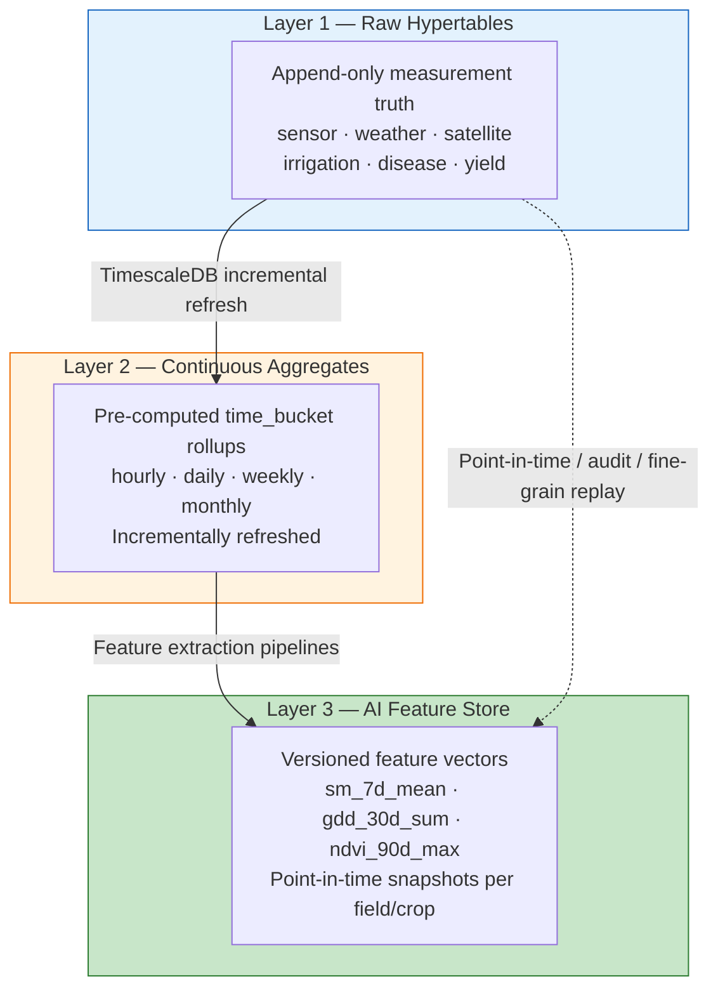
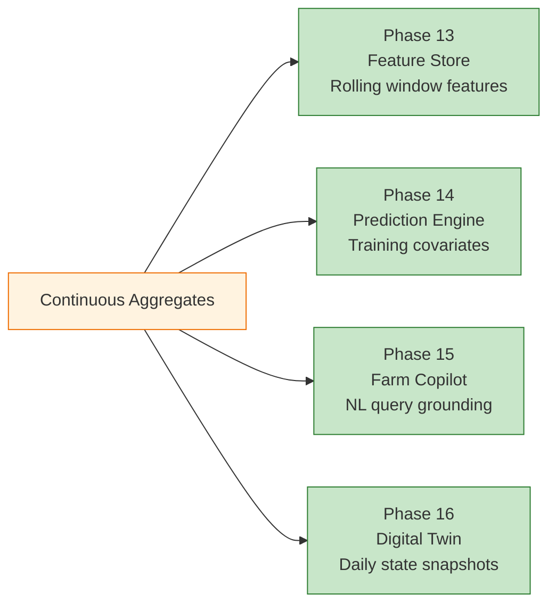
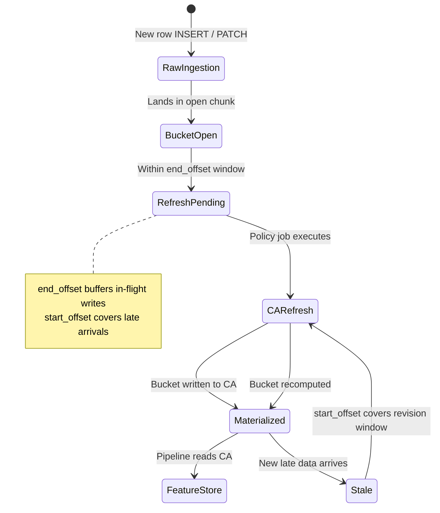
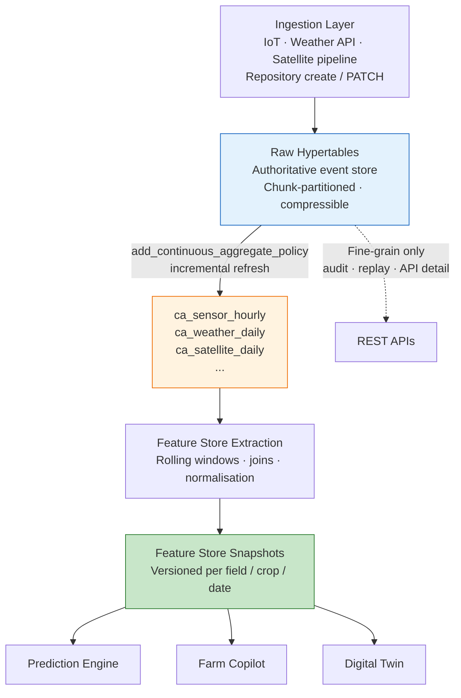
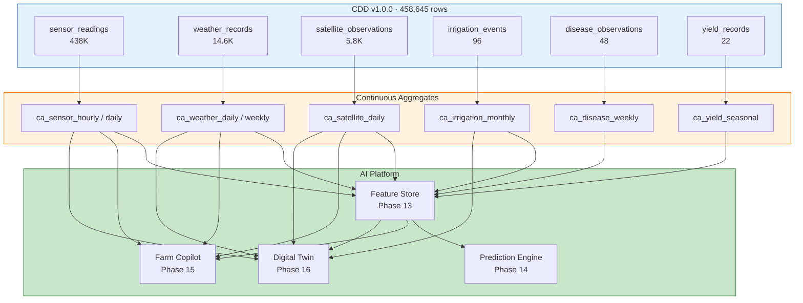
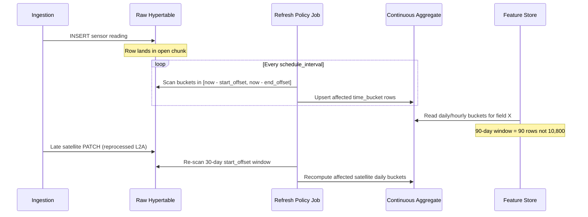
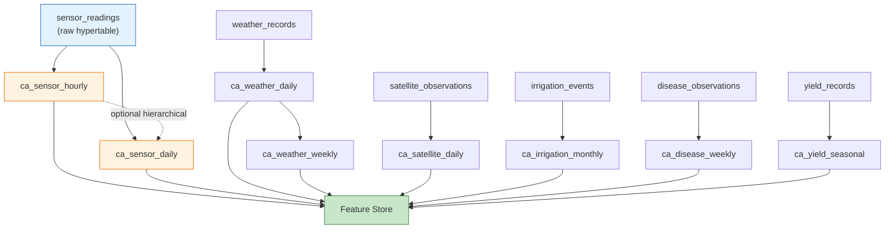
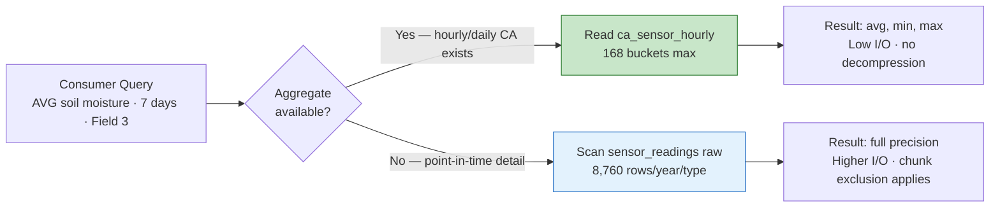

# AGRIFLOW-AI — Phase 12 Step 3A

## Continuous Aggregates Architecture Assessment

**Document Type:** Architecture Assessment (Read-Only)  
**Version:** 1.0  
**Date:** 2026-06-29  
**Scope:** Phase 12 Step 3A — Continuous Aggregate Strategy Design; ADR-004 Preparation  
**Status:** Architecture Assessment — Pending Review  
**Author:** Senior Platform Architecture  
**Governance References:**

| Document | Version | Status |
|---|---|---|
| `10-phase12-step1-foundation-handbook.md` | 1.1 | ✅ Approved |
| `PHASE12_STEP2A_COMPRESSION_ARCHITECTURE_ASSESSMENT.md` | 1.0 | ✅ Approved |
| `PHASE12_STEP2CA_CANONICAL_DEVELOPMENT_DATASET_ARCHITECTURE.md` | 1.0 | ✅ Approved |
| `PHASE12_STEP2CD_RUNTIME_VALIDATION_AND_BENCHMARK_REPORT.md` | 1.0 | ✅ Complete |
| `ADR-003-timescaledb-compression-policy-strategy.md` | 1.1 | ✅ Approved |
| `PHASE12_DECISION_REGISTER.md` | 1.4 | Active (P12-D012) |
| `06-roadmap.md` | Current | Active |

**Read-Only Activity Notice:** This document defines architecture only. No SQL, continuous aggregate DDL, Alembic migrations, repository changes, service changes, or API modifications are produced by this step. Implementation is deferred to Step 3B and subsequent steps, governed by a forthcoming ADR-004.

---

## Executive Summary

Phase 12 Steps 1–2 established the TimescaleDB storage foundation: six hypertables, 172 chunks from the Canonical Development Dataset (CDD), and policy-based compression per ADR-003. Step 2C-D confirmed that raw hypertable queries remain correct and fast at CDD scale (1–12 ms for representative analytics), but also identified that **repeated aggregation over the same time windows** — the dominant access pattern for AI feature engineering, dashboards, and multi-season analytics — still requires scanning raw rows (or decompressed chunks) on every execution.

**Continuous Aggregates (CAs)** are the third layer in the AGRIFLOW-AI TimescaleDB stack. They pre-materialise `time_bucket()` rollups as incrementally refreshed views over hypertables, eliminating redundant full-scan aggregation while preserving raw data as the authoritative source of truth.

### Why Continuous Aggregates Are Required

| Need | Raw Hypertables Alone | With Continuous Aggregates |
|---|---|---|
| **Feature Store refresh** | Re-aggregate 90-day sensor windows from 438K+ rows per field on every pipeline run | Read pre-computed hourly/daily buckets — bounded row counts |
| **Dashboard analytics** | Daily weather trends require grouping 14,600 raw rows per refresh | Daily summary is materialised once, queried many times |
| **Farm Copilot** | "Average soil moisture last week" scans raw hourly readings | Reads hourly CA for the 7-day window |
| **Digital Twin replay** | Multi-domain replay reconstructs state from raw event streams | Warm-state snapshots available from daily CAs; raw used for fine-grained replay |
| **Compressed cold data** | Aggregating over compressed chunks incurs decompression CPU | CAs materialise while data is hot/warm; cold queries hit summaries not raw |

Without continuous aggregates, Phase 13 Feature Store pipelines would repeatedly execute the same `time_bucket()` grouping logic that every downstream consumer needs — multiplying I/O, CPU, and pipeline duration as data volume grows.

### The Three-Layer Data Architecture



| Layer | Role | Mutability | Primary Consumers |
|---|---|---|---|
| **Raw Hypertables** | Authoritative event store; ingestion target | Append-only (P1); PATCH permitted (P2/P3) | APIs, audit, fine-grained replay |
| **Continuous Aggregates** | Derived analytical rollups | Auto-refreshed; not directly written by application | Feature Store, dashboards, Copilot, Twin warm-state |
| **AI Feature Store** | Model-ready feature vectors with versioning | Pipeline-managed snapshots | Prediction Engine, Copilot grounding, evaluation |

Raw hypertables answer *"what happened at time T?"* Continuous aggregates answer *"what was the daily/hourly pattern?"* The Feature Store answers *"what features does the model need for this field on this date?"*

### Assessment Outcome

This assessment recommends **eight continuous aggregates** across six hypertable domains, a tiered refresh strategy, and governance via **ADR-004 (Continuous Aggregate Strategy)**. P12-D012 (deferred since Step 1E-A) is resolved by this document and ready for ADR formalisation.

---

## AI Motivation

Every planned AI capability in Phases 13–16 consumes **aggregated time-window statistics**, not individual raw readings, for the majority of queries. Continuous aggregates align storage pre-computation with consumption patterns.

### Phase 13 — Feature Store

The Feature Store constructs feature vectors from CDD-defined windows (`sm_7d_mean`, `gdd_30d_sum`, `ndvi_90d_max`, `rainfall_14d_sum`, `irrigation_30d_mm`). Each feature requires rolling aggregation over a bounded time horizon. Without CAs, the Feature Store pipeline issues identical grouping queries on every materialisation run. Continuous aggregates reduce each feature extraction to a **bounded scan of pre-aggregated buckets** rather than a full raw hypertable pass.

### Phase 14 — Prediction Engine

Yield and disease models train on multi-week to multi-season covariate windows. Training batch jobs iterate over all fields and crop cycles — potentially re-reading the same 90-day sensor and weather history thousands of times during hyperparameter search. Daily and hourly CAs provide **stable training inputs** with predictable row cardinality per field per season.

### Phase 15 — Farm Copilot

Conversational queries ("How has soil moisture changed over the last week?", "What was the maximum temperature in July?") map to aggregation patterns, not single-row lookups. Copilot grounding queries against daily/hourly CAs return answers with **lower token payload** (summaries vs raw series) and lower query latency at production scale.

### Phase 16 — Digital Twin

Digital Twin replay operates at two granularities:

1. **Fine-grained replay** — event-level reconstruction from raw hypertables (irrigation events, individual sensor readings).
2. **Warm-state snapshots** — canopy health, soil moisture trend, cumulative rainfall at daily resolution for timeline visualisation.

Continuous aggregates serve the second mode. Raw hypertables remain mandatory for the first. This separation prevents replay workloads from repeatedly re-aggregating historical windows.



---

## Candidate Continuous Aggregates

### Selection Criteria

Each candidate aggregate must satisfy at least two of:

1. **Query repetition** — the same grouping is executed by multiple consumers (Feature Store, dashboard, Copilot).
2. **Volume reduction** — aggregation reduces row count by an order of magnitude or more.
3. **AI feature alignment** — maps directly to a named CDD feature window or Phase 13 feature specification.
4. **Repository alignment** — dimensions match existing `list_by_field`, `list_by_field_and_date_range`, or `list_by_field_and_spectral_index` access patterns.

Domains with sparse event data (`yield_records`, `disease_observations`) receive **lower-frequency aggregates** or deferred implementation — the architectural value is lower but AI traceability still warrants designed rollups.

### Aggregate Catalogue

| # | Proposed Name | Source Hypertable | Interval | Grouping Dimensions | Metrics | Intended Consumers | Refresh Cadence |
|---|---|---|---|---|---|---|---|
| 1 | `ca_sensor_hourly` | `sensor_readings` | **1 hour** | `field_id`, `sensor_type` | `AVG`, `MIN`, `MAX`, `COUNT` of `sensor_value` | Feature Store (`sm_7d_mean`), Copilot (recent trends), Digital Twin (hourly replay coarse mode) | **15 minutes** — near-real-time |
| 2 | `ca_sensor_daily` | `sensor_readings` | **1 day** | `field_id`, `sensor_type` | `AVG`, `MIN`, `MAX`, `STDDEV`, `COUNT` | Feature Store (30/90-day rolling), dashboards, Yield model stress features | **1 hour** |
| 3 | `ca_weather_daily` | `weather_records` | **1 day** | `field_id` | `AVG`/`MIN`/`MAX` temperature, `SUM` rainfall, `AVG` humidity, `SUM` solar radiation | Feature Store (`gdd_30d_sum`, `rainfall_14d_sum`), ET₀ inputs, Copilot weather answers | **1 hour** |
| 4 | `ca_weather_weekly` | `weather_records` | **1 week** | `field_id` | `SUM` rainfall, `AVG` temperature, frost-day count | Seasonal analytics, multi-season Copilot comparisons, lagged climate features | **1 day** |
| 5 | `ca_satellite_daily` | `satellite_observations` | **1 day** | `field_id`, `spectral_index` | `AVG`, `MIN`, `MAX` of `index_value`; `AVG` cloud cover | Feature Store (`ndvi_90d_max`), Yield canopy features, Copilot NDVI trends | **1 day** |
| 6 | `ca_irrigation_monthly` | `irrigation_events` | **1 month** | `field_id`, `irrigation_method` | `SUM` water volume, `COUNT` events, `SUM` duration | Feature Store (`irrigation_30d_mm` proxy), water-use dashboards, irrigation optimisation model | **1 day** |
| 7 | `ca_disease_weekly` | `disease_observations` | **1 week** | `field_id`, `crop_id` | `MAX` severity (ordinal encoding), `COUNT` observations, `AVG` affected area | Disease risk model, Copilot disease timeline, scouting dashboards | **1 day** |
| 8 | `ca_yield_seasonal` | `yield_records` | **1 crop season** (planting → harvest window) | `field_id`, `crop_id` | `AVG`/`MAX` yield value, `COUNT` harvest events | Lagged yield features, season-over-season Copilot, training labels enrichment | **On harvest event** (policy-triggered) |

### Per-Domain Justification

#### Sensor Readings (P1 — Critical)

- **Volume:** 438,000 CDD rows; highest-frequency domain (hourly × 5 types × 10 fields).
- **Why hourly:** Matches native ingestion cadence; `sm_7d_mean` requires 168 hourly buckets per field per sensor type — vs 8,760 raw rows per type per year.
- **Why daily:** 90-day Feature Store windows reduce from ~10,800 raw rows to 90 daily buckets per sensor type.
- **Compression interaction:** Hourly CA refresh should materialise data before P1 chunks compress (7-day threshold). Daily CA can aggregate from hourly CA (hierarchical) or raw — implementation decision for ADR-004.

#### Weather Records (P1 — Critical)

- **Volume:** 14,600 CDD rows (4× daily × 10 fields × 365 days).
- **Why daily:** GDD and ET₀ are daily computations; `temperature_min_c`/`temperature_max_c` on raw rows map naturally to daily `MIN`/`MAX`.
- **Why weekly:** Seasonal rainfall totals and Copilot multi-week comparisons; 52 buckets per field per year vs 1,460 raw rows.

#### Satellite Observations (P1 — Critical)

- **Volume:** 5,840 CDD rows (8 indices × ~73 passes × 10 fields); irregular 5-day cadence.
- **Why daily:** Sentinel passes do not align to clock hours; daily bucketing normalises revisit gaps. `ndvi_90d_max` scans 90 daily buckets per field instead of ~90–180 raw pass rows.
- **Dimension note:** `spectral_index` as grouping key matches `list_by_field_and_spectral_index` repository pattern and ADR-003 `compress_segmentby`.

#### Irrigation Events (P2 — High)

- **Volume:** 96 CDD rows — sparse, event-driven.
- **Why monthly:** Irrigation is seasonal; `irrigation_30d_mm` Feature Store feature maps to rolling monthly totals. Monthly bucketing produces ~12 rows per field per year.
- **Not hourly/daily:** Event frequency does not justify sub-daily buckets; empty buckets would dominate.

#### Disease Observations (P3 — Standard)

- **Volume:** 48 CDD rows — episodic scouting events.
- **Why weekly:** Disease pressure models use incubation windows of 7–14 days (CDD `rainfall_14d_sum` correlation). Weekly `MAX` severity captures outbreak peaks without over-aggregating sparse events.
- **Crop anchoring:** `crop_id` dimension matches grandchild FK topology and disease risk label structure.

#### Yield Records (P2 — High)

- **Volume:** 22 CDD rows — harvest-time point measurements.
- **Why seasonal (not hourly/daily):** Yield is a per-crop-cycle outcome, not a continuous signal. A time_bucket on `recorded_at` with season-aligned windows produces meaningful lagged features ("previous season yield for this field").
- **Deferral option:** If seasonal bucketing proves awkward in TimescaleDB CA semantics, implement as a Feature Store computation over raw `yield_records` only — lowest priority aggregate in this catalogue.

### Aggregates Explicitly Not Recommended

| Pattern | Reason for Exclusion |
|---|---|
| Raw-minute sensor rollups | No consumer; storage cost exceeds benefit at current scale |
| Per-crop sensor aggregates | Sensors anchor on `field_id`, not `crop_id`; crop context joins at Feature Store layer |
| Farm-level cross-field rollups | Belongs in Feature Store or API aggregation layer, not hypertable CA (cross-field queries lose chunk exclusion) |
| Duplicate of existing relational data | `soil_profiles`, `crops` metadata — not time-series |

---

## Refresh Strategy

TimescaleDB continuous aggregates support **automatic incremental refresh** via refresh policies. AGRIFLOW-AI adopts policy-based refresh aligned with data temperature tiers from ADR-003.

### Automatic Refresh

Each continuous aggregate receives a `add_continuous_aggregate_policy()` with:

- **`start_offset`** — how far back in time to re-scan for changes (must cover late-arriving data window).
- **`end_offset`** — how close to `now()` to materialise (latency buffer for in-flight writes).
- **`schedule_interval`** — how often the refresh job runs.

### Incremental Refresh

TimescaleDB CAs refresh **incrementally** — only buckets affected by new or modified raw data are recomputed. This is the primary performance advantage over traditional materialised views that require full re-computation.

Incremental refresh depends on:

- Raw hypertable inserts landing in buckets within the refresh window.
- Mutable table PATCH operations (P2/P3) potentially invalidating recent buckets — refresh policy `start_offset` must exceed the PATCH correction window per ADR-003 age thresholds.

### Late-Arriving Data

| Domain | Late-Arrival Risk | Mitigation |
|---|---|---|
| `sensor_readings` | Low — IoT pipeline is near-real-time | `end_offset` = 1 hour; `start_offset` = 3 days |
| `weather_records` | Low–medium — batch weather API imports | `start_offset` = 7 days |
| `satellite_observations` | **High** — reprocessing (L1C → L2A), cloud mask revisions | `start_offset` = 30 days; aligns with 14-day compression threshold |
| `irrigation_events` | Medium — operator corrections via PATCH | `start_offset` = 90 days; exceeds 60-day compression threshold |
| `disease_observations` | Medium — scouting backfill | `start_offset` = 60 days |
| `yield_records` | Low — harvest events are prompt | `start_offset` = 14 days |

### Refresh Windows — Tiered Strategy

| Tier | Aggregates | Schedule | `end_offset` | `start_offset` | Rationale |
|---|---|---|---|---|---|
| **T1 — Near-real-time** | `ca_sensor_hourly` | 15 minutes | 1 hour | 3 days | Copilot and dashboard freshness for recent IoT data |
| **T2 — Hourly** | `ca_sensor_daily`, `ca_weather_daily` | 1 hour | 1 day | 7 days | Feature Store daily pipeline cadence |
| **T3 — Daily** | `ca_weather_weekly`, `ca_satellite_daily`, `ca_irrigation_monthly`, `ca_disease_weekly` | 1 day | 1 day | 14–90 days (per domain) | Batch feature engineering; tolerates day-level staleness |
| **T4 — Event-driven** | `ca_yield_seasonal` | Manual / post-harvest trigger | — | Full season window | Sparse; refresh on `yield_records` INSERT |

### Trade-offs

| Approach | Advantage | Disadvantage |
|---|---|---|
| **Aggressive refresh (short schedule)** | Lower staleness for Copilot and dashboards | Higher background job CPU; more refresh churn on compressed data |
| **Conservative refresh (long schedule)** | Lower operational overhead | Feature Store and Copilot may serve stale summaries |
| **Wide `start_offset`** | Handles late-arriving satellite and PATCH corrections | Re-processes more buckets per refresh cycle |
| **Narrow `start_offset`** | Faster refresh jobs | Risk of stale buckets if data arrives late or is PATCHed |
| **Hierarchical CAs (daily from hourly)** | Faster daily refresh; single source for hourly consumers | Additional dependency; hourly CA failure blocks daily |

**Recommended posture:** T1 for `ca_sensor_hourly` only; T2 for primary Feature Store inputs; T3 for all others. Hierarchical dependency (`ca_sensor_daily` from `ca_sensor_hourly`) is **recommended** for sensor domain only — evaluated during ADR-004.



---

## Materialization Strategy

### Architecture Flow



### Why This Reduces Analytical Workload

1. **Compute once, read many.** A daily weather summary computed during CA refresh is stored once. The Feature Store, Copilot, and dashboards read the same materialised buckets — eliminating redundant `GROUP BY date_trunc('day', ...)` on every consumer.

2. **Bounded cardinality.** Feature Store extraction over 90 days reads 90 daily CA rows per field per metric — not 360 raw weather observations or 10,800 sensor readings. Pipeline runtime becomes **predictable** regardless of raw table growth.

3. **Compression synergy.** CAs materialise most effectively on recent (uncompressed) data during refresh. Once raw chunks compress, refresh jobs that must re-scan compressed data are expensive — wide `start_offset` policies should be balanced against compression age per ADR-003. Historical CA buckets **remain queryable** even after source chunks compress.

4. **Separation of concerns.** Raw hypertables serve APIs and audit. CAs serve analytics. Feature Store serves ML. No layer bypasses another — Clean Architecture is preserved by introducing CA read paths as new repository methods (Step 3B), not by modifying existing `list_by_field` contracts.

5. **Copilot token efficiency.** Copilot grounding retrieves daily/hourly summaries for NL answers — smaller result sets than raw series reduce LLM context consumption.

### Materialisation Ownership

| Artifact | Owner | Lifecycle |
|---|---|---|
| Raw hypertables | Domain repositories (existing) | Ingestion-driven |
| Continuous aggregates | Platform Engineering (Alembic) | Refresh policy-driven |
| Feature Store snapshots | AI Engineering | Pipeline schedule-driven |

---

## AI Traceability Matrix

| Continuous Aggregate | Phase 13 — Feature Store | Phase 14 — Prediction Engine | Phase 15 — Farm Copilot | Phase 16 — Digital Twin |
|---|---|---|---|---|
| `ca_sensor_hourly` | `sm_7d_mean`, rolling moisture trends | Soil moisture deficit covariates | "Soil moisture last week" trend answers | Hourly state timeline (coarse mode) |
| `ca_sensor_daily` | 30/90-day rolling stats, stress indicators | Water stress during reproductive stage | "Monthly average soil temperature" | Daily field health snapshot |
| `ca_weather_daily` | `gdd_30d_sum`, `rainfall_14d_sum`, ET₀ inputs | Temperature/rainfall yield covariates | "How much rain last week?" | Daily weather layer in replay |
| `ca_weather_weekly` | Seasonal rainfall accumulation | Multi-season climate normalisation | "Compare rainfall to last season" | Seasonal climate context |
| `ca_satellite_daily` | `ndvi_90d_max`, NDWI water stress | Canopy health yield features | "Show NDVI trend for corn field" | Vegetation health daily state |
| `ca_irrigation_monthly` | `irrigation_30d_mm` | Irrigation response features | "When was Field 7 last irrigated?" (volume context) | Irrigation intervention summary layer |
| `ca_disease_weekly` | `disease_severity_max` | Disease risk training labels | "Any critical disease severity?" | Disease pressure state updates |
| `ca_yield_seasonal` | Lagged yield features | **Primary training labels** enrichment | "What was last season's corn yield?" | Harvest outcome in replay terminal state |

### CDD Feature Window Alignment

| CDD Feature (Step 2C-A) | Primary CA Source | Secondary Source |
|---|---|---|
| `sm_7d_mean` | `ca_sensor_hourly` | `ca_sensor_daily` |
| `gdd_30d_sum` | `ca_weather_daily` | — |
| `ndvi_90d_max` | `ca_satellite_daily` | — |
| `rainfall_14d_sum` | `ca_weather_daily` | — |
| `irrigation_30d_mm` | `ca_irrigation_monthly` | Raw `irrigation_events` (exact dates) |
| `disease_severity_max` | `ca_disease_weekly` | Raw `disease_observations` |
| `yield_actual` | Raw `yield_records` | `ca_yield_seasonal` |

---

## Architecture Diagrams

### 1. Raw Data → Continuous Aggregate → AI



### 2. Refresh Lifecycle



### 3. Aggregate Dependency Graph



### 4. Query Acceleration Workflow



---

## Performance Expectations

Benchmark numbers are **not stated** in this assessment — Step 3B will measure against CDD v1.0.0 per the Step 2C-A benchmark matrix. The following are **qualitative expectations** grounded in TimescaleDB continuous aggregate behaviour and Step 2C-D observations.

### Dashboard Queries

| Query Pattern | Raw Hypertable (Step 2C-D) | Expected with CA |
|---|---|---|
| Daily weather trend (365 days, 1 field) | 7–12 ms at CDD scale | **Faster and stable** — reads 365 pre-aggregated rows regardless of raw growth |
| NDVI trajectory (73 passes) | 5–11 ms | **Comparable or faster** — daily buckets normalise irregular pass cadence |
| Sensor 30-day chart | Not benchmarked (720 rows for 30-day hourly) | **Predictable** — 720 hourly CA rows vs variable raw scan |

At production scale (100 farms, 1,000 fields), raw aggregation queries degrade linearly. CA queries degrade with **bucket count** (time window / interval) — independent of farm count growth for field-scoped queries.

### Feature Engineering

- **Pipeline idempotency:** Feature Store reruns read deterministic CA buckets — no non-determinism from raw row ordering.
- **Pipeline duration:** Expected **substantial reduction** in extraction phase I/O as raw hypertables grow beyond CDD scale; qualitative expectation is that 90-day feature extraction becomes bounded by CA row count, not raw row count.
- **Compression interaction:** Feature extraction from CAs avoids repeated decompression of cold compressed chunks during batch jobs.

### AI Inference

- **Training (Phase 14):** Batch training benefits most — epoch iterations reuse materialised buckets.
- **Real-time inference (Phase 14–15):** Recent-window features served from T1/T2 CAs with low staleness (15 min – 1 hour).
- **Copilot (Phase 15):** Summary-level answers avoid serialising thousands of raw readings into LLM context.

### Historical Analytics

- **Multi-season comparison:** Weekly/monthly CAs (`ca_weather_weekly`, `ca_irrigation_monthly`) enable season-over-season queries without scanning multiple years of raw data.
- **Digital Twin (Phase 16):** 90-day replay at daily resolution reads CA buckets for state reconstruction; event-level detail still uses raw streams. Step 2C-A targets < 30 s for 90-day replay — CAs contribute by reducing aggregation compute during replay setup.

---

## Risks

| Risk | Severity | Description | Mitigation |
|---|---|---|---|
| **Refresh lag** | Medium | T3 daily refresh means Feature Store may read summaries up to 24 hours stale | Tier T1/T2 for time-sensitive features; document staleness in Feature Store metadata |
| **Storage overhead** | Low–Medium | Each CA stores additional derived rows; eight aggregates add storage atop 126 MB CDD hypertable footprint | CA row cardinality is bounded by `(fields × types × buckets)` — far smaller than raw; monitor via `hypertable_size()` |
| **Stale aggregates** | Medium | Late-arriving satellite data or PATCH on irrigation/yield invalidates recent buckets | Per-domain `start_offset` exceeding correction windows; satellite: 30-day lookback |
| **Dependency management** | Medium | Hierarchical CA (`daily` from `hourly`) creates refresh ordering dependency | Limit hierarchy to sensor domain; independent refresh for all other domains |
| **Mutable table interaction** | High | PATCH on `irrigation_events` / `disease_observations` within refresh window forces bucket recomputation | `start_offset` > ADR-003 compression age for mutable tables; document PATCH → refresh latency |
| **Compression × refresh conflict** | Medium | Refresh jobs scanning compressed chunks incur decompression cost | Materialise CAs before chunks compress where possible; keep `start_offset` narrow for P1 domains |
| **Over-aggregation** | Low | Too-coarse buckets lose peak events (e.g., heatwave hours smoothed to daily) | Retain raw hypertable for peak/detection features; use hourly CA for `sm_7d_mean`, daily for seasonal |
| **Empty bucket proliferation** | Low | Sparse domains (irrigation, yield) produce mostly-empty monthly/seasonal buckets | Accept sparse storage; cardinality remains low at AGRIFLOW scale |
| **Operational complexity** | Medium | Eight CAs × refresh policies increases monitoring surface | Phased rollout P1 → P2 → P3; unified health check on `timescaledb_information.job_stats` |

---

## Governance

### Recommended ADR-004 — Continuous Aggregate Strategy

ADR-003 established compression (Step 2B) and explicitly deferred continuous aggregates to Step 3. The ADR-003 traceability chain reserves **ADR-004** for continuous aggregates and **ADR-005** for retention policies (Step 4). This assessment recommends **ADR-004** as the governing document for all continuous aggregate implementation.

| ADR-004 Section | Recommended Content |
|---|---|
| **Decision** | Adopt TimescaleDB continuous aggregates as the pre-computed analytical layer between raw hypertables and the AI Feature Store |
| **Scope** | Eight aggregates across six hypertables per this assessment §Candidate Continuous Aggregates |
| **Out of scope** | Retention policies (ADR-005), repository method signatures (separate ADR per domain if needed), Feature Store schema |
| **Naming convention** | `ca_{domain}_{interval}` — e.g., `ca_sensor_hourly`, `ca_weather_daily` |
| **Refresh policy** | Tiered T1–T4 per §Refresh Strategy; values specified per aggregate in ADR-004 appendix |
| **Materialization** | Raw → CA → Feature Store; no application writes to CAs |
| **Rollout sequence** | Phase 1: sensor + weather + satellite; Phase 2: irrigation; Phase 3: disease + yield |
| **Validation gate** | CDD v1.0.0 refresh benchmark per Step 2C-A matrix before production declaration |

### Naming Convention

```
ca_{domain}_{interval}
```

| Component | Rule | Example |
|---|---|---|
| Prefix | `ca_` identifies continuous aggregate objects | `ca_sensor_hourly` |
| Domain | Matches hypertable semantic name (singular) | `sensor`, `weather`, `satellite` |
| Interval | `hourly`, `daily`, `weekly`, `monthly`, `seasonal` | `ca_weather_daily` |

TimescaleDB internal materialisation tables will use TimescaleDB-generated names; application and repository references use the `ca_*` logical names in ADR-004 and migration comments.

### Refresh Policy Ownership

| Role | Responsibility |
|---|---|
| **Platform Architecture** | ADR-004 approval, aggregate catalogue, refresh tier definitions |
| **Data Engineering** | Alembic migrations, refresh policy DDL, CDD validation (Step 3B) |
| **AI Engineering** | Feature Store consumption contracts; feature-to-CA mapping |
| **All Developers** | No direct CA DDL outside Alembic; propose new aggregates via ADR amendment |

### Lifecycle Management

| Event | Action |
|---|---|
| New aggregate required | ADR-004 amendment + Alembic migration + CDD validation |
| New grouping dimension | ADR amendment (breaking — requires CA rebuild) |
| Refresh policy tuning | ADR-004 patch + migration (non-breaking if widening windows) |
| CDD version bump | Re-validate all CA refresh jobs against new row counts |
| Deprecation | ADR supersession; `remove_continuous_aggregate_policy()` in downgrade path |

### P12-D012 Resolution

Decision register entry **P12-D012 — Continuous Aggregate Strategy** is resolved by this assessment:

| P12-D012 Item | Resolution |
|---|---|
| Hourly sensor by `(field_id, sensor_type)` | ✅ `ca_sensor_hourly` |
| Daily weather by `field_id` | ✅ `ca_weather_daily` |
| Daily NDVI/EVI by `(field_id, spectral_index)` | ✅ `ca_satellite_daily` |
| Monthly irrigation by `field_id` | ✅ `ca_irrigation_monthly` |
| Status | ⏳ Deferred → **✅ Architecture Complete — Pending ADR-004 Approval** |

---

## Architecture Decision

### Decision

**Adopt eight TimescaleDB continuous aggregates** across six hypertables as the pre-computed analytical layer for Phase 13–16 AI workloads, governed by ADR-004, implemented in Step 3B after ADR approval.

### Rationale

1. **Sequential stack completion** — Hypertables (Step 1) and compression (Step 2) are validated; CAs are the third TimescaleDB capability required before Feature Store development.
2. **AI access pattern alignment** — Phases 13–16 consume aggregated time-window statistics, not raw point readings, for the majority of queries.
3. **CDD validation readiness** — Step 2C-A defines three CA validation scenarios; Step 2C-D confirms CDD data and chunk infrastructure are operational.
4. **Zero API impact** — CAs are a persistence-layer addition; existing repository contracts remain unchanged until optional analytics methods are added in Step 3C.
5. **Compression synergy** — CAs reduce repeated decompression of cold chunks during batch analytics.

### Alternatives Considered

| Alternative | Rejected Because |
|---|---|
| Application-level caching (Redis) | No time-bucket semantics; invalidation complexity; does not reduce database aggregation cost |
| Traditional PostgreSQL materialised views | Full refresh required; no incremental hypertable-aware refresh |
| Feature Store computes all aggregations ad hoc | Duplicates logic across consumers; pipeline duration grows with raw volume |
| Single mega-aggregate per hypertable | Loses interval flexibility; different consumers need hourly vs daily granularity |
| Skip CAs; query raw at CDD scale | Acceptable at 458K rows; does not scale to production farm counts |

### Consequences

| Consequence | Detail |
|---|---|
| ADR-004 required before Step 3B | Implementation blocked until ADR approval |
| Eight Alembic migrations or one consolidated migration | Platform Engineering decision in ADR-004 |
| New repository read methods (Step 3C) | `AggregationRepository` or per-domain CA query methods — separate from existing `list_by_field` |
| Monitoring additions | `timescaledb_information.job_stats` for CA refresh jobs alongside compression jobs |
| Step 3B validation | CDD refresh benchmark per Step 2C-A matrix |

### Recommended Next Steps

| Step | Action | Owner |
|---|---|---|
| 3A | Approve this architecture assessment | Platform Architecture |
| 3A+ | Author and approve ADR-004 Continuous Aggregate Strategy | Platform Architecture |
| 3B | Implement CA DDL + refresh policies via Alembic | Data Engineering |
| 3B | Validate refresh against CDD v1.0.0 | Data Engineering |
| 3C | Add repository CA read methods (if authorised by ADR-004) | Data Engineering |
| 4 | Retention policy architecture (ADR-005) | Platform Architecture |

---

## References

| Document | Path |
|---|---|
| Phase 12 Step 1 Foundation Handbook | `docs/10-phase12-step1-foundation-handbook.md` |
| Compression Architecture Assessment | `docs/report/PHASE12_STEP2A_COMPRESSION_ARCHITECTURE_ASSESSMENT.md` |
| CDD Architecture | `docs/report/PHASE12_STEP2CA_CANONICAL_DEVELOPMENT_DATASET_ARCHITECTURE.md` |
| Runtime Validation Report | `docs/report/PHASE12_STEP2CD_RUNTIME_VALIDATION_AND_BENCHMARK_REPORT.md` |
| ADR-003 Compression Policy Strategy | `docs/adr/ADR-003-timescaledb-compression-policy-strategy.md` |
| Phase 12 Decision Register | `docs/report/PHASE12_DECISION_REGISTER.md` |
| AGRIFLOW-AI Roadmap | `docs/06-roadmap.md` |
| Architecture Diagrams (CA layer) | `docs/09-architecture-diagrams.md` |

---

*This document is the definitive architectural specification for Phase 12 Step 3 continuous aggregate implementation. All DDL, refresh policies, and repository analytics methods require ADR-004 approval before implementation begins.*
