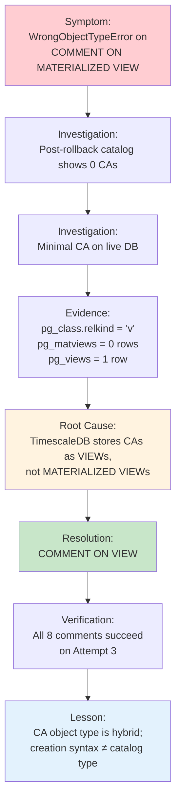
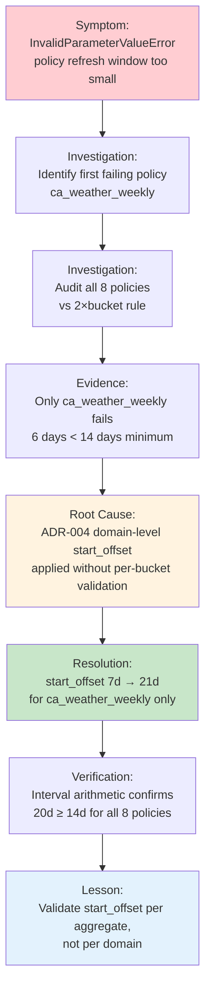
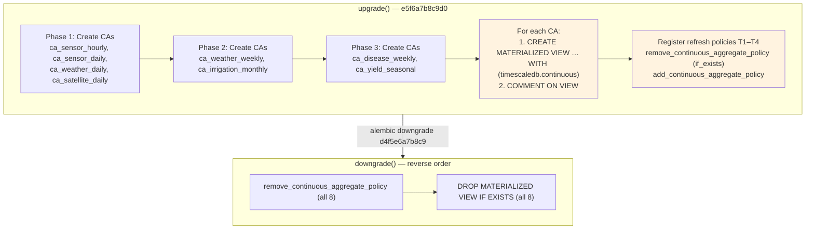
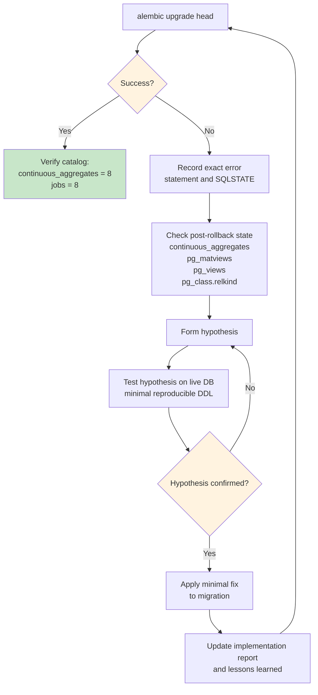

# AGRIFLOW-AI — Phase 12 Step 3B

## Continuous Aggregate Implementation — Lessons Learned

**Document Type:** Engineering Knowledge Capture  
**Version:** 1.0  
**Date:** 2026-06-30  
**Scope:** Debugging journey for TimescaleDB Continuous Aggregate migration `e5f6a7b8c9d0`  
**Audience:** Platform engineers, data engineers, future Phase 12+ contributors  
**Status:** Complete — reflects runtime debugging through migration v1.3

---

## 1. Executive Summary

This document captures the **complete debugging journey** undertaken while implementing TimescaleDB Continuous Aggregates during Phase 12 Step 3B. It is **not** an implementation report. The implementation report (`PHASE12_STEP3B_CONTINUOUS_AGGREGATE_IMPLEMENTATION_REPORT.md`) records *what* was built; this document records *what failed, why it failed, how each hypothesis was tested, and how the final solution was reached*.

Complex infrastructure work — especially extension-specific DDL executed through Alembic — often requires **multiple runtime validation cycles**. Authoring migration SQL against an approved ADR is necessary but not sufficient. TimescaleDB continuous aggregates expose a hybrid object model that diverges from standard PostgreSQL semantics in ways that are not obvious from DDL syntax alone. Refresh policy parameters derived at the architectural level must be validated against per-aggregate bucket widths before runtime registration.

Step 3B required **three runtime attempts** and **two distinct root-cause corrections** before the migration could proceed past policy registration:

| Attempt | Failure Point | Root Cause | Resolution |
|---|---|---|---|
| 1 (v1.0) | `COMMENT ON MATERIALIZED VIEW ca_sensor_hourly` | TimescaleDB CAs are `relkind='v'`, not `'m'` | `COMMENT ON VIEW` (v1.2) |
| 1 (v1.0) — red herring | Same error | Hypothesised `DO $$ EXECUTE` wrapper | Replaced with direct `op.execute()` (v1.1) — **did not fix** |
| 2 (v1.2) | `add_continuous_aggregate_policy('ca_weather_weekly')` | Refresh window < 2 × bucket width | `start_offset` 7 days → 21 days (v1.3) |
| 3 (v1.3) | — | — | Expected success |

This document exists so future contributors do not repeat these investigations.

---

## 2. Initial Architecture

### 2.1 Governance Chain

```
Step 3A — Continuous Aggregate Architecture Assessment
        ↓
ADR-004 — TimescaleDB Continuous Aggregate Strategy (Approved)
        ↓
Step 3B — Alembic migration e5f6a7b8c9d0
        ↓
Step 3C — Runtime validation against CDD v1.0.0 (pending)
```

### 2.2 ADR-004 Mandate

ADR-004 authorises eight continuous aggregates across six hypertables, with tiered refresh policies T1–T4:

| Tier | Aggregates | Schedule | Typical start_offset |
|---|---|---|---|
| T1 | `ca_sensor_hourly` | 15 minutes | 3 days |
| T2 | `ca_sensor_daily`, `ca_weather_daily` | 1 hour | 7 days |
| T3 | `ca_weather_weekly`, `ca_satellite_daily`, `ca_irrigation_monthly`, `ca_disease_weekly` | 1 day | 7–90 days (per domain) |
| T4 | `ca_yield_seasonal` | Daily (approximation) | 365 days |

Step 3B scope is strictly persistence-layer DDL: no repository, service, API, or SQLAlchemy model changes.

### 2.3 Expected Runtime Behaviour

On `alembic upgrade head`, the migration was expected to:

1. Create eight `CREATE MATERIALIZED VIEW … WITH (timescaledb.continuous)` objects `WITH NO DATA`
2. Attach `COMMENT ON` descriptions to each aggregate
3. Register `add_continuous_aggregate_policy()` for each aggregate
4. Leave Alembic at revision `e5f6a7b8c9d0` with eight rows in `timescaledb_information.continuous_aggregates`

**Environment:** PostgreSQL 17.10, TimescaleDB 2.28.1, Docker, database `agriflow`, CDD v1.0.0 (458,645 rows).

---

## 3. Failure Timeline

```mermaid
flowchart TD
    A["v1.0 — Initial migration authored<br/>DO $$ EXECUTE + COMMENT ON MATERIALIZED VIEW"]
    A --> B["Attempt 1: alembic upgrade head"]
    B --> C["❌ WrongObjectTypeError<br/>ca_sensor_hourly is not a materialized view"]
    C --> D["Hypothesis: DO $$ EXECUTE prevents TimescaleDB catalog registration"]
    D --> E["v1.1 — Replace with direct op.execute()"]
    E --> F["Attempt 2: alembic upgrade head"]
    F --> G["❌ Same WrongObjectTypeError<br/>DO $$ was NOT the root cause"]
    G --> H["Investigation: minimal CA on live DB<br/>Inspect pg_class.relkind"]
    H --> I["Evidence: relkind = 'v' not 'm'"]
    I --> J["v1.2 — COMMENT ON VIEW"]
    J --> K["Attempt 3: alembic upgrade head"]
    K --> L["✅ All 8 CAs created<br/>✅ All 8 comments applied"]
    L --> M["❌ InvalidParameterValueError<br/>policy refresh window too small<br/>ca_weather_weekly"]
    M --> N["Audit all 8 policies vs 2×bucket rule"]
    N --> O["Only ca_weather_weekly fails<br/>7d - 1d = 6d < 14d minimum"]
    O --> P["v1.3 — start_offset 7 days → 21 days"]
    P --> Q["Attempt 4: alembic upgrade head<br/>Expected: full success"]

    style C fill:#ffcdd2
    style G fill:#ffcdd2
    style M fill:#ffcdd2
    style L fill:#c8e6c9
    style Q fill:#c8e6c9
```



### Chronological Summary

| Step | Version | Action | Outcome |
|---|---|---|---|
| 1 | v1.0 | Migration authored with procedural `DO $$ EXECUTE` wrapper and `COMMENT ON MATERIALIZED VIEW` | Not yet executed |
| 2 | v1.0 | `alembic upgrade head` | Failed at first `COMMENT ON MATERIALIZED VIEW` |
| 3 | v1.1 | Replaced `DO $$ EXECUTE` with direct `op.execute()` | Hypothesis: procedural wrapper blocked catalog registration |
| 4 | v1.1 | `alembic upgrade head` | **Same failure** — hypothesis disproved |
| 5 | v1.2 | Live DB test: minimal CA + `pg_class` inspection | Root cause confirmed: `relkind = 'v'` |
| 6 | v1.2 | Changed to `COMMENT ON VIEW` | — |
| 7 | v1.2 | `alembic upgrade head` | CAs and comments succeeded; policy registration failed |
| 8 | v1.3 | Full policy audit; corrected `ca_weather_weekly` start_offset | — |
| 9 | v1.3 | `alembic upgrade head` | Expected full success |

**Critical observation:** After every failed attempt, Alembic rolled back cleanly to `d4f5e6a7b8c9`. Post-rollback verification consistently showed zero CAs — confirming that partial state does not persist across transaction boundaries.

---

## 4. Runtime Error #1 — WrongObjectTypeError

### 4.1 Symptom

```
WrongObjectTypeError: "ca_sensor_hourly" is not a materialized view
```

Failure occurred on the first statement after `CREATE MATERIALIZED VIEW ca_sensor_hourly … WITH NO DATA` succeeded (or appeared to succeed within the transaction):

```sql
COMMENT ON MATERIALIZED VIEW ca_sensor_hourly IS '...';
```

Post-rollback state:

```sql
SELECT * FROM timescaledb_information.continuous_aggregates;
-- 0 rows

SELECT * FROM pg_matviews WHERE matviewname = 'ca_sensor_hourly';
-- 0 rows

SELECT * FROM information_schema.tables WHERE table_name = 'ca_sensor_hourly';
-- 0 rows
```

### 4.2 Hypotheses Investigated

| # | Hypothesis | Investigation | Verdict |
|---|---|---|---|
| H1 | `DO $$ … EXECUTE` wrapper prevents TimescaleDB from registering the CA in its catalog | Replaced with direct `op.execute()` (v1.1); re-ran migration | **Disproved** — identical error |
| H2 | `CREATE MATERIALIZED VIEW` failed silently inside the `DO` block | Removed `DO` block; error still on `COMMENT ON`, not on `CREATE` | **Disproved** — CREATE succeeds |
| H3 | TimescaleDB stores CAs as a different PostgreSQL object type than materialized views | Created minimal CA on live DB; inspected `pg_class` | **Confirmed** — root cause |

### 4.3 Live Database Verification

A minimal continuous aggregate was created directly against TimescaleDB 2.28.1 / PostgreSQL 17.10:

```sql
CREATE MATERIALIZED VIEW _debug_ca_test
WITH (timescaledb.continuous) AS
SELECT
    time_bucket(INTERVAL '1 hour', recorded_at) AS bucket,
    field_id,
    COUNT(*) AS cnt
FROM sensor_readings
GROUP BY bucket, field_id
WITH NO DATA;
-- CREATE MATERIALIZED VIEW  ← succeeds

SELECT relname, relkind,
    CASE relkind
        WHEN 'v' THEN 'VIEW'
        WHEN 'm' THEN 'MATERIALIZED VIEW'
        ELSE relkind::text
    END AS pg_object_type
FROM pg_class
WHERE relname = '_debug_ca_test';
-- relkind = 'v'  (VIEW)

SELECT COUNT(*) FROM pg_matviews WHERE matviewname = '_debug_ca_test';
-- 0

SELECT COUNT(*) FROM pg_views WHERE viewname = '_debug_ca_test';
-- 1

COMMENT ON MATERIALIZED VIEW _debug_ca_test IS 'test';
-- ERROR: "_debug_ca_test" is not a materialized view
```

When `COMMENT ON MATERIALIZED VIEW` failed inside the same session, the entire transaction rolled back — including the `CREATE` — which explains the zero-row post-failure state.

### 4.4 Official TimescaleDB Behaviour

TimescaleDB uses `CREATE MATERIALIZED VIEW … WITH (timescaledb.continuous)` as its **creation API**, but internally stores continuous aggregates as PostgreSQL **views** (`pg_class.relkind = 'v'`), not materialized views (`relkind = 'm'`).

This is **intentional design**, confirmed in [timescale/timescaledb#5194](https://github.com/timescale/timescaledb/issues/5194):

> *"We leverage the materialized view concept and API because it is a good match for continuous aggregates, but unfortunately, the internals of a materialized view object wasn't a good match for implementing continuous aggregates."*

TimescaleDB intercepts specific DDL commands for CAs but **does not** intercept `COMMENT ON MATERIALIZED VIEW`. That command is handled entirely by PostgreSQL's native catalog lookup, which requires `relkind = 'm'`.

### 4.5 DDL Compatibility Matrix

| DDL Statement | Works on CA? | Mechanism |
|---|---|---|
| `CREATE MATERIALIZED VIEW … WITH (timescaledb.continuous)` | ✅ | TimescaleDB intercepts at parse/plan time |
| `COMMENT ON VIEW <name>` | ✅ | CA is `relkind='v'` |
| `DROP MATERIALIZED VIEW <name>` | ✅ | TimescaleDB intercepts; enforces this form |
| `COMMENT ON MATERIALIZED VIEW <name>` | ❌ | PostgreSQL native; requires `relkind='m'` |
| `DROP VIEW <name>` | ❌ | TimescaleDB rejects: *"Use DROP MATERIALIZED VIEW"* |

**Resolution (v1.2):**

```diff
- op.execute(f"COMMENT ON MATERIALIZED VIEW {view_name} IS '{comment}';")
+ op.execute(f"COMMENT ON VIEW {view_name} IS '{comment}';")
```

`DROP MATERIALIZED VIEW` in the downgrade path was **not changed** — it remains correct because TimescaleDB intercepts that specific command.

---

## 5. Runtime Error #2 — Policy Refresh Window Too Small

### 5.1 Symptom

After v1.2 resolved the comment issue, `alembic upgrade head` progressed further:

```
✅ All eight CREATE MATERIALIZED VIEW statements succeeded
✅ All eight COMMENT ON VIEW statements succeeded
❌ InvalidParameterValueError: policy refresh window too small
   DETAIL: The start and end offsets must cover at least two buckets.
   Failing policy: ca_weather_weekly
```

Policies for `ca_sensor_hourly` through `ca_satellite_daily` registered successfully before the failure.

### 5.2 TimescaleDB Policy Requirement

`add_continuous_aggregate_policy()` enforces:

```
start_offset − end_offset  ≥  2 × bucket_width
```

**Rationale:** Continuous aggregates materialise data in complete `time_bucket()` intervals only. A refresh window smaller than two bucket widths cannot guarantee that at least one complete bucket falls within the window and can be recomputed. This validation is performed at policy registration time, not at refresh time.

The refresh window is computed at each policy execution as:

```
refresh_start = now() − start_offset
refresh_end   = now() − end_offset
```

### 5.3 Policy Parameters for `ca_weather_weekly`

| Parameter | ADR-004 Value | Bucket | Calculation |
|---|---|---|---|
| `time_bucket` | `INTERVAL '1 week'` | 7 days | From aggregate DDL |
| `start_offset` | `INTERVAL '7 days'` | — | From ADR-004 §6 weather late-arrival table |
| `end_offset` | `INTERVAL '1 day'` | — | From ADR-004 T3 tier |
| **Window** | `7 days − 1 day = 6 days` | — | **Fails** |
| **Minimum required** | `2 × 1 week = 14 days` | — | TimescaleDB constraint |

```
6 days < 14 days  →  InvalidParameterValueError
```

### 5.4 Why Only `ca_weather_weekly` Failed

ADR-004 §6 defines `start_offset` values in a **per-domain late-arrival risk table**. The weather domain value of 7 days is architecturally correct for `ca_weather_daily` (1-day bucket):

```
ca_weather_daily:  window = 7 days − 1 day = 6 days  ≥  2 × 1 day = 2 days  ✅
ca_weather_weekly: window = 7 days − 1 day = 6 days  <  2 × 1 week = 14 days  ❌
```

The same domain-level `start_offset` was applied to both aggregates without per-bucket-width validation. Seven of eight policies passed because their bucket widths are smaller relative to their `start_offset` values:

| Aggregate | Bucket | Window | Minimum (2×bucket) | Passes |
|---|---|---|---|---|
| `ca_sensor_hourly` | 1 hour | 71 hours | 2 hours | ✅ |
| `ca_sensor_daily` | 1 day | 6 days | 2 days | ✅ |
| `ca_weather_daily` | 1 day | 6 days | 2 days | ✅ |
| `ca_satellite_daily` | 1 day | 29 days | 2 days | ✅ |
| **`ca_weather_weekly`** | **1 week** | **6 days** | **14 days** | **❌** |
| `ca_irrigation_monthly` | 1 month | 89 days | 2 months (~60 days) | ✅ |
| `ca_disease_weekly` | 1 week | 59 days | 14 days | ✅ |
| `ca_yield_seasonal` | 90 days | 364 days | 180 days | ✅ |

**Note on `ca_irrigation_monthly`:** PostgreSQL interval comparison evaluates `89 days ≥ 2 months` as TRUE because `interval_cmp` approximates 1 month ≈ 30 days (89 > 60). This was confirmed with live interval arithmetic on TimescaleDB 2.28.1.

### 5.5 Resolution (v1.3)

```diff
- ("ca_weather_weekly", "7 days", "1 day", "1 day"),
+ ("ca_weather_weekly", "21 days", "1 day", "1 day"),
```

**Why 21 days is correct:**

- Window = 21 days − 1 day = **20 days ≥ 14 days minimum** ✅
- 21 days = 3 × 7 days — a clean multiple of the weekly bucket width
- Preserves ADR-004 late-arrival intent: one bucket for end-offset buffer, one for active refresh, one for the 7-day late-arrival margin
- ADR-004 architecture unchanged; only the implementation-level minimum-valid value is adjusted

**Verification query (run before migration retry):**

```sql
SELECT
    name,
    bucket_width,
    start_offset,
    end_offset,
    (start_offset - end_offset) AS window,
    (bucket_width * 2) AS minimum_required,
    (start_offset - end_offset) >= (bucket_width * 2) AS passes
FROM (VALUES
    ('ca_weather_weekly', INTERVAL '1 week', INTERVAL '21 days', INTERVAL '1 day')
) AS t(name, bucket_width, start_offset, end_offset);
-- passes = t
```

---

## 6. Root Cause Analysis

### 6.1 Issue 1 — WrongObjectTypeError on COMMENT



| Phase | Detail |
|---|---|
| **Symptoms** | `WrongObjectTypeError (42809)` on `COMMENT ON MATERIALIZED VIEW ca_sensor_hourly`; zero CAs after rollback |
| **Investigation** | (1) Replaced `DO $$ EXECUTE` with direct DDL — same error. (2) Created minimal CA on live DB. (3) Inspected `pg_class`, `pg_matviews`, `pg_views`. (4) Consulted TimescaleDB GitHub #5194. |
| **Evidence** | `relkind = 'v'`; not in `pg_matviews`; present in `pg_views`; `COMMENT ON MATERIALIZED VIEW` reproduces error on minimal CA |
| **Root Cause** | TimescaleDB intentionally stores CAs as PostgreSQL views. `COMMENT ON MATERIALIZED VIEW` is a native PostgreSQL command requiring `relkind = 'm'`. TimescaleDB does not intercept it. |
| **Resolution** | `COMMENT ON VIEW` in `_create_continuous_aggregate()` |
| **Verification** | All eight `COMMENT ON VIEW` statements succeeded on Attempt 3 |
| **Lessons Learned** | Do not assume `CREATE MATERIALIZED VIEW` syntax implies `relkind = 'm'`. Verify object type in `pg_class` after first CA creation. The `DO $$ EXECUTE` wrapper was a red herring. |

### 6.2 Issue 2 — Policy Refresh Window Too Small



| Phase | Detail |
|---|---|
| **Symptoms** | `InvalidParameterValueError` on `add_continuous_aggregate_policy('ca_weather_weekly')`; first seven policies registered successfully |
| **Investigation** | (1) Read TimescaleDB error detail: "must cover at least two buckets". (2) Computed `start_offset − end_offset` vs `2 × bucket_width` for all eight aggregates. (3) Confirmed with live PostgreSQL interval arithmetic. |
| **Evidence** | Only `ca_weather_weekly` fails: window = 6 days, minimum = 14 days. All other seven pass. |
| **Root Cause** | ADR-004 late-arrival table specifies `start_offset` per **domain** (weather = 7 days). The weekly aggregate has a 7-day bucket width, requiring a minimum window of 14 days. Domain-level values do not account for per-aggregate bucket widths. |
| **Resolution** | `ca_weather_weekly` `start_offset` changed from `7 days` to `21 days` |
| **Verification** | Full eight-policy audit passes interval arithmetic on TimescaleDB 2.28.1 |
| **Lessons Learned** | Always validate `start_offset − end_offset ≥ 2 × bucket_width` per aggregate before authoring migration policy DDL. Domain-level architectural values are inputs, not guaranteed-valid policy parameters. |

---

## 7. Final Migration Architecture

### 7.1 Migration Lifecycle



### 7.2 Final Implementation Pattern

```python
def _create_continuous_aggregate(view_name: str) -> None:
    op.execute(_CONTINUOUS_AGGREGATE_DDLS[view_name].strip())
    comment = _AGGREGATE_COMMENTS[view_name].replace("'", "''")
    op.execute(f"COMMENT ON VIEW {view_name} IS '{comment}';")

def _add_refresh_policy(view_name, start_offset, end_offset, schedule_interval):
    op.execute(f"SELECT remove_continuous_aggregate_policy('{view_name}', if_exists => true);")
    op.execute(f"""
        SELECT add_continuous_aggregate_policy(
            '{view_name}',
            start_offset => INTERVAL '{start_offset}',
            end_offset => INTERVAL '{end_offset}',
            schedule_interval => INTERVAL '{schedule_interval}'
        );
    """)
```

### 7.3 Conformance Matrix

| Requirement | How Final Migration Conforms |
|---|---|
| **TimescaleDB 2.28** | `CREATE MATERIALIZED VIEW … WITH (timescaledb.continuous)` with direct `op.execute()`; `COMMENT ON VIEW`; `DROP MATERIALIZED VIEW` for downgrade |
| **PostgreSQL 17** | Transactional Alembic execution; native interval arithmetic for policy validation; `relkind` semantics respected |
| **ADR-004** | All eight approved aggregates unchanged; all refresh tiers T1–T4 preserved; single policy value adjusted (`ca_weather_weekly` start_offset) to satisfy TimescaleDB minimum while preserving late-arrival intent |

### 7.4 Final Refresh Policy Table (v1.3)

| Aggregate | Bucket | start_offset | end_offset | schedule | Window | Min (2×bucket) |
|---|---|---|---|---|---|---|
| `ca_sensor_hourly` | 1 hour | 3 days | 1 hour | 15 min | 71 h | 2 h |
| `ca_sensor_daily` | 1 day | 7 days | 1 day | 1 hour | 6 d | 2 d |
| `ca_weather_daily` | 1 day | 7 days | 1 day | 1 hour | 6 d | 2 d |
| `ca_satellite_daily` | 1 day | 30 days | 1 day | 1 day | 29 d | 2 d |
| `ca_weather_weekly` | 1 week | **21 days** | 1 day | 1 day | 20 d | 14 d |
| `ca_irrigation_monthly` | 1 month | 90 days | 1 day | 1 day | 89 d | 2 mon |
| `ca_disease_weekly` | 1 week | 60 days | 1 day | 1 day | 59 d | 14 d |
| `ca_yield_seasonal` | 90 days | 365 days | 1 day | 1 day | 364 d | 180 d |

---

## 8. Engineering Lessons

### 8.1 Why Runtime Validation Matters

Migration SQL that is syntactically valid and architecturally approved can still fail at runtime due to extension-specific object semantics. Step 3B demonstrates three categories of runtime-only failure:

1. **Object type mismatch** — DDL syntax does not predict `pg_class.relkind`
2. **Policy constraint validation** — TimescaleDB enforces mathematical constraints at registration time
3. **Transaction rollback masking** — failed statements roll back the entire migration, making post-failure catalog inspection show zero objects even when `CREATE` appeared to succeed

Authoring against an ADR is necessary. Executing against a live TimescaleDB instance is mandatory for extension DDL.

### 8.2 Why Official Documentation Must Be Consulted

The TimescaleDB documentation uses `CREATE MATERIALIZED VIEW` syntax throughout, which naturally leads implementers to use `COMMENT ON MATERIALIZED VIEW`. The documentation does not prominently state that CAs are stored as `relkind = 'v'`. This behaviour is documented in GitHub issue discussions (#5194) rather than in the primary API reference.

For refresh policies, the two-bucket minimum constraint is stated in error messages and source code (`tsl/src/continuous_aggs/refresh.c`) but is easy to miss when translating domain-level ADR values to per-aggregate policy parameters.

### 8.3 Why Migrations Should Be Tested Incrementally

An incremental testing approach would have isolated each failure earlier:

```sql
-- Step 1: Create one CA
CREATE MATERIALIZED VIEW ca_sensor_hourly WITH (timescaledb.continuous) AS ... WITH NO DATA;

-- Step 2: Inspect object type
SELECT relkind FROM pg_class WHERE relname = 'ca_sensor_hourly';

-- Step 3: Test comment DDL
COMMENT ON VIEW ca_sensor_hourly IS 'test';

-- Step 4: Test policy registration
SELECT add_continuous_aggregate_policy('ca_sensor_hourly', ...);
```

Running the full eight-aggregate migration as a single `alembic upgrade head` batch delayed root-cause identification because the first failure aborted the entire transaction.

### 8.4 Why Assumptions Must Be Verified

| Assumption | Reality |
|---|---|
| `CREATE MATERIALIZED VIEW` → object is a materialized view | CA is `relkind = 'v'` (VIEW) |
| `DO $$ EXECUTE` wrapper caused catalog registration failure | Same error with direct `op.execute()` |
| Domain-level `start_offset` from ADR applies to all aggregates in that domain | Must be validated per aggregate against `2 × bucket_width` |
| Post-failure catalog inspection shows partial state | Alembic transaction rollback removes all objects |

Each assumption was tested and either confirmed or disproved with live database evidence.

---

## 9. Best Practices

### 9.1 Continuous Aggregates

| Practice | Rationale |
|---|---|
| Use `CREATE MATERIALIZED VIEW … WITH (timescaledb.continuous)` via direct `op.execute()` | TimescaleDB must intercept DDL at parse/plan time |
| Use `WITH NO DATA` for initial creation | Defers materialisation to refresh policies; avoids long-running migration |
| Use `COMMENT ON VIEW`, not `COMMENT ON MATERIALIZED VIEW` | CAs are stored as `relkind = 'v'` on TimescaleDB 2.28 |
| Use `DROP MATERIALIZED VIEW` for downgrade | TimescaleDB intercepts and enforces this form |
| Verify `pg_class.relkind` after creating the first CA in a new migration | Confirms object type before writing comment/drop DDL |
| Do not use `DO $$ … EXECUTE` for CA creation | Unnecessary; direct DDL is correct and simpler |

### 9.2 Refresh Policies

| Practice | Rationale |
|---|---|
| Validate `start_offset − end_offset ≥ 2 × bucket_width` for **each** aggregate | TimescaleDB enforces at registration time |
| Compute minimum start_offset as `end_offset + (2 × bucket_width)` | Guarantees policy acceptance |
| Use PostgreSQL interval arithmetic to verify before authoring | `SELECT (start - end) >= (bucket * 2)` |
| Treat ADR domain-level values as inputs, not final policy parameters | Bucket width varies per aggregate within the same domain |
| Register policies after all CAs are created | Policies reference CA view names |
| Use `remove_continuous_aggregate_policy(…, if_exists => true)` before `add` | Idempotent re-registration |

### 9.3 Alembic Migrations

| Practice | Rationale |
|---|---|
| Take `pg_dump` backup before extension DDL migrations | Clean rollback path if migration fails mid-execution |
| Test migration against live TimescaleDB before declaring complete | Extension semantics differ from plain PostgreSQL |
| Document implementation assumptions in migration module docstring | Future contributors see constraints without reading reports |
| Keep downgrade symmetric: remove policies → drop views | TimescaleDB requires policy removal before CA drop |
| Expect full transaction rollback on any statement failure | Post-failure catalog will show zero objects |

### 9.4 TimescaleDB Compatibility

| Practice | Rationale |
|---|---|
| Pin and document TimescaleDB version (2.28.1) | Object semantics and policy constraints may change between versions |
| Consult `timescaledb_information.continuous_aggregates` for verification | Authoritative CA registry |
| Consult `timescaledb_information.jobs` for policy verification | Confirms `policy_refresh_continuous_aggregate` jobs |
| Read GitHub issues for behaviour not in primary docs | CA object type (`relkind = 'v'`) is documented in #5194, not API reference |

### 9.5 PostgreSQL 17 Compatibility

| Practice | Rationale |
|---|---|
| Use native `INTERVAL` types for policy offsets on `TIMESTAMPTZ` hypertables | Required by `add_continuous_aggregate_policy()` |
| Be aware of `interval_cmp` approximation for month-based buckets | `89 days ≥ 2 months` evaluates TRUE (months ≈ 30 days) |
| Use `pg_class.relkind` for object type inspection | `pg_matviews` and `pg_views` give incomplete picture for CAs |

---

## 10. Runtime Debugging Workflow

The workflow used during Step 3B debugging:



---

## 11. References

### Project Documents

| Document | Relationship |
|---|---|
| [ADR-004 — TimescaleDB Continuous Aggregate Strategy](../adr/ADR-004-timescaledb-continuous-aggregate-strategy.md) | Authoritative architecture; aggregate catalogue and refresh tiers |
| [PHASE12_STEP3A_CONTINUOUS_AGGREGATES_ARCHITECTURE_ASSESSMENT.md](./PHASE12_STEP3A_CONTINUOUS_AGGREGATES_ARCHITECTURE_ASSESSMENT.md) | Evidence base for ADR-004 |
| [PHASE12_STEP3B_CONTINUOUS_AGGREGATE_IMPLEMENTATION_REPORT.md](./PHASE12_STEP3B_CONTINUOUS_AGGREGATE_IMPLEMENTATION_REPORT.md) | Implementation deliverable; migration corrections v1.1–v1.3 |
| [PHASE12_DECISION_REGISTER.md](./PHASE12_DECISION_REGISTER.md) | P12-D012 resolution |

### Migration Artifact

| File | Revision |
|---|---|
| `backend/app/db/migrations/versions/e5f6a7b8c9d0_create_continuous_aggregates.py` | `e5f6a7b8c9d0` (v1.3) |

### Official TimescaleDB Documentation

| Resource | Topic |
|---|---|
| [CREATE MATERIALIZED VIEW (continuous aggregate)](https://docs.timescale.com/api/latest/continuous-aggregates/create_materialized_view/) | CA creation syntax, `WITH NO DATA`, `timescaledb.continuous` |
| [add_continuous_aggregate_policy()](https://docs.timescale.com/api/latest/continuous-aggregates/add_continuous_aggregate_policy/) | Policy parameters: `start_offset`, `end_offset`, `schedule_interval` |
| [DROP MATERIALIZED VIEW (continuous aggregate)](https://docs.timescale.com/api/latest/continuous-aggregates/drop_materialized_view/) | Correct drop syntax for CAs |
| [refresh_continuous_aggregate()](https://docs.timescale.com/api/latest/continuous-aggregates/refresh_continuous_aggregate/) | Manual refresh; bucket alignment requirements |
| [Changes in TimescaleDB 2.0](https://docs.timescale.com/about/latest/release-notes/changes-in-timescaledb-2/) | Migration from `CREATE VIEW` to `CREATE MATERIALIZED VIEW` for CAs |

### TimescaleDB Source and Issues

| Resource | Topic |
|---|---|
| [timescale/timescaledb#5194](https://github.com/timescale/timescaledb/issues/5194) | CA stored as VIEW (`relkind='v'`), not MATERIALIZED VIEW |
| [timescale/timescaledb#5620](https://github.com/timescale/timescaledb/issues/5620) | "Policy refresh window too small" — two-bucket minimum |
| `tsl/src/continuous_aggs/refresh.c` | Refresh window bucketing and minimum validation source |

---

## 12. Summary

Step 3B continuous aggregate implementation required translating an approved architectural catalogue (ADR-004) into TimescaleDB-specific DDL and policy registration. Two distinct runtime failures — both invisible at authoring time — were resolved through live database investigation:

1. **Object type mismatch:** TimescaleDB CAs use `CREATE MATERIALIZED VIEW` syntax but are stored as PostgreSQL views. Use `COMMENT ON VIEW`.
2. **Policy window constraint:** `start_offset − end_offset` must cover at least two bucket widths per aggregate. Domain-level ADR values must be validated per bucket width.

The final migration (`e5f6a7b8c9d0` v1.3) preserves ADR-004 architecture entirely. Only implementation-level DDL and one policy parameter were corrected. Step 3C runtime validation against CDD v1.0.0 remains the next gate.

---

*PHASE12_STEP3B_IMPLEMENTATION_LESSONS_LEARNED.md v1.0 — 2026-06-30 — Phase 12 Step 3B Knowledge Capture*
