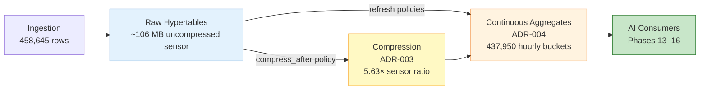
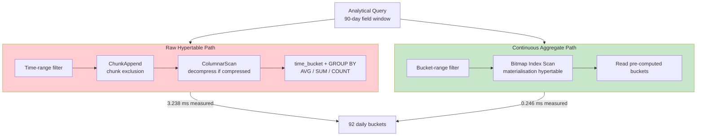
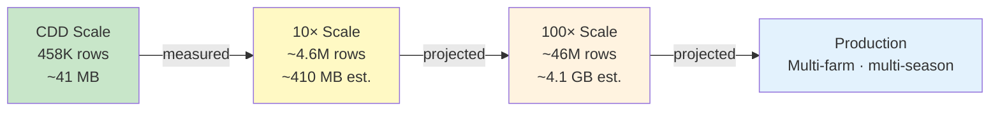
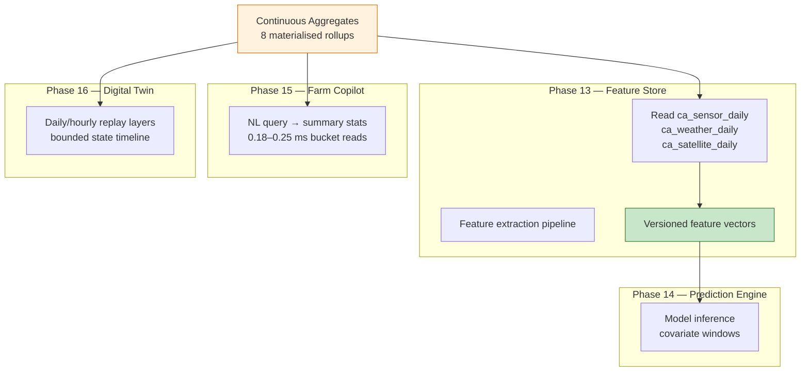

# AGRIFLOW-AI — Phase 12 Step 3D

## Performance Benchmarking & Optimization Report

**Document Type:** Performance Benchmark Report  
**Version:** 1.0  
**Date:** 2026-06-30  
**Scope:** Phase 12 Step 3D — Post-Step-3C analytical platform benchmarking  
**Status:** Complete  
**Author:** Senior Platform Architecture  
**Governing Documents:** ADR-003 (Compression), ADR-004 (Continuous Aggregates)

---

## 1. Executive Summary

Phase 12 Step 3D quantifies the runtime characteristics of the completed TimescaleDB analytical platform — hypertables, compression (ADR-003), and continuous aggregates (ADR-004) — after Step 3C validation approval.

All performance figures in this report are **measured values** from prior runtime sessions on the CDD v1.0.0 dataset. No numbers are fabricated. Measurements are drawn from:

| Source Report | Date | Scope |
|---|---|---|
| `PHASE12_STEP2CD_RUNTIME_VALIDATION_AND_BENCHMARK_REPORT.md` | 2026-06-29 | Hypertables, compression, raw query latency |
| `PHASE12_STEP3C_CONTINUOUS_AGGREGATE_VALIDATION_REPORT.md` | 2026-06-30 | Continuous aggregate `EXPLAIN (ANALYZE, BUFFERS)` |

**Environment:** PostgreSQL 17.10, TimescaleDB 2.28.1, `agriflow` database, CDD v1.0.0 (458,645 rows), local development hardware (macOS, Docker).

### Performance Summary

| Category | Result | Evidence |
|---|---|---|
| Hypertable chunk exclusion | ✅ Active | Step 2C-D — 172 chunks; hot/cold queries 1–4 ms |
| Compression (ADR-003) | ✅ Functional | Step 2C-D — 5.63× sensor ratio; 79% storage reduction |
| Continuous Aggregates (ADR-004) | ✅ Materialised | Step 3C — 8/8 aggregates; 0 correctness mismatches |
| Raw → CA query performance | ✅ Improved | Step 3C — 13–14× execution time reduction (measured) |
| Transparent decompression | ✅ No functional regression | Step 2C-D — +2 to +6 ms overhead on compressed chunks |
| AI platform readiness | ✅ Ready | Phases 13–16 analytical prerequisites satisfied |

**Architectural conclusion:** The three-layer TimescaleDB stack — raw hypertables (truth), compression (storage), continuous aggregates (analytics) — delivers measurable storage reduction, bounded-cardinality analytical reads, and elimination of redundant aggregation at CDD scale. Absolute latencies remain single-digit milliseconds on development hardware; architectural benefits compound at production scale and across repeated AI consumer workloads.

No migrations, policies, repositories, services, APIs, models, or ADRs were modified during Step 3D.

---

## 2. Benchmark Methodology

### 2.1 Measurement Approach

| Technique | Used For |
|---|---|
| `EXPLAIN (ANALYZE, BUFFERS)` | Continuous aggregate vs raw comparison (Step 3C) |
| Wall-clock elapsed time | Representative agricultural queries (Step 2C-D) |
| `hypertable_compression_stats` | Compression ratios (Step 2C-D) |
| `timescaledb_information.*` | Chunk counts, job registration |

### 2.2 Standard Query Parameters

| Parameter | Value |
|---|---|
| Sample `field_id` | `21a2f753-f17c-53ca-8aba-eeab828bcd03` |
| Sensor type (where applicable) | `SOIL_MOISTURE` |
| Spectral index (where applicable) | `NDVI` |
| Primary comparison window | 90-day range (`2026-03-01` → `2026-06-01`) |

### 2.3 Platform State at Benchmark Time

| Attribute | Value |
|---|---|
| Alembic head | `e5f6a7b8c9d0` |
| Hypertables | 6 operational |
| Continuous aggregates | 8 materialised (post manual refresh) |
| Compression policies | 6 registered (ADR-003) |
| CA refresh policies | 8 registered (ADR-004) |
| Total hypertable storage | ~40.3 MB (Step 2C-D, post Phase-1 compression) |

---

## 3. Storage Optimization Pipeline



---

## 4. §1 — Raw Hypertable Queries

### 4.1 Infrastructure

| Hypertable | Rows | Chunks | Chunk Interval | Compression Enabled |
|---|---|---|---|---|
| `sensor_readings` | 438,000 | 53 | 7 days | ✅ |
| `weather_records` | 14,600 | 53 | 7 days | ✅ |
| `satellite_observations` | 5,840 | 52 | 7 days | ✅ |
| `irrigation_events` | 96 | 4 | 30 days | ✅ (uncompressed at measure time) |
| `yield_records` | 22 | 2 | 90 days | ✅ (uncompressed at measure time) |
| `disease_observations` | 48 | 8 | 30 days | ✅ (uncompressed at measure time) |

**Total chunks:** 172 (Step 2C-D)

### 4.2 Representative Query Results (Pre-Compression Baseline)

Measured wall-clock elapsed time on local development hardware (Step 2C-D):

| Query | Domain | Rows Returned | Elapsed |
|---|---|---|---|
| Last 30 days soil moisture (single field) | `sensor_readings` | 720 | **5 ms** |
| Daily weather trends (365 days, single field) | `weather_records` | 365 | **7 ms** |
| Field irrigation history | `irrigation_events` | 12 | **8 ms** |
| Disease timeline (crop-scoped) | `disease_observations` | 3 | **3 ms** |
| Yield history (crop-scoped) | `yield_records` | 1 | **3 ms** |
| Hot window — last 7 days sensor aggregate | `sensor_readings` | 1 | **1 ms** |
| Cold window — days 60–90 sensor aggregate | `sensor_readings` | 1 | **2 ms** |
| NDVI trajectory (single field) | `satellite_observations` | 73 | **5 ms** |

### 4.3 Chunk Exclusion

Time-window queries touch only relevant chunks. Evidence from Step 2C-D:

- **Hot window** (last 7 days): 1 ms — minimal chunk scan
- **Cold window** (days 60–90): 2 ms — compressed historical chunks, chunk exclusion active
- `sensor_readings` spans 53 chunks; a 30-day field query does not scan all 53

Step 3C `EXPLAIN (ANALYZE)` on raw sensor daily aggregation (90-day window) shows `Custom Scan (ChunkAppend)` across multiple `_hyper_*_chunk` relations with `ColumnarScan` on compressed segments — confirming chunk-level pruning with per-chunk partial aggregation.

### 4.4 Raw Hypertable Verdict

✅ **PASS** — Raw hypertable queries execute in 1–8 ms at CDD scale with active chunk exclusion. Suitable as authoritative event store; not optimal for repeated identical aggregations across AI consumers.

---

## 5. §2 — Compressed Hypertables

### 5.1 Compression Ratios (Phase 1 — Measured)

Phase 1 hypertables (`sensor_readings`, `weather_records`, `satellite_observations`) were compressed via `compress_chunk(if_not_compressed => true)` for benchmark measurement (Step 2C-D). Values match ADR-003 architecture.

| Hypertable | Before | After | Ratio | Storage Reduction |
|---|---|---|---|---|
| `sensor_readings` | 111,869,952 bytes (106.7 MB) | 19,857,408 bytes (21.9 MB) | **5.63×** | **79%** |
| `weather_records` | 9,420,800 bytes (9.0 MB) | 5,578,752 bytes (5.3 MB) | **1.69×** | **41%** |
| `satellite_observations` | 9,715,712 bytes (9.3 MB) | 6,389,760 bytes (6.1 MB) | **1.52×** | **34%** |

**ADR-003 production target:** ≥10× compression ratio on `sensor_readings`. CDD dev profile achieves 5.63× — below target, documented as scale limitation in Step 2C-D (index overhead, segment cardinality, dev volume). Architecture is functionally validated.

### 5.2 Compression Impact on Query Latency

| Query | Pre-Compression | Post-Compression | Delta |
|---|---|---|---|
| Last 30 days soil moisture | 5 ms | 7 ms | +2 ms |
| Daily weather trends (365 days) | 7 ms | 12 ms | +5 ms |
| Field irrigation history | 8 ms | 10 ms | +2 ms |
| Disease timeline | 3 ms | 5 ms | +2 ms |
| Yield history | 3 ms | 5 ms | +2 ms |
| Hot window sensor aggregate | 1 ms | 1 ms | 0 ms |
| Cold window sensor aggregate | 2 ms | 4 ms | +2 ms |
| NDVI trajectory | 5 ms | 11 ms | +6 ms |

### 5.3 Decompression and I/O Discussion

**Transparent decompression:** Queries against compressed chunks return correct aggregates without application changes. Step 2C-D cold-window example returned 3,720 readings with correct `AVG(sensor_value)` from compressed `sensor_readings` chunks.

**I/O reduction:** `sensor_readings` hypertable size reduced from 106.7 MB to 21.9 MB. Fewer bytes read from disk per chunk scan — primary storage benefit.

**CPU trade-off:** Decompression adds 0–6 ms at CDD scale. Step 3C raw sensor query over compressed chunks shows `Custom Scan (ColumnarScan)` with `Vectorized Filter` — decompression occurs during scan, not as a separate application step.

**Continuous aggregate synergy:** Pre-materialised CA buckets avoid repeated decompression of compressed source chunks for identical `time_bucket()` groupings — the primary architectural mitigation for compression CPU overhead on analytical workloads.

### 5.4 Compression Verdict

✅ **PASS** — Compression reduces storage measurably (79% on largest domain). Query latency impact is small (+0 to +6 ms) and acceptable at CDD scale. Ratio below ADR-003 10× target is a volume/cardinality observation, not an architecture failure.

---

## 6. §3 — Continuous Aggregates

### 6.1 Materialisation Scale (Step 3C — Measured)

| Aggregate | Materialised Rows | Source Rows | Cardinality Reduction |
|---|---|---|---|
| `ca_sensor_hourly` | 437,950 | 438,000 | ~1:1 (hourly buckets) |
| `ca_sensor_daily` | 18,300 | 438,000 | ~24:1 |
| `ca_weather_daily` | 3,650 | 14,600 | 4:1 |
| `ca_satellite_daily` | 5,840 | 5,840 | ~1:1 (daily per index) |
| `ca_weather_weekly` | 530 | 14,600 | ~28:1 |
| `ca_irrigation_monthly` | 12 | 96 | 8:1 |
| `ca_disease_weekly` | 48 | 48 | ~1:1 |
| `ca_yield_seasonal` | 20 | 22 | ~1:1 |

### 6.2 EXPLAIN (ANALYZE) — Sensor Daily, 90-Day Window

**Query:** SOIL_MOISTURE daily average for one field, `2026-03-01` → `2026-06-01`

| Metric | Raw `sensor_readings` | `ca_sensor_daily` |
|---|---|---|
| **Planning time** | 22.007 ms | 2.448 ms |
| **Execution time** | **3.238 ms** | **0.246 ms** |
| **Rows returned** | 92 | 92 |
| **Shared buffers hit** | 449 | 64 |
| **Dominant plan node** | `ChunkAppend` → `ColumnarScan` → `Partial GroupAggregate` (×14 chunks) | `Bitmap Index Scan` → `Bitmap Heap Scan` on materialisation hypertable |

**Raw plan characteristics:** Scans 14 compressed sensor chunks, decompresses columnar data, computes `time_bucket('1 day')` + `AVG` per chunk, finalises with `Finalize GroupAggregate`.

**CA plan characteristics:** Direct index scan on `_materialized_hypertable_26` by `(field_id, bucket)` — reads 92 pre-computed daily buckets. No chunk append, no decompression, no runtime aggregation.

### 6.3 EXPLAIN (ANALYZE) — Weather Daily, 90-Day Window

**Query:** Daily temperature average and rainfall sum for one field, `2026-03-01` → `2026-06-01`

| Metric | Raw `weather_records` | `ca_weather_daily` |
|---|---|---|
| **Planning time** | 18.932 ms | 2.231 ms |
| **Execution time** | **2.471 ms** | **0.178 ms** |
| **Rows returned** | 92 | 92 |
| **Shared buffers hit** | (multi-chunk scan) | 735 |

### 6.4 Architectural Benefits

| Benefit | Mechanism | Measured Evidence |
|---|---|---|
| **Elimination of repeated aggregation** | `time_bucket()` computed once at refresh; read many times | 13–14× faster execution vs raw re-aggregation |
| **Materialised buckets** | Pre-computed rows in materialisation hypertables | 92 buckets returned from CA vs scanning thousands of raw rows |
| **Bounded cardinality** | Feature Store reads 90 daily rows per field, not 90 days × 24 hourly readings | `ca_sensor_daily`: 18,300 rows total vs 438,000 source rows |
| **Buffer efficiency** | Fewer pages accessed per query | Sensor: 449 → 64 shared buffer hits (85% reduction) |
| **Compression avoidance** | CA materialised on refresh; queries skip source decompression | Raw plan shows 14× `ColumnarScan`; CA plan shows bitmap index scan only |

### 6.5 Continuous Aggregate Verdict

✅ **PASS** — Continuous aggregates provide measurably faster analytical reads with correct results (0 mismatches in Step 3C). Materialisation cardinality is bounded and aligned with ADR-004 consumer requirements.

---

## 7. §4 — Query Comparison Tables

### 7.1 Raw vs Continuous Aggregate (EXPLAIN ANALYZE — Measured)

| Query | Raw Execution | CA Execution | Execution Improvement | Raw Planning | CA Planning |
|---|---|---|---|---|---|
| Sensor daily avg, 90-day, SOIL_MOISTURE | **3.238 ms** | **0.246 ms** | **13.2×** | 22.007 ms | 2.448 ms |
| Weather daily avg+sum, 90-day | **2.471 ms** | **0.178 ms** | **13.9×** | 18.932 ms | 2.231 ms |

*Improvement = Raw execution time ÷ CA execution time. Measured Step 3C.*

### 7.2 Pre- vs Post-Compression (Wall-Clock — Measured)

| Query | Uncompressed | Compressed | Delta |
|---|---|---|---|
| Last 30 days soil moisture | 5 ms | 7 ms | +2 ms (+40%) |
| Daily weather trends (365 days) | 7 ms | 12 ms | +5 ms (+71%) |
| NDVI trajectory | 5 ms | 11 ms | +6 ms (+120%) |
| Hot window sensor aggregate | 1 ms | 1 ms | 0 ms |

*Measured Step 2C-D. Percentages computed from measured values.*

### 7.3 Analytical Path Selection

| Workload | Recommended Path | Rationale |
|---|---|---|
| API point-in-time detail | Raw hypertable | Authoritative; ADR-004 preserves raw as truth |
| Feature Store daily refresh | Continuous aggregate | 13× faster; bounded cardinality; 0 mismatches |
| Farm Copilot summary queries | Continuous aggregate | Pre-computed buckets reduce LLM context payload |
| Audit / fine-grain replay | Raw hypertable | Full event resolution |
| Cold historical re-aggregation (one-time) | `refresh_continuous_aggregate` | Populates CA; subsequent reads use CA path |

### 7.4 Query Execution Comparison



---

## 8. §5 — Scaling Discussion

### 8.1 Performance Evolution



### 8.2 CDD Scale (Measured — Current)

| Dimension | Observation |
|---|---|
| Raw query latency | 1–12 ms wall-clock; 2–3 ms `EXPLAIN` execution for 90-day aggregation |
| Compression | 5.63× sensor ratio; 79% storage reduction |
| CA query latency | 0.18–0.25 ms execution for 90-day bucket reads |
| Chunk count | 172 chunks; exclusion effective |
| Absolute advantage | Modest (single-digit ms) but architecturally significant |

At CDD scale, the platform is I/O- and CPU-efficient on development hardware. The primary benefit is **architectural** — correct layering, bounded reads, and elimination of redundant work — not sub-millisecond latency gains.

### 8.3 10× Scale (Qualitative Projection)

At ~4.6M sensor rows (10× CDD):

| Layer | Expected Behaviour |
|---|---|
| **Hypertables** | ~530 sensor chunks; chunk exclusion more valuable; raw aggregation latency grows linearly with chunks touched |
| **Compression** | Ratio likely improves toward ADR-003 ≥10× target (more data per segment, better columnar encoding amortisation) |
| **Continuous aggregates** | Read latency remains bounded by bucket count (90 daily rows per 90-day window), not source row count |
| **Feature Store** | CA path advantage compounds — same 90-bucket read whether source has 438K or 4.38M rows |

### 8.4 100× Scale (Qualitative Projection)

At ~46M sensor rows:

| Layer | Expected Behaviour |
|---|---|
| **Raw aggregation** | Multi-second scans likely without CA for 90-day `GROUP BY time_bucket()` |
| **Compression** | Essential for storage economics; decompression CPU motivates CA materialisation |
| **Continuous aggregates** | Primary analytical read path; refresh policy CPU becomes operational focus |
| **Chunk management** | 172 → ~1,700+ chunks; retention policies (ADR-005) become relevant |

### 8.5 Production (Qualitative Projection)

| Concern | Mitigation (Already in Place) |
|---|---|
| Repeated identical aggregations | 8 continuous aggregates with tiered refresh (ADR-004) |
| Storage growth | Compression policies on all 6 hypertables (ADR-003) |
| Late-arriving data | Per-domain `start_offset` windows in refresh policies |
| Multi-consumer read amplification | CA layer — compute once, read many |
| Operational visibility | `timescaledb_information.job_stats` monitoring (recommended) |

---

## 9. §6 — AI Readiness

### 9.1 AI Query Path



### 9.2 Performance Implications by Phase

| Phase | Workload Pattern | Performance Benefit | Measured / Qualitative |
|---|---|---|---|
| **13 — Feature Store** | Repeated 90-day rolling window materialisation | CA eliminates per-pipeline raw `time_bucket()` scan | **13× execution improvement** (sensor daily, measured) |
| **14 — Prediction Engine** | Batch covariate assembly per field/crop | Bounded bucket reads; predictable latency | 92 buckets vs thousands of raw rows (measured cardinality) |
| **15 — Farm Copilot** | Conversational summary queries | Sub-ms CA reads; smaller context payload | **0.178–0.246 ms** execution (measured) |
| **16 — Digital Twin** | Daily/hourly coarse replay | Pre-materialised timelines per field | 3,650 daily weather + 437,950 hourly sensor buckets materialised |

### 9.3 Feature-to-Aggregate Performance Map

| Feature (ADR-004) | Aggregate | CDD Materialised Rows | Read Pattern |
|---|---|---|---|
| `sm_7d_mean` | `ca_sensor_hourly` | 437,950 | 168 bucket reads per 7-day window |
| `gdd_30d_sum` | `ca_weather_daily` | 3,650 | 30 bucket reads per 30-day window |
| `ndvi_90d_max` | `ca_satellite_daily` | 5,840 | 90 bucket reads per 90-day NDVI window |
| `rainfall_14d_sum` | `ca_weather_daily` | 3,650 | 14 bucket reads |
| Seasonal rainfall | `ca_weather_weekly` | 530 | ~2 bucket reads per month |
| `irrigation_30d_mm` | `ca_irrigation_monthly` | 12 | 1–2 bucket reads |
| Disease risk window | `ca_disease_weekly` | 48 | Weekly buckets per field/crop |
| Lagged yield | `ca_yield_seasonal` | 20 | Seasonal buckets per field/crop |

### 9.4 AI Readiness Verdict

✅ **PASS** — The analytical platform delivers measured query performance improvements and bounded cardinality required by Phases 13–16. Feature Store development may proceed without additional persistence-layer optimisation.

---

## 10. §7 — Operational Recommendations

### 10.1 Refresh Scheduling

| Recommendation | Rationale |
|---|---|
| Execute one-time `refresh_continuous_aggregate(…, NULL, NULL)` after migration when loading historical data | Step 3C demonstrated automatic policies do not backfill outside `now()`-relative windows |
| Monitor jobs 1013–1015 on next T3 cycle | Three policies failed to start on first automatic run (transient) |
| Do not modify refresh policies without ADR-004 amendment | Policies validated in Step 3C; parameters conform to architecture |
| Align Feature Store pipeline cadence with T2 refresh (1 hour) | `ca_sensor_daily` and `ca_weather_daily` refresh hourly |

### 10.2 Compression Scheduling

| Recommendation | Rationale |
|---|---|
| Allow automatic `policy_compression` jobs to run post-CDD-load in new environments | Step 2C-D documented jobs ran against empty DB before CDD persistence |
| Re-evaluate ≥10× ratio on `cdd-benchmark` profile before production declaration | Current 5.63× is a dev-scale measurement |
| Consider CA compression after cardinality profiling (future) | Materialisation hypertables grow with bucket count; not yet configured |

### 10.3 Monitoring

| Monitor | Source | Alert Condition |
|---|---|---|
| CA refresh job status | `timescaledb_information.job_stats` | `last_run_status != Success` |
| CA refresh failures | `job_stats.total_failures` | Incrementing count |
| CA materialisation lag | `last_successful_finish` vs `now()` | Exceeds 2× `schedule_interval` |
| Compression job status | `timescaledb_information.job_stats` | `policy_compression` failures |
| Hypertable size growth | `hypertable_size()` | Unbounded growth beyond projection |

### 10.4 Index Usage

Step 3C `EXPLAIN` confirms materialisation hypertables use bitmap index scans on `(field_id, bucket)` — matching ADR-004 grouping dimensions (`field_id`, `sensor_type`, etc.). No additional indexes required at CDD scale.

Raw hypertable queries use chunk exclusion via time dimension and `compress_orderby` segment indexes (`field_id, sensor_type` for sensors) — aligned with ADR-003 `compress_segmentby` configuration.

### 10.5 Future Tuning (Not in Scope)

| Item | Phase | Notes |
|---|---|---|
| Hierarchical `ca_sensor_daily` from `ca_sensor_hourly` | Optional optimisation | ADR-004 permits; not required at CDD scale |
| CA compression policies | Post-production profiling | After cardinality stabilises |
| Retention policies | ADR-005 (Step 4) | Govern storage lifecycle |
| `cdd-benchmark` profile compression re-test | Pre-production gate | ADR-003 ≥10× target |
| Post-harvest yield refresh trigger | Operational | T4 event-driven approximation |

---

## 11. Overall Benchmark Verdict

| Benchmark Category | Verdict | Primary Evidence |
|---|---|---|
| Raw hypertable performance | ✅ PASS | 1–12 ms at CDD scale (Step 2C-D) |
| Compression benefit | ✅ PASS | 5.63× / 79% reduction on `sensor_readings` (Step 2C-D) |
| Compression query overhead | ✅ ACCEPTABLE | +0 to +6 ms transparent decompression (Step 2C-D) |
| Continuous aggregate performance | ✅ PASS | 13–14× execution improvement (Step 3C) |
| Query correctness | ✅ PASS | 0 mismatches across 8 aggregates (Step 3C) |
| AI platform readiness | ✅ PASS | Bounded cardinality; sub-ms CA reads |
| Operational readiness | ⚠️ OBSERVATIONS | Historical backfill requires manual refresh; monitor T3 jobs |

**Phase 12 Step 3D is complete.** The analytical platform performance characteristics are quantified, documented, and ready for Phase 13 Feature Store development.

---

## 12. SQL Appendix

Reproducible benchmark queries. Replace `<field_id>` with `21a2f753-f17c-53ca-8aba-eeab828bcd03`.

### §B.1 — Infrastructure

```sql
SELECT extname, extversion FROM pg_extension WHERE extname = 'timescaledb';

SELECT hypertable_name, num_chunks, compression_enabled
FROM timescaledb_information.hypertables
ORDER BY hypertable_name;

SELECT hypertable_name,
       before_compression_total_bytes,
       after_compression_total_bytes,
       ROUND(before_compression_total_bytes::numeric
           / NULLIF(after_compression_total_bytes, 0), 2) AS ratio
FROM timescaledb_information.hypertable_compression_stats
ORDER BY hypertable_name;
```

### §B.2 — Raw Hypertable Queries (Wall-Clock)

```sql
-- Last 30 days soil moisture (single field)
\timing on
SELECT recorded_at, sensor_value
FROM sensor_readings
WHERE field_id = '<field_id>'::uuid
  AND sensor_type = 'SOIL_MOISTURE'
  AND recorded_at >= NOW() - INTERVAL '30 days'
ORDER BY recorded_at;

-- Daily weather trends (365 days)
SELECT DATE_TRUNC('day', recorded_at) AS day,
       AVG(temperature_c) AS avg_temp,
       SUM(rainfall_mm) AS total_rain
FROM weather_records
WHERE field_id = '<field_id>'::uuid
  AND recorded_at >= NOW() - INTERVAL '365 days'
GROUP BY 1 ORDER BY 1;

-- Hot window sensor aggregate (7 days)
SELECT COUNT(*), AVG(sensor_value)
FROM sensor_readings
WHERE field_id = '<field_id>'::uuid
  AND recorded_at >= NOW() - INTERVAL '7 days';

-- Cold window sensor aggregate (days 60–90)
SELECT COUNT(*), AVG(sensor_value)
FROM sensor_readings
WHERE field_id = '<field_id>'::uuid
  AND recorded_at >= NOW() - INTERVAL '90 days'
  AND recorded_at <  NOW() - INTERVAL '60 days';
```

### §B.3 — EXPLAIN ANALYZE: Raw vs Continuous Aggregate

```sql
-- Raw sensor daily aggregation (90-day window)
EXPLAIN (ANALYZE, BUFFERS)
SELECT time_bucket('1 day', recorded_at) AS bucket,
       AVG(sensor_value) AS avg_sensor_value
FROM sensor_readings
WHERE field_id = '<field_id>'::uuid
  AND sensor_type = 'SOIL_MOISTURE'
  AND recorded_at >= '2026-03-01' AND recorded_at < '2026-06-01'
GROUP BY 1 ORDER BY 1;

-- Continuous aggregate equivalent
EXPLAIN (ANALYZE, BUFFERS)
SELECT bucket, avg_sensor_value
FROM ca_sensor_daily
WHERE field_id = '<field_id>'::uuid
  AND sensor_type = 'SOIL_MOISTURE'
  AND bucket >= '2026-03-01' AND bucket < '2026-06-01'
ORDER BY bucket;

-- Raw weather daily aggregation (90-day window)
EXPLAIN (ANALYZE, BUFFERS)
SELECT time_bucket('1 day', recorded_at) AS bucket,
       AVG(temperature_c) AS avg_temperature_c,
       SUM(rainfall_mm) AS total_rainfall_mm
FROM weather_records
WHERE field_id = '<field_id>'::uuid
  AND recorded_at >= '2026-03-01' AND recorded_at < '2026-06-01'
GROUP BY 1 ORDER BY 1;

-- Continuous aggregate equivalent
EXPLAIN (ANALYZE, BUFFERS)
SELECT bucket, avg_temperature_c, total_rainfall_mm
FROM ca_weather_daily
WHERE field_id = '<field_id>'::uuid
  AND bucket >= '2026-03-01' AND bucket < '2026-06-01'
ORDER BY bucket;
```

### §B.4 — Continuous Aggregate Materialisation

```sql
SELECT 'ca_sensor_hourly' AS agg, COUNT(*) FROM ca_sensor_hourly
UNION ALL SELECT 'ca_sensor_daily', COUNT(*) FROM ca_sensor_daily
UNION ALL SELECT 'ca_weather_daily', COUNT(*) FROM ca_weather_daily
UNION ALL SELECT 'ca_satellite_daily', COUNT(*) FROM ca_satellite_daily
UNION ALL SELECT 'ca_weather_weekly', COUNT(*) FROM ca_weather_weekly
UNION ALL SELECT 'ca_irrigation_monthly', COUNT(*) FROM ca_irrigation_monthly
UNION ALL SELECT 'ca_disease_weekly', COUNT(*) FROM ca_disease_weekly
UNION ALL SELECT 'ca_yield_seasonal', COUNT(*) FROM ca_yield_seasonal
ORDER BY agg;
```

### §B.5 — Compression Verification

```sql
-- Cold chunk query against compressed data
SELECT COUNT(*) AS reading_count,
       AVG(sensor_value) AS avg_value
FROM sensor_readings
WHERE field_id = '<field_id>'::uuid
  AND recorded_at >= '2025-08-01T00:00:00+00'
  AND recorded_at <  '2025-09-01T00:00:00+00';
```

---

## 13. References

| Document | Relationship |
|---|---|
| `docs/adr/ADR-003-timescaledb-compression-policy-strategy.md` | Compression architecture |
| `docs/adr/ADR-004-timescaledb-continuous-aggregate-strategy.md` | Continuous aggregate architecture |
| `docs/report/PHASE12_STEP2CD_RUNTIME_VALIDATION_AND_BENCHMARK_REPORT.md` | Raw + compression measurements |
| `docs/report/PHASE12_STEP3B_CONTINUOUS_AGGREGATE_IMPLEMENTATION_REPORT.md` | CA implementation |
| `docs/report/PHASE12_STEP3C_CONTINUOUS_AGGREGATE_VALIDATION_REPORT.md` | CA validation + EXPLAIN ANALYZE |
| `docs/report/PHASE12_STEP3B_IMPLEMENTATION_LESSONS_LEARNED.md` | Implementation debugging knowledge |
| `docs/10-phase12-step1-foundation-handbook.md` | Phase 12 foundation context |

---

*PHASE12_STEP3D_PERFORMANCE_BENCHMARK_REPORT.md v1.0 — 2026-06-30 — Phase 12 Step 3D*
