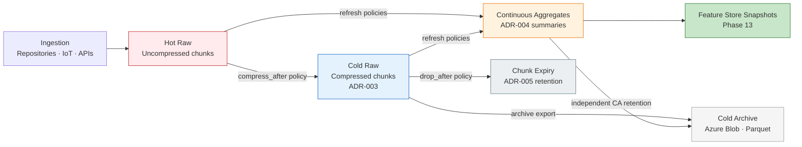
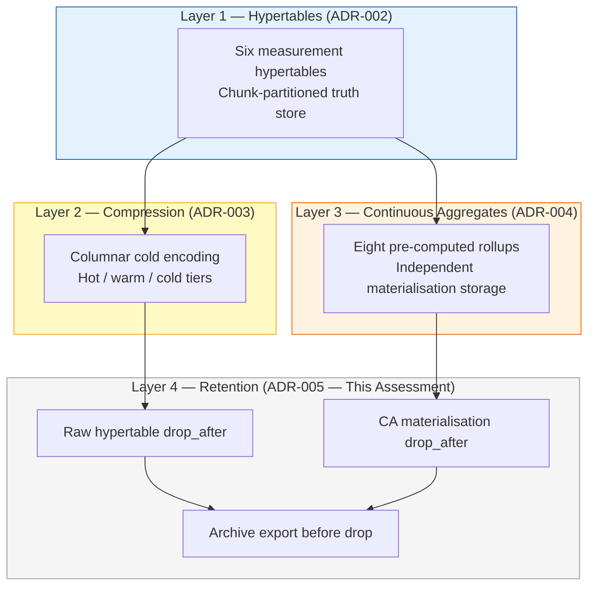
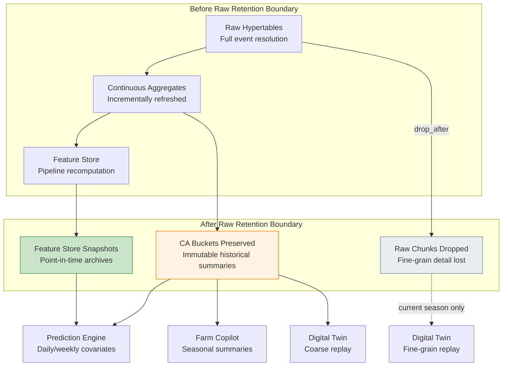
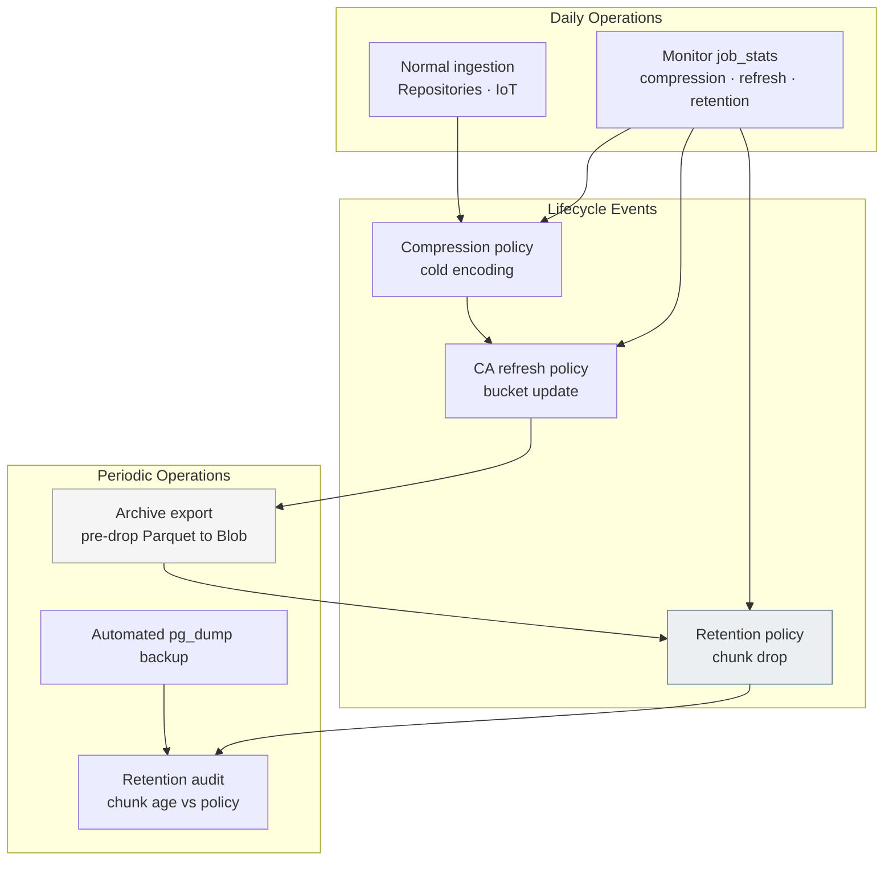
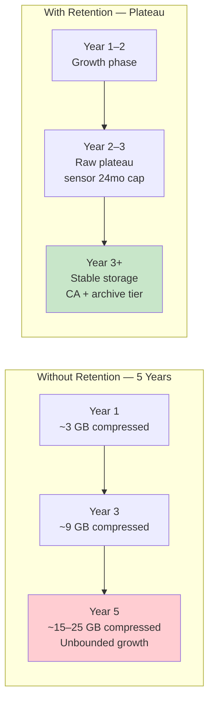
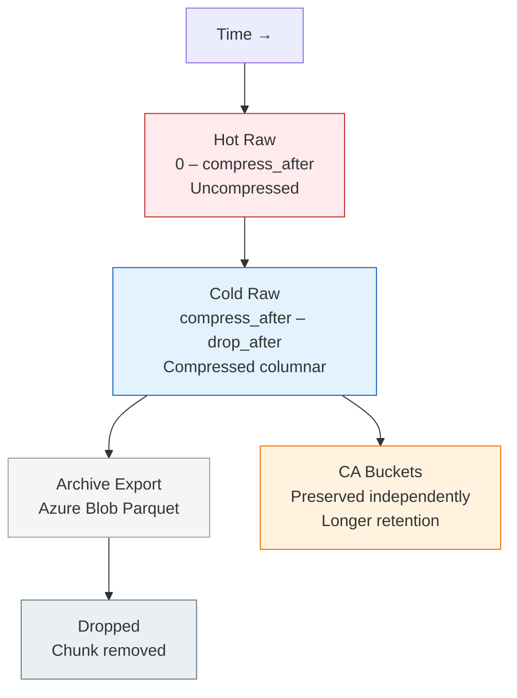

# AGRIFLOW-AI — Phase 12 Step 4A

## Data Retention Architecture Assessment

**Document Type:** Architecture Assessment (Read-Only)  
**Version:** 1.0  
**Date:** 2026-06-30  
**Scope:** Phase 12 Step 4A — Data Lifecycle & Retention Strategy Design; ADR-005 Preparation  
**Status:** Architecture Assessment — Pending Review  
**Author:** Senior Platform Architecture  
**Governance References:**

| Document | Version | Status |
|---|---|---|
| `docs/adr/ADR-001-timescaledb-extension-enablement.md` | Accepted | Active |
| `docs/adr/ADR-002-hypertable-primary-key-conversion-strategy.md` | Approved | Active |
| `docs/adr/ADR-003-timescaledb-compression-policy-strategy.md` | v1.1 | Approved |
| `docs/adr/ADR-004-timescaledb-continuous-aggregate-strategy.md` | v1.0 | Approved |
| `10-phase12-step1-foundation-handbook.md` | v1.1 | Approved |
| `11-phase12-analytical-platform-handbook.md` | v1.0 | Approved |
| `PHASE12_STEP2CD_RUNTIME_VALIDATION_AND_BENCHMARK_REPORT.md` | v1.0 | Complete |
| `PHASE12_STEP3C_CONTINUOUS_AGGREGATE_VALIDATION_REPORT.md` | v1.0 | Approved |
| `PHASE12_STEP3D_PERFORMANCE_BENCHMARK_REPORT.md` | v1.0 | Complete |
| `PHASE12_STEP2CA_CANONICAL_DEVELOPMENT_DATASET_ARCHITECTURE.md` | v1.0 | Approved |
| `PHASE12_DECISION_REGISTER.md` | v1.4 | Active (P12-D011) |

**Read-Only Activity Notice:** This document is a pre-implementation architecture review. No schema changes, Alembic migrations, retention policies, compression policy modifications, continuous aggregate policy modifications, Docker modifications, or application code modifications are produced by this step. Implementation is deferred to Step 4B and subsequent steps, governed by a forthcoming **ADR-005 (Retention Policy Strategy)**.

---

## Assessment at a Glance

| Metric | Value |
|---|---|
| Hypertables assessed | **6** |
| Continuous aggregates assessed | **8** (materialisation hypertables) |
| Retention policies active | **0** (baseline — per P12-D011) |
| Governing deferred decision | **P12-D011** — Retention Policy Strategy |
| Target ADR | **ADR-005** — Retention & Tiered Archival Strategy |
| Application layer impact | **0** (retention is persistence-layer lifecycle governance) |
| Prerequisite stack | ADR-001 → ADR-002 → ADR-003 → ADR-004 (complete through Step 3) |

---

## Implementation Traceability

```
Step 1 — Hypertables (ADR-002)
        ↓
Step 2 — Compression (ADR-003)
        ↓
Step 2C — CDD v1.0.0 + Runtime Validation
        ↓
Step 3 — Continuous Aggregates (ADR-004)
        ↓
Step 3C/3D — Validation + Benchmarking (APPROVED)
        ↓
     Step 4A  ← Current (Read-Only Assessment)
        ↓
ADR-005 — Retention Policy Strategy (Pending)
        ↓
Step 4B — Retention Implementation (Future)
        ↓
Phase 13 — Feature Store → Phases 14–16 AI Consumers
```

---

## Current Platform State

| Attribute | Value |
|---|---|
| Database | PostgreSQL 17.10 |
| TimescaleDB | 2.28.1 (active in `agriflow` database) |
| Alembic head | `e5f6a7b8c9d0` |
| Hypertables | 6 operational |
| Compression policies | 6 registered per ADR-003 |
| Continuous aggregates | 8 materialised per ADR-004 |
| Retention policies | 0 |
| CDD | v1.0.0 — 458,645 rows across six hypertables |
| Total hypertable storage (post-compression) | ~41 MB (Step 2C-D) |
| Chunks | 172 across six hypertables |
| Repository / Service / API changes from Phase 12 | 0 |

### Hypertable Baseline

| Hypertable | Partition Column | Chunk Interval | Mutability | Compression After |
|---|---|---|---|---|
| `sensor_readings` | `recorded_at` | 7 days | Append-only | 7 days |
| `weather_records` | `recorded_at` | 7 days | Append-only | 7 days |
| `satellite_observations` | `observed_at` | 7 days | Mutable (PATCH) | 14 days |
| `irrigation_events` | `started_at` | 30 days | Mutable (PATCH) | 60 days |
| `yield_records` | `recorded_at` | 90 days | Mutable (PATCH) | 180 days |
| `disease_observations` | `observed_at` | 30 days | Mutable (PATCH) | 60 days |

---

## 1. Why Data Retention Is Required

Phase 12 Steps 1–3 solved **query scalability** (hypertables), **storage efficiency** (compression), and **analytical scalability** (continuous aggregates). Retention addresses the fourth dimension: **bounded lifecycle governance** — ensuring that storage growth, operational cost, and long-term platform maintenance remain predictable as the platform transitions from CDD-scale development to multi-farm production.

### 1.1 Storage Growth

Without retention, time-series data accumulates unboundedly. The Foundation Handbook establishes that a production deployment of 100 farms, 1,000 fields, and 100 sensors per field generates **10 million to 100 million `sensor_readings` rows per year** — before weather, satellite, irrigation, disease, and yield data are counted.

Step 2A projected uncompressed sensor storage at **15–25 GB per year** at the 100M-row tier. Step 2C-D measured CDD-scale storage at ~106.7 MB uncompressed for 438,000 sensor rows (~244 bytes/row effective footprint including indexes). Linear extrapolation to 100× CDD (~46M sensor rows) projects **~4.1 GB** hypertable storage (Step 3D §8.1) before multi-season depth accumulates.

Compression (ADR-003) reduces the growth rate — Step 2C-D measured **5.63×** compression on `sensor_readings` at CDD scale (79% reduction), with ADR-003 targeting **≥10×** at production volume. Compression slows growth but does not cap it. Five years of retained raw sensor history at production scale, even with 10× compression, remains **tens of gigabytes** for a single high-volume domain — multiplied across six hypertables and eight continuous aggregate materialisation hypertables.

Retention is the mechanism that converts **linear unbounded growth** into **predictable plateau storage** after a defined business horizon.

### 1.2 Operational Cost

PostgreSQL/TimescaleDB storage on Azure (the platform's deployment target) incurs direct cost proportional to provisioned disk, backup volume, and I/O. Each additional chunk increases:

- **Backup duration and storage** — Tier 2 `pg_dump` restore is the approved production rollback path (P12-D003, P12-D005). Larger databases extend backup windows and backup retention costs.
- **Background job CPU** — compression policies, continuous aggregate refresh jobs, and future vacuum/maintenance scale with chunk count. Step 3D notes that at 100× scale, chunk count grows from 172 to **~1,700+**, making retention operationally relevant.
- **Monitoring surface** — `timescaledb_information.job_stats`, chunk inventory, and storage dashboards require human attention as object count grows.

Retention policies automate chunk expiry on schedule, replacing ad-hoc manual pruning and preventing surprise storage budget overruns.

### 1.3 Long-Term Maintenance

Enterprise agricultural platforms operate across **multi-decade farm relationships**. Data lifecycle decisions affect:

- **Schema migration velocity** — Alembic migrations against multi-terabyte hypertables require longer maintenance windows.
- **Disaster recovery RTO/RPO** — restore time scales with database size; retention bounds maximum recoverable dataset size.
- **Platform upgrades** — TimescaleDB major version upgrades and PostgreSQL compatibility testing benefit from bounded data volumes in non-production environments.
- **Developer environment parity** — CDD provides deterministic development data; retention ensures production-like lifecycle behaviour can be simulated without copying unbounded production archives to every developer machine.

Retention is not merely a cost optimisation — it is an **operational sustainability** control that keeps the persistence layer maintainable across the platform's expected 10+ year lifecycle.

### 1.4 AI Data Lifecycle

ADR-002 and P12-D011 correctly identified that **all AGRIFLOW-AI time-series data is potential AI training material**. Indiscriminate automatic deletion would degrade model quality by removing irreplaceable historical signal. However, the AI roadmap does not require **infinite raw resolution** for all domains:

| AI Consumer | Typical Data Resolution Need | Raw vs Summary |
|---|---|---|
| Feature Store (Phase 13) | 7–90 day rolling windows via named features | Primarily continuous aggregates |
| Prediction Engine (Phase 14) | Multi-season covariates + yield labels | Daily/weekly CAs + sparse raw yield |
| Farm Copilot (Phase 15) | Recent detail + seasonal summaries | Hourly/daily CAs for history; raw for last 7–14 days |
| Digital Twin (Phase 16) | Event-level replay (recent) + coarse timeline (historical) | Raw for current season; CAs for prior seasons |

Retention must be designed as a **tiered AI data lifecycle**: preserve model-relevant signal in continuous aggregates and Feature Store snapshots while releasing fine-grain raw events that no longer serve analytical or regulatory purpose. This is the architectural bridge between P12-D011's "do not delete training material" principle and production storage economics.

### 1.5 Data Lifecycle Overview



### Key Takeaways — Section 1

- Compression reduces the slope of storage growth; retention caps the ceiling.
- Operational cost, backup/DR, and maintenance burden all scale with retained volume.
- AI workloads need historical **signal**, not necessarily infinite raw **resolution** — continuous aggregates and Feature Store snapshots enable intelligent retention.
- P12-D011's archive-before-delete principle remains mandatory; retention without archival is not recommended.

---

## 2. Relationship to Previous Steps

Retention is the **fourth and final infrastructure capability** in the Phase 12 TimescaleDB stack. It operates on chunks created by hypertables, aged and compressed by prior policies, while preserving analytical value materialised in continuous aggregates.

### 2.1 Hypertables (ADR-002) — The Retention Unit

TimescaleDB retention policies operate at the **chunk** level, not the row level. ADR-002 established per-table chunk intervals that directly affect retention granularity:

| Hypertable | Chunk Interval | Retention Implication |
|---|---|---|
| `sensor_readings` | 7 days | Retention drops data in 7-day increments — aligns with weekly operational reporting |
| `weather_records` | 7 days | Same 7-day drop granularity |
| `satellite_observations` | 7 days | 7-day drops; PATCH window (14 days) must complete before chunk ages into retention boundary |
| `irrigation_events` | 30 days | Monthly drop granularity — appropriate for event-sparse domain |
| `yield_records` | 90 days | Quarterly drops — harvest records should use long retention or exemption |
| `disease_observations` | 30 days | Monthly drops — compliance windows may require longer retention than chunk size |

Chunk interval choice (ADR-002) means retention age thresholds should be **multiples of chunk interval** to avoid partial-chunk ambiguity and to align drop operations with natural time boundaries.

### 2.2 Compression (ADR-003) — Prerequisite for Retention

ADR-003 established the hot/warm/cold temperature model. Retention operates on **cold compressed chunks** in the recommended architecture:

- Data must pass through compression before retention drop — maximising storage efficiency for the full retained window.
- Retention age thresholds must exceed compression age thresholds plus the maximum PATCH correction window for mutable tables.
- Dropping uncompressed hot chunks would violate the compression-first lifecycle and waste storage optimisation.

Step 2C-D validated compression at CDD scale. Retention policy ages must be configured **above** ADR-003 compression thresholds:

| Hypertable | Compress After | Minimum Retention Floor |
|---|---|---|
| `sensor_readings` | 7 days | > 7 days + business window |
| `weather_records` | 7 days | > 7 days + business window |
| `satellite_observations` | 14 days | > 14 days + 30-day PATCH window |
| `irrigation_events` | 60 days | > 60 days + 90-day PATCH window |
| `yield_records` | 180 days | > 180 days (or exempt) |
| `disease_observations` | 60 days | > 60 days + 60-day PATCH window |

### 2.3 Continuous Aggregates (ADR-004) — Analytical Preservation Layer

ADR-004 positions continuous aggregates as the **official analytical layer** between raw hypertables and the Feature Store. Retention on raw hypertables does not automatically delete continuous aggregate buckets — CA materialisation hypertables are independent TimescaleDB objects with their own storage lifecycle.

This independence is architecturally critical:

- Raw `sensor_readings` may be dropped after 24 months while `ca_sensor_daily` retains 10 years of daily averages.
- Feature Store pipelines reading from CAs continue to function after raw expiry for all features derivable from aggregate resolution.
- Farm Copilot seasonal comparisons ("rainfall vs last season") remain answerable from `ca_weather_weekly` after raw weather rows expire.

ADR-004 explicitly deferred retention to Step 4 with the governance note: *"Retention policies must account for CA materialisation when defining raw data lifecycle."*

### 2.4 Four-Layer Stack Architecture



| Layer | Problem Solved | Retention Interaction |
|---|---|---|
| **Hypertables** | Query scalability via chunk exclusion | Defines chunk drop unit |
| **Compression** | Storage efficiency on cold data | Data should be compressed before drop |
| **Continuous Aggregates** | Analytical scalability | Preserves summaries after raw expiry |
| **Retention** | Bounded lifecycle / predictable cost | Drop aged chunks; archive first |

### Key Takeaways — Section 2

- Retention completes the Phase 12 stack; it does not replace or modify prior layers.
- Compression age thresholds are hard floors for retention age thresholds on raw hypertables.
- Continuous aggregates enable shorter raw retention without sacrificing multi-season AI capability.
- CA materialisation hypertables require **independent, longer** retention policies than their source hypertables.

---

## 3. Agricultural Data Lifecycle

Each measurement domain has distinct business semantics, regulatory exposure, ingest frequency, and AI consumption patterns. Retention periods must be justified per domain — not uniform across all six hypertables.

### 3.1 Domain Lifecycle Summary

| Domain | Ingest Pattern | Primary Business Value | AI Resolution Need | Recommended Raw Retention | Recommended CA Retention |
|---|---|---|---|---|---|
| **Sensor** | Sub-hourly continuous | Real-time operations, irrigation automation | Hourly/daily for models; sub-hourly for recent replay | **24 months** | Hourly: **36 months**; Daily: **10 years** |
| **Weather** | Daily to sub-daily | GDD, ET₀, frost alerts, seasonal planning | Daily for features; weekly for climate baselines | **36 months** | Daily: **15 years**; Weekly: **15 years** |
| **Satellite** | 5–16 day revisit | Canopy health, stress detection, yield forecasting | Daily index values for NDVI features | **36 months** | Daily: **10 years** |
| **Irrigation** | Event-driven seasonal | Water compliance, cost allocation, FAO-56 balance | Monthly aggregates sufficient beyond 2 seasons | **7 years** | Monthly: **indefinite** |
| **Disease** | Episodic scouting | Treatment audit, regulatory spray records | Weekly severity for risk models | **7 years** | Weekly: **10 years** |
| **Yield** | Harvest-time sparse | Financial planning, crop insurance, model labels | Seasonal — every record is a label | **Indefinite** | Seasonal: **indefinite** |

### 3.2 Sensor Readings

**Domain characteristics:** Highest ingest frequency (sub-hourly IoT), append-only, primary storage cost driver. CDD: 438,000 rows / 365 days (hourly × 5 sensor types × 10 fields). Step 2C-D: 53 chunks at 7-day interval; 106.7 MB uncompressed pre-compression.

**Business requirements:**

- Operational dashboards and irrigation automation require **sub-daily resolution for the current and prior growing season** (~18 months in temperate climates).
- Agronomic root-cause analysis ("why did stress occur in week 12?") typically investigates **the current season and one prior season**.
- Beyond two seasons, agronomists and AI models compare **daily or hourly averages**, not individual probe readings.

**Analytical requirements:**

- CDD features `sm_7d_mean` read from `ca_sensor_hourly` — 168 bucket reads per 7-day window (Step 3D).
- Feature Store 30/90-day rolling features read from `ca_sensor_daily` — 30–90 rows per window.
- Digital Twin fine-grain replay requires raw hourly/sub-hourly data for the **active season**; prior seasons can use `ca_sensor_hourly` coarse replay mode (ADR-004 §10).

**Recommended retention:**

| Object | Retention | Justification |
|---|---|---|
| Raw `sensor_readings` | **24 months** | Covers two full growing seasons of fine-grain telemetry; largest storage savings; aligns with 7-day chunk drops (~104 chunks max) |
| `ca_sensor_hourly` | **36 months** | Extends Copilot "hourly trend" answers one season beyond raw expiry |
| `ca_sensor_daily` | **10 years** | Multi-season yield model covariates; bounded cardinality (~3,650 rows/field/year) |

### 3.3 Weather

**Domain characteristics:** Daily to 4× daily per field, append-only, GDD and ET₀ calculation source. CDD: 14,600 rows. Moderate storage footprint but high analytical reuse across all AI phases.

**Business requirements:**

- Growing-degree-day accumulation and frost-risk alerts operate on **current-season daily data**.
- Crop insurance and seasonal planning reference **3–5 years** of climate history for risk benchmarking.
- Long-term climate normalisation ("is this season wetter than average?") requires **decade-scale** weekly/monthly summaries.

**Analytical requirements:**

- `gdd_30d_sum` and `rainfall_14d_sum` read from `ca_weather_daily`.
- Multi-season Prediction Engine covariates use `ca_weather_weekly` for climate normalisation (ADR-004 §10).
- Farm Copilot seasonal comparison queries map to weekly aggregates.

**Recommended retention:**

| Object | Retention | Justification |
|---|---|---|
| Raw `weather_records` | **36 months** | Three seasons of daily/sub-daily resolution for ET₀ recalculation and audit; matches agronomic investigation horizon |
| `ca_weather_daily` | **15 years** | Climate baseline features; ~5,475 rows/field at daily resolution — negligible storage |
| `ca_weather_weekly` | **15 years** | Seasonal Copilot answers; ~780 rows/field — negligible storage |

### 3.4 Satellite

**Domain characteristics:** 5–16 day revisit cadence, 8 spectral indices, mutable (PATCH for reprocessing/cloud mask revision). CDD: 5,840 rows. Storage-intensive NUMERIC columns. Compression at 14 days per ADR-003.

**Business requirements:**

- Vegetation monitoring and crop health dashboards require **current-season pass-level detail**.
- Historical NDVI trend analysis for multi-season rotation decisions requires **3+ years** of index values.
- Regulatory and carbon-credit programmes may require **geotagged observation evidence** for 3–5 years.

**Analytical requirements:**

- `ndvi_90d_max` reads from `ca_satellite_daily` — 90 buckets per 90-day window.
- Yield Prediction canopy features use daily NDVI/EVI from CA, not raw pass-level pixels.
- PATCH reprocessing window (30-day `start_offset` per ADR-004) must complete before raw retention boundary.

**Recommended retention:**

| Object | Retention | Justification |
|---|---|---|
| Raw `satellite_observations` | **36 months** | Three seasons of pass-level detail for reprocessing audit and fine-grain Twin replay; 30-day PATCH window + 14-day compression margin satisfied |
| `ca_satellite_daily` | **10 years** | Multi-season vegetation trend features; core remote sensing signal preserved at daily resolution |

### 3.5 Irrigation

**Domain characteristics:** Event-driven (8–12 events per irrigated field per season), mutable (operator PATCH corrections), water compliance relevance. CDD: 96 rows — extremely sparse. Monthly chunks.

**Business requirements:**

- Water rights compliance and utility reporting commonly require **5–7 years** of application records.
- FAO-56 water balance reconstruction uses event-level detail for **the current and prior season**.
- Beyond two seasons, **monthly volume totals** suffice for trend analysis.

**Analytical requirements:**

- `irrigation_30d_mm` feature reads from `ca_irrigation_monthly` — 1–2 buckets per 30-day window (Step 3D).
- Digital Twin irrigation intervention layer uses monthly summaries for historical replay (ADR-004 §10).

**Recommended retention:**

| Object | Retention | Justification |
|---|---|---|
| Raw `irrigation_events` | **7 years** | Water compliance and audit trail; sparse volume means storage cost is negligible even at long retention |
| `ca_irrigation_monthly` | **Indefinite** | Tiny cardinality (12 rows/field/year); permanent water-use history for Copilot and reporting |

### 3.6 Disease

**Domain characteristics:** Episodic scouting events (0–50 per crop cycle), mutable severity updates, regulatory spray record linkage. CDD: 48–54 rows. Crop-anchored (`crop_id`).

**Business requirements:**

- Pesticide and fungicide application audit trails commonly require **5–7 years** retention in US agricultural regulatory contexts.
- Disease risk models use **recent-season pressure** (14-day incubation windows) for prediction; historical incidence informs multi-season baselines.

**Analytical requirements:**

- `disease_severity_max` reads from `ca_disease_weekly`.
- Disease Risk Scoring Engine (Phase 14) uses weekly severity buckets for training labels.

**Recommended retention:**

| Object | Retention | Justification |
|---|---|---|
| Raw `disease_observations` | **7 years** | Regulatory compliance for crop protection records; sparse volume; 30-day chunks align with monthly drop boundaries |
| `ca_disease_weekly` | **10 years** | Multi-season disease pressure baselines for risk models and Copilot historical answers |

### 3.7 Yield

**Domain characteristics:** Harvest-time only (1–5 records per crop cycle per field), mutable corrections, **target variable** for Yield Prediction Engine. CDD: 22 rows. Irreplaceable training labels.

**Business requirements:**

- Financial reporting, crop insurance, and land-valuation decisions reference yield history **indefinitely**.
- Each yield record is a **permanent business fact** — unlike telemetry, it cannot be reconstructed from other domains.

**Analytical requirements:**

- `yield_actual` feature reads from raw `yield_records` (primary) and `ca_yield_seasonal` (secondary per ADR-004 §10).
- Multi-year Prediction Engine training requires **complete yield label history** — no dropped seasons.

**Recommended retention:**

| Object | Retention | Justification |
|---|---|---|
| Raw `yield_records` | **Indefinite (no drop policy)** | Training labels are irreplaceable; storage cost is negligible (tens of rows per field per decade) |
| `ca_yield_seasonal` | **Indefinite** | Season-over-season Copilot answers and lagged yield features |

### 3.8 Agricultural Season Alignment

Retention ages should be evaluated against **crop-calendar semantics**, not arbitrary calendar boundaries:

- Temperate continental growing season: ~April–October (CDD model).
- Recommended raw retention floors are expressed in months/years to span **complete growing seasons**, not partial chunks at season boundaries.
- `ca_yield_seasonal` uses 90-day `time_bucket` as crop-season proxy (ADR-004); crop-calendar-aligned bucketing remains a Feature Store responsibility for finer season semantics.

### Key Takeaways — Section 3

- High-frequency domains (sensor) warrant the shortest raw retention; sparse irreplaceable domains (yield) warrant indefinite retention.
- Continuous aggregate retention should equal or exceed raw retention for every domain.
- Compliance-driven domains (irrigation, disease) align with 7-year regulatory horizons.
- All raw retention periods exceed ADR-003 compression thresholds and ADR-004 PATCH windows.

---

## 4. AI Impact

Retention policy design must preserve AI capability while releasing storage. The Phase 12 analytical platform (Steps 1–3) provides the architectural mechanisms to decouple **raw data lifecycle** from **AI signal lifecycle**.

### 4.1 Feature Store (Phase 13)

The Feature Store constructs versioned feature vectors from named windows (CDD v1.0.0: `sm_7d_mean`, `gdd_30d_sum`, `ndvi_90d_max`, `rainfall_14d_sum`, `irrigation_30d_mm`, `disease_severity_max`, `yield_actual`).

**Retention impact:**

| Feature | Primary Source | Survives Raw Expiry? |
|---|---|---|
| `sm_7d_mean` | `ca_sensor_hourly` | ✅ Yes — if hourly CA retained ≥ 7 days |
| `gdd_30d_sum` | `ca_weather_daily` | ✅ Yes — if daily weather CA retained ≥ 30 days |
| `ndvi_90d_max` | `ca_satellite_daily` | ✅ Yes — if daily satellite CA retained ≥ 90 days |
| `rainfall_14d_sum` | `ca_weather_daily` | ✅ Yes |
| `irrigation_30d_mm` | `ca_irrigation_monthly` | ✅ Yes — monthly CA outlives raw events |
| `disease_severity_max` | `ca_disease_weekly` | ✅ Yes |
| `yield_actual` | Raw `yield_records` | ✅ Yes — yield raw retention is indefinite |

**Feature Store snapshots** (Phase 13 — not yet implemented) should be treated as a **fifth retention tier**: once materialised, feature vectors at a point-in-time become independent artefacts exportable to model registries. Retention on raw and CA layers must exceed the longest Feature Store recomputation window to allow pipeline idempotent reruns.

### 4.2 Prediction Engine (Phase 14)

The Yield Prediction Engine trains on multi-season covariate windows (sensor stress, weather, satellite canopy) with yield labels.

**After raw sensor/weather/satellite expiry:**

- Training covariates remain available from `ca_sensor_daily`, `ca_weather_daily`/`ca_weather_weekly`, and `ca_satellite_daily` for all approved retention horizons.
- Sub-daily sensor patterns (e.g., diurnal soil moisture cycles during reproductive stage) are **lost** after raw expiry — acceptable because approved yield models use daily/hourly aggregates, not minute-level probes (ADR-004 aggregate catalogue).

**Yield labels** remain available indefinitely from raw `yield_records`.

### 4.3 Farm Copilot (Phase 15)

Farm Copilot issues conversational queries over recent and seasonal windows.

| Query Class | Data Path After Retention | Example |
|---|---|---|
| Recent detail ("soil moisture this week") | Raw hypertable (within raw retention) or `ca_sensor_hourly` | Raw for < 24 months; CA thereafter |
| Seasonal summary ("average rainfall last month") | `ca_weather_daily` | Unaffected by raw weather expiry |
| Multi-season comparison ("vs last season") | `ca_weather_weekly`, `ca_yield_seasonal` | Unaffected by raw expiry |
| Historical yield ("last year's corn yield") | Raw `yield_records` or `ca_yield_seasonal` | Indefinite |

Copilot grounding payloads should prefer CA reads for summary questions — reducing LLM context size (ADR-004 §7). Retention makes this preference **mandatory** for historical questions beyond raw retention windows.

### 4.4 Digital Twin (Phase 16)

Digital Twin operates in two replay modes per ADR-004:

| Mode | Resolution | Data Source | Retention Dependency |
|---|---|---|---|
| **Fine-grain replay** | Sub-hourly / pass-level events | Raw hypertables | Requires raw within retention window |
| **Coarse warm-state** | Hourly / daily snapshots | Continuous aggregates | Requires CA within retention window |

After raw sensor expiry (recommended 24 months), Twin replay for prior seasons operates in **coarse mode** using `ca_sensor_hourly` and `ca_sensor_daily`. Current-season fine-grain replay continues from raw data. This is an accepted trade-off: full event-level replay for decades of probe data is storage-prohibitive at production scale (Step 2A §AI Impact on Digital Twin).

### 4.5 Why Continuous Aggregates Preserve Historical Summaries

Continuous aggregate materialisation hypertables store **pre-computed `time_bucket()` results** independently of source chunks. When a source chunk is dropped by raw retention:

1. **CA buckets computed from that chunk remain queryable** — they are separate TimescaleDB objects.
2. **Feature Store pipelines** reading from CAs are unaffected — they never reference dropped raw rows.
3. **Refresh policies** stop updating buckets beyond raw data existence — historical CA buckets become immutable analytical archives.
4. **Storage is bounded** by `(fields × grouping_dimensions × bucket_count)` — not raw row volume.

Step 3C validated 0 correctness mismatches across all eight aggregates. Step 3D measured 13–14× query improvement from CA reads. Retention strategy **depends** on this validated correctness — AI consumers must trust that CA buckets accurately represent dropped raw history.

### 4.6 AI Consumption After Retention



### Key Takeaways — Section 4

- Retention on raw data does not destroy AI capability when continuous aggregates and Feature Store snapshots outlive raw expiry.
- Yield labels must never be dropped — they are the irreplaceable training target.
- Digital Twin transitions from fine-grain to coarse replay as raw data ages out — an accepted architectural trade-off.
- CA retention periods must be explicitly governed in ADR-005 — they are not automatic consequences of raw retention.

---

## 5. Operational Considerations

### 5.1 Backup Strategy

AGRIFLOW-AI mandates pre-migration `pg_dump` backups per **P12-D003** before every Alembic migration. Retention introduces new backup considerations:

| Concern | Recommendation |
|---|---|
| **Backup scope** | Full database backup includes all retained chunks and CA materialisation hypertables |
| **Archive-before-drop** | Export chunks to Azure Blob Storage (Parquet/CSV) **before** retention policy drops them — satisfies P12-D011 |
| **Backup frequency** | Daily automated backups in production; backup retention independent of data retention (30-day backup history minimum) |
| **Post-drop recovery** | Dropped chunks are recoverable only from pre-drop backup or cold archive — not from TimescaleDB internal state |
| **CDD environments** | Retention simulation against CDD v1.0.0 (Step 2C-A benchmark matrix) before production activation |

Tier 2 `pg_dump` restore remains the approved production rollback path (P12-D005). Retention reduces backup size over time — a positive operational outcome.

### 5.2 Compliance

| Domain | Regulatory Driver | Retention Implication |
|---|---|---|
| **Irrigation** | Water rights reporting, utility audits | 7-year raw retention minimum |
| **Disease** | Crop protection product application records | 7-year raw retention minimum |
| **Yield** | Crop insurance, financial audit | Indefinite retention |
| **Sensor / Weather / Satellite** | Generally operational — no mandatory multi-year raw retention | Business-driven; CA retention for analytical audit |

Retention policies are **business data lifecycle decisions** (ADR-002 §Future Retention Policies). Product owner and legal review must approve domain-specific periods before ADR-005 implementation. This assessment provides engineering recommendations; compliance sign-off is a prerequisite gate.

### 5.3 Historical Backfill

Step 3C demonstrated that continuous aggregates created `WITH NO DATA` require one-time `refresh_continuous_aggregate(…, NULL, NULL)` for historical datasets. Retention interacts with backfill:

- **Backfill before retention activation** — ensure CAs are fully materialised across the intended retention window before raw drop policies engage.
- **Archive import** — historical data restored from cold archive for model retraining requires re-ingestion through repositories (not direct chunk import) to preserve DDD integrity.
- **Retention simulation on CDD** — Step 2C-A defines a retention benchmark: *"Rows older than retention window dropped; younger rows preserved"* using `sensor_readings` as primary test domain.

### 5.4 Disaster Recovery

| Scenario | Recovery Path |
|---|---|
| Database corruption | Tier 2 `pg_dump` restore to last backup |
| Accidental retention drop | Restore from pre-drop backup or cold archive export |
| Azure region failure | Geo-redundant backup storage + documented restore runbook |
| CA materialisation loss | Recompute from surviving raw data via `refresh_continuous_aggregate` |

Retention **reduces** DR recovery time and cost by bounding database size. Archive exports provide a **tertiary recovery tier** for data dropped from the primary database but retained in cold storage.

### 5.5 Retention Monitoring

| Monitor | Source | Alert Condition |
|---|---|---|
| Retention job status | `timescaledb_information.job_stats` | `last_run_status != Success` for `policy_retention` jobs |
| Chunks dropped | `timescaledb_information.drop_chunks` audit logs / job history | Unexpected drop count vs policy expectation |
| Storage plateau | `hypertable_size()` trend | Growth continues after retention activation (policy misconfiguration) |
| CA independence | CA row counts vs raw row counts | CA buckets decrease when raw still exists (misconfigured CA retention) |
| Archive completeness | Archive export job logs | Drop executed without successful archive export |

Monitoring integrates with the operational checklist in the Analytical Platform Handbook §9 — retention joins compression and CA refresh as third background job category.

### 5.6 Operational Lifecycle



### Key Takeaways — Section 5

- Archive-before-drop is non-negotiable per P12-D011 and ADR-002.
- Compliance domains (irrigation, disease, yield) drive the longest retention horizons.
- CDD retention simulation is the mandatory validation gate before production policy activation.
- Retention monitoring extends the existing `job_stats` operational pattern from Steps 2–3.

---

## 6. Future Growth

### 6.1 CDD Scale (Measured — Current Baseline)

Step 2C-D and Step 3D established the measured CDD baseline:

| Metric | Value | Source |
|---|---|---|
| Total rows | 458,645 | Step 2C-D |
| Hypertable storage (compressed) | ~41 MB | Step 2C-D |
| Sensor rows | 438,000 | CDD architecture |
| Chunks | 172 | Step 2C-D |
| CA materialised rows (sensor hourly) | 437,950 | Step 3D |
| Raw query latency | 1–12 ms | Step 2C-D |
| CA query latency | 0.18–0.25 ms | Step 3C/3D |

At CDD scale, retention is **architecturally designed but not yet operationally necessary** — 41 MB requires no drop policies. CDD serves as the **retention simulation corpus** (Step 2C-A benchmark matrix).

### 6.2 Production Scale (Projected)

Foundation Handbook and ADR-002 project production at **100 farms, 1,000 fields, 100 sensors/field**:

| Domain | Projected Annual Rows | Uncompressed Growth (est.) | Compressed Growth (est. @10×) |
|---|---|---|---|
| `sensor_readings` | 10M–100M | 1.5–25 GB/year | 150 MB–2.5 GB/year |
| `weather_records` | 1M–10M | 150 MB–1.5 GB/year | 15–150 MB/year |
| `satellite_observations` | 100K–1M | 50–500 MB/year | 5–50 MB/year |
| `irrigation_events` | 10K–100K | Negligible | Negligible |
| `yield_records` | 1K–10K | Negligible | Negligible |
| `disease_observations` | 5K–50K | Negligible | Negligible |

### 6.3 Storage Evolution — With and Without Retention



**Without retention** (5-year horizon, 100M sensor rows/year, 10× compression):

- Sensor domain alone: **7.5–12.5 GB compressed** accumulated (5 × 1.5–2.5 GB/year).
- Total six-domain estimate: **10–20 GB compressed** and growing linearly.
- Chunk count: **860+ sensor chunks** (5 years × 52 weeks) plus other domains.

**With recommended retention** (sensor raw 24 months, weather/satellite raw 36 months):

- Sensor raw storage plateaus at **~3–5 GB compressed** (2 years × 1.5–2.5 GB/year).
- Weather/satellite raw plateau adds **~1–2 GB compressed**.
- CA storage grows slowly and predictably — `ca_sensor_daily` at 10 years: ~36,500 rows/field × 10 fields × 10 farms = **3.65M rows** (manageable).
- Total primary database stabilises at an **operationally predictable ceiling** — the core economic benefit of retention.

### 6.4 Retention Interaction with Compression



Compression and retention are sequential, not competing:

1. Data ingests into hot uncompressed chunks (ADR-002 chunk intervals).
2. Compression policy transitions chunks to columnar cold storage (ADR-003).
3. Continuous aggregates refresh from both hot and cold chunks (ADR-004).
4. Archive export captures cold chunks before drop (ADR-005 — proposed).
5. Retention policy drops aged chunks (ADR-005 — proposed).
6. CA materialisation retains summaries for AI consumers beyond raw expiry.

### 6.5 Scaling Milestones

| Scale | Rows (sensor) | Retention Urgency | Primary Mitigation |
|---|---|---|---|
| **CDD** (1×) | 438K | Low — simulation only | Compression validated |
| **10× CDD** | ~4.4M | Medium — monitor growth | Compression + CAs |
| **100× CDD** | ~44M | High — retention required | Retention + CAs + archive |
| **Production** | 10M–100M/year | Critical — unbounded cost | Full four-layer stack |

Step 3D §8.4 explicitly states: *"172 → ~1,700+ chunks; retention policies (ADR-005) become relevant"* at 100× scale.

### Key Takeaways — Section 6

- CDD scale validates architecture; production scale demands retention.
- Recommended retention periods cap raw storage at 2–3 years for high-volume domains while preserving decade-scale AI signal in CAs.
- Storage plateau economics depend on **raw retention being shorter than CA retention**.
- Archive tier provides long-term compliance and model retraining corpus without primary database bloat.

---

## 7. Recommendations

### 7.1 Governing Principles for ADR-005

| # | Principle | Rationale |
|---|---|---|
| R-01 | **Archive before drop** | P12-D011, ADR-002 — no chunk drop without cold archive export |
| R-02 | **Raw retention < CA retention** for high-volume domains | Preserves AI signal after raw expiry |
| R-03 | **Retention age > compression age + PATCH window** | Prevents drop of mutable data still subject to correction |
| R-04 | **Retention age is multiple of chunk interval** | Clean chunk-boundary drops per ADR-002 intervals |
| R-05 | **Yield data is exempt from drop** | Irreplaceable training labels |
| R-06 | **CA materialisation has independent policies** | ADR-004 aggregates require explicit lifecycle governance |
| R-07 | **Business sign-off before implementation** | Retention is a product/legal decision, not purely infrastructure |
| R-08 | **CDD simulation gate** | Step 2C-A retention benchmark must pass before production |

### 7.2 Recommended Raw Hypertable Retention

| Hypertable | Recommended `drop_after` | Chunk Drops | Justification |
|---|---|---|---|
| `sensor_readings` | **24 months** | ~104 weekly chunks | Two growing seasons of fine-grain IoT; largest storage savings; CAs preserve daily/hourly signal for 3–10 years |
| `weather_records` | **36 months** | ~156 weekly chunks | Three seasons of sub-daily weather for ET₀ audit; daily/weekly CAs retained 15 years for climate features |
| `satellite_observations` | **36 months** | ~156 weekly chunks | Three seasons of pass-level imagery; 14-day compression + 30-day PATCH window satisfied; daily NDVI CA retained 10 years |
| `irrigation_events` | **7 years** | ~28 monthly chunks | Water rights compliance; sparse volume; monthly CA indefinite |
| `yield_records` | **No drop policy** | N/A | Irreplaceable harvest labels; negligible storage; indefinite retention |
| `disease_observations` | **7 years** | ~28 monthly chunks | Crop protection regulatory audit; weekly CA retained 10 years |

### 7.3 Recommended Continuous Aggregate Retention

| Continuous Aggregate | Recommended Retention | Justification |
|---|---|---|
| `ca_sensor_hourly` | **36 months** | Copilot hourly trends one season beyond raw sensor expiry |
| `ca_sensor_daily` | **10 years** | Multi-season yield covariates; ~36,500 rows/field/decade |
| `ca_weather_daily` | **15 years** | Climate baseline and GDD features; bounded cardinality |
| `ca_weather_weekly` | **15 years** | Seasonal Copilot comparisons; negligible storage |
| `ca_satellite_daily` | **10 years** | NDVI/EVI trend features; core remote sensing signal |
| `ca_irrigation_monthly` | **Indefinite** | Permanent water-use history; ~120 rows/field/decade |
| `ca_disease_weekly` | **10 years** | Disease pressure baselines for risk models |
| `ca_yield_seasonal` | **Indefinite** | Season-over-season yield features; ~10 rows/field/decade |

### 7.4 Recommended Archive Strategy

| Tier | Technology | Contents | Retention |
|---|---|---|---|
| **Primary** | PostgreSQL/TimescaleDB | Hot + cold chunks + CAs within policy windows | Per §7.2–7.3 |
| **Secondary** | Azure Blob Storage (Parquet) | Pre-drop chunk exports; annual archive snapshots | **Indefinite** (lifecycle-managed Blob tier) |
| **Tertiary** | Feature Store model registry (Phase 13) | Versioned feature snapshots used in production models | Per model governance policy |

TimescaleDB tiered storage to S3/Azure Blob is an implementation option for ADR-005 — aligns with P12-D011 recommended alternative to bare deletion.

### 7.5 Phased Rollout Recommendation

| Phase | Scope | Validation Gate |
|---|---|---|
| **Phase 1** | Archive export pipeline for `sensor_readings` | CDD simulation: rows older than 24 months dropped; younger preserved |
| **Phase 2** | Raw retention on `weather_records`, `satellite_observations` | CA correctness spot-check after drop |
| **Phase 3** | Raw retention on `irrigation_events`, `disease_observations` | Compliance review sign-off |
| **Phase 4** | CA materialisation retention policies | Feature Store pipeline validation (Phase 13) |
| **Exempt** | `yield_records` — no drop policy | Indefinite retention confirmed |

### 7.6 What This Assessment Does NOT Authorise

Consistent with Step 4A operating constraints:

- No `add_retention_policy()` DDL
- No Alembic migrations
- No modification to ADR-003 compression policies
- No modification to ADR-004 continuous aggregate refresh policies
- No changes to existing ADRs (ADR-001 through ADR-004)
- No application-layer changes

Implementation requires **ADR-005 approval**, product owner sign-off on domain retention periods, and Step 4B execution.

---

## 8. Risks

| Risk | Severity | Mitigation |
|---|---|---|
| Dropping raw data before CA materialisation complete | High | Mandatory `refresh_continuous_aggregate(NULL, NULL)` backfill before retention activation (Step 3C lesson) |
| CA retention shorter than raw retention (misconfiguration) | High | Independent CA policies in ADR-005; monitoring CA row counts |
| Archive export failure before chunk drop | High | Retention job gated on successful archive confirmation; no drop without export |
| Regulatory retention shorter than legal requirement | High | Legal/compliance review gate per domain before ADR-005 |
| Feature Store pipeline reads raw after drop window | Medium | Phase 13 Feature Store design must use CA read paths per ADR-004 |
| Digital Twin fine-grain replay beyond raw retention | Medium | Documented coarse-mode transition; accepted trade-off |
| Yield record accidental drop | Critical | Exempt `yield_records` from all drop policies |
| Partial-chunk retention age misaligned with chunk interval | Low | Retention ages as multiples of ADR-002 chunk intervals |

---

## 9. Success Criteria for Step 4A

| Criterion | Status |
|---|---|
| Retention rationale documented per domain | ✅ This document |
| Relationship to Steps 1–3 articulated | ✅ §2 |
| AI impact on Phases 13–16 assessed | ✅ §4 |
| Operational considerations documented | ✅ §5 |
| Storage growth projections at CDD and production scale | ✅ §6 |
| Five architecture diagrams included | ✅ §1.5, §6.3, §6.4, §4.6, §5.6 |
| Per-hypertable recommendations with justification | ✅ §7.2–7.3 |
| No implementation artefacts produced | ✅ Read-only assessment |
| ADR-005 preparation complete | ✅ §7 governing principles |

---

## 10. References

### Architecture Decision Records

| ADR | Title | Role in Step 4A |
|---|---|---|
| [ADR-001](../adr/ADR-001-timescaledb-extension-enablement.md) | TimescaleDB Extension | Prerequisite |
| [ADR-002](../adr/ADR-002-hypertable-primary-key-conversion-strategy.md) | Hypertable Strategy | Chunk interval defines drop granularity; P12-D011 deferral |
| [ADR-003](../adr/ADR-003-timescaledb-compression-policy-strategy.md) | Compression Strategy | Compression age floors for retention ages |
| [ADR-004](../adr/ADR-004-timescaledb-continuous-aggregate-strategy.md) | Continuous Aggregate Strategy | CA preservation layer; independent CA retention |

### Handbooks

| Document | Role |
|---|---|
| [10-phase12-step1-foundation-handbook.md](../10-phase12-step1-foundation-handbook.md) | Production scale projections; Phase 12 roadmap |
| [11-phase12-analytical-platform-handbook.md](../11-phase12-analytical-platform-handbook.md) | Three-layer stack; operational monitoring; ADR-005 deferral |

### Validation & Benchmark Reports

| Report | Role |
|---|---|
| [PHASE12_STEP2CD_RUNTIME_VALIDATION_AND_BENCHMARK_REPORT.md](PHASE12_STEP2CD_RUNTIME_VALIDATION_AND_BENCHMARK_REPORT.md) | Compression ratios, chunk inventory, CDD baseline |
| [PHASE12_STEP3C_CONTINUOUS_AGGREGATE_VALIDATION_REPORT.md](PHASE12_STEP3C_CONTINUOUS_AGGREGATE_VALIDATION_REPORT.md) | CA correctness, historical backfill behaviour |
| [PHASE12_STEP3D_PERFORMANCE_BENCHMARK_REPORT.md](PHASE12_STEP3D_PERFORMANCE_BENCHMARK_REPORT.md) | Scaling projections, AI consumer performance map |
| [PHASE12_STEP2CA_CANONICAL_DEVELOPMENT_DATASET_ARCHITECTURE.md](PHASE12_STEP2CA_CANONICAL_DEVELOPMENT_DATASET_ARCHITECTURE.md) | Domain volumes, retention simulation benchmark |

### Governance

| Document | Role |
|---|---|
| [PHASE12_DECISION_REGISTER.md](PHASE12_DECISION_REGISTER.md) | P12-D011 — Retention Policy Strategy (deferred) |

---

## Document Control

| Field | Value |
|---|---|
| Document Version | 1.0 |
| Architecture Status | Assessment Complete — Pending Review |
| Implementation Status | Not Authorised — Awaiting ADR-005 |
| Last Updated | 2026-06-30 |
| Next Step | ADR-005 formalisation → Step 4B implementation |
| Classification | Architecture Assessment |

---

*PHASE12_STEP4A_RETENTION_ARCHITECTURE_ASSESSMENT.md v1.0 — 2026-06-30 — Phase 12 Step 4A*
