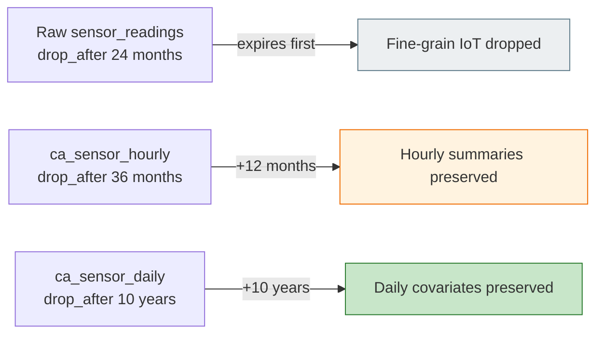
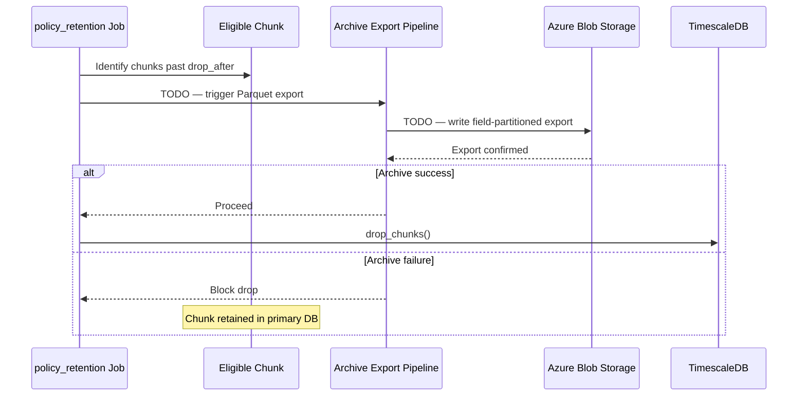
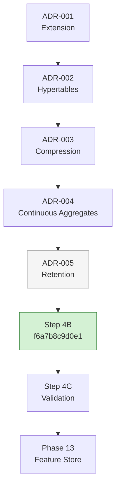

# AGRIFLOW-AI — Phase 12 Step 4B

## TimescaleDB Retention Policy Implementation Report

**Document Type:** Implementation Report  
**Version:** 1.0  
**Date:** 2026-06-30  
**Scope:** Phase 12 Step 4B — Retention Policy Activation; ADR-005 Implementation  
**Status:** Implementation Complete — Runtime Execution Pending  
**Author:** Senior Platform Architecture  
**Governing Document:** `docs/adr/ADR-005-timescaledb-retention-policy-strategy.md` v1.0 (Accepted)

---

## 1. Executive Summary

Phase 12 Step 4B completes the **implementation** of TimescaleDB `add_retention_policy()` for five approved raw hypertables and six approved continuous aggregates, as mandated by ADR-005. The Alembic migration `f6a7b8c9d0e1` has been authored and documented. **Runtime execution** (`alembic upgrade head`) follows the governance-first Phase 12 workflow established in Steps 2B and 3B.

| Metric | Result |
|---|---|
| **Migration revision (authored)** | `f6a7b8c9d0e1` |
| **Target Alembic head (after runtime execution)** | `f6a7b8c9d0e1` |
| **Raw hypertable retention policies defined** | 5 of 6 (yield exempt) |
| **Continuous aggregate retention policies defined** | 6 of 8 (irrigation + yield seasonal exempt) |
| **Archive pipeline implemented** | 0 — deferred (TODO placeholders only) |
| **Application layer changes** | 0 |
| **Compression policy changes** | 0 |
| **CA refresh policy changes** | 0 |

The migration DDL targets PostgreSQL 17.10 / TimescaleDB 2.28.1. At CDD scale (365-day temporal window), no chunks exceed the shortest raw retention horizon (24 months) — policies register but do not drop data until production-scale multi-season history accumulates.

**Step 4C Validation** (CDD retention simulation, CA correctness after drop, archive integration readiness) remains pending and follows runtime migration execution.

---

## Implementation Execution Status

| Item | Status |
|---|---|
| Architecture Assessment (Step 4A) | ✅ Complete |
| ADR-005 | ✅ Accepted |
| Alembic Migration Authored | ✅ Complete |
| Documentation | ✅ Complete (this report) |
| Runtime Migration Execution (`alembic upgrade head`) | ⏳ Planned after completion of Phase 12 |
| Archive Pipeline (Azure Blob) | ⏳ Deferred — TODO(AGRIFLOW-ARCHIVE-001) |
| Runtime Validation (Step 4C) | ⏳ Pending |

### Development Environment Execution Strategy

AGRIFLOW-AI follows a governance-first implementation workflow. Phase 12 migrations are accumulated and executed together after all implementation work is complete, consistent with Steps 2B and 3B. Runtime validation (Step 4C) occurs against the complete Phase 12 database platform.

---

## 2. Architecture Traceability

```
Step 1 — Hypertables (ADR-002 — c9d8e7f6a5b4)
        ↓
Step 2 — Compression (ADR-003 — d4f5e6a7b8c9)
        ↓
Step 2C — CDD v1.0.0 + Runtime Validation
        ↓
Step 3 — Continuous Aggregates (ADR-004 — e5f6a7b8c9d0)
        ↓
Step 3C/3D — Validation + Benchmarking (APPROVED)
        ↓
Step 4A — Retention Architecture Assessment
        ↓
ADR-005 — Retention Policy Strategy (Accepted)
        ↓
Step 4B — Retention Implementation (This Report)
   Migration f6a7b8c9d0e1 authored.
   Runtime execution planned end of Phase 12.
        ↓
Step 4C — Retention Validation (Pending — after runtime execution)
        ↓
Phase 13 — Feature Store
```

---

## 3. Migration Details

### Revision Identity

| Field | Value |
|---|---|
| **Revision ID** | `f6a7b8c9d0e1` |
| **Revises** | `e5f6a7b8c9d0` |
| **Migration file** | `backend/app/db/migrations/versions/f6a7b8c9d0e1_enable_retention_policies.py` |
| **Planned execution command** | `alembic upgrade head` |
| **Runtime execution status** | ⏳ Pending |
| **Implementation status** | ✅ Migration authored |

### Alembic Chain

```
...
d4f5e6a7b8c9  enable_hypertable_compression_policies      (ADR-003)
e5f6a7b8c9d0  create_continuous_aggregates              (ADR-004)
f6a7b8c9d0e1  enable_retention_policies                   (ADR-005) ← This migration
```

### Per-Relation Migration Pattern

For each approved relation, the migration executes:

```sql
SELECT add_retention_policy(
    '<relation>',
    drop_after => INTERVAL '<approved_interval>'
);
```

Downgrade executes `remove_retention_policy('<relation>', if_exists => true)` in reverse order.

---

## 4. Raw Hypertable Retention Policies

Authoritative source: ADR-005 §5.1. Values match Step 4A §7.2 exactly.

| Hypertable | Domain | `drop_after` | ADR-005 Phase | Policy Registered |
|---|---|---|---|---|
| `sensor_readings` | Sensor | **24 months** | Phase 1 | ✅ |
| `weather_records` | Weather | **36 months** | Phase 2 | ✅ |
| `satellite_observations` | Satellite | **36 months** | Phase 2 | ✅ |
| `irrigation_events` | Irrigation | **7 years** | Phase 3 | ✅ |
| `disease_observations` | Disease | **7 years** | Phase 3 | ✅ |
| `yield_records` | Yield | **Indefinite** | Exempt | ❌ **No policy** |

### Why `yield_records` Has No Retention Policy

ADR-005 §4.4 and governing principle R-05 mandate permanent exemption:

1. **Irreplaceable training labels** — `yield_value_tons_ha` is the Prediction Engine target variable; dropped seasons cannot be reconstructed from sensor, weather, or satellite domains.
2. **Permanent business facts** — harvest records support financial reporting, crop insurance, and land-valuation decisions across multi-decade farm relationships.
3. **Negligible storage cost** — sparse harvest-time ingest (1–5 records per crop cycle per field); tens of rows per field per decade.
4. **Critical failure mode** — accidental yield drop is classified as **Critical** severity in ADR-005 §10.

The migration intentionally omits `add_retention_policy('yield_records', ...)` to enforce this exemption at the DDL layer.

### Compression Floor Verification

All raw `drop_after` values exceed ADR-003 `compress_after` thresholds:

| Hypertable | Compress After | Drop After | Margin |
|---|---|---|---|
| `sensor_readings` | 7 days | 24 months | ✅ |
| `weather_records` | 7 days | 36 months | ✅ |
| `satellite_observations` | 14 days | 36 months | ✅ |
| `irrigation_events` | 60 days | 7 years | ✅ |
| `disease_observations` | 60 days | 7 years | ✅ |

---

## 5. Continuous Aggregate Retention Policies

### TimescaleDB Capability Assessment

TimescaleDB 2.28.1 supports `add_retention_policy()` on **continuous aggregate view names** directly. The `relation` parameter accepts hypertable or continuous aggregate REGCLASS values per the [TimescaleDB `add_retention_policy` API](https://docs.timescale.com/api/latest/data-retention/add_retention_policy/).

Policies are registered on logical `ca_*` view names (e.g. `ca_sensor_daily`), not on internal `_timescaledb_internal._materialized_hypertable_*` identifiers. This matches ADR-005 §5.3 independent CA lifecycle governance without requiring dynamic materialization hypertable name resolution in the migration.

**Implementation decision:** CA retention is **implemented** in this migration — not deferred.

### CA Retention Matrix

Authoritative source: ADR-005 §5.3.

| Continuous Aggregate | Source Hypertable | `drop_after` | Raw Retention | Policy Registered |
|---|---|---|---|---|
| `ca_sensor_hourly` | `sensor_readings` | **36 months** | 24 months | ✅ |
| `ca_sensor_daily` | `sensor_readings` | **10 years** | 24 months | ✅ |
| `ca_weather_daily` | `weather_records` | **15 years** | 36 months | ✅ |
| `ca_weather_weekly` | `weather_records` | **15 years** | 36 months | ✅ |
| `ca_satellite_daily` | `satellite_observations` | **10 years** | 36 months | ✅ |
| `ca_disease_weekly` | `disease_observations` | **10 years** | 7 years | ✅ |
| `ca_irrigation_monthly` | `irrigation_events` | **Indefinite** | 7 years | ❌ **No policy** |
| `ca_yield_seasonal` | `yield_records` | **Indefinite** | Indefinite | ❌ **No policy** |

### Why Two CAs Have No Retention Policy

| Aggregate | Rationale |
|---|---|
| `ca_irrigation_monthly` | Permanent water-use history for compliance and Copilot; ~120 rows/field/decade; ADR-005 §5.3 row 6 |
| `ca_yield_seasonal` | Tied to exempt `yield_records`; season-over-season yield features must not be dropped; ADR-005 §5.3 row 8 |

### CA vs Raw Retention Relationship

Governing rule R-02: for high-volume domains, **raw retention < CA retention**. This ensures AI signal survives raw chunk expiry:



### Refresh Window Safety

Per TimescaleDB documentation, raw retention must exceed the CA refresh `start_offset` window to prevent refresh jobs from deleting aggregate data when source chunks are dropped. All ADR-004 `start_offset` values are far below raw retention horizons — verified at Step 4A and unchanged by this migration.

---

## 6. Archive Integration (Deferred)

ADR-005 mandates **archive-before-delete** (P12-D011, principle R-01). Step 4B does **not** implement Azure Blob Storage integration per operating constraints.

### TODO Placeholders

| ID | Location | Description |
|---|---|---|
| `AGRIFLOW-ARCHIVE-001` | Migration module docstring | Archive-before-delete gate before production activation |
| `AGRIFLOW-ARCHIVE-001` | Migration `upgrade()` function | Wire pre-drop export hook |

### Future Integration Point



| Attribute | Planned Value |
|---|---|
| **Format** | Parquet (field-partitioned paths) |
| **Target** | Azure Blob Storage (secondary tier per ADR-005 §5.4) |
| **Trigger** | Pre-`policy_retention` execution or scheduled scan of chunks approaching boundary |
| **Gate** | Drop blocked until export confirmed |
| **Reference** | ADR-005 §8.3, Step 4A §5.1 |

### Production Activation Warning

**Do not activate retention policies in production** until `AGRIFLOW-ARCHIVE-001` is implemented and monitored. The migration registers policies; TimescaleDB will execute drops on schedule once data exceeds `drop_after` thresholds — without an archive gate in Step 4B.

---

## 7. Implementation Decisions

| Decision | Choice | Rationale |
|---|---|---|
| CA retention target | Logical `ca_*` view names | TimescaleDB API accepts continuous aggregate REGCLASS; avoids dynamic materialization hypertable lookup |
| CA indefinite exemptions | No policy for `ca_irrigation_monthly`, `ca_yield_seasonal` | ADR-005 §5.3 — same pattern as `yield_records` raw exemption |
| Archive pipeline | Deferred with TODO | Step 4B constraint; ADR-005 production gate documented |
| Policy syntax | `drop_after => INTERVAL '...'` named parameter | TimescaleDB 2.28 recommended form; explicit and auditable |
| Rollout in single migration | All 11 policies in one revision | Consistent with Step 2B (all compression policies in `d4f5e6a7b8c9`); phased **validation** in Step 4C |
| Downgrade order | CA policies first, then raw (reversed) | CA policies depend on CA objects from `e5f6a7b8c9d0`; safe removal order |

---

## 8. What Was NOT Modified

Per Step 4B constraints — verified:

| Layer | Modified |
|---|---|
| Repositories | ❌ No |
| Services | ❌ No |
| APIs | ❌ No |
| SQLAlchemy models | ❌ No |
| Pydantic schemas | ❌ No |
| ADR-003 compression policies | ❌ No |
| ADR-004 CA refresh policies | ❌ No |
| Hypertable DDL (ADR-002) | ❌ No |
| Previous Alembic migrations | ❌ No |

---

## 9. Runtime Expectations

### At CDD Scale (Current — 365 Days)

| Expectation | Detail |
|---|---|
| Raw chunk drops | **None** — all CDD data is younger than 24 months (shortest raw horizon) |
| CA bucket drops | **None** — all materialised buckets younger than 36 months (shortest CA horizon) |
| `policy_retention` jobs | Registered; execute on schedule; no eligible chunks |
| Storage impact | Zero immediate change |

### At Production Scale (100 Farms, Multi-Season)

| Expectation | Detail |
|---|---|
| `sensor_readings` plateau | ~3–5 GB compressed at 24-month raw cap (Step 4A §6.3) |
| Chunk drops | 7-day increments for sensor/weather/satellite; 30-day for irrigation/disease |
| CA preservation | Daily/hourly summaries survive raw sensor expiry for 10+ years |
| Background jobs | Third job category in `timescaledb_information.job_stats` (`policy_retention`) |
| Archive requirement | Mandatory before production activation |

### Post-Execution Verification Queries

After `alembic upgrade head`, the following queries confirm implementation:

```sql
-- Expect 11 policy_retention jobs (5 raw + 6 CA)
SELECT j.job_id, j.hypertable_name, j.config
FROM timescaledb_information.jobs j
WHERE j.proc_name = 'policy_retention'
ORDER BY j.hypertable_name;

-- Confirm yield_records has NO retention job
SELECT COUNT(*) FROM timescaledb_information.jobs
WHERE proc_name = 'policy_retention'
  AND hypertable_name = 'yield_records';
-- Expected: 0

-- Confirm ca_irrigation_monthly and ca_yield_seasonal have NO retention job
-- (CA jobs appear under view_name in timescaledb_information.jobs)
```

### Monitoring (Operational)

| Signal | Source | Alert Condition |
|---|---|---|
| Retention job failures | `timescaledb_information.job_stats` | `last_run_status != Success` |
| Unexpected chunk drops | Job history / row counts | Drop count differs from policy expectation |
| Archive completeness | `AGRIFLOW-ARCHIVE-001` pipeline logs | Drop without export confirmation |
| Storage plateau | `hypertable_size()` trend | Growth continues after retention activation |

---

## 10. Rollback Strategy

### Tier 1 — Alembic Downgrade (Development)

```bash
cd backend && alembic downgrade -1
```

The migration `downgrade()` function:

1. Removes CA retention policies (`remove_retention_policy` on six `ca_*` views)
2. Removes raw hypertable retention policies (`remove_retention_policy` on five tables)

Compression policies (ADR-003), CA refresh policies (ADR-004), hypertable data, and continuous aggregate materialisation are **preserved**.

### Tier 2 — pg_dump Restore (Production)

Per P12-D003 / P12-D005, if retention has dropped production chunks:

```bash
pg_restore -h localhost -p 25432 -U agriflow -d agriflow \
  --clean --if-exists backups/<verified_backup>.dump
```

Dropped chunks are recoverable only from pre-drop backup or Azure Blob archive (once `AGRIFLOW-ARCHIVE-001` is implemented).

---

## 11. Validation Plan (Step 4C)

| Verification Area | Success Criteria |
|---|---|
| **Policy registration** | 11 `policy_retention` jobs; 0 on `yield_records` |
| **CDD simulation** | After artificial age advance or synthetic data: rows older than 24 months dropped from `sensor_readings`; younger preserved |
| **CA survival** | `ca_sensor_daily` buckets remain queryable after raw sensor drop |
| **CA correctness** | Spot-check CA values unchanged for windows where raw was dropped |
| **Exemption verification** | `yield_records` row count unchanged after retention job execution |
| **Downgrade** | `alembic downgrade -1` removes all 11 policies; compression and CA refresh intact |

---

## 12. Phase 12 Stack Completion



With Step 4B, all five Phase 12 ADRs have corresponding Alembic migrations authored:

| ADR | Migration | Policies |
|---|---|---|
| ADR-001 | `f1e2d3c4b5a6` | Extension |
| ADR-002 | `c9d8e7f6a5b4` | Hypertables |
| ADR-003 | `d4f5e6a7b8c9` | 6 compression |
| ADR-004 | `e5f6a7b8c9d0` | 8 CA refresh |
| ADR-005 | `f6a7b8c9d0e1` | 5 raw + 6 CA retention |

---

## 13. References

| Document | Role |
|---|---|
| `docs/adr/ADR-005-timescaledb-retention-policy-strategy.md` v1.0 | Governing ADR |
| `docs/report/PHASE12_STEP4A_RETENTION_ARCHITECTURE_ASSESSMENT.md` v1.0 | Evidence base |
| `docs/adr/ADR-003-timescaledb-compression-policy-strategy.md` | Compression floors (unchanged) |
| `docs/adr/ADR-004-timescaledb-continuous-aggregate-strategy.md` | CA refresh windows (unchanged) |
| `docs/10-phase12-step1-foundation-handbook.md` v1.1 | Production scale context |
| `docs/11-phase12-analytical-platform-handbook.md` v1.0 | Operational monitoring |
| `docs/report/PHASE12_DECISION_REGISTER.md` | P12-D011 |
| [TimescaleDB add_retention_policy](https://docs.timescale.com/api/latest/data-retention/add_retention_policy/) | API reference |
| [TimescaleDB retention with continuous aggregates](https://docs.timescale.com/use-timescale/latest/data-retention/data-retention-with-continuous-aggregates/) | CA/raw retention interaction |

### Implementation Artifact

| File | Revision |
|---|---|
| `backend/app/db/migrations/versions/f6a7b8c9d0e1_enable_retention_policies.py` | `f6a7b8c9d0e1` |

---

## Document Control

| Field | Value |
|---|---|
| Document Version | 1.0 |
| Implementation Status | Complete — Runtime Pending |
| Last Updated | 2026-06-30 |
| Next Step | Step 4C validation after `alembic upgrade head` |

---

*PHASE12_STEP4B_RETENTION_IMPLEMENTATION_REPORT.md v1.0 — 2026-06-30 — Phase 12 Step 4B*
