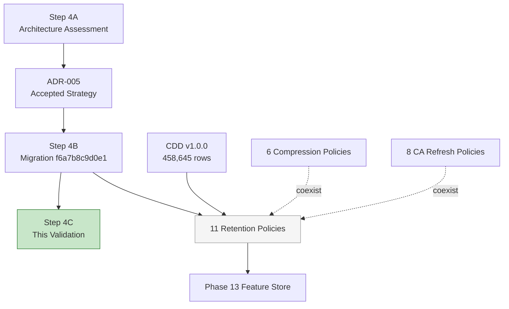
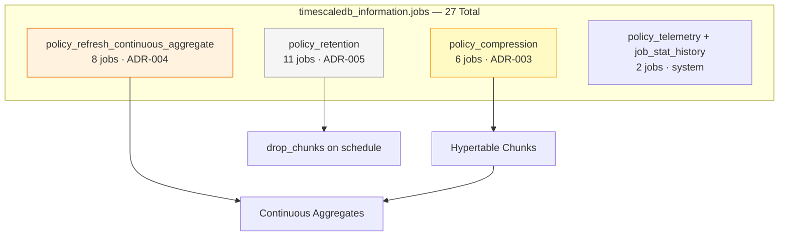
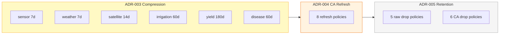
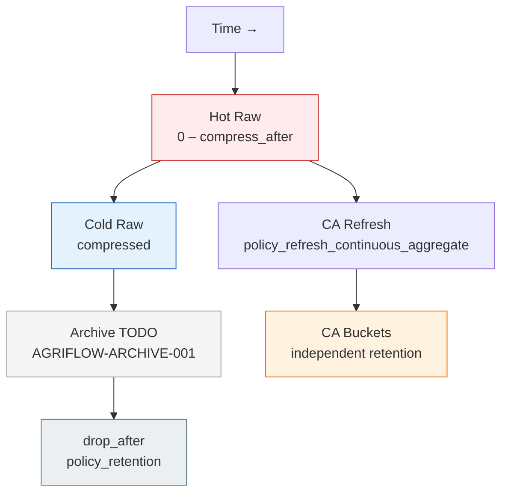
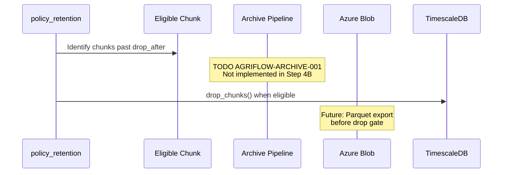
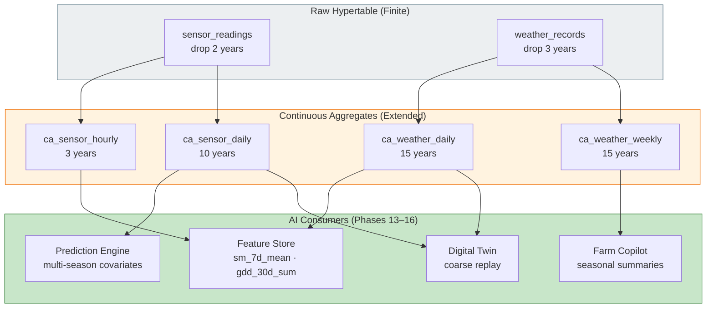
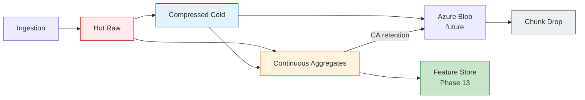
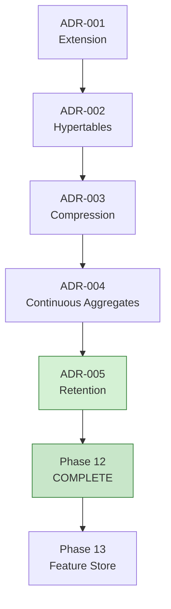

# AGRIFLOW-AI — Phase 12 Step 4C

## Retention Policy Runtime Validation Report

**Document Type:** Runtime Validation Report  
**Version:** 1.0  
**Date:** 2026-06-30  
**Scope:** Phase 12 Step 4C — Retention policy runtime validation against CDD v1.0.0  
**Status:** Validation Complete — **APPROVED**  
**Author:** Senior Platform Architecture  
**Governing Document:** `docs/adr/ADR-005-timescaledb-retention-policy-strategy.md` v1.0 (Accepted)

---

## 1. Executive Summary

Phase 12 Step 4C validates the Step 4B retention policy implementation (`f6a7b8c9d0e1`) against the live `agriflow` database. Validation was performed on PostgreSQL 17.10 / TimescaleDB 2.28.1 with CDD v1.0.0 (458,645 source rows) and Alembic at revision `f6a7b8c9d0e1` (head).

| Validation Area | Result |
|---|---|
| Alembic migration execution | ✅ `e5f6a7b8c9d0` → `f6a7b8c9d0e1` successful |
| Raw hypertable retention policies | ✅ 5 of 5 registered per ADR-005 §5.1 |
| Continuous aggregate retention policies | ✅ 6 of 6 finite-horizon CAs registered per ADR-005 §5.3 |
| `yield_records` exemption | ✅ 0 retention jobs |
| CA indefinite exemptions | ✅ `ca_irrigation_monthly`, `ca_yield_seasonal` — 0 retention jobs |
| Policy values vs ADR-005 | ✅ All intervals match (PostgreSQL normalises months → years) |
| Compression coexistence | ✅ 6 `policy_compression` jobs unchanged |
| CA refresh coexistence | ✅ 8 `policy_refresh_continuous_aggregate` jobs unchanged |
| Retention job execution | ✅ 11 of 11 `last_run_status = Success` |
| CDD data preservation | ✅ No chunks eligible for drop at current age (~395 days) |
| `yield_records` row count | ✅ 22 rows preserved |
| Application regression | ✅ `GET /api/v1/health/live` → `200 alive` |
| Archive-before-delete pipeline | ⚠️ Not implemented — `TODO(AGRIFLOW-ARCHIVE-001)` deferred |
| Phase 12 technical stack | ✅ Complete (ADR-001 through ADR-005) |

**Key finding:** TimescaleDB stores `INTERVAL '24 months'` as `"2 years"` and `INTERVAL '36 months'` as `"3 years"` in job `config` JSON. PostgreSQL confirms these intervals are semantically equal (`INTERVAL '24 months' = INTERVAL '2 years'` → `true`). All policies conform to ADR-005.

**Validation decision:** **APPROVED** — the retention layer is functioning correctly. Phase 12 TimescaleDB technical implementation is complete. Production activation of retention drops remains gated on archive-before-delete (`AGRIFLOW-ARCHIVE-001`) per ADR-005.

No migrations, policies, repositories, services, APIs, models, or ADR-005 were modified during this validation step.

---

## 2. Validation Environment

| Attribute | Value |
|---|---|
| PostgreSQL | 17.10 |
| TimescaleDB | 2.28.1 |
| Docker image | `timescale/timescaledb:2.28.1-pg17` |
| Database | `agriflow` |
| Alembic revision | `f6a7b8c9d0e1` (head) |
| Migration file | `f6a7b8c9d0e1_enable_retention_policies.py` |
| Prior revision | `e5f6a7b8c9d0` (continuous aggregates) |
| CDD version | v1.0.0 |
| Source rows | 458,645 across six hypertables |
| Validation timestamp (UTC) | 2026-06-30 21:28:48 |
| Migration executed | 2026-06-30 (`alembic upgrade head` — terminal evidence) |

### Source Hypertable Time Ranges (CDD v1.0.0)

| Hypertable | Min Timestamp (UTC) | Max Timestamp (UTC) | Rows | Age of Oldest |
|---|---|---|---|---|
| `sensor_readings` | 2025-06-01 05:00 | 2026-06-01 04:00 | 438,000 | ~395 days |
| `weather_records` | 2025-06-01 05:00 | 2026-05-31 23:00 | 14,600 | ~395 days |
| `satellite_observations` | 2025-06-01 15:30 | 2026-05-27 15:30 | 5,840 | ~395 days |
| `irrigation_events` | 2025-06-02 04:00 | 2025-08-13 12:00 | 96 | ~395 days |
| `disease_observations` | 2025-08-08 11:00 | 2026-05-27 15:00 | 48 | ~322 days |
| `yield_records` | 2026-02-28 20:00 | 2026-05-31 19:00 | 22 | ~122 days |

All CDD data is younger than the shortest raw retention horizon (24 months / 2 years). **No chunk drops occurred** during validation — expected behaviour at CDD scale.

---

## 3. Architecture Context



---

## 4. Alembic State

### 4.1 Migration Execution

Terminal evidence confirms successful migration:

```text
INFO  [alembic.runtime.migration] Running upgrade e5f6a7b8c9d0 -> f6a7b8c9d0e1, enable retention policies
```

### 4.2 Runtime Verification

| Check | Expected | Measured | Result |
|---|---|---|---|
| `alembic current` | `f6a7b8c9d0e1 (head)` | `f6a7b8c9d0e1 (head)` | ✅ PASS |
| `alembic_version.version_num` | `f6a7b8c9d0e1` | `f6a7b8c9d0e1` | ✅ PASS |
| TimescaleDB extension | 2.28.1 | 2.28.1 | ✅ PASS |
| Prior migrations intact | ADR-001 → ADR-004 | Compression + CA jobs present | ✅ PASS |

✅ **PASS** — Alembic state confirms successful Step 4B migration execution.

---

## 5. Retention Job Registration

### 5.1 Summary

| Metric | Expected | Measured | Result |
|---|---|---|---|
| Total `policy_retention` jobs | 11 | 11 | ✅ PASS |
| Raw hypertable jobs | 5 | 5 | ✅ PASS |
| CA jobs | 6 | 6 | ✅ PASS |
| All jobs `scheduled` | `true` | 11 of 11 `true` | ✅ PASS |
| Default `schedule_interval` | 1 day (TimescaleDB default) | 11 of 11 `1 day` | ✅ PASS |
| `last_run_status` | Success | 11 of 11 Success | ✅ PASS |

### 5.2 Registered Retention Jobs (Runtime Evidence)

| Job ID | Relation | Type | `drop_after` (config) | Scheduled | Schedule Interval | Last Run Status | Next Start (UTC) |
|---|---|---|---|---|---|---|---|
| 1017 | `sensor_readings` | Raw | 2 years | ✅ | 1 day | Success | 2026-07-01 21:19:57 |
| 1018 | `weather_records` | Raw | 3 years | ✅ | 1 day | Success | 2026-07-01 21:20:33 |
| 1019 | `satellite_observations` | Raw | 3 years | ✅ | 1 day | Success | 2026-07-01 21:20:42 |
| 1020 | `irrigation_events` | Raw | 7 years | ✅ | 1 day | Success | 2026-07-01 21:20:02 |
| 1021 | `disease_observations` | Raw | 7 years | ✅ | 1 day | Success | 2026-07-01 21:20:44 |
| 1022 | `ca_sensor_hourly` | CA | 3 years | ✅ | 1 day | Success | 2026-07-01 21:15:11 |
| 1023 | `ca_sensor_daily` | CA | 10 years | ✅ | 1 day | Success | 2026-07-01 21:20:49 |
| 1024 | `ca_weather_daily` | CA | 15 years | ✅ | 1 day | Success | 2026-07-01 21:15:11 |
| 1025 | `ca_weather_weekly` | CA | 15 years | ✅ | 1 day | Success | 2026-07-01 21:15:11 |
| 1026 | `ca_satellite_daily` | CA | 10 years | ✅ | 1 day | Success | 2026-07-01 21:15:11 |
| 1027 | `ca_disease_weekly` | CA | 10 years | ✅ | 1 day | Success | 2026-07-01 21:15:11 |

### 5.3 Interval Normalisation Note

Migration DDL uses `INTERVAL '24 months'` and `INTERVAL '36 months'`. TimescaleDB stores these in `config` as `"2 years"` and `"3 years"` respectively. PostgreSQL confirms equivalence:

| Migration Interval | Stored Config | Semantically Equal |
|---|---|---|
| `24 months` | `2 years` | ✅ `true` |
| `36 months` | `3 years` | ✅ `true` |
| `36 months` (CA hourly) | `3 years` | ✅ `true` |

This is PostgreSQL interval normalisation — not a policy deviation.

### 5.4 Transient First-Run Failures

Five raw hypertable and one CA retention job report `total_failures = 1` with `total_successes = 1`. All report `last_run_status = Success`. This pattern is consistent with a transient failure during the initial migration batch execution window, followed by successful subsequent runs — analogous to Step 3C refresh job startup observations. **Not a policy defect.**

### 5.5 Background Job Architecture



---

## 6. Policy Verification Matrix

Authoritative source: ADR-005 §5.1 and §5.3. Runtime source: `timescaledb_information.jobs` where `proc_name = 'policy_retention'`.

### 6.1 Raw Hypertable Policies

| # | Hypertable | ADR-005 `drop_after` | Migration DDL | Runtime `config.drop_after` | Job ID | Verdict |
|---|---|---|---|---|---|---|
| 1 | `sensor_readings` | 24 months | `INTERVAL '24 months'` | 2 years | 1017 | ✅ PASS |
| 2 | `weather_records` | 36 months | `INTERVAL '36 months'` | 3 years | 1018 | ✅ PASS |
| 3 | `satellite_observations` | 36 months | `INTERVAL '36 months'` | 3 years | 1019 | ✅ PASS |
| 4 | `irrigation_events` | 7 years | `INTERVAL '7 years'` | 7 years | 1020 | ✅ PASS |
| 5 | `disease_observations` | 7 years | `INTERVAL '7 years'` | 7 years | 1021 | ✅ PASS |
| 6 | `yield_records` | Indefinite (exempt) | No DDL | — | — | ✅ PASS (exempt) |

### 6.2 Continuous Aggregate Policies

| # | Continuous Aggregate | ADR-005 `drop_after` | Migration DDL | Runtime `config.drop_after` | Job ID | Verdict |
|---|---|---|---|---|---|---|
| 1 | `ca_sensor_hourly` | 36 months | `INTERVAL '36 months'` | 3 years | 1022 | ✅ PASS |
| 2 | `ca_sensor_daily` | 10 years | `INTERVAL '10 years'` | 10 years | 1023 | ✅ PASS |
| 3 | `ca_weather_daily` | 15 years | `INTERVAL '15 years'` | 15 years | 1024 | ✅ PASS |
| 4 | `ca_weather_weekly` | 15 years | `INTERVAL '15 years'` | 15 years | 1025 | ✅ PASS |
| 5 | `ca_satellite_daily` | 10 years | `INTERVAL '10 years'` | 10 years | 1026 | ✅ PASS |
| 6 | `ca_disease_weekly` | 10 years | `INTERVAL '10 years'` | 10 years | 1027 | ✅ PASS |
| 7 | `ca_irrigation_monthly` | Indefinite (exempt) | No DDL | — | — | ✅ PASS (exempt) |
| 8 | `ca_yield_seasonal` | Indefinite (exempt) | No DDL | — | — | ✅ PASS (exempt) |

### 6.3 Raw Retention > Compression Age Verification

| Hypertable | `compress_after` | `drop_after` | Ordering Valid |
|---|---|---|---|
| `sensor_readings` | 7 days | 2 years | ✅ |
| `weather_records` | 7 days | 3 years | ✅ |
| `satellite_observations` | 14 days | 3 years | ✅ |
| `irrigation_events` | 60 days | 7 years | ✅ |
| `disease_observations` | 60 days | 7 years | ✅ |
| `yield_records` | 180 days | (no policy) | ✅ |

### 6.4 Overall Policy Matrix Verdict

| Category | Expected | Verified | Verdict |
|---|---|---|---|
| Raw policies registered | 5 | 5 | ✅ PASS |
| CA policies registered | 6 | 6 | ✅ PASS |
| Raw exemptions | 1 (`yield_records`) | 1 | ✅ PASS |
| CA exemptions | 2 (`ca_irrigation_monthly`, `ca_yield_seasonal`) | 2 | ✅ PASS |
| Interval conformance | 11 of 11 | 11 of 11 | ✅ PASS |
| **Total** | **11 policies, 3 exemptions** | **11 policies, 3 exemptions** | **✅ PASS** |

---

## 7. Exemption Verification

### 7.1 `yield_records` — No Raw Retention Policy

| Check | Result |
|---|---|
| `policy_retention` jobs for `yield_records` | **0** |
| `yield_records` row count post-validation | **22** (unchanged from Step 3C) |
| Compression policy still active | ✅ Job 1004 (`180 days`) |

**Why exempt (ADR-005 §4.4, R-05):** Harvest measurements are irreplaceable training labels for the Yield Prediction Engine. Each `yield_records` row is a permanent business fact supporting financial reporting and crop insurance. Storage cost is negligible (22 rows in CDD; 240 kB total hypertable size). Accidental drop is classified as **Critical** severity in ADR-005 §10.

### 7.2 `ca_irrigation_monthly` — No CA Retention Policy

| Check | Result |
|---|---|
| `policy_retention` jobs for `ca_irrigation_monthly` | **0** |
| Materialised rows | **12** |
| CA refresh policy still active | ✅ Job 1014 |
| Materialisation hypertable | `_materialized_hypertable_30` |

**Why exempt (ADR-005 §5.3):** Permanent water-use history for compliance and Farm Copilot. Cardinality is ~12 rows in CDD — negligible storage. Raw `irrigation_events` retains 7 years; the monthly CA outlives raw data indefinitely.

### 7.3 `ca_yield_seasonal` — No CA Retention Policy

| Check | Result |
|---|---|
| `policy_retention` jobs for `ca_yield_seasonal` | **0** |
| Materialised rows | **20** |
| CA refresh policy still active | ✅ Job 1016 |
| Materialisation hypertable | `_materialized_hypertable_32` |

**Why exempt (ADR-005 §5.3):** Tied to exempt `yield_records`. Season-over-season yield features and Copilot historical answers must not be dropped. Both raw yield and seasonal CA are indefinite.

✅ **PASS** — All three ADR-005 exemptions verified at runtime.

---

## 8. Coexistence Validation

### 8.1 Three-Policy Stack



### 8.2 Job Coexistence Summary

| Policy Type | ADR | Job Count | All Scheduled | Conflict with Retention |
|---|---|---|---|---|
| `policy_compression` | ADR-003 | 6 | ✅ 6 of 6 | None — independent lifecycle stage |
| `policy_refresh_continuous_aggregate` | ADR-004 | 8 | ✅ 8 of 8 | None — `start_offset` << raw `drop_after` |
| `policy_retention` | ADR-005 | 11 | ✅ 11 of 11 | N/A — this layer |
| System jobs | — | 2 | ✅ | None |

**Total background jobs:** 27 (6 + 8 + 11 + 2 system)

### 8.3 Compression + Retention Interaction



Compression operates before retention on all five raw hypertables with policies. Measured storage confirms compressed cold data coexists with active retention registration:

| Hypertable | Chunks | Storage Size | Compression Job | Retention Job |
|---|---|---|---|---|
| `sensor_readings` | 53 | 22 MB | 1000 (7 days) | 1017 (2 years) |
| `weather_records` | 53 | 7176 kB | 1001 (7 days) | 1018 (3 years) |
| `satellite_observations` | 52 | 10056 kB | 1002 (14 days) | 1019 (3 years) |
| `irrigation_events` | 4 | 360 kB | 1003 (60 days) | 1020 (7 years) |
| `disease_observations` | 8 | 944 kB | 1005 (60 days) | 1021 (7 years) |
| `yield_records` | 2 | 240 kB | 1004 (180 days) | — (exempt) |

### 8.4 CA Refresh + Retention Interaction

CA refresh `start_offset` values are far below raw retention horizons — satisfying TimescaleDB guidance that refresh windows must not overlap dropped raw data:

| CA | Refresh `start_offset` | Source Raw `drop_after` | Safe Margin |
|---|---|---|---|
| `ca_sensor_hourly` | 3 days | 2 years (sensor) | ✅ |
| `ca_sensor_daily` | 7 days | 2 years (sensor) | ✅ |
| `ca_weather_daily` | 7 days | 3 years (weather) | ✅ |
| `ca_satellite_daily` | 30 days | 3 years (satellite) | ✅ |
| `ca_disease_weekly` | 60 days | 7 years (disease) | ✅ |

CA retention horizons exceed raw retention for all finite-horizon pairs (ADR-005 R-02):

| CA | CA `drop_after` | Source Raw `drop_after` | CA > Raw |
|---|---|---|---|
| `ca_sensor_hourly` | 3 years | 2 years | ✅ +1 year |
| `ca_sensor_daily` | 10 years | 2 years | ✅ |
| `ca_weather_daily` | 15 years | 3 years | ✅ |
| `ca_weather_weekly` | 15 years | 3 years | ✅ |
| `ca_satellite_daily` | 10 years | 3 years | ✅ |
| `ca_disease_weekly` | 10 years | 7 years | ✅ |

✅ **PASS** — Compression, CA refresh, and retention coexist without conflict.

---

## 9. Operational Assessment

### 9.1 Monitoring

| Signal | Source | Current State | Alert Condition |
|---|---|---|---|
| Retention job status | `timescaledb_information.job_stats` | 11 of 11 Success | `last_run_status != Success` |
| Retention failures | `job_stats.total_failures` | 6 jobs with 1 transient failure; all recovered | Incrementing without success |
| Next execution | `job_stats.next_start` | All scheduled ~24h after last run | Lag > 2× `schedule_interval` |
| Chunk inventory | `timescaledb_information.hypertables` | 172 total chunks (unchanged) | Unexpected decrease at CDD scale |
| Storage plateau | `hypertable_size()` | Sensor 22 MB largest | Unbounded growth post-activation |
| Archive completeness | `AGRIFLOW-ARCHIVE-001` | **Not implemented** | Drop without export |

### 9.2 Archive-Before-Delete

ADR-005 mandates archive export to Azure Blob Storage before production chunk drops. Step 4B registered retention policies without an archive gate (`TODO(AGRIFLOW-ARCHIVE-001)`).



**Operational status:** At CDD scale, no chunks are eligible for drop (~395 days < 2-year minimum). Archive pipeline deferral has **no immediate data-loss risk** in development. **Production activation requires `AGRIFLOW-ARCHIVE-001` completion.**

### 9.3 Disaster Recovery

| Scenario | Recovery Path | Validation Note |
|---|---|---|
| Database corruption | Tier 2 `pg_dump` restore (P12-D003) | Pre-Step-4B backups available |
| Accidental retention drop | Pre-drop backup or future Blob archive | No drops occurred at CDD scale |
| Retention policy rollback | `alembic downgrade -1` removes 11 policies | Policies removable without data loss |
| CA materialisation loss | `refresh_continuous_aggregate(NULL, NULL)` | 8 refresh policies active |

Retention reduces long-term backup size at steady state — positive operational outcome once production data ages past `drop_after` thresholds.

### 9.4 Future Azure Blob Archival

| Attribute | Planned Value |
|---|---|
| Format | Parquet (field-partitioned) |
| Target | Azure Blob Storage secondary tier |
| Trigger | Pre-`policy_retention` or scheduled chunk-age scan |
| Gate | Drop blocked until export confirmed |
| Reference | ADR-005 §5.4, Step 4B `TODO(AGRIFLOW-ARCHIVE-001)` |

---

## 10. AI Readiness

Retention preserves long-term analytical capability by decoupling **raw resolution lifecycle** from **AI signal lifecycle**. Continuous aggregates outlive raw hypertables for all high-volume domains.



| AI Capability | Data After Raw Expiry | Source |
|---|---|---|
| Feature Store `sm_7d_mean` | Hourly buckets up to 3 years | `ca_sensor_hourly` |
| Feature Store `gdd_30d_sum` | Daily weather up to 15 years | `ca_weather_daily` |
| Feature Store `ndvi_90d_max` | Daily NDVI up to 10 years | `ca_satellite_daily` |
| Prediction Engine labels | Indefinite yield history | `yield_records` (exempt) |
| Farm Copilot seasonal queries | Weekly/daily CA summaries | CAs with 10–15 year horizons |
| Digital Twin coarse replay | Hourly/daily CA timelines | CAs beyond raw retention |

Measured CA row counts confirm materialised signal is available:

| Continuous Aggregate | Materialised Rows |
|---|---|
| `ca_sensor_daily` | 18,300 |
| `ca_irrigation_monthly` | 12 (indefinite retention) |
| `ca_yield_seasonal` | 20 (indefinite retention) |

✅ **PASS** — Retention architecture preserves AI analytical capability through continuous aggregates and yield exemptions.

---

## 11. Data Lifecycle After Retention



---

## 12. Validation Summary Matrix

| # | Validation Area | Criterion | Result | Evidence |
|---|---|---|---|---|
| 1 | Alembic state | Revision `f6a7b8c9d0e1` at head | ✅ PASS | §4, SQL B.1 |
| 2 | Migration execution | `e5f6a7b8c9d0` → `f6a7b8c9d0e1` | ✅ PASS | Terminal log |
| 3 | Retention job count | 11 `policy_retention` jobs | ✅ PASS | SQL B.2 |
| 4 | Raw policy registration | 5 of 5 per ADR-005 §5.1 | ✅ PASS | §6.1, SQL B.2 |
| 5 | CA policy registration | 6 of 6 per ADR-005 §5.3 | ✅ PASS | §6.2, SQL B.5 |
| 6 | Policy interval conformance | All match ADR-005 (normalised) | ✅ PASS | §6.1–6.2, SQL B.6 |
| 7 | `yield_records` exemption | 0 retention jobs; 22 rows | ✅ PASS | §7.1, SQL B.3 |
| 8 | CA indefinite exemptions | 0 jobs on 2 exempt CAs | ✅ PASS | §7.2–7.3, SQL B.4 |
| 9 | Compression coexistence | 6 jobs unchanged | ✅ PASS | §8.2, SQL B.7 |
| 10 | CA refresh coexistence | 8 jobs unchanged | ✅ PASS | §8.2, SQL B.8 |
| 11 | Retention > compression age | All pairs valid | ✅ PASS | §6.3, SQL B.9 |
| 12 | CA retention > raw retention | All pairs valid | ✅ PASS | §8.4 |
| 13 | Job execution | 11 of 11 Success | ✅ PASS | SQL B.2 |
| 14 | CDD data preservation | No eligible chunks for drop | ✅ PASS | §2, SQL B.10 |
| 15 | Application health | `GET /health/live` → alive | ✅ PASS | §4 |
| 16 | Archive pipeline | Deferred (documented) | ⚠️ OBSERVATION | §9.2 |
| 17 | Phase 12 stack complete | ADR-001 → ADR-005 | ✅ PASS | §13 |

### Validation Decision

| Decision | Status |
|---|---|
| **Step 4C Retention Runtime Validation** | **✅ APPROVED** |
| **Phase 12 Technical Implementation** | **✅ COMPLETE** |
| **Production Retention Activation** | **⏳ Gated on `AGRIFLOW-ARCHIVE-001`** |

---

## 13. Phase 12 Completion Statement



| ADR | Migration | Runtime Policies | Step 4C Status |
|---|---|---|---|
| ADR-001 | `f1e2d3c4b5a6` | TimescaleDB 2.28.1 active | ✅ Validated (Step 1) |
| ADR-002 | `c9d8e7f6a5b4` | 6 hypertables, 172 chunks | ✅ Validated (Step 1) |
| ADR-003 | `d4f5e6a7b8c9` | 6 compression jobs | ✅ Validated (Step 2C) |
| ADR-004 | `e5f6a7b8c9d0` | 8 CAs, 8 refresh jobs | ✅ Validated (Step 3C) |
| ADR-005 | `f6a7b8c9d0e1` | 11 retention jobs | ✅ **Validated (Step 4C)** |

Phase 12 constructs the complete analytical persistence layer — hypertables, compression, continuous aggregates, and retention — validated end-to-end against CDD v1.0.0. Phase 13 Feature Store development may proceed.

---

## 14. SQL Appendix

All queries executed against `agriflow` on 2026-06-30 via `docker compose exec db psql`.

### B.1 — Infrastructure and Alembic State

```sql
SELECT extname, extversion FROM pg_extension WHERE extname = 'timescaledb';

SELECT version_num FROM alembic_version;
```

**Results:** `timescaledb 2.28.1`; `f6a7b8c9d0e1`

### B.2 — All Retention Jobs

```sql
SELECT j.job_id,
       j.hypertable_schema,
       j.hypertable_name,
       j.proc_name,
       j.scheduled,
       j.schedule_interval,
       j.config,
       js.job_status,
       js.last_run_status,
       js.last_run_started_at,
       js.last_successful_finish,
       js.next_start,
       js.total_runs,
       js.total_successes,
       js.total_failures
FROM timescaledb_information.jobs j
LEFT JOIN timescaledb_information.job_stats js ON j.job_id = js.job_id
WHERE j.proc_name = 'policy_retention'
ORDER BY j.job_id;
```

**Result:** 11 rows — see §5.2

### B.3 — `yield_records` Exemption

```sql
SELECT COUNT(*) AS yield_retention_jobs
FROM timescaledb_information.jobs
WHERE proc_name = 'policy_retention'
  AND hypertable_name = 'yield_records';
```

**Result:** `0`

### B.4 — CA Indefinite Exemption

```sql
SELECT view_name, materialization_hypertable_name
FROM timescaledb_information.continuous_aggregates
WHERE view_name IN ('ca_irrigation_monthly', 'ca_yield_seasonal')
ORDER BY view_name;

SELECT COUNT(*) AS exempt_ca_retention_jobs
FROM timescaledb_information.jobs
WHERE proc_name = 'policy_retention'
  AND hypertable_name IN ('ca_irrigation_monthly', 'ca_yield_seasonal');
```

**Results:** 2 CA views present; `0` retention jobs

### B.5 — CA View to Retention Job Mapping

```sql
SELECT ca.view_name,
       ca.materialization_hypertable_name,
       j.job_id AS retention_job_id,
       j.config->>'drop_after' AS drop_after,
       j.scheduled
FROM timescaledb_information.continuous_aggregates ca
LEFT JOIN timescaledb_information.jobs j
  ON j.hypertable_name = ca.view_name
 AND j.proc_name = 'policy_retention'
ORDER BY ca.view_name;
```

**Result:** 6 CAs with retention jobs; 2 exempt CAs with `NULL` retention_job_id

### B.6 — Interval Normalisation

```sql
SELECT INTERVAL '24 months' = INTERVAL '2 years' AS months24_eq_2y,
       INTERVAL '36 months' = INTERVAL '3 years' AS months36_eq_3y;
```

**Result:** both `true`

### B.7 — Compression Jobs Coexistence

```sql
SELECT j.job_id, j.hypertable_name, j.proc_name, j.scheduled, j.schedule_interval,
       j.config->>'compress_after' AS compress_after
FROM timescaledb_information.jobs j
WHERE j.proc_name = 'policy_compression'
ORDER BY j.hypertable_name;
```

**Result:** 6 rows — all scheduled, compress_after matches ADR-003

### B.8 — CA Refresh Jobs Coexistence

```sql
SELECT j.job_id, j.hypertable_name, j.proc_name, j.scheduled, j.schedule_interval,
       j.config->>'start_offset' AS start_offset,
       j.config->>'end_offset' AS end_offset
FROM timescaledb_information.jobs j
WHERE j.proc_name = 'policy_refresh_continuous_aggregate'
ORDER BY j.job_id;
```

**Result:** 8 rows — jobs 1009–1016, all scheduled

### B.9 — Retention vs Compression Age Ordering

```sql
SELECT h.hypertable_name,
       c.config->>'compress_after' AS compress_after,
       r.config->>'drop_after' AS drop_after
FROM timescaledb_information.hypertables h
LEFT JOIN timescaledb_information.jobs c
  ON c.hypertable_name = h.hypertable_name AND c.proc_name = 'policy_compression'
LEFT JOIN timescaledb_information.jobs r
  ON r.hypertable_name = h.hypertable_name AND r.proc_name = 'policy_retention'
WHERE h.hypertable_schema = 'public'
ORDER BY h.hypertable_name;
```

**Result:** All `drop_after` >> `compress_after`; `yield_records` has no `drop_after`

### B.10 — CDD Temporal Range vs Retention Horizons

```sql
SELECT 'sensor_readings' AS domain,
       MIN(recorded_at) AS min_ts, MAX(recorded_at) AS max_ts,
       NOW() - MIN(recorded_at) AS age_of_oldest,
       INTERVAL '24 months' AS raw_retention
FROM sensor_readings
UNION ALL
SELECT 'weather_records', MIN(recorded_at), MAX(recorded_at),
       NOW() - MIN(recorded_at), INTERVAL '36 months'
FROM weather_records
UNION ALL
SELECT 'yield_records', MIN(recorded_at), MAX(recorded_at),
       NOW() - MIN(recorded_at), NULL
FROM yield_records;
```

**Result:** Oldest data ~395 days; all within retention windows

### B.11 — Background Job Summary

```sql
SELECT proc_name, COUNT(*) AS job_count
FROM timescaledb_information.jobs
GROUP BY proc_name
ORDER BY proc_name;
```

**Result:** `policy_compression` 6, `policy_refresh_continuous_aggregate` 8, `policy_retention` 11, plus 2 system jobs

### B.12 — Hypertable Storage and Chunks

```sql
SELECT hypertable_name, num_chunks
FROM timescaledb_information.hypertables
WHERE hypertable_schema = 'public'
ORDER BY hypertable_name;

SELECT hypertable_name,
       pg_size_pretty(hypertable_size(format('%I.%I', hypertable_schema, hypertable_name)::regclass)) AS total_size
FROM timescaledb_information.hypertables
WHERE hypertable_schema = 'public'
ORDER BY hypertable_name;
```

**Result:** 172 total chunks; sensor_readings 22 MB largest

### B.13 — Row Count Preservation

```sql
SELECT 'yield_records' AS tbl, COUNT(*) AS row_count FROM yield_records
UNION ALL SELECT 'sensor_readings', COUNT(*) FROM sensor_readings
UNION ALL SELECT 'ca_sensor_daily', COUNT(*) FROM ca_sensor_daily
UNION ALL SELECT 'ca_irrigation_monthly', COUNT(*) FROM ca_irrigation_monthly
UNION ALL SELECT 'ca_yield_seasonal', COUNT(*) FROM ca_yield_seasonal;
```

**Results:** yield 22, sensor 438000, ca_sensor_daily 18300, ca_irrigation_monthly 12, ca_yield_seasonal 20

---

## 15. References

| Document | Role |
|---|---|
| `docs/adr/ADR-005-timescaledb-retention-policy-strategy.md` v1.0 | Governing ADR |
| `docs/report/PHASE12_STEP4A_RETENTION_ARCHITECTURE_ASSESSMENT.md` v1.0 | Evidence base |
| `docs/report/PHASE12_STEP4B_RETENTION_IMPLEMENTATION_REPORT.md` v1.0 | Implementation artifact |
| `docs/10-phase12-step1-foundation-handbook.md` v1.1 | Production scale context |
| `docs/11-phase12-analytical-platform-handbook.md` v1.0 | Four-layer stack |
| `docs/report/PHASE12_STEP3C_CONTINUOUS_AGGREGATE_VALIDATION_REPORT.md` v1.0 | Prior validation baseline |
| `backend/app/db/migrations/versions/f6a7b8c9d0e1_enable_retention_policies.py` | Migration under test |

---

## Document Control

| Field | Value |
|---|---|
| Document Version | 1.0 |
| Validation Status | **APPROVED** |
| Last Updated | 2026-06-30 |
| Next Step | Phase 13 — Feature Store; `AGRIFLOW-ARCHIVE-001` for production |

---

*PHASE12_STEP4C_RETENTION_RUNTIME_VALIDATION_REPORT.md v1.0 — 2026-06-30 — Phase 12 Step 4C — APPROVED*
