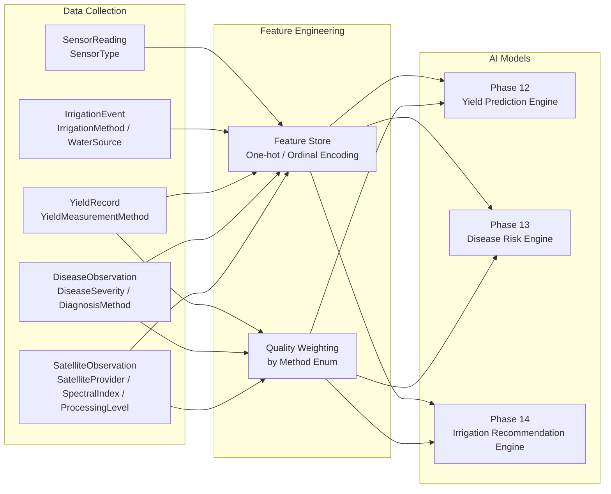
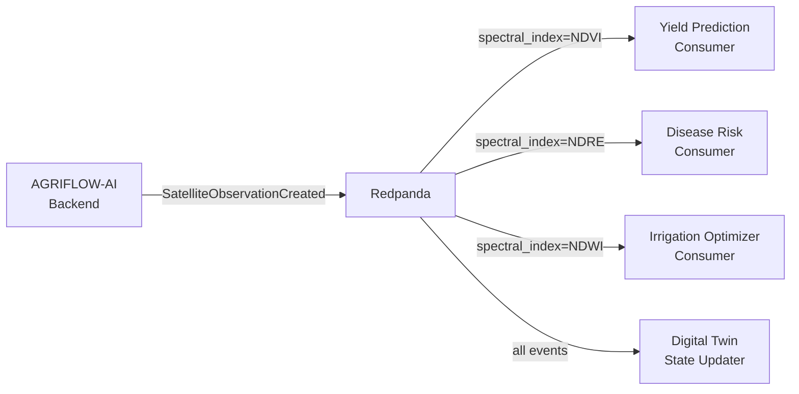
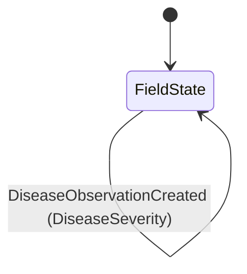

# REPORT-001 — Shared Domain Enumerations

**Document Type:** Architecture & Engineering Reference  
**Module:** `backend/app/core/enums.py`  
**Status:** Living Document  
**Scope:** Phase 7 through Phase 11 (current); future phase projection through Phase 20  
**Version:** 1.0  
**Date:** June 2026  
**Audience:** Software Engineers, AI Engineers, Data Engineers, ML Engineers, Solution Architects, Future Contributors, Future AI Agents

---

## Table of Contents

1. [Introduction](#1-introduction)
2. [Architectural Principles](#2-architectural-principles)
3. [Complete Enum Catalogue](#3-complete-enum-catalogue)
4. [Detailed Analysis of Every Enum Value](#4-detailed-analysis-of-every-enum-value)
5. [AI & Machine Learning Perspective](#5-ai--machine-learning-perspective)
6. [Satellite Observation Perspective](#6-satellite-observation-perspective)
7. [Spectral Index Reference](#7-spectral-index-reference)
8. [Processing Levels](#8-processing-levels)
9. [Relationship to Future Phases](#9-relationship-to-future-phases)
10. [Future Architecture Integration](#10-future-architecture-integration)
11. [Best Practices for Contributors](#11-best-practices-for-contributors)
12. [Architectural Decision Summary](#12-architectural-decision-summary)

---

## 1. Introduction

### 1.1 Purpose of This Document

This document is the authoritative engineering reference for the shared domain enumeration module located at:

```text
backend/app/core/enums.py
```

It is not user documentation. It is not API documentation. It is an architecture and engineering reference written for engineers, architects, and AI agents who need to understand how categorical values are defined, stored, validated, and reused across the AGRIFLOW-AI platform.

### 1.2 What Are Shared Domain Enumerations?

In AGRIFLOW-AI, many domain entities carry attributes that are bounded, categorical, and meaningful to multiple parts of the system simultaneously. Examples:

- A `SensorReading` must declare *what physical quantity it measures*
- An `IrrigationEvent` must declare *how water was delivered*
- A `YieldRecord` must declare *how the measurement was obtained*
- A `DiseaseObservation` must declare *how severe the disease is* and *how it was diagnosed*
- A `SatelliteObservation` must declare *which satellite provided the data*, *which spectral index was computed*, and *at what processing level*

These classifications are not free-text strings. They are bounded vocabularies with precise agricultural, scientific, and data quality meanings. Using uncontrolled strings would:

- Allow invalid values to persist silently in the database
- Make AI model feature engineering inconsistent
- Break API consumers when unexpected strings appear
- Prevent PostgreSQL from enforcing type safety at the storage layer

Shared domain enumerations solve this by defining these vocabularies once, in one place, in a form that is simultaneously a Python type, a PostgreSQL native ENUM type, and a Pydantic-validated FastAPI schema type.

### 1.3 Why Enumerations Are Centralized

The centralization strategy places all cross-domain enums in a single flat module rather than distributing them across individual domain model files.

**Rationale:**

1. **Circular import prevention.** ORM models, Pydantic schemas, service layer classes, and repository classes all need enum definitions. Circular imports between these layers are structurally guaranteed if enums live inside any one of them. A neutral, dependency-free module at `app.core.enums` has no imports from any application layer, eliminating this problem entirely.

2. **Single source of truth.** The AI prediction engine (Phase 12+), the Digital Twin state model, the GaaS tool layer, and the event streaming pipeline all consume the same enum definitions. Distributed definitions would require synchronization across multiple files on every change.

3. **Forward compatibility.** New phases introducing new consumers of existing enums (e.g., Phase 12 consuming `YieldMeasurementMethod` for training data quality weighting) require no changes to the enum definition — they import from the same location.

4. **Discoverability.** Any engineer or AI agent can see the complete bounded vocabulary of the platform by reading one file.

### 1.4 Evolution from Phase 7 to Phase 11

The shared enum module was introduced in Phase 7 and has grown incrementally:

```
Phase 7  →  SensorType              (11 values)   IoT sensor classification
Phase 8  →  IrrigationMethod        (8 values)    Water delivery method
             WaterSource             (5 values)    Water origin
Phase 9  →  YieldMeasurementMethod  (7 values)    Yield measurement provenance
Phase 10 →  DiseaseSeverity         (4 values)    Disease pressure classification
             DiagnosisMethod         (5 values)    Disease identification method
Phase 11 →  SatelliteProvider       (8 values)    Satellite platform/provider
             SpectralIndex           (8 values)    Derived vegetation/water index
             ProcessingLevel         (4 values)    Satellite data processing tier
```

Total: **9 enums**, **60 values** as of Phase 11.

### 1.5 Benefits of the Centralized Approach

| Benefit | Description |
|---|---|
| Type safety | Python static type checkers and Pydantic reject invalid values before they reach the database |
| Database integrity | PostgreSQL ENUM columns reject invalid strings at the storage layer with a constraint violation |
| API validation | FastAPI automatically documents and validates enum fields in request bodies |
| AI consistency | Feature engineering pipelines always see the same bounded set of categorical values |
| Readability | Raw SQL queries return human-readable labels without type casts |
| Migratability | SQLAlchemy's `postgresql.ENUM` pattern allows controlled PostgreSQL enum lifecycle management |

---

## 2. Architectural Principles

### 2.1 Why Enums Inherit from `str`

Every enum in this module uses the dual inheritance pattern:

```python
class SensorType(str, enum.Enum):
    SOIL_MOISTURE = "SOIL_MOISTURE"
```

The `str` base class means each member is simultaneously a Python enum member *and* a plain Python string. This has several critical consequences:

**SQLAlchemy storage.** When SQLAlchemy maps a `str`-based enum column, it stores the `.value` (the string `"SOIL_MOISTURE"`) in the database. This makes the stored data human-readable in raw SQL and psql sessions without requiring a type cast or lookup table.

**Pydantic serialization.** Pydantic's JSON serializer outputs the string value rather than the enum wrapper object. API responses contain plain strings (`"SOIL_MOISTURE"`) that API clients can compare and match without importing the Python enum.

**JSON compatibility.** Python's standard `json.dumps` cannot serialize `enum.Enum` objects directly. `str` inheritance removes this friction everywhere strings are serialized.

**Forward compatibility.** If the Python application is ever replaced or rewritten in another language, the database contains plain strings that any system can consume without an enum library.

### 2.2 Why `enum.Enum`

`enum.Enum` provides:

- **Exhaustive membership.** `SensorType.UNKNOWN` is a TypeError at the Python level; you cannot accidentally pass a non-member.
- **Iteration.** `list(SensorType)` enumerates all valid values, enabling validation loops, test parameterization, and feature vector generation.
- **Identity semantics.** `SensorType.SOIL_MOISTURE is SensorType.SOIL_MOISTURE` is `True`. Enum members are singletons.
- **Name/value duality.** `.name` is the Python attribute name; `.value` is the stored string. Both are accessible, supporting label encoding (by name index) and database storage (by value).

### 2.3 PostgreSQL ENUM Mapping

SQLAlchemy maps Python enums to native PostgreSQL `ENUM` types when the column is declared as:

```python
sensor_type: Mapped[SensorType] = mapped_column(
    Enum(SensorType, name="sensor_type", create_constraint=True),
    nullable=False,
)
```

**Key parameters:**

| Parameter | Purpose |
|---|---|
| `name="sensor_type"` | Names the PostgreSQL ENUM type object in the `pg_type` catalogue |
| `create_constraint=True` | Adds a `CHECK` constraint that enforces membership at the PostgreSQL level |

**PostgreSQL behaviour:**

```sql
-- PostgreSQL creates a named type:
CREATE TYPE sensor_type AS ENUM (
    'SOIL_MOISTURE', 'SOIL_TEMPERATURE', 'AIR_TEMPERATURE', ...
);

-- The column references this type:
ALTER TABLE sensor_readings ADD COLUMN sensor_type sensor_type NOT NULL;
```

Any attempt to insert a row with `sensor_type = 'INVALID_VALUE'` raises a PostgreSQL `invalid input value for enum` error, providing defence in depth independent of the application layer.

**Alembic migration pattern.** To avoid lifecycle conflicts (PostgreSQL ENUM types exist independently of tables), AGRIFLOW-AI uses the authoritative pattern established in ADR-008-01:

```python
from sqlalchemy.dialects import postgresql

# In Alembic upgrade():
irrigation_method_enum = postgresql.ENUM(
    'DRIP', 'SPRINKLER', 'FLOOD', ...,
    name='irrigation_method',
    create_type=False,
)
irrigation_method_enum.create(op.get_bind(), checkfirst=True)
op.add_column('irrigation_events', sa.Column('irrigation_method', irrigation_method_enum, ...))

# In Alembic downgrade():
irrigation_method_enum.drop(op.get_bind(), checkfirst=True)
```

This pattern ensures the ENUM type is created before the column and dropped after it, and is idempotent (`checkfirst=True`).

### 2.4 SQLAlchemy Integration

The ORM relationship between a Python enum and the corresponding column:

```python
# enums.py (shared, no imports from ORM)
class IrrigationMethod(str, enum.Enum):
    DRIP = "DRIP"
    ...

# irrigation_event.py (ORM model, imports from enums)
from app.core.enums import IrrigationMethod

class IrrigationEvent(AuditableModel, Base):
    irrigation_method: Mapped[IrrigationMethod] = mapped_column(
        Enum(IrrigationMethod, name="irrigation_method", create_constraint=True),
        nullable=False,
    )
```

SQLAlchemy automatically:
- Validates incoming Python values against the enum
- Stores the `.value` string in the column
- Hydrates the column back to the Python enum member on SELECT

### 2.5 Pydantic Integration

Pydantic V2 natively supports `str` enum members. In Pydantic schemas:

```python
from app.core.enums import IrrigationMethod

class IrrigationEventCreate(BaseModel):
    irrigation_method: IrrigationMethod
```

Pydantic:
- Accepts either the string value (`"DRIP"`) or the enum member (`IrrigationMethod.DRIP`)
- Rejects any string not in the enum with a validation error
- Serializes to the string value in JSON output

### 2.6 FastAPI Integration

FastAPI reads Pydantic schemas and automatically:
- Generates OpenAPI `enum` entries in the request body schema
- Documents all valid values in the `/docs` (Swagger UI)
- Returns a `422 Unprocessable Entity` response with a descriptive error message when an invalid enum value is submitted

The enum values appear directly in Swagger documentation without any additional configuration.

### 2.7 AI Readiness

Enums are a foundational data quality mechanism for AI/ML pipelines:

- **Feature encoding.** Categorical features derived from enums are encoded as one-hot vectors or ordinal integers during feature engineering. A closed, stable vocabulary guarantees consistent encoding dimensions across training and inference.
- **Data quality weighting.** Some enums carry implicit quality metadata (e.g., `YieldMeasurementMethod`, `DiagnosisMethod`, `ProcessingLevel`) that allow training pipelines to assign confidence weights to observations.
- **Label consistency.** Classification target variables (e.g., `DiseaseSeverity`) must be stable across training batches. Enum definitions ensure label stability.
- **Filtering.** Feature stores and ETL pipelines filter observations by enum value (e.g., `WHERE processing_level = 'ARD'`) to enforce data quality gates.

---

## 3. Complete Enum Catalogue

### Summary Table

| Enum | Phase | Values | Domain Consumer(s) | AI Consumer(s) |
|---|---|---|---|---|
| `SensorType` | 7 | 11 | `SensorReading` | Yield Prediction, Disease Risk, Irrigation Optimization, Digital Twin |
| `IrrigationMethod` | 8 | 8 | `IrrigationEvent` | Irrigation Optimization (FAO-56 efficiency coefficients) |
| `WaterSource` | 8 | 5 | `IrrigationEvent` | Water management analytics |
| `YieldMeasurementMethod` | 9 | 7 | `YieldRecord` | Yield Prediction Engine (quality weighting) |
| `DiseaseSeverity` | 10 | 4 | `DiseaseObservation` | Disease Risk Engine (target label) |
| `DiagnosisMethod` | 10 | 5 | `DiseaseObservation` | Disease Risk Engine (quality weighting) |
| `SatelliteProvider` | 11 | 8 | `SatelliteObservation` | Yield Prediction, Disease Risk (spatial features) |
| `SpectralIndex` | 11 | 8 | `SatelliteObservation` | All AI engines (vegetation/water stress features) |
| `ProcessingLevel` | 11 | 4 | `SatelliteObservation` | All AI engines (training data quality gate) |

---

### 3.1 `SensorType`

**Source module location:** `app.core.enums`  
**Introduced:** Phase 7  
**PostgreSQL type name:** `sensor_type`  
**ORM consumer:** `SensorReading.sensor_type`

**Purpose:** Discriminates the physical quantity an IoT sensor measures. This is the primary classification key for all sensor telemetry data in the platform.

**Agricultural meaning:** IoT sensors deployed on fields measure different environmental variables. Without a type discriminator, a value of `22.4` has no meaning — it could be degrees Celsius, volumetric water content percentage, or electrical conductivity in dS/m. `SensorType` provides the semantic context.

**Database representation:**
```sql
CREATE TYPE sensor_type AS ENUM (
    'SOIL_MOISTURE', 'SOIL_TEMPERATURE', 'AIR_TEMPERATURE', 'AIR_HUMIDITY',
    'LIGHT_INTENSITY', 'LEAF_WETNESS', 'ELECTRICAL_CONDUCTIVITY',
    'SOIL_SALINITY', 'WATER_LEVEL', 'BATTERY_STATUS', 'DEVICE_HEALTH'
);
```

**API representation:** Exposed as a string enum in the `POST /api/v1/fields/{field_id}/sensor-readings` request body and `SensorReadingResponse` schema.

**Index strategy:** A compound index on `(sensor_type, recorded_at)` exists on `sensor_readings`, enabling efficient time-range queries filtered by sensor type.

---

### 3.2 `IrrigationMethod`

**Source module location:** `app.core.enums`  
**Introduced:** Phase 8  
**PostgreSQL type name:** `irrigation_method`  
**ORM consumer:** `IrrigationEvent.irrigation_method`

**Purpose:** Classifies the physical delivery mechanism used to apply water during an irrigation event.

**Agricultural meaning:** The method of water delivery determines application efficiency, labour requirements, infrastructure cost, and suitability for different crops and soil types. Two events with identical water volumes but different methods have different effective moisture distributions at the root zone.

**AI significance:** FAO-56 Penman-Monteith water balance models use application efficiency coefficients specific to each delivery method. The Phase 14 Irrigation Recommendation Engine will use `irrigation_method` to apply the correct efficiency factor when computing crop water deficits.

---

### 3.3 `WaterSource`

**Source module location:** `app.core.enums`  
**Introduced:** Phase 8  
**PostgreSQL type name:** `water_source`  
**ORM consumer:** `IrrigationEvent.water_source` (nullable)

**Purpose:** Records the origin of the water applied during an irrigation event.

**Agricultural meaning:** Water quality varies significantly by source. Groundwater may carry dissolved minerals; recycled water may carry pathogens or residuals; rainwater is typically low in solutes. Source tracking enables water quality analysis, cost tracking, and sustainability reporting.

**Sustainability significance:** Cooperative sustainability frameworks (e.g., SAI Platform, GLOBALG.A.P.) require water source disclosure. This enum directly supports sustainability compliance reporting.

---

### 3.4 `YieldMeasurementMethod`

**Source module location:** `app.core.enums`  
**Introduced:** Phase 9  
**PostgreSQL type name:** `yield_measurement_method`  
**ORM consumer:** `YieldRecord.measurement_method`

**Purpose:** Records the provenance of a yield measurement — how the value was obtained.

**Agricultural meaning:** Yield measurements vary enormously in accuracy, spatial resolution, and replicability depending on how they were obtained. A combine monitor harvest map has very different statistical properties than an agronomist estimate.

**AI significance:** This is one of the most important enums for the Phase 12 Yield Prediction Engine. The training pipeline will use `measurement_method` as a quality weight when fitting models — high-confidence measurements contribute more to model training than estimates.

---

### 3.5 `DiseaseSeverity`

**Source module location:** `app.core.enums`  
**Introduced:** Phase 10  
**PostgreSQL type name:** `disease_severity`  
**ORM consumer:** `DiseaseObservation.severity`

**Purpose:** Classifies the severity of a plant disease observation on an ordinal scale from LOW to CRITICAL.

**Agricultural meaning:** Severity drives the urgency and type of agronomic response. A LOW observation may warrant monitoring; a CRITICAL observation requires immediate treatment to prevent crop loss.

**AI significance:** `DiseaseSeverity` is the primary target label for the Phase 13 Disease Risk Scoring Engine. The model will be trained to predict future severity given sensor telemetry, weather, satellite indices, and crop lifecycle data.

---

### 3.6 `DiagnosisMethod`

**Source module location:** `app.core.enums`  
**Introduced:** Phase 10  
**PostgreSQL type name:** `diagnosis_method`  
**ORM consumer:** `DiseaseObservation.diagnosis_method`

**Purpose:** Records how the disease was identified or confirmed.

**Agricultural meaning:** A disease identified by `LAB_ANALYSIS` is a confirmed pathogen detection at species level. A disease identified by `VISUAL_INSPECTION` is a farmer's field observation without instrumental confirmation. The confidence of an observation depends heavily on method.

**AI significance:** Like `YieldMeasurementMethod`, `DiagnosisMethod` is a quality weighting input for the Phase 13 Disease Risk Scoring Engine. Training observations confirmed by lab analysis should carry higher weight than unconfirmed visual estimates.

---

### 3.7 `SatelliteProvider`

**Source module location:** `app.core.enums`  
**Introduced:** Phase 11  
**PostgreSQL type name:** `satellite_provider`  
**ORM consumer:** `SatelliteObservation.satellite_provider` (Phase 11 Step C)

**Purpose:** Records which satellite platform or commercial provider supplied the imagery from which the spectral index was computed.

**Agricultural and AI meaning:** Provider identity is a proxy for spatial resolution, revisit frequency, and spectral band availability. These properties directly affect the quality and granularity of computed indices.

---

### 3.8 `SpectralIndex`

**Source module location:** `app.core.enums`  
**Introduced:** Phase 11  
**PostgreSQL type name:** `spectral_index`  
**ORM consumer:** `SatelliteObservation.spectral_index` (Phase 11 Step C)

**Purpose:** Classifies the derived spectral or vegetation index computed from satellite band reflectance values. This is the primary measurement discriminator for satellite observations — the satellite equivalent of `SensorType`.

**Agricultural meaning:** Spectral indices transform raw band reflectance values into interpretable agricultural signals. NDVI tells you about canopy greenness; NDWI tells you about crop water stress; NDRE tells you about early chlorophyll degradation before it is visible. Each index answers a different agronomic question.

---

### 3.9 `ProcessingLevel`

**Source module location:** `app.core.enums`  
**Introduced:** Phase 11  
**PostgreSQL type name:** `processing_level`  
**ORM consumer:** `SatelliteObservation.processing_level` (Phase 11 Step C)

**Purpose:** Records the processing tier of the satellite data before the spectral index was computed. This is a data quality provenance indicator.

**Agricultural and AI meaning:** Raw satellite data (L1C) cannot be meaningfully compared across dates, sensors, or atmospheric conditions. Surface reflectance (L2A, ARD) is atmospherically corrected, making observations comparable across time and space. AI models should never mix L1C and L2A observations in the same training batch without explicit normalization.

---

## 4. Detailed Analysis of Every Enum Value

### 4.1 `SensorType` Values

#### `SOIL_MOISTURE`
- **Definition:** Volumetric water content (VWC) of the soil, typically expressed as a percentage (% VWC) or centibars (cb) for tensiometers.
- **Agricultural interpretation:** The primary irrigation trigger indicator. Soil moisture below crop-specific wilting point thresholds triggers water stress; above field capacity, excess water displaces air and causes root anaerobia.
- **Real-world use:** Capacitance probes (e.g., Decagon 5TM, FDR probes) inserted at root zone depth. A reading of 28% VWC in clay loam is well within field capacity; 12% may indicate onset of stress.
- **AI significance:** Primary feature for irrigation scheduling models. Phase 14 Irrigation Recommendation Engine uses soil moisture time series as the primary decision input. Also a key covariate for disease risk (saturated soils favour fungal pathogens).
- **Digital Twin use:** Real-time soil water balance state variable. Updated on every `SensorReadingCreated` event.
- **GaaS use:** "Should I irrigate Field 5 today?" queries directly consume soil moisture sensor history.

#### `SOIL_TEMPERATURE`
- **Definition:** Temperature of the soil at a specified depth, measured in degrees Celsius.
- **Agricultural interpretation:** Drives seed germination rates, root growth, soil microbial activity, and nutrient mineralization. Maize germination is inhibited below 10°C; potato scab pathogen activity peaks at 20–22°C.
- **AI significance:** Feature for yield prediction (growing degree day accumulation starts from planting; soil temperature affects early establishment). Feature for disease risk (soil-borne pathogen activity is temperature-dependent).
- **Digital Twin use:** Soil thermal state variable in the Digital Twin field model.

#### `AIR_TEMPERATURE`
- **Definition:** Ambient air temperature measured at the field, typically at 2 m height, in degrees Celsius.
- **Agricultural interpretation:** Controls crop transpiration rate, photosynthesis efficiency, and pest/pathogen development. Frost events (< 0°C) can cause irreversible crop damage. Heat stress (crop-specific; typically > 35°C for cereals) reduces grain fill.
- **AI significance:** One of the highest-importance features across all AI models. Growing degree day (GDD) accumulation — the primary phenological clock — is computed from daily min/max air temperature. Evapotranspiration (ET₀) in FAO-56 requires air temperature.
- **Relationship to WeatherRecord:** `WeatherRecord` stores historical weather observations (manual or API-sourced). `SensorReading` with `SOIL_TEMPERATURE` or `AIR_TEMPERATURE` provides continuous field-level telemetry at higher temporal resolution. Both feed the same AI models at different granularities.

#### `AIR_HUMIDITY`
- **Definition:** Relative humidity of ambient air, expressed as a percentage (%).
- **Agricultural interpretation:** High humidity (> 80%) favours fungal disease development (powdery mildew, botrytis, late blight). Low humidity increases evapotranspiration demand. Combined with temperature it determines the vapour pressure deficit (VPD), a key crop water stress indicator.
- **AI significance:** Critical feature for disease risk prediction. Leaf wetness periods calculated from humidity + temperature time series are the primary inputs to infection period models (e.g., MELCAST for late blight).

#### `LIGHT_INTENSITY`
- **Definition:** Photosynthetically Active Radiation (PAR) or lux, measuring the photon flux available for photosynthesis.
- **Agricultural interpretation:** Drives photosynthesis rate and dry matter accumulation. Shading from clouds, row orientation, and canopy architecture affects light interception efficiency. Crop models (e.g., DSSAT, APSIM) use daily radiation for biomass simulation.
- **AI significance:** Input for biomass accumulation models and yield potential estimation. Correlated with satellite-derived LAI.

#### `LEAF_WETNESS`
- **Definition:** Presence and duration of liquid water on the leaf surface, measured by resistance sensors or simulation.
- **Agricultural interpretation:** Leaf wetness duration (LWD) is the single most important epidemiological variable for foliar disease infection risk. Most fungal spores require free water on the leaf surface for germination and penetration (typically 6–12 hours depending on pathogen and temperature).
- **AI significance:** The highest-importance single feature for disease risk prediction in most foliar disease models. Phase 13 Disease Risk Engine will use leaf wetness duration as a primary infection period indicator.

#### `ELECTRICAL_CONDUCTIVITY`
- **Definition:** Apparent soil electrical conductivity (ECa), measured in deciSiemens per metre (dS/m).
- **Agricultural interpretation:** ECa is a proxy for soil salt content, water content, texture, and organic matter simultaneously. High EC indicates salinity stress risk. Spatial EC mapping (EM38, ERT) is used for precision agriculture zone delineation.
- **AI significance:** Feature for site-specific yield prediction (yield is negatively correlated with high ECa in saline soils). Useful for precision agriculture segmentation of management zones.
- **Digital Twin use:** Soil chemistry state variable. Combined with pH and soil moisture for soil health index computation.

#### `SOIL_SALINITY`
- **Definition:** Dissolved salt concentration in the soil solution, measured as EC in dS/m or as ppm.
- **Agricultural meaning:** Distinguishes from `ELECTRICAL_CONDUCTIVITY` by representing a direct solution measurement (e.g., from soil water samplers or TDR sensors calibrated for salinity) rather than apparent bulk EC. High salinity reduces osmotic potential, causing physiological drought even when bulk water content is adequate.
- **AI significance:** Feature for stress-adjusted yield prediction. Crops show salinity thresholds above which yield declines linearly (FAO threshold + slope model).

#### `WATER_LEVEL`
- **Definition:** Water depth in an irrigation canal, reservoir, dam, or drainage ditch, measured in metres.
- **Agricultural interpretation:** Enables remote monitoring of water availability for irrigation scheduling without manual gauge readings. In flood/furrow irrigation, water level in supply channels determines delivery feasibility.
- **AI significance:** Supply availability feature for the Irrigation Recommendation Engine. Low reservoir levels constrain when irrigation is physically possible regardless of crop demand.
- **Digital Twin use:** Farm-level water resource state variable.

#### `BATTERY_STATUS`
- **Definition:** Battery charge level of the IoT sensor node, expressed as a percentage (%) or voltage (V).
- **Agricultural interpretation:** Non-agronomic device health indicator. Low battery predicts imminent sensor data loss.
- **AI significance:** Data quality flag. Training pipelines should exclude or down-weight sensor readings recorded immediately before a device goes offline (values may be unreliable as voltage drops affect ADC accuracy in some sensor designs).
- **Operational use:** Feed into monitoring alerting systems. `BATTERY_STATUS < 20%` triggers a maintenance dispatch alert.

#### `DEVICE_HEALTH`
- **Definition:** General device operational health indicator. Value interpretation is device-specific (e.g., `1.0` = healthy, `0.0` = fault).
- **Agricultural interpretation:** Non-agronomic. Captures sensor faults, communication errors, or self-diagnostic failures.
- **AI significance:** Data quality exclusion flag. Records with `DEVICE_HEALTH < 1.0` should be excluded from training datasets.

---

### 4.2 `IrrigationMethod` Values

#### `DRIP`
- **Definition:** Water delivered directly to the root zone through emitters in buried or surface-laid tubing.
- **Agricultural interpretation:** Highest water use efficiency (85–95% distribution uniformity). Minimal foliar wetting eliminates leaf wetness contribution. Suitable for row crops, orchards, and vegetables.
- **AI significance:** Drip records have near-zero contribution to leaf wetness duration, distinguishing their disease risk profile from overhead methods.

#### `SPRINKLER`
- **Definition:** Water delivered through overhead rotating or fixed sprinkler heads, simulating rainfall.
- **Agricultural interpretation:** Moderate efficiency (70–85%). Creates significant leaf wetness duration. Suitable for large areas and uniform-density crops.
- **AI significance:** Sprinkler events are leaf wetness duration contributors for disease risk models. High interaction with `LEAF_WETNESS` sensor readings and `DiseaseSeverity` labels.

#### `FLOOD`
- **Definition:** Uncontrolled flow of water across the field surface until the soil is saturated.
- **Agricultural interpretation:** Lowest efficiency (50–70%). Labour-intensive. Traditional method in rice cultivation and some orchard systems in water-abundant regions.
- **AI significance:** High temporal uncertainty in water delivery amount. `water_volume_liters` is typically null or estimated for flood events. Down-weighted in irrigation optimization models.

#### `FURROW`
- **Definition:** Water flows in small channels (furrows) between crop rows by gravity.
- **Agricultural interpretation:** Moderate efficiency (50–65%). Common for row crops (maize, cotton) in areas without pressurized irrigation infrastructure. Creates localized wetted soil bands.
- **AI significance:** Partial field coverage — only inter-row soil is wetted. Moisture distribution models differ from uniform methods.

#### `CENTER_PIVOT`
- **Definition:** Rotating sprinkler arm anchored at a central pivot point, irrigating a circular area.
- **Agricultural interpretation:** Good efficiency (75–90%) at scale. Very common in large-scale cereal production (North America, South America). Creates circular field patterns visible in satellite imagery.
- **AI significance:** Strong satellite imagery interaction — circular pivot fields have distinctive NDVI ring patterns. Satellite-observed NDVI can be used to validate center pivot operation status in the Digital Twin.

#### `SUBSURFACE`
- **Definition:** Water delivered below the soil surface through buried pipes or a raised water table.
- **Agricultural interpretation:** Highest efficiency of all methods (85–95%+). Zero evaporation loss from surface, zero leaf wetness. Used in precision horticulture and high-value crops.

#### `MANUAL`
- **Definition:** Water applied by hand using hoses, watering cans, or manual flood gate management.
- **Agricultural interpretation:** Common in smallholder farming. Highly variable application uniformity. Records may have imprecise volume estimates.
- **AI significance:** Lowest data quality for volume estimates. Reduce confidence weight in water balance computations.

#### `AUTOMATED`
- **Definition:** Computer- or controller-managed irrigation triggered automatically based on sensor feedback or schedule.
- **Agricultural interpretation:** Highest temporal precision. Records are typically generated automatically from SCADA systems rather than entered manually. Volume and duration data tend to be the most accurate.
- **AI significance:** Highest quality irrigation records. Automated systems are primary deployment targets for the Phase 14 Irrigation Recommendation Engine.

---

### 4.3 `WaterSource` Values

#### `GROUNDWATER`
- **Definition:** Water extracted from aquifers through wells, boreholes, or springs.
- **Agricultural interpretation:** Most common irrigation source globally. Quality varies — high dissolved minerals, especially calcium, magnesium, or nitrates in some regions. Pumping costs are measurable energy inputs.
- **Sustainability significance:** Groundwater depletion is the leading driver of irrigation-related land subsidence. Source tracking enables water balance accounting and aquifer drawdown risk assessment.

#### `SURFACE_WATER`
- **Definition:** Water sourced from rivers, canals, streams, or irrigation ditches.
- **Agricultural interpretation:** Quality depends on upstream activities. Subject to seasonal availability and allocation rights. Often carries suspended sediments and biological load.

#### `RAINWATER`
- **Definition:** Water harvested from precipitation and stored in tanks, cisterns, or ponds.
- **Agricultural interpretation:** Zero cost beyond storage infrastructure. Quality is typically highest of all sources (low dissolved solids). Availability is rainfall-dependent.
- **Sustainability significance:** Rainwater harvesting systems are a key indicator in regenerative agriculture assessments.

#### `MUNICIPAL`
- **Definition:** Water from municipal water supply networks.
- **Agricultural interpretation:** Consistent quality and pressure. High cost per unit volume. Typically used only in urban/peri-urban farming or for high-value crops when other sources are unavailable.

#### `RECYCLED_WATER`
- **Definition:** Treated wastewater or greywater reused for agricultural irrigation.
- **Agricultural interpretation:** Growing in importance for water-scarce regions. Quality classification (Class A, Class B, etc.) determines crop suitability. Must be tracked separately for food safety and regulatory compliance.
- **AI significance:** Recycled water may carry elevated nutrients (N, P) that affect fertilizer management. This source type is a flag for downstream nutrient management models.

---

### 4.4 `YieldMeasurementMethod` Values

#### `MANUAL_SCALE`
- **Definition:** Physical weighing of harvested material using calibrated scales.
- **Agricultural interpretation:** Reliable and accurate for small plots, research trials, and high-value crops. Becomes impractical at commercial scale.
- **AI quality weight:** High confidence for the measured plot. Limited spatial representation if only a subset of the field is weighed.

#### `COMBINE_MONITOR`
- **Definition:** Yield derived from the mass flow sensor and GPS of a combine harvester.
- **Agricultural interpretation:** The industry standard for large-scale cereal production. Provides spatially continuous yield data at harvester swath resolution (typically 6–12 m).
- **AI quality weight:** Highest quality for spatial yield mapping. Subject to combine header loss estimates and sensor calibration errors (~3–5% typical).

#### `YIELD_MAP`
- **Definition:** A spatially interpolated yield surface derived from combine monitor data or hand-harvest grid sampling.
- **Agricultural interpretation:** Combines multiple measurement passes or data sources into a continuous field-level yield surface. Suitable for within-field variability analysis.
- **AI quality weight:** High. The interpolation process may smooth true spatial variation; edge artefacts may occur.

#### `REMOTE_SENSING`
- **Definition:** Yield estimated from satellite or UAV-derived spectral indices (e.g., NDVI × calibration model).
- **Agricultural interpretation:** Provides field-level coverage including areas inaccessible by ground equipment. Accuracy depends on calibration against ground truth measurements and atmospheric conditions.
- **AI quality weight:** Medium. Remote sensing yield estimates are themselves model outputs; using them as training labels can introduce label noise. Use as an auxiliary feature rather than a primary label where possible.

#### `CROP_CUT`
- **Definition:** FAO standardized protocol involving harvesting all plants within randomly placed sample quadrats, weighing fresh and dry biomass.
- **Agricultural interpretation:** The international standard for national agricultural statistics. Statistically valid when sample size and quadrat placement protocols are followed.
- **AI quality weight:** Very high statistical validity; typically low spatial coverage.

#### `LABORATORY_ANALYSIS`
- **Definition:** Yield components (e.g., grain count, thousand-grain weight) measured in a laboratory from collected samples.
- **Agricultural interpretation:** Highest measurement accuracy. Destructs the sample. Provides grain quality attributes alongside yield.
- **AI quality weight:** Highest accuracy per measurement. Limited spatial coverage.

#### `ESTIMATED`
- **Definition:** Yield estimated by an agronomist from visual inspection, historic benchmarks, or rule-of-thumb calculations without direct measurement.
- **Agricultural interpretation:** Used when no measurement equipment is available. Accuracy varies widely with agronomist experience. Uncertainty should be explicitly acknowledged.
- **AI quality weight:** Lowest confidence. Training pipelines should apply a low confidence weight or exclude estimates when higher-quality alternatives exist for the same field/crop/season.

---

### 4.5 `DiseaseSeverity` Values

#### `LOW`
- **Definition:** Minor disease symptoms present; localised distribution; no immediate yield threat.
- **Agricultural interpretation:** Monitoring is warranted. First treatment threshold not reached. Infection may self-limit if environmental conditions change.
- **AI significance:** Target label encoding: 0 (or ordinal 1). Low severity observations still provide negative-class samples essential for binary classification models.

#### `MEDIUM`
- **Definition:** Moderate disease spread across a meaningful portion of the crop; intervention is recommended.
- **Agricultural interpretation:** Economic damage threshold has likely been reached for most commercial crops. First application of fungicide, bactericide, or biological control agent is typically initiated.
- **AI significance:** Target label encoding: 1 (ordinal 2). The most common transition state in disease progression time series.

#### `HIGH`
- **Definition:** Significant disease pressure across a large portion of the crop; yield loss is expected.
- **Agricultural interpretation:** Second or emergency treatment is required. Harvest timing may need to be advanced. Yield loss correlations are established for most common diseases at this severity level.
- **AI significance:** Target label encoding: 2 (ordinal 3). High severity observations near harvest date are primary yield loss features for yield prediction models.

#### `CRITICAL`
- **Definition:** Severe disease outbreak across the majority of the crop; urgent action is required to prevent total crop loss.
- **Agricultural interpretation:** Crop may be declared a total loss. Emergency notifications to cooperative or insurer may be triggered. Neighbouring fields require immediate assessment.
- **AI significance:** Target label encoding: 3 (ordinal 4). Rare class in most training datasets — requires SMOTE or class-weighted loss functions to prevent class imbalance bias.

---

### 4.6 `DiagnosisMethod` Values

#### `VISUAL_INSPECTION`
- **Definition:** Disease identified by a farmer or operator based on visual observation of symptoms in the field.
- **Agricultural interpretation:** The most common diagnosis method. Accuracy varies with experience and symptom specificity (some diseases have highly characteristic symptoms; others require expert diagnosis).
- **AI quality weight:** Medium. High false-positive rate for diseases with similar symptom profiles (e.g., nutrient deficiency vs. early fungal lesion).

#### `LAB_ANALYSIS`
- **Definition:** Disease confirmed by laboratory testing — PCR, ELISA, microscopy, or culture.
- **Agricultural interpretation:** Pathogen identified at species or strain level. Highest biological certainty. Required for regulatory reporting of notifiable diseases.
- **AI quality weight:** Highest confidence. Lab-confirmed observations are the gold standard training labels for disease risk models.

#### `IMAGE_AI`
- **Definition:** Disease identified by a computer vision model analysing a photograph captured in the field.
- **Agricultural interpretation:** Growing adoption via smartphone apps (e.g., PlantVillage Nuru, Plantix). Accuracy depends on model quality, image resolution, lighting, and disease stage.
- **AI quality weight:** Medium. Confidence depends on the external model's accuracy. Records should ideally carry a confidence score alongside the diagnosis.
- **Future AGRIFLOW-AI integration:** Phase 13 Disease Risk Engine outputs will be logged back as `DiagnosisMethod.IMAGE_AI` observations in a closed-loop system.

#### `AGRONOMIST`
- **Definition:** Disease identified by a professional agronomist during a field consultation.
- **Agricultural interpretation:** High-confidence expert assessment. Agronomists can distinguish visually similar symptoms and take account of field history, regional disease pressure, and seasonal context.
- **AI quality weight:** High. Second only to lab analysis in confidence. Commonly used in commercial crop protection programmes.

#### `SENSOR_DETECTED`
- **Definition:** Disease inferred from environmental sensor thresholds — e.g., sustained leaf wetness + temperature combination triggering an infection period alert.
- **Agricultural interpretation:** Currently a future capability. Epidemiological models (e.g., MELCAST, Wallin model) use environmental sensor data to predict infection periods. Detection is probabilistic, not observational.
- **AI significance:** When implemented, sensor-detected disease flags will be weak training labels carrying lower confidence weight. They are most useful as training features (did an infection period occur?) rather than labels (did disease actually develop?).

---

### 4.7 `SatelliteProvider` Values

See Section 6 for full comparative analysis. Value summaries:

| Value | Provider | Spatial Resolution | Revisit | Cost |
|---|---|---|---|---|
| `SENTINEL_2` | ESA / Copernicus | 10 m (VIS/NIR) | 5 days | Free |
| `LANDSAT_8` | USGS / NASA | 30 m | 16 days | Free |
| `LANDSAT_9` | USGS / NASA | 30 m | 16 days | Free |
| `PLANET` | Planet Labs | 3–5 m | Daily | Commercial |
| `MODIS` | NASA | 250 m – 1 km | Daily | Free |
| `SPOT` | Airbus Defence & Space | 1.5–6 m | 2–3 days | Commercial |
| `WORLDVIEW` | Maxar Technologies | 0.3–1.2 m | 1 day | Commercial |
| `UNKNOWN` | Not recorded | — | — | — |

---

### 4.8 `SpectralIndex` Values

See Section 7 for full scientific reference. Value summaries:

| Value | Full Name | Primary Agricultural Use |
|---|---|---|
| `NDVI` | Normalized Difference Vegetation Index | General canopy greenness and biomass |
| `EVI` | Enhanced Vegetation Index | High-biomass canopy assessment |
| `NDWI` | Normalized Difference Water Index | Crop water stress and irrigation demand |
| `SAVI` | Soil-Adjusted Vegetation Index | Sparse vegetation / bare soil correction |
| `NDRE` | Normalized Difference Red Edge | Early crop stress and nitrogen deficiency |
| `LAI` | Leaf Area Index | Structural canopy measure for crop models |
| `MSAVI` | Modified Soil-Adjusted Vegetation Index | Improved SAVI without empirical soil factor |
| `GNDVI` | Green NDVI | Chlorophyll concentration sensitivity |

---

### 4.9 `ProcessingLevel` Values

See Section 8 for full technical reference.

| Value | Full Name | Atmospheric Correction | AI Suitability |
|---|---|---|---|
| `L1C` | Top-of-Atmosphere Reflectance | None | Low — training use requires explicit normalization |
| `L2A` | Surface Reflectance (BOA) | Full atmospheric correction | High — standard training input |
| `ARD` | Analysis-Ready Data | Full + cloud masking + geometric correction | Highest — preferred training input |
| `DERIVED` | Composite / Mosaic Product | Inherited from source | Medium — suitable for trend analysis |

---

## 5. AI & Machine Learning Perspective

### 5.1 Overview

The nine shared enums are not merely data validation tools — they are the backbone of the AI feature engineering pipeline. Every enum value that appears in the database becomes a potential categorical feature, quality weight, or training label in AI model development.



### 5.2 Yield Prediction (Phase 12)

**Target variable:** `YieldRecord.yield_value_tons_ha`

**Enum contributions:**

| Enum | Role | Detail |
|---|---|---|
| `YieldMeasurementMethod` | Label quality weight | `COMBINE_MONITOR` and `CROP_CUT` observations receive higher weights; `ESTIMATED` receives low weight |
| `SensorType` | Features | `SOIL_MOISTURE`, `AIR_TEMPERATURE`, `SOIL_TEMPERATURE` time-series features in the growing window |
| `SpectralIndex` | Features | NDVI, EVI growing-season time series as primary biomass indicators; LAI for canopy development tracking |
| `SatelliteProvider` | Feature metadata | Spatial resolution correction factor for index values; Sentinel-2 at 10 m vs MODIS at 250 m carry different information content |
| `ProcessingLevel` | Training data gate | Only `ARD` and `L2A` observations included in training features |
| `IrrigationMethod` | Features | Total water applied per growing season, weighted by method efficiency coefficient |

### 5.3 Disease Risk Prediction (Phase 13)

**Target variable:** `DiseaseObservation.severity` (ordinal classification: LOW → CRITICAL)

**Enum contributions:**

| Enum | Role | Detail |
|---|---|---|
| `DiseaseSeverity` | Training label | Ordinal target: LOW=0, MEDIUM=1, HIGH=2, CRITICAL=3 |
| `DiagnosisMethod` | Label quality weight | `LAB_ANALYSIS` and `AGRONOMIST` observations receive full weight; `VISUAL_INSPECTION` reduced; `IMAGE_AI` model-confidence-dependent |
| `SensorType` | Features | `LEAF_WETNESS` (primary), `AIR_HUMIDITY` (secondary), `AIR_TEMPERATURE` (pathogen development rate) |
| `SpectralIndex` | Features | NDRE and NDVI as early crop stress signals (stress precedes visible disease); NDWI for wet canopy conditions |
| `ProcessingLevel` | Training data gate | `ARD` preferred; `L1C` excluded unless normalized |

### 5.4 Irrigation Optimization (Phase 14)

**Goal:** Recommend optimal irrigation timing and volume using FAO-56 water balance.

**Enum contributions:**

| Enum | Role | Detail |
|---|---|---|
| `IrrigationMethod` | Efficiency coefficient | Applied to `water_volume_liters` to compute effective root zone replenishment |
| `WaterSource` | Availability constraint | RAINWATER and MUNICIPAL availability modelled separately from GROUNDWATER |
| `SensorType` | ET₀ inputs | `AIR_TEMPERATURE`, `AIR_HUMIDITY`, `LIGHT_INTENSITY`, `SOIL_MOISTURE` |
| `SpectralIndex` | Crop stress signals | NDWI for early water deficit detection; NDVI for crop coefficient (Kc) estimation |

### 5.5 Feature Engineering Patterns

**One-hot encoding (nominal enums):**
```python
# SatelliteProvider, SensorType, IrrigationMethod, WaterSource, DiagnosisMethod
pd.get_dummies(df['satellite_provider'], prefix='provider')
# Produces: provider_SENTINEL_2, provider_LANDSAT_8, ...
```

**Ordinal encoding (ordered enums):**
```python
# DiseaseSeverity has natural order: LOW < MEDIUM < HIGH < CRITICAL
severity_order = {
    DiseaseSeverity.LOW: 0,
    DiseaseSeverity.MEDIUM: 1,
    DiseaseSeverity.HIGH: 2,
    DiseaseSeverity.CRITICAL: 3,
}
df['severity_ordinal'] = df['severity'].map(severity_order)
```

**Quality weight mapping:**
```python
# YieldMeasurementMethod data quality weights
method_quality_weights = {
    YieldMeasurementMethod.COMBINE_MONITOR: 1.0,
    YieldMeasurementMethod.CROP_CUT: 0.95,
    YieldMeasurementMethod.LABORATORY_ANALYSIS: 0.95,
    YieldMeasurementMethod.MANUAL_SCALE: 0.85,
    YieldMeasurementMethod.YIELD_MAP: 0.80,
    YieldMeasurementMethod.REMOTE_SENSING: 0.60,
    YieldMeasurementMethod.ESTIMATED: 0.30,
}
```

### 5.6 Explainable AI (XAI)

Enum-derived features are inherently interpretable in XAI frameworks:

- **SHAP values:** A positive SHAP contribution from `provider_SENTINEL_2` vs `provider_MODIS` explains that higher-resolution imagery improved the prediction.
- **Feature importance:** `leaf_wetness_duration_hours` derived from `SensorType.LEAF_WETNESS` readings ranked as top-3 feature for disease risk is directly explainable to agronomists.
- **Counterfactual explanations:** "If this observation had `diagnosis_method = LAB_ANALYSIS` instead of `VISUAL_INSPECTION`, the model confidence would increase from 62% to 81%."

---

## 6. Satellite Observation Perspective

### 6.1 Overview

The `SatelliteProvider` enum encodes the fundamental data provenance decision for every satellite observation. Provider selection determines spatial resolution, temporal resolution, cost, and coverage, which together determine the quality and applicability of every derived spectral index.

### 6.2 Provider Comparison Table

| Provider | Owner | Resolution | Revisit Frequency | Spectral Bands | Coverage | Cost | Agricultural Suitability | AI Model Suitability |
|---|---|---|---|---|---|---|---|---|
| SENTINEL_2 | ESA / EU Copernicus | 10 m (B2–B8a, B11, B12) | 5 days (paired A+B) | 13 | Global | Free | ★★★★★ | ★★★★★ |
| LANDSAT_8 | USGS / NASA | 30 m (OLI) | 16 days | 11 | Global | Free | ★★★★☆ | ★★★★☆ |
| LANDSAT_9 | USGS / NASA | 30 m (OLI-2) | 16 days | 11 | Global | Free | ★★★★☆ | ★★★★☆ |
| PLANET | Planet Labs | 3–5 m (PlanetScope) | Daily | 4–8 | Global | Commercial | ★★★★★ | ★★★★☆ |
| MODIS | NASA | 250 m – 1 km | Daily | 36 | Global | Free | ★★★☆☆ | ★★★☆☆ |
| SPOT | Airbus | 1.5 m (pan) / 6 m (MS) | 2–3 days | 5 | Global | Commercial | ★★★★☆ | ★★★★☆ |
| WORLDVIEW | Maxar | 0.3 m (pan) / 1.2 m (MS) | < 1 day | 8–16 | Global | Very High | ★★★★☆ | ★★★☆☆ |
| UNKNOWN | N/A | Unknown | Unknown | Unknown | Unknown | Unknown | ★☆☆☆☆ | ★☆☆☆☆ |

### 6.3 Recommended Providers by Use Case

| Use Case | Recommended Provider | Reason |
|---|---|---|
| Field-level NDVI time series | SENTINEL_2 | Best balance of resolution (10 m), revisit (5 days), and free access |
| Sub-field precision agriculture | PLANET | Daily revisit at 3–5 m enables within-field variability detection |
| Long-term trend analysis (10+ years) | LANDSAT_8 + LANDSAT_9 | 50-year archive; consistent sensor family |
| Continental coverage / crop monitoring | MODIS | Daily at 250 m suitable for regional alerts |
| Ultra-high resolution structural features | WORLDVIEW | 0.3 m enables individual plant inspection; high cost limits scale |
| AI model training (standard) | SENTINEL_2 primary + LANDSAT_8/9 auxiliary | Free, global, consistent |

### 6.4 Provider Selection and AI Training Data

The importance of provider encoding in AI models:

1. **Spatial scale effects:** NDVI computed from 10 m Sentinel-2 pixels contains significantly different statistical distributions than NDVI from 250 m MODIS pixels, even for identical fields on identical dates. Mixed-provider training sets require explicit normalization or provider-specific models.

2. **Band availability:** Red Edge bands (required for NDRE) are available on Sentinel-2 (B5 at 20 m) but not on Landsat-8/9 or standard MODIS. Spectral index availability is provider-dependent.

3. **Atmospheric correction consistency:** All providers except UNKNOWN should have a defined `ProcessingLevel`. Comparing L1C from one provider with L2A from another is invalid.

4. **Revisit-dependent temporal features:** 5-day NDVI time series from Sentinel-2 and 16-day series from Landsat have different Nyquist frequencies. Crop phenology features extracted from these series have different temporal precision.

### 6.5 `UNKNOWN` Provider

The `UNKNOWN` value exists to handle:
- Legacy data ingestion from third-party sources where provider metadata was not captured
- Data migrated from external systems
- Community-submitted observations

Training pipelines should apply a significant quality discount to `UNKNOWN` observations and flag them for manual review. They should never be used as primary training data for critical AI models.

---

## 7. Spectral Index Reference

### 7.1 Overview

Spectral indices are mathematical transformations of satellite band reflectance values. They compress multi-band information into single scalar values that correlate with specific agricultural and ecological variables. Every `SatelliteObservation` in AGRIFLOW-AI stores one spectral index value per record.

### 7.2 `NDVI` — Normalized Difference Vegetation Index

**Formula:**
```
NDVI = (NIR - Red) / (NIR + Red)
```

**Scientific meaning:** NDVI exploits the contrast between strong Near-Infrared (NIR) reflectance from healthy chlorophyll-dense cells and the high Red absorption by chlorophyll. Healthy, dense vegetation absorbs red and reflects NIR strongly, yielding high NDVI.

**Range:** [-1.0, +1.0]  
**Agricultural healthy range:** 0.3–0.9 (dense crops at peak growth)  
**Bare soil:** ~0.1–0.2  
**Water:** < 0.05  
**Snow/clouds:** < 0 (negative values)

**Agricultural use:**
- Green biomass estimation and crop health monitoring
- Growing degree day × NDVI correlation for phenological stage detection
- Yield potential mapping (end-of-season peak NDVI correlates with yield in cereals at R² 0.5–0.8 depending on crop and region)
- Cover crop assessment and field condition monitoring between crop cycles

**Disease detection:** NDVI decline before visible symptoms is a weak signal — useful as a covariate but not a primary disease indicator (contrast with NDRE).

**Limitations:** Saturates in very dense canopies (LAI > ~3), making it less sensitive to further biomass increases in high-productivity crops. Affected by soil background in sparse vegetation.

**AI significance:** Most widely used vegetation feature in agricultural AI literature. Phase 12 Yield Prediction Engine will use peak-season NDVI, NDVI integrals (growing season), and NDVI rate of change as primary features.

---

### 7.3 `EVI` — Enhanced Vegetation Index

**Formula:**
```
EVI = 2.5 × (NIR - Red) / (NIR + 6 × Red - 7.5 × Blue + 1)
```

**Scientific meaning:** EVI was developed to correct NDVI's two main limitations: atmospheric aerosol effects (addressed by the Blue band term) and soil background brightness effects (addressed by the canopy background adjustment L=1). It performs better than NDVI in dense canopies and in areas with high atmospheric aerosol loading.

**Range:** [-1.0, +1.0]  
**Agricultural healthy range:** 0.2–0.8

**Agricultural use:**
- High-biomass crops (sugarcane, tropical forests, irrigated rice) where NDVI saturates
- Continuous monitoring in tropical or humid regions with high aerosol loads (biomass burning smoke, dust)
- More physically meaningful biomass estimates than NDVI for AI training

**Limitations:** Requires Blue band, limiting provider compatibility (not available from all platforms). More computationally complex.

---

### 7.4 `NDWI` — Normalized Difference Water Index

**Formula:**
```
NDWI = (Green - NIR) / (Green + NIR)   [Gao 1996 — canopy water content]
```
or
```
NDWI = (NIR - SWIR) / (NIR + SWIR)     [McFeeters 1996 — open water bodies]
```

**Note:** Two conventions exist. In AGRIFLOW-AI, `NDWI` refers to the vegetation water content variant (Green/NIR), as it is more relevant to crop water stress than open water detection.

**Agricultural healthy range:** Varies by crop; values below −0.1 typically indicate water stress.

**Agricultural use:**
- Leaf water content monitoring — NDWI is more sensitive to crop water stress than NDVI because water content changes before visible canopy yellowing
- Early drought stress detection — 5–14 days ahead of visual symptoms in some studies
- Irrigation scheduling input — declining NDWI trend predicts water deficit
- Crop water requirements estimation

**AI significance:** Primary satellite-derived feature for Phase 14 Irrigation Recommendation Engine. NDWI decline integrated over 7-day windows is a reliable early water stress indicator. Strong correlation with `SOIL_MOISTURE` sensor readings enables sensor-satellite fusion.

---

### 7.5 `SAVI` — Soil-Adjusted Vegetation Index

**Formula:**
```
SAVI = ((NIR - Red) / (NIR + Red + L)) × (1 + L)   where L = 0.5 (typical)
```

**Scientific meaning:** At low vegetation cover, soil background reflectance distorts NDVI values. SAVI introduces an empirical soil brightness correction factor (L) that reduces this effect. L = 0.5 is a universal compromise; L = 1 approaches NDVI; L = 0 is optimal for very dense canopies.

**Agricultural use:**
- Arid and semi-arid regions where vegetation is sparse and bare soil is exposed between rows
- Early-season crop monitoring (shortly after planting when canopy cover is < 30%)
- Rangeland and pasture assessment
- Dryland farming systems

**AI significance:** Important for early-season yield prediction — NDVI early in the season is soil-contaminated; SAVI provides cleaner signals at planting through stem extension stages.

---

### 7.6 `NDRE` — Normalized Difference Red Edge

**Formula:**
```
NDRE = (NIR - Red Edge) / (NIR + Red Edge)
       where Red Edge ≈ 700–750 nm (Sentinel-2: B5 at 705 nm)
```

**Scientific meaning:** The "red edge" is the spectral transition zone between chlorophyll absorption (red, 660–680 nm) and high leaf internal reflectance (NIR, 700–800 nm). Early chlorophyll degradation causes a measurable shift in this transition zone — detectable in NDRE — before visible yellowing occurs in the Red band (which NDVI uses).

**Agricultural use:**
- **Early stress detection:** NDRE shows significant decline 1–3 weeks before NDVI declines in response to nitrogen deficiency and some foliar diseases
- **Nitrogen deficiency mapping:** Strong negative correlation between canopy N concentration and NDRE decline
- **Crop maturity tracking:** NDRE declines sharply at grain filling completion, useful as a harvest timing signal
- **Fungal disease early warning:** Chlorophyll degradation from early foliar infection visible in NDRE before visible lesions form

**Provider dependency:** Red Edge band required. Available from Sentinel-2 (B5 at 20 m), but NOT from Landsat-8, Landsat-9, or standard MODIS. This constraint must be enforced in data ingestion: `spectral_index = NDRE` requires `satellite_provider IN (SENTINEL_2, SPOT, WORLDVIEW, PLANET)`.

**AI significance:** The most valuable single feature for Phase 13 Disease Risk Engine. NDRE time series captures the 1–3 week early-warning window between infection and visible disease expression that is critical for timely intervention.

---

### 7.7 `LAI` — Leaf Area Index

**Definition:** Total one-sided area of leaf tissue per unit ground surface area (m² leaf / m² ground). LAI = 1 means one layer of leaves covers the entire ground; LAI = 5 means five overlapping layers.

**Derivation:** Not a simple two-band ratio. LAI is derived from inversion of radiative transfer models (e.g., PROSAIL) or from empirical relationships with NIR and Red reflectance. It is a physical, dimensionless canopy structural measure.

**Agricultural use:**
- **Crop growth models (DSSAT, APSIM):** LAI is a primary state variable driving photosynthesis and transpiration calculations
- **Biomass estimation:** LAI × leaf mass per area = total canopy dry weight
- **Light use efficiency:** Radiation interception efficiency is a function of LAI (Beer-Lambert law)
- **Irrigation scheduling:** LAI drives crop transpiration coefficient (Kc) in the FAO-56 dual-Kc model
- **Harvest timing:** LAI decline after peak signals maturity and senescence onset

**AI significance:** One of the highest-importance features for yield prediction models. Peak-season LAI integrated over the growing season (LAI integral) correlates strongly with final yield. Also a primary feature for the Digital Twin canopy model.

---

### 7.8 `MSAVI` — Modified Soil-Adjusted Vegetation Index

**Formula:**
```
MSAVI = (2 × NIR + 1 - sqrt((2 × NIR + 1)² - 8 × (NIR - Red))) / 2
```

**Scientific meaning:** MSAVI is a self-adjusting version of SAVI that eliminates the need for the empirical soil adjustment factor (L) by deriving an optimal correction analytically from the data. This makes it more robust across varying soil types without manual parameter selection.

**Agricultural use:**
- Environments where soil type varies significantly across fields or regions
- Early-season sparse vegetation (same use case as SAVI but without manual calibration)
- Multi-region deployments where a single L factor for SAVI would be inappropriate

**AI significance:** Preferred over SAVI when training on multi-region datasets, as it eliminates one source of site-specific calibration error.

---

### 7.9 `GNDVI` — Green Normalized Difference Vegetation Index

**Formula:**
```
GNDVI = (NIR - Green) / (NIR + Green)
```

**Scientific meaning:** Uses the Green band instead of Red. Green reflectance is more sensitive to chlorophyll concentration (not just chlorophyll presence) at high chlorophyll levels where NDVI is saturated.

**Agricultural use:**
- Chlorophyll concentration mapping in dense, mature crops
- Nitrogen status monitoring (N directly drives chlorophyll synthesis)
- Late-season ripeness monitoring — chlorophyll degradation during senescence detected earlier in GNDVI than NDVI
- Forage quality assessment in grasslands

**AI significance:** Complement to NDVI for Phase 12 Yield Prediction Engine — GNDVI captures chlorophyll quality at high LAI conditions where NDVI saturates. Ensemble models combining both typically outperform either alone.

---

## 8. Processing Levels

### 8.1 Overview

Every satellite observation begins as raw photon count data recorded by a detector array in orbit. The journey from raw detector output to agriculturally meaningful spectral index involves multiple processing stages. `ProcessingLevel` encodes which stage the data had reached before the spectral index in AGRIFLOW-AI was computed.

This matters profoundly for AI model quality. Mixing observations from different processing levels in the same training batch can introduce systematic biases that degrade model performance in ways that are difficult to diagnose.

### 8.2 `L1C` — Top-of-Atmosphere Reflectance

**Technical definition:** Radiometrically corrected data representing reflectance at the top of the Earth's atmosphere. Geometric orthorectification is applied (pixels align to ground coordinates), but no atmospheric correction is performed.

**What is in the signal:** True surface reflectance + atmosphere scattering + absorption by atmospheric gases (water vapour, ozone, aerosols).

**Agricultural limitations:**
- The atmospheric contribution to pixel values changes with season, cloud cover, humidity, and smoke/dust conditions
- Two NDVI values from L1C data on different dates are not directly comparable — atmospheric conditions differ
- Aerosol optical depth varies geographically — NDVI from a tropical humid region is not comparable to the same crop in an arid region at L1C

**When L1C is acceptable:**
- Single-date, single-field analysis where temporal comparison is not required
- When L2A data is not available from the provider
- As input to robust atmospheric correction algorithms that produce L2A internally

**AI suitability:** Low. Training datasets that mix L1C observations from different dates, seasons, or geographic regions will contain systematic noise correlated with atmospheric conditions rather than crop state. L1C observations should be explicitly normalized or excluded from multi-temporal AI training pipelines.

### 8.3 `L2A` — Surface Reflectance (Bottom-of-Atmosphere)

**Technical definition:** Atmospherically corrected reflectance representing the actual reflectance of the land surface, as if measured at ground level with no atmosphere intervening.

**Processing applied:** Atmospheric correction using models such as:
- Sen2Cor (Sentinel-2 standard processor)
- LaSRC (Landsat Surface Reflectance Code for Landsat-8/9)
- SMAC (Simplified Model for Atmospheric Correction)

**What is in the signal:** True surface reflectance only. Atmospheric contribution removed.

**Agricultural significance:**
- L2A observations from the same field on different dates are directly comparable
- L2A values from different geographic regions on the same date are directly comparable
- Multi-temporal NDVI time series derived from L2A form consistent growing-season profiles
- Standard input for all operational agricultural monitoring systems (Copernicus Global Land Service, ESA WorldCover)

**AI suitability:** High. L2A is the standard input level for most published agricultural AI models. Training and inference datasets should use L2A as the baseline.

**Cloud masking note:** L2A processing typically includes a cloud and cloud shadow mask (e.g., SCL — Scene Classification Layer in Sentinel-2 L2A). Observations with cloud-covered pixels should still be excluded; L2A does not magically fill cloud gaps.

### 8.4 `ARD` — Analysis-Ready Data

**Technical definition:** A superset of L2A corrections that also applies:
- Cloud and cloud shadow masking
- Geometric registration to sub-pixel accuracy (typically < 0.5 pixel RMSE)
- BRDF normalization (corrects for varying solar zenith angle and viewing angle across dates)
- Consistent gridding to common geographic tiles

**Examples of ARD products:**
- Harmonized Landsat Sentinel-2 (HLS) — NASA
- Copernicus ARD (CARD4L compliant) — ESA
- Digital Earth Africa Surface Reflectance NBART

**Agricultural significance:**
- ARD time series are directly comparable not only across dates and regions but also across satellite platforms (HLS harmonizes Landsat and Sentinel-2 into a single consistent time series)
- BRDF normalization ensures that late-afternoon passes are compared equally with mid-morning passes without angular effects
- Cloud masks are pre-applied, reducing pipeline complexity

**AI suitability:** Highest. ARD is the recommended input level for AGRIFLOW-AI AI models. Multi-temporal features derived from ARD have the smallest systematic variance contribution from non-agricultural sources.

### 8.5 `DERIVED` — Composite or Mosaic Product

**Technical definition:** A post-processed product generated by combining multiple L2A or ARD observations into a single composite image. Examples:
- Seasonal median NDVI composites (average of all cloud-free observations in a 3-month window)
- Maximum NDVI composites (greenest-pixel composites)
- Gap-filled time series (interpolation across cloud gaps using temporal models)
- Monthly mean mosaics (e.g., MODIS MOD13 monthly vegetation products)

**Agricultural use:**
- Long-term trend analysis (decade-scale vegetation change detection)
- Regional crop type classification (where seasonal patterns matter more than individual dates)
- Data products delivered by remote sensing agencies that smooth out day-to-day variability
- Baselines for detecting anomalies (current NDVI vs. 10-year mean NDVI composite)

**AI suitability:** Medium. DERIVED products are suitable for trend features but not for single-date phenology extraction or disease risk windows (compositing smooths out the precise timing of stress events). Single-date disease risk predictions must use L2A or ARD, not composites.

### 8.6 Recommended Processing Level by Use Case

| Use Case | Recommended Level | Reason |
|---|---|---|
| Yield Prediction (peak-season features) | `ARD` or `L2A` | Comparable cross-date time series essential |
| Disease Risk (7-day stress window) | `ARD` or `L2A` | Single-date precision required |
| Irrigation Demand (NDWI decline tracking) | `ARD` or `L2A` | 5–10 day windows need comparable values |
| Long-term trend analysis | `DERIVED` | Compositing reduces cloud noise in trend estimation |
| Regional crop type classification | `DERIVED` | Seasonal profiles more robust than single dates |
| Legacy data ingestion without correction info | `L1C` + flag | Store but down-weight; trigger correction request |

---

## 9. Relationship to Future Phases

### 9.1 Enum Reuse Matrix — Phases 12 through 20

The following matrix shows which enums are consumed (directly or indirectly) by each future phase.

| Enum | Phase 12 Yield Prediction | Phase 13 Disease Risk | Phase 14 Irrigation Opt. | Phase 15 Farm Intelligence | Phase 16 TimescaleDB | Phase 17 Redpanda | Phase 18 PostGIS | Phase 19 LLM/GaaS | Phase 20 Autonomous |
|---|:---:|:---:|:---:|:---:|:---:|:---:|:---:|:---:|:---:|
| `SensorType` | ★★★ | ★★★ | ★★★ | ★★★ | ★★★ | ★★★ | ☆ | ★★☆ | ★★★ |
| `IrrigationMethod` | ★★☆ | ★☆☆ | ★★★ | ★★★ | ★★☆ | ★★☆ | ☆ | ★★☆ | ★★★ |
| `WaterSource` | ☆ | ☆ | ★★☆ | ★★☆ | ★☆☆ | ★☆☆ | ☆ | ★★☆ | ★★☆ |
| `YieldMeasurementMethod` | ★★★ | ★☆☆ | ☆ | ★★☆ | ★☆☆ | ★☆☆ | ☆ | ★★☆ | ★★☆ |
| `DiseaseSeverity` | ★★☆ | ★★★ | ☆ | ★★★ | ★★☆ | ★★☆ | ☆ | ★★★ | ★★★ |
| `DiagnosisMethod` | ☆ | ★★★ | ☆ | ★★☆ | ★☆☆ | ★☆☆ | ☆ | ★★☆ | ★★☆ |
| `SatelliteProvider` | ★★★ | ★★★ | ★★☆ | ★★★ | ★★☆ | ★★☆ | ★★★ | ★★☆ | ★★★ |
| `SpectralIndex` | ★★★ | ★★★ | ★★★ | ★★★ | ★★☆ | ★★☆ | ★★★ | ★★★ | ★★★ |
| `ProcessingLevel` | ★★★ | ★★★ | ★★☆ | ★★☆ | ★☆☆ | ☆ | ☆ | ★☆☆ | ★★☆ |

**Legend:** ★★★ Critical dependency · ★★☆ Important consumer · ★☆☆ Indirect consumer · ☆ Minimal or no dependency

### 9.2 Phase 12 — Yield Prediction Engine

The Yield Prediction Engine trains a supervised regression model (`yield_value_tons_ha` as target) using:
- `YieldMeasurementMethod` as sample weights in loss function
- `SpectralIndex` (NDVI, EVI, LAI) as time-series features
- `SatelliteProvider` as feature metadata for resolution normalization
- `ProcessingLevel` as training data quality gate (ARD/L2A only)
- `SensorType` (SOIL_MOISTURE, AIR_TEMPERATURE, LIGHT_INTENSITY) as environmental features

### 9.3 Phase 13 — Disease Risk Scoring Engine

The Disease Risk Engine trains a multi-class ordinal classifier (`DiseaseSeverity` as target) using:
- `DiseaseSeverity` as ordinal target variable
- `DiagnosisMethod` as observation confidence weights
- `SpectralIndex` (NDRE, NDVI, NDWI) as early-stress satellite features
- `SensorType` (LEAF_WETNESS, AIR_HUMIDITY, AIR_TEMPERATURE) as infection period features

### 9.4 Phase 14 — Irrigation Recommendation Engine

Implements FAO-56 Penman-Monteith water balance optimization:
- `IrrigationMethod` supplies application efficiency coefficients (η)
- `WaterSource` supplies availability constraints
- `SpectralIndex` (NDWI, NDVI) for Kc (crop coefficient) estimation from satellite
- `SensorType` (SOIL_MOISTURE, AIR_TEMPERATURE, LIGHT_INTENSITY) for ET₀ inputs

### 9.5 Phase 15 — Farm Intelligence Platform (Digital Twin + GaaS)

The Digital Twin maintains a continuously updated virtual model of each field. Enums map directly to Digital Twin state variables:

```
Field State:
├── soil_moisture_state      ← SensorType.SOIL_MOISTURE
├── canopy_health_state      ← SpectralIndex.NDVI + SpectralIndex.NDRE
├── water_stress_state       ← SpectralIndex.NDWI
├── disease_risk_state       ← DiseaseSeverity (predicted)
└── irrigation_balance_state ← IrrigationMethod + WaterSource
```

GaaS (Generative Agriculture Services) exposes enum values in natural language query responses:
- "Your NDVI has dropped from 0.72 to 0.61 over the past 14 days, suggesting early water stress."
- "The predicted disease severity for your wheat field is MEDIUM based on recent leaf wetness patterns."

### 9.6 Phase 16 — TimescaleDB Promotion

`sensor_readings`, `irrigation_events`, `yield_records`, `disease_observations`, and `satellite_observations` tables are promoted to hypertables. Enum-indexed compound partitioning:
- `(field_id, sensor_type, recorded_at)` → efficient time-range + sensor type queries
- `(field_id, spectral_index, observed_at)` → efficient index-specific time-series retrieval

### 9.7 Phase 17 — Redpanda Event Streaming

Domain events published to Redpanda topics carry enum values in their payloads:
```json
{
  "event": "SatelliteObservationCreated",
  "field_id": "...",
  "spectral_index": "NDVI",
  "satellite_provider": "SENTINEL_2",
  "processing_level": "ARD",
  "index_value": 0.71
}
```

Topic routing strategies can filter by enum value (e.g., route only `NDRE` events to the disease risk pipeline).

### 9.8 Phase 18 — PostGIS Spatial Intelligence

`SatelliteProvider` becomes critical when correlating satellite observations with field boundary polygons. Different providers have different pixel footprints relative to PostGIS polygon boundaries:
- `SENTINEL_2` at 10 m: ~100 pixels per hectare — pixel extraction meaningful
- `MODIS` at 250 m: ~16 pixels per hectare — polygon-level statistics only

`SpectralIndex` drives spatial analysis operations:
- NDVI hotspot detection within field boundaries
- NDWI deficit zone delineation for variable-rate irrigation
- NDRE spatial gradient mapping for nitrogen variability analysis

### 9.9 Phase 19 — LLM / Multi-Agent Systems

LangGraph-based multi-agent agriculture AI consumes enums as structured context:
- Tool parameters: `{"spectral_index": "NDWI", "field_id": "...", "days": 14}` — query recent water stress
- Agent decision nodes branch on `DiseaseSeverity` predictions
- Explanation generation references enum values: "The CRITICAL severity classification indicates..."

The closed, stable vocabulary provided by enums makes enum values reliable inputs and outputs for structured AI agent tool calls.

### 9.10 Phase 20 — Autonomous Agriculture

Autonomous agricultural systems (robotic field operations, drone-based intervention, automated irrigation) require machine-readable decision inputs. Enums provide the stable categorical vocabulary that autonomous systems subscribe to:
- Autonomous sprayer triggered when `DiseaseSeverity.HIGH` predicted
- Drone inspection dispatched when `SpectralIndex.NDRE` drop > threshold
- Irrigation pump activated when `SpectralIndex.NDWI` crosses deficit threshold

---

## 10. Future Architecture Integration

### 10.1 TimescaleDB

AGRIFLOW-AI's time-series tables (`sensor_readings`, `irrigation_events`, `yield_records`, `disease_observations`, and `satellite_observations` in Phase 11) are designed for zero-friction TimescaleDB promotion.

Enum columns participate in compound index strategies that are TimescaleDB-aware:

```sql
-- Existing compound index (created by Phase 7 migration)
CREATE INDEX ix_sensor_readings_sensor_type_recorded_at 
    ON sensor_readings(sensor_type, recorded_at);

-- TimescaleDB chunk exclusion: queries filtering by sensor_type AND time range
-- skip irrelevant time chunks entirely, achieving O(log n) scan costs
SELECT * FROM sensor_readings
WHERE sensor_type = 'SOIL_MOISTURE'
  AND recorded_at > NOW() - INTERVAL '7 days';
```

After hypertable promotion:
```sql
SELECT create_hypertable('sensor_readings', 'recorded_at', chunk_time_interval => INTERVAL '1 week');
```

No changes to enum definitions or ORM models are required.

### 10.2 Redpanda / Apache Kafka

Domain events published to Redpanda topics carry enum values as first-class fields in the event schema. Topic routing and consumer filtering are designed around enum values:



Schema registry entries reference enum member sets. Adding a new enum value requires a schema registry update alongside the Python / PostgreSQL migration.

### 10.3 Digital Twin

The Digital Twin is a continuously updated virtual model of each farm field. It subscribes to domain events and maintains a state representation where every state variable corresponds to an enum-typed observation:



The `SensorType` enum maps directly to Digital Twin field state properties:
```python
class FieldDigitalTwinState:
    soil_moisture: float              # SensorType.SOIL_MOISTURE readings
    air_temperature: float            # SensorType.AIR_TEMPERATURE readings
    leaf_wetness_hours: float         # SensorType.LEAF_WETNESS duration accumulation
    ndvi: float                       # SpectralIndex.NDVI latest value
    ndwi: float                       # SpectralIndex.NDWI latest value
    irrigation_water_balance_mm: float # IrrigationMethod efficiency-weighted total
    disease_risk_level: DiseaseSeverity  # Phase 13 model output
```

No enum refactoring is required at Digital Twin integration time.

### 10.4 AI Platform & Feature Store

The Feature Store ingests domain events and materializes feature vectors for model training and online inference. Enum values are encoded at ingestion time:

```python
class SatelliteFeatureJob:
    """TimescaleDB → Feature Store ETL for satellite features."""
    
    PROCESSING_LEVEL_GATE = {ProcessingLevel.ARD, ProcessingLevel.L2A}
    INDEX_WEIGHTS = {
        SpectralIndex.NDVI: 1.0,    # Standard
        SpectralIndex.EVI: 1.0,     # Standard
        SpectralIndex.NDRE: 1.2,    # Slight upweight: early stress signal
        SpectralIndex.NDWI: 1.0,    # Standard
        SpectralIndex.LAI: 0.9,     # Model-derived; slight discount
    }
    
    def extract(self, obs: SatelliteObservation) -> dict | None:
        if obs.processing_level not in self.PROCESSING_LEVEL_GATE:
            return None  # Exclude L1C and DERIVED from AI features
        weight = self.INDEX_WEIGHTS.get(obs.spectral_index, 0.8)
        return {
            "field_id": obs.field_id,
            "spectral_index": obs.spectral_index.value,
            "index_value": obs.index_value,
            "provider": obs.satellite_provider.value,
            "feature_weight": weight,
        }
```

### 10.5 Vector Database

For RAG (Retrieval Augmented Generation) in the GaaS layer, agricultural documents are embedded and stored in a vector database. Enum values serve as structured metadata filters alongside semantic search:

```python
# Semantic search + enum metadata filter
results = vector_db.search(
    query_embedding=embed("What causes leaf yellowing in wheat?"),
    filter={
        "spectral_index": SpectralIndex.NDRE.value,
        "disease_severity": DiseaseSeverity.HIGH.value
    },
    top_k=5
)
```

### 10.6 LangGraph Multi-Agent Systems

LangGraph agents use enum values as structured tool inputs and routing conditions:

```python
# Agent routing node
def route_observation(state: AgentState) -> str:
    if state.disease_severity == DiseaseSeverity.CRITICAL:
        return "emergency_alert_node"
    elif state.spectral_index == SpectralIndex.NDRE and state.index_value < 0.2:
        return "early_stress_investigation_node"
    else:
        return "routine_monitoring_node"
```

Tool schemas exposed to LLMs define enum values as valid inputs, preventing hallucinated tool calls with invalid categorical values.

---

## 11. Best Practices for Contributors

### 11.1 When to Create a Shared Enum

Create a new enum in `app/core/enums.py` when **all** of the following are true:

1. **The attribute is categorical and bounded.** A finite, well-defined set of values exists and additional values require explicit design decisions (not just a new string).

2. **Multiple consumers exist or are anticipated.** At minimum, the ORM model will consume it. If the AI pipeline, Digital Twin, or GaaS layer will also consume it, centralization is mandatory.

3. **The values carry domain or data quality meaning.** Values that are mere labels (e.g., `ACTIVE`, `INACTIVE`) may reasonably stay in the model file. Values that carry agricultural, scientific, or quality semantics (e.g., `DRIP` vs `FLOOD` affecting FAO-56 efficiency coefficients) belong in the shared module.

4. **The database needs a native ENUM type.** If PostgreSQL-level validation is desired, the enum must be declared in a location SQLAlchemy can import without circular dependency.

### 11.2 When NOT to Create a Shared Enum

**Do not** add to `app/core/enums.py` when:

- The values are only used within a single domain model and have no anticipated reuse
- The set of values is dynamic and grows through user configuration (use a database lookup table instead)
- The values represent identifiers or codes without bounded membership (e.g., country codes, crop names — these belong in reference tables or free-text fields)
- The enum represents a state machine with complex transition rules (consider a separate domain class)

### 11.3 Naming Conventions

| Element | Convention | Example |
|---|---|---|
| Enum class name | `PascalCase`, descriptive noun | `SpectralIndex`, `IrrigationMethod` |
| Enum value name | `UPPER_SNAKE_CASE` | `SOIL_MOISTURE`, `CENTER_PIVOT` |
| Enum string value | Identical to attribute name | `"SOIL_MOISTURE"` |
| PostgreSQL type name | `snake_case` of class name | `spectral_index`, `irrigation_method` |
| Column name | `snake_case` of class name | `spectral_index`, `irrigation_method` |

**Do not** use abbreviations in enum names unless they are universally understood domain abbreviations (e.g., NDVI, EVI, LAI are universally understood in remote sensing; abbreviate them). Prefer `YieldMeasurementMethod` over `YieldMeasMethod`.

### 11.4 Adding New Values to an Existing Enum

Adding a value to an existing enum is a **breaking change** in three layers:

1. **PostgreSQL:** The native ENUM type must be extended with `ALTER TYPE ... ADD VALUE`. In PostgreSQL, new values cannot be added inside a transaction block on some versions. The Alembic migration must execute outside the default transaction:
   ```python
   def upgrade():
       op.execute("ALTER TYPE sensor_type ADD VALUE IF NOT EXISTS 'CO2_CONCENTRATION'")
   ```
   Note: `ADD VALUE IF NOT EXISTS` is PostgreSQL 9.3+.

2. **Python:** The Python enum definition must be updated to include the new value.

3. **API:** Clients observing the OpenAPI schema will see a new enum value in the request/response schema. This is forward-compatible (existing clients ignoring unknown values are safe) but should be communicated in a changelog.

**Never remove or rename an existing enum value** once it has been stored in production data. This is a destructive migration that will corrupt existing rows. Deprecated values should be retained and documented as deprecated in the enum docstring.

### 11.5 Backward Compatibility

The immutability of enum values after deployment is a critical architectural constraint. The consequences of violations:

| Change | Database | API Clients | AI Models |
|---|---|---|---|
| Add new value | Migration required | Non-breaking (unknown values) | Requires re-training if used as feature |
| Rename value | Data corruption | Breaking | Training labels become inconsistent |
| Remove value | Data corruption | Breaking | Missing feature values in inference |
| Change value string | Data corruption | Breaking | All historical labels misclassified |

**Operational rule:** Enum values are append-only after the first migration creates them. Treat them as immutable identifiers.

### 11.6 Database Migration Checklist

When adding a new enum or new enum values:

- [ ] Add the enum class to `app/core/enums.py`
- [ ] Add an Alembic migration using `postgresql.ENUM` with `create_type=False`
- [ ] Create the ENUM type before adding the column (`checkfirst=True`)
- [ ] Add the downgrade path: drop the column before dropping the type
- [ ] Verify existing rows are unaffected by migration dry-run
- [ ] Test the new endpoint with valid and invalid enum values
- [ ] Confirm `/docs` (Swagger UI) shows the new enum values correctly
- [ ] Update this reference document with the new enum details

### 11.7 Testing Enum Boundaries

Enum validation should be tested at three layers:

```python
# Layer 1: Pydantic schema validation
def test_invalid_sensor_type_rejected():
    with pytest.raises(ValidationError):
        SensorReadingCreate(sensor_type="INVALID_TYPE", ...)

# Layer 2: Service layer (should never reach DB with invalid value)
def test_service_validates_sensor_type(db_session):
    with pytest.raises(ValueError):
        sensor_service.create_reading(sensor_type="INVALID", ...)

# Layer 3: Database constraint (defence in depth)
def test_database_rejects_invalid_enum(db_session):
    with pytest.raises(Exception):  # IntegrityError or ProgrammingError
        db_session.execute(
            text("INSERT INTO sensor_readings (sensor_type, ...) VALUES ('INVALID', ...)")
        )
```

---

## 12. Architectural Decision Summary

The shared enum strategy in AGRIFLOW-AI encodes the following architectural decisions:

### ADR-ENUM-01: Single Flat Module for All Shared Enumerations

**Decision:** All cross-domain enumerations are placed in a single flat file `app/core/enums.py` rather than distributed across domain packages.

**Rationale:** Eliminates circular imports between ORM models, schemas, and services. Provides a single authoritative discovery point for all bounded vocabularies. Enables any future consumer (AI pipeline, Digital Twin, GaaS) to import from one stable location.

**Consequence:** The file grows monotonically. Enums are never moved to other files without coordinated import updates across all consumers.

---

### ADR-ENUM-02: Dual Inheritance `(str, enum.Enum)`

**Decision:** All enums inherit from both `str` and `enum.Enum`.

**Rationale:** `str` inheritance ensures SQLAlchemy stores human-readable labels, Pydantic serializes to plain strings, and Python's standard JSON encoder works without custom serializers. `enum.Enum` provides membership enforcement, iteration, and singleton identity.

**Consequence:** Enum values are their own string representations. `SensorType.SOIL_MOISTURE == "SOIL_MOISTURE"` is `True`. This is a deliberate design, not a side effect.

---

### ADR-ENUM-03: Enum Values Are Uppercase String Labels Matching Attribute Names

**Decision:** Every enum value string is identical to the attribute name in uppercase.

**Rationale:** Eliminates a class of bugs where the stored string and the Python attribute diverge. Makes database queries self-documenting. Makes feature engineering code readable without enum import.

**Consequence:** Enum string representations are always printable, human-readable identifiers. No numeric codes, no abbreviated codes.

---

### ADR-ENUM-04: PostgreSQL Native ENUM Types for All Shared Enum Columns

**Decision:** ORM columns for shared enums use `sqlalchemy.Enum(EnumClass, name="enum_name", create_constraint=True)` which creates a native PostgreSQL ENUM type.

**Rationale:** PostgreSQL ENUM types provide storage efficiency (internally stored as integer, externally as label), database-level constraint enforcement (independent of the application), and human-readable raw SQL output.

**Consequence:** Adding new values requires an `ALTER TYPE ... ADD VALUE` migration. Dropping or renaming values is not supported without data migration. This constraint is intentional — it prevents accidental schema drift.

---

### ADR-ENUM-05: Enums Are Designed for AI Reuse from Their First Phase

**Decision:** Every enum is written with its downstream AI, Digital Twin, and GaaS consumers in mind at the time of introduction.

**Rationale:** Retrofitting an enum's semantics after AI models have been trained on it requires retraining. Designing with AI reuse in mind from Phase 7 onwards means the AI platform inherits a stable, well-documented vocabulary without migration debt.

**Consequence:** Enum docstrings explicitly list future AI consumers and data quality implications. This document serves as the authoritative reference for those implications.

---

### ADR-ENUM-06: Enum Values Are Immutable After Deployment

**Decision:** Once an enum value has been stored in a production database row, its string representation cannot be changed or removed.

**Rationale:** Renaming or removing a stored enum value corrupts existing data. AI models trained on historical labels would misclassify future data. API clients expecting a stable vocabulary would break.

**Consequence:** Deprecated values remain in the enum with a documented `# DEPRECATED` comment. New values may be added via migration. Semantics may evolve in documentation but not in string representation.

---

*End of REPORT-001*

---

**Document Metadata**

| Field | Value |
|---|---|
| Report ID | REPORT-001 |
| Module documented | `backend/app/core/enums.py` |
| Phases covered | 7 through 11 (current); 12–20 (projected) |
| Enums documented | 9 |
| Total enum values | 60 |
| Document version | 1.0 |
| Created | June 2026 |
| Next review | On addition of Phase 12 enums |
| Owner | AGRIFLOW-AI Architecture Team |
